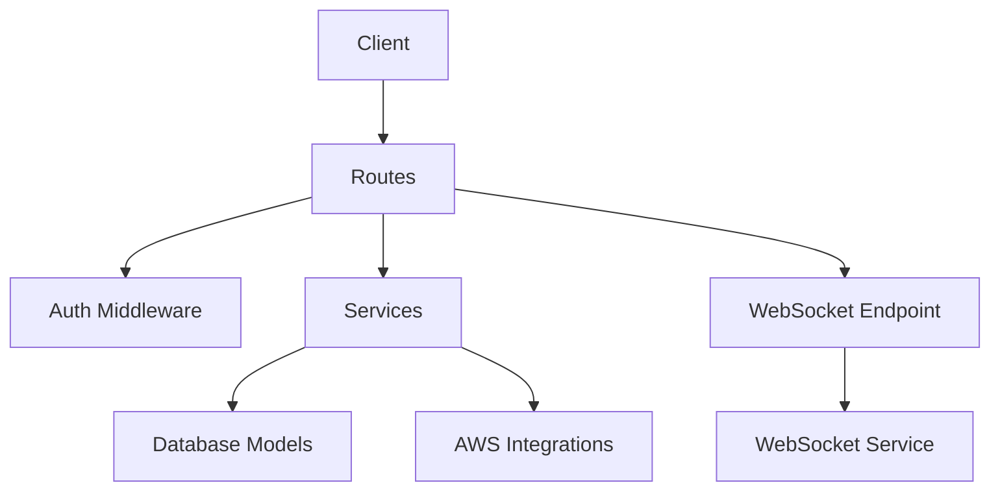
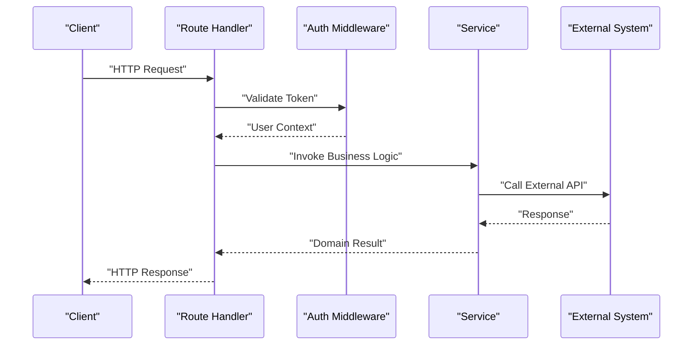
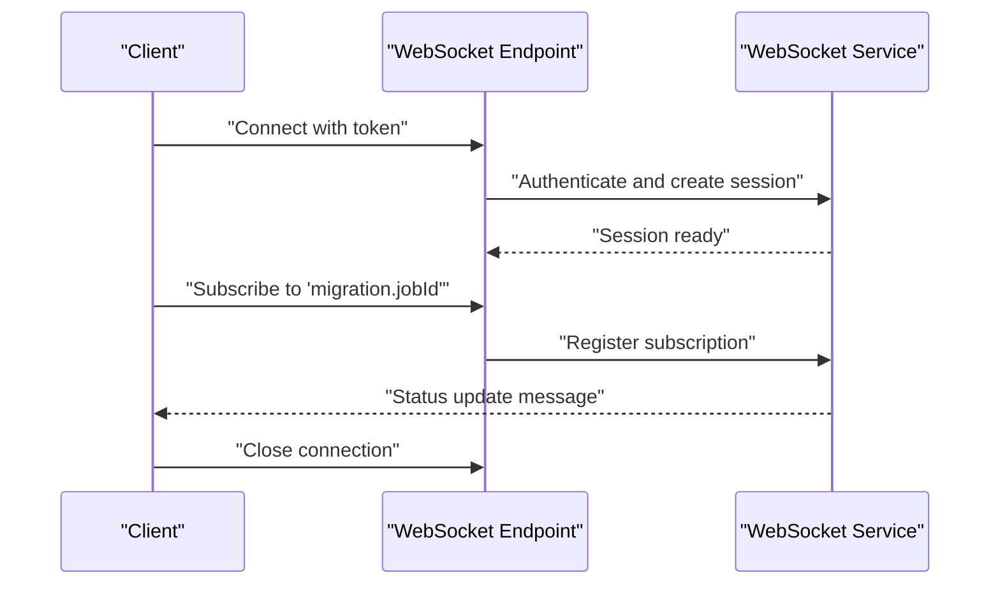
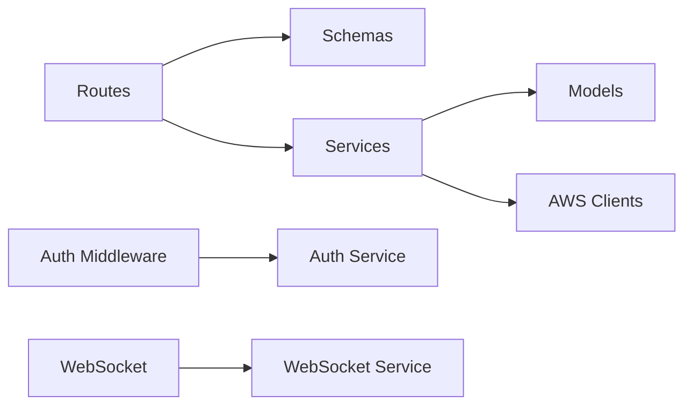

# API Reference

<cite>
**Referenced Files in This Document**
- [run.py](file://backend/run.py)
- [extensions.py](file://backend/app/extensions.py)
- [config.py](file://backend/app/config.py)
- [auth.py](file://backend/app/routes/auth.py)
- [aws_connection.py](file://backend/app/routes/aws_connection.py)
- [cdc.py](file://backend/app/routes/cdc.py)
- [database_config.py](file://backend/app/routes/database_config.py)
- [ecs.py](file://backend/app/routes/ecs.py)
- [health.py](file://backend/app/routes/health.py)
- [migration.py](file://backend/app/routes/migration.py)
- [migration_engine.py](file://backend/app/routes/migration_engine.py)
- [notification.py](file://backend/app/routes/notification.py)
- [observability.py](file://backend/app/routes/observability.py)
- [preflight.py](file://backend/app/routes/preflight.py)
- [rollback.py](file://backend/app/routes/rollback.py)
- [schema_approval.py](file://backend/app/routes/schema_approval.py)
- [schema_drift.py](file://backend/app/routes/schema_drift.py)
- [websocket.py](file://backend/app/routes/websocket.py)
- [auth_service.py](file://backend/app/services/auth_service.py)
- [aws_connection_service.py](file://backend/app/services/aws_connection_service.py)
- [cdc_service.py](file://backend/app/services/cdc_service.py)
- [cloudformation_service.py](file://backend/app/services/cloudformation_service.py)
- [database_config_service.py](file://backend/app/services/database_config_service.py)
- [ecs_service.py](file://backend/app/services/ecs_service.py)
- [migration_service.py](file://backend/app/services/migration_service.py)
- [notification_service.py](file://backend/app/services/notification_service.py)
- [observability_service.py](file://backend/app/services/observability_service.py)
- [preflight_service.py](file://backend/app/services/preflight_service.py)
- [rollback_service.py](file://backend/app/services/rollback_service.py)
- [schema_approval_service.py](file://backend/app/services/schema_approval_service.py)
- [schema_drift_service.py](file://backend/app/services/schema_drift_service.py)
- [secrets_manager_service.py](file://backend/app/services/secrets_manager_service.py)
- [websocket_service.py](file://backend/app/services/websocket_service.py)
- [auth.py](file://backend/app/middleware/auth.py)
- [errors.py](file://backend/app/errors.py)
- [auth.py](file://backend/app/exceptions/auth.py)
- [aws_connection.py](file://backend/app/exceptions/aws_connection.py)
- [cdc.py](file://backend/app/exceptions/cdc.py)
- [ecs.py](file://backend/app/exceptions/ecs.py)
- [migration.py](file://backend/app/exceptions/migration.py)
- [notification.py](file://backend/app/exceptions/notification.py)
- [observability.py](file://backend/app/exceptions/observability.py)
- [rollback.py](file://backend/app/exceptions/rollback.py)
- [schema_approval.py](file://backend/app/exceptions/schema_approval.py)
- [schema_drift.py](file://backend/app/exceptions/schema_drift.py)
- [auth.py](file://backend/app/schemas/auth.py)
- [aws_connection.py](file://backend/app/schemas/aws_connection.py)
- [cdc.py](file://backend/app/schemas/cdc.py)
- [database_config.py](file://backend/app/schemas/database_config.py)
- [ecs.py](file://backend/app/schemas/ecs.py)
- [migration.py](file://backend/app/schemas/migration.py)
- [notification.py](file://backend/app/schemas/notification.py)
- [schema_drift.py](file://backend/app/schemas/schema_drift.py)
- [secret.py](file://backend/app/schemas/secret.py)
</cite>

## Table of Contents
1. [Introduction](#introduction)
2. [Project Structure](#project-structure)
3. [Core Components](#core-components)
4. [Architecture Overview](#architecture-overview)
5. [Detailed Component Analysis](#detailed-component-analysis)
6. [Dependency Analysis](#dependency-analysis)
7. [Performance Considerations](#performance-considerations)
8. [Troubleshooting Guide](#troubleshooting-guide)
9. [Conclusion](#conclusion)
10. [Appendices](#appendices)

## Introduction
This document provides a comprehensive reference for the CloudBridge REST and WebSocket APIs exposed by the backend application. It covers HTTP endpoints, request/response schemas, authentication requirements, parameter validation, error codes, pagination patterns, bulk operations, rate limiting considerations, and real-time updates via WebSocket. It also includes client implementation guidelines, SDK usage examples, integration patterns, and guidance on API versioning and deprecation policies.

The backend is implemented as a modular Python application with route handlers, Pydantic-based schemas, service layer logic, middleware for authentication, exception handling, and a WebSocket endpoint for live events.

## Project Structure
At a high level:
- Routes define HTTP endpoints and WebSocket connections.
- Schemas define request and response models using Pydantic.
- Services encapsulate business logic and external integrations.
- Middleware enforces authentication and common cross-cutting concerns.
- Exceptions provide structured error responses.
- Extensions and configuration manage app lifecycle and settings.

[No sources needed since this diagram shows conceptual workflow, not actual code structure]

**Section sources**
- [run.py](file://backend/run.py)
- [extensions.py](file://backend/app/extensions.py)
- [config.py](file://backend/app/config.py)

## Core Components
- Authentication: JWT-based token issuance and verification through auth routes and middleware.
- Data Schemas: Pydantic models for validation and serialization across all resources.
- Services: Business logic modules that orchestrate data access and cloud integrations.
- Error Handling: Centralized exceptions mapped to consistent HTTP error responses.
- Real-time Updates: WebSocket endpoint for streaming migration and system events.

Key responsibilities:
- Route handlers validate inputs using schemas and delegate to services.
- Services interact with databases and external systems (e.g., AWS).
- Middleware protects sensitive endpoints and injects user context.
- WebSocket service manages connection lifecycle and event broadcasting.

**Section sources**
- [auth.py](file://backend/app/routes/auth.py)
- [auth.py](file://backend/app/middleware/auth.py)
- [auth.py](file://backend/app/schemas/auth.py)
- [auth_service.py](file://backend/app/services/auth_service.py)
- [errors.py](file://backend/app/errors.py)
- [websocket.py](file://backend/app/routes/websocket.py)
- [websocket_service.py](file://backend/app/services/websocket_service.py)

## Architecture Overview
The API follows a layered architecture:
- Presentation Layer: FastAPI routes and WebSocket handler.
- Validation Layer: Pydantic schemas enforce input/output contracts.
- Application Layer: Services implement domain logic and orchestration.
- Infrastructure Layer: Database models, AWS clients, and background workers.

**Diagram sources**
- [auth.py](file://backend/app/routes/auth.py)
- [auth.py](file://backend/app/middleware/auth.py)
- [auth_service.py](file://backend/app/services/auth_service.py)

## Detailed Component Analysis

### Authentication API
- Purpose: Issue tokens, refresh sessions, and verify credentials.
- Endpoints:
  - POST /api/v1/auth/login
    - Request body: credentials object defined by auth schema.
    - Response: token payload defined by auth schema.
    - Validation: required fields per schema; returns 400 for invalid payloads.
    - Errors: 401 for invalid credentials; 403 for account disabled; 429 for rate-limited login attempts.
  - POST /api/v1/auth/refresh
    - Request body: refresh token.
    - Response: new access token.
    - Validation: token format and expiry checks.
    - Errors: 401 for expired or invalid refresh token.
  - GET /api/v1/auth/me
    - Headers: Authorization Bearer token.
    - Response: current user profile.
    - Errors: 401 if unauthorized.

- Authentication Requirements:
  - Login does not require prior authentication.
  - Refresh requires a valid refresh token.
  - Protected endpoints require Authorization header with bearer token.

- Rate Limiting:
  - Login and refresh endpoints are subject to rate limits enforced at the gateway or middleware layer.

- Example Requests and Responses:
  - See [auth.py](file://backend/app/routes/auth.py) for endpoint definitions and [auth.py](file://backend/app/schemas/auth.py) for request/response structures.

**Section sources**
- [auth.py](file://backend/app/routes/auth.py)
- [auth.py](file://backend/app/schemas/auth.py)
- [auth_service.py](file://backend/app/services/auth_service.py)
- [auth.py](file://backend/app/middleware/auth.py)
- [auth.py](file://backend/app/exceptions/auth.py)

### Health Check API
- Purpose: Readiness and liveness probes.
- Endpoints:
  - GET /api/v1/health
    - Response: status object indicating health.
    - No authentication required.

**Section sources**
- [health.py](file://backend/app/routes/health.py)

### AWS Connections API
- Purpose: Manage AWS connection configurations used by other features.
- Endpoints:
  - GET /api/v1/aws-connections
    - Query params: page, page_size, sort_by, order.
    - Response: paginated list of connections.
    - Authentication: required.
  - POST /api/v1/aws-connections
    - Request body: connection schema.
    - Response: created connection.
    - Validation: required fields, credential formats.
    - Errors: 400 for invalid payload; 409 for duplicate identifiers.
  - GET /api/v1/aws-connections/{id}
    - Response: single connection details.
  - PUT /api/v1/aws-connections/{id}
    - Request body: updated fields.
    - Response: updated connection.
  - DELETE /api/v1/aws-connections/{id}
    - Response: deletion confirmation.
    - Errors: 404 if not found.

- Pagination:
  - Use query parameters page and page_size. Default values are applied when omitted.

- Bulk Operations:
  - Batch delete supported via POST /api/v1/aws-connections/batch-delete with array of IDs.

- Example Requests and Responses:
  - See [aws_connection.py](file://backend/app/routes/aws_connection.py) and [aws_connection.py](file://backend/app/schemas/aws_connection.py).

**Section sources**
- [aws_connection.py](file://backend/app/routes/aws_connection.py)
- [aws_connection.py](file://backend/app/schemas/aws_connection.py)
- [aws_connection_service.py](file://backend/app/services/aws_connection_service.py)
- [aws_connection.py](file://backend/app/exceptions/aws_connection.py)

### Database Configurations API
- Purpose: Define database connection profiles for migrations and CDC.
- Endpoints:
  - GET /api/v1/database-configs
    - Query params: page, page_size, filter by engine type.
    - Response: paginated list.
  - POST /api/v1/database-configs
    - Request body: database config schema.
    - Response: created config.
    - Validation: host, port, username, password, database name, engine-specific options.
  - GET /api/v1/database-configs/{id}
  - PUT /api/v1/database-configs/{id}
  - DELETE /api/v1/database-configs/{id}

- Security:
  - Secrets stored securely; responses omit sensitive fields unless explicitly requested.

- Example Requests and Responses:
  - See [database_config.py](file://backend/app/routes/database_config.py) and [database_config.py](file://backend/app/schemas/database_config.py).

**Section sources**
- [database_config.py](file://backend/app/routes/database_config.py)
- [database_config.py](file://backend/app/schemas/database_config.py)
- [database_config_service.py](file://backend/app/services/database_config_service.py)

### CDC (Change Data Capture) API
- Purpose: Configure and monitor CDC pipelines for source databases.
- Endpoints:
  - GET /api/v1/cdc
    - Query params: page, page_size, status filters.
    - Response: paginated CDC configs.
  - POST /api/v1/cdc
    - Request body: CDC schema including source config, target, and filters.
    - Response: created CDC pipeline.
    - Validation: source/target connectivity checks; schema constraints.
  - GET /api/v1/cdc/{id}
  - PUT /api/v1/cdc/{id}
  - DELETE /api/v1/cdc/{id}
  - POST /api/v1/cdc/{id}/start
  - POST /api/v1/cdc/{id}/stop
  - GET /api/v1/cdc/{id}/events
    - Query params: page, page_size, from_timestamp, to_timestamp.
    - Response: paginated CDC events.

- Real-time Events:
  - CDC events can be streamed via WebSocket channel cdc.{pipelineId}.

- Example Requests and Responses:
  - See [cdc.py](file://backend/app/routes/cdc.py) and [cdc.py](file://backend/app/schemas/cdc.py).

**Section sources**
- [cdc.py](file://backend/app/routes/cdc.py)
- [cdc.py](file://backend/app/schemas/cdc.py)
- [cdc_service.py](file://backend/app/services/cdc_service.py)
- [cdc.py](file://backend/app/exceptions/cdc.py)

### ECS Tasks API
- Purpose: Manage ECS task definitions and runs related to migrations.
- Endpoints:
  - GET /api/v1/ecs/tasks
    - Query params: page, page_size, cluster, family, status.
    - Response: paginated tasks.
  - POST /api/v1/ecs/tasks
    - Request body: ECS task schema.
    - Response: created task definition or run.
  - GET /api/v1/ecs/tasks/{id}
  - DELETE /api/v1/ecs/tasks/{id}

- Integration:
  - Uses ECS service to orchestrate long-running jobs.

- Example Requests and Responses:
  - See [ecs.py](file://backend/app/routes/ecs.py) and [ecs.py](file://backend/app/schemas/ecs.py).

**Section sources**
- [ecs.py](file://backend/app/routes/ecs.py)
- [ecs.py](file://backend/app/schemas/ecs.py)
- [ecs_service.py](file://backend/app/services/ecs_service.py)
- [ecs.py](file://backend/app/exceptions/ecs.py)

### Migration Engine API
- Purpose: Execute and control migration jobs.
- Endpoints:
  - POST /api/v1/migrations/engine/run
    - Request body: run parameters referencing database config and migration set.
    - Response: job id and initial status.
    - Errors: 400 for invalid parameters; 409 if conflicting run exists.
  - GET /api/v1/migrations/engine/status/{jobId}
    - Response: current status and progress.
  - POST /api/v1/migrations/engine/cancel/{jobId}
    - Response: cancellation acknowledged.

- Real-time Status:
  - Stream via WebSocket channel migration.{jobId}.

- Example Requests and Responses:
  - See [migration_engine.py](file://backend/app/routes/migration_engine.py).

**Section sources**
- [migration_engine.py](file://backend/app/routes/migration_engine.py)
- [migration_service.py](file://backend/app/services/migration_service.py)

### Migrations API
- Purpose: CRUD for migration sets and their metadata.
- Endpoints:
  - GET /api/v1/migrations
    - Query params: page, page_size, tags, status.
    - Response: paginated list.
  - POST /api/v1/migrations
    - Request body: migration schema.
    - Response: created migration.
  - GET /api/v1/migrations/{id}
  - PUT /api/v1/migrations/{id}
  - DELETE /api/v1/migrations/{id}
  - POST /api/v1/migrations/{id}/execute
    - Response: execution job id.

- Bulk Operations:
  - POST /api/v1/migrations/batch-execute with array of ids.

- Example Requests and Responses:
  - See [migration.py](file://backend/app/routes/migration.py) and [migration.py](file://backend/app/schemas/migration.py).

**Section sources**
- [migration.py](file://backend/app/routes/migration.py)
- [migration.py](file://backend/app/schemas/migration.py)
- [migration_service.py](file://backend/app/services/migration_service.py)
- [migration.py](file://backend/app/exceptions/migration.py)

### Rollback API
- Purpose: Perform rollbacks for failed or partial migrations.
- Endpoints:
  - POST /api/v1/rollbacks
    - Request body: rollback parameters (target migration, strategy).
    - Response: rollback job id.
  - GET /api/v1/rollbacks/{jobId}
    - Response: rollback status and details.

- Example Requests and Responses:
  - See [rollback.py](file://backend/app/routes/rollback.py).

**Section sources**
- [rollback.py](file://backend/app/routes/rollback.py)
- [rollback_service.py](file://backend/app/services/rollback_service.py)
- [rollback.py](file://backend/app/exceptions/rollback.py)

### Schema Approval API
- Purpose: Approve or reject schema changes before deployment.
- Endpoints:
  - GET /api/v1/schema-approvals
    - Query params: page, page_size, status.
    - Response: paginated approvals.
  - POST /api/v1/schema-approvals
    - Request body: approval request.
    - Response: created approval.
  - PUT /api/v1/schema-approvals/{id}
    - Request body: decision and comments.
    - Response: updated approval.

- Example Requests and Responses:
  - See [schema_approval.py](file://backend/app/routes/schema_approval.py).

**Section sources**
- [schema_approval.py](file://backend/app/routes/schema_approval.py)
- [schema_approval_service.py](file://backend/app/services/schema_approval_service.py)
- [schema_approval.py](file://backend/app/exceptions/schema_approval.py)

### Schema Drift API
- Purpose: Detect and report drift between expected and actual schemas.
- Endpoints:
  - GET /api/v1/schema-drift
    - Query params: page, page_size, scope filters.
    - Response: paginated drift reports.
  - POST /api/v1/schema-drift/detect
    - Request body: detection parameters.
    - Response: detection job id.
  - GET /api/v1/schema-drift/{jobId}
    - Response: drift report details.

- Example Requests and Responses:
  - See [schema_drift.py](file://backend/app/routes/schema_drift.py) and [schema_drift.py](file://backend/app/schemas/schema_drift.py).

**Section sources**
- [schema_drift.py](file://backend/app/routes/schema_drift.py)
- [schema_drift.py](file://backend/app/schemas/schema_drift.py)
- [schema_drift_service.py](file://backend/app/services/schema_drift_service.py)
- [schema_drift.py](file://backend/app/exceptions/schema_drift.py)

### Preflight Checks API
- Purpose: Validate prerequisites before running migrations or CDC.
- Endpoints:
  - POST /api/v1/preflight/check
    - Request body: preflight parameters (targets, checks).
    - Response: checklist results.
  - GET /api/v1/preflight/results/{checkId}
    - Response: detailed results.

- Example Requests and Responses:
  - See [preflight.py](file://backend/app/routes/preflight.py).

**Section sources**
- [preflight.py](file://backend/app/routes/preflight.py)
- [preflight_service.py](file://backend/app/services/preflight_service.py)

### Notifications API
- Purpose: Retrieve and manage notifications generated by system events.
- Endpoints:
  - GET /api/v1/notifications
    - Query params: page, page_size, unread_only, category.
    - Response: paginated notifications.
  - PUT /api/v1/notifications/{id}/read
    - Response: updated notification.

- Real-time Updates:
  - New notifications broadcast via WebSocket channel notifications.

- Example Requests and Responses:
  - See [notification.py](file://backend/app/routes/notification.py) and [notification.py](file://backend/app/schemas/notification.py).

**Section sources**
- [notification.py](file://backend/app/routes/notification.py)
- [notification.py](file://backend/app/schemas/notification.py)
- [notification_service.py](file://backend/app/services/notification_service.py)
- [notification.py](file://backend/app/exceptions/notification.py)

### Observability API
- Purpose: Access metrics, logs, and tracing information.
- Endpoints:
  - GET /api/v1/observability/metrics
    - Query params: metric names, time range.
    - Response: metrics payload.
  - GET /api/v1/observability/logs
    - Query params: page, page_size, level, correlation_id.
    - Response: paginated log entries.

- Example Requests and Responses:
  - See [observability.py](file://backend/app/routes/observability.py).

**Section sources**
- [observability.py](file://backend/app/routes/observability.py)
- [observability_service.py](file://backend/app/services/observability_service.py)
- [observability.py](file://backend/app/exceptions/observability.py)

### WebSocket API
- Purpose: Provide real-time updates for migrations, CDC, and notifications.
- Connection:
  - Endpoint: ws://host/api/v1/ws
  - Authentication: pass token in query parameter token or in subprotocol header depending on client library.
  - Channels:
    - migration.{jobId}: migration job status and progress.
    - cdc.{pipelineId}: CDC pipeline events.
    - notifications: global notification stream.
- Message Format:
  - JSON objects with fields: type, payload, timestamp, correlationId.
  - Types:
    - "status_update": migration/CDC status changes.
    - "event": CDC change events.
    - "notification": new notification alert.
- Connection Lifecycle:
  - Connect -> Subscribe to channels -> Receive messages -> Close gracefully.
- Reconnection Strategy:
  - Exponential backoff with jitter; resume from last known state using correlationId.

- Example Messages:
  - See [websocket.py](file://backend/app/routes/websocket.py) and [websocket_service.py](file://backend/app/services/websocket_service.py).

**Diagram sources**
- [websocket.py](file://backend/app/routes/websocket.py)
- [websocket_service.py](file://backend/app/services/websocket_service.py)

**Section sources**
- [websocket.py](file://backend/app/routes/websocket.py)
- [websocket_service.py](file://backend/app/services/websocket_service.py)

## Dependency Analysis
High-level dependencies among components:
- Routes depend on Schemas for validation and Services for logic.
- Services depend on Database Models and External Systems (AWS).
- Middleware depends on Auth Service for token verification.
- WebSocket depends on WebSocket Service for session management and event routing.

**Diagram sources**
- [auth.py](file://backend/app/routes/auth.py)
- [auth_service.py](file://backend/app/services/auth_service.py)
- [aws_connection.py](file://backend/app/routes/aws_connection.py)
- [aws_connection_service.py](file://backend/app/services/aws_connection_service.py)
- [websocket.py](file://backend/app/routes/websocket.py)
- [websocket_service.py](file://backend/app/services/websocket_service.py)

**Section sources**
- [auth.py](file://backend/app/routes/auth.py)
- [auth_service.py](file://backend/app/services/auth_service.py)
- [aws_connection.py](file://backend/app/routes/aws_connection.py)
- [aws_connection_service.py](file://backend/app/services/aws_connection_service.py)
- [websocket.py](file://backend/app/routes/websocket.py)
- [websocket_service.py](file://backend/app/services/websocket_service.py)

## Performance Considerations
- Pagination: Always use page and page_size for list endpoints to avoid large payloads.
- Filtering: Leverage query parameters to narrow results early.
- Idempotency: For write operations, include idempotency keys where supported to prevent duplicates under retries.
- Concurrency: Long-running jobs (migrations, CDC) should be polled or subscribed via WebSocket rather than polling frequently over HTTP.
- Caching: Consider caching read-only lists with appropriate TTLs at the client or gateway layer.
- Backpressure: Implement client-side retry with exponential backoff and jitter for transient errors.

[No sources needed since this section provides general guidance]

## Troubleshooting Guide
Common HTTP status codes:
- 200 OK: Successful request.
- 201 Created: Resource created successfully.
- 400 Bad Request: Invalid payload or missing required fields.
- 401 Unauthorized: Missing or invalid token.
- 403 Forbidden: Insufficient permissions.
- 404 Not Found: Resource does not exist.
- 409 Conflict: Duplicate resource or conflicting operation.
- 422 Unprocessable Entity: Validation failure.
- 429 Too Many Requests: Rate limit exceeded.
- 500 Internal Server Error: Unexpected server error.
- 503 Service Unavailable: Temporary unavailability.

Error Response Shape:
- { "error": { "code": "...", "message": "...", "details": {...} } }

Authentication Issues:
- Ensure Authorization header uses Bearer scheme.
- Verify token expiration and refresh flow.

Validation Failures:
- Review schema definitions for required fields and constraints.

Rate Limiting:
- Observe Retry-After header when receiving 429.
- Implement backoff strategies.

Real-time Issues:
- Confirm token passed to WebSocket connection.
- Check channel naming conventions and subscription acknowledgments.

**Section sources**
- [errors.py](file://backend/app/errors.py)
- [auth.py](file://backend/app/exceptions/auth.py)
- [aws_connection.py](file://backend/app/exceptions/aws_connection.py)
- [cdc.py](file://backend/app/exceptions/cdc.py)
- [ecs.py](file://backend/app/exceptions/ecs.py)
- [migration.py](file://backend/app/exceptions/migration.py)
- [notification.py](file://backend/app/exceptions/notification.py)
- [observability.py](file://backend/app/exceptions/observability.py)
- [rollback.py](file://backend/app/exceptions/rollback.py)
- [schema_approval.py](file://backend/app/exceptions/schema_approval.py)
- [schema_drift.py](file://backend/app/exceptions/schema_drift.py)

## Conclusion
CloudBridge exposes a comprehensive set of REST endpoints and a WebSocket interface to manage AWS connections, database configurations, CDC pipelines, ECS tasks, migrations, rollbacks, schema approvals, drift detection, preflight checks, notifications, and observability. The API emphasizes secure authentication, robust validation, pagination, and real-time updates. Clients should follow best practices for error handling, retries, and reconnection strategies to ensure resilient integrations.

[No sources needed since this section summarizes without analyzing specific files]

## Appendices

### API Versioning Strategy
- Base path includes version segment: /api/v1/.
- Introduce new versions by incrementing the major number when breaking changes occur.
- Maintain backward compatibility within minor versions.
- Deprecation notices are communicated via response headers and documentation updates.

### Deprecation Policy
- Deprecated endpoints return a Deprecation header and a Sunset date.
- Clients must migrate before the Sunset date.
- Changelog documents breaking changes and migration steps.

### Client Implementation Guidelines
- Use typed SDKs or generated clients based on OpenAPI/Swagger specs.
- Implement centralized error handling and logging.
- Apply pagination consistently for list endpoints.
- Use WebSocket for long-lived streams; handle reconnection with backoff.
- Store tokens securely and refresh proactively before expiry.

### SDK Usage Examples
- Initialize client with base URL and authentication token.
- Call endpoints using strongly-typed methods.
- Handle errors uniformly and surface meaningful messages to users.
- Subscribe to WebSocket channels for real-time updates.

[No sources needed since this section provides general guidance]