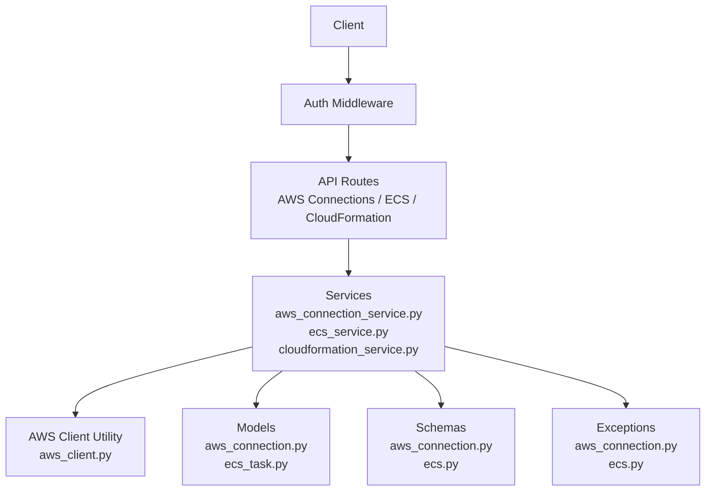
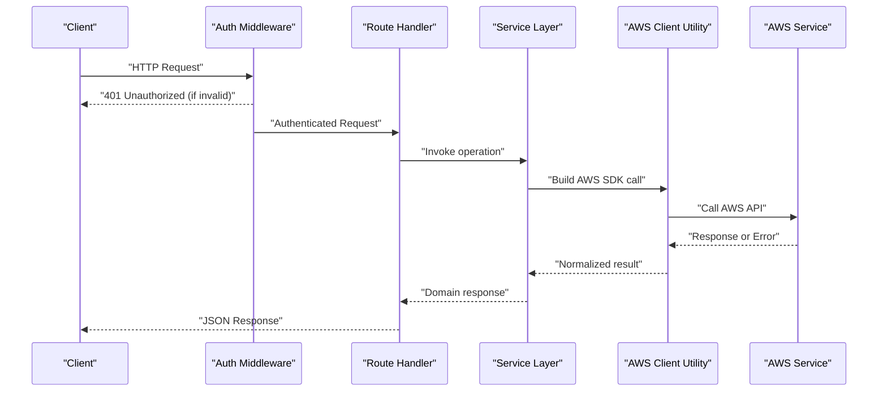
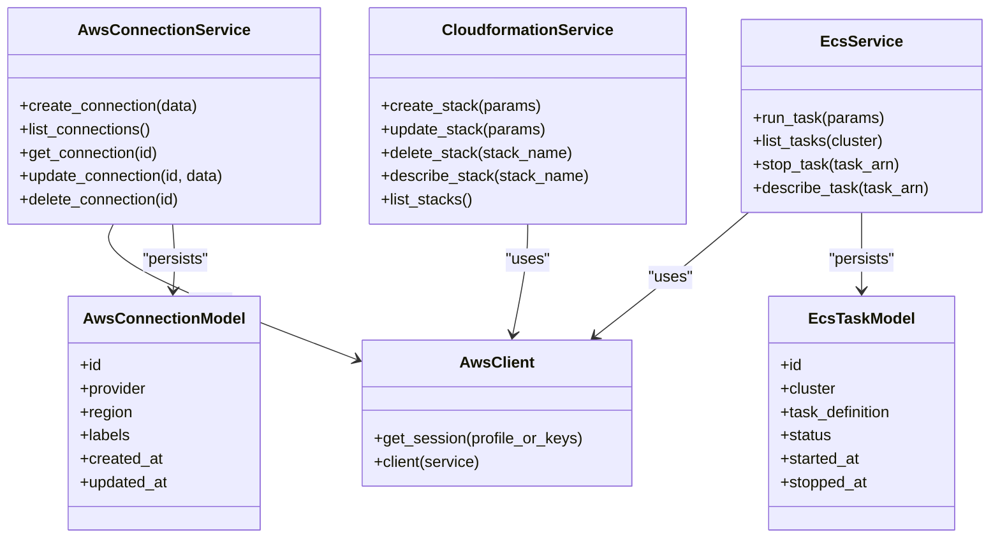

# AWS Integration API

<cite>
**Referenced Files in This Document**
- [aws_connection.py](file://backend/app/routes/aws_connection.py)
- [ecs.py](file://backend/app/routes/ecs.py)
- [cloudformation_service.py](file://backend/app/services/cloudformation_service.py)
- [ecs_service.py](file://backend/app/services/ecs_service.py)
- [aws_connection_service.py](file://backend/app/services/aws_connection_service.py)
- [aws_client.py](file://backend/app/utils/aws_client.py)
- [aws_connection.py](file://backend/app/models/aws_connection.py)
- [ecs_task.py](file://backend/app/models/ecs_task.py)
- [aws_connection.py](file://backend/app/schemas/aws_connection.py)
- [ecs.py](file://backend/app/schemas/ecs.py)
- [auth.py](file://backend/app/middleware/auth.py)
- [errors.py](file://backend/app/errors.py)
- [exceptions/aws_connection.py](file://backend/app/exceptions/aws_connection.py)
- [exceptions/ecs.py](file://backend/app/exceptions/ecs.py)
</cite>

## Table of Contents
1. [Introduction](#introduction)
2. [Project Structure](#project-structure)
3. [Core Components](#core-components)
4. [Architecture Overview](#architecture-overview)
5. [Detailed Component Analysis](#detailed-component-analysis)
6. [Dependency Analysis](#dependency-analysis)
7. [Performance Considerations](#performance-considerations)
8. [Troubleshooting Guide](#troubleshooting-guide)
9. [Conclusion](#conclusion)

## Introduction
This document provides comprehensive API documentation for the AWS integration endpoints, focusing on:
- AWS connection management (credentials and profiles)
- ECS task orchestration (run, list, stop, status)
- CloudFormation stack deployment (create, update, delete, status)

It includes request/response schemas, parameters for resource provisioning, scaling policies, monitoring setup, examples for deploying applications to ECS and managing infrastructure resources, and error handling guidance for AWS service failures and permission issues.

## Project Structure
The AWS integration is implemented across routes, services, models, schemas, utilities, and middleware:
- Routes expose HTTP endpoints for AWS connections, ECS tasks, and CloudFormation stacks.
- Services encapsulate business logic and orchestrate AWS SDK calls via a shared client utility.
- Models represent persistent entities for AWS connections and ECS tasks.
- Schemas define validated request/response payloads.
- Middleware enforces authentication before requests reach route handlers.
- Exceptions standardize error responses for AWS-related failures.

**Diagram sources**
- [aws_connection.py](file://backend/app/routes/aws_connection.py)
- [ecs.py](file://backend/app/routes/ecs.py)
- [cloudformation_service.py](file://backend/app/services/cloudformation_service.py)
- [ecs_service.py](file://backend/app/services/ecs_service.py)
- [aws_connection_service.py](file://backend/app/services/aws_connection_service.py)
- [aws_client.py](file://backend/app/utils/aws_client.py)
- [aws_connection.py](file://backend/app/models/aws_connection.py)
- [ecs_task.py](file://backend/app/models/ecs_task.py)
- [aws_connection.py](file://backend/app/schemas/aws_connection.py)
- [ecs.py](file://backend/app/schemas/ecs.py)
- [auth.py](file://backend/app/middleware/auth.py)
- [exceptions/aws_connection.py](file://backend/app/exceptions/aws_connection.py)
- [exceptions/ecs.py](file://backend/app/exceptions/ecs.py)

**Section sources**
- [aws_connection.py](file://backend/app/routes/aws_connection.py)
- [ecs.py](file://backend/app/routes/ecs.py)
- [cloudformation_service.py](file://backend/app/services/cloudformation_service.py)
- [ecs_service.py](file://backend/app/services/ecs_service.py)
- [aws_connection_service.py](file://backend/app/services/aws_connection_service.py)
- [aws_client.py](file://backend/app/utils/aws_client.py)
- [aws_connection.py](file://backend/app/models/aws_connection.py)
- [ecs_task.py](file://backend/app/models/ecs_task.py)
- [aws_connection.py](file://backend/app/schemas/aws_connection.py)
- [ecs.py](file://backend/app/schemas/ecs.py)
- [auth.py](file://backend/app/middleware/auth.py)
- [errors.py](file://backend/app/errors.py)
- [exceptions/aws_connection.py](file://backend/app/exceptions/aws_connection.py)
- [exceptions/ecs.py](file://backend/app/exceptions/ecs.py)

## Core Components
- AWS Connection Management
  - Endpoints to create, list, update, and delete AWS connections with credentials or profile references.
  - Validates and persists connection metadata; supports secret storage where applicable.
- ECS Task Orchestration
  - Endpoints to run, list, stop, and query ECS tasks; returns task lifecycle details and logs pointers.
- CloudFormation Stack Deployment
  - Endpoints to create, update, delete, and describe stacks; returns stack events and status.

Key responsibilities:
- Route handlers validate inputs using Pydantic schemas and delegate to services.
- Services coordinate AWS SDK calls through a centralized client utility.
- Models persist state for connections and tasks.
- Exceptions normalize error responses for consistent client handling.

**Section sources**
- [aws_connection.py](file://backend/app/routes/aws_connection.py)
- [ecs.py](file://backend/app/routes/ecs.py)
- [cloudformation_service.py](file://backend/app/services/cloudformation_service.py)
- [ecs_service.py](file://backend/app/services/ecs_service.py)
- [aws_connection_service.py](file://backend/app/services/aws_connection_service.py)
- [aws_client.py](file://backend/app/utils/aws_client.py)
- [aws_connection.py](file://backend/app/models/aws_connection.py)
- [ecs_task.py](file://backend/app/models/ecs_task.py)
- [aws_connection.py](file://backend/app/schemas/aws_connection.py)
- [ecs.py](file://backend/app/schemas/ecs.py)
- [auth.py](file://backend/app/middleware/auth.py)
- [errors.py](file://backend/app/errors.py)
- [exceptions/aws_connection.py](file://backend/app/exceptions/aws_connection.py)
- [exceptions/ecs.py](file://backend/app/exceptions/ecs.py)

## Architecture Overview
The API follows a layered architecture:
- Authentication middleware protects all endpoints.
- Routes parse and validate requests, then call services.
- Services implement business logic and interact with AWS via a shared client utility.
- Models store persistent data; schemas enforce payload structure.
- Exceptions translate AWS errors into standardized API responses.

**Diagram sources**
- [auth.py](file://backend/app/middleware/auth.py)
- [aws_connection.py](file://backend/app/routes/aws_connection.py)
- [ecs.py](file://backend/app/routes/ecs.py)
- [cloudformation_service.py](file://backend/app/services/cloudformation_service.py)
- [ecs_service.py](file://backend/app/services/ecs_service.py)
- [aws_connection_service.py](file://backend/app/services/aws_connection_service.py)
- [aws_client.py](file://backend/app/utils/aws_client.py)

## Detailed Component Analysis

### AWS Connection Management API
Endpoints:
- Create AWS connection
- List AWS connections
- Get AWS connection by ID
- Update AWS connection
- Delete AWS connection

Request/Response Schemas:
- AWS Credentials
  - Fields include provider type, access key identifier, secret access key, session token (optional), region, and optional profile name.
  - Validation ensures required fields per provider and secure handling of secrets.
- AWS Connection Metadata
  - Fields include unique ID, provider, region, labels/tags, created/updated timestamps, and active flag.

Parameters:
- Provider: aws_profile or aws_keys
- Region: valid AWS region string
- Profile Name: when provider is aws_profile
- Access Key ID and Secret Access Key: when provider is aws_keys
- Session Token: optional for temporary credentials

Example Requests:
- Create connection with AWS keys
  - Method: POST
  - Path: /api/aws-connections
  - Body: { "provider": "aws_keys", "region": "us-east-1", "access_key_id": "...", "secret_access_key": "..." }
- Create connection with profile
  - Method: POST
  - Path: /api/aws-connections
  - Body: { "provider": "aws_profile", "region": "eu-west-1", "profile_name": "default" }

Example Responses:
- Success: Returns connection metadata including ID and timestamps.
- Error: Returns structured error with code and message.

Error Handling:
- Invalid credentials or missing permissions return specific error codes.
- Duplicate connection identifiers are rejected.
- Network timeouts from AWS are surfaced with retry guidance.

Operational Notes:
- Secrets should be stored securely; consider integrating with a secrets manager.
- Connections can be tagged for environment scoping (dev/staging/prod).

**Section sources**
- [aws_connection.py](file://backend/app/routes/aws_connection.py)
- [aws_connection_service.py](file://backend/app/services/aws_connection_service.py)
- [aws_connection.py](file://backend/app/models/aws_connection.py)
- [aws_connection.py](file://backend/app/schemas/aws_connection.py)
- [aws_client.py](file://backend/app/utils/aws_client.py)
- [exceptions/aws_connection.py](file://backend/app/exceptions/aws_connection.py)

### ECS Task Orchestration API
Endpoints:
- Run ECS task
- List ECS tasks
- Stop ECS task
- Get ECS task status/details

Request/Response Schemas:
- ECS Task Definition Reference
  - Fields include cluster name, service name (optional), task definition family and revision, container overrides, launch type, network configuration, and tags.
- ECS Task Status
  - Fields include task ARN, status, desired status, last status reason, started at, stopped at, and log stream reference.

Parameters:
- Cluster: target ECS cluster
- Task Definition: family and revision
- Container Overrides: command, environment variables, resource limits
- Launch Type: FARGATE or EC2
- Network Configuration: subnets, security groups, assign public IP
- Tags: key-value pairs for tracking

Example Requests:
- Run task with overrides
  - Method: POST
  - Path: /api/ecs/tasks/run
  - Body: { "cluster": "prod-cluster", "task_definition": "my-app:5", "overrides": { "container_overrides": [{ "name": "app", "command": ["start"], "environment": [{ "name": "DB_HOST", "value": "db.example.com" }] }], "cpu": "256", "memory": "512" }, "launch_type": "FARGATE", "network_configuration": { "subnets": ["subnet-..."], "security_groups": ["sg-..."] }, "tags": [{ "key": "env", "value": "prod" }] }

Example Responses:
- Success: Returns task ARN and initial status.
- Error: Returns structured error with AWS error code and message.

Scaling Policies:
- Use ECS service auto-scaling policies (target tracking, step scaling) managed outside this API or via CloudFormation.
- For programmatic control, integrate with ECS service update endpoints through CloudFormation or direct AWS SDK calls orchestrated by a service layer.

Monitoring Setup:
- Enable CloudWatch Logs for containers via log drivers and log group configuration.
- Attach IAM roles to tasks for accessing CloudWatch and other AWS services.

**Section sources**
- [ecs.py](file://backend/app/routes/ecs.py)
- [ecs_service.py](file://backend/app/services/ecs_service.py)
- [ecs_task.py](file://backend/app/models/ecs_task.py)
- [ecs.py](file://backend/app/schemas/ecs.py)
- [aws_client.py](file://backend/app/utils/aws_client.py)
- [exceptions/ecs.py](file://backend/app/exceptions/ecs.py)

### CloudFormation Stack Deployment API
Endpoints:
- Create stack
- Update stack
- Delete stack
- Describe stack
- List stacks

Request/Response Schemas:
- Deployment Configuration
  - Fields include stack name, template body or URL, parameters, capabilities, tags, notification ARNs, and rollback configuration.
- Stack Status
  - Fields include stack ID, status, creation time, last updated time, and change set information if applicable.

Parameters:
- Template Source: inline template body or S3 URL
- Parameters: key-value pairs matching template parameter definitions
- Capabilities: CAPABILITY_IAM, CAPABILITY_NAMED_IAM, CAPABILITY_AUTO_EXPAND
- Tags: environment and ownership metadata
- Notification ARNs: SNS topics for stack events
- Rollback: automatic rollback on failure

Example Requests:
- Create stack from template body
  - Method: POST
  - Path: /api/cloudformation/stacks
  - Body: { "stack_name": "vpc-stack", "template_body": "{ ... }", "parameters": [{ "parameter_key": "VpcCidr", "parameter_value": "10.0.0.0/16" }], "capabilities": ["CAPABILITY_IAM"], "tags": [{ "key": "env", "value": "prod" }] }

Example Responses:
- Success: Returns stack ID and current status.
- Error: Returns structured error with AWS error code and message.

Stack Events and Monitoring:
- Retrieve stack events to diagnose failures.
- Integrate with CloudWatch and SNS for notifications.

**Section sources**
- [cloudformation_service.py](file://backend/app/services/cloudformation_service.py)
- [aws_client.py](file://backend/app/utils/aws_client.py)
- [errors.py](file://backend/app/errors.py)

### Authentication and Authorization
- All endpoints are protected by an authentication middleware that validates tokens or sessions.
- Unauthorized requests receive a 401 response.
- Role-based access control can be enforced within route handlers or services.

**Section sources**
- [auth.py](file://backend/app/middleware/auth.py)

## Dependency Analysis
The following diagram shows how components depend on each other:

**Diagram sources**
- [aws_connection_service.py](file://backend/app/services/aws_connection_service.py)
- [ecs_service.py](file://backend/app/services/ecs_service.py)
- [cloudformation_service.py](file://backend/app/services/cloudformation_service.py)
- [aws_client.py](file://backend/app/utils/aws_client.py)
- [aws_connection.py](file://backend/app/models/aws_connection.py)
- [ecs_task.py](file://backend/app/models/ecs_task.py)

**Section sources**
- [aws_connection_service.py](file://backend/app/services/aws_connection_service.py)
- [ecs_service.py](file://backend/app/services/ecs_service.py)
- [cloudformation_service.py](file://backend/app/services/cloudformation_service.py)
- [aws_client.py](file://backend/app/utils/aws_client.py)
- [aws_connection.py](file://backend/app/models/aws_connection.py)
- [ecs_task.py](file://backend/app/models/ecs_task.py)

## Performance Considerations
- Reuse AWS sessions and clients where possible to reduce overhead.
- Implement pagination for list operations (tasks, stacks) to handle large datasets efficiently.
- Cache frequently accessed connection metadata to avoid repeated lookups.
- Use asynchronous workers for long-running operations like stack deployments and ECS task runs.
- Apply rate limiting and backoff strategies when calling AWS APIs to respect quotas.

[No sources needed since this section provides general guidance]

## Troubleshooting Guide
Common Issues:
- Invalid Credentials
  - Symptoms: 401/403 responses from AWS; validation errors on connection creation.
  - Actions: Verify access key/secret or profile configuration; ensure correct region.
- Permission Denied
  - Symptoms: InsufficientPermissions errors during ECS or CloudFormation operations.
  - Actions: Attach required IAM policies to execution role or user; check resource-level permissions.
- Network Timeouts
  - Symptoms: Timeout exceptions when calling AWS APIs.
  - Actions: Check VPC endpoints, NAT gateway, and firewall rules; retry with exponential backoff.
- ECS Task Failures
  - Symptoms: Task stops with non-zero exit code or health check failures.
  - Actions: Inspect container logs; verify task definition and overrides; review resource limits.
- CloudFormation Stack Rollbacks
  - Symptoms: Stack enters ROLLBACK_FAILED or CREATE_FAILED.
  - Actions: Review stack events; fix template parameters or dependencies; use change sets for safer updates.

Error Response Format:
- Standardized error objects include code, message, and optional details such as AWS error code and request ID.

**Section sources**
- [errors.py](file://backend/app/errors.py)
- [exceptions/aws_connection.py](file://backend/app/exceptions/aws_connection.py)
- [exceptions/ecs.py](file://backend/app/exceptions/ecs.py)

## Conclusion
This API provides robust integration points for managing AWS connections, orchestrating ECS tasks, and deploying infrastructure via CloudFormation. By adhering to the documented schemas and parameters, teams can automate application deployments and infrastructure provisioning consistently. Proper error handling, monitoring, and scaling considerations ensure reliable operations at scale.

[No sources needed since this section summarizes without analyzing specific files]