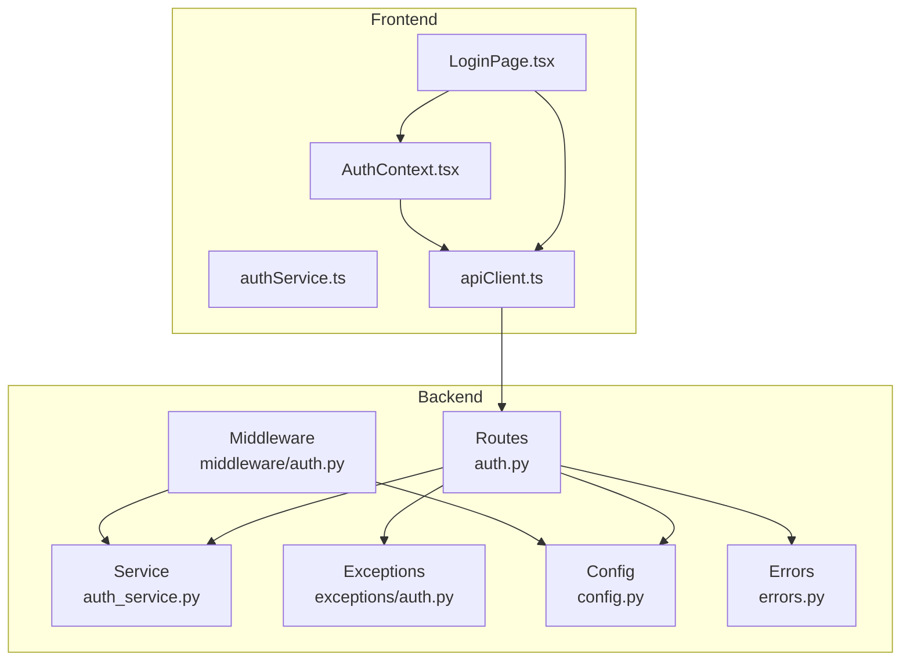
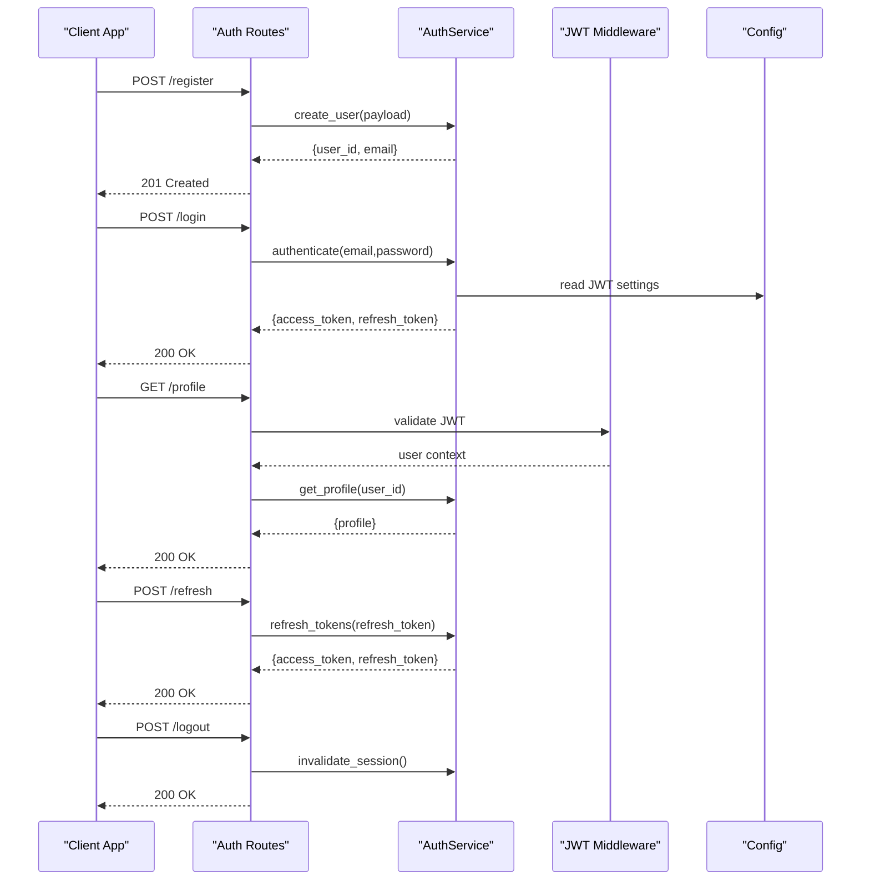
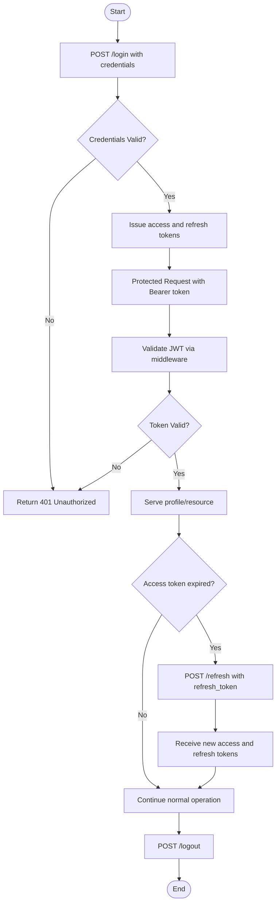
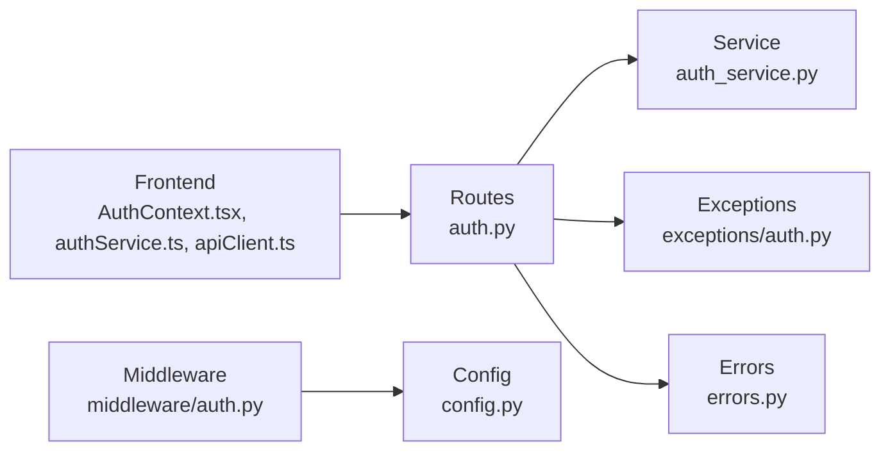

# Authentication API

<cite>
**Referenced Files in This Document**
- [auth.py](file://backend/app/routes/auth.py)
- [auth_service.py](file://backend/app/services/auth_service.py)
- [auth.py](file://backend/app/middleware/auth.py)
- [auth.py](file://backend/app/exceptions/auth.py)
- [auth.py](file://backend/app/schemas/auth.py)
- [errors.py](file://backend/app/errors.py)
- [config.py](file://backend/app/config.py)
- [AuthContext.tsx](file://frontend/src/context/AuthContext.tsx)
- [authService.ts](file://frontend/src/services/authService.ts)
- [apiClient.ts](file://frontend/src/services/apiClient.ts)
- [LoginPage.tsx](file://frontend/src/pages/LoginPage.tsx)
</cite>

## Table of Contents
1. [Introduction](#introduction)
2. [Project Structure](#project-structure)
3. [Core Components](#core-components)
4. [Architecture Overview](#architecture-overview)
5. [Detailed Component Analysis](#detailed-component-analysis)
6. [Dependency Analysis](#dependency-analysis)
7. [Performance Considerations](#performance-considerations)
8. [Troubleshooting Guide](#troubleshooting-guide)
9. [Conclusion](#conclusion)
10. [Appendices](#appendices)

## Introduction
This document provides comprehensive API documentation for CloudBridge authentication endpoints, including user registration, login, logout, and token management with JWT-based authentication. It details request/response schemas, security considerations, token expiration handling, refresh mechanisms, error codes, and best practices for secure client implementation. The goal is to enable both backend and frontend developers to implement robust, secure, and maintainable authentication flows.

## Project Structure
The authentication system spans backend routes, services, middleware, schemas, exceptions, configuration, and frontend integration points:
- Backend routes define HTTP endpoints for authentication operations.
- Services encapsulate business logic for user management, token issuance, and session handling.
- Middleware enforces authentication on protected routes.
- Schemas define validation rules for requests and responses.
- Exceptions standardize error responses.
- Configuration centralizes secrets and token settings.
- Frontend context and services manage client-side state and API calls.

**Diagram sources**
- [auth.py](file://backend/app/routes/auth.py)
- [auth_service.py](file://backend/app/services/auth_service.py)
- [auth.py](file://backend/app/middleware/auth.py)
- [auth.py](file://backend/app/exceptions/auth.py)
- [auth.py](file://backend/app/schemas/auth.py)
- [errors.py](file://backend/app/errors.py)
- [config.py](file://backend/app/config.py)
- [AuthContext.tsx](file://frontend/src/context/AuthContext.tsx)
- [authService.ts](file://frontend/src/services/authService.ts)
- [apiClient.ts](file://frontend/src/services/apiClient.ts)
- [LoginPage.tsx](file://frontend/src/pages/LoginPage.tsx)

**Section sources**
- [auth.py](file://backend/app/routes/auth.py)
- [auth_service.py](file://backend/app/services/auth_service.py)
- [auth.py](file://backend/app/middleware/auth.py)
- [auth.py](file://backend/app/exceptions/auth.py)
- [auth.py](file://backend/app/schemas/auth.py)
- [errors.py](file://backend/app/errors.py)
- [config.py](file://backend/app/config.py)
- [AuthContext.tsx](file://frontend/src/context/AuthContext.tsx)
- [authService.ts](file://frontend/src/services/authService.ts)
- [apiClient.ts](file://frontend/src/services/apiClient.ts)
- [LoginPage.tsx](file://frontend/src/pages/LoginPage.tsx)

## Core Components
- Routes: Define endpoints for register, login, logout, profile retrieval, and token refresh.
- Service: Implements user creation/validation, credential verification, token generation, and session management.
- Middleware: Validates JWT tokens and attaches authenticated user context to requests.
- Schemas: Validate input payloads and structure responses.
- Exceptions: Provide consistent error types and messages.
- Errors: Centralized error response formatting.
- Config: Holds JWT secret, token lifetimes, and other security parameters.
- Frontend Context/Services: Manage token storage, auto-refresh, and UI state.

Key responsibilities:
- Registration: Create users with validated credentials and return minimal profile data.
- Login: Authenticate credentials and issue access and refresh tokens.
- Logout: Invalidate sessions or revoke tokens as applicable.
- Profile: Retrieve current user profile using a valid JWT.
- Token Refresh: Exchange a valid refresh token for a new access token.

Security considerations:
- Use strong hashing for passwords.
- Enforce HTTPS for all endpoints.
- Store tokens securely (httpOnly cookies recommended).
- Implement token rotation and short-lived access tokens.
- Rate-limit sensitive endpoints.

**Section sources**
- [auth.py](file://backend/app/routes/auth.py)
- [auth_service.py](file://backend/app/services/auth_service.py)
- [auth.py](file://backend/app/middleware/auth.py)
- [auth.py](file://backend/app/schemas/auth.py)
- [auth.py](file://backend/app/exceptions/auth.py)
- [errors.py](file://backend/app/errors.py)
- [config.py](file://backend/app/config.py)
- [AuthContext.tsx](file://frontend/src/context/AuthContext.tsx)
- [authService.ts](file://frontend/src/services/authService.ts)
- [apiClient.ts](file://frontend/src/services/apiClient.ts)

## Architecture Overview
The authentication flow uses JWTs for stateless authorization. Access tokens are short-lived; refresh tokens extend session validity. Middleware validates tokens before allowing access to protected resources.

**Diagram sources**
- [auth.py](file://backend/app/routes/auth.py)
- [auth_service.py](file://backend/app/services/auth_service.py)
- [auth.py](file://backend/app/middleware/auth.py)
- [config.py](file://backend/app/config.py)

## Detailed Component Analysis

### Authentication Endpoints
Endpoints:
- Register: POST /register
- Login: POST /login
- Logout: POST /logout
- Profile: GET /profile
- Refresh: POST /refresh

Request/Response Schemas:
- Register Request:
  - Fields: username, email, password
  - Validation: non-empty strings, email format, password strength
- Register Response:
  - Status: 201 Created
  - Body: user_id, email
- Login Request:
  - Fields: email, password
- Login Response:
  - Status: 200 OK
  - Body: access_token, refresh_token, expires_in
- Logout Request:
  - No body required
- Logout Response:
  - Status: 200 OK
  - Body: message
- Profile Request:
  - Header: Authorization Bearer <access_token>
- Profile Response:
  - Status: 200 OK
  - Body: user_id, email, created_at
- Refresh Request:
  - Body: refresh_token
- Refresh Response:
  - Status: 200 OK
  - Body: access_token, refresh_token, expires_in

Error Responses:
- 400 Bad Request: Invalid input fields
- 401 Unauthorized: Missing or invalid token
- 403 Forbidden: Insufficient permissions
- 409 Conflict: User already exists
- 422 Unprocessable Entity: Schema validation errors
- 500 Internal Server Error: Unexpected server failure

Security Notes:
- All endpoints must be served over HTTPS.
- Tokens should be stored securely (httpOnly cookies preferred).
- Implement rate limiting on login/register.
- Enforce password complexity requirements.

**Section sources**
- [auth.py](file://backend/app/routes/auth.py)
- [auth_service.py](file://backend/app/services/auth_service.py)
- [auth.py](file://backend/app/schemas/auth.py)
- [errors.py](file://backend/app/errors.py)

### JWT Authentication Flow
Access tokens are issued upon successful login and used to access protected endpoints. Refresh tokens allow obtaining new access tokens without re-authentication.

Flow Steps:
1. Client sends login credentials to /login.
2. Server verifies credentials and issues access and refresh tokens.
3. Client includes access token in Authorization header for subsequent requests.
4. Middleware validates the token and attaches user context.
5. If access token expires, client exchanges refresh token at /refresh.
6. On logout, server invalidates session or revokes tokens.

**Diagram sources**
- [auth.py](file://backend/app/routes/auth.py)
- [auth_service.py](file://backend/app/services/auth_service.py)
- [auth.py](file://backend/app/middleware/auth.py)

**Section sources**
- [auth.py](file://backend/app/routes/auth.py)
- [auth_service.py](file://backend/app/services/auth_service.py)
- [auth.py](file://backend/app/middleware/auth.py)

### User Profiles
Profile retrieval requires a valid access token. The response includes basic user information.

Schema:
- Profile Response:
  - user_id: string
  - email: string
  - created_at: timestamp

Best Practices:
- Never expose sensitive fields (passwords, tokens).
- Include audit logging for profile access.

**Section sources**
- [auth.py](file://backend/app/routes/auth.py)
- [auth_service.py](file://backend/app/services/auth_service.py)

### Session Management
Session management involves token lifecycle control:
- Access tokens: Short-lived for security.
- Refresh tokens: Longer-lived but revocable.
- Logout: Invalidate active sessions or revoke tokens.

Implementation Notes:
- Maintain a token blacklist or session store if needed.
- Rotate refresh tokens on each use to prevent replay attacks.

**Section sources**
- [auth_service.py](file://backend/app/services/auth_service.py)
- [auth.py](file://backend/app/routes/auth.py)

### Token Management
Token management covers issuance, validation, and refresh:
- Issuance: Upon successful authentication.
- Validation: Via middleware on protected routes.
- Refresh: Exchange refresh token for new access token.

Security Considerations:
- Use strong secrets for signing tokens.
- Set appropriate expiration times.
- Implement token rotation.

**Section sources**
- [auth_service.py](file://backend/app/services/auth_service.py)
- [auth.py](file://backend/app/middleware/auth.py)
- [config.py](file://backend/app/config.py)

### Error Handling
Standardized error responses ensure consistent client behavior:
- 400 Bad Request: Malformed input
- 401 Unauthorized: Invalid or missing token
- 403 Forbidden: Insufficient permissions
- 409 Conflict: Duplicate user
- 422 Unprocessable Entity: Validation failures
- 500 Internal Server Error: Unexpected failures

Client Best Practices:
- Handle specific error codes and display user-friendly messages.
- Retry only idempotent requests.
- Log errors for debugging.

**Section sources**
- [auth.py](file://backend/app/exceptions/auth.py)
- [errors.py](file://backend/app/errors.py)

## Dependency Analysis
The authentication system has clear separation of concerns:
- Routes depend on services for business logic.
- Middleware depends on config for JWT settings.
- Frontend integrates with backend via apiClient and authService.

**Diagram sources**
- [auth.py](file://backend/app/routes/auth.py)
- [auth_service.py](file://backend/app/services/auth_service.py)
- [auth.py](file://backend/app/middleware/auth.py)
- [auth.py](file://backend/app/exceptions/auth.py)
- [errors.py](file://backend/app/errors.py)
- [config.py](file://backend/app/config.py)
- [AuthContext.tsx](file://frontend/src/context/AuthContext.tsx)
- [authService.ts](file://frontend/src/services/authService.ts)
- [apiClient.ts](file://frontend/src/services/apiClient.ts)

**Section sources**
- [auth.py](file://backend/app/routes/auth.py)
- [auth_service.py](file://backend/app/services/auth_service.py)
- [auth.py](file://backend/app/middleware/auth.py)
- [auth.py](file://backend/app/exceptions/auth.py)
- [errors.py](file://backend/app/errors.py)
- [config.py](file://backend/app/config.py)
- [AuthContext.tsx](file://frontend/src/context/AuthContext.tsx)
- [authService.ts](file://frontend/src/services/authService.ts)
- [apiClient.ts](file://frontend/src/services/apiClient.ts)

## Performance Considerations
- Use connection pooling for database operations.
- Cache frequently accessed user profiles where appropriate.
- Implement rate limiting on authentication endpoints.
- Optimize token validation by avoiding unnecessary computations.
- Monitor latency and error rates for authentication flows.

[No sources needed since this section provides general guidance]

## Troubleshooting Guide
Common Issues:
- Invalid Credentials: Verify email and password correctness.
- Token Expired: Use refresh endpoint to obtain new tokens.
- CORS Errors: Ensure proper CORS configuration for frontend-backend communication.
- Network Failures: Check connectivity and retry policies.

Debugging Tips:
- Enable detailed logging for authentication flows.
- Validate request payloads against schemas.
- Inspect middleware logs for token validation issues.

**Section sources**
- [auth.py](file://backend/app/exceptions/auth.py)
- [errors.py](file://backend/app/errors.py)

## Conclusion
CloudBridge’s authentication system provides a secure, scalable foundation for user management and session handling. By following the documented APIs, schemas, and best practices, developers can implement robust authentication flows that protect user data and ensure seamless user experiences.

[No sources needed since this section summarizes without analyzing specific files]

## Appendices

### Security Best Practices
- Enforce HTTPS across all endpoints.
- Use httpOnly cookies for token storage.
- Implement password hashing with salted algorithms.
- Apply rate limiting and CAPTCHA for login/register.
- Regularly rotate secrets and tokens.

### Example Flows
- Registration: Submit username, email, password; receive user ID and email.
- Login: Submit email and password; receive access and refresh tokens.
- Profile Access: Include access token in Authorization header; receive profile data.
- Token Refresh: Submit refresh token; receive new access and refresh tokens.
- Logout: Send logout request; server invalidates session.

[No sources needed since this section provides conceptual examples]