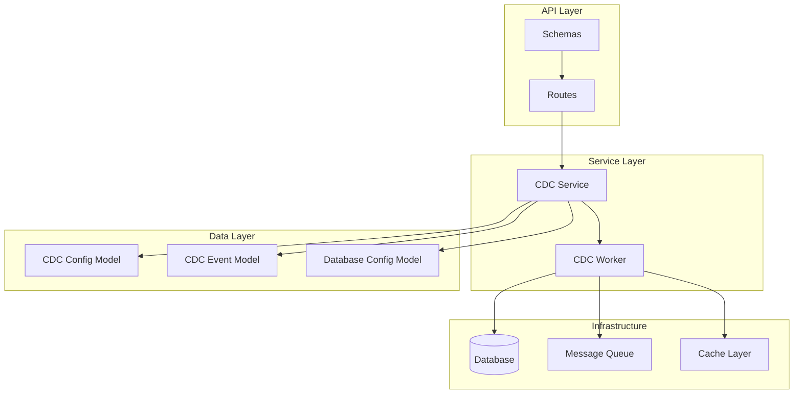
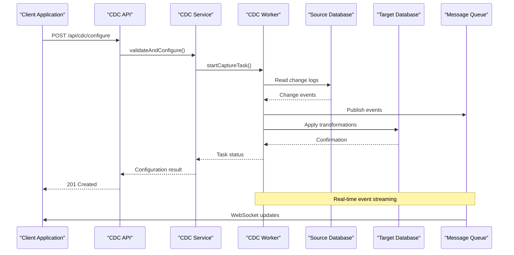
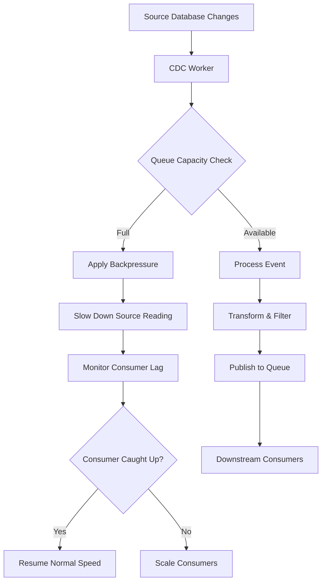
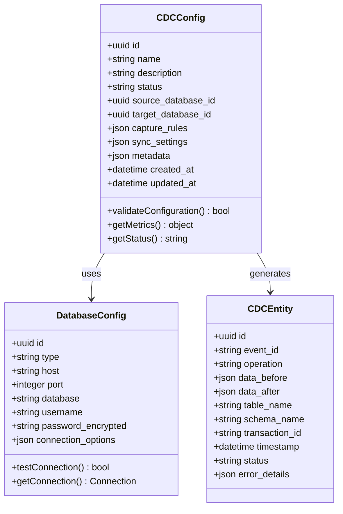
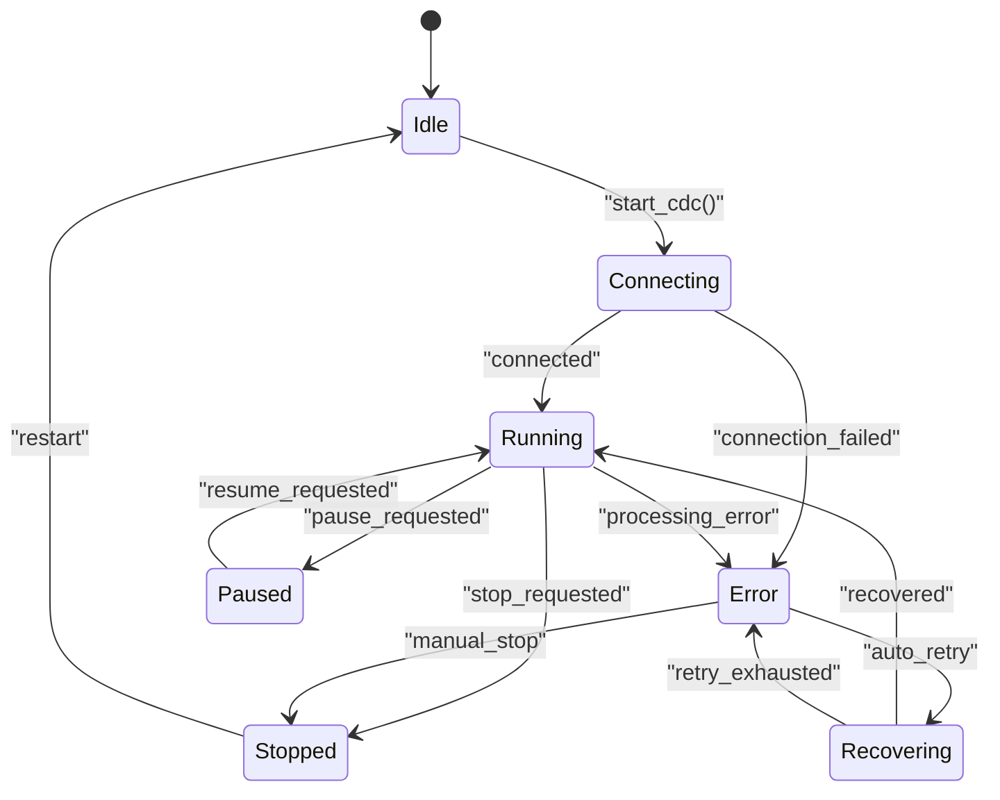

# Change Data Capture API

<cite>
**Referenced Files in This Document**
- [cdc.py](file://backend/app/routes/cdc.py)
- [cdc_service.py](file://backend/app/services/cdc_service.py)
- [cdc_config.py](file://backend/app/models/cdc_config.py)
- [cdc_event.py](file://backend/app/models/cdc_event.py)
- [cdc.py](file://backend/app/schemas/cdc.py)
- [cdc_worker.py](file://backend/app/workers/cdc_worker.py)
- [database_config.py](file://backend/app/models/database_config.py)
- [websocket.py](file://backend/app/routes/websocket.py)
</cite>

## Table of Contents
1. [Introduction](#introduction)
2. [Project Structure](#project-structure)
3. [Core Components](#core-components)
4. [Architecture Overview](#architecture-overview)
5. [API Endpoints Documentation](#api-endpoints-documentation)
6. [CDC Configuration Management](#cdc-configuration-management)
7. [Event Streaming and Real-time Sync](#event-streaming-and-real-time-sync)
8. [Data Models and Schemas](#data-models-and-schemas)
9. [Error Handling and Troubleshooting](#error-handling-and-troubleshooting)
10. [Performance Considerations](#performance-considerations)
11. [Monitoring and Observability](#monitoring-and-observability)
12. [Conclusion](#conclusion)

## Introduction

The Change Data Capture (CDC) API provides comprehensive functionality for real-time data synchronization between source and target databases. This system enables organizations to maintain data consistency across multiple systems by capturing database changes and streaming them to downstream consumers in real-time.

The CDC system supports various database engines, configurable capture rules, filtering options, and performance tuning parameters. It includes robust error handling, monitoring capabilities, and lifecycle management for CDC operations.

## Project Structure

The CDC functionality is organized following a layered architecture pattern:



**Diagram sources**
- [cdc.py](file://backend/app/routes/cdc.py)
- [cdc_service.py](file://backend/app/services/cdc_service.py)
- [cdc_config.py](file://backend/app/models/cdc_config.py)
- [cdc_event.py](file://backend/app/models/cdc_event.py)

**Section sources**
- [cdc.py](file://backend/app/routes/cdc.py)
- [cdc_service.py](file://backend/app/services/cdc_service.py)

## Core Components

### CDC Route Handler
The main entry point for all CDC-related API endpoints, providing RESTful interfaces for configuration management, event streaming, and monitoring.

### CDC Service Layer
Business logic implementation for CDC operations including validation, processing, and coordination between different components.

### CDC Worker
Background task processor responsible for executing CDC operations, managing database connections, and handling event processing.

### Data Models
- **CDC Config**: Stores CDC pipeline configurations and settings
- **CDC Event**: Represents individual change events captured from source databases
- **Database Config**: Manages connection details for source and target databases

**Section sources**
- [cdc.py](file://backend/app/routes/cdc.py)
- [cdc_service.py](file://backend/app/services/cdc_service.py)
- [cdc_config.py](file://backend/app/models/cdc_config.py)
- [cdc_event.py](file://backend/app/models/cdc_event.py)

## Architecture Overview

The CDC system follows an event-driven architecture with clear separation of concerns:



**Diagram sources**
- [cdc.py](file://backend/app/routes/cdc.py)
- [cdc_service.py](file://backend/app/services/cdc_service.py)
- [cdc_worker.py](file://backend/app/workers/cdc_worker.py)

## API Endpoints Documentation

### CDC Configuration Management

#### Create CDC Configuration
- **Endpoint**: `POST /api/cdc/config`
- **Description**: Creates a new CDC pipeline configuration
- **Authentication**: Required
- **Rate Limit**: 10 requests per minute

**Request Schema:**
```json
{
  "name": "string",
  "description": "string", 
  "source_database_id": "uuid",
  "target_database_id": "uuid",
  "capture_rules": {
    "tables": ["array"],
    "schemas": ["array"],
    "operations": ["INSERT", "UPDATE", "DELETE"],
    "filters": {}
  },
  "sync_settings": {
    "batch_size": "integer",
    "flush_interval": "integer",
    "retry_policy": "object"
  }
}
```

**Response Schema:**
```json
{
  "id": "uuid",
  "status": "created|active|paused|error",
  "created_at": "timestamp",
  "updated_at": "timestamp",
  "message": "string"
}
```

#### Update CDC Configuration
- **Endpoint**: `PUT /api/cdc/config/{config_id}`
- **Description**: Updates existing CDC configuration
- **Parameters**: config_id (path parameter)

#### Delete CDC Configuration  
- **Endpoint**: `DELETE /api/cdc/config/{config_id}`
- **Description**: Removes CDC configuration and stops associated tasks
- **Cascading**: Stops running CDC tasks

#### Get CDC Configuration
- **Endpoint**: `GET /api/cdc/config/{config_id}`
- **Description**: Retrieves specific CDC configuration details

#### List All CDC Configurations
- **Endpoint**: `GET /api/cdc/config`
- **Description**: Lists all CDC configurations with pagination support

### CDC Lifecycle Management

#### Start CDC Pipeline
- **Endpoint**: `POST /api/cdc/config/{config_id}/start`
- **Description**: Starts or resumes CDC pipeline execution
- **Async Operation**: Returns task ID for status tracking

#### Pause CDC Pipeline
- **Endpoint**: `POST /api/cdc/config/{config_id}/pause`
- **Description**: Temporarily pauses CDC pipeline without deleting configuration

#### Stop CDC Pipeline
- **Endpoint**: `POST /api/cdc/config/{config_id}/stop`
- **Description**: Stops CDC pipeline and cleans up resources

#### Reset CDC Pipeline
- **Endpoint**: `POST /api/cdc/config/{config_id}/reset`
- **Description**: Resets CDC state and restarts from beginning

### Event Streaming and Monitoring

#### Get CDC Status
- **Endpoint**: `GET /api/cdc/status/{config_id}`
- **Description**: Retrieves current status and metrics for CDC pipeline

#### Stream CDC Events
- **Endpoint**: `WS /api/cdc/stream/{config_id}`
- **Description**: WebSocket endpoint for real-time event streaming
- **Authentication**: Required
- **Reconnection**: Automatic with exponential backoff

#### Get CDC Metrics
- **Endpoint**: `GET /api/cdc/metrics/{config_id}`
- **Description**: Retrieves performance metrics and statistics

#### Get CDC Logs
- **Endpoint**: `GET /api/cdc/logs/{config_id}`
- **Description**: Retrieves execution logs with filtering options

### Error Handling and Recovery

#### Retry Failed Operations
- **Endpoint**: `POST /api/cdc/retry/{operation_id}`
- **Description**: Retries failed CDC operations

#### Get Error Details
- **Endpoint**: `GET /api/cdc/errors/{config_id}`
- **Description**: Retrieves detailed error information and recovery suggestions

**Section sources**
- [cdc.py](file://backend/app/routes/cdc.py)
- [cdc_service.py](file://backend/app/services/cdc_service.py)

## CDC Configuration Management

### Source Database Configuration

The CDC system supports multiple database types with standardized configuration schemas:

#### PostgreSQL Configuration
```json
{
  "type": "postgresql",
  "host": "string",
  "port": "integer",
  "database": "string", 
  "username": "string",
  "password": "secret_reference",
  "ssl_mode": "disable|require|verify-ca|verify-full",
  "replication_slot": "string",
  "wal_level": "logical",
  "max_connections": "integer"
}
```

#### MySQL Configuration
```json
{
  "type": "mysql",
  "host": "string",
  "port": "integer", 
  "database": "string",
  "username": "string",
  "password": "secret_reference",
  "binlog_position": "string",
  "gtid_mode": "boolean",
  "charset": "utf8mb4"
}
```

#### MongoDB Configuration
```json
{
  "type": "mongodb",
  "connection_string": "string",
  "database": "string",
  "collection_whitelist": ["array"],
  "oplog_collection": "string",
  "read_preference": "primary|secondary|nearest"
}
```

### Capture Rules and Filtering

#### Table-Level Filtering
```json
{
  "capture_rules": {
    "include_tables": ["users", "orders", "products"],
    "exclude_tables": ["logs", "temp_*"],
    "schema_patterns": ["public.*", "app_v2.*"]
  }
}
```

#### Column-Level Filtering
```json
{
  "column_filters": {
    "users": {
      "exclude_columns": ["password_hash", "ssn"],
      "include_columns": ["id", "email", "created_at"]
    }
  }
}
```

#### Row-Level Filtering
```json
{
  "row_filters": {
    "orders": "status != 'deleted' AND created_at > NOW() - INTERVAL '30 days'",
    "users": "account_type = 'premium'"
  }
}
```

### Performance Tuning Parameters

#### Batch Processing Settings
```json
{
  "sync_settings": {
    "batch_size": 1000,
    "flush_interval_ms": 1000,
    "max_retries": 3,
    "retry_delay_ms": 1000,
    "timeout_seconds": 30
  }
}
```

#### Connection Pool Configuration
```json
{
  "connection_pool": {
    "min_connections": 2,
    "max_connections": 10,
    "connection_timeout_ms": 5000,
    "idle_timeout_ms": 300000
  }
}
```

**Section sources**
- [cdc_config.py](file://backend/app/models/cdc_config.py)
- [database_config.py](file://backend/app/models/database_config.py)
- [cdc.py](file://backend/app/schemas/cdc.py)

## Event Streaming and Real-time Sync

### Event Format Specification

All CDC events follow a standardized schema for consistency across different database types:

#### Base Event Structure
```json
{
  "event_id": "uuid",
  "timestamp": "ISO8601_timestamp",
  "source": {
    "database": "string",
    "table": "string", 
    "schema": "string",
    "transaction_id": "string",
    "lsn": "string"
  },
  "operation": "INSERT|UPDATE|DELETE",
  "data": {
    "before": {},
    "after": {}
  },
  "metadata": {
    "capture_time": "timestamp",
    "processing_time_ms": "number",
    "version": "string"
  }
}
```

#### Event Types by Operation

**INSERT Event:**
```json
{
  "operation": "INSERT",
  "data": {
    "after": {
      "id": 123,
      "name": "John Doe",
      "email": "john@example.com"
    }
  }
}
```

**UPDATE Event:**
```json
{
  "operation": "UPDATE", 
  "data": {
    "before": {
      "email": "old@example.com"
    },
    "after": {
      "email": "new@example.com"
    }
  }
}
```

**DELETE Event:**
```json
{
  "operation": "DELETE",
  "data": {
    "before": {
      "id": 123,
      "name": "John Doe"
    }
  }
}
```

### WebSocket Streaming Protocol

#### Connection Establishment
```javascript
// Client-side connection example
const ws = new WebSocket('wss://api.example.com/api/cdc/stream/config-id');

ws.onopen = () => {
  console.log('Connected to CDC stream');
};

ws.onmessage = (event) => {
  const message = JSON.parse(event.data);
  handleCDCEvent(message);
};

ws.onerror = (error) => {
  console.error('WebSocket error:', error);
};

ws.onclose = () => {
  // Implement reconnection logic
  reconnectWithBackoff();
};
```

#### Message Types
- **EVENT**: Individual change events
- **HEARTBEAT**: Connection health check
- **ERROR**: Error notifications
- **STATUS**: Pipeline status updates

### Backpressure and Flow Control

The system implements automatic backpressure mechanisms:



**Diagram sources**
- [cdc_worker.py](file://backend/app/workers/cdc_worker.py)
- [websocket.py](file://backend/app/routes/websocket.py)

**Section sources**
- [cdc_event.py](file://backend/app/models/cdc_event.py)
- [websocket.py](file://backend/app/routes/websocket.py)
- [cdc_worker.py](file://backend/app/workers/cdc_worker.py)

## Data Models and Schemas

### CDC Configuration Model

The primary model for storing CDC pipeline configurations:



**Diagram sources**
- [cdc_config.py](file://backend/app/models/cdc_config.py)
- [cdc_event.py](file://backend/app/models/cdc_event.py)
- [database_config.py](file://backend/app/models/database_config.py)

### Validation Rules and Constraints

Each model includes comprehensive validation:

- **Name Uniqueness**: CDC configuration names must be unique
- **Database Connectivity**: Source and target databases must be reachable
- **Permission Validation**: Database users must have appropriate privileges
- **Schema Compatibility**: Source and target schemas must be compatible
- **Resource Limits**: Enforce maximum concurrent CDC pipelines

**Section sources**
- [cdc_config.py](file://backend/app/models/cdc_config.py)
- [cdc_event.py](file://backend/app/models/cdc_event.py)
- [database_config.py](file://backend/app/models/database_config.py)

## Error Handling and Troubleshooting

### Error Classification System

The CDC system implements a comprehensive error classification:

#### Connection Errors
- **Database unreachable**: Network connectivity issues
- **Authentication failed**: Invalid credentials or permissions
- **SSL/TLS errors**: Certificate validation failures

#### Processing Errors
- **Schema mismatch**: Source and target schema incompatibilities
- **Data transformation failures**: Type conversion or validation errors
- **Constraint violations**: Foreign key or uniqueness constraint failures

#### Resource Errors
- **Memory limits**: Insufficient memory for batch processing
- **Connection pool exhaustion**: Too many concurrent connections
- **Disk space**: Insufficient storage for logs and checkpoints

### Error Response Format

```json
{
  "error": {
    "code": "CONNECTION_FAILED",
    "message": "Unable to connect to source database",
    "details": {
      "host": "db.example.com",
      "port": 5432,
      "database": "production",
      "error_type": "timeout",
      "retry_after": 30
    },
    "recovery_suggestions": [
      "Check network connectivity",
      "Verify database credentials",
      "Ensure database server is running"
    ],
    "timestamp": "2024-01-15T10:30:00Z"
  }
}
```

### Retry and Recovery Mechanisms

The system implements intelligent retry strategies:



**Diagram sources**
- [cdc_service.py](file://backend/app/services/cdc_service.py)
- [cdc_worker.py](file://backend/app/workers/cdc_worker.py)

### Common Issues and Solutions

#### Issue: High Latency in Event Processing
**Symptoms**: Delayed event delivery, increasing consumer lag
**Causes**: 
- Large batch sizes
- Inefficient filtering queries
- Database performance bottlenecks
**Solutions**:
- Reduce batch size
- Optimize capture rules
- Add database indexes
- Scale worker instances

#### Issue: Memory Leaks in Long-running Pipelines
**Symptoms**: Increasing memory usage over time
**Causes**:
- Unclosed database connections
- Event accumulation in memory
- Inefficient data transformation
**Solutions**:
- Implement connection pooling
- Add memory monitoring
- Use streaming processing
- Regular garbage collection

#### Issue: Duplicate Event Processing
**Symptoms**: Same events processed multiple times
**Causes**:
- Worker process crashes during processing
- Network partitions
- Idempotency issues in downstream systems
**Solutions**:
- Implement exactly-once semantics
- Add deduplication logic
- Use transactional processing
- Implement checkpointing

**Section sources**
- [cdc_service.py](file://backend/app/services/cdc_service.py)
- [cdc_worker.py](file://backend/app/workers/cdc_worker.py)

## Performance Considerations

### Optimization Strategies

#### Database-Level Optimizations
- Enable logical replication for PostgreSQL
- Configure binary logging for MySQL
- Use change streams for MongoDB
- Optimize database connection pooling

#### Processing Optimizations
- Implement parallel processing for independent tables
- Use efficient serialization formats (JSON vs CSV)
- Apply compression for large payloads
- Implement lazy loading for large objects

#### Scaling Considerations
- Horizontal scaling of CDC workers
- Vertical scaling for high-throughput scenarios
- Load balancing across multiple instances
- Auto-scaling based on queue depth

### Monitoring and Metrics

Key performance indicators to monitor:

- **Throughput**: Events processed per second
- **Latency**: Time from change to delivery
- **Error Rate**: Percentage of failed operations
- **Resource Utilization**: CPU, memory, disk usage
- **Queue Depth**: Number of pending events
- **Consumer Lag**: Delay in downstream processing

**Section sources**
- [cdc_service.py](file://backend/app/services/cdc_service.py)
- [cdc_worker.py](file://backend/app/workers/cdc_worker.py)

## Monitoring and Observability

### Health Check Endpoints

#### System Health
- **Endpoint**: `GET /api/health`
- **Description**: Overall system health status
- **Response**: Includes component status and resource utilization

#### CDC Pipeline Health
- **Endpoint**: `GET /api/cdc/health/{config_id}`
- **Description**: Specific CDC pipeline health status
- **Response**: Includes connection status, processing metrics, and error counts

### Logging Strategy

The system implements structured logging with correlation IDs:

```json
{
  "timestamp": "2024-01-15T10:30:00Z",
  "level": "INFO",
  "service": "cdc-worker",
  "correlation_id": "abc-123-def-456",
  "config_id": "config-uuid",
  "message": "Processing batch of 1000 events",
  "metrics": {
    "events_processed": 1000,
    "duration_ms": 2500,
    "throughput_eps": 400
  }
}
```

### Alerting and Notifications

Built-in alerting for critical conditions:

- **Pipeline Failure**: Immediate notification on CDC pipeline failure
- **High Error Rate**: Alert when error rate exceeds threshold
- **Performance Degradation**: Warning on latency spikes
- **Resource Exhaustion**: Alert on memory/CPU/disk limits
- **Consumer Lag**: Notification when downstream consumers fall behind

**Section sources**
- [cdc_service.py](file://backend/app/services/cdc_service.py)
- [cdc_worker.py](file://backend/app/workers/cdc_worker.py)

## Conclusion

The Change Data Capture API provides a comprehensive solution for real-time data synchronization across distributed systems. With its modular architecture, robust error handling, and extensive configuration options, it enables organizations to build reliable data pipelines that maintain consistency across multiple databases and applications.

Key strengths of the system include:

- **Flexibility**: Support for multiple database types and customization options
- **Reliability**: Comprehensive error handling and recovery mechanisms  
- **Scalability**: Horizontal scaling capabilities and performance optimizations
- **Observability**: Extensive monitoring, logging, and alerting features
- **Security**: Secure credential management and connection encryption

The CDC system is designed to handle production workloads while maintaining simplicity of use through well-defined APIs and comprehensive documentation. Organizations can leverage this foundation to build sophisticated data integration solutions that meet their specific requirements for real-time data synchronization.