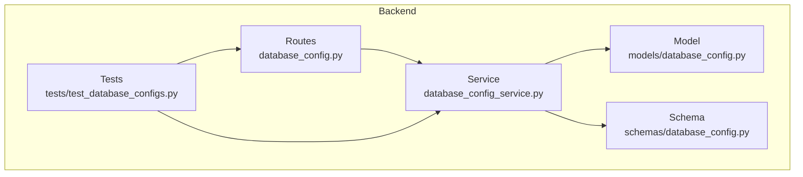
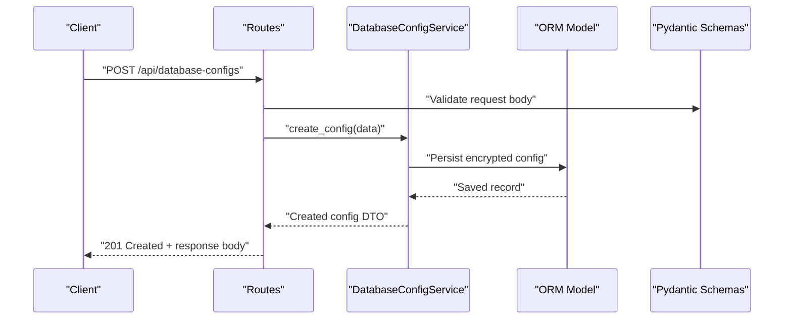
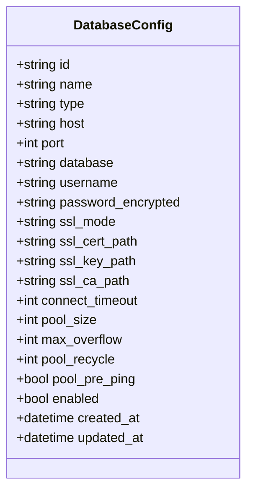
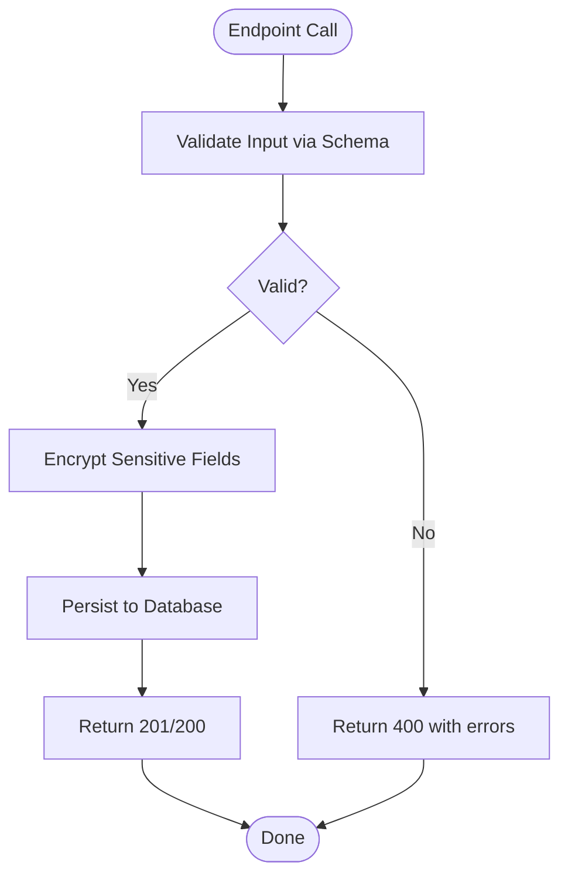
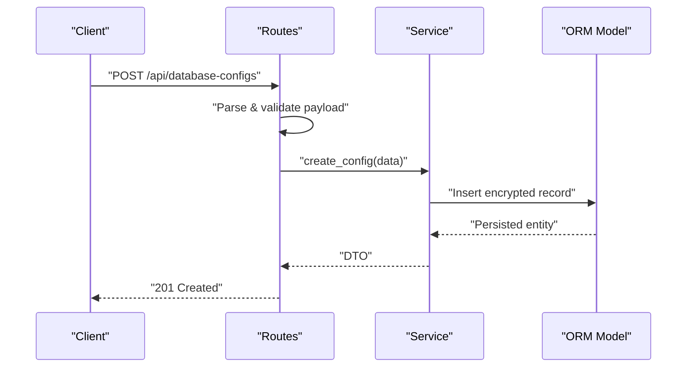
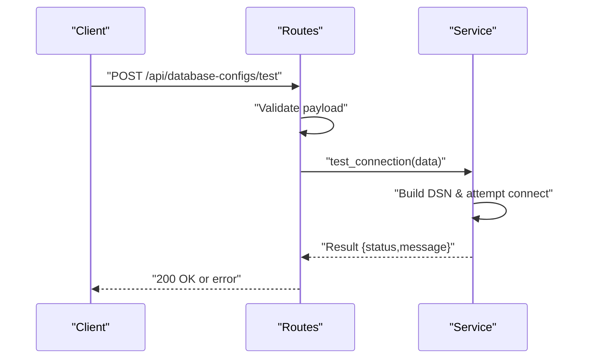
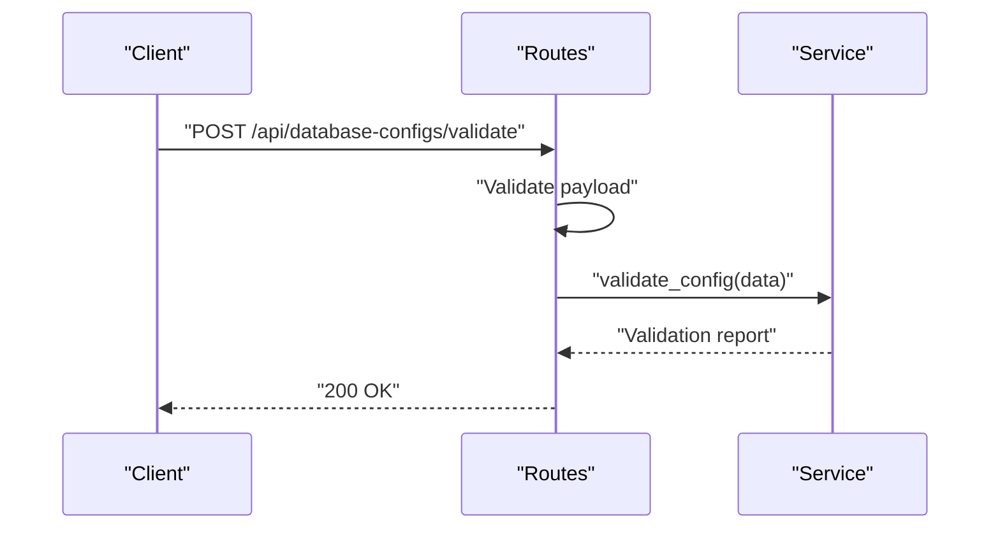
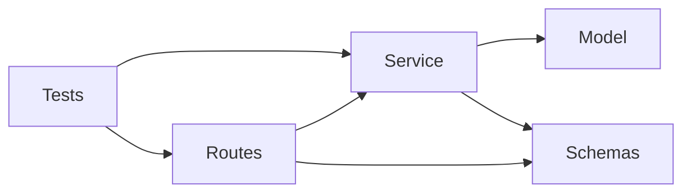

# Database Configuration API

<cite>
**Referenced Files in This Document**
- [database_config.py](file://backend/app/routes/database_config.py)
- [database_config_service.py](file://backend/app/services/database_config_service.py)
- [database_config.py](file://backend/app/models/database_config.py)
- [database_config.py](file://backend/app/schemas/database_config.py)
- [test_database_configs.py](file://backend/tests/test_database_configs.py)
</cite>

## Table of Contents
1. [Introduction](#introduction)
2. [Project Structure](#project-structure)
3. [Core Components](#core-components)
4. [Architecture Overview](#architecture-overview)
5. [Detailed Component Analysis](#detailed-component-analysis)
6. [Dependency Analysis](#dependency-analysis)
7. [Performance Considerations](#performance-considerations)
8. [Troubleshooting Guide](#troubleshooting-guide)
9. [Conclusion](#conclusion)

## Introduction
This document provides detailed API documentation for database configuration management endpoints. It covers CRUD operations for database connections, connection testing, and configuration validation. It includes request/response schemas for database connection parameters, encryption settings, and connection pooling options. It also details validation rules for different database types, security requirements, examples for configuring various backends, connectivity testing, and error handling for connection failures and credential validation.

## Project Structure
The database configuration feature is implemented across routes, services, models, schemas, and tests:
- Routes define HTTP endpoints for managing database configurations.
- Services encapsulate business logic for persistence, validation, and connectivity checks.
- Models represent the persistent data structure for database configurations.
- Schemas define Pydantic models used for request/response validation and serialization.
- Tests validate endpoint behavior and edge cases.

**Diagram sources**
- [database_config.py](file://backend/app/routes/database_config.py)
- [database_config_service.py](file://backend/app/services/database_config_service.py)
- [database_config.py](file://backend/app/models/database_config.py)
- [database_config.py](file://backend/app/schemas/database_config.py)
- [test_database_configs.py](file://backend/tests/test_database_configs.py)

**Section sources**
- [database_config.py](file://backend/app/routes/database_config.py)
- [database_config_service.py](file://backend/app/services/database_config_service.py)
- [database_config.py](file://backend/app/models/database_config.py)
- [database_config.py](file://backend/app/schemas/database_config.py)
- [test_database_configs.py](file://backend/tests/test_database_configs.py)

## Core Components
- Endpoints (routes): Provide RESTful operations to create, read, update, delete, test, and validate database configurations.
- Service layer: Implements validation, persistence, encryption handling, and connectivity testing.
- Data model: Defines the database table schema and fields for storing configuration records.
- Request/Response schemas: Define input/output structures with validation rules for all supported database types and options.
- Tests: Exercise endpoints and service methods to ensure correctness and robustness.

Key responsibilities:
- Validate inputs per database type and enforce security constraints.
- Persist encrypted credentials securely.
- Test connectivity using provided parameters without persisting changes.
- Return structured responses with clear error messages.

**Section sources**
- [database_config.py](file://backend/app/routes/database_config.py)
- [database_config_service.py](file://backend/app/services/database_config_service.py)
- [database_config.py](file://backend/app/models/database_config.py)
- [database_config.py](file://backend/app/schemas/database_config.py)
- [test_database_configs.py](file://backend/tests/test_database_configs.py)

## Architecture Overview
The API follows a layered architecture:
- Clients send HTTP requests to route handlers.
- Route handlers parse and validate payloads using Pydantic schemas.
- Handlers delegate to service methods for business logic.
- Services interact with the ORM model for persistence and perform connectivity tests.
- Responses are serialized via schemas and returned to clients.

**Diagram sources**
- [database_config.py](file://backend/app/routes/database_config.py)
- [database_config_service.py](file://backend/app/services/database_config_service.py)
- [database_config.py](file://backend/app/models/database_config.py)
- [database_config.py](file://backend/app/schemas/database_config.py)

## Detailed Component Analysis

### Endpoints Reference
Base path: /api/database-configs

- Create database configuration
  - Method: POST
  - Path: /api/database-configs
  - Description: Creates a new database configuration after validating inputs and encrypting sensitive fields.
  - Request body: See “Request Body” below.
  - Response: 201 Created with created configuration DTO.
  - Errors: 400 Validation errors, 409 Conflict if duplicate identifier exists.

- List database configurations
  - Method: GET
  - Path: /api/database-configs
  - Description: Returns a paginated list of database configurations.
  - Query params: page, page_size (optional).
  - Response: 200 OK with list DTO.

- Get database configuration by ID
  - Method: GET
  - Path: /api/database-configs/{id}
  - Description: Retrieves a single configuration by its unique identifier.
  - Response: 200 OK with configuration DTO or 404 Not Found.

- Update database configuration
  - Method: PUT
  - Path: /api/database-configs/{id}
  - Description: Updates an existing configuration; only provided fields are applied.
  - Request body: Partial configuration object.
  - Response: 200 OK with updated DTO or 404 Not Found.

- Delete database configuration
  - Method: DELETE
  - Path: /api/database-configs/{id}
  - Description: Deletes a configuration by ID.
  - Response: 204 No Content or 404 Not Found.

- Test connectivity
  - Method: POST
  - Path: /api/database-configs/test
  - Description: Validates parameters and attempts a real connection using provided values without persisting changes.
  - Request body: Same schema as create/update.
  - Response: 200 OK with test result including status and message.
  - Errors: 400 Validation errors, 5xx Connectivity errors.

- Validate configuration
  - Method: POST
  - Path: /api/database-configs/validate
  - Description: Performs server-side validation of configuration parameters without connecting to the database.
  - Request body: Same schema as create/update.
  - Response: 200 OK with validation results.
  - Errors: 400 Validation errors.

Notes:
- All endpoints require authentication and authorization as enforced by middleware.
- IDs are UUIDs.

**Section sources**
- [database_config.py](file://backend/app/routes/database_config.py)
- [test_database_configs.py](file://backend/tests/test_database_configs.py)

### Request and Response Schemas

Common fields for all database types:
- id: string (UUID) — present in responses; not required in create.
- name: string — human-readable identifier for the configuration.
- type: enum — one of postgresql, mysql, mssql, oracle, sqlite.
- host: string — required except for sqlite.
- port: integer — required except for sqlite.
- database: string — required except for sqlite.
- username: string — required except for sqlite.
- password: string — required except for sqlite; must be provided when creating/updating unless referencing a secret.
- ssl_mode: enum — disable, allow, prefer, require, verify-ca, verify-full.
- ssl_cert_path: string — optional path to client certificate file.
- ssl_key_path: string — optional path to client key file.
- ssl_ca_path: string — optional path to CA certificate file.
- connect_timeout: integer — seconds; default value applies if omitted.
- pool_size: integer — maximum number of connections in the pool.
- max_overflow: integer — additional connections allowed beyond pool_size.
- pool_recycle: integer — seconds before recycling a connection.
- pool_pre_ping: boolean — enable pre-ping health check on checkout.
- enabled: boolean — whether the configuration is active.
- created_at: timestamp — server-managed creation time.
- updated_at: timestamp — server-managed last update time.

Type-specific notes:
- sqlite: host, port, database, username, password are ignored; use a file path field if supported by implementation.
- mssql: driver may be specified via dialect parameter if supported.
- oracle: SID or service_name may be required depending on deployment.

Encryption settings:
- Passwords are stored encrypted at rest.
- Optional integration with secrets manager can be referenced via a secret_id field if supported by implementation.

Connection pooling options:
- pool_size: minimum 1; default depends on backend.
- max_overflow: non-negative integer.
- pool_recycle: positive integer; 0 disables recycling.
- pool_pre_ping: boolean; recommended true for long-lived pools.

Security requirements:
- SSL/TLS is strongly recommended for remote databases.
- ssl_mode should be set to require or higher for production.
- Credentials must not be logged; only masked values appear in logs.

Example request bodies:
- PostgreSQL:
  - {
      "name": "prod-postgres",
      "type": "postgresql",
      "host": "db.example.com",
      "port": 5432,
      "database": "appdb",
      "username": "app_user",
      "password": "secret",
      "ssl_mode": "require",
      "pool_size": 10,
      "max_overflow": 5,
      "pool_recycle": 3600,
      "pool_pre_ping": true,
      "enabled": true
    }
- MySQL:
  - {
      "name": "dev-mysql",
      "type": "mysql",
      "host": "127.0.0.1",
      "port": 3306,
      "database": "appdb",
      "username": "app_user",
      "password": "secret",
      "ssl_mode": "prefer",
      "pool_size": 8,
      "max_overflow": 2,
      "pool_recycle": 1800,
      "pool_pre_ping": false,
      "enabled": true
    }
- MSSQL:
  - {
      "name": "staging-mssql",
      "type": "mssql",
      "host": "sqlserver.local",
      "port": 1433,
      "database": "appdb",
      "username": "sa",
      "password": "secret",
      "ssl_mode": "require",
      "pool_size": 12,
      "max_overflow": 4,
      "pool_recycle": 7200,
      "pool_pre_ping": true,
      "enabled": true
    }
- Oracle:
  - {
      "name": "oracle-prod",
      "type": "oracle",
      "host": "oracle.example.com",
      "port": 1521,
      "database": "ORCL",
      "username": "app_user",
      "password": "secret",
      "ssl_mode": "verify-full",
      "pool_size": 10,
      "max_overflow": 3,
      "pool_recycle": 3600,
      "pool_pre_ping": true,
      "enabled": true
    }
- SQLite:
  - {
      "name": "local-sqlite",
      "type": "sqlite",
      "database": "/var/lib/app/data.db",
      "enabled": true
    }

Example responses:
- Success (201 Created):
  - {
      "id": "a1b2c3d4-e5f6-7890-abcd-ef1234567890",
      "name": "prod-postgres",
      "type": "postgresql",
      "host": "db.example.com",
      "port": 5432,
      "database": "appdb",
      "username": "app_user",
      "ssl_mode": "require",
      "pool_size": 10,
      "max_overflow": 5,
      "pool_recycle": 3600,
      "pool_pre_ping": true,
      "enabled": true,
      "created_at": "2025-01-01T00:00:00Z",
      "updated_at": "2025-01-01T00:00:00Z"
    }
- Error (400 Bad Request):
  - {
      "detail": "Validation failed",
      "errors": [
        {"field": "password", "message": "Required for this database type"}
      ]
    }
- Error (404 Not Found):
  - {
      "detail": "Configuration not found"
    }
- Connection test success (200 OK):
  - {
      "status": "success",
      "message": "Connection established successfully"
    }
- Connection test failure (400/5xx):
  - {
      "status": "failure",
      "message": "Authentication failed"
    }

**Section sources**
- [database_config.py](file://backend/app/schemas/database_config.py)
- [database_config_service.py](file://backend/app/services/database_config_service.py)
- [test_database_configs.py](file://backend/tests/test_database_configs.py)

### Validation Rules and Security Requirements
- Required fields depend on database type:
  - For sqlite: host, port, username, password are not required.
  - For others: host, port, database, username, password are required.
- Port must be within valid range (e.g., 1–65535).
- Pool size must be >= 1; max_overflow >= 0; pool_recycle >= 0.
- ssl_mode must be one of the allowed enums.
- If ssl_cert_path, ssl_key_path, or ssl_ca_path are provided, they must point to accessible files when tested.
- Secrets:
  - If secret_id is supported, password may be omitted and resolved from the secrets manager during test/validation.
- Duplicate names:
  - Enforce uniqueness of configuration names across the system.

Security best practices:
- Use ssl_mode=require or higher for production.
- Avoid logging passwords; mask them in any diagnostic output.
- Rotate credentials regularly and store them securely.

**Section sources**
- [database_config.py](file://backend/app/schemas/database_config.py)
- [database_config_service.py](file://backend/app/services/database_config_service.py)

### Data Model
The persistent model stores configuration records with fields aligned to the schema. It includes timestamps for auditability and flags for enabling/disabling configurations.

**Diagram sources**
- [database_config.py](file://backend/app/models/database_config.py)

**Section sources**
- [database_config.py](file://backend/app/models/database_config.py)

### Service Layer Logic
Responsibilities:
- Validate incoming requests against schema rules.
- Encrypt sensitive fields before persistence.
- Perform connectivity tests using provided parameters without altering persisted state.
- Manage lifecycle operations (CRUD) with proper error handling.

**Diagram sources**
- [database_config_service.py](file://backend/app/services/database_config_service.py)
- [database_config.py](file://backend/app/schemas/database_config.py)

**Section sources**
- [database_config_service.py](file://backend/app/services/database_config_service.py)
- [database_config.py](file://backend/app/schemas/database_config.py)

### Endpoint Sequence Diagrams

#### Create Configuration

**Diagram sources**
- [database_config.py](file://backend/app/routes/database_config.py)
- [database_config_service.py](file://backend/app/services/database_config_service.py)
- [database_config.py](file://backend/app/models/database_config.py)

#### Test Connectivity

**Diagram sources**
- [database_config.py](file://backend/app/routes/database_config.py)
- [database_config_service.py](file://backend/app/services/database_config_service.py)

#### Validate Configuration

**Diagram sources**
- [database_config.py](file://backend/app/routes/database_config.py)
- [database_config_service.py](file://backend/app/services/database_config_service.py)

## Dependency Analysis
- Routes depend on schemas for validation and on services for business logic.
- Services depend on models for persistence and on schemas for DTO mapping.
- Tests depend on routes and services to assert behavior.

**Diagram sources**
- [database_config.py](file://backend/app/routes/database_config.py)
- [database_config_service.py](file://backend/app/services/database_config_service.py)
- [database_config.py](file://backend/app/models/database_config.py)
- [database_config.py](file://backend/app/schemas/database_config.py)
- [test_database_configs.py](file://backend/tests/test_database_configs.py)

**Section sources**
- [database_config.py](file://backend/app/routes/database_config.py)
- [database_config_service.py](file://backend/app/services/database_config_service.py)
- [database_config.py](file://backend/app/models/database_config.py)
- [database_config.py](file://backend/app/schemas/database_config.py)
- [test_database_configs.py](file://backend/tests/test_database_configs.py)

## Performance Considerations
- Connection pooling:
  - Tune pool_size and max_overflow based on expected concurrency and database capacity.
  - Enable pool_pre_ping to detect stale connections early.
  - Set pool_recycle to avoid long-lived connections exceeding backend limits.
- Timeouts:
  - Configure connect_timeout appropriately to fail fast on unreachable hosts.
- Encryption overhead:
  - Ensure efficient encryption routines; consider hardware acceleration if needed.
- Pagination:
  - Use page and page_size for listing endpoints to reduce payload sizes.

[No sources needed since this section provides general guidance]

## Troubleshooting Guide
Common issues and resolutions:
- Authentication failed:
  - Verify username/password and IAM roles for managed databases.
  - Check network ACLs and firewall rules.
- SSL handshake errors:
  - Ensure correct ssl_mode and certificate paths.
  - Confirm CA trust chain and server certificate validity.
- Connection refused:
  - Validate host/port reachability and database service status.
- Pool exhaustion:
  - Increase pool_size/max_overflow; review application connection usage patterns.
- Validation errors:
  - Review required fields per database type and numeric ranges.

Operational tips:
- Use the test endpoint to validate connectivity before saving configurations.
- Mask sensitive fields in logs and monitor for unexpected exposure.
- Maintain separate configurations for dev/stage/prod environments.

**Section sources**
- [database_config_service.py](file://backend/app/services/database_config_service.py)
- [test_database_configs.py](file://backend/tests/test_database_configs.py)

## Conclusion
The Database Configuration API provides a secure, validated, and extensible way to manage database connections across multiple backends. By leveraging strong validation, encryption, and connectivity testing, teams can confidently configure and maintain database access while adhering to security best practices. Proper tuning of connection pooling and timeouts ensures reliable performance under varying workloads.

[No sources needed since this section summarizes without analyzing specific files]