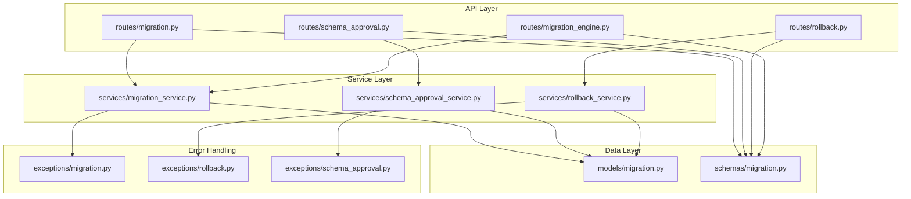
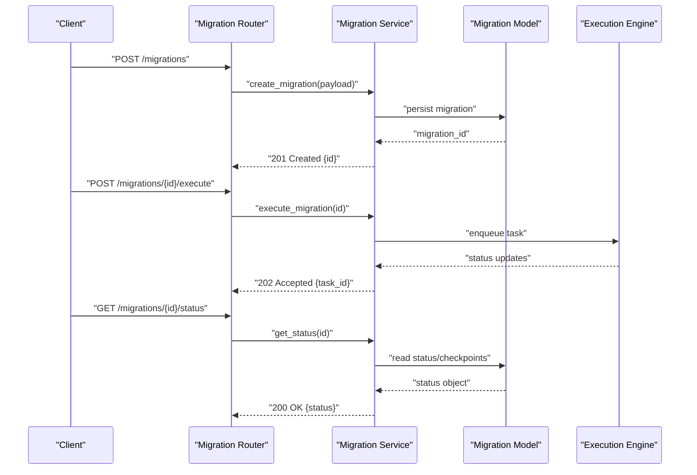
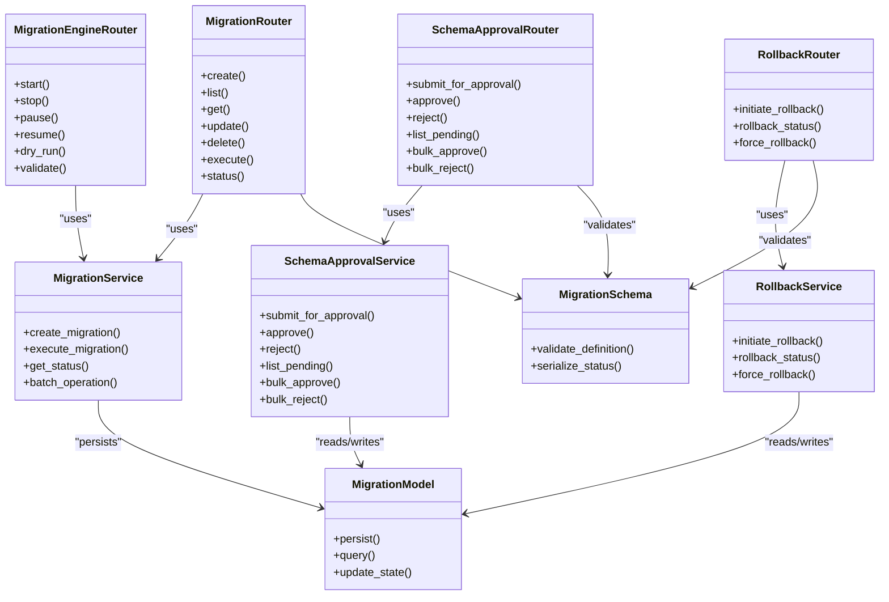

# Migration Management API

<cite>
**Referenced Files in This Document**
- [backend/app/routes/migration.py](file://backend/app/routes/migration.py)
- [backend/app/routes/schema_approval.py](file://backend/app/routes/schema_approval.py)
- [backend/app/routes/rollback.py](file://backend/app/routes/rollback.py)
- [backend/app/routes/migration_engine.py](file://backend/app/routes/migration_engine.py)
- [backend/app/schemas/migration.py](file://backend/app/schemas/migration.py)
- [backend/app/models/migration.py](file://backend/app/models/migration.py)
- [backend/app/services/migration_service.py](file://backend/app/services/migration_service.py)
- [backend/app/services/schema_approval_service.py](file://backend/app/services/schema_approval_service.py)
- [backend/app/services/rollback_service.py](file://backend/app/services/rollback_service.py)
- [backend/app/exceptions/migration.py](file://backend/app/exceptions/migration.py)
- [backend/app/exceptions/rollback.py](file://backend/app/exceptions/rollback.py)
- [backend/app/exceptions/schema_approval.py](file://backend/app/exceptions/schema_approval.py)
</cite>

## Table of Contents
1. [Introduction](#introduction)
2. [Project Structure](#project-structure)
3. [Core Components](#core-components)
4. [Architecture Overview](#architecture-overview)
5. [Detailed Component Analysis](#detailed-component-analysis)
6. [Dependency Analysis](#dependency-analysis)
7. [Performance Considerations](#performance-considerations)
8. [Troubleshooting Guide](#troubleshooting-guide)
9. [Conclusion](#conclusion)

## Introduction
This document provides comprehensive API documentation for migration management endpoints, including CRUD operations for migrations, approval workflow endpoints, rollback operations, and execution controls. It defines request/response schemas, validation rules, batch operations, lifecycle workflows (creation, review, execution, rollback), and error handling strategies for failures and conflicts.

## Project Structure
The migration management feature is implemented across routes, services, models, schemas, and exception modules:
- Routes define HTTP endpoints for migrations, approvals, rollbacks, and engine control.
- Services encapsulate business logic and orchestrate operations.
- Models represent persistent entities such as migrations and checkpoints.
- Schemas define request/response structures and validation rules.
- Exceptions standardize error responses for migration-related failures.

**Diagram sources**
- [backend/app/routes/migration.py](file://backend/app/routes/migration.py)
- [backend/app/routes/schema_approval.py](file://backend/app/routes/schema_approval.py)
- [backend/app/routes/rollback.py](file://backend/app/routes/rollback.py)
- [backend/app/routes/migration_engine.py](file://backend/app/routes/migration_engine.py)
- [backend/app/services/migration_service.py](file://backend/app/services/migration_service.py)
- [backend/app/services/schema_approval_service.py](file://backend/app/services/schema_approval_service.py)
- [backend/app/services/rollback_service.py](file://backend/app/services/rollback_service.py)
- [backend/app/models/migration.py](file://backend/app/models/migration.py)
- [backend/app/schemas/migration.py](file://backend/app/schemas/migration.py)
- [backend/app/exceptions/migration.py](file://backend/app/exceptions/migration.py)
- [backend/app/exceptions/rollback.py](file://backend/app/exceptions/rollback.py)
- [backend/app/exceptions/schema_approval.py](file://backend/app/exceptions/schema_approval.py)

**Section sources**
- [backend/app/routes/migration.py](file://backend/app/routes/migration.py)
- [backend/app/routes/schema_approval.py](file://backend/app/routes/schema_approval.py)
- [backend/app/routes/rollback.py](file://backend/app/routes/rollback.py)
- [backend/app/routes/migration_engine.py](file://backend/backend/app/routes/migration_engine.py)
- [backend/app/services/migration_service.py](file://backend/app/services/migration_service.py)
- [backend/app/services/schema_approval_service.py](file://backend/app/services/schema_approval_service.py)
- [backend/app/services/rollback_service.py](file://backend/app/services/rollback_service.py)
- [backend/app/models/migration.py](file://backend/app/models/migration.py)
- [backend/app/schemas/migration.py](file://backend/app/schemas/migration.py)
- [backend/app/exceptions/migration.py](file://backend/app/exceptions/migration.py)
- [backend/app/exceptions/rollback.py](file://backend/app/exceptions/rollback.py)
- [backend/app/exceptions/schema_approval.py](file://backend/app/exceptions/schema_approval.py)

## Core Components
- Migration CRUD endpoints: create, list, get, update, delete migrations; trigger execution; query status and logs.
- Approval workflow endpoints: submit for approval, approve/reject, list pending approvals, bulk approve/reject.
- Rollback endpoints: initiate rollback for a migration or batch, track rollback status.
- Execution control endpoints: start/stop/pause/resume, force run, dry-run/validation.

Key responsibilities:
- Route handlers validate inputs using Pydantic schemas and delegate to services.
- Services enforce business rules, manage state transitions, and coordinate with workers or external systems.
- Models persist migration definitions, statuses, checkpoints, and audit data.
- Exceptions provide consistent error payloads for client consumption.

**Section sources**
- [backend/app/routes/migration.py](file://backend/app/routes/migration.py)
- [backend/app/routes/schema_approval.py](file://backend/app/routes/schema_approval.py)
- [backend/app/routes/rollback.py](file://backend/app/routes/rollback.py)
- [backend/app/routes/migration_engine.py](file://backend/app/routes/migration_engine.py)
- [backend/app/services/migration_service.py](file://backend/app/services/migration_service.py)
- [backend/app/services/schema_approval_service.py](file://backend/app/services/schema_approval_service.py)
- [backend/app/services/rollback_service.py](file://backend/app/services/rollback_service.py)
- [backend/app/models/migration.py](file://backend/app/models/migration.py)
- [backend/app/schemas/migration.py](file://backend/app/schemas/migration.py)
- [backend/app/exceptions/migration.py](file://backend/app/exceptions/migration.py)
- [backend/app/exceptions/rollback.py](file://backend/app/exceptions/rollback.py)
- [backend/app/exceptions/schema_approval.py](file://backend/app/exceptions/schema_approval.py)

## Architecture Overview
The API follows a layered architecture:
- API layer exposes REST endpoints for clients.
- Service layer implements domain logic and orchestrates tasks.
- Data layer persists entities and manages state.
- Exception layer centralizes error handling and response formatting.

**Diagram sources**
- [backend/app/routes/migration.py](file://backend/app/routes/migration.py)
- [backend/app/services/migration_service.py](file://backend/app/services/migration_service.py)
- [backend/app/models/migration.py](file://backend/app/models/migration.py)
- [backend/app/routes/migration_engine.py](file://backend/app/routes/migration_engine.py)

## Detailed Component Analysis

### Migration CRUD Endpoints
- Create migration: validates schema, persists definition, returns created resource.
- List migrations: supports filtering by status, target database, tags, pagination.
- Get migration: returns full details including latest status and checkpoints.
- Update migration: allows editing metadata and configuration fields.
- Delete migration: removes definition if not executed or blocked by constraints.

Request/Response Schemas:
- MigrationDefinition: includes name, version, description, target_database, type, parameters, dependencies, tags, created_by, updated_at.
- MigrationStatus: includes id, current_state, progress, last_error, started_at, finished_at, checkpoints[].
- BatchOperation: includes ids[], action, options.

Validation Rules:
- Name uniqueness per target_database.
- Version format and ordering constraints.
- Required fields for specific types (e.g., SQL vs code-based).
- Parameter schema enforcement via nested Pydantic models.

Batch Operations:
- Bulk execute: submits multiple migrations for execution with concurrency limits.
- Bulk cancel: cancels pending or running tasks where allowed.
- Bulk delete: deletes unexecuted migrations in one call.

Lifecycle States:
- draft -> pending_approval -> approved -> executing -> completed | failed
- canceled, paused, rolling_back, rolled_back

Example Workflow:
- Create migration -> Submit for approval -> Approve -> Execute -> Monitor status -> Complete or handle failure.

**Section sources**
- [backend/app/routes/migration.py](file://backend/app/routes/migration.py)
- [backend/app/schemas/migration.py](file://backend/app/schemas/migration.py)
- [backend/app/models/migration.py](file://backend/app/models/migration.py)
- [backend/app/services/migration_service.py](file://backend/app/services/migration_service.py)

### Approval Workflow Endpoints
- Submit for approval: transitions migration to pending_approval.
- Approve/reject: authorized users can change state to approved or rejected.
- List pending approvals: filters by approver role and environment.
- Bulk approve/reject: applies decision to multiple migrations.

Approval State Transitions:
- pending_approval -> approved | rejected
- approved -> ready_for_execution
- rejected -> draft (editable)

Parameters:
- Approver identity and role checks enforced in service layer.
- Optional comments attached to approval decisions.

Example Workflow:
- Developer creates migration -> Submits for approval -> Reviewer approves -> System marks ready for execution.

**Section sources**
- [backend/app/routes/schema_approval.py](file://backend/app/routes/schema_approval.py)
- [backend/app/services/schema_approval_service.py](file://backend/app/services/schema_approval_service.py)
- [backend/app/exceptions/schema_approval.py](file://backend/app/exceptions/schema_approval.py)

### Rollback Endpoints
- Initiate rollback: starts rollback process for a specific migration or batch.
- Rollback status: tracks progress, checkpoints, and errors.
- Force rollback: bypasses safety checks when explicitly requested.

Rollback States:
- rolling_back -> completed | failed
- canceled on user request if supported

Safety Checks:
- Pre-flight validations before starting rollback.
- Dependency resolution to ensure safe reversal order.

Example Workflow:
- Failed migration detected -> Initiate rollback -> Monitor rollback status -> Verify restored state.

**Section sources**
- [backend/app/routes/rollback.py](file://backend/app/routes/rollback.py)
- [backend/app/services/rollback_service.py](file://backend/app/services/rollback_service.py)
- [backend/app/exceptions/rollback.py](file://backend/app/exceptions/rollback.py)

### Execution Control Endpoints
- Start execution: triggers migration run asynchronously.
- Stop/Pause/Resume: controls long-running executions.
- Dry-run/Validate: runs pre-checks without applying changes.
- Force run: executes despite warnings or minor conflicts.

Execution Controls:
- Concurrency limits and queueing policies.
- Checkpoint persistence for resumability.
- Logging and observability hooks.

Example Workflow:
- Approved migration -> Start execution -> Monitor progress -> Handle completion or failure.

**Section sources**
- [backend/app/routes/migration_engine.py](file://backend/app/routes/migration_engine.py)
- [backend/app/services/migration_service.py](file://backend/app/services/migration_service.py)

### Request/Response Schemas
- MigrationDefinition:
  - Fields: name, version, description, target_database, type, parameters, dependencies, tags, created_by, updated_at.
  - Validation: required fields, unique constraints, parameter schema enforcement.
- MigrationStatus:
  - Fields: id, current_state, progress, last_error, started_at, finished_at, checkpoints[].
  - Behavior: reflects real-time state and checkpoint history.
- BatchOperation:
  - Fields: ids[], action, options.
  - Behavior: applies action to all specified IDs with uniform options.

**Section sources**
- [backend/app/schemas/migration.py](file://backend/app/schemas/migration.py)
- [backend/app/models/migration.py](file://backend/app/models/migration.py)

### Error Handling and Conflict Resolution
Common Errors:
- ValidationError: malformed request payload or invalid parameters.
- NotFoundError: migration ID does not exist.
- ConflictError: duplicate name/version, concurrent modification.
- PermissionDeniedError: unauthorized approval or execution actions.
- ExecutionError: runtime failures during migration or rollback.
- RollbackConflictError: incompatible rollback targets or missing checkpoints.

Conflict Resolution Strategies:
- Optimistic locking on migration records to prevent concurrent edits.
- Idempotency keys for batch operations to avoid duplicates.
- Retry policies with exponential backoff for transient failures.
- Fallback states and manual intervention prompts for stuck tasks.

**Section sources**
- [backend/app/exceptions/migration.py](file://backend/app/exceptions/migration.py)
- [backend/app/exceptions/rollback.py](file://backend/app/exceptions/rollback.py)
- [backend/app/exceptions/schema_approval.py](file://backend/app/exceptions/schema_approval.py)

## Dependency Analysis
Component relationships:
- Routes depend on services for business logic.
- Services depend on models for persistence and may interact with workers/engine.
- Schemas are used by routes for input/output validation.
- Exceptions are raised by services and handled at the route layer.

**Diagram sources**
- [backend/app/routes/migration.py](file://backend/app/routes/migration.py)
- [backend/app/routes/schema_approval.py](file://backend/app/routes/schema_approval.py)
- [backend/app/routes/rollback.py](file://backend/app/routes/rollback.py)
- [backend/app/routes/migration_engine.py](file://backend/app/routes/migration_engine.py)
- [backend/app/services/migration_service.py](file://backend/app/services/migration_service.py)
- [backend/app/services/schema_approval_service.py](file://backend/app/services/schema_approval_service.py)
- [backend/app/services/rollback_service.py](file://backend/app/services/rollback_service.py)
- [backend/app/models/migration.py](file://backend/app/models/migration.py)
- [backend/app/schemas/migration.py](file://backend/app/schemas/migration.py)

**Section sources**
- [backend/app/routes/migration.py](file://backend/app/routes/migration.py)
- [backend/app/routes/schema_approval.py](file://backend/app/routes/schema_approval.py)
- [backend/app/routes/rollback.py](file://backend/app/routes/rollback.py)
- [backend/app/routes/migration_engine.py](file://backend/app/routes/migration_engine.py)
- [backend/app/services/migration_service.py](file://backend/app/services/migration_service.py)
- [backend/app/services/schema_approval_service.py](file://backend/app/services/schema_approval_service.py)
- [backend/app/services/rollback_service.py](file://backend/app/services/rollback_service.py)
- [backend/app/models/migration.py](file://backend/app/models/migration.py)
- [backend/app/schemas/migration.py](file://backend/app/schemas/migration.py)

## Performance Considerations
- Use pagination and filtering for listing migrations to reduce payload size.
- Enforce concurrency limits for batch operations to avoid resource contention.
- Persist checkpoints frequently to enable resumable executions.
- Prefer asynchronous execution for long-running tasks and expose status polling endpoints.
- Cache read-heavy queries (e.g., listing pending approvals) with appropriate invalidation.

## Troubleshooting Guide
Common Issues:
- Validation failures: check request payload against schema requirements.
- Approval denied: verify approver roles and permissions.
- Execution timeouts: inspect logs and checkpoints; consider increasing timeouts or splitting large migrations.
- Rollback conflicts: ensure target state exists and dependencies are satisfied.

Diagnostic Steps:
- Retrieve detailed status and checkpoints for the migration.
- Review error messages from exceptions for root cause.
- Validate configuration parameters and target database connectivity.
- Re-run dry-run/validate to identify issues before execution.

Recovery Actions:
- Resume paused executions if supported.
- Retry failed operations with idempotency keys.
- Manually intervene by correcting configurations and re-submitting.

**Section sources**
- [backend/app/exceptions/migration.py](file://backend/app/exceptions/migration.py)
- [backend/app/exceptions/rollback.py](file://backend/app/exceptions/rollback.py)
- [backend/app/exceptions/schema_approval.py](file://backend/app/exceptions/schema_approval.py)

## Conclusion
The Migration Management API provides robust CRUD operations, an approval workflow, rollback capabilities, and execution controls. Clear schemas and validation rules ensure reliable interactions, while comprehensive error handling and conflict resolution strategies support resilient operations. Following the documented lifecycle workflows and troubleshooting guidance will help teams manage migrations effectively and safely.