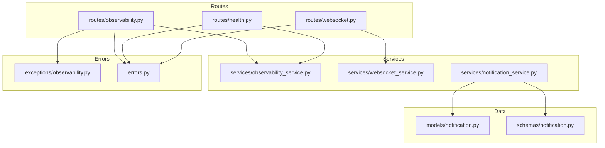
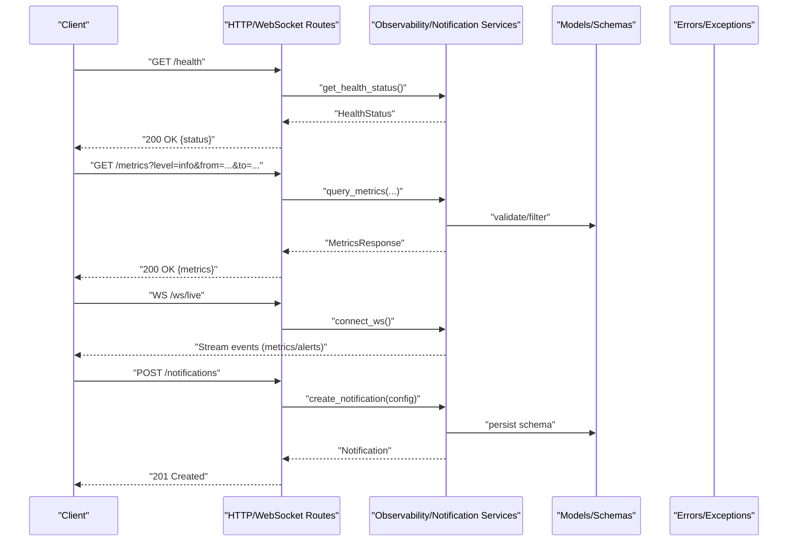
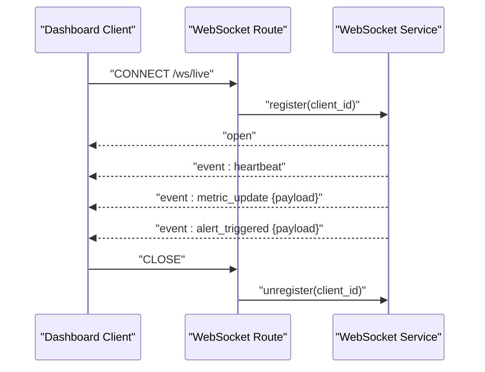
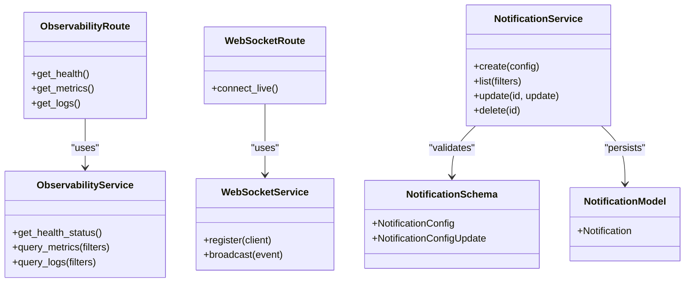

# Observability & Monitoring API

<cite>
**Referenced Files in This Document**
- [observability.py](file://backend/app/routes/observability.py)
- [health.py](file://backend/app/routes/health.py)
- [websocket.py](file://backend/app/routes/websocket.py)
- [observability_service.py](file://backend/app/services/observability_service.py)
- [websocket_service.py](file://backend/app/services/websocket_service.py)
- [notification.py](file://backend/app/models/notification.py)
- [notification_service.py](file://backend/app/services/notification_service.py)
- [notification.py](file://backend/app/schemas/notification.py)
- [exceptions/observability.py](file://backend/app/exceptions/observability.py)
- [errors.py](file://backend/app/errors.py)
</cite>

## Table of Contents
1. [Introduction](#introduction)
2. [Project Structure](#project-structure)
3. [Core Components](#core-components)
4. [Architecture Overview](#architecture-overview)
5. [Detailed Component Analysis](#detailed-component-analysis)
6. [Dependency Analysis](#dependency-analysis)
7. [Performance Considerations](#performance-considerations)
8. [Troubleshooting Guide](#troubleshooting-guide)
9. [Conclusion](#conclusion)
10. [Appendices](#appendices)

## Introduction
This document provides detailed API documentation for observability and monitoring endpoints, including health checks, metrics collection, logging access, notification management, and real-time updates via WebSocket connections. It includes request/response schemas, query parameters, examples, and diagrams to help you integrate with the system effectively.

## Project Structure
The observability and monitoring features are implemented across routes, services, models, schemas, exceptions, and error handling modules:
- Routes define HTTP endpoints and WebSocket handlers
- Services encapsulate business logic for metrics, logs, notifications, and WebSocket operations
- Models and Schemas define data structures for persistence and validation
- Exceptions and errors provide consistent error responses

**Diagram sources**
- [observability.py](file://backend/app/routes/observability.py)
- [health.py](file://backend/app/routes/health.py)
- [websocket.py](file://backend/app/routes/websocket.py)
- [observability_service.py](file://backend/app/services/observability_service.py)
- [websocket_service.py](file://backend/app/services/websocket_service.py)
- [notification_service.py](file://backend/app/services/notification_service.py)
- [notification.py](file://backend/app/models/notification.py)
- [notification.py](file://backend/app/schemas/notification.py)
- [exceptions/observability.py](file://backend/app/exceptions/observability.py)
- [errors.py](file://backend/app/errors.py)

**Section sources**
- [observability.py](file://backend/app/routes/observability.py)
- [health.py](file://backend/app/routes/health.py)
- [websocket.py](file://backend/app/routes/websocket.py)
- [observability_service.py](file://backend/app/services/observability_service.py)
- [websocket_service.py](file://backend/app/services/websocket_service.py)
- [notification_service.py](file://backend/app/services/notification_service.py)
- [notification.py](file://backend/app/models/notification.py)
- [notification.py](file://backend/app/schemas/notification.py)
- [exceptions/observability.py](file://backend/app/exceptions/observability.py)
- [errors.py](file://backend/app/errors.py)

## Core Components
- Health Check Endpoint: Provides system readiness and liveness status.
- Metrics Collection: Exposes performance metrics with filtering and aggregation options.
- Logging Access: Retrieves application logs with filters such as level, time range, and keyword search.
- Notification Management: CRUD operations for alert configurations and delivery settings.
- Real-Time Updates: WebSocket endpoint for live streaming of metrics and alerts.

Key responsibilities:
- Route layer validates requests and delegates to services
- Service layer orchestrates data retrieval, transformations, and external integrations
- Schemas enforce input/output contracts
- Exceptions and errors standardize failure responses

**Section sources**
- [observability.py](file://backend/app/routes/observability.py)
- [health.py](file://backend/app/routes/health.py)
- [websocket.py](file://backend/app/routes/websocket.py)
- [observability_service.py](file://backend/app/services/observability_service.py)
- [websocket_service.py](file://backend/app/services/websocket_service.py)
- [notification_service.py](file://backend/app/services/notification_service.py)
- [notification.py](file://backend/app/schemas/notification.py)
- [exceptions/observability.py](file://backend/app/exceptions/observability.py)
- [errors.py](file://backend/app/errors.py)

## Architecture Overview
The observability stack follows a layered architecture:
- HTTP/WebSocket routes handle client requests
- Services implement domain logic and orchestrate data access
- Models/Schemas define structured data contracts
- Errors/Exceptions ensure consistent error semantics

**Diagram sources**
- [observability.py](file://backend/app/routes/observability.py)
- [health.py](file://backend/app/routes/health.py)
- [websocket.py](file://backend/app/routes/websocket.py)
- [observability_service.py](file://backend/app/services/observability_service.py)
- [websocket_service.py](file://backend/app/services/websocket_service.py)
- [notification_service.py](file://backend/app/services/notification_service.py)
- [notification.py](file://backend/app/models/notification.py)
- [notification.py](file://backend/app/schemas/notification.py)
- [errors.py](file://backend/app/errors.py)

## Detailed Component Analysis

### Health Check Endpoints
Purpose:
- Provide liveness/readiness signals for orchestrators and dashboards.

Endpoints:
- GET /health
  - Response: System health status object containing overall status and component details.

Request/Response Schema:
- HealthStatus
  - status: string (e.g., "healthy", "degraded", "unhealthy")
  - components: array of component objects
    - name: string
    - status: string
    - details: object (optional)

Example:
- Request: GET /health
- Response: 200 OK
  - {
      "status": "healthy",
      "components": [
        {"name": "database", "status": "healthy"},
        {"name": "cache", "status": "healthy"}
      ]
    }

Notes:
- Use this endpoint for liveness probes and readiness checks.
- Integrate with load balancers and container orchestrators.

**Section sources**
- [health.py](file://backend/app/routes/health.py)
- [observability_service.py](file://backend/app/services/observability_service.py)
- [errors.py](file://backend/app/errors.py)

### Metrics Collection
Purpose:
- Retrieve performance metrics with filtering by level, time range, and aggregation options.

Endpoints:
- GET /metrics
  - Query Parameters:
    - level: string (e.g., "info", "warn", "error")
    - from: string (ISO 8601 timestamp)
    - to: string (ISO 8601 timestamp)
    - group_by: string (e.g., "source", "component")
    - agg: string (e.g., "count", "avg", "sum")
    - limit: integer (max records)
    - offset: integer (pagination)

Request/Response Schema:
- MetricsQuery
  - level: string (optional)
  - from: string (optional)
  - to: string (optional)
  - group_by: string (optional)
  - agg: string (optional)
  - limit: integer (optional)
  - offset: integer (optional)

- MetricPoint
  - timestamp: string (ISO 8601)
  - source: string
  - value: number
  - labels: object (key-value pairs)

- MetricsResponse
  - items: array of MetricPoint
  - total: integer
  - page_info: object (limit, offset)

Examples:
- Request: GET /metrics?level=error&from=2025-01-01T00:00:00Z&to=2025-01-01T23:59:59Z&group_by=source&agg=count&limit=50
- Response: 200 OK
  - {
      "items": [
        {"timestamp": "2025-01-01T12:34:56Z", "source": "api", "value": 12, "labels": {"component": "auth"}}
      ],
      "total": 120,
      "page_info": {"limit": 50, "offset": 0}
    }

Notes:
- Time ranges must be valid ISO 8601 strings.
- Aggregation supports count, average, and sum; defaults may apply if not provided.
- Pagination is supported via limit and offset.

**Section sources**
- [observability.py](file://backend/app/routes/observability.py)
- [observability_service.py](file://backend/app/services/observability_service.py)
- [errors.py](file://backend/app/errors.py)

### Logging Access
Purpose:
- Retrieve application logs with filters for severity, time range, and keywords.

Endpoints:
- GET /logs
  - Query Parameters:
    - level: string (e.g., "debug", "info", "warn", "error")
    - from: string (ISO 8601 timestamp)
    - to: string (ISO 8601 timestamp)
    - keyword: string (substring match)
    - source: string (filter by log source/component)
    - limit: integer
    - offset: integer

Request/Response Schema:
- LogEntry
  - timestamp: string (ISO 8601)
  - level: string
  - message: string
  - source: string
  - metadata: object (optional)

- LogsResponse
  - items: array of LogEntry
  - total: integer
  - page_info: object (limit, offset)

Examples:
- Request: GET /logs?level=error&from=2025-01-01T00:00:00Z&to=2025-01-01T23:59:59Z&keyword="timeout"&limit=100
- Response: 200 OK
  - {
      "items": [
        {"timestamp": "2025-01-01T12:34:56Z", "level": "error", "message": "Connection timeout", "source": "db_client"}
      ],
      "total": 42,
      "page_info": {"limit": 100, "offset": 0}
    }

Notes:
- Keyword matching is case-insensitive by default.
- Use pagination for large result sets.

**Section sources**
- [observability.py](file://backend/app/routes/observability.py)
- [observability_service.py](file://backend/app/services/observability_service.py)
- [errors.py](file://backend/app/errors.py)

### Notification Management
Purpose:
- Manage alert configurations and notification channels.

Endpoints:
- POST /notifications
  - Body: NotificationConfig
  - Response: Created notification resource

- GET /notifications
  - Query Parameters:
    - enabled: boolean (filter by active state)
    - type: string (e.g., "email", "webhook")
    - limit: integer
    - offset: integer
  - Response: Paginated list of notifications

- PUT /notifications/{id}
  - Body: NotificationConfigUpdate
  - Response: Updated notification resource

- DELETE /notifications/{id}
  - Response: 204 No Content

Request/Response Schemas:
- NotificationConfig
  - id: string (UUID)
  - name: string
  - type: string ("email", "webhook", etc.)
  - enabled: boolean
  - config: object (channel-specific settings)
  - created_at: string (ISO 8601)
  - updated_at: string (ISO 8601)

- NotificationConfigUpdate
  - name: string (optional)
  - type: string (optional)
  - enabled: boolean (optional)
  - config: object (optional)

- NotificationsList
  - items: array of NotificationConfig
  - total: integer
  - page_info: object (limit, offset)

Examples:
- Create:
  - Request: POST /notifications
    - {
        "name": "DB Alerts",
        "type": "webhook",
        "enabled": true,
        "config": {"url": "https://hooks.example.com/alerts"}
      }
  - Response: 201 Created
    - {
        "id": "a1b2c3d4-e5f6-7890-abcd-ef1234567890",
        "name": "DB Alerts",
        "type": "webhook",
        "enabled": true,
        "config": {"url": "https://hooks.example.com/alerts"},
        "created_at": "2025-01-01T12:00:00Z",
        "updated_at": "2025-01-01T12:00:00Z"
      }

- List:
  - Request: GET /notifications?type=email&enabled=true&limit=20
  - Response: 200 OK
    - {
        "items": [...],
        "total": 5,
        "page_info": {"limit": 20, "offset": 0}
      }

Notes:
- Validation errors return 422 Unprocessable Entity with field-level messages.
- Not found returns 404 Not Found for invalid IDs.

**Section sources**
- [notification.py](file://backend/app/schemas/notification.py)
- [notification.py](file://backend/app/models/notification.py)
- [notification_service.py](file://backend/app/services/notification_service.py)
- [observability.py](file://backend/app/routes/observability.py)
- [errors.py](file://backend/app/errors.py)

### Real-Time Updates via WebSocket
Purpose:
- Stream live metrics and alert events to clients for dashboards.

Endpoint:
- WS /ws/live
  - Authentication: Depends on global auth middleware (if enabled)
  - Events:
    - metric_update: emitted when new metrics arrive
    - alert_triggered: emitted when an alert condition is met
    - heartbeat: periodic ping to keep connection alive

Message Schema:
- MetricEvent
  - event_type: string ("metric_update")
  - payload: MetricPoint
- AlertEvent
  - event_type: string ("alert_triggered")
  - payload: AlertPayload
- HeartbeatEvent
  - event_type: string ("heartbeat")
  - payload: null

Sequence Diagram:

Notes:
- Clients should implement reconnection with exponential backoff.
- Use heartbeat to detect stale connections.

**Diagram sources**
- [websocket.py](file://backend/app/routes/websocket.py)
- [websocket_service.py](file://backend/app/services/websocket_service.py)

**Section sources**
- [websocket.py](file://backend/app/routes/websocket.py)
- [websocket_service.py](file://backend/app/services/websocket_service.py)
- [errors.py](file://backend/app/errors.py)

## Dependency Analysis
The following diagram shows key dependencies between routes, services, schemas, and models:

**Diagram sources**
- [observability.py](file://backend/app/routes/observability.py)
- [observability_service.py](file://backend/app/services/observability_service.py)
- [websocket.py](file://backend/app/routes/websocket.py)
- [websocket_service.py](file://backend/app/services/websocket_service.py)
- [notification_service.py](file://backend/app/services/notification_service.py)
- [notification.py](file://backend/app/schemas/notification.py)
- [notification.py](file://backend/app/models/notification.py)

**Section sources**
- [observability.py](file://backend/app/routes/observability.py)
- [observability_service.py](file://backend/app/services/observability_service.py)
- [websocket.py](file://backend/app/routes/websocket.py)
- [websocket_service.py](file://backend/app/services/websocket_service.py)
- [notification_service.py](file://backend/app/services/notification_service.py)
- [notification.py](file://backend/app/schemas/notification.py)
- [notification.py](file://backend/app/models/notification.py)

## Performance Considerations
- Pagination: Always use limit and offset for logs and metrics to avoid large payloads.
- Filtering: Apply level, time range, and keyword filters to reduce processing overhead.
- Aggregation: Prefer server-side aggregation (count, avg, sum) over client-side computation.
- Caching: Consider caching frequently accessed health and metrics snapshots where appropriate.
- Backpressure: Implement rate limiting on WebSocket streams to prevent overload.

[No sources needed since this section provides general guidance]

## Troubleshooting Guide
Common issues and resolutions:
- Invalid time ranges: Ensure ISO 8601 timestamps for from/to parameters.
- Missing fields: Validate required fields in notification configuration.
- Connection drops: Reconnect WebSocket clients with exponential backoff and handle heartbeat timeouts.
- Error codes:
  - 400 Bad Request: Malformed query parameters or body
  - 404 Not Found: Resource ID does not exist
  - 422 Unprocessable Entity: Validation failures
  - 500 Internal Server Error: Unexpected server errors

Error response structure:
- code: string
- message: string
- details: object (optional)

**Section sources**
- [exceptions/observability.py](file://backend/app/exceptions/observability.py)
- [errors.py](file://backend/app/errors.py)

## Conclusion
The observability and monitoring APIs provide comprehensive capabilities for health checks, metrics and logs retrieval, notification management, and real-time updates. By adhering to the documented schemas, query parameters, and best practices, you can build robust dashboards and automated systems that maintain high reliability and visibility into your platform.

[No sources needed since this section summarizes without analyzing specific files]

## Appendices

### Example Workflows

- Monitor system health:
  - Periodically call GET /health and monitor status changes.
  - Alert on degraded/unhealthy states.

- Set up alerts:
  - POST /notifications with webhook/email configuration.
  - Verify creation and test delivery.

- Live dashboard:
  - Connect to WS /ws/live.
  - Render metric_update events in charts.
  - Display alert_triggered events in a feed.

[No sources needed since this section provides conceptual examples]