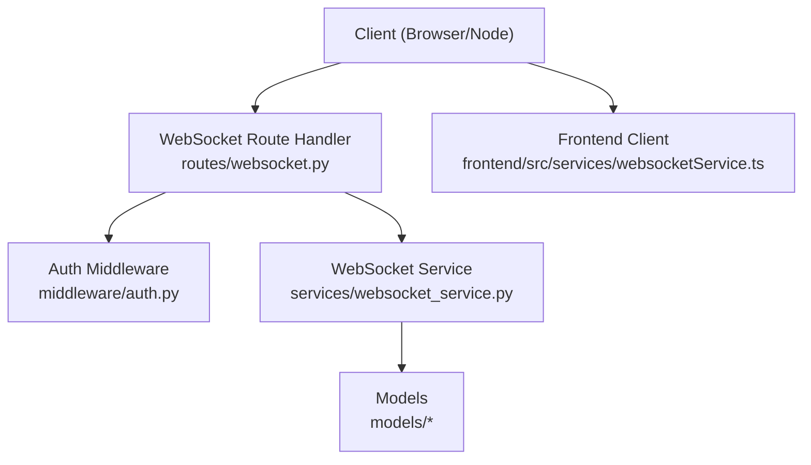
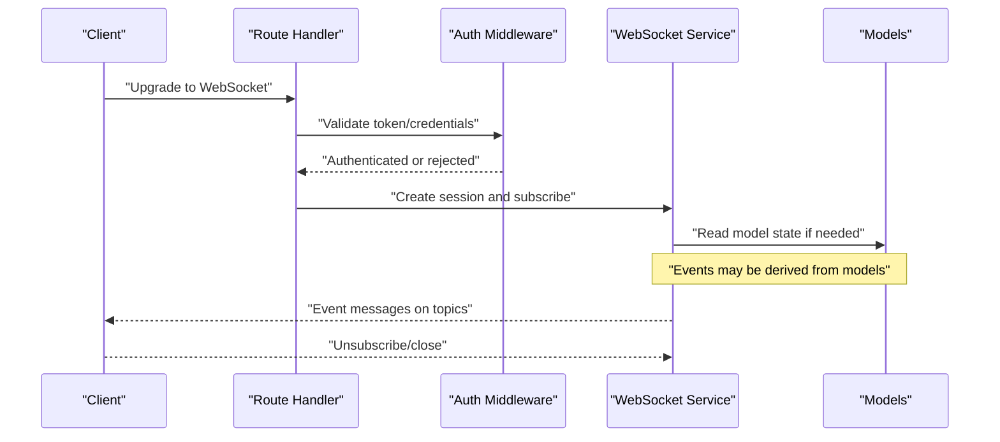
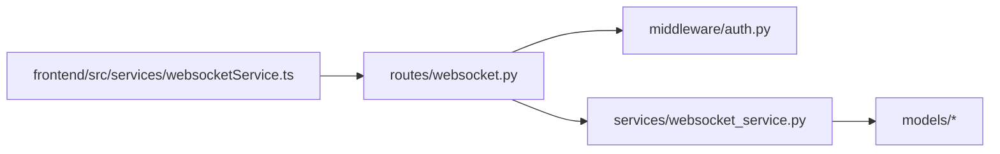
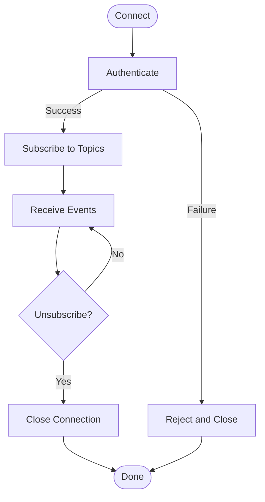

# WebSocket API

<cite>
**Referenced Files in This Document**
- [websocket.py](file://backend/app/routes/websocket.py)
- [websocket_service.py](file://backend/app/services/websocket_service.py)
- [auth.py](file://backend/app/middleware/auth.py)
- [auth_service.py](file://backend/app/services/auth_service.py)
- [migration.py](file://backend/app/models/migration.py)
- [notification.py](file://backend/app/models/notification.py)
- [cdc_event.py](file://backend/app/models/cdc_event.py)
- [websocketService.ts](file://frontend/src/services/websocketService.ts)
</cite>

## Table of Contents
1. [Introduction](#introduction)
2. [Project Structure](#project-structure)
3. [Core Components](#core-components)
4. [Architecture Overview](#architecture-overview)
5. [Detailed Component Analysis](#detailed-component-analysis)
6. [Dependency Analysis](#dependency-analysis)
7. [Performance Considerations](#performance-considerations)
8. [Troubleshooting Guide](#troubleshooting-guide)
9. [Conclusion](#conclusion)
10. [Appendices](#appendices)

## Introduction
This document describes the WebSocket real-time communication endpoints for the system. It covers connection establishment, authentication handshake, message protocols, event types, subscription patterns, lifecycle management, reconnection strategies, and error handling. It also provides examples for implementing real-time features such as migration progress tracking and live monitoring, along with rate limiting, connection limits, and performance considerations for clients.

## Project Structure
The WebSocket feature is implemented on the backend with a route handler and a service layer, and consumed by a frontend client library. The key files are:
- Backend route handler for WebSocket connections
- Service layer managing subscriptions and broadcasting
- Middleware for authentication
- Data models used to structure events
- Frontend client implementation

**Diagram sources**
- [websocket.py](file://backend/app/routes/websocket.py)
- [auth.py](file://backend/app/middleware/auth.py)
- [websocket_service.py](file://backend/app/services/websocket_service.py)
- [websocketService.ts](file://frontend/src/services/websocketService.ts)

**Section sources**
- [websocket.py](file://backend/app/routes/websocket.py)
- [websocket_service.py](file://backend/app/services/websocket_service.py)
- [auth.py](file://backend/app/middleware/auth.py)
- [websocketService.ts](file://frontend/src/services/websocketService.ts)

## Core Components
- WebSocket Route Handler: Accepts incoming WebSocket connections, performs authentication, and delegates to the service layer for subscription and message routing.
- WebSocket Service: Manages per-client sessions, topic-based subscriptions, and broadcasts events to subscribers.
- Authentication Middleware: Validates tokens or credentials before allowing a WebSocket session to proceed.
- Event Models: Define structured payloads for domain events (e.g., migrations, notifications, CDC).
- Frontend Client: Implements connection lifecycle, reconnection, and event dispatching for UI components.

Key responsibilities:
- Connection lifecycle: connect, authenticate, subscribe/unsubscribe, disconnect.
- Message protocol: typed events with topics and payloads.
- Error handling: graceful degradation, retry, and informative errors.
- Performance: batching, backpressure awareness, and resource cleanup.

**Section sources**
- [websocket.py](file://backend/app/routes/websocket.py)
- [websocket_service.py](file://backend/app/services/websocket_service.py)
- [auth.py](file://backend/app/middleware/auth.py)
- [websocketService.ts](file://frontend/src/services/websocketService.ts)

## Architecture Overview
The WebSocket architecture follows a simple pub/sub pattern:
- Clients connect via WebSocket and authenticate.
- Clients subscribe to topics (e.g., migration progress, notifications).
- The server publishes events to subscribed clients.
- The frontend client manages reconnection and event dispatching.

**Diagram sources**
- [websocket.py](file://backend/app/routes/websocket.py)
- [auth.py](file://backend/app/middleware/auth.py)
- [websocket_service.py](file://backend/app/services/websocket_service.py)
- [migration.py](file://backend/app/models/migration.py)
- [notification.py](file://backend/app/models/notification.py)
- [cdc_event.py](file://backend/app/models/cdc_event.py)

## Detailed Component Analysis

### WebSocket Route Handler
Responsibilities:
- Accept WebSocket upgrades.
- Enforce authentication using middleware.
- Initialize per-client session and delegate to the service layer.
- Handle close and error conditions.

Typical flow:
- On connect, extract auth context from headers or query parameters.
- Validate via middleware; reject invalid sessions.
- Register client with the service and return control to the service loop.

Error handling:
- Reject unauthenticated connections early.
- Close with appropriate codes/messages on fatal errors.

**Section sources**
- [websocket.py](file://backend/app/routes/websocket.py)
- [auth.py](file://backend/app/middleware/auth.py)

### Authentication Middleware
Responsibilities:
- Verify tokens or credentials provided during the WebSocket handshake.
- Attach authenticated user context to the connection.
- Return clear rejection reasons for invalid sessions.

Security considerations:
- Use short-lived tokens where possible.
- Avoid sensitive data in URL parameters.
- Rate-limit authentication attempts at the transport layer if supported.

**Section sources**
- [auth.py](file://backend/app/middleware/auth.py)
- [auth_service.py](file://backend/app/services/auth_service.py)

### WebSocket Service
Responsibilities:
- Maintain active sessions and topic subscriptions.
- Broadcast events to matching subscribers.
- Provide APIs for subscribing/unsubscribing to topics.
- Clean up resources on disconnect.

Subscription patterns:
- Topic-based channels (e.g., migration progress, notifications, CDC events).
- Optional filtering by identifiers (e.g., project ID, migration ID).

Message routing:
- Map domain events to topics.
- Serialize payloads according to the message protocol.

**Section sources**
- [websocket_service.py](file://backend/app/services/websocket_service.py)

### Event Models
Used to structure real-time events:
- Migration events: status changes, checkpoints, logs.
- Notification events: system alerts, user actions.
- CDC events: change data capture updates.

These models inform the shape of event payloads and help ensure consistency across producers and consumers.

**Section sources**
- [migration.py](file://backend/app/models/migration.py)
- [notification.py](file://backend/app/models/notification.py)
- [cdc_event.py](file://backend/app/models/cdc_event.py)

### Frontend Client
Responsibilities:
- Establish and manage WebSocket connections.
- Authenticate during handshake.
- Subscribe/unsubscribe to topics.
- Dispatch events to application logic.
- Implement reconnection with exponential backoff and jitter.
- Handle network errors and server-side close codes.

Operational guidance:
- Reconnect only after successful authentication.
- Debounce rapid reconnect attempts.
- Unsubscribe from topics when components unmount.

**Section sources**
- [websocketService.ts](file://frontend/src/services/websocketService.ts)

## Dependency Analysis
High-level dependencies between components:

**Diagram sources**
- [websocket.py](file://backend/app/routes/websocket.py)
- [auth.py](file://backend/app/middleware/auth.py)
- [websocket_service.py](file://backend/app/services/websocket_service.py)
- [websocketService.ts](file://frontend/src/services/websocketService.ts)

**Section sources**
- [websocket.py](file://backend/app/routes/websocket.py)
- [websocket_service.py](file://backend/app/services/websocket_service.py)
- [auth.py](file://backend/app/middleware/auth.py)
- [websocketService.ts](file://frontend/src/services/websocketService.ts)

## Performance Considerations
- Connection limits: Configure maximum concurrent connections per process and overall.
- Rate limiting: Apply per-client or per-topic rate limits to prevent abuse.
- Backpressure: Avoid blocking send operations; use queues and non-blocking I/O.
- Batching: Aggregate frequent small events into batches when appropriate.
- Memory management: Ensure timely cleanup of sessions and subscriptions.
- Payload size: Keep messages compact; avoid sending large blobs over WebSocket.
- Heartbeats: Implement ping/pong to detect dead connections promptly.

[No sources needed since this section provides general guidance]

## Troubleshooting Guide
Common issues and resolutions:
- Authentication failures:
  - Verify token validity and expiration.
  - Check that credentials are passed securely and correctly.
- Frequent disconnects:
  - Inspect network stability and proxy behavior.
  - Tune heartbeat intervals and timeouts.
- Missing events:
  - Confirm correct topic names and filters.
  - Ensure client subscribes before expecting events.
- High CPU/memory usage:
  - Review broadcast fan-out and subscription counts.
  - Add rate limiting and message throttling.

Operational checks:
- Monitor connection counts and event throughput.
- Log authentication outcomes and subscription errors.
- Track reconnection metrics and failure reasons.

**Section sources**
- [websocket.py](file://backend/app/routes/websocket.py)
- [websocket_service.py](file://backend/app/services/websocket_service.py)
- [auth.py](file://backend/app/middleware/auth.py)
- [websocketService.ts](file://frontend/src/services/websocketService.ts)

## Conclusion
The WebSocket API provides a robust foundation for real-time updates through a clean separation of concerns: authentication, routing, and service-layer pub/sub. By following the recommended message formats, subscription patterns, and lifecycle practices, clients can implement reliable real-time features such as migration progress tracking and live monitoring while maintaining performance and security.

[No sources needed since this section summarizes without analyzing specific files]

## Appendices

### Connection Lifecycle Management
- Connect: Upgrade HTTP to WebSocket.
- Authenticate: Present credentials/token; receive acceptance or rejection.
- Subscribe: Request topics and optional filters.
- Receive: Process incoming events.
- Unsubscribe: Release interest in topics.
- Disconnect: Close cleanly; handle server-initiated closes.

[No sources needed since this diagram shows conceptual workflow, not actual code structure]

### Message Protocol Specification
General envelope:
- type: string identifying the event category.
- topic: string indicating the channel.
- payload: object containing event-specific data.
- metadata: optional fields such as correlation IDs and timestamps.

Examples of event types:
- Migration progress updates
- Notifications
- CDC events

Guidelines:
- Use stable, versioned event types.
- Keep payloads minimal and serializable.
- Include correlation IDs for tracing.

[No sources needed since this section defines conceptual protocol details]

### Subscription Patterns
- Global topics: e.g., system-wide notifications.
- Scoped topics: e.g., per-project or per-migration.
- Filtered subscriptions: include identifiers in the request to narrow delivery.

Best practices:
- Subscribe only what you need.
- Unsubscribe on component unmount.
- Handle duplicate events gracefully.

[No sources needed since this section provides general guidance]

### Real-Time Feature Examples
- Migration progress tracking:
  - Subscribe to migration-scoped topics.
  - Update UI based on status transitions and checkpoints.
- Live monitoring:
  - Subscribe to notification and CDC topics.
  - Render incremental updates without full refreshes.

Implementation tips:
- Debounce high-frequency updates.
- Persist last known state to recover on reconnect.
- Show loading indicators during reconnection.

[No sources needed since this section provides general guidance]

### Rate Limiting and Connection Limits
- Per-client rate limits: cap messages per second.
- Per-topic rate limits: throttle high-volume channels.
- Global connection caps: protect server capacity.
- Graceful degradation: queue or drop low-priority events under load.

[No sources needed since this section provides general guidance]

### Reconnection Strategies
- Exponential backoff with jitter.
- Maximum retry count and timeout.
- Idempotent re-subscription after reconnect.
- Detect and handle server-side close codes.

[No sources needed since this section provides general guidance]