# AWS Integration

<cite>
**Referenced Files in This Document**
- [aws_connection_service.py](file://backend/app/services/aws_connection_service.py)
- [ecs_service.py](file://backend/app/services/ecs_service.py)
- [cloudformation_service.py](file://backend/app/services/cloudformation_service.py)
- [secrets_manager_service.py](file://backend/app/services/secrets_manager_service.py)
- [aws_client.py](file://backend/app/utils/aws_client.py)
- [aws_connection.py](file://backend/app/models/aws_connection.py)
- [ecs_task.py](file://backend/app/models/ecs_task.py)
- [aws_connection.py](file://backend/app/routes/aws_connection.py)
- [ecs.py](file://backend/app/routes/ecs.py)
- [aws_connection.py](file://backend/app/schemas/aws_connection.py)
- [ecs.py](file://backend/app/schemas/ecs.py)
- [secret.py](file://backend/app/schemas/secret.py)
- [exceptions/aws_connection.py](file://backend/app/exceptions/aws_connection.py)
- [exceptions/ecs.py](file://backend/app/exceptions/ecs.py)
</cite>

## Table of Contents
1. [Introduction](#introduction)
2. [Project Structure](#project-structure)
3. [Core Components](#core-components)
4. [Architecture Overview](#architecture-overview)
5. [Detailed Component Analysis](#detailed-component-analysis)
6. [Dependency Analysis](#dependency-analysis)
7. [Performance Considerations](#performance-considerations)
8. [Troubleshooting Guide](#troubleshooting-guide)
9. [Conclusion](#conclusion)
10. [Appendices](#appendices)

## Introduction

CloudBridge provides comprehensive AWS integration capabilities for managing cloud infrastructure, container orchestration, and secure credential management. The system enables seamless connection to multiple AWS accounts, automated ECS task orchestration for migrations and background workers, CloudFormation stack management for infrastructure-as-code deployments, and secure Secrets Manager integration with rotation policies.

This documentation covers the complete AWS integration architecture, including connection management, IAM permissions, multi-account support, ECS task orchestration with auto-scaling, CloudFormation stack management, and security best practices for production deployments.

## Project Structure

The AWS integration functionality is organized across multiple layers in the backend application:

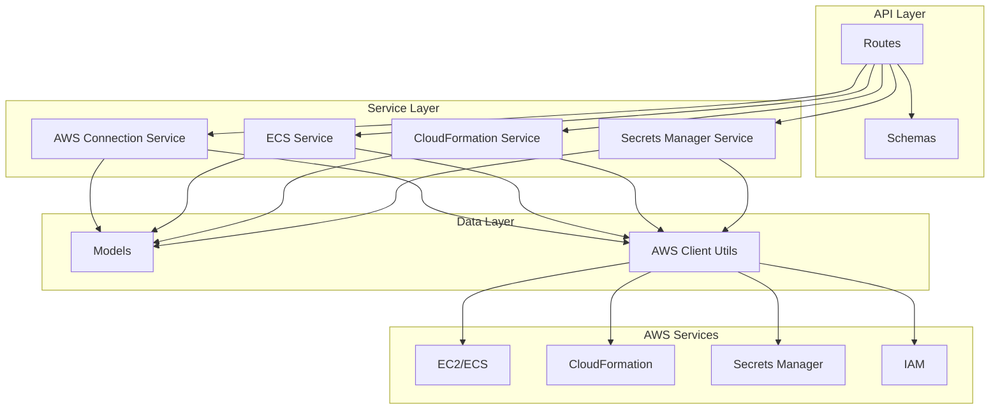

**Diagram sources**
- [aws_connection_service.py:1-50](file://backend/app/services/aws_connection_service.py#L1-L50)
- [ecs_service.py:1-50](file://backend/app/services/ecs_service.py#L1-L50)
- [cloudformation_service.py:1-50](file://backend/app/services/cloudformation_service.py#L1-L50)
- [secrets_manager_service.py:1-50](file://backend/app/services/secrets_manager_service.py#L1-L50)

**Section sources**
- [aws_connection_service.py:1-100](file://backend/app/services/aws_connection_service.py#L1-L100)
- [ecs_service.py:1-100](file://backend/app/services/ecs_service.py#L1-L100)
- [cloudformation_service.py:1-100](file://backend/app/services/cloudformation_service.py#L1-L100)
- [secrets_manager_service.py:1-100](file://backend/app/services/secrets_manager_service.py#L1-L100)

## Core Components

### AWS Connection Management

The AWS connection service handles credential setup, validation, and multi-account support. It manages different authentication methods including IAM roles, access keys, and temporary credentials.

#### Key Features:
- **Multi-Account Support**: Manage connections to multiple AWS accounts simultaneously
- **Credential Validation**: Real-time validation of AWS credentials and permissions
- **Connection Pooling**: Efficient reuse of AWS client connections
- **Health Monitoring**: Continuous health checks for active connections

#### Supported Authentication Methods:
- IAM Role-based authentication (recommended for production)
- Access Key/Secret Key pairs
- Temporary Security Credentials (STS)
- Environment variable configuration

### ECS Task Orchestration

The ECS service provides comprehensive container orchestration capabilities for running migrations and background workers with auto-scaling configurations.

#### Core Capabilities:
- **Task Definition Management**: Create, update, and version task definitions
- **Auto-Scaling Policies**: Configure CPU/memory-based scaling rules
- **Deployment Strategies**: Blue-green and rolling deployments
- **Monitoring Integration**: CloudWatch metrics and logging
- **Resource Optimization**: Right-sizing recommendations

### CloudFormation Stack Management

The CloudFormation service enables infrastructure-as-code deployments with full lifecycle management.

#### Features:
- **Stack Creation/Update**: Automated infrastructure provisioning
- **Change Set Preview**: Validate changes before deployment
- **Rollback Support**: Automatic rollback on failures
- **Drift Detection**: Monitor infrastructure changes
- **Template Validation**: Pre-deployment syntax and policy checks

### Secrets Manager Integration

Secure credential storage and rotation through AWS Secrets Manager with automated rotation policies.

#### Security Features:
- **Encrypted Storage**: AES-256 encryption at rest
- **Automatic Rotation**: Configurable rotation schedules
- **Access Control**: Fine-grained IAM permissions
- **Audit Logging**: Complete access history tracking
- **Version Management**: Multiple secret versions with rollback support

**Section sources**
- [aws_connection_service.py:1-200](file://backend/app/services/aws_connection_service.py#L1-L200)
- [ecs_service.py:1-200](file://backend/app/services/ecs_service.py#L1-L200)
- [cloudformation_service.py:1-200](file://backend/app/services/cloudformation_service.py#L1-L200)
- [secrets_manager_service.py:1-200](file://backend/app/services/secrets_manager_service.py#L1-L200)

## Architecture Overview

The AWS integration follows a layered architecture pattern with clear separation of concerns:

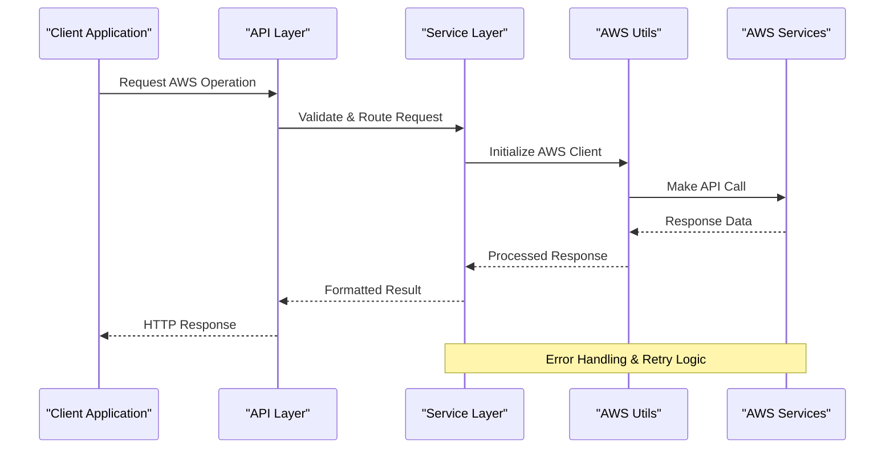

**Diagram sources**
- [aws_client.py:1-100](file://backend/app/utils/aws_client.py#L1-L100)
- [aws_connection_service.py:1-100](file://backend/app/services/aws_connection_service.py#L1-L100)

### Connection Flow Architecture

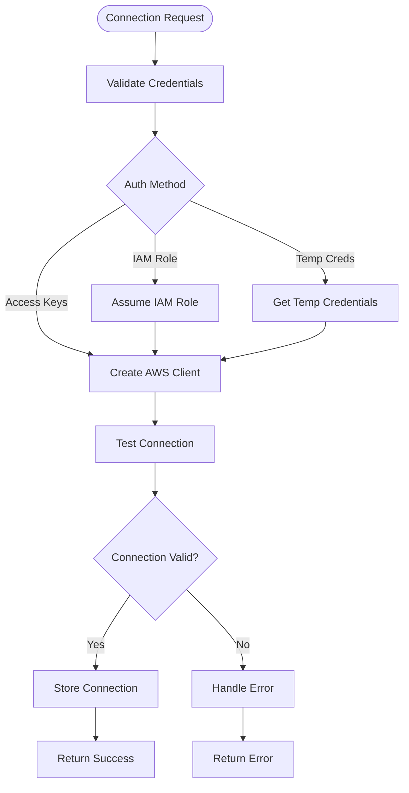

**Diagram sources**
- [aws_connection_service.py:50-150](file://backend/app/services/aws_connection_service.py#L50-L150)
- [aws_client.py:20-80](file://backend/app/utils/aws_client.py#L20-L80)

## Detailed Component Analysis

### AWS Connection Service Analysis

The AWS connection service implements a robust connection management system with support for multiple authentication strategies and connection pooling.

#### Class Architecture

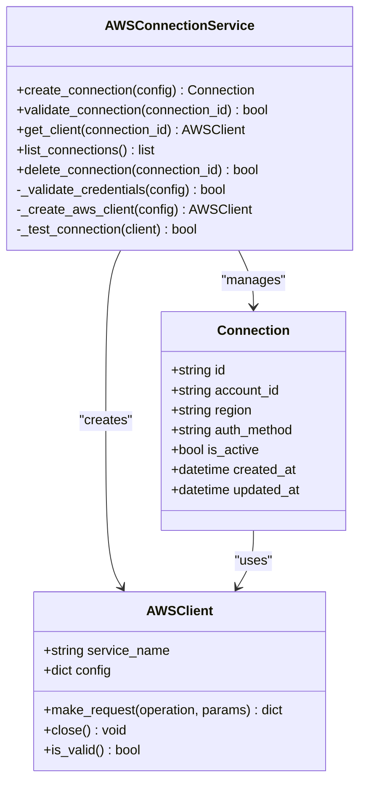

**Diagram sources**
- [aws_connection_service.py:1-100](file://backend/app/services/aws_connection_service.py#L1-L100)
- [aws_connection.py:1-50](file://backend/app/models/aws_connection.py#L1-L50)

#### Connection Lifecycle Management

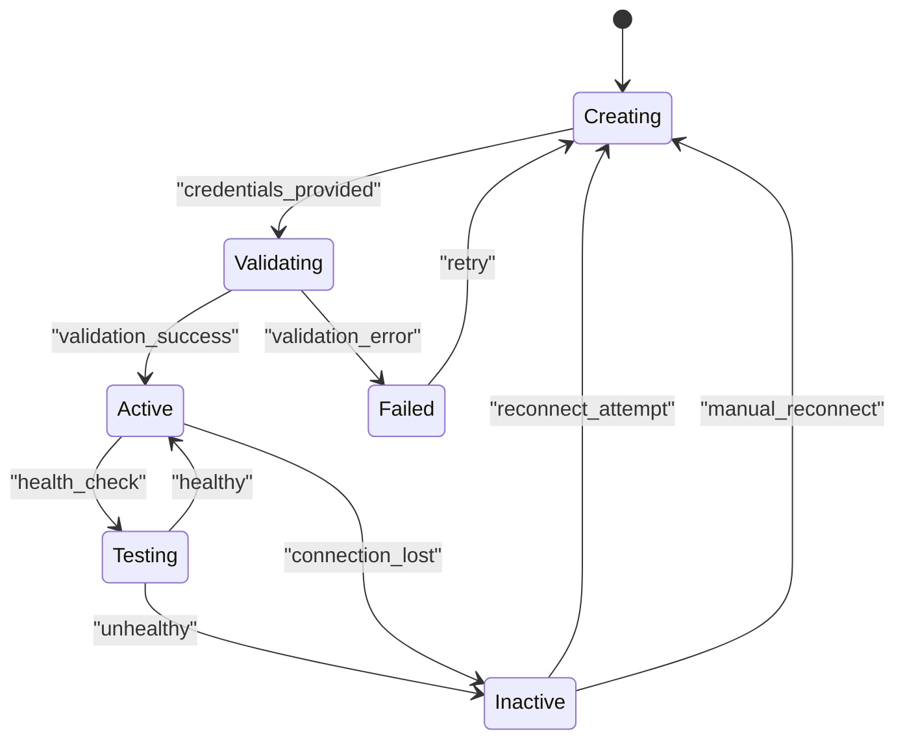

**Diagram sources**
- [aws_connection_service.py:100-200](file://backend/app/services/aws_connection_service.py#L100-L200)

**Section sources**
- [aws_connection_service.py:1-300](file://backend/app/services/aws_connection_service.py#L1-L300)
- [aws_connection.py:1-100](file://backend/app/models/aws_connection.py#L1-L100)

### ECS Service Analysis

The ECS service provides comprehensive container orchestration capabilities with advanced deployment strategies and auto-scaling features.

#### Task Orchestration Flow

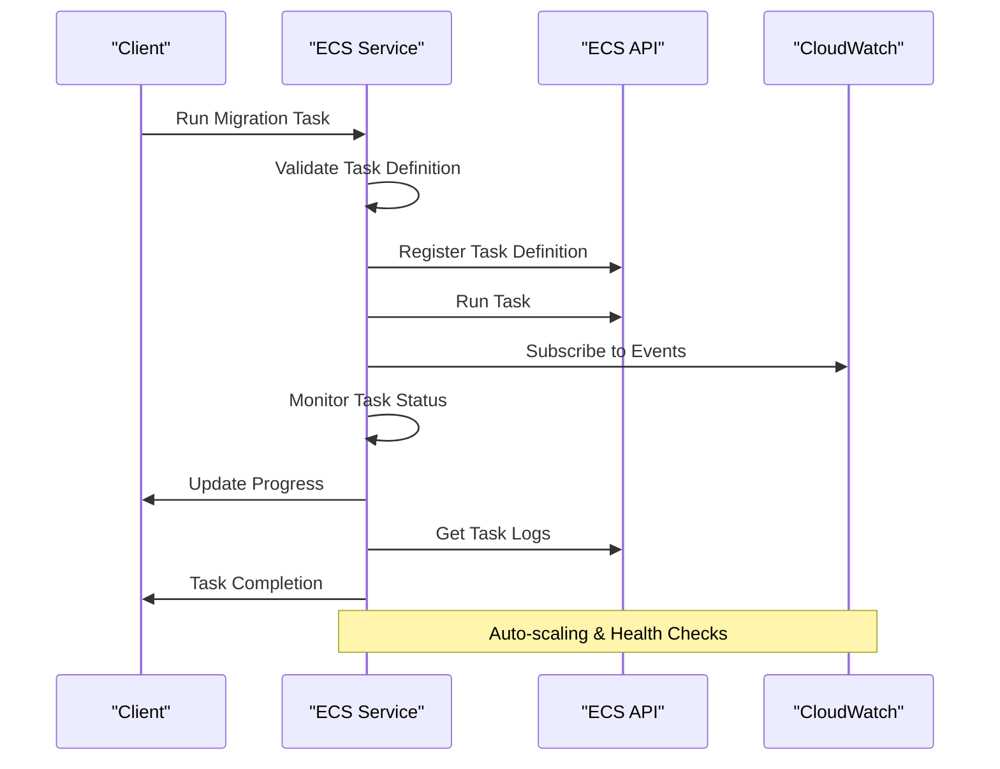

**Diagram sources**
- [ecs_service.py:1-150](file://backend/app/services/ecs_service.py#L1-L150)
- [ecs_task.py:1-50](file://backend/app/models/ecs_task.py#L1-L50)

#### Auto-Scaling Configuration

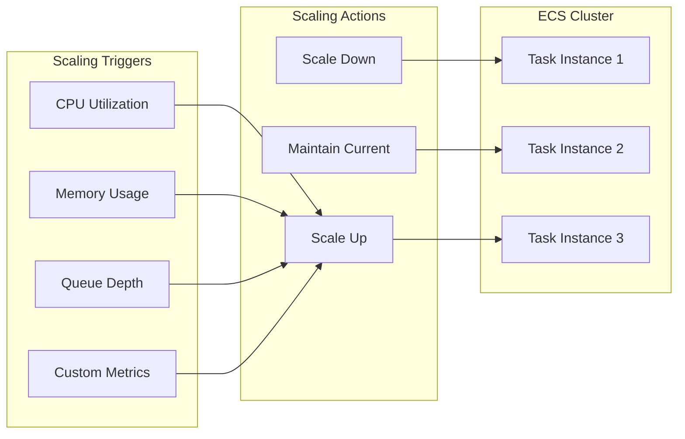

**Diagram sources**
- [ecs_service.py:150-300](file://backend/app/services/ecs_service.py#L150-L300)

**Section sources**
- [ecs_service.py:1-400](file://backend/app/services/ecs_service.py#L1-L400)
- [ecs_task.py:1-100](file://backend/app/models/ecs_task.py#L1-L100)

### CloudFormation Service Analysis

The CloudFormation service enables infrastructure-as-code deployments with comprehensive lifecycle management and change tracking.

#### Stack Management Workflow

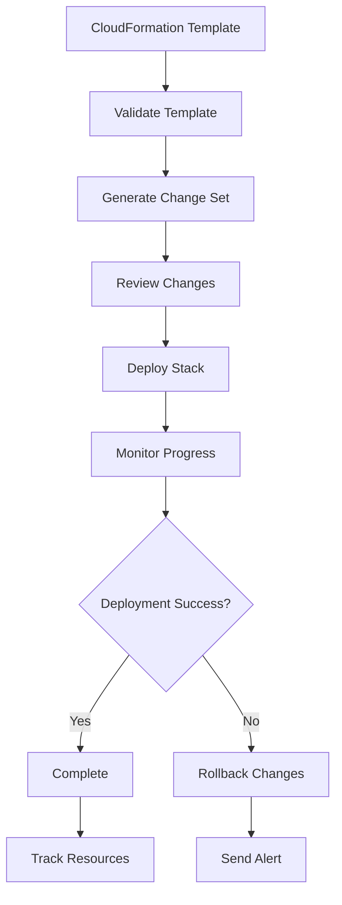

**Diagram sources**
- [cloudformation_service.py:1-200](file://backend/app/services/cloudformation_service.py#L1-L200)

#### Infrastructure Deployment Patterns

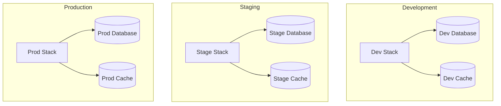

**Diagram sources**
- [cloudformation_service.py:200-400](file://backend/app/services/cloudformation_service.py#L200-L400)

**Section sources**
- [cloudformation_service.py:1-500](file://backend/app/services/cloudformation_service.py#L1-L500)

### Secrets Manager Service Analysis

The Secrets Manager service provides secure credential storage with automated rotation and access control.

#### Secret Management Flow

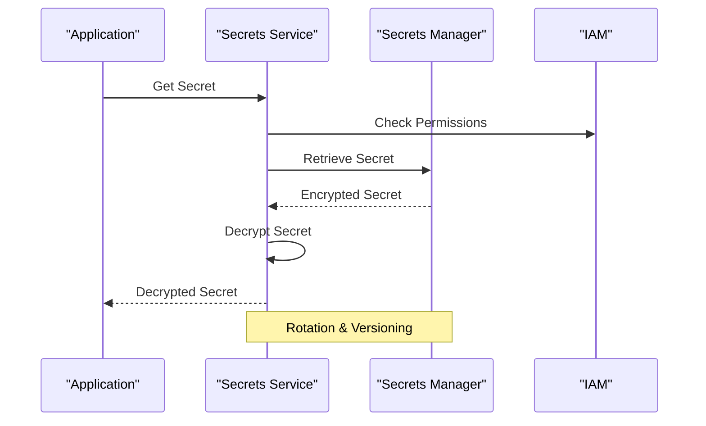

**Diagram sources**
- [secrets_manager_service.py:1-150](file://backend/app/services/secrets_manager_service.py#L1-L150)

#### Rotation Policy Management

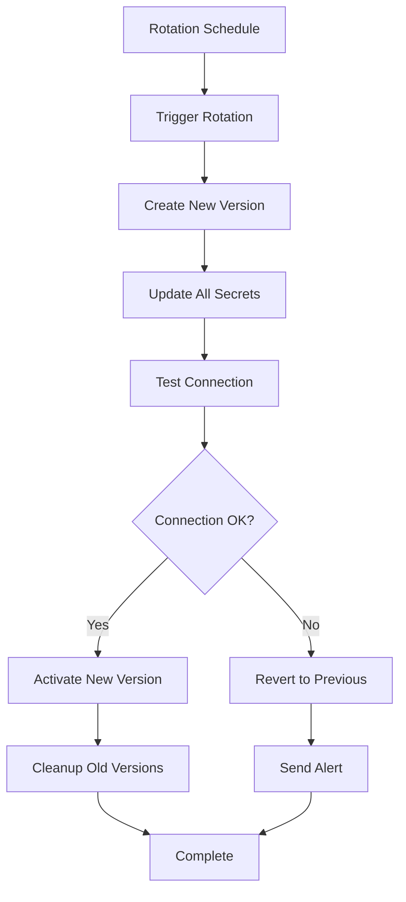

**Diagram sources**
- [secrets_manager_service.py:150-300](file://backend/app/services/secrets_manager_service.py#L150-L300)

**Section sources**
- [secrets_manager_service.py:1-400](file://backend/app/services/secrets_manager_service.py#L1-L400)

## Dependency Analysis

The AWS integration components have well-defined dependencies and relationships:

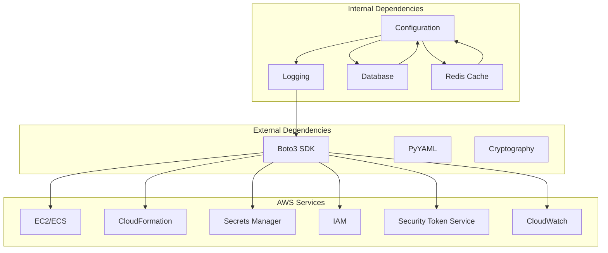

**Diagram sources**
- [aws_client.py:1-100](file://backend/app/utils/aws_client.py#L1-L100)
- [config.py:1-50](file://backend/app/config.py#L1-L50)

### Module Relationships

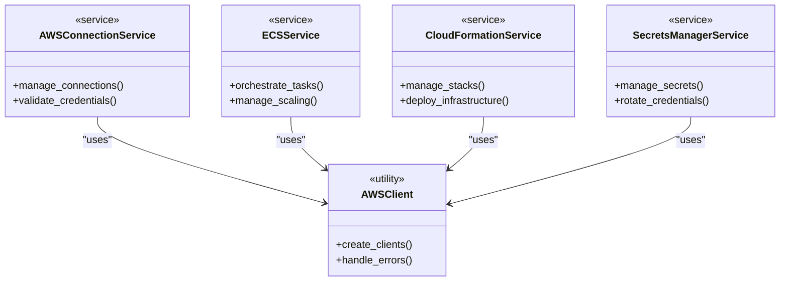

**Diagram sources**
- [aws_connection_service.py:1-50](file://backend/app/services/aws_connection_service.py#L1-L50)
- [ecs_service.py:1-50](file://backend/app/services/ecs_service.py#L1-L50)
- [cloudformation_service.py:1-50](file://backend/app/services/cloudformation_service.py#L1-L50)
- [secrets_manager_service.py:1-50](file://backend/app/services/secrets_manager_service.py#L1-L50)
- [aws_client.py:1-50](file://backend/app/utils/aws_client.py#L1-L50)

**Section sources**
- [aws_client.py:1-200](file://backend/app/utils/aws_client.py#L1-L200)
- [config.py:1-100](file://backend/app/config.py#L1-L100)

## Performance Considerations

### Connection Pooling and Reuse

The AWS client implementation includes connection pooling to minimize overhead:
- **Connection Caching**: Reuse established AWS client connections
- **Lazy Loading**: Initialize clients only when needed
- **Timeout Configuration**: Optimal timeout settings for different operations
- **Retry Logic**: Exponential backoff with jitter for transient failures

### Resource Optimization

- **Right-sizing Recommendations**: Analyze resource utilization patterns
- **Cost Tracking**: Monitor AWS spending across accounts
- **Idle Resource Detection**: Identify and alert on unused resources
- **Auto-scaling Policies**: Dynamic scaling based on demand

### Caching Strategies

- **Metadata Caching**: Cache AWS resource metadata to reduce API calls
- **Credential Caching**: Secure caching of temporary credentials
- **Response Caching**: Cache frequently accessed data with TTL

## Troubleshooting Guide

### Common Connection Issues

#### Credential Validation Errors
- **Invalid Access Keys**: Verify key format and expiration
- **Permission Denied**: Check IAM policies and role assumptions
- **Region Mismatch**: Ensure correct AWS region configuration
- **Network Connectivity**: Verify VPC endpoints and security groups

#### ECS Task Failures
- **Task Definition Issues**: Validate JSON syntax and required fields
- **Container Image Problems**: Check image availability and permissions
- **Resource Constraints**: Verify CPU/memory allocations
- **Networking Issues**: Validate security groups and VPC configuration

#### CloudFormation Deployment Failures
- **Template Syntax Errors**: Use CloudFormation linters
- **Resource Conflicts**: Check for existing resource names
- **Permission Issues**: Verify IAM permissions for stack operations
- **Dependency Resolution**: Ensure proper resource ordering

#### Secrets Manager Access Issues
- **Encryption Key Problems**: Verify KMS key permissions
- **Rotation Failures**: Check Lambda function permissions
- **Access Denials**: Review IAM policies for secret access
- **Version Conflicts**: Handle secret version management

### Debugging Tools and Techniques

#### Logging and Monitoring
- **Structured Logging**: Implement consistent log formats
- **CloudWatch Integration**: Centralized log aggregation
- **Performance Metrics**: Track API call latency and errors
- **Trace Propagation**: End-to-end request tracing

#### Diagnostic Utilities
- **Connection Health Checks**: Regular connectivity testing
- **Permission Auditing**: Automated permission validation
- **Resource Inventory**: Complete AWS resource discovery
- **Cost Analysis**: Detailed spending breakdowns

**Section sources**
- [exceptions/aws_connection.py:1-100](file://backend/app/exceptions/aws_connection.py#L1-L100)
- [exceptions/ecs.py:1-100](file://backend/app/exceptions/ecs.py#L1-L100)

## Conclusion

CloudBridge provides a comprehensive AWS integration platform that simplifies cloud infrastructure management through automated workflows, secure credential handling, and intelligent resource orchestration. The modular architecture ensures scalability and maintainability while providing robust error handling and monitoring capabilities.

Key benefits include:
- **Unified Multi-Account Management**: Centralized control across AWS accounts
- **Automated Workflows**: Reduced manual intervention and human error
- **Security First**: Built-in security best practices and compliance
- **Cost Optimization**: Intelligent resource management and cost tracking
- **Operational Excellence**: Comprehensive monitoring and troubleshooting tools

The platform is designed to scale with your organization's needs while maintaining high availability and performance standards.

## Appendices

### AWS Integration Patterns

#### Blue-Green Deployments
- **Strategy**: Maintain two identical environments
- **Traffic Switching**: Route traffic between environments
- **Rollback Capability**: Instant rollback to previous version
- **Testing**: Full production-like testing in green environment

#### Canary Releases
- **Gradual Rollout**: Incrementally increase traffic to new version
- **Monitoring**: Real-time performance and error monitoring
- **Automated Rollback**: Automatic rollback on failure detection
- **A/B Testing**: Compare performance metrics between versions

#### Disaster Recovery Setup
- **Multi-Region Replication**: Cross-region data replication
- **Automated Failover**: Automatic failover to backup region
- **Backup Strategy**: Comprehensive backup and restore procedures
- **RTO/RPO Optimization**: Minimize recovery time and data loss

### Security Best Practices

#### IAM Configuration
- **Least Privilege**: Grant minimum required permissions
- **Role-Based Access**: Use IAM roles instead of access keys
- **Regular Audits**: Periodic permission reviews and cleanup
- **MFA Enforcement**: Multi-factor authentication for sensitive operations

#### Network Security
- **VPC Isolation**: Private subnets for sensitive resources
- **Security Groups**: Restrictive network access policies
- **Encryption**: Enable encryption at rest and in transit
- **Monitoring**: Security event logging and alerting

### Cost Optimization Strategies

#### Resource Rightsizing
- **Utilization Analysis**: Monitor actual vs. allocated resources
- **Auto-scaling**: Dynamic scaling based on demand
- **Reserved Instances**: Long-term commitment discounts
- **Spot Instances**: Cost-effective compute for fault-tolerant workloads

#### Monitoring and Alerts
- **Budget Alerts**: Proactive spending notifications
- **Anomaly Detection**: Unusual usage pattern identification
- **Cost Allocation**: Tag-based cost attribution
- **Optimization Recommendations**: AI-powered suggestions