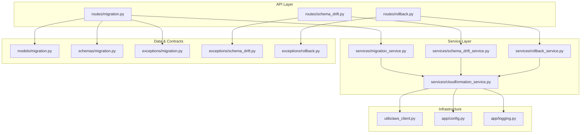
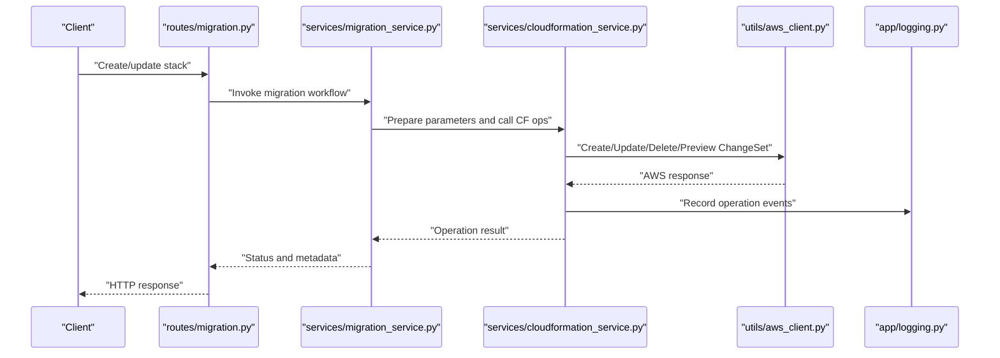
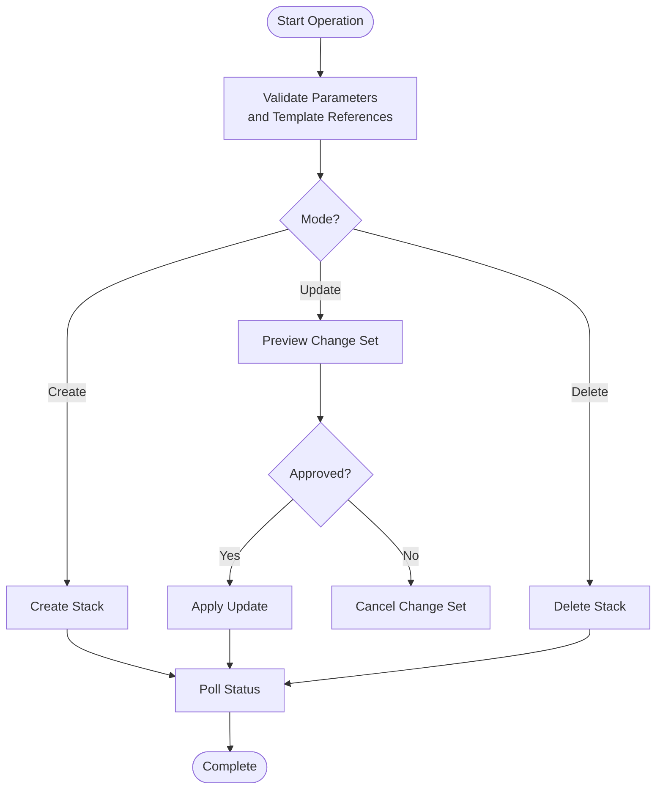
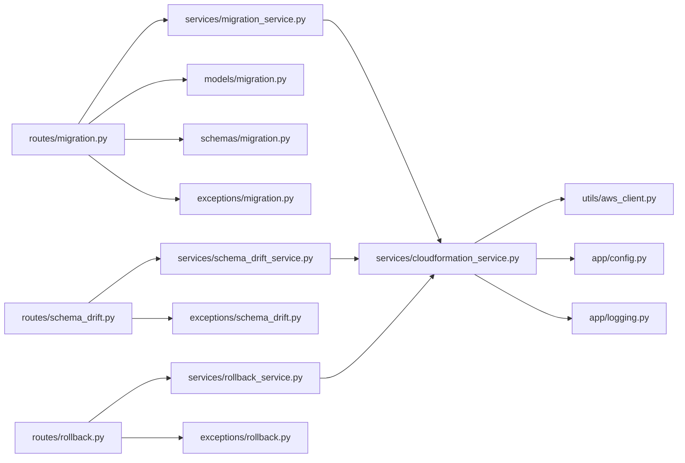

# CloudFormation Stack Management

<cite>
**Referenced Files in This Document**
- [cloudformation_service.py](file://backend/app/services/cloudformation_service.py)
- [aws_client.py](file://backend/app/utils/aws_client.py)
- [exceptions/migration.py](file://backend/app/exceptions/migration.py)
- [routes/migration.py](file://backend/app/routes/migration.py)
- [services/migration_service.py](file://backend/app/services/migration_service.py)
- [models/migration.py](file://backend/app/models/migration.py)
- [schemas/migration.py](file://backend/app/schemas/migration.py)
- [exceptions/schema_drift.py](file://backend/app/exceptions/schema_drift.py)
- [services/schema_drift_service.py](file://backend/app/services/schema_drift_service.py)
- [routes/schema_drift.py](file://backend/app/routes/schema_drift.py)
- [exceptions/rollback.py](file://backend/app/exceptions/rollback.py)
- [services/rollback_service.py](file://backend/app/services/rollback_service.py)
- [routes/rollback.py](file://backend/app/routes/rollback.py)
- [config.py](file://backend/app/config.py)
- [logging.py](file://backend/app/logging.py)
</cite>

## Table of Contents
1. [Introduction](#introduction)
2. [Project Structure](#project-structure)
3. [Core Components](#core-components)
4. [Architecture Overview](#architecture-overview)
5. [Detailed Component Analysis](#detailed-component-analysis)
6. [Dependency Analysis](#dependency-analysis)
7. [Performance Considerations](#performance-considerations)
8. [Troubleshooting Guide](#troubleshooting-guide)
9. [Conclusion](#conclusion)
10. [Appendices](#appendices)

## Introduction
This document explains how CloudBridge manages AWS CloudFormation stacks for database migration environments. It covers defining, deploying, updating, and rolling back infrastructure-as-code templates; integrating with version control; managing parameters and environment-specific configurations; handling drift detection, change set previews, and automated rollback strategies; and addressing security, cost estimation, and monitoring considerations. The guidance is grounded in the repository’s services, routes, models, schemas, exceptions, and utilities that implement these capabilities.

## Project Structure
CloudBridge organizes CloudFormation-related functionality across services, routes, models, schemas, exceptions, and utilities:
- Services encapsulate business logic for stack operations, drift detection, and rollbacks.
- Routes expose HTTP endpoints to orchestrate stack lifecycle actions.
- Models and Schemas define persistent state and request/response contracts.
- Exceptions standardize error signaling across components.
- Utilities provide AWS client access and configuration.

**Diagram sources**
- [routes/migration.py](file://backend/app/routes/migration.py)
- [routes/schema_drift.py](file://backend/app/routes/schema_drift.py)
- [routes/rollback.py](file://backend/app/routes/rollback.py)
- [services/cloudformation_service.py](file://backend/app/services/cloudformation_service.py)
- [services/migration_service.py](file://backend/app/services/migration_service.py)
- [services/schema_drift_service.py](file://backend/app/services/schema_drift_service.py)
- [services/rollback_service.py](file://backend/app/services/rollback_service.py)
- [models/migration.py](file://backend/app/models/migration.py)
- [schemas/migration.py](file://backend/app/schemas/migration.py)
- [exceptions/migration.py](file://backend/app/exceptions/migration.py)
- [exceptions/schema_drift.py](file://backend/app/exceptions/schema_drift.py)
- [exceptions/rollback.py](file://backend/app/exceptions/rollback.py)
- [utils/aws_client.py](file://backend/app/utils/aws_client.py)
- [config.py](file://backend/app/config.py)
- [logging.py](file://backend/app/logging.py)

**Section sources**
- [cloudformation_service.py](file://backend/app/services/cloudformation_service.py)
- [migration_service.py](file://backend/app/services/migration_service.py)
- [schema_drift_service.py](file://backend/app/services/schema_drift_service.py)
- [rollback_service.py](file://backend/app/services/rollback_service.py)
- [aws_client.py](file://backend/app/utils/aws_client.py)
- [config.py](file://backend/app/config.py)
- [logging.py](file://backend/app/logging.py)

## Core Components
- CloudFormation Service: Implements stack creation, update, deletion, change set preview, drift detection, and status polling. It coordinates with AWS clients and persists operation metadata via models and schemas.
- Migration Service: Orchestrates stack-driven migrations by invoking CloudFormation operations, tracking progress, and surfacing results through API endpoints.
- Schema Drift Service: Detects differences between desired template state and actual deployed resources, reporting drift details and enabling remediation workflows.
- Rollback Service: Manages safe rollback procedures using change sets or previous stable states, ensuring consistent recovery paths.
- AWS Client Utility: Provides configured AWS SDK clients and session management for CloudFormation interactions.
- Configuration and Logging: Centralized settings (regions, credentials, timeouts) and structured logging for observability.

**Section sources**
- [cloudformation_service.py](file://backend/app/services/cloudformation_service.py)
- [migration_service.py](file://backend/app/services/migration_service.py)
- [schema_drift_service.py](file://backend/app/services/schema_drift_service.py)
- [rollback_service.py](file://backend/app/services/rollback_service.py)
- [aws_client.py](file://backend/app/utils/aws_client.py)
- [config.py](file://backend/app/config.py)
- [logging.py](file://backend/app/logging.py)

## Architecture Overview
The system follows a layered architecture where API routes delegate to service modules, which interact with AWS CloudFormation via an AWS client utility. State and contracts are maintained through models and schemas, while exceptions standardize error propagation.

**Diagram sources**
- [routes/migration.py](file://backend/app/routes/migration.py)
- [services/migration_service.py](file://backend/app/services/migration_service.py)
- [services/cloudformation_service.py](file://backend/app/services/cloudformation_service.py)
- [utils/aws_client.py](file://backend/app/utils/aws_client.py)
- [logging.py](file://backend/app/logging.py)

## Detailed Component Analysis

### CloudFormation Service
Responsibilities:
- Create stacks from templates with parameter sets and tags.
- Preview changes using change sets before applying updates.
- Update stacks safely, including rollback on failure.
- Delete stacks and handle dependent resource constraints.
- Poll stack statuses and aggregate events for UI and logs.
- Integrate drift detection by comparing desired vs actual state.

Key patterns:
- Parameter validation against schemas before invoking AWS.
- Change set lifecycle: create, describe, execute, cancel.
- Retry/backoff for transient AWS errors.
- Structured logging for auditability.

**Diagram sources**
- [cloudformation_service.py](file://backend/app/services/cloudformation_service.py)
- [aws_client.py](file://backend/app/utils/aws_client.py)
- [logging.py](file://backend/app/logging.py)

**Section sources**
- [cloudformation_service.py](file://backend/app/services/cloudformation_service.py)
- [aws_client.py](file://backend/app/utils/aws_client.py)
- [logging.py](file://backend/app/logging.py)

### Migration Service
Responsibilities:
- Orchestrate stack-based migrations by composing CloudFormation operations.
- Manage environment-specific parameters and template versions.
- Track migration runs and correlate them with stack IDs and change sets.
- Surface progress and outcomes to API consumers.

Integration points:
- Uses CloudFormation Service for stack lifecycle.
- Persists migration records via models and validates inputs via schemas.
- Emits events and logs for observability.

**Section sources**
- [migration_service.py](file://backend/app/services/migration_service.py)
- [models/migration.py](file://backend/app/models/migration.py)
- [schemas/migration.py](file://backend/app/schemas/migration.py)
- [exceptions/migration.py](file://backend/app/exceptions/migration.py)

### Schema Drift Service
Responsibilities:
- Detect drift between current stack state and desired template.
- Report drifted resources and propose remediation steps.
- Provide APIs to trigger drift scans and retrieve reports.

Operational flow:
- Invokes CloudFormation drift detection APIs.
- Aggregates findings and stores summaries.
- Integrates with notifications and dashboards.

**Section sources**
- [schema_drift_service.py](file://backend/app/services/schema_drift_service.py)
- [routes/schema_drift.py](file://backend/app/routes/schema_drift.py)
- [exceptions/schema_drift.py](file://backend/app/exceptions/schema_drift.py)

### Rollback Service
Responsibilities:
- Execute safe rollbacks using change sets or previous stable stack snapshots.
- Ensure idempotent rollback operations with clear status reporting.
- Coordinate with CloudFormation Service to revert changes.

Safety mechanisms:
- Pre-flight checks before rollback execution.
- Audit logging and event emission.
- Error handling and retry policies.

**Section sources**
- [rollback_service.py](file://backend/app/services/rollback_service.py)
- [routes/rollback.py](file://backend/app/routes/rollback.py)
- [exceptions/rollback.py](file://backend/app/exceptions/rollback.py)

### AWS Client Utility
Responsibilities:
- Provide configured AWS sessions and clients for CloudFormation.
- Handle region selection, credential resolution, and retries.
- Centralize error mapping and logging for AWS calls.

Configuration integration:
- Reads environment variables and app config for regions, profiles, and timeouts.
- Supports multiple accounts/roles if required by configuration.

**Section sources**
- [aws_client.py](file://backend/app/utils/aws_client.py)
- [config.py](file://backend/app/config.py)

### Configuration and Logging
- Configuration: Centralizes AWS regions, credentials, feature flags, and operational thresholds.
- Logging: Structured logs for stack operations, drift scans, and rollbacks to support auditing and troubleshooting.

**Section sources**
- [config.py](file://backend/app/config.py)
- [logging.py](file://backend/app/logging.py)

## Dependency Analysis
High-level dependencies among components:

**Diagram sources**
- [routes/migration.py](file://backend/app/routes/migration.py)
- [routes/schema_drift.py](file://backend/app/routes/schema_drift.py)
- [routes/rollback.py](file://backend/app/routes/rollback.py)
- [services/migration_service.py](file://backend/app/services/migration_service.py)
- [services/schema_drift_service.py](file://backend/app/services/schema_drift_service.py)
- [services/rollback_service.py](file://backend/app/services/rollback_service.py)
- [services/cloudformation_service.py](file://backend/app/services/cloudformation_service.py)
- [utils/aws_client.py](file://backend/app/utils/aws_client.py)
- [config.py](file://backend/app/config.py)
- [logging.py](file://backend/app/logging.py)
- [models/migration.py](file://backend/app/models/migration.py)
- [schemas/migration.py](file://backend/app/schemas/migration.py)
- [exceptions/migration.py](file://backend/app/exceptions/migration.py)
- [exceptions/schema_drift.py](file://backend/app/exceptions/schema_drift.py)
- [exceptions/rollback.py](file://backend/app/exceptions/rollback.py)

**Section sources**
- [cloudformation_service.py](file://backend/app/services/cloudformation_service.py)
- [migration_service.py](file://backend/app/services/migration_service.py)
- [schema_drift_service.py](file://backend/app/services/schema_drift_service.py)
- [rollback_service.py](file://backend/app/services/rollback_service.py)
- [aws_client.py](file://backend/app/utils/aws_client.py)
- [config.py](file://backend/app/config.py)
- [logging.py](file://backend/app/logging.py)

## Performance Considerations
- Batch operations: Prefer change sets to minimize repeated updates and reduce API churn.
- Concurrency controls: Limit concurrent stack operations per account/region to avoid throttling.
- Polling intervals: Tune polling backoff for long-running stack transitions.
- Resource tagging: Use tags to scope drift scans and improve performance.
- Caching: Cache static template references and parameter defaults where appropriate.

[No sources needed since this section provides general guidance]

## Troubleshooting Guide
Common issues and resolutions:
- Permission errors: Verify IAM roles and policies for CloudFormation operations.
- Throttling: Implement exponential backoff and reduce concurrency.
- Drift false positives: Exclude non-configurable attributes and normalize outputs.
- Rollback failures: Inspect change set diffs and ensure dependent resources allow deletion.
- Observability: Check structured logs for operation traces and AWS error codes.

**Section sources**
- [logging.py](file://backend/app/logging.py)
- [exceptions/migration.py](file://backend/app/exceptions/migration.py)
- [exceptions/schema_drift.py](file://backend/app/exceptions/schema_drift.py)
- [exceptions/rollback.py](file://backend/app/exceptions/rollback.py)

## Conclusion
CloudBridge provides a robust, layered approach to managing CloudFormation stacks for database migration environments. By leveraging change sets, drift detection, and controlled rollback workflows, teams can deploy infrastructure-as-code safely and reliably. Integration with version control, parameter management, and comprehensive observability ensures secure, auditable, and cost-aware operations.

[No sources needed since this section summarizes without analyzing specific files]

## Appendices

### Best Practices for Templates and Parameters
- Versioned templates: Store templates in version control and reference immutable artifacts.
- Environment-specific parameters: Use parameter overrides per environment (dev/stage/prod).
- Tags and naming conventions: Enforce consistent tagging for cost allocation and governance.
- Minimal diffs: Keep change sets small to simplify reviews and rollbacks.

[No sources needed since this section provides general guidance]

### Security Considerations
- Least privilege: Grant minimal IAM permissions for stack operations.
- Secrets management: Avoid embedding secrets in templates; use external secret managers.
- Audit trails: Enable logging and retention for all stack operations.
- Network boundaries: Restrict stack resources to private subnets when applicable.

[No sources needed since this section provides general guidance]

### Cost Estimation and Monitoring
- Estimate costs: Use AWS pricing calculators and change set analysis to estimate impact.
- Monitor operations: Track stack status, events, and drift metrics.
- Alerts: Configure alerts for failed operations and significant drift.

[No sources needed since this section provides general guidance]