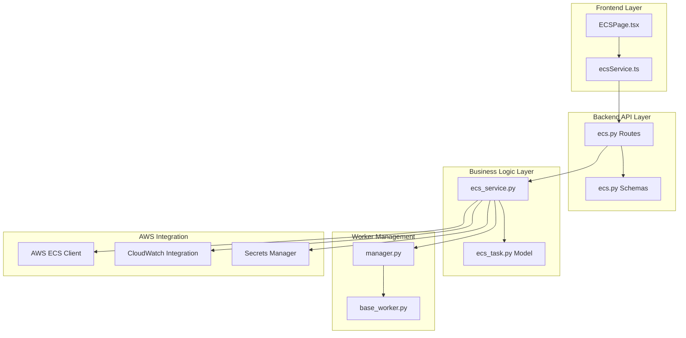
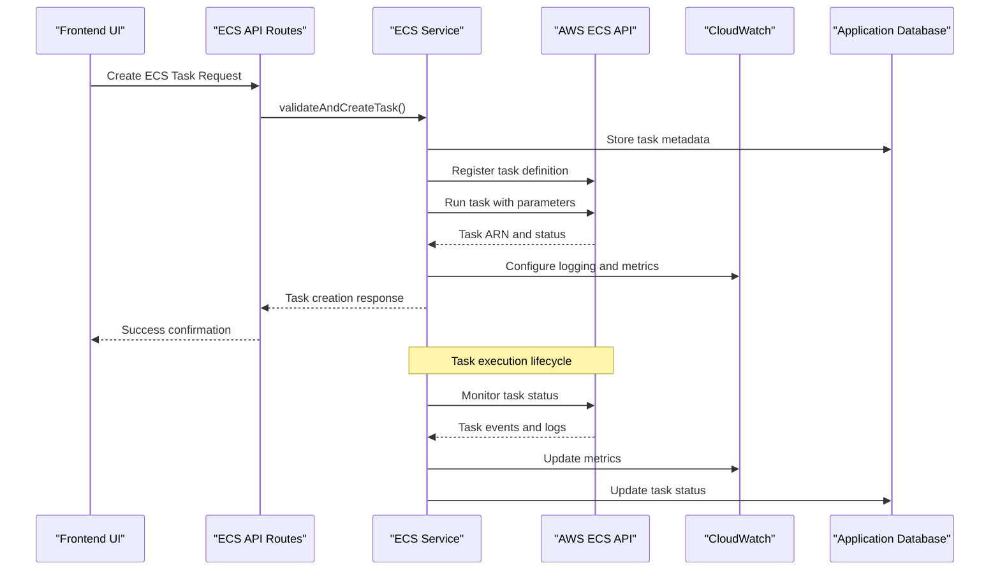
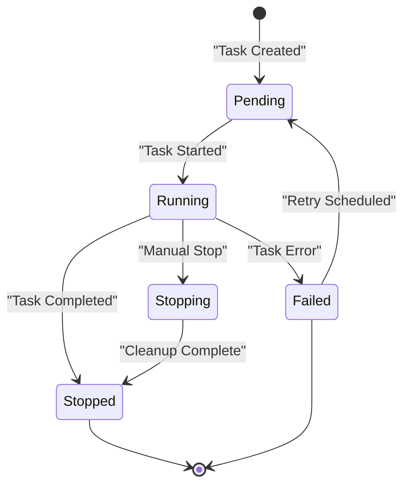
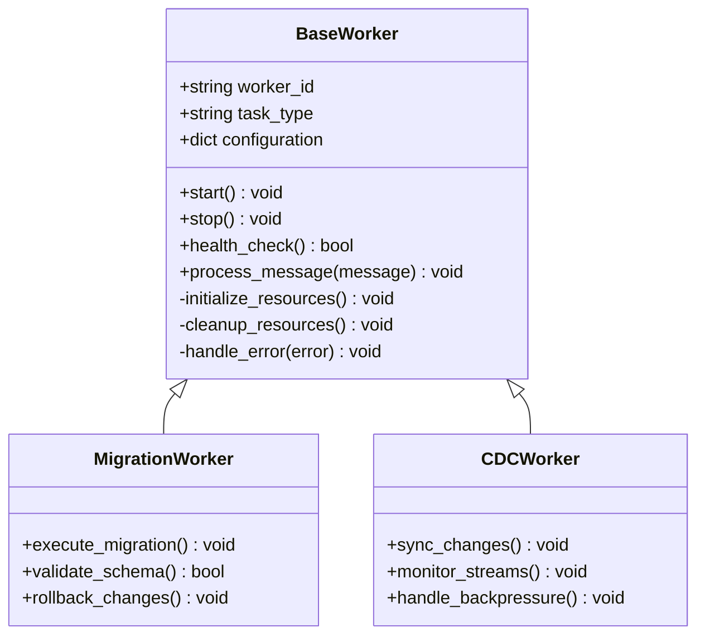
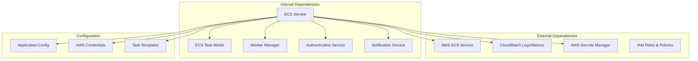

# ECS Task Orchestration

<cite>
**Referenced Files in This Document**
- [ecs_service.py](file://backend/app/services/ecs_service.py)
- [ecs_task.py](file://backend/app/models/ecs_task.py)
- [ecs.py](file://backend/app/routes/ecs.py)
- [ecs.py](file://backend/app/schemas/ecs.py)
- [base_worker.py](file://backend/app/workers/base_worker.py)
- [manager.py](file://backend/app/workers/manager.py)
- [ecs.py](file://backend/app/exceptions/ecs.py)
- [ecsService.ts](file://frontend/src/services/ecsService.ts)
- [ECSPage.tsx](file://frontend/src/pages/ECSPage.tsx)
</cite>

## Table of Contents
1. [Introduction](#introduction)
2. [Project Structure](#project-structure)
3. [Core Components](#core-components)
4. [Architecture Overview](#architecture-overview)
5. [Detailed Component Analysis](#detailed-component-analysis)
6. [Dependency Analysis](#dependency-analysis)
7. [Performance Considerations](#performance-considerations)
8. [Troubleshooting Guide](#troubleshooting-guide)
9. [Conclusion](#conclusion)
10. [Appendices](#appendices)

## Introduction

CloudBridge provides comprehensive ECS (Amazon Elastic Container Service) task orchestration capabilities for managing database migrations and background workers at scale. The system enables users to create, manage, monitor, and scale containerized tasks across AWS infrastructure while maintaining full observability and control over resource allocation and deployment strategies.

The ECS integration supports both one-time migration tasks and long-running worker processes, with built-in support for blue-green deployments, canary releases, auto-scaling policies, and comprehensive monitoring through CloudWatch integration.

## Project Structure

The ECS orchestration functionality is distributed across multiple layers in the CloudBridge application:

**Diagram sources**
- [ECSPage.tsx](file://frontend/src/pages/ECSPage.tsx)
- [ecsService.ts](file://frontend/src/services/ecsService.ts)
- [ecs.py](file://backend/app/routes/ecs.py)
- [ecs.py](file://backend/app/schemas/ecs.py)
- [ecs_service.py](file://backend/app/services/ecs_service.py)
- [ecs_task.py](file://backend/app/models/ecs_task.py)
- [base_worker.py](file://backend/app/workers/base_worker.py)
- [manager.py](file://backend/app/workers/manager.py)

**Section sources**
- [ECSPage.tsx](file://frontend/src/pages/ECSPage.tsx)
- [ecsService.ts](file://frontend/src/services/ecsService.ts)
- [ecs.py](file://backend/app/routes/ecs.py)
- [ecs_service.py](file://backend/app/services/ecs_service.py)

## Core Components

### ECS Service Layer

The core ECS orchestration logic is implemented in the service layer, providing high-level APIs for task management, scaling, and monitoring operations.

### Task Data Model

The ECS task model defines the schema for storing task metadata, configuration, and status information in the application database.

### API Routes

RESTful endpoints expose ECS management capabilities to the frontend interface and external integrations.

### Worker Framework

A flexible worker framework supports different types of background tasks, including database migrations and CDC (Change Data Capture) operations.

**Section sources**
- [ecs_service.py](file://backend/app/services/ecs_service.py)
- [ecs_task.py](file://backend/app/models/ecs_task.py)
- [ecs.py](file://backend/app/routes/ecs.py)
- [base_worker.py](file://backend/app/workers/base_worker.py)

## Architecture Overview

The ECS orchestration architecture follows a layered approach with clear separation of concerns:

**Diagram sources**
- [ecs.py](file://backend/app/routes/ecs.py)
- [ecs_service.py](file://backend/app/services/ecs_service.py)
- [ecs_task.py](file://backend/app/models/ecs_task.py)

## Detailed Component Analysis

### ECS Service Implementation

The ECS service provides comprehensive task lifecycle management including creation, monitoring, scaling, and cleanup operations.

#### Key Responsibilities

- **Task Definition Management**: Creating and updating ECS task definitions with proper container configurations
- **Task Execution**: Launching tasks with appropriate resource allocations and environment variables
- **Scaling Policies**: Implementing auto-scaling based on CPU/memory utilization or custom metrics
- **Monitoring Integration**: Configuring CloudWatch logging and metrics collection
- **Error Handling**: Comprehensive error handling and retry mechanisms for failed tasks

#### Task Lifecycle States

**Diagram sources**
- [ecs_service.py](file://backend/app/services/ecs_service.py)
- [ecs_task.py](file://backend/app/models/ecs_task.py)

### Task Definition Management

Task definitions are managed centrally and versioned to support different deployment strategies.

#### Container Configuration

Each task definition includes:
- **Container Images**: Versioned Docker images for consistent deployments
- **Resource Allocation**: CPU and memory limits tailored to workload requirements
- **Environment Variables**: Secure configuration through AWS Secrets Manager
- **Volume Mounts**: Persistent storage for stateful workloads
- **Network Configuration**: VPC networking and security group assignments

#### Deployment Strategies

**Blue-Green Deployments**:
- Maintain two identical environments (blue and green)
- Route traffic between environments during updates
- Enable instant rollback capabilities

**Canary Releases**:
- Gradually roll out new versions to small subsets of tasks
- Monitor performance and error rates before full deployment
- Automatic rollback on failure detection

**Section sources**
- [ecs_service.py](file://backend/app/services/ecs_service.py)
- [ecs.py](file://backend/app/schemas/ecs.py)

### Worker Framework

The worker framework provides a foundation for different types of background tasks.

#### Base Worker Class

**Diagram sources**
- [base_worker.py](file://backend/app/workers/base_worker.py)

#### Worker Manager

The worker manager coordinates multiple worker instances and handles load balancing across available resources.

**Section sources**
- [base_worker.py](file://backend/app/workers/base_worker.py)
- [manager.py](file://backend/app/workers/manager.py)

### API Endpoints

The ECS API provides RESTful endpoints for task management operations.

#### Task Management Endpoints

| Endpoint | Method | Description | Request Body | Response |
|----------|--------|-------------|--------------|----------|
| `/api/ecs/tasks` | POST | Create new ECS task | Task configuration | Task details |
| `/api/ecs/tasks/{id}` | GET | Get task status | None | Task information |
| `/api/ecs/tasks/{id}/stop` | POST | Stop running task | None | Status update |
| `/api/ecs/tasks/{id}/restart` | POST | Restart failed task | None | New task ID |
| `/api/ecs/tasks/{id}/scale` | PUT | Scale task count | Scaling parameters | Updated count |
| `/api/ecs/task-definitions` | GET | List task definitions | Filters | Definitions list |
| `/api/ecs/task-definitions` | POST | Create task definition | Definition config | Definition ARN |

#### Request/Response Schema

The API uses Pydantic schemas for request validation and response serialization, ensuring data consistency and type safety across the application.

**Section sources**
- [ecs.py](file://backend/app/routes/ecs.py)
- [ecs.py](file://backend/app/schemas/ecs.py)

### Frontend Integration

The frontend provides a comprehensive UI for ECS task management and monitoring.

#### ECS Dashboard Features

- **Task Overview**: Real-time status of all running tasks
- **Task Creation Wizard**: Guided interface for creating new tasks
- **Monitoring Dashboard**: Visual representation of task health and performance
- **Scaling Controls**: Manual and automatic scaling interfaces
- **Deployment Management**: Blue-green and canary deployment controls

#### Real-time Updates

The frontend uses WebSocket connections for real-time task status updates and live monitoring capabilities.

**Section sources**
- [ECSPage.tsx](file://frontend/src/pages/ECSPage.tsx)
- [ecsService.ts](file://frontend/src/services/ecsService.ts)

## Dependency Analysis

The ECS orchestration system has well-defined dependencies between components:

**Diagram sources**
- [ecs_service.py](file://backend/app/services/ecs_service.py)
- [ecs_task.py](file://backend/app/models/ecs_task.py)

### Component Coupling

- **Low Coupling**: Each component has specific responsibilities with clear interfaces
- **High Cohesion**: Related functionality is grouped within appropriate modules
- **Dependency Injection**: Services are injected rather than directly instantiated
- **Interface Abstraction**: External services are accessed through abstract interfaces

### Potential Circular Dependencies

The current architecture avoids circular dependencies through careful service design and dependency injection patterns.

**Section sources**
- [ecs_service.py](file://backend/app/services/ecs_service.py)
- [ecs_task.py](file://backend/app/models/ecs_task.py)

## Performance Considerations

### Resource Optimization

**CPU and Memory Allocation**:
- Right-size container resources based on workload characteristics
- Use burstable instances for variable workloads
- Implement resource quotas to prevent resource exhaustion

**Connection Pooling**:
- Optimize database connection pools for concurrent task execution
- Implement connection recycling and health checks
- Configure timeout values appropriately

### Scaling Strategies

**Horizontal Scaling**:
- Auto-scale based on queue depth and processing latency
- Implement graceful scaling with warm-up periods
- Use placement strategies for optimal resource utilization

**Vertical Scaling**:
- Monitor individual task performance and adjust resource limits
- Implement memory-based scaling for memory-intensive workloads
- Use predictive scaling for predictable workload patterns

### Cost Optimization

**Spot Instances**:
- Use spot instances for fault-tolerant batch processing tasks
- Implement fallback mechanisms for spot instance interruptions
- Monitor cost savings vs. reliability trade-offs

**Reserved Capacity**:
- Reserve capacity for baseline workloads
- Use on-demand instances for burst capacity
- Implement auto-scaling policies that balance cost and performance

**Section sources**
- [ecs_service.py](file://backend/app/services/ecs_service.py)

## Troubleshooting Guide

### Common Issues and Solutions

#### Task Failures

**Symptoms**: Tasks repeatedly failing or entering error states
**Causes**: 
- Insufficient resource allocation
- Missing environment variables or secrets
- Network connectivity issues
- Application errors within containers

**Resolution Steps**:
1. Check CloudWatch logs for detailed error messages
2. Verify task definition configuration and resource limits
3. Validate environment variables and secret references
4. Review application logs within container logs

#### Scaling Issues

**Symptoms**: Tasks not scaling as expected or resource contention
**Causes**:
- Incorrect auto-scaling thresholds
- Insufficient cluster capacity
- Resource quota limitations
- Placement constraint violations

**Resolution Steps**:
1. Review CloudWatch metrics for scaling triggers
2. Check cluster capacity and available resources
3. Validate auto-scaling policy configurations
4. Monitor resource utilization patterns

#### Monitoring and Observability

**Key Metrics to Monitor**:
- Task launch and stop times
- Container CPU and memory utilization
- Error rates and failure patterns
- Queue depth and processing latency
- Cost per task and total spend

**Alerting Configuration**:
- Set up alerts for task failures and high error rates
- Monitor resource utilization trends
- Track deployment success rates
- Alert on cost anomalies

**Section sources**
- [ecs.py](file://backend/app/exceptions/ecs.py)
- [ecs_service.py](file://backend/app/services/ecs_service.py)

## Conclusion

CloudBridge's ECS task orchestration provides a robust, scalable solution for managing containerized workloads in AWS. The system offers comprehensive task lifecycle management, flexible deployment strategies, and extensive monitoring capabilities.

Key strengths include:
- **Scalability**: Horizontal and vertical scaling support for varying workloads
- **Reliability**: Built-in retry mechanisms, health checks, and failure recovery
- **Observability**: Comprehensive logging and metrics through CloudWatch integration
- **Flexibility**: Support for multiple deployment strategies and workload types
- **Cost Efficiency**: Optimized resource allocation and scaling policies

The modular architecture ensures maintainability and extensibility, while the comprehensive API surface enables integration with existing DevOps toolchains and automation workflows.

## Appendices

### Configuration Examples

#### Task Definition Template

Task definitions should be parameterized to support different environments and deployment scenarios.

#### Environment Variables

Secure configuration management through AWS Secrets Manager integration.

#### Auto-scaling Policies

Configurable scaling policies based on CPU utilization, memory usage, or custom metrics.

### Best Practices

- **Resource Planning**: Right-size containers based on actual workload requirements
- **Monitoring**: Implement comprehensive logging and alerting strategies
- **Security**: Follow least privilege principles for IAM roles and permissions
- **Testing**: Test task definitions and configurations in staging environments
- **Documentation**: Maintain clear documentation for task configurations and dependencies