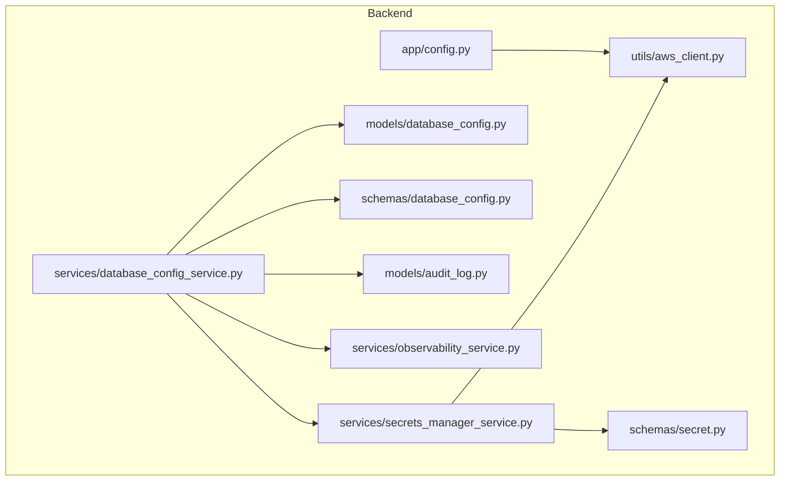
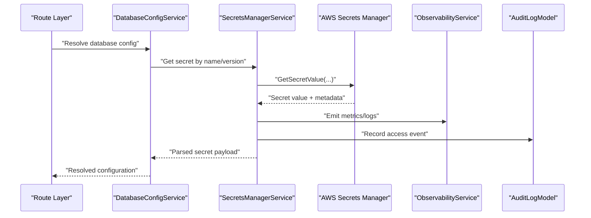
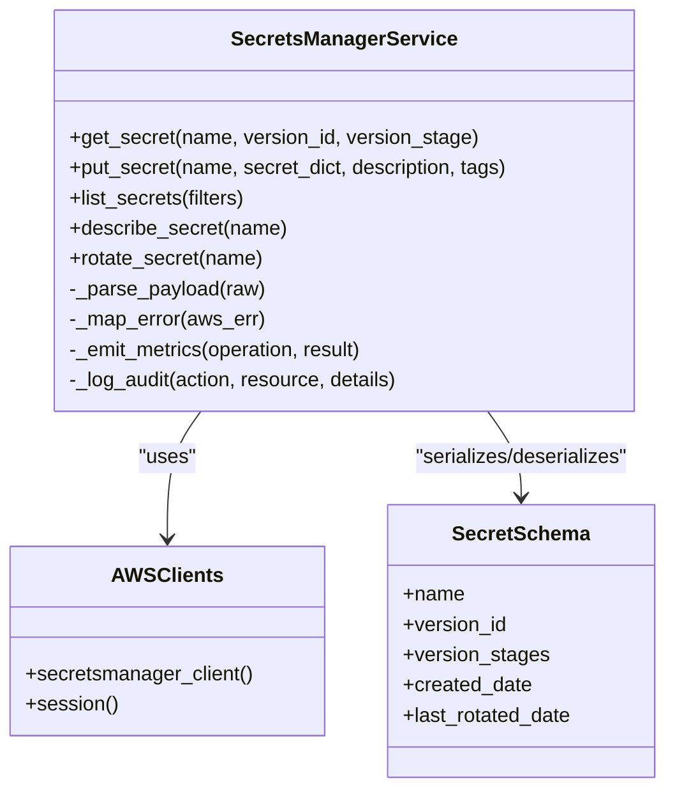
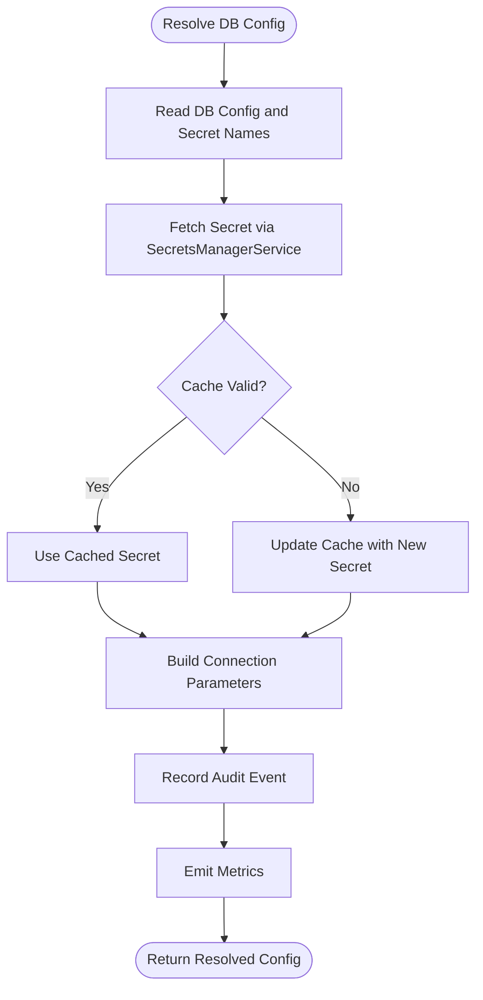
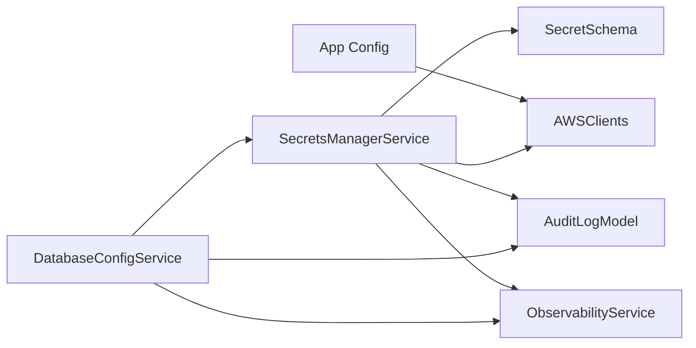

# Secrets Manager Integration

<cite>
**Referenced Files in This Document**
- [secrets_manager_service.py](file://backend/app/services/secrets_manager_service.py)
- [secret.py](file://backend/app/schemas/secret.py)
- [aws_client.py](file://backend/app/utils/aws_client.py)
- [database_config_service.py](file://backend/app/services/database_config_service.py)
- [database_config.py](file://backend/app/models/database_config.py)
- [database_config.py](file://backend/app/schemas/database_config.py)
- [audit_log.py](file://backend/app/models/audit_log.py)
- [observability_service.py](file://backend/app/services/observability_service.py)
- [config.py](file://backend/app/config.py)
</cite>

## Table of Contents
1. [Introduction](#introduction)
2. [Project Structure](#project-structure)
3. [Core Components](#core-components)
4. [Architecture Overview](#architecture-overview)
5. [Detailed Component Analysis](#detailed-component-analysis)
6. [Dependency Analysis](#dependency-analysis)
7. [Performance Considerations](#performance-considerations)
8. [Troubleshooting Guide](#troubleshooting-guide)
9. [Conclusion](#conclusion)
10. [Appendices](#appendices)

## Introduction
This document explains how CloudBridge integrates with AWS Secrets Manager to securely store, retrieve, and rotate secrets for database connections and API keys. It covers secret versioning, access policies, audit logging, rotation schedules, backup strategies, disaster recovery, integration examples, security best practices (encryption at rest and in transit), access control, performance considerations (caching), and monitoring usage patterns.

## Project Structure
CloudBridge implements Secrets Manager integration primarily through a dedicated service layer, schema definitions, and an AWS client utility. Database configuration components consume secrets via the service layer. Observability and audit models support compliance requirements.

**Diagram sources**
- [secrets_manager_service.py](file://backend/app/services/secrets_manager_service.py)
- [secret.py](file://backend/app/schemas/secret.py)
- [aws_client.py](file://backend/app/utils/aws_client.py)
- [database_config_service.py](file://backend/app/services/database_config_service.py)
- [database_config.py](file://backend/app/models/database_config.py)
- [database_config.py](file://backend/app/schemas/database_config.py)
- [audit_log.py](file://backend/app/models/audit_log.py)
- [observability_service.py](file://backend/app/services/observability_service.py)
- [config.py](file://backend/app/config.py)

**Section sources**
- [secrets_manager_service.py](file://backend/app/services/secrets_manager_service.py)
- [secret.py](file://backend/app/schemas/secret.py)
- [aws_client.py](file://backend/app/utils/aws_client.py)
- [database_config_service.py](file://backend/app/services/database_config_service.py)
- [database_config.py](file://backend/app/models/database_config.py)
- [database_config.py](file://backend/app/schemas/database_config.py)
- [audit_log.py](file://backend/app/models/audit_log.py)
- [observability_service.py](file://backend/app/services/observability_service.py)
- [config.py](file://backend/app/config.py)

## Core Components
- Secrets Manager Service: Encapsulates all interactions with AWS Secrets Manager, including get, put, list, and rotate operations. It handles parsing JSON payloads, versioning, and error mapping.
- Secret Schema: Defines request/response structures for secret metadata and values used by routes and services.
- AWS Client Utility: Provides configured AWS clients and session management for Secrets Manager calls.
- Database Config Service: Consumes secrets to build database connection configurations and manages lifecycle events that trigger rotation or updates.
- Audit Log Model: Persists audit entries for compliance tracking of secret access and changes.
- Observability Service: Emits metrics and logs for secret retrieval and rotation activities.
- App Configuration: Centralizes environment-specific settings such as region, cache TTL, and feature flags.

**Section sources**
- [secrets_manager_service.py](file://backend/app/services/secrets_manager_service.py)
- [secret.py](file://backend/app/schemas/secret.py)
- [aws_client.py](file://backend/app/utils/aws_client.py)
- [database_config_service.py](file://backend/app/services/database_config_service.py)
- [audit_log.py](file://backend/app/models/audit_log.py)
- [observability_service.py](file://backend/app/services/observability_service.py)
- [config.py](file://backend/app/config.py)

## Architecture Overview
The integration follows a layered architecture:
- Routes call into service layers.
- The Secrets Manager Service uses the AWS Client Utility to interact with AWS Secrets Manager.
- Database Config Service reads secrets to construct runtime configurations.
- Observability and Audit components record usage and changes for compliance.

**Diagram sources**
- [database_config_service.py](file://backend/app/services/database_config_service.py)
- [secrets_manager_service.py](file://backend/app/services/secrets_manager_service.py)
- [aws_client.py](file://backend/app/utils/aws_client.py)
- [observability_service.py](file://backend/app/services/observability_service.py)
- [audit_log.py](file://backend/app/models/audit_log.py)

## Detailed Component Analysis

### Secrets Manager Service
Responsibilities:
- Retrieve secrets by name and optional version or stage.
- Create/update secrets with structured JSON payloads.
- List and describe secrets with metadata.
- Trigger rotation workflows and handle rotation status checks.
- Parse and validate secret payloads; map AWS errors to application exceptions.
- Emit observability signals and log audit events for each operation.

Key behaviors:
- Versioning: Supports retrieving specific versions or stages; returns version metadata when available.
- Rotation: Integrates with AWS rotation mechanisms; exposes helpers to check rotation progress and force rotation if needed.
- Error handling: Normalizes AWS exceptions and provides actionable messages.

**Diagram sources**
- [secrets_manager_service.py](file://backend/app/services/secrets_manager_service.py)
- [secret.py](file://backend/app/schemas/secret.py)
- [aws_client.py](file://backend/app/utils/aws_client.py)

**Section sources**
- [secrets_manager_service.py](file://backend/app/services/secrets_manager_service.py)
- [secret.py](file://backend/app/schemas/secret.py)
- [aws_client.py](file://backend/app/utils/aws_client.py)

### Database Config Service Integration
Responsibilities:
- Resolve database credentials from Secrets Manager.
- Build connection parameters using retrieved secrets.
- Handle fallbacks and caching decisions based on configuration.
- Record audit events and emit metrics for secret resolution.

Integration points:
- Reads secret names from configuration or stored database configs.
- Calls Secrets Manager Service to fetch latest or versioned secrets.
- Updates internal state and notifies dependent subsystems.

**Diagram sources**
- [database_config_service.py](file://backend/app/services/database_config_service.py)
- [secrets_manager_service.py](file://backend/app/services/secrets_manager_service.py)
- [audit_log.py](file://backend/app/models/audit_log.py)
- [observability_service.py](file://backend/app/services/observability_service.py)

**Section sources**
- [database_config_service.py](file://backend/app/services/database_config_service.py)
- [database_config.py](file://backend/app/models/database_config.py)
- [database_config.py](file://backend/app/schemas/database_config.py)
- [audit_log.py](file://backend/app/models/audit_log.py)
- [observability_service.py](file://backend/app/services/observability_service.py)

### Secret Schema
Defines the structure for secret metadata and values used across services and routes. Includes fields for name, version identifiers, timestamps, and descriptive metadata.

**Section sources**
- [secret.py](file://backend/app/schemas/secret.py)

### AWS Client Utility
Provides configured AWS sessions and clients, centralizing region, credentials, retries, and endpoint overrides. Used by Secrets Manager Service to make AWS API calls.

**Section sources**
- [aws_client.py](file://backend/app/utils/aws_client.py)

### Observability and Audit
- Observability Service: Emits metrics and structured logs for secret operations (get, put, rotate).
- Audit Log Model: Persists immutable records of who did what, when, and which secret was affected.

**Section sources**
- [observability_service.py](file://backend/app/services/observability_service.py)
- [audit_log.py](file://backend/app/models/audit_log.py)

### Application Configuration
Centralizes environment variables and defaults for AWS region, cache TTL, rotation schedule hints, and feature toggles consumed by services.

**Section sources**
- [config.py](file://backend/app/config.py)

## Dependency Analysis
High-level dependencies between core modules:

**Diagram sources**
- [database_config_service.py](file://backend/app/services/database_config_service.py)
- [secrets_manager_service.py](file://backend/app/services/secrets_manager_service.py)
- [aws_client.py](file://backend/app/utils/aws_client.py)
- [secret.py](file://backend/app/schemas/secret.py)
- [audit_log.py](file://backend/app/models/audit_log.py)
- [observability_service.py](file://backend/app/services/observability_service.py)
- [config.py](file://backend/app/config.py)

**Section sources**
- [database_config_service.py](file://backend/app/services/database_config_service.py)
- [secrets_manager_service.py](file://backend/app/services/secrets_manager_service.py)
- [aws_client.py](file://backend/app/utils/aws_client.py)
- [secret.py](file://backend/app/schemas/secret.py)
- [audit_log.py](file://backend/app/models/audit_log.py)
- [observability_service.py](file://backend/app/services/observability_service.py)
- [config.py](file://backend/app/config.py)

## Performance Considerations
- Secret Caching:
  - Cache recently retrieved secrets in memory with a configurable TTL to reduce AWS API calls.
  - Invalidate cache on successful rotations or explicit invalidation requests.
  - Consider per-process caches for low-latency access within the same process.
- Concurrency:
  - Ensure thread-safe cache access and idempotent secret fetches.
  - Avoid holding long-lived references to large secret payloads beyond necessary.
- Network Efficiency:
  - Reuse AWS clients and sessions to minimize connection overhead.
  - Enable appropriate retry/backoff policies for transient failures.
- Monitoring:
  - Track latency and error rates for secret retrieval and rotation.
  - Alert on high failure rates or unexpected increases in API calls.

[No sources needed since this section provides general guidance]

## Troubleshooting Guide
Common issues and resolutions:
- Access Denied:
  - Verify IAM permissions for the executing role to GetSecretValue, PutSecretValue, DescribeSecret, and RotateSecretAlias as applicable.
  - Check KMS key policies if using customer-managed keys.
- Secret Not Found:
  - Confirm secret name and region; ensure the correct alias or version is referenced.
- Rotation Failures:
  - Inspect rotation Lambda logs (if used) and rotation status in Secrets Manager.
  - Validate that the target resource accepts new credentials and can roll back safely.
- High Latency:
  - Review cache TTL and hit rate; adjust based on workload patterns.
  - Check network connectivity and AWS endpoint availability.
- Compliance Gaps:
  - Ensure audit logs are persisted and retained per policy.
  - Verify that all secret accesses are logged with user context and timestamps.

**Section sources**
- [secrets_manager_service.py](file://backend/app/services/secrets_manager_service.py)
- [audit_log.py](file://backend/app/models/audit_log.py)
- [observability_service.py](file://backend/app/services/observability_service.py)

## Conclusion
CloudBridge’s Secrets Manager integration provides secure, auditable, and observable access to sensitive configuration data. By leveraging versioning, rotation, caching, and comprehensive logging/metrics, it supports robust operational practices and compliance requirements. Follow the recommended security and performance guidelines to maintain resilience and efficiency.

[No sources needed since this section summarizes without analyzing specific files]

## Appendices

### Security Best Practices
- Encryption:
  - At Rest: Rely on AWS Secrets Manager encryption using AWS KMS. Prefer customer-managed keys for granular control.
  - In Transit: All AWS SDK calls use TLS by default; ensure endpoints are not overridden to insecure locations.
- Access Control:
  - Apply least-privilege IAM policies scoped to specific secret ARNs.
  - Use resource-based policies and key policies to restrict access further.
- Rotation:
  - Enable automatic rotation where supported; define rotation schedules aligned with organizational policy.
  - Test rotation thoroughly in non-production environments before enabling in production.
- Backup and Disaster Recovery:
  - Cross-region replication of secrets may be enabled depending on compliance needs.
  - Maintain documented runbooks for restoring secrets from backups and recovering from rotation failures.
- Audit and Compliance:
  - Persist audit logs with tamper-evident storage.
  - Integrate with centralized logging and SIEM solutions for alerting and reporting.

[No sources needed since this section provides general guidance]

### Example Integrations

- Database Connections:
  - Store connection strings or structured credentials in Secrets Manager.
  - Configure Database Config Service to resolve secrets at startup and on rotation.
  - Reference secret names in database configuration records.

- Application Settings:
  - Keep API keys and tokens in Secrets Manager; load them via the Secrets Manager Service during initialization.
  - Use environment variables only for non-sensitive configuration.

- External Service Credentials:
  - Centralize third-party API keys under consistent naming conventions.
  - Use aliases and version stages to manage rollout and rollback safely.

[No sources needed since this section provides general guidance]