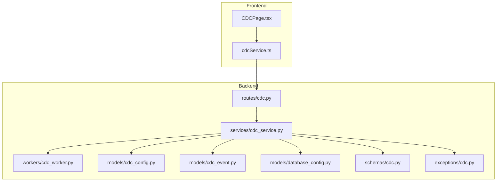
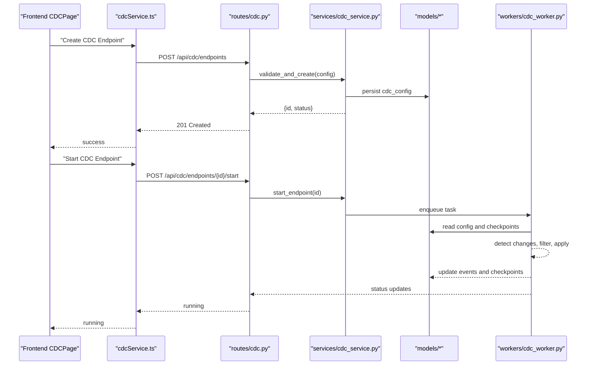
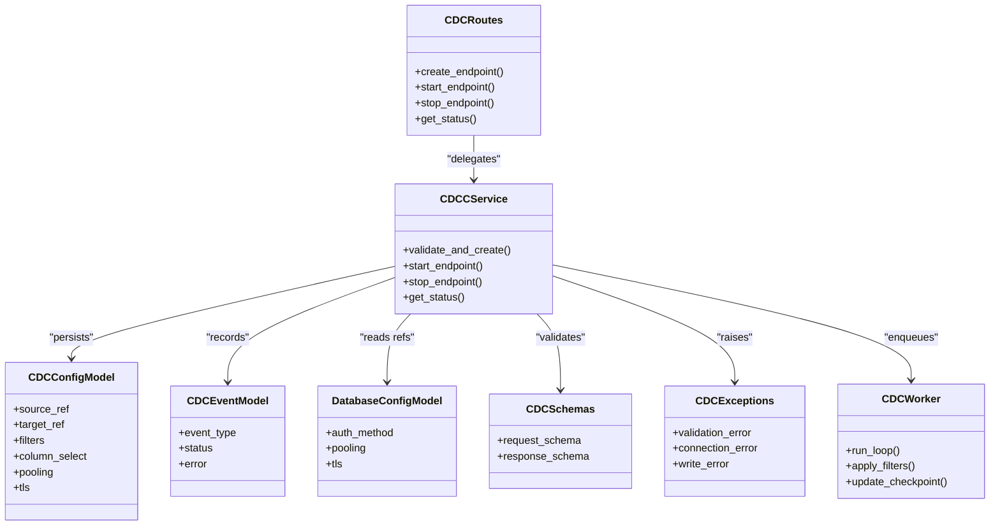

# CDC Setup and Configuration

<cite>
**Referenced Files in This Document**
- [cdc_config.py](file://backend/app/models/cdc_config.py)
- [cdc_event.py](file://backend/app/models/cdc_event.py)
- [database_config.py](file://backend/app/models/database_config.py)
- [cdc.py](file://backend/app/routes/cdc.py)
- [cdc_service.py](file://backend/app/services/cdc_service.py)
- [cdc_worker.py](file://backend/app/workers/cdc_worker.py)
- [cdc.py](file://backend/app/exceptions/cdc.py)
- [cdc.py](file://backend/app/schemas/cdc.py)
- [CDCPage.tsx](file://frontend/src/pages/CDCPage.tsx)
- [cdcService.ts](file://frontend/src/services/cdcService.ts)
</cite>

## Table of Contents
1. [Introduction](#introduction)
2. [Project Structure](#project-structure)
3. [Core Components](#core-components)
4. [Architecture Overview](#architecture-overview)
5. [Detailed Component Analysis](#detailed-component-analysis)
6. [Dependency Analysis](#dependency-analysis)
7. [Performance Considerations](#performance-considerations)
8. [Troubleshooting Guide](#troubleshooting-guide)
9. [Conclusion](#conclusion)
10. [Appendices](#appendices)

## Introduction
This document explains how to set up and configure Change Data Capture (CDC) in CloudBridge. It covers source and target database connections, CDC endpoint definitions, change detection rules, filtering options, table selection criteria, column-level synchronization settings, authentication methods, connection pooling, SSL/TLS configuration, practical scenarios, validation rules, best practices, and troubleshooting guidance. The goal is to help you reliably replicate data changes from a source database to a target with minimal operational overhead.

## Project Structure
CloudBridge implements CDC across backend models, services, routes, workers, exceptions, schemas, and frontend pages/services. The key areas are:
- Models for CDC configuration and events
- Database configuration model for source/target connectivity
- API routes and service layer for CDC lifecycle management
- Background worker for continuous capture and delivery
- Exception handling and schema validation
- Frontend UI and client service for CDC operations

**Diagram sources**
- [cdc.py](file://backend/app/routes/cdc.py)
- [cdc_service.py](file://backend/app/services/cdc_service.py)
- [cdc_worker.py](file://backend/app/workers/cdc_worker.py)
- [cdc_config.py](file://backend/app/models/cdc_config.py)
- [cdc_event.py](file://backend/app/models/cdc_event.py)
- [database_config.py](file://backend/app/models/database_config.py)
- [cdc.py](file://backend/app/schemas/cdc.py)
- [cdc.py](file://backend/app/exceptions/cdc.py)
- [CDCPage.tsx](file://frontend/src/pages/CDCPage.tsx)
- [cdcService.ts](file://frontend/src/services/cdcService.ts)

**Section sources**
- [cdc.py](file://backend/app/routes/cdc.py)
- [cdc_service.py](file://backend/app/services/cdc_service.py)
- [cdc_worker.py](file://backend/app/workers/cdc_worker.py)
- [cdc_config.py](file://backend/app/models/cdc_config.py)
- [cdc_event.py](file://backend/app/models/cdc_event.py)
- [database_config.py](file://backend/app/models/database_config.py)
- [cdc.py](file://backend/app/schemas/cdc.py)
- [cdc.py](file://backend/app/exceptions/cdc.py)
- [CDCPage.tsx](file://frontend/src/pages/CDCPage.tsx)
- [cdcService.ts](file://frontend/src/services/cdcService.ts)

## Core Components
- CDC configuration model: defines endpoints, filters, scheduling, and persistence metadata.
- CDC event model: records captured change events and their processing status.
- Database configuration model: encapsulates source/target connection parameters including authentication and TLS.
- CDC routes: expose REST endpoints for creating, updating, validating, starting, stopping, and monitoring CDC jobs.
- CDC service: orchestrates validation, persistence, worker dispatch, and status aggregation.
- CDC worker: runs the capture loop, applies change detection rules, filters, and writes to the target.
- Schemas: request/response validation for CDC APIs.
- Exceptions: domain-specific error types for CDC failures.
- Frontend page and service: provide UI and client calls for CDC management.

Key responsibilities:
- Validate CDC configurations against schemas and business rules.
- Manage lifecycle of CDC endpoints (create/start/stop/delete).
- Persist configuration and events.
- Execute background tasks for continuous replication.
- Expose observability via status and metrics.

**Section sources**
- [cdc_config.py](file://backend/app/models/cdc_config.py)
- [cdc_event.py](file://backend/app/models/cdc_event.py)
- [database_config.py](file://backend/app/models/database_config.py)
- [cdc.py](file://backend/app/routes/cdc.py)
- [cdc_service.py](file://backend/app/services/cdc_service.py)
- [cdc_worker.py](file://backend/app/workers/cdc_worker.py)
- [cdc.py](file://backend/app/schemas/cdc.py)
- [cdc.py](file://backend/app/exceptions/cdc.py)
- [CDCPage.tsx](file://frontend/src/pages/CDCPage.tsx)
- [cdcService.ts](file://frontend/src/services/cdcService.ts)

## Architecture Overview
The CDC architecture separates concerns between API, service orchestration, background execution, and storage.

**Diagram sources**
- [cdc.py](file://backend/app/routes/cdc.py)
- [cdc_service.py](file://backend/app/services/cdc_service.py)
- [cdc_worker.py](file://backend/app/workers/cdc_worker.py)
- [cdc_config.py](file://backend/app/models/cdc_config.py)
- [cdc_event.py](file://backend/app/models/cdc_event.py)
- [database_config.py](file://backend/app/models/database_config.py)
- [CDCPage.tsx](file://frontend/src/pages/CDCPage.tsx)
- [cdcService.ts](file://frontend/src/services/cdcService.ts)

## Detailed Component Analysis

### CDC Configuration Model
Responsibilities:
- Define CDC endpoint identity and scope (source/target references).
- Specify change detection strategy, filters, and table/column selections.
- Store scheduling, retry, and checkpointing behavior.
- Track lifecycle state and audit fields.

Configuration categories:
- Source and target references: link to database configurations.
- Change detection rules: define what constitutes a change (e.g., row-level DML).
- Filtering options: include/exclude tables, rows, or columns based on conditions.
- Column-level synchronization: select specific columns to replicate.
- Connection pooling and TLS: reuse connections securely.
- Checkpointing and resumption: track last processed positions.

Best practices:
- Prefer narrow column sets to reduce payload size.
- Use table-level includes first, then refine with row filters.
- Enable idempotent writes at the target to tolerate retries.
- Keep polling intervals reasonable to balance latency and load.

**Section sources**
- [cdc_config.py](file://backend/app/models/cdc_config.py)

### CDC Event Model
Responsibilities:
- Record each captured change event with metadata (type, timestamp, keys).
- Track processing state (pending, applied, failed) and error details.
- Support replay and reconciliation by referencing checkpoints.

Operational notes:
- Events should be append-only and durable.
- Failed events can be retried with backoff and dead-letter handling.

**Section sources**
- [cdc_event.py](file://backend/app/models/cdc_event.py)

### Database Configuration Model
Responsibilities:
- Encapsulate connection parameters for both source and target databases.
- Provide authentication method selection (e.g., username/password, IAM, secrets).
- Configure connection pooling (min/max, timeouts).
- Enable SSL/TLS with certificate verification options.

Security considerations:
- Store credentials via secrets manager when available.
- Enforce TLS for all external connections.
- Restrict permissions to least privilege.

**Section sources**
- [database_config.py](file://backend/app/models/database_config.py)

### CDC Routes
Responsibilities:
- Expose endpoints for CRUD on CDC endpoints.
- Start/stop/restart CDC jobs.
- Validate configurations before creation.
- Query status, logs, and recent events.

Typical flows:
- Create endpoint: validate schema, persist config, return ID.
- Start endpoint: enqueue worker task, return initial status.
- Stop endpoint: signal worker to halt gracefully.
- Health/status: aggregate current state and counters.

**Section sources**
- [cdc.py](file://backend/app/routes/cdc.py)

### CDC Service
Responsibilities:
- Orchestrate validation using schemas and business rules.
- Manage persistence of CDC configs and events.
- Dispatch work to the background worker.
- Aggregate status and metrics for reporting.

Validation highlights:
- Ensure source/target references exist and are reachable.
- Verify filters and table/column selections are valid.
- Confirm TLS and auth settings are consistent.

**Section sources**
- [cdc_service.py](file://backend/app/services/cdc_service.py)

### CDC Worker
Responsibilities:
- Run the capture loop for a given CDC endpoint.
- Apply change detection rules and filters.
- Read checkpoints and resume safely after restarts.
- Write events and update target state.

Processing logic:
- Initialize connections using configured pooling and TLS.
- Poll or subscribe to source changes.
- Filter rows and columns per configuration.
- Apply changes to target with idempotency.
- Update checkpoints and handle errors with retries.

**Section sources**
- [cdc_worker.py](file://backend/app/workers/cdc_worker.py)

### CDC Schemas
Responsibilities:
- Define request/response shapes for CDC APIs.
- Enforce required fields, enums, and constraints.
- Provide clear error messages for invalid inputs.

Common validations:
- Required fields for source/target references.
- Allowed values for change detection strategies.
- Valid ranges for timeouts and pool sizes.

**Section sources**
- [cdc.py](file://backend/app/schemas/cdc.py)

### CDC Exceptions
Responsibilities:
- Define domain-specific errors for CDC operations.
- Provide structured error codes and messages.
- Facilitate client-side handling and logging.

Examples:
- Invalid configuration.
- Authentication failure.
- Target write conflict.
- Network or TLS errors.

**Section sources**
- [cdc.py](file://backend/app/exceptions/cdc.py)

### Frontend CDC Page and Service
Responsibilities:
- Present forms to create/edit CDC endpoints.
- Display status, logs, and events.
- Call backend APIs for lifecycle management.

User workflows:
- Create endpoint with source/target selection and filters.
- Start/stop jobs and monitor progress.
- View recent events and errors.

**Section sources**
- [CDCPage.tsx](file://frontend/src/pages/CDCPage.tsx)
- [cdcService.ts](file://frontend/src/services/cdcService.ts)

## Dependency Analysis
High-level dependencies among components:

**Diagram sources**
- [cdc.py](file://backend/app/routes/cdc.py)
- [cdc_service.py](file://backend/app/services/cdc_service.py)
- [cdc_worker.py](file://backend/app/workers/cdc_worker.py)
- [cdc_config.py](file://backend/app/models/cdc_config.py)
- [cdc_event.py](file://backend/app/models/cdc_event.py)
- [database_config.py](file://backend/app/models/database_config.py)
- [cdc.py](file://backend/app/schemas/cdc.py)
- [cdc.py](file://backend/app/exceptions/cdc.py)

**Section sources**
- [cdc.py](file://backend/app/routes/cdc.py)
- [cdc_service.py](file://backend/app/services/cdc_service.py)
- [cdc_worker.py](file://backend/app/workers/cdc_worker.py)
- [cdc_config.py](file://backend/app/models/cdc_config.py)
- [cdc_event.py](file://backend/app/models/cdc_event.py)
- [database_config.py](file://backend/app/models/database_config.py)
- [cdc.py](file://backend/app/schemas/cdc.py)
- [cdc.py](file://backend/app/exceptions/cdc.py)

## Performance Considerations
- Connection pooling: tune min/max pools and timeouts to match workload; avoid over-provisioning.
- Change detection: prefer incremental mechanisms where supported; batch reads to reduce load.
- Filtering: push down filters to the source when possible to minimize network transfer.
- Column selection: limit replicated columns to those needed downstream.
- Checkpointing: frequent but not excessive checkpoint writes to balance durability and performance.
- Backpressure: implement rate limiting and retry backoff to protect source/target systems.
- Idempotency: design target writes to be safe under retries and partial failures.

[No sources needed since this section provides general guidance]

## Troubleshooting Guide
Common issues and resolutions:
- Authentication failures: verify credentials, scopes, and secret access; ensure TLS certificates are trusted.
- Connection errors: check network reachability, firewall rules, and port exposure; validate pooling limits.
- Validation errors: review schema constraints and required fields; correct invalid enum values or ranges.
- Filter mismatches: confirm table names and column selections exist; test filters with sample queries.
- Target write conflicts: enable idempotent operations; resolve primary key collisions; inspect error logs.
- Stalled workers: check checkpoint progression; restart worker if necessary; investigate source availability.

Operational tips:
- Use health and status endpoints to monitor job states.
- Inspect recent events for error patterns and counts.
- Enable detailed logging during setup and disable in production for performance.

**Section sources**
- [cdc.py](file://backend/app/exceptions/cdc.py)
- [cdc_service.py](file://backend/app/services/cdc_service.py)
- [cdc_worker.py](file://backend/app/workers/cdc_worker.py)

## Conclusion
CloudBridge’s CDC implementation provides a robust framework for reliable data replication. By carefully configuring source/target connections, applying precise filters and column selections, and leveraging secure authentication and TLS, you can achieve efficient and resilient change synchronization. Follow the best practices and troubleshooting steps outlined here to maintain healthy CDC pipelines.

[No sources needed since this section summarizes without analyzing specific files]

## Appendices

### Practical Scenarios

- Single-direction sync
  - Define a single source and target reference.
  - Select tables and columns to replicate.
  - Start the endpoint and monitor status.

- Selective table replication
  - Include only required tables.
  - Exclude large or unnecessary tables.
  - Validate that foreign key relationships remain consistent.

- Conditional data filtering
  - Add row-level filters (e.g., region or status).
  - Combine with column selection to minimize payloads.
  - Test filters thoroughly before enabling production traffic.

[No sources needed since this section provides conceptual examples]

### Configuration Parameters Reference

- Source and target references
  - Purpose: identify connected databases.
  - Notes: must be valid and reachable.

- Change detection rules
  - Purpose: specify how changes are detected.
  - Notes: choose strategies compatible with your source.

- Filtering options
  - Purpose: include/exclude tables and rows.
  - Notes: prefer server-side filters when available.

- Column-level synchronization
  - Purpose: select specific columns to replicate.
  - Notes: reduces bandwidth and storage.

- Authentication methods
  - Purpose: secure credential handling.
  - Notes: use secrets manager and least privilege.

- Connection pooling
  - Purpose: manage concurrent connections efficiently.
  - Notes: tune based on expected throughput.

- SSL/TLS setup
  - Purpose: encrypt data in transit.
  - Notes: enforce certificate verification.

- Checkpointing and resumption
  - Purpose: resume after restarts.
  - Notes: balance frequency vs. overhead.

[No sources needed since this section provides general guidance]