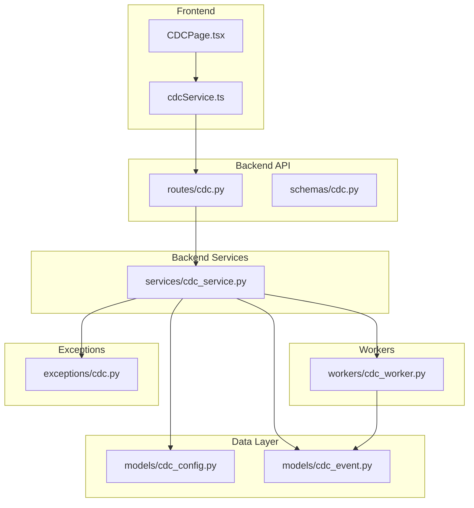
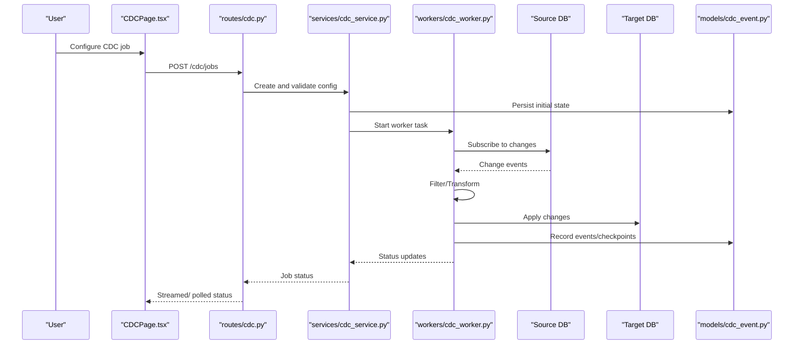
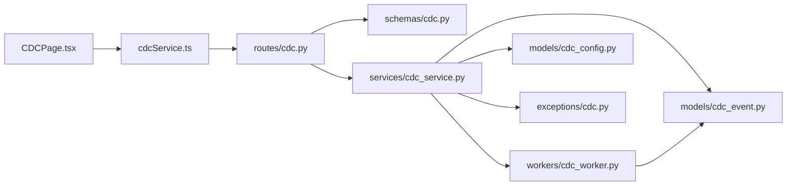
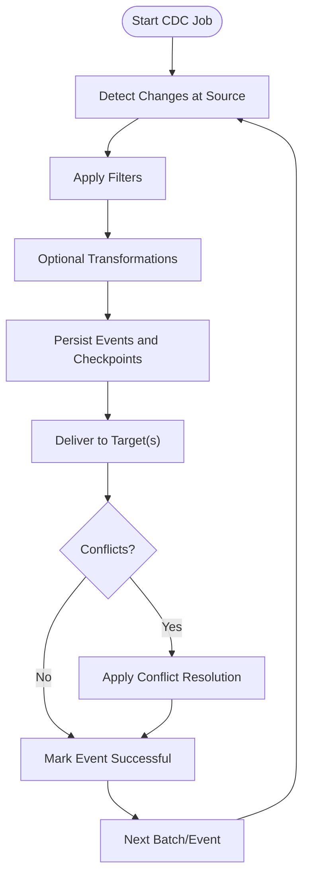

# Change Data Capture

<cite>
**Referenced Files in This Document**
- [cdc.py](file://backend/app/routes/cdc.py)
- [cdc_service.py](file://backend/app/services/cdc_service.py)
- [cdc_worker.py](file://backend/app/workers/cdc_worker.py)
- [cdc_config.py](file://backend/app/models/cdc_config.py)
- [cdc_event.py](file://backend/app/models/cdc_event.py)
- [cdc.py](file://backend/app/exceptions/cdc.py)
- [cdc.py](file://backend/app/schemas/cdc.py)
- [CDCPage.tsx](file://frontend/src/pages/CDCPage.tsx)
- [cdcService.ts](file://frontend/src/services/cdcService.ts)
</cite>

## Table of Contents
1. [Introduction](#introduction)
2. [Project Structure](#project-structure)
3. [Core Components](#core-components)
4. [Architecture Overview](#architecture-overview)
5. [Detailed Component Analysis](#detailed-component-analysis)
6. [Dependency Analysis](#dependency-analysis)
7. [Performance Considerations](#performance-considerations)
8. [Troubleshooting Guide](#troubleshooting-guide)
9. [Conclusion](#conclusion)
10. [Appendices](#appendices)

## Introduction
This document explains the Change Data Capture (CDC) functionality in CloudBridge, focusing on how real-time data synchronization works across different database systems. It covers CDC principles, configuration for source and target databases, change detection rules, filtering options, event processing pipeline, conflict resolution strategies, error handling, performance optimization, scaling considerations, monitoring approaches, practical scenarios, troubleshooting, and tuning recommendations.

## Project Structure
CloudBridge implements CDC as a backend service with REST APIs, background workers, models, schemas, exceptions, and a frontend UI. The key areas are:
- API routes for CDC management
- Service layer orchestrating CDC operations
- Worker processes executing capture and delivery tasks
- Models representing CDC configurations and events
- Schemas for request/response validation
- Exceptions for CDC-specific errors
- Frontend pages and services to manage CDC from the UI

**Diagram sources**
- [cdc.py](file://backend/app/routes/cdc.py)
- [cdc_service.py](file://backend/app/services/cdc_service.py)
- [cdc_worker.py](file://backend/app/workers/cdc_worker.py)
- [cdc_config.py](file://backend/app/models/cdc_config.py)
- [cdc_event.py](file://backend/app/models/cdc_event.py)
- [cdc.py](file://backend/app/exceptions/cdc.py)
- [cdc.py](file://backend/app/schemas/cdc.py)
- [CDCPage.tsx](file://frontend/src/pages/CDCPage.tsx)
- [cdcService.ts](file://frontend/src/services/cdcService.ts)

**Section sources**
- [cdc.py](file://backend/app/routes/cdc.py)
- [cdc_service.py](file://backend/app/services/cdc_service.py)
- [cdc_worker.py](file://backend/app/workers/cdc_worker.py)
- [cdc_config.py](file://backend/app/models/cdc_config.py)
- [cdc_event.py](file://backend/app/models/cdc_event.py)
- [cdc.py](file://backend/app/exceptions/cdc.py)
- [cdc.py](file://backend/app/schemas/cdc.py)
- [CDCPage.tsx](file://frontend/src/pages/CDCPage.tsx)
- [cdcService.ts](file://frontend/src/services/cdcService.ts)

## Core Components
- CDC Routes: Expose endpoints to create, update, start, stop, and monitor CDC jobs; validate inputs using schemas.
- CDC Service: Implements business logic for CDC job lifecycle, configuration validation, and coordination between workers and persistence.
- CDC Worker: Executes long-running tasks such as capturing changes from sources and delivering them to targets, handling retries and checkpoints.
- CDC Config Model: Persists CDC job definitions including source/target connections, filters, and policies.
- CDC Event Model: Stores captured change events for auditability and replay.
- CDC Exceptions: Defines domain-specific errors for CDC operations.
- CDC Schemas: Pydantic-like structures for request/response validation.
- Frontend CDC Page and Service: Provide UI and client-side calls to manage CDC jobs.

**Section sources**
- [cdc.py](file://backend/app/routes/cdc.py)
- [cdc_service.py](file://backend/app/services/cdc_service.py)
- [cdc_worker.py](file://backend/app/workers/cdc_worker.py)
- [cdc_config.py](file://backend/app/models/cdc_config.py)
- [cdc_event.py](file://backend/app/models/cdc_event.py)
- [cdc.py](file://backend/app/exceptions/cdc.py)
- [cdc.py](file://backend/app/schemas/cdc.py)
- [CDCPage.tsx](file://frontend/src/pages/CDCPage.tsx)
- [cdcService.ts](file://frontend/src/services/cdcService.ts)

## Architecture Overview
The CDC architecture follows a producer-consumer pattern:
- Source connectors detect changes (inserts, updates, deletes) from configured databases.
- A worker process captures these changes, applies filters, transforms if needed, and persists events.
- Delivery logic writes events to target databases, applying conflict resolution and ensuring idempotency.
- The API exposes management endpoints; the frontend provides operational controls and status visibility.

**Diagram sources**
- [cdc.py](file://backend/app/routes/cdc.py)
- [cdc_service.py](file://backend/app/services/cdc_service.py)
- [cdc_worker.py](file://backend/app/workers/cdc_worker.py)
- [cdc_event.py](file://backend/app/models/cdc_event.py)

## Detailed Component Analysis

### CDC API Routes
Responsibilities:
- Define endpoints for CDC job CRUD, lifecycle control, and status retrieval.
- Validate payloads using schemas.
- Delegate orchestration to the service layer.

Key behaviors:
- Input validation via schemas ensures required fields like source/target identifiers and filters are present.
- Responses include job metadata and current status.

**Section sources**
- [cdc.py](file://backend/app/routes/cdc.py)
- [cdc.py](file://backend/app/schemas/cdc.py)

### CDC Service
Responsibilities:
- Implement CDC job creation, updates, start/stop, and monitoring.
- Coordinate worker lifecycle and persist configuration and events.
- Enforce business rules and preflight checks.

Key behaviors:
- Validates configuration against schemas before starting workers.
- Manages checkpoints and progress tracking.
- Handles errors by mapping to CDC-specific exceptions.

**Section sources**
- [cdc_service.py](file://backend/app/services/cdc_service.py)
- [cdc.py](file://backend/app/exceptions/cdc.py)

### CDC Worker
Responsibilities:
- Execute long-running capture and delivery tasks.
- Connect to source databases, subscribe to change streams, and apply transformations.
- Deliver changes to target databases with retry and idempotency guarantees.
- Persist events and checkpoints for recovery.

Key behaviors:
- Polling or streaming depending on source capabilities.
- Batch delivery with configurable throughput.
- Conflict resolution strategies applied during write-back.

**Section sources**
- [cdc_worker.py](file://backend/app/workers/cdc_worker.py)
- [cdc_event.py](file://backend/app/models/cdc_event.py)

### CDC Configuration Model
Responsibilities:
- Represent CDC job definitions including source/target connection details, filters, and policies.
- Persist schema versioning and migration compatibility metadata.

Key attributes:
- Source and target identifiers
- Filters (tables, columns, conditions)
- Policies (conflict resolution, batching, retries)

**Section sources**
- [cdc_config.py](file://backend/app/models/cdc_config.py)

### CDC Event Model
Responsibilities:
- Store individual change events with timestamps and metadata.
- Support auditing, replay, and debugging.

Key attributes:
- Event type (insert/update/delete)
- Source table/column references
- Payload snapshot or diff
- Processing status and error info

**Section sources**
- [cdc_event.py](file://backend/app/models/cdc_event.py)

### CDC Exceptions
Responsibilities:
- Define domain-specific errors for CDC operations (e.g., invalid configuration, connectivity issues, delivery failures).
- Provide structured error codes and messages for clients.

**Section sources**
- [cdc.py](file://backend/app/exceptions/cdc.py)

### CDC Schemas
Responsibilities:
- Validate incoming requests and outgoing responses.
- Ensure consistent structure for CDC job configuration and status.

**Section sources**
- [cdc.py](file://backend/app/schemas/cdc.py)

### Frontend CDC Page and Service
Responsibilities:
- Provide UI for creating, editing, starting/stopping CDC jobs.
- Display job status, logs, and metrics.
- Call backend APIs via typed service methods.

**Section sources**
- [CDCPage.tsx](file://frontend/src/pages/CDCPage.tsx)
- [cdcService.ts](file://frontend/src/services/cdcService.ts)

## Dependency Analysis
High-level dependencies:
- Routes depend on Schemas for validation and Service for orchestration.
- Service depends on Models for persistence and Workers for execution.
- Worker depends on Event model for persistence and external database drivers for capture/delivery.
- Frontend depends on API routes through the client service.

**Diagram sources**
- [cdc.py](file://backend/app/routes/cdc.py)
- [cdc_service.py](file://backend/app/services/cdc_service.py)
- [cdc_worker.py](file://backend/app/workers/cdc_worker.py)
- [cdc_config.py](file://backend/app/models/cdc_config.py)
- [cdc_event.py](file://backend/app/models/cdc_event.py)
- [cdc.py](file://backend/app/exceptions/cdc.py)
- [cdc.py](file://backend/app/schemas/cdc.py)
- [CDCPage.tsx](file://frontend/src/pages/CDCPage.tsx)
- [cdcService.ts](file://frontend/src/services/cdcService.ts)

**Section sources**
- [cdc.py](file://backend/app/routes/cdc.py)
- [cdc_service.py](file://backend/app/services/cdc_service.py)
- [cdc_worker.py](file://backend/app/workers/cdc_worker.py)
- [cdc_config.py](file://backend/app/models/cdc_config.py)
- [cdc_event.py](file://backend/app/models/cdc_event.py)
- [cdc.py](file://backend/app/exceptions/cdc.py)
- [cdc.py](file://backend/app/schemas/cdc.py)
- [CDCPage.tsx](file://frontend/src/pages/CDCPage.tsx)
- [cdcService.ts](file://frontend/src/services/cdcService.ts)

## Performance Considerations
- Batching: Group multiple change events into batches for efficient delivery to targets.
- Backpressure: Limit in-flight events per job to avoid overwhelming targets.
- Checkpointing: Persist offsets frequently to minimize replay cost after restarts.
- Filtering: Narrow down tables/columns/conditions at the source to reduce payload size.
- Connection pooling: Reuse database connections for both source and target.
- Idempotency: Use unique keys and upsert semantics to prevent duplicate writes.
- Scaling: Run multiple workers horizontally, partitioning by job or table.
- Monitoring: Track lag, throughput, and error rates to tune parameters.

[No sources needed since this section provides general guidance]

## Troubleshooting Guide
Common issues and resolutions:
- Connectivity failures: Verify credentials, network access, and firewall rules for source/target databases.
- Schema drift: Ensure target schema matches expected structure; use migrations or schema validation.
- Duplicate writes: Enable idempotent writes and deduplicate by primary keys.
- High latency: Reduce batch sizes, increase parallelism cautiously, and optimize filters.
- Stuck jobs: Inspect checkpoints and event queues; restart workers if necessary.
- Conflicts: Choose appropriate conflict resolution strategy (last-write-wins, custom merge, manual review).

Operational tips:
- Use event logs and checkpoints to replay failed segments.
- Monitor worker health and resource utilization.
- Alert on lag thresholds and error rate spikes.

**Section sources**
- [cdc.py](file://backend/app/exceptions/cdc.py)
- [cdc_event.py](file://backend/app/models/cdc_event.py)
- [cdc_worker.py](file://backend/app/workers/cdc_worker.py)

## Conclusion
CloudBridge’s CDC implementation provides a robust framework for real-time data synchronization across heterogeneous databases. By leveraging validated configurations, resilient workers, persistent events, and clear APIs, it supports common scenarios such as bi-directional sync, selective replication, and transformation. Proper tuning, monitoring, and conflict resolution ensure reliable operation at scale.

[No sources needed since this section summarizes without analyzing specific files]

## Appendices

### CDC Principles and Real-Time Sync
- CDC captures row-level changes near the source using native mechanisms where available.
- Changes are normalized into events and delivered to targets with ordering guarantees when possible.
- Filtering and transformation occur in the worker pipeline to tailor data flow.

[No sources needed since this section doesn't analyze specific files]

### CDC Configuration
- Source/Target Setup: Define connection parameters and capabilities.
- Change Detection Rules: Specify tables, columns, and conditions to capture.
- Filtering Options: Include/exclude rows based on predicates.
- Policies: Configure batching, retries, and conflict resolution.

**Section sources**
- [cdc_config.py](file://backend/app/models/cdc_config.py)
- [cdc.py](file://backend/app/schemas/cdc.py)

### Event Processing Pipeline

**Diagram sources**
- [cdc_worker.py](file://backend/app/workers/cdc_worker.py)
- [cdc_event.py](file://backend/app/models/cdc_event.py)

### Practical Scenarios
- Bi-directional Sync: Configure two CDC jobs with distinct conflict resolution and routing rules to synchronize changes between databases.
- Selective Table Replication: Use filters to replicate only required tables/columns, reducing bandwidth and load.
- Data Transformation During Sync: Apply field mappings, value normalization, or enrichment in the worker pipeline before delivery.

**Section sources**
- [cdc_service.py](file://backend/app/services/cdc_service.py)
- [cdc_worker.py](file://backend/app/workers/cdc_worker.py)
- [cdc_config.py](file://backend/app/models/cdc_config.py)

### Monitoring Approaches
- Metrics: Lag behind source, throughput, error counts, checkpoint frequency.
- Logs: Structured logs for each stage (detect, filter, transform, deliver).
- Alerts: Threshold-based alerts for lag and failure rates.
- Dashboards: Visualize job health and performance over time.

**Section sources**
- [cdc_event.py](file://backend/app/models/cdc_event.py)
- [cdc_worker.py](file://backend/app/workers/cdc_worker.py)