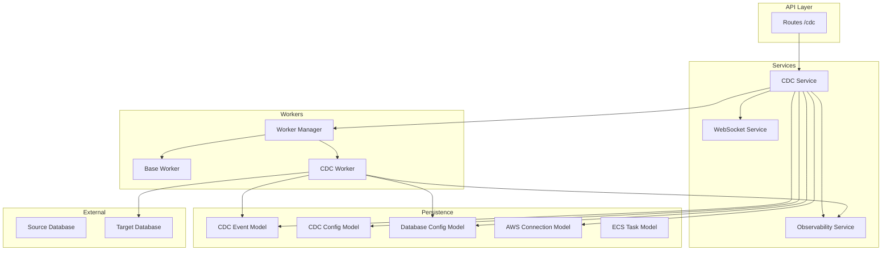
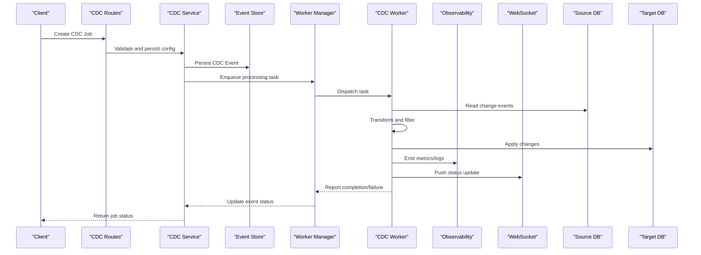
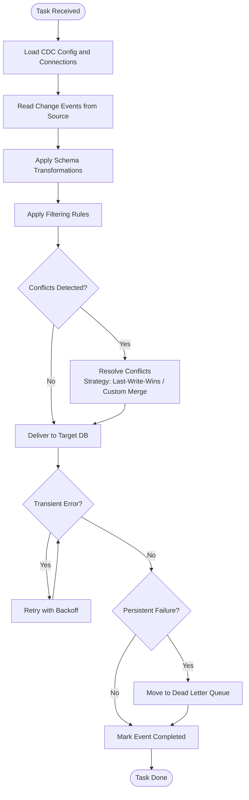
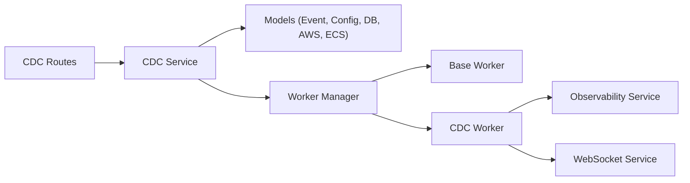

# Event Processing Pipeline

<cite>
**Referenced Files in This Document**
- [cdc_service.py](file://backend/app/services/cdc_service.py)
- [cdc_worker.py](file://backend/app/workers/cdc_worker.py)
- [base_worker.py](file://backend/app/workers/base_worker.py)
- [manager.py](file://backend/app/workers/manager.py)
- [cdc_event.py](file://backend/app/models/cdc_event.py)
- [cdc_config.py](file://backend/app/models/cdc_config.py)
- [cdc.py](file://backend/app/routes/cdc.py)
- [cdc.py](file://backend/app/exceptions/cdc.py)
- [cdc.py](file://backend/app/schemas/cdc.py)
- [database_config.py](file://backend/app/models/database_config.py)
- [aws_connection.py](file://backend/app/models/aws_connection.py)
- [ecs_task.py](file://backend/app/models/ecs_task.py)
- [observability_service.py](file://backend/app/services/observability_service.py)
- [websocket_service.py](file://backend/app/services/websocket_service.py)
</cite>

## Table of Contents
1. [Introduction](#introduction)
2. [Project Structure](#project-structure)
3. [Core Components](#core-components)
4. [Architecture Overview](#architecture-overview)
5. [Detailed Component Analysis](#detailed-component-analysis)
6. [Dependency Analysis](#dependency-analysis)
7. [Performance Considerations](#performance-considerations)
8. [Troubleshooting Guide](#troubleshooting-guide)
9. [Conclusion](#conclusion)

## Introduction
This document explains the CDC event processing pipeline in CloudBridge, covering how change events are captured from source databases, processed by workers, and delivered to target databases. It details the end-to-end lifecycle including capture, queuing, processing, delivery, conflict resolution, error handling and retries, dead letter queue management, schema and transformation rules, filtering, performance optimization, scaling strategies, and monitoring approaches for throughput and latency.

## Project Structure
The CDC pipeline spans services, models, workers, routes, schemas, exceptions, and observability components:
- Services orchestrate CDC configuration, event persistence, and integration with external systems.
- Workers implement background processing and delivery logic.
- Models define CDC events, configurations, and related entities.
- Routes expose APIs to manage CDC jobs and inspect status.
- Schemas validate inputs and outputs.
- Exceptions standardize error types.
- Observability and WebSocket services provide metrics and real-time updates.

**Diagram sources**
- [cdc.py](file://backend/app/routes/cdc.py)
- [cdc_service.py](file://backend/app/services/cdc_service.py)
- [manager.py](file://backend/app/workers/manager.py)
- [base_worker.py](file://backend/app/workers/base_worker.py)
- [cdc_worker.py](file://backend/app/workers/cdc_worker.py)
- [cdc_event.py](file://backend/app/models/cdc_event.py)
- [cdc_config.py](file://backend/app/models/cdc_config.py)
- [database_config.py](file://backend/app/models/database_config.py)
- [aws_connection.py](file://backend/app/models/aws_connection.py)
- [ecs_task.py](file://backend/app/models/ecs_task.py)
- [observability_service.py](file://backend/app/services/observability_service.py)
- [websocket_service.py](file://backend/app/services/websocket_service.py)

**Section sources**
- [cdc.py](file://backend/app/routes/cdc.py)
- [cdc_service.py](file://backend/app/services/cdc_service.py)
- [manager.py](file://backend/app/workers/manager.py)
- [base_worker.py](file://backend/app/workers/base_worker.py)
- [cdc_worker.py](file://backend/app/workers/cdc_worker.py)
- [cdc_event.py](file://backend/app/models/cdc_event.py)
- [cdc_config.py](file://backend/app/models/cdc_config.py)
- [database_config.py](file://backend/app/models/database_config.py)
- [aws_connection.py](file://backend/app/models/aws_connection.py)
- [ecs_task.py](file://backend/app/models/ecs_task.py)
- [observability_service.py](file://backend/app/services/observability_service.py)
- [websocket_service.py](file://backend/app/services/websocket_service.py)

## Core Components
- CDC Service: Orchestrates CDC job lifecycle, persists events and configs, coordinates worker execution, and integrates with observability and notifications.
- Worker Manager: Manages worker lifecycle, dispatches tasks, and tracks execution state.
- Base Worker: Provides shared behavior for task execution, logging, and error propagation.
- CDC Worker: Implements CDC-specific processing, including capture coordination, transformation, filtering, delivery, retry, and dead-letter handling.
- Models: CDC Event and CDC Config represent persisted state; Database Config and AWS Connection model connectivity; ECS Task represents remote execution context when applicable.
- API Routes: Expose endpoints to create, monitor, and control CDC jobs.
- Schemas: Validate request/response payloads for CDC operations.
- Exceptions: Define domain-specific errors for CDC failures.
- Observability and WebSocket: Emit metrics and stream live status updates.

**Section sources**
- [cdc_service.py](file://backend/app/services/cdc_service.py)
- [manager.py](file://backend/app/workers/manager.py)
- [base_worker.py](file://backend/app/workers/base_worker.py)
- [cdc_worker.py](file://backend/app/workers/cdc_worker.py)
- [cdc_event.py](file://backend/app/models/cdc_event.py)
- [cdc_config.py](file://backend/app/models/cdc_config.py)
- [database_config.py](file://backend/app/models/database_config.py)
- [aws_connection.py](file://backend/app/models/aws_connection.py)
- [ecs_task.py](file://backend/app/models/ecs_task.py)
- [cdc.py](file://backend/app/routes/cdc.py)
- [cdc.py](file://backend/app/schemas/cdc.py)
- [cdc.py](file://backend/app/exceptions/cdc.py)
- [observability_service.py](file://backend/app/services/observability_service.py)
- [websocket_service.py](file://backend/app/services/websocket_service.py)

## Architecture Overview
The CDC pipeline follows a producer-consumer pattern:
- Capture: Source database changes are detected and converted into CDC events.
- Persistence: Events are stored with metadata (source/target config, timestamps, status).
- Queuing: Tasks are enqueued for processing by workers.
- Processing: Workers apply transformations, enforce filters, resolve conflicts, and deliver to targets.
- Delivery: Changes are applied to target databases using configured connections.
- Observability: Metrics and logs are emitted; WebSocket streams push updates to clients.

**Diagram sources**
- [cdc.py](file://backend/app/routes/cdc.py)
- [cdc_service.py](file://backend/app/services/cdc_service.py)
- [manager.py](file://backend/app/workers/manager.py)
- [cdc_worker.py](file://backend/app/workers/cdc_worker.py)
- [observability_service.py](file://backend/app/services/observability_service.py)
- [websocket_service.py](file://backend/app/services/websocket_service.py)

## Detailed Component Analysis

### CDC Service
Responsibilities:
- Validates and persists CDC configurations and events.
- Coordinates worker scheduling and monitors progress.
- Integrates with observability and notification channels.
- Provides query interfaces for job status and history.

Key behaviors:
- Creates CDC jobs and initial event records.
- Triggers worker manager to enqueue tasks.
- Updates event states based on worker reports.
- Emits metrics for throughput and latency.

**Section sources**
- [cdc_service.py](file://backend/app/services/cdc_service.py)
- [cdc_event.py](file://backend/app/models/cdc_event.py)
- [cdc_config.py](file://backend/app/models/cdc_config.py)
- [observability_service.py](file://backend/app/services/observability_service.py)
- [websocket_service.py](file://backend/app/services/websocket_service.py)

### Worker Manager
Responsibilities:
- Maintains worker pool and dispatches tasks.
- Tracks task lifecycle and aggregates results.
- Handles worker health checks and restarts.

Key behaviors:
- Accepts tasks from CDC service.
- Assigns tasks to available workers.
- Persists task outcomes and triggers downstream updates.

**Section sources**
- [manager.py](file://backend/app/workers/manager.py)
- [base_worker.py](file://backend/app/workers/base_worker.py)

### Base Worker
Responsibilities:
- Provides common execution context, logging, and error handling.
- Standardizes task acknowledgment and reporting.

Key behaviors:
- Wraps task execution with try/except blocks.
- Records start/end times and error traces.
- Publishes status updates via WebSocket.

**Section sources**
- [base_worker.py](file://backend/app/workers/base_worker.py)
- [websocket_service.py](file://backend/app/services/websocket_service.py)

### CDC Worker
Responsibilities:
- Implements CDC-specific processing: capture, transform, filter, deliver.
- Applies conflict resolution strategies for concurrent updates.
- Manages retries and dead letter queue for failed deliveries.

Processing flow:
- Reads change events from source database using configured connection.
- Applies schema-based transformations and field-level filters.
- Resolves conflicts using configured strategy (e.g., last-write-wins or custom merge).
- Delivers changes to target database with idempotency safeguards.
- Retries transient failures with backoff; moves persistent failures to dead letter queue.
- Emits metrics and pushes real-time updates.

**Diagram sources**
- [cdc_worker.py](file://backend/app/workers/cdc_worker.py)
- [cdc_config.py](file://backend/app/models/cdc_config.py)
- [database_config.py](file://backend/app/models/database_config.py)
- [aws_connection.py](file://backend/app/models/aws_connection.py)
- [ecs_task.py](file://backend/app/models/ecs_task.py)

**Section sources**
- [cdc_worker.py](file://backend/app/workers/cdc_worker.py)
- [cdc_config.py](file://backend/app/models/cdc_config.py)
- [database_config.py](file://backend/app/models/database_config.py)
- [aws_connection.py](file://backend/app/models/aws_connection.py)
- [ecs_task.py](file://backend/app/models/ecs_task.py)

### Event Schema, Transformation, and Filtering
- Event Schema: Each CDC event includes identifiers, timestamps, operation type, source/target references, payload, and status fields.
- Transformations: Field mapping, type coercion, and enrichment based on CDC config.
- Filtering: Include/exclude tables/columns, conditional predicates, and redaction rules.

These capabilities are defined in CDC configuration and enforced during worker processing.

**Section sources**
- [cdc_event.py](file://backend/app/models/cdc_event.py)
- [cdc_config.py](file://backend/app/models/cdc_config.py)
- [cdc_worker.py](file://backend/app/workers/cdc_worker.py)

### Conflict Resolution Strategies
- Last-Write-Wins: Uses event timestamps to decide precedence.
- Custom Merge: Applies business-specific merging rules defined in CDC config.
- Idempotency: Ensures repeated deliveries do not duplicate changes.

**Section sources**
- [cdc_worker.py](file://backend/app/workers/cdc_worker.py)
- [cdc_config.py](file://backend/app/models/cdc_config.py)

### Error Handling, Retry Logic, and Dead Letter Queue
- Transient errors trigger exponential backoff retries.
- Persistent failures are moved to a dead letter queue for later inspection and replay.
- Errors are logged and surfaced via observability and WebSocket updates.

**Section sources**
- [cdc_worker.py](file://backend/app/workers/cdc_worker.py)
- [observability_service.py](file://backend/app/services/observability_service.py)
- [websocket_service.py](file://backend/app/services/websocket_service.py)

### API and Schemas
- Routes expose endpoints to create, list, and monitor CDC jobs.
- Schemas validate input payloads and responses for consistency.

**Section sources**
- [cdc.py](file://backend/app/routes/cdc.py)
- [cdc.py](file://backend/app/schemas/cdc.py)

### Exception Handling
- Domain-specific exceptions standardize error reporting across CDC operations.
- Exceptions are mapped to user-friendly messages and metrics.

**Section sources**
- [cdc.py](file://backend/app/exceptions/cdc.py)

## Dependency Analysis
The CDC pipeline exhibits clear separation between orchestration, processing, and persistence layers:
- Routes depend on CDC Service for validation and coordination.
- CDC Service depends on models for persistence and on Worker Manager for task dispatch.
- Worker Manager depends on Base Worker and CDC Worker implementations.
- CDC Worker depends on Database Config and AWS Connection models for connectivity.
- Observability and WebSocket services are used throughout for metrics and live updates.

**Diagram sources**
- [cdc.py](file://backend/app/routes/cdc.py)
- [cdc_service.py](file://backend/app/services/cdc_service.py)
- [manager.py](file://backend/app/workers/manager.py)
- [base_worker.py](file://backend/app/workers/base_worker.py)
- [cdc_worker.py](file://backend/app/workers/cdc_worker.py)
- [cdc_event.py](file://backend/app/models/cdc_event.py)
- [cdc_config.py](file://backend/app/models/cdc_config.py)
- [database_config.py](file://backend/app/models/database_config.py)
- [aws_connection.py](file://backend/app/models/aws_connection.py)
- [ecs_task.py](file://backend/app/models/ecs_task.py)
- [observability_service.py](file://backend/app/services/observability_service.py)
- [websocket_service.py](file://backend/app/services/websocket_service.py)

**Section sources**
- [cdc.py](file://backend/app/routes/cdc.py)
- [cdc_service.py](file://backend/app/services/cdc_service.py)
- [manager.py](file://backend/app/workers/manager.py)
- [base_worker.py](file://backend/app/workers/base_worker.py)
- [cdc_worker.py](file://backend/app/workers/cdc_worker.py)
- [cdc_event.py](file://backend/app/models/cdc_event.py)
- [cdc_config.py](file://backend/app/models/cdc_config.py)
- [database_config.py](file://backend/app/models/database_config.py)
- [aws_connection.py](file://backend/app/models/aws_connection.py)
- [ecs_task.py](file://backend/app/models/ecs_task.py)
- [observability_service.py](file://backend/app/services/observability_service.py)
- [websocket_service.py](file://backend/app/services/websocket_service.py)

## Performance Considerations
- Batched reads/writes: Group events to reduce round-trips to source and target databases.
- Parallel processing: Scale worker instances horizontally to increase throughput.
- Backpressure: Limit in-flight tasks per worker to avoid memory pressure.
- Idempotent delivery: Prevent duplicate writes and enable safe retries.
- Efficient filtering: Apply filters early to minimize payload size.
- Connection pooling: Reuse database connections to reduce overhead.
- Metrics-driven tuning: Use observability data to adjust batch sizes and concurrency.

[No sources needed since this section provides general guidance]

## Troubleshooting Guide
Common issues and remedies:
- Stalled jobs: Check worker health and task queue depth; review logs and metrics.
- Delivery failures: Inspect dead letter queue entries; validate target connectivity and permissions.
- High latency: Analyze end-to-end timing metrics; tune batch sizes and concurrency.
- Conflicts: Review conflict resolution strategy and timestamps; consider custom merge rules.
- Schema drift: Ensure CDC config reflects current source/target schemas; re-validate before resuming.

Operational tips:
- Use WebSocket streams for real-time status.
- Correlate events with trace IDs for root cause analysis.
- Periodically audit dead letter queues and replay successful subsets.

**Section sources**
- [cdc_worker.py](file://backend/app/workers/cdc_worker.py)
- [observability_service.py](file://backend/app/services/observability_service.py)
- [websocket_service.py](file://backend/app/services/websocket_service.py)

## Conclusion
CloudBridge’s CDC pipeline provides a robust, observable, and scalable mechanism for capturing, transforming, and delivering database changes. With configurable conflict resolution, resilient retry and dead letter handling, and comprehensive monitoring, it supports high-volume environments while maintaining reliability and operational visibility.