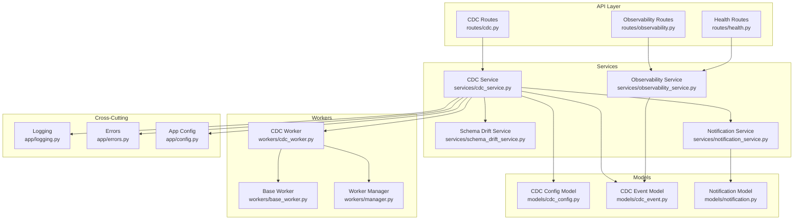
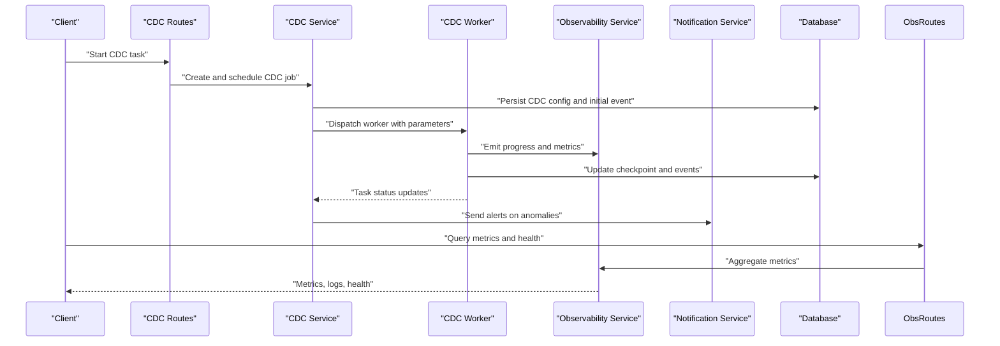
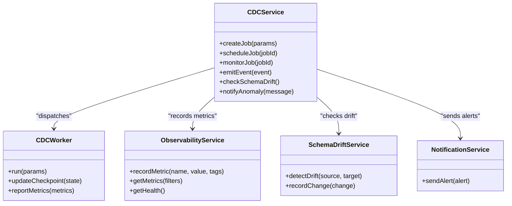
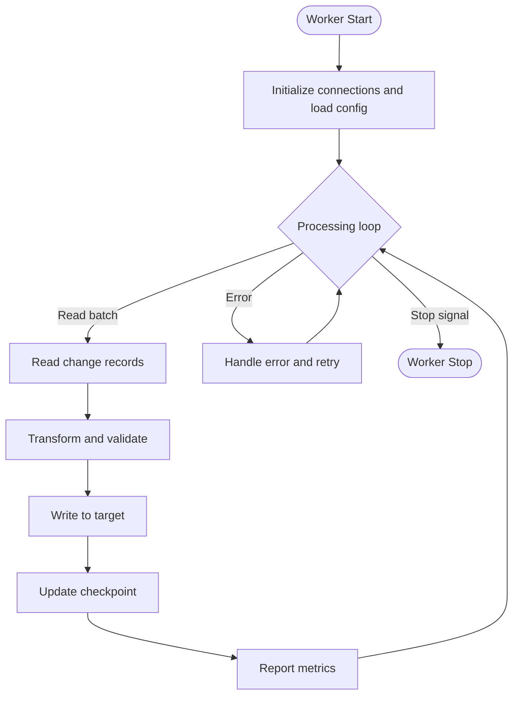
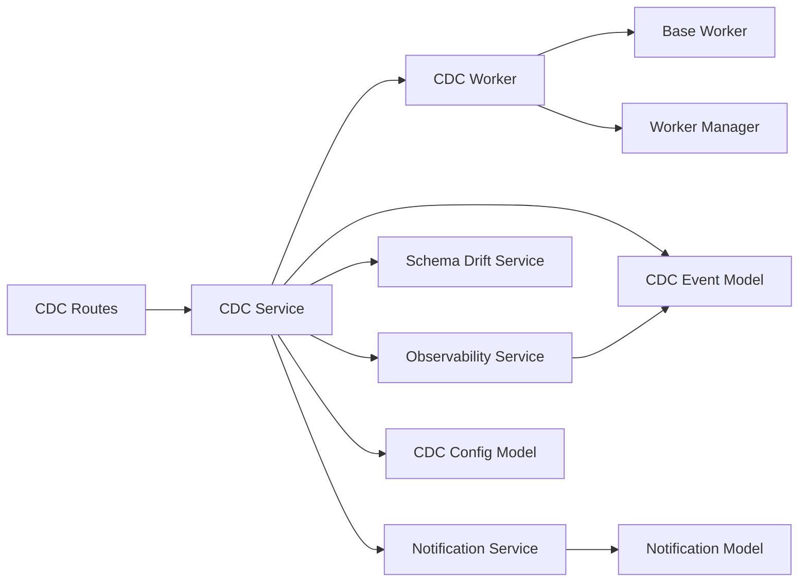

# Monitoring and Troubleshooting

<cite>
**Referenced Files in This Document**
- [cdc_service.py](file://backend/app/services/cdc_service.py)
- [cdc_worker.py](file://backend/app/workers/cdc_worker.py)
- [base_worker.py](file://backend/app/workers/base_worker.py)
- [manager.py](file://backend/app/workers/manager.py)
- [cdc.py](file://backend/app/routes/cdc.py)
- [observability_service.py](file://backend/app/services/observability_service.py)
- [observability.py](file://backend/app/routes/observability.py)
- [logging.py](file://backend/app/logging.py)
- [errors.py](file://backend/app/errors.py)
- [cdc_config.py](file://backend/app/models/cdc_config.py)
- [cdc_event.py](file://backend/app/models/cdc_event.py)
- [schema_drift_service.py](file://backend/app/services/schema_drift_service.py)
- [schema_drift.py](file://backend/app/routes/schema_drift.py)
- [notification_service.py](file://backend/app/services/notification_service.py)
- [notification.py](file://backend/app/models/notification.py)
- [health.py](file://backend/app/routes/health.py)
- [config.py](file://backend/app/config.py)
</cite>

## Table of Contents
1. [Introduction](#introduction)
2. [Project Structure](#project-structure)
3. [Core Components](#core-components)
4. [Architecture Overview](#architecture-overview)
5. [Detailed Component Analysis](#detailed-component-analysis)
6. [Dependency Analysis](#dependency-analysis)
7. [Performance Considerations](#performance-considerations)
8. [Troubleshooting Guide](#troubleshooting-guide)
9. [Conclusion](#conclusion)
10. [Appendices](#appendices)

## Introduction
This document provides comprehensive guidance for monitoring and troubleshooting Change Data Capture (CDC) operations in CloudBridge. It focuses on key metrics such as capture lag, processing throughput, error rates, and resource utilization; logging strategies; alerting configurations; dashboard setup; common issues like connection failures, schema drift detection, data consistency problems, and performance bottlenecks; step-by-step troubleshooting with diagnostic commands and log analysis techniques; performance tuning recommendations across workload patterns; capacity planning guidelines; and best practices for maintaining reliable CDC pipelines.

## Project Structure
CloudBridge organizes CDC-related functionality across services, workers, routes, models, and observability utilities:
- Services encapsulate business logic for CDC orchestration and observability.
- Workers implement background processing for CDC tasks.
- Routes expose APIs for CDC control and observability endpoints.
- Models define configuration and event schemas used by CDC.
- Logging and errors modules centralize structured logging and error handling.

**Diagram sources**
- [cdc.py](file://backend/app/routes/cdc.py)
- [observability.py](file://backend/app/routes/observability.py)
- [health.py](file://backend/app/routes/health.py)
- [cdc_service.py](file://backend/app/services/cdc_service.py)
- [observability_service.py](file://backend/app/services/observability_service.py)
- [schema_drift_service.py](file://backend/app/services/schema_drift_service.py)
- [notification_service.py](file://backend/app/services/notification_service.py)
- [cdc_worker.py](file://backend/app/workers/cdc_worker.py)
- [base_worker.py](file://backend/app/workers/base_worker.py)
- [manager.py](file://backend/app/workers/manager.py)
- [cdc_config.py](file://backend/app/models/cdc_config.py)
- [cdc_event.py](file://backend/app/models/cdc_event.py)
- [notification.py](file://backend/app/models/notification.py)
- [logging.py](file://backend/app/logging.py)
- [errors.py](file://backend/app/errors.py)
- [config.py](file://backend/app/config.py)

**Section sources**
- [cdc.py](file://backend/app/routes/cdc.py)
- [observability.py](file://backend/app/routes/observability.py)
- [health.py](file://backend/app/routes/health.py)
- [cdc_service.py](file://backend/app/services/cdc_service.py)
- [observability_service.py](file://backend/app/services/observability_service.py)
- [schema_drift_service.py](file://backend/app/services/schema_drift_service.py)
- [notification_service.py](file://backend/app/services/notification_service.py)
- [cdc_worker.py](file://backend/app/workers/cdc_worker.py)
- [base_worker.py](file://backend/app/workers/base_worker.py)
- [manager.py](file://backend/app/workers/manager.py)
- [cdc_config.py](file://backend/app/models/cdc_config.py)
- [cdc_event.py](file://backend/app/models/cdc_event.py)
- [notification.py](file://backend/app/models/notification.py)
- [logging.py](file://backend/app/logging.py)
- [errors.py](file://backend/app/errors.py)
- [config.py](file://backend/app/config.py)

## Core Components
- CDC Service: Orchestrates CDC lifecycle, integrates with worker execution, emits events, and coordinates notifications and schema drift checks.
- CDC Worker: Executes long-running CDC tasks, manages checkpoints, and reports progress via events.
- Observability Service: Exposes metrics, logs, and health information for dashboards and alerts.
- Schema Drift Service: Detects and tracks schema changes to maintain consistency between source and target systems.
- Notification Service: Sends alerts and status updates when anomalies or critical conditions are detected.
- Models: Define CDC configuration and event structures consumed by services and workers.

Key responsibilities:
- Metrics collection and exposure for capture lag, throughput, error rates, and resource utilization.
- Structured logging for traceability and diagnostics.
- Alerting triggers based on thresholds and state transitions.
- Health checks for service readiness and liveness.

**Section sources**
- [cdc_service.py](file://backend/app/services/cdc_service.py)
- [cdc_worker.py](file://backend/app/workers/cdc_worker.py)
- [observability_service.py](file://backend/app/services/observability_service.py)
- [schema_drift_service.py](file://backend/app/services/schema_drift_service.py)
- [notification_service.py](file://backend/app/services/notification_service.py)
- [cdc_config.py](file://backend/app/models/cdc_config.py)
- [cdc_event.py](file://backend/app/models/cdc_event.py)

## Architecture Overview
The CDC pipeline is composed of API routes that invoke services, which coordinate workers and emit observability signals. Events are persisted and surfaced through observability endpoints for dashboards and alerting systems.

**Diagram sources**
- [cdc.py](file://backend/app/routes/cdc.py)
- [cdc_service.py](file://backend/app/services/cdc_service.py)
- [cdc_worker.py](file://backend/app/workers/cdc_worker.py)
- [observability_service.py](file://backend/app/services/observability_service.py)
- [notification_service.py](file://backend/app/services/notification_service.py)
- [cdc_event.py](file://backend/app/models/cdc_event.py)
- [cdc_config.py](file://backend/app/models/cdc_config.py)

## Detailed Component Analysis

### CDC Service
Responsibilities:
- Manage CDC job creation, scheduling, and lifecycle.
- Coordinate worker dispatch and monitor task states.
- Emit structured events for progress and errors.
- Integrate with schema drift detection and notifications.

Operational considerations:
- Ensure idempotent job creation to avoid duplicate runs.
- Use consistent correlation IDs across requests and events for tracing.
- Persist configuration and events with timestamps for lag calculations.

**Diagram sources**
- [cdc_service.py](file://backend/app/services/cdc_service.py)
- [cdc_worker.py](file://backend/app/workers/cdc_worker.py)
- [observability_service.py](file://backend/app/services/observability_service.py)
- [schema_drift_service.py](file://backend/app/services/schema_drift_service.py)
- [notification_service.py](file://backend/app/services/notification_service.py)

**Section sources**
- [cdc_service.py](file://backend/app/services/cdc_service.py)
- [cdc_worker.py](file://backend/app/workers/cdc_worker.py)
- [observability_service.py](file://backend/app/services/observability_service.py)
- [schema_drift_service.py](file://backend/app/services/schema_drift_service.py)
- [notification_service.py](file://backend/app/services/notification_service.py)

### CDC Worker
Responsibilities:
- Execute CDC processing loops, reading from source and writing to target.
- Maintain checkpoints to resume after failures.
- Report metrics and progress via the observability service.

Operational considerations:
- Implement retry policies with exponential backoff for transient errors.
- Batch reads/writes to optimize throughput while controlling memory usage.
- Periodically flush checkpoints to ensure recovery points are durable.

**Diagram sources**
- [cdc_worker.py](file://backend/app/workers/cdc_worker.py)
- [base_worker.py](file://backend/app/workers/base_worker.py)
- [manager.py](file://backend/app/workers/manager.py)

**Section sources**
- [cdc_worker.py](file://backend/app/workers/cdc_worker.py)
- [base_worker.py](file://backend/app/workers/base_worker.py)
- [manager.py](file://backend/app/workers/manager.py)

### Observability Service
Responsibilities:
- Record metrics (capture lag, throughput, error rates, resource utilization).
- Provide health endpoints for readiness and liveness probes.
- Aggregate and filter metrics for dashboards and alerting.

Operational considerations:
- Tag metrics with context (jobId, table, region) for granular analysis.
- Use time-series storage compatible with Prometheus/Grafana if applicable.
- Expose structured logs with correlation IDs for cross-service tracing.

**Section sources**
- [observability_service.py](file://backend/app/services/observability_service.py)
- [observability.py](file://backend/app/routes/observability.py)
- [health.py](file://backend/app/routes/health.py)

### Schema Drift Service
Responsibilities:
- Compare source and target schemas to detect changes.
- Record drift events and trigger approvals or automated remediation workflows.

Operational considerations:
- Normalize schema representations before comparison.
- Track drift history for auditability and rollback decisions.
- Integrate with notification service to alert stakeholders.

**Section sources**
- [schema_drift_service.py](file://backend/app/services/schema_drift_service.py)
- [schema_drift.py](file://backend/app/routes/schema_drift.py)

### Notification Service
Responsibilities:
- Send alerts for critical conditions (connection failures, high lag, schema drift).
- Support multiple channels (email, Slack, webhook) depending on configuration.

Operational considerations:
- Deduplicate repeated alerts within a cooldown window.
- Include actionable details (jobId, error codes, links to logs).

**Section sources**
- [notification_service.py](file://backend/app/services/notification_service.py)
- [notification.py](file://backend/app/models/notification.py)

### Models: CDC Config and CDC Event
Responsibilities:
- CDC Config: Stores connection parameters, filters, and scheduling options.
- CDC Event: Captures lifecycle events, metrics snapshots, and error details.

Operational considerations:
- Enforce validation rules for config fields.
- Index events by jobId and timestamp for efficient querying.

**Section sources**
- [cdc_config.py](file://backend/app/models/cdc_config.py)
- [cdc_event.py](file://backend/app/models/cdc_event.py)

## Dependency Analysis
The CDC subsystem depends on services for orchestration, workers for execution, and models for persistence. Observability and notifications provide cross-cutting concerns.

**Diagram sources**
- [cdc.py](file://backend/app/routes/cdc.py)
- [cdc_service.py](file://backend/app/services/cdc_service.py)
- [cdc_worker.py](file://backend/app/workers/cdc_worker.py)
- [base_worker.py](file://backend/app/workers/base_worker.py)
- [manager.py](file://backend/app/workers/manager.py)
- [observability_service.py](file://backend/app/services/observability_service.py)
- [schema_drift_service.py](file://backend/app/services/schema_drift_service.py)
- [notification_service.py](file://backend/app/services/notification_service.py)
- [cdc_config.py](file://backend/app/models/cdc_config.py)
- [cdc_event.py](file://backend/app/models/cdc_event.py)
- [notification.py](file://backend/app/models/notification.py)

**Section sources**
- [cdc.py](file://backend/app/routes/cdc.py)
- [cdc_service.py](file://backend/app/services/cdc_service.py)
- [cdc_worker.py](file://backend/app/workers/cdc_worker.py)
- [base_worker.py](file://backend/app/workers/base_worker.py)
- [manager.py](file://backend/app/workers/manager.py)
- [observability_service.py](file://backend/app/services/observability_service.py)
- [schema_drift_service.py](file://backend/app/services/schema_drift_service.py)
- [notification_service.py](file://backend/app/services/notification_service.py)
- [cdc_config.py](file://backend/app/models/cdc_config.py)
- [cdc_event.py](file://backend/app/models/cdc_event.py)
- [notification.py](file://backend/app/models/notification.py)

## Performance Considerations
- Capture Lag: Monitor time delta between source commit timestamps and processed timestamps. Tune batch sizes and parallelism to reduce lag under bursty workloads.
- Throughput: Track records per second and bytes per second. Adjust worker concurrency and I/O batching to match database capabilities.
- Error Rates: Measure failure counts and retry durations. Implement circuit breakers and backoff strategies to prevent cascading failures.
- Resource Utilization: Observe CPU, memory, and disk I/O. Scale horizontally by adding workers or vertically by increasing instance resources.
- Checkpoint Frequency: Balance durability vs overhead. Frequent checkpoints improve recovery but add write pressure.
- Schema Drift Detection Cost: Schedule drift checks during low-traffic windows or use incremental comparisons to minimize impact.

[No sources needed since this section provides general guidance]

## Troubleshooting Guide

### Common Issues and Diagnostics

- Connection Failures
  - Symptoms: Worker fails to connect to source/target; repeated retries; alert notifications.
  - Diagnostics:
    - Inspect structured logs for connection errors and retry attempts.
    - Verify credentials and network reachability using health endpoints.
    - Review configuration for endpoint URLs, ports, and timeouts.
  - Actions:
    - Rotate secrets if expired.
    - Adjust timeout and retry settings.
    - Validate firewall rules and security groups.

- Schema Drift Detection
  - Symptoms: Alerts about schema changes; CDC jobs paused or failing due to type mismatches.
  - Diagnostics:
    - Query drift events and compare source/target definitions.
    - Review approval workflow status if manual intervention is required.
  - Actions:
    - Approve drift changes or roll back incompatible modifications.
    - Update CDC filters to accommodate new columns or types.

- Data Consistency Problems
  - Symptoms: Missing rows, duplicates, or ordering discrepancies.
  - Diagnostics:
    - Compare event sequences and checkpoint positions.
    - Validate transformation logic and idempotency keys.
  - Actions:
    - Re-run reconciliation jobs.
    - Fix transformation bugs and redeploy.

- Performance Bottlenecks
  - Symptoms: High lag, low throughput, elevated resource usage.
  - Diagnostics:
    - Analyze metrics for CPU/memory saturation and I/O wait times.
    - Identify hot tables and skewed partitions.
  - Actions:
    - Increase worker concurrency or scale out instances.
    - Optimize queries and indexes at source/target.
    - Tune batch sizes and checkpoint intervals.

### Step-by-Step Troubleshooting Workflow

1. Reproduce and Isolate
   - Trigger the problematic CDC job and note the jobId.
   - Confirm whether the issue is intermittent or persistent.

2. Collect Logs and Metrics
   - Retrieve structured logs filtered by jobId and correlation ID.
   - Pull metrics for lag, throughput, error rates, and resource utilization.

3. Inspect Health and Configuration
   - Call health endpoints to verify service readiness.
   - Validate CDC configuration and secret values.

4. Analyze Events and Checkpoints
   - Review CDC events for error traces and state transitions.
   - Check checkpoint positions to identify where processing stalled.

5. Apply Fixes and Validate
   - Adjust configuration or code as needed.
   - Restart affected workers and monitor recovery.

6. Post-Incident Review
   - Document root cause and corrective actions.
   - Update alert thresholds and runbooks.

**Section sources**
- [cdc_service.py](file://backend/app/services/cdc_service.py)
- [cdc_worker.py](file://backend/app/workers/cdc_worker.py)
- [observability_service.py](file://backend/app/services/observability_service.py)
- [schema_drift_service.py](file://backend/app/services/schema_drift_service.py)
- [notification_service.py](file://backend/app/services/notification_service.py)
- [cdc_event.py](file://backend/app/models/cdc_event.py)
- [cdc_config.py](file://backend/app/models/cdc_config.py)

## Conclusion
Effective CDC monitoring and troubleshooting in CloudBridge rely on robust observability, structured logging, proactive alerting, and systematic diagnostics. By tracking key metrics, understanding component interactions, and following the troubleshooting workflow, teams can maintain reliable, high-performance CDC pipelines. Continuous tuning and capacity planning ensure resilience against evolving workloads and schema changes.

[No sources needed since this section summarizes without analyzing specific files]

## Appendices

### Key Metrics to Track
- Capture Lag: Time difference between source commit and processed timestamps.
- Processing Throughput: Records and bytes per second.
- Error Rates: Failure counts and retry durations.
- Resource Utilization: CPU, memory, disk I/O, and network bandwidth.
- Checkpoint Progress: Last successful checkpoint position and frequency.
- Schema Drift Events: Number and severity of detected changes.

**Section sources**
- [observability_service.py](file://backend/app/services/observability_service.py)
- [cdc_event.py](file://backend/app/models/cdc_event.py)

### Logging Strategy
- Use structured logs with correlation IDs for end-to-end tracing.
- Include contextual tags (jobId, table, operation) in metric recordings.
- Separate levels (INFO, WARN, ERROR) and ensure sensitive data is masked.

**Section sources**
- [logging.py](file://backend/app/logging.py)
- [errors.py](file://backend/app/errors.py)

### Alerting Configurations
- Threshold-based alerts for lag, error rate spikes, and resource saturation.
- Stateful alerts for schema drift and failed checkpoints.
- Cooldown and deduplication to reduce alert fatigue.

**Section sources**
- [notification_service.py](file://backend/app/services/notification_service.py)
- [observability_service.py](file://backend/app/services/observability_service.py)

### Dashboard Setup
- Panels for lag over time, throughput trends, error rates, and resource usage.
- Filters by jobId, table, and environment.
- Integration with external visualization tools (e.g., Grafana) if supported.

**Section sources**
- [observability.py](file://backend/app/routes/observability.py)
- [health.py](file://backend/app/routes/health.py)

### Performance Tuning Recommendations
- Workload Patterns:
  - Bursty: Increase batch size and parallelism; tune backoff for retries.
  - Steady: Optimize query plans and indexes; balance checkpoint frequency.
  - Mixed: Segment jobs by table priority; allocate resources dynamically.
- Capacity Planning:
  - Estimate peak TPS and storage growth; provision workers accordingly.
  - Plan for schema evolution and additional tables.
- Best Practices:
  - Idempotent transformations and deduplication keys.
  - Regular reconciliation and audit trails.
  - Automated drift approvals with guardrails.

**Section sources**
- [cdc_service.py](file://backend/app/services/cdc_service.py)
- [cdc_worker.py](file://backend/app/workers/cdc_worker.py)
- [config.py](file://backend/app/config.py)