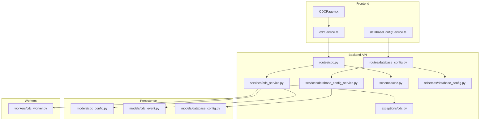
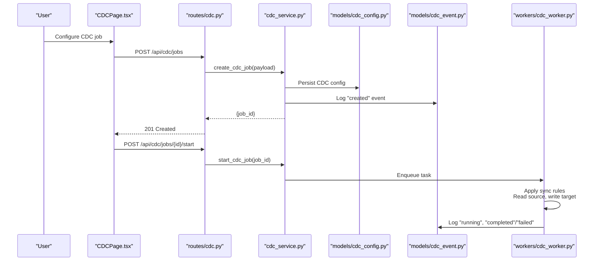
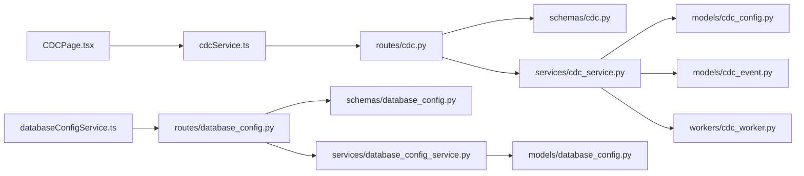

# CDC Configuration and Setup

<cite>
**Referenced Files in This Document**
- [cdc_config.py](file://backend/app/models/cdc_config.py)
- [cdc_event.py](file://backend/app/models/cdc_event.py)
- [database_config.py](file://backend/app/models/database_config.py)
- [cdc.py](file://backend/app/schemas/cdc.py)
- [database_config.py](file://backend/app/schemas/database_config.py)
- [cdc_service.py](file://backend/app/services/cdc_service.py)
- [database_config_service.py](file://backend/app/services/database_config_service.py)
- [cdc.py](file://backend/app/routes/cdc.py)
- [database_config.py](file://backend/app/routes/database_config.py)
- [cdc_worker.py](file://backend/app/workers/cdc_worker.py)
- [cdc.py](file://backend/app/exceptions/cdc.py)
- [cdc_page.tsx](file://frontend/src/pages/CDCPage.tsx)
- [cdcService.ts](file://frontend/src/services/cdcService.ts)
- [databaseConfigService.ts](file://frontend/src/services/databaseConfigService.ts)
</cite>

## Table of Contents
1. [Introduction](#introduction)
2. [Project Structure](#project-structure)
3. [Core Components](#core-components)
4. [Architecture Overview](#architecture-overview)
5. [Detailed Component Analysis](#detailed-component-analysis)
6. [Dependency Analysis](#dependency-analysis)
7. [Performance Considerations](#performance-considerations)
8. [Troubleshooting Guide](#troubleshooting-guide)
9. [Conclusion](#conclusion)

## Introduction
This document explains how to configure and set up Change Data Capture (CDC) in CloudBridge. It covers the configuration model for source and target databases, authentication and security considerations, sync rule definitions (table selection, column mapping, filtering, transformations), validation rules, error handling, and best practices. Practical examples are provided for common database types and synchronization scenarios.

## Project Structure
CloudBridge implements CDC across backend models, schemas, services, routes, workers, and a frontend UI. The key areas relevant to CDC configuration include:
- Models that persist CDC configurations and events
- Schemas that validate API payloads
- Services that orchestrate CDC operations
- Routes that expose CDC endpoints
- Workers that execute CDC tasks
- Frontend pages and services for user interaction

**Diagram sources**
- [cdc.py](file://backend/app/routes/cdc.py)
- [database_config.py](file://backend/app/routes/database_config.py)
- [cdc_service.py](file://backend/app/services/cdc_service.py)
- [database_config_service.py](file://backend/app/services/database_config_service.py)
- [cdc.py](file://backend/app/schemas/cdc.py)
- [database_config.py](file://backend/app/schemas/database_config.py)
- [cdc_config.py](file://backend/app/models/cdc_config.py)
- [cdc_event.py](file://backend/app/models/cdc_event.py)
- [database_config.py](file://backend/app/models/database_config.py)
- [cdc_worker.py](file://backend/app/workers/cdc_worker.py)
- [cdc.py](file://backend/app/exceptions/cdc.py)
- [cdc_page.tsx](file://frontend/src/pages/CDCPage.tsx)
- [cdcService.ts](file://frontend/src/services/cdcService.ts)
- [databaseConfigService.ts](file://frontend/src/services/databaseConfigService.ts)

**Section sources**
- [cdc.py](file://backend/app/routes/cdc.py)
- [database_config.py](file://backend/app/routes/database_config.py)
- [cdc_service.py](file://backend/app/services/cdc_service.py)
- [database_config_service.py](file://backend/app/services/database_config_service.py)
- [cdc.py](file://backend/app/schemas/cdc.py)
- [database_config.py](file://backend/app/schemas/database_config.py)
- [cdc_config.py](file://backend/app/models/cdc_config.py)
- [cdc_event.py](file://backend/app/models/cdc_event.py)
- [database_config.py](file://backend/app/models/database_config.py)
- [cdc_worker.py](file://backend/app/workers/cdc_worker.py)
- [cdc.py](file://backend/app/exceptions/cdc.py)
- [cdc_page.tsx](file://frontend/src/pages/CDCPage.tsx)
- [cdcService.ts](file://frontend/src/services/cdcService.ts)
- [databaseConfigService.ts](file://frontend/src/services/databaseConfigService.ts)

## Core Components
- CDC configuration model: Defines persistent fields for CDC jobs, including source/target references, sync rules, scheduling, and status.
- Database configuration model: Encapsulates connection parameters and credentials for both source and target databases.
- CDC event model: Records lifecycle and runtime events for CDC jobs.
- Schemas: Validate incoming requests and responses for CDC and database configuration APIs.
- Services: Implement business logic for creating, validating, updating, and running CDC jobs; manage database connections and secrets.
- Routes: Expose REST endpoints for CDC and database configuration management.
- Worker: Executes CDC tasks asynchronously, applying sync rules and writing events.
- Exceptions: Centralized CDC-specific error types and messages.

Key responsibilities:
- Source/target connection setup and validation
- Sync rule definition and enforcement
- Job lifecycle management and monitoring
- Secure credential handling
- Event logging and observability

**Section sources**
- [cdc_config.py](file://backend/app/models/cdc_config.py)
- [cdc_event.py](file://backend/app/models/cdc_event.py)
- [database_config.py](file://backend/app/models/database_config.py)
- [cdc.py](file://backend/app/schemas/cdc.py)
- [database_config.py](file://backend/app/schemas/database_config.py)
- [cdc_service.py](file://backend/app/services/cdc_service.py)
- [database_config_service.py](file://backend/app/services/database_config_service.py)
- [cdc_worker.py](file://backend/app/workers/cdc_worker.py)
- [cdc.py](file://backend/app/exceptions/cdc.py)

## Architecture Overview
The CDC subsystem follows a layered architecture:
- Frontend UI collects configuration via forms and calls backend services.
- Backend routes accept and validate requests using Pydantic schemas.
- Services coordinate with persistence models and external systems (e.g., secret managers).
- A worker executes CDC jobs based on configured sync rules and writes events.

**Diagram sources**
- [cdc_page.tsx](file://frontend/src/pages/CDCPage.tsx)
- [cdc.py](file://backend/app/routes/cdc.py)
- [cdc_service.py](file://backend/app/services/cdc_service.py)
- [cdc_config.py](file://backend/app/models/cdc_config.py)
- [cdc_event.py](file://backend/app/models/cdc_event.py)
- [cdc_worker.py](file://backend/app/workers/cdc_worker.py)

## Detailed Component Analysis

### CDC Configuration Model
The CDC configuration model captures all settings required to define a CDC job:
- References to source and target database configurations
- Sync rules specifying tables, columns, filters, and transformations
- Scheduling and execution options
- Status tracking and metadata

Typical fields include:
- Identifier and name
- Source database reference
- Target database reference
- Sync rules array
- Enabled flag and schedule
- Last run info and status
- Audit timestamps

Validation and constraints:
- Required fields enforced by schema layer
- Cross-field validations handled in service layer
- Unique constraints at persistence layer where applicable

Best practices:
- Use descriptive names and tags
- Keep sync rules focused and minimal
- Prefer incremental syncs over full refreshes when possible

**Section sources**
- [cdc_config.py](file://backend/app/models/cdc_config.py)
- [cdc.py](file://backend/app/schemas/cdc.py)

### Database Configuration Model
Database configuration models encapsulate connection details for both source and target:
- Connection type (e.g., PostgreSQL, MySQL, SQL Server, Oracle)
- Host, port, database/schema identifiers
- Authentication method and credential references
- SSL/TLS options and connection timeouts
- Pooling and concurrency settings

Security considerations:
- Store secrets in a secure vault or environment variables
- Avoid embedding plaintext credentials in configs
- Use least-privilege accounts per role (read-only for source, appropriate writer for target)
- Enable TLS and certificate validation for transit encryption

Connection parameter guidance:
- Set reasonable timeouts and pool sizes
- Use dedicated users and networks
- Validate connectivity during preflight checks

**Section sources**
- [database_config.py](file://backend/app/models/database_config.py)
- [database_config.py](file://backend/app/schemas/database_config.py)
- [database_config_service.py](file://backend/app/services/database_config_service.py)

### CDC Events Model
Events capture important lifecycle moments for CDC jobs:
- Creation, start, pause, resume, stop, completion, failure
- Error details and stack traces
- Metrics such as rows processed and duration

Use cases:
- Auditing and compliance
- Troubleshooting failures
- Monitoring dashboards and alerts

**Section sources**
- [cdc_event.py](file://backend/app/models/cdc_event.py)

### CDC Service Layer
Responsibilities:
- Create/update/delete CDC jobs
- Validate configurations against schemas and business rules
- Manage job state transitions
- Coordinate with database configuration service for connection validation
- Enqueue worker tasks and handle results
- Emit events and update metrics

Error handling:
- Map underlying exceptions to domain errors
- Provide actionable messages for invalid configurations
- Ensure idempotency for start/resume operations

**Section sources**
- [cdc_service.py](file://backend/app/services/cdc_service.py)
- [cdc.py](file://backend/app/exceptions/cdc.py)

### CDC Worker
Responsibilities:
- Execute CDC jobs according to sync rules
- Connect to source and target databases securely
- Apply table selection, column mapping, filtering, and transformations
- Write change events to target
- Update job status and emit events

Operational notes:
- Support retries and backoff for transient failures
- Respect rate limits and quotas
- Maintain checkpoints for resuming after interruptions

**Section sources**
- [cdc_worker.py](file://backend/app/workers/cdc_worker.py)

### API Routes and Schemas
Routes:
- CRUD endpoints for CDC jobs
- Start/pause/resume/stop controls
- Health and status queries

Schemas:
- Request/response validation for CDC and database configuration
- Field-level constraints and formats
- Enumerations for supported database types and auth methods

**Section sources**
- [cdc.py](file://backend/app/routes/cdc.py)
- [database_config.py](file://backend/app/routes/database_config.py)
- [cdc.py](file://backend/app/schemas/cdc.py)
- [database_config.py](file://backend/app/schemas/database_config.py)

### Frontend Integration
Pages and services:
- CDC page provides forms to configure jobs and view status
- Services call backend endpoints and render feedback
- Validation hints and error messages improve UX

**Section sources**
- [cdc_page.tsx](file://frontend/src/pages/CDCPage.tsx)
- [cdcService.ts](file://frontend/src/services/cdcService.ts)
- [databaseConfigService.ts](file://frontend/src/services/databaseConfigService.ts)

## Dependency Analysis
High-level dependencies:
- Routes depend on schemas for validation and services for logic
- Services depend on models for persistence and workers for execution
- Worker depends on database configuration and CDC configuration
- Frontend depends on services for API interactions

**Diagram sources**
- [cdc.py](file://backend/app/routes/cdc.py)
- [database_config.py](file://backend/app/routes/database_config.py)
- [cdc.py](file://backend/app/schemas/cdc.py)
- [database_config.py](file://backend/app/schemas/database_config.py)
- [cdc_service.py](file://backend/app/services/cdc_service.py)
- [database_config_service.py](file://backend/app/services/database_config_service.py)
- [cdc_config.py](file://backend/app/models/cdc_config.py)
- [cdc_event.py](file://backend/app/models/cdc_event.py)
- [database_config.py](file://backend/app/models/database_config.py)
- [cdc_worker.py](file://backend/app/workers/cdc_worker.py)
- [cdc_page.tsx](file://frontend/src/pages/CDCPage.tsx)
- [cdcService.ts](file://frontend/src/services/cdcService.ts)
- [databaseConfigService.ts](file://frontend/src/services/databaseConfigService.ts)

**Section sources**
- [cdc.py](file://backend/app/routes/cdc.py)
- [database_config.py](file://backend/app/routes/database_config.py)
- [cdc.py](file://backend/app/schemas/cdc.py)
- [database_config.py](file://backend/app/schemas/database_config.py)
- [cdc_service.py](file://backend/app/services/cdc_service.py)
- [database_config_service.py](file://backend/app/services/database_config_service.py)
- [cdc_config.py](file://backend/app/models/cdc_config.py)
- [cdc_event.py](file://backend/app/models/cdc_event.py)
- [database_config.py](file://backend/app/models/database_config.py)
- [cdc_worker.py](file://backend/app/workers/cdc_worker.py)
- [cdc_page.tsx](file://frontend/src/pages/CDCPage.tsx)
- [cdcService.ts](file://frontend/src/services/cdcService.ts)
- [databaseConfigService.ts](file://frontend/src/services/databaseConfigService.ts)

## Performance Considerations
- Prefer incremental syncs with targeted filters to reduce load
- Tune connection pools and timeouts per workload
- Batch writes to targets where supported
- Monitor and alert on lag and throughput
- Use read replicas for source databases to avoid impacting OLTP workloads
- Partition large tables and use watermark-based syncs if available

[No sources needed since this section provides general guidance]

## Troubleshooting Guide
Common issues and resolutions:
- Invalid configuration: Check schema validation errors and field constraints
- Connection failures: Verify host/port, credentials, network access, and TLS settings
- Permission errors: Ensure least-privilege accounts have required permissions
- Sync rule conflicts: Review table/column mappings and filter conditions
- Worker failures: Inspect CDC events for stack traces and retry behavior

Operational tips:
- Use preflight checks before enabling jobs
- Enable detailed logging for diagnostics
- Pause jobs before making schema changes
- Back up target data before initial loads

**Section sources**
- [cdc.py](file://backend/app/exceptions/cdc.py)
- [cdc_event.py](file://backend/app/models/cdc_event.py)
- [cdc_service.py](file://backend/app/services/cdc_service.py)
- [cdc_worker.py](file://backend/app/workers/cdc_worker.py)

## Conclusion
CloudBridge’s CDC subsystem provides a robust framework for defining and executing change data capture jobs. By leveraging well-defined models, validated schemas, orchestrated services, and resilient workers, teams can reliably synchronize data between diverse databases while maintaining security and performance. Follow the best practices outlined here to ensure reliable, maintainable CDC pipelines.

[No sources needed since this section summarizes without analyzing specific files]