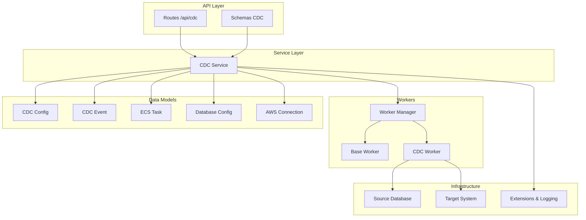
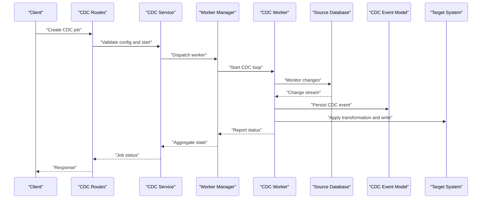
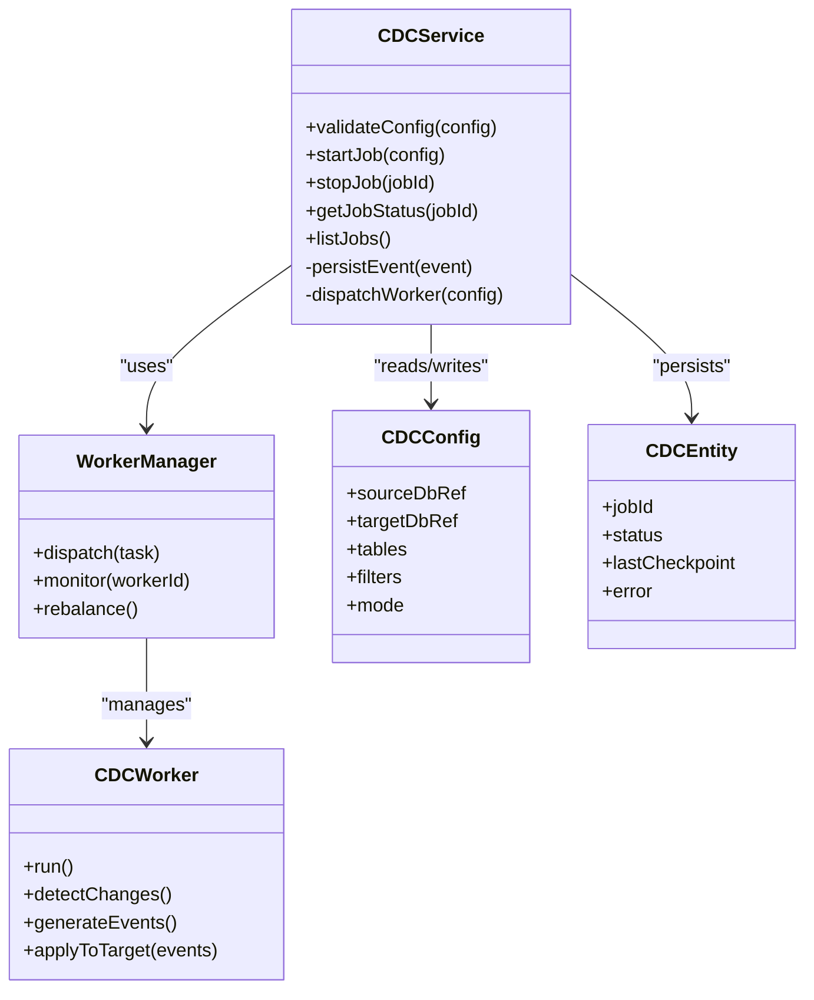
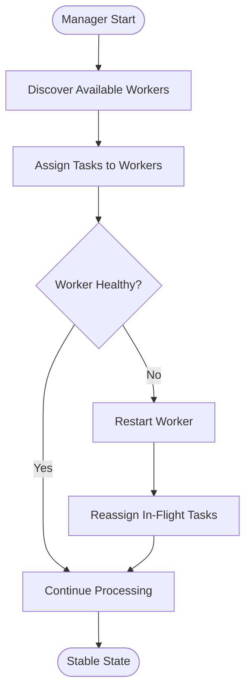
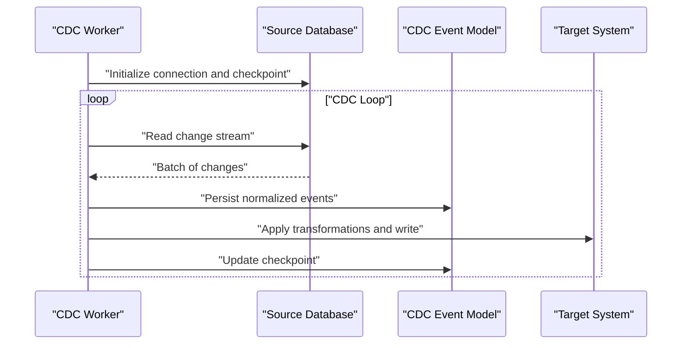
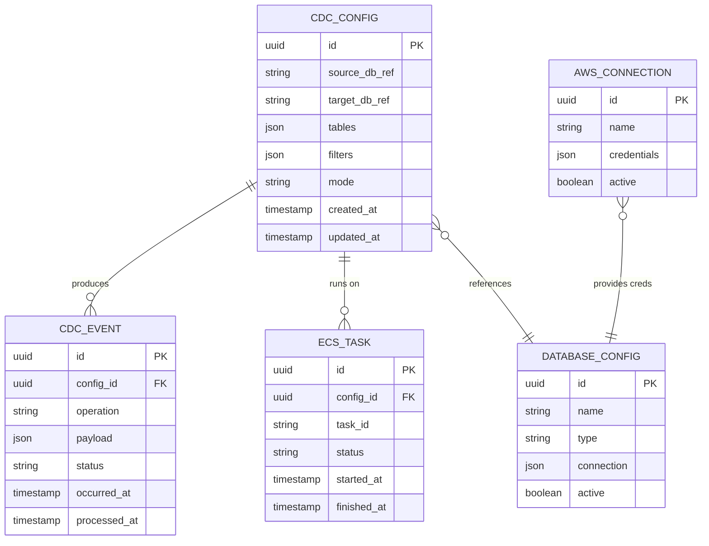
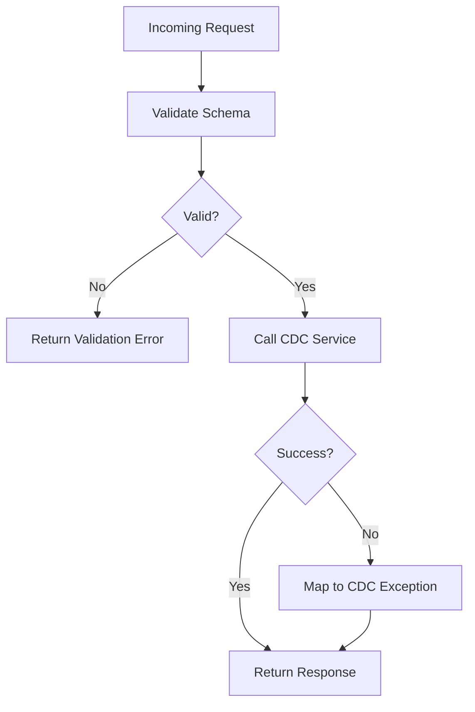
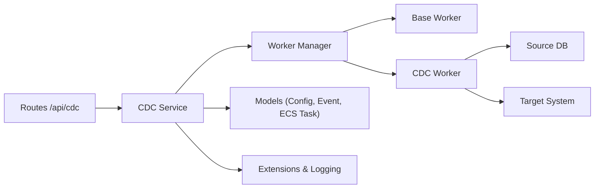

# CDC Fundamentals and Architecture

<cite>
**Referenced Files in This Document**
- [cdc_service.py](file://backend/app/services/cdc_service.py)
- [cdc_worker.py](file://backend/app/workers/cdc_worker.py)
- [base_worker.py](file://backend/app/workers/base_worker.py)
- [manager.py](file://backend/app/workers/manager.py)
- [cdc_config.py](file://backend/app/models/cdc_config.py)
- [cdc_event.py](file://backend/app/models/cdc_event.py)
- [cdc.py](file://backend/app/routes/cdc.py)
- [cdc.py](file://backend/app/exceptions/cdc.py)
- [cdc.py](file://backend/app/schemas/cdc.py)
- [ecs_task.py](file://backend/app/models/ecs_task.py)
- [database_config.py](file://backend/app/models/database_config.py)
- [aws_connection.py](file://backend/app/models/aws_connection.py)
- [config.py](file://backend/app/config.py)
- [extensions.py](file://backend/app/extensions.py)
- [logging.py](file://backend/app/logging.py)
- [04_System_Architecture.md](file://docs/04_System_Architecture.md)
</cite>

## Table of Contents
1. [Introduction](#introduction)
2. [Project Structure](#project-structure)
3. [Core Components](#core-components)
4. [Architecture Overview](#architecture-overview)
5. [Detailed Component Analysis](#detailed-component-analysis)
6. [Dependency Analysis](#dependency-analysis)
7. [Performance Considerations](#performance-considerations)
8. [Troubleshooting Guide](#troubleshooting-guide)
9. [Conclusion](#conclusion)

## Introduction
This document explains Change Data Capture (CDC) fundamentals and the CloudBridge CDC architecture. It covers change detection mechanisms, event generation strategies, data synchronization patterns, worker-based processing, task distribution, load balancing, fault tolerance, performance considerations, scalability patterns, and best practices. The goal is to help both technical and non-technical readers understand how CloudBridge captures changes from source databases and synchronizes them to target systems reliably and efficiently.

## Project Structure
CloudBridge implements CDC across backend services, workers, models, routes, schemas, and configuration:
- Services orchestrate CDC lifecycle and integration with external systems
- Workers execute long-running tasks such as monitoring and applying changes
- Models represent CDC configurations, events, ECS tasks, and related entities
- Routes expose APIs for CDC management
- Schemas define request/response contracts
- Exceptions encapsulate CDC-specific error handling
- Configuration centralizes runtime settings and logging

**Diagram sources**
- [cdc.py](file://backend/app/routes/cdc.py)
- [cdc_service.py](file://backend/app/services/cdc_service.py)
- [manager.py](file://backend/app/workers/manager.py)
- [base_worker.py](file://backend/app/workers/base_worker.py)
- [cdc_worker.py](file://backend/app/workers/cdc_worker.py)
- [cdc_config.py](file://backend/app/models/cdc_config.py)
- [cdc_event.py](file://backend/app/models/cdc_event.py)
- [ecs_task.py](file://backend/app/models/ecs_task.py)
- [database_config.py](file://backend/app/models/database_config.py)
- [aws_connection.py](file://backend/app/models/aws_connection.py)
- [extensions.py](file://backend/app/extensions.py)
- [logging.py](file://backend/app/logging.py)

**Section sources**
- [cdc.py](file://backend/app/routes/cdc.py)
- [cdc_service.py](file://backend/app/services/cdc_service.py)
- [manager.py](file://backend/app/workers/manager.py)
- [base_worker.py](file://backend/app/workers/base_worker.py)
- [cdc_worker.py](file://backend/app/workers/cdc_worker.py)
- [cdc_config.py](file://backend/app/models/cdc_config.py)
- [cdc_event.py](file://backend/app/models/cdc_event.py)
- [ecs_task.py](file://backend/app/models/ecs_task.py)
- [database_config.py](file://backend/app/models/database_config.py)
- [aws_connection.py](file://backend/app/models/aws_connection.py)
- [extensions.py](file://backend/app/extensions.py)
- [logging.py](file://backend/app/logging.py)

## Core Components
- CDC Service: Orchestrates CDC operations including configuration validation, worker lifecycle, event persistence, and integration with AWS/ECS where applicable.
- Worker Manager: Manages worker processes or tasks, handles scheduling, dispatching, and coordination.
- Base Worker: Provides common functionality for all workers such as lifecycle hooks, health checks, and logging.
- CDC Worker: Implements the core CDC loop—detecting changes, generating events, and applying them to targets.
- Models: CDC Config, CDC Event, ECS Task, Database Config, and AWS Connection provide structured representations and persistence contracts.
- Routes and Schemas: Expose REST endpoints for CDC management and enforce input/output contracts.
- Exceptions: Centralized CDC error types for consistent error handling.
- Extensions and Logging: Provide shared infrastructure for database connections, metrics, and structured logs.

**Section sources**
- [cdc_service.py](file://backend/app/services/cdc_service.py)
- [manager.py](file://backend/app/workers/manager.py)
- [base_worker.py](file://backend/app/workers/base_worker.py)
- [cdc_worker.py](file://backend/app/workers/cdc_worker.py)
- [cdc_config.py](file://backend/app/models/cdc_config.py)
- [cdc_event.py](file://backend/app/models/cdc_event.py)
- [ecs_task.py](file://backend/app/models/ecs_task.py)
- [database_config.py](file://backend/app/models/database_config.py)
- [aws_connection.py](file://backend/app/models/aws_connection.py)
- [cdc.py](file://backend/app/routes/cdc.py)
- [cdc.py](file://backend/app/schemas/cdc.py)
- [cdc.py](file://backend/app/exceptions/cdc.py)
- [extensions.py](file://backend/app/extensions.py)
- [logging.py](file://backend/app/logging.py)

## Architecture Overview
The CDC pipeline follows a layered design:
- Source Monitoring: CDC workers monitor source databases for changes using supported mechanisms (e.g., log-based or polling).
- Event Generation: Detected changes are normalized into CDC events with metadata and payloads.
- Processing Pipeline: Events are persisted and optionally enqueued for downstream consumers.
- Target Synchronization: Applied transformations write changes to target systems while preserving order and idempotency.
- Worker Orchestration: A manager coordinates multiple workers for horizontal scaling and fault tolerance.

**Diagram sources**
- [cdc.py](file://backend/app/routes/cdc.py)
- [cdc_service.py](file://backend/app/services/cdc_service.py)
- [manager.py](file://backend/app/workers/manager.py)
- [cdc_worker.py](file://backend/app/workers/cdc_worker.py)
- [cdc_event.py](file://backend/app/models/cdc_event.py)

## Detailed Component Analysis

### CDC Service
Responsibilities:
- Validate CDC configurations against schemas
- Manage worker lifecycle via the worker manager
- Persist CDC events and track progress
- Integrate with AWS/ECS for distributed execution when configured
- Expose observability and error handling through centralized exceptions and logging

Key interactions:
- Routes call service methods to create, update, pause, resume, and delete CDC jobs
- Service uses models to persist configuration and events
- Service delegates execution to the worker manager and workers

**Diagram sources**
- [cdc_service.py](file://backend/app/services/cdc_service.py)
- [manager.py](file://backend/app/workers/manager.py)
- [cdc_worker.py](file://backend/app/workers/cdc_worker.py)
- [cdc_config.py](file://backend/app/models/cdc_config.py)
- [cdc_event.py](file://backend/app/models/cdc_event.py)

**Section sources**
- [cdc_service.py](file://backend/app/services/cdc_service.py)
- [cdc_config.py](file://backend/app/models/cdc_config.py)
- [cdc_event.py](file://backend/app/models/cdc_event.py)

### Worker Manager and Base Worker
Responsibilities:
- Worker Manager: Dispatches tasks to available workers, monitors health, rebalances load, and ensures fault tolerance by restarting failed workers.
- Base Worker: Provides common lifecycle hooks, logging, metrics, and safe shutdown behavior.

**Diagram sources**
- [manager.py](file://backend/app/workers/manager.py)
- [base_worker.py](file://backend/app/workers/base_worker.py)

**Section sources**
- [manager.py](file://backend/app/workers/manager.py)
- [base_worker.py](file://backend/app/workers/base_worker.py)

### CDC Worker
Responsibilities:
- Connect to source database and detect changes
- Normalize changes into CDC events
- Apply transformations and synchronize to target system
- Maintain checkpoints to ensure exactly-once semantics and recovery

**Diagram sources**
- [cdc_worker.py](file://backend/app/workers/cdc_worker.py)
- [cdc_event.py](file://backend/app/models/cdc_event.py)

**Section sources**
- [cdc_worker.py](file://backend/app/workers/cdc_worker.py)
- [cdc_event.py](file://backend/app/models/cdc_event.py)

### Models and Schemas
- CDC Config: Defines source/target references, table filters, modes, and operational parameters.
- CDC Event: Represents captured changes with metadata, payload, and status.
- ECS Task: Tracks distributed worker tasks when running on ECS.
- Database Config and AWS Connection: Provide connection details and credentials for source/target systems.
- Schemas: Enforce request/response structures for CDC APIs.

**Diagram sources**
- [cdc_config.py](file://backend/app/models/cdc_config.py)
- [cdc_event.py](file://backend/app/models/cdc_event.py)
- [ecs_task.py](file://backend/app/models/ecs_task.py)
- [database_config.py](file://backend/app/models/database_config.py)
- [aws_connection.py](file://backend/app/models/aws_connection.py)

**Section sources**
- [cdc_config.py](file://backend/app/models/cdc_config.py)
- [cdc_event.py](file://backend/app/models/cdc_event.py)
- [ecs_task.py](file://backend/app/models/ecs_task.py)
- [database_config.py](file://backend/app/models/database_config.py)
- [aws_connection.py](file://backend/app/models/aws_connection.py)
- [cdc.py](file://backend/app/schemas/cdc.py)

### API Routes and Error Handling
- Routes: Expose endpoints to manage CDC jobs (create, list, get status, stop).
- Exceptions: Define CDC-specific errors for consistent client feedback and server-side handling.

**Diagram sources**
- [cdc.py](file://backend/app/routes/cdc.py)
- [cdc.py](file://backend/app/exceptions/cdc.py)
- [cdc.py](file://backend/app/schemas/cdc.py)

**Section sources**
- [cdc.py](file://backend/app/routes/cdc.py)
- [cdc.py](file://backend/app/exceptions/cdc.py)
- [cdc.py](file://backend/app/schemas/cdc.py)

## Dependency Analysis
High-level dependencies:
- Routes depend on CDC Service and Schemas
- CDC Service depends on Worker Manager, Models, and Infrastructure (Extensions, Logging)
- Worker Manager depends on Base Worker and CDC Worker
- CDC Worker depends on Source/Target connectors and Event persistence
- Models depend on Database Config and AWS Connection for connectivity

**Diagram sources**
- [cdc.py](file://backend/app/routes/cdc.py)
- [cdc_service.py](file://backend/app/services/cdc_service.py)
- [manager.py](file://backend/app/workers/manager.py)
- [base_worker.py](file://backend/app/workers/base_worker.py)
- [cdc_worker.py](file://backend/app/workers/cdc_worker.py)
- [cdc_config.py](file://backend/app/models/cdc_config.py)
- [cdc_event.py](file://backend/app/models/cdc_event.py)
- [ecs_task.py](file://backend/app/models/ecs_task.py)
- [extensions.py](file://backend/app/extensions.py)
- [logging.py](file://backend/app/logging.py)

**Section sources**
- [cdc.py](file://backend/app/routes/cdc.py)
- [cdc_service.py](file://backend/app/services/cdc_service.py)
- [manager.py](file://backend/app/workers/manager.py)
- [base_worker.py](file://backend/app/workers/base_worker.py)
- [cdc_worker.py](file://backend/app/workers/cdc_worker.py)
- [cdc_config.py](file://backend/app/models/cdc_config.py)
- [cdc_event.py](file://backend/app/models/cdc_event.py)
- [ecs_task.py](file://backend/app/models/ecs_task.py)
- [extensions.py](file://backend/app/extensions.py)
- [logging.py](file://backend/app/logging.py)

## Performance Considerations
- Batched change reading: Read changes in batches to reduce round-trips and improve throughput.
- Idempotent writes: Ensure target writes are idempotent to support retries without duplication.
- Checkpointing: Persist checkpoints per job to enable fast recovery and minimize reprocessing.
- Backpressure: Implement flow control between detection, event persistence, and target application.
- Parallelism: Scale workers horizontally; distribute jobs across multiple instances for higher throughput.
- Resource limits: Configure memory and CPU limits per worker to avoid resource contention.
- Connection pooling: Use pooled connections for source and target systems to reduce overhead.
- Observability: Track latency, throughput, lag, and error rates to guide tuning.

[No sources needed since this section provides general guidance]

## Troubleshooting Guide
Common issues and resolutions:
- Validation failures: Ensure CDC configuration conforms to schemas; check required fields and constraints.
- Worker crashes: Inspect worker logs and health status; rely on manager restarts and task reassignment.
- Stalled progress: Verify checkpoints and source/target connectivity; review lag metrics.
- Duplicate writes: Confirm idempotency keys and deduplication logic at the target.
- Permission errors: Validate AWS connection and database credentials; confirm IAM policies and network access.
- High latency: Tune batch sizes, parallelism, and connection pools; monitor resource utilization.

Operational tips:
- Use centralized logging and structured traces for end-to-end visibility.
- Leverage exceptions to map errors to actionable messages.
- Monitor ECS tasks for distributed deployments to detect underutilization or failures.

**Section sources**
- [cdc.py](file://backend/app/exceptions/cdc.py)
- [logging.py](file://backend/app/logging.py)
- [ecs_task.py](file://backend/app/models/ecs_task.py)
- [aws_connection.py](file://backend/app/models/aws_connection.py)

## Conclusion
CloudBridge’s CDC architecture separates concerns across service, worker, and model layers, enabling scalable and resilient change capture and synchronization. By leveraging worker-based processing, robust checkpointing, and clear error handling, it supports high-throughput, low-latency pipelines. Following the performance and troubleshooting recommendations will help maintain reliable CDC operations at scale.

[No sources needed since this section summarizes without analyzing specific files]