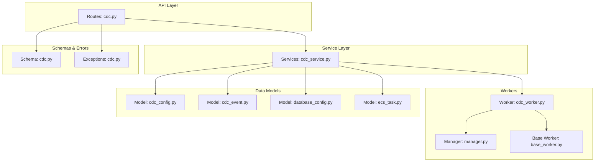
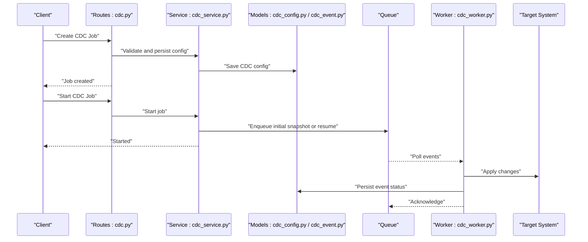
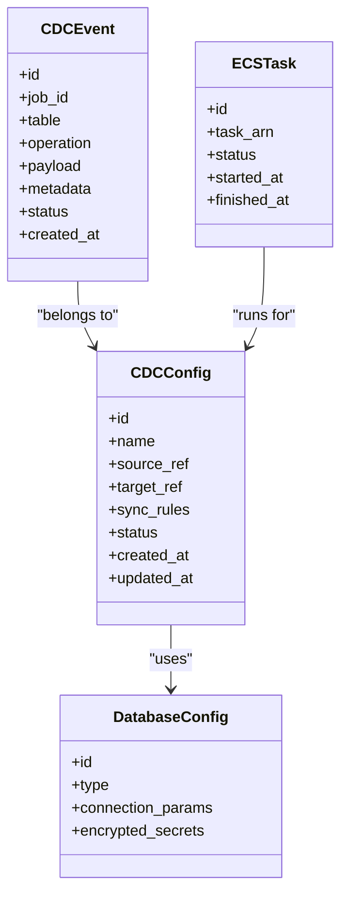
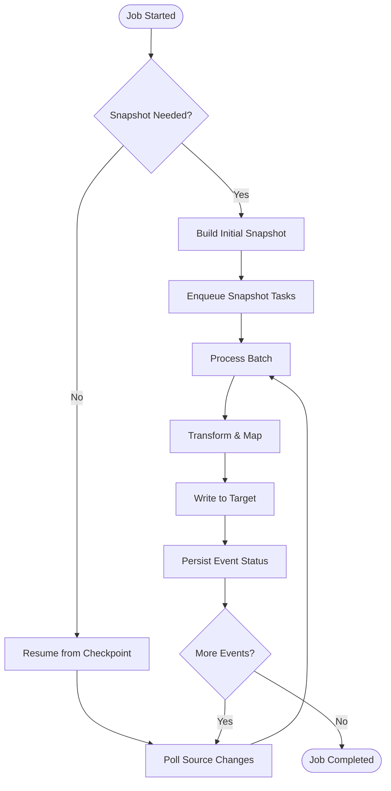
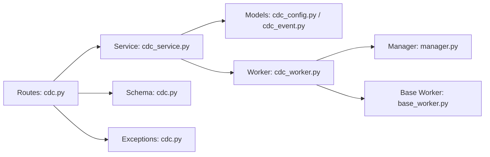

# Change Data Capture (CDC)

<cite>
**Referenced Files in This Document**
- [cdc.py](file://backend/app/routes/cdc.py)
- [cdc_service.py](file://backend/app/services/cdc_service.py)
- [cdc_worker.py](file://backend/app/workers/cdc_worker.py)
- [cdc_config.py](file://backend/app/models/cdc_config.py)
- [cdc_event.py](file://backend/app/models/cdc_event.py)
- [cdc.py](file://backend/app/schemas/cdc.py)
- [cdc.py](file://backend/app/exceptions/cdc.py)
- [database_config.py](file://backend/app/models/database_config.py)
- [ecs_task.py](file://backend/app/models/ecs_task.py)
- [manager.py](file://backend/app/workers/manager.py)
- [base_worker.py](file://backend/app/workers/base_worker.py)
</cite>

## Table of Contents
1. [Introduction](#introduction)
2. [Project Structure](#project-structure)
3. [Core Components](#core-components)
4. [Architecture Overview](#architecture-overview)
5. [Detailed Component Analysis](#detailed-component-analysis)
6. [Dependency Analysis](#dependency-analysis)
7. [Performance Considerations](#performance-considerations)
8. [Troubleshooting Guide](#troubleshooting-guide)
9. [Conclusion](#conclusion)
10. [Appendices](#appendices)

## Introduction
This document explains Change Data Capture (CDC) in CloudBridge with a focus on real-time data synchronization and event processing. It covers CDC principles, configuration model, event pipeline, practical setup examples, performance tuning, scaling considerations, and troubleshooting. The goal is to help users configure source/target databases, define sync rules, monitor event flow, and operate the system reliably at scale.

## Project Structure
CloudBridge implements CDC across routes, services, workers, models, schemas, and exceptions:
- Routes expose REST endpoints for CDC lifecycle management.
- Services orchestrate CDC operations and integrate with external systems.
- Workers process CDC events asynchronously.
- Models persist CDC configurations and events.
- Schemas validate request/response payloads.
- Exceptions define domain-specific error handling.

**Diagram sources**
- [cdc.py](file://backend/app/routes/cdc.py)
- [cdc_service.py](file://backend/app/services/cdc_service.py)
- [cdc_worker.py](file://backend/app/workers/cdc_worker.py)
- [manager.py](file://backend/app/workers/manager.py)
- [base_worker.py](file://backend/app/workers/base_worker.py)
- [cdc_config.py](file://backend/app/models/cdc_config.py)
- [cdc_event.py](file://backend/app/models/cdc_event.py)
- [database_config.py](file://backend/app/models/database_config.py)
- [ecs_task.py](file://backend/app/models/ecs_task.py)
- [cdc.py](file://backend/app/schemas/cdc.py)
- [cdc.py](file://backend/app/exceptions/cdc.py)

**Section sources**
- [cdc.py](file://backend/app/routes/cdc.py)
- [cdc_service.py](file://backend/app/services/cdc_service.py)
- [cdc_worker.py](file://backend/app/workers/cdc_worker.py)
- [cdc_config.py](file://backend/app/models/cdc_config.py)
- [cdc_event.py](file://backend/app/models/cdc_event.py)
- [cdc.py](file://backend/app/schemas/cdc.py)
- [cdc.py](file://backend/app/exceptions/cdc.py)
- [database_config.py](file://backend/app/models/database_config.py)
- [ecs_task.py](file://backend/app/models/ecs_task.py)
- [manager.py](file://backend/app/workers/manager.py)
- [base_worker.py](file://backend/app/workers/base_worker.py)

## Core Components
- CDC Route: Exposes endpoints to create, update, start, stop, and inspect CDC jobs; validates inputs via schemas; returns standardized responses and errors.
- CDC Service: Implements business logic for CDC job lifecycle, rule validation, connection checks, and integration with workers and storage.
- CDC Worker: Consumes CDC events, applies transformations, and writes to target systems; integrates with the worker manager for orchestration and failover.
- CDC Config Model: Persists source/target definitions, sync rules, and operational settings.
- CDC Event Model: Stores change events with metadata for auditability and replay.
- Database Config Model: Encapsulates connection details for source and target databases.
- ECS Task Model: Tracks task execution context when running workers in ECS.
- CDC Schema: Defines request/response structures and validation rules.
- CDC Exceptions: Domain-specific error types for CDC operations.

**Section sources**
- [cdc.py](file://backend/app/routes/cdc.py)
- [cdc_service.py](file://backend/app/services/cdc_service.py)
- [cdc_worker.py](file://backend/app/workers/cdc_worker.py)
- [cdc_config.py](file://backend/app/models/cdc_config.py)
- [cdc_event.py](file://backend/app/models/cdc_event.py)
- [database_config.py](file://backend/app/models/database_config.py)
- [ecs_task.py](file://backend/app/models/ecs_task.py)
- [cdc.py](file://backend/app/schemas/cdc.py)
- [cdc.py](file://backend/app/exceptions/cdc.py)

## Architecture Overview
The CDC architecture follows a layered design with asynchronous event processing:
- API layer receives CDC requests and delegates to services.
- Service layer persists configuration, validates rules, and enqueues work items.
- Worker layer processes events, applies transformations, and writes to targets.
- Persistence layer stores configs and events for observability and recovery.

**Diagram sources**
- [cdc.py](file://backend/app/routes/cdc.py)
- [cdc_service.py](file://backend/app/services/cdc_service.py)
- [cdc_config.py](file://backend/app/models/cdc_config.py)
- [cdc_event.py](file://backend/app/models/cdc_event.py)
- [cdc_worker.py](file://backend/app/workers/cdc_worker.py)

## Detailed Component Analysis

### CDC Principles
- Change Detection: Identify inserts, updates, and deletes from source databases using log-based or timestamp-based mechanisms.
- Event Generation: Emit structured change events with consistent schema, including table, operation type, primary key, and payload diff.
- Conflict Resolution: Strategies include last-write-wins, merge by fields, or application-defined resolvers; conflicts are recorded for observability.

[No sources needed since this section provides conceptual guidance]

### CDC Configuration Model
- Source/Target Setup: Define connection parameters for source and target databases; reuse shared database configuration model.
- Sync Rules: Specify tables/columns to capture, filters, transformations, and mapping to target schema.
- Performance Tuning: Configure batch sizes, polling intervals, concurrency, checkpointing, and retry/backoff policies.

**Diagram sources**
- [cdc_config.py](file://backend/app/models/cdc_config.py)
- [cdc_event.py](file://backend/app/models/cdc_event.py)
- [database_config.py](file://backend/app/models/database_config.py)
- [ecs_task.py](file://backend/app/models/ecs_task.py)

**Section sources**
- [cdc_config.py](file://backend/app/models/cdc_config.py)
- [cdc_event.py](file://backend/app/models/cdc_event.py)
- [database_config.py](file://backend/app/models/database_config.py)
- [ecs_task.py](file://backend/app/models/ecs_task.py)

### Event Processing Pipeline
- Message Queuing: Jobs enqueue events for snapshotting and incremental replication.
- Worker Orchestration: Manager coordinates worker instances, handles health checks, and distributes tasks.
- Failover: On failure, events are retried with backoff; dead-letter queues and checkpoints ensure durability.

**Diagram sources**
- [cdc_service.py](file://backend/app/services/cdc_service.py)
- [cdc_worker.py](file://backend/app/workers/cdc_worker.py)
- [cdc_event.py](file://backend/app/models/cdc_event.py)

**Section sources**
- [cdc_service.py](file://backend/app/services/cdc_service.py)
- [cdc_worker.py](file://backend/app/workers/cdc_worker.py)
- [cdc_event.py](file://backend/app/models/cdc_event.py)

### Practical Examples
- Setting up CDC connections:
  - Create database configurations for source and target.
  - Create a CDC job referencing those configurations and defining sync rules.
  - Start the job and verify status via API.
- Configuring sync rules:
  - Select tables and columns to capture.
  - Apply filters and transformations.
  - Map to target schema and set conflict resolution strategy.
- Monitoring event flow:
  - Inspect CDC events and job status.
  - Observe worker health and task metrics.

[No sources needed since this section provides general guidance]

## Dependency Analysis
High-level dependencies between components:
- Routes depend on service layer and schemas.
- Services depend on models and workers.
- Workers depend on manager and base worker utilities.
- Models encapsulate persistence contracts.

**Diagram sources**
- [cdc.py](file://backend/app/routes/cdc.py)
- [cdc_service.py](file://backend/app/services/cdc_service.py)
- [cdc_worker.py](file://backend/app/workers/cdc_worker.py)
- [manager.py](file://backend/app/workers/manager.py)
- [base_worker.py](file://backend/app/workers/base_worker.py)
- [cdc_config.py](file://backend/app/models/cdc_config.py)
- [cdc_event.py](file://backend/app/models/cdc_event.py)
- [cdc.py](file://backend/app/schemas/cdc.py)
- [cdc.py](file://backend/app/exceptions/cdc.py)

**Section sources**
- [cdc.py](file://backend/app/routes/cdc.py)
- [cdc_service.py](file://backend/app/services/cdc_service.py)
- [cdc_worker.py](file://backend/app/workers/cdc_worker.py)
- [manager.py](file://backend/app/workers/manager.py)
- [base_worker.py](file://backend/app/workers/base_worker.py)
- [cdc_config.py](file://backend/app/models/cdc_config.py)
- [cdc_event.py](file://backend/app/models/cdc_event.py)
- [cdc.py](file://backend/app/schemas/cdc.py)
- [cdc.py](file://backend/app/exceptions/cdc.py)

## Performance Considerations
- Batch sizing: Tune batch sizes for snapshot and incremental processing to balance throughput and memory usage.
- Concurrency: Adjust worker count and per-worker parallelism based on CPU and I/O capacity.
- Checkpointing: Enable frequent checkpoints to minimize reprocessing after failures.
- Backpressure: Implement queue depth limits and adaptive throttling to protect downstream systems.
- Indexing: Ensure target indexes support write patterns; consider temporary index rebuilds during heavy loads.
- Network: Use connection pooling and compression where supported.

[No sources needed since this section provides general guidance]

## Troubleshooting Guide
Common issues and resolutions:
- Connection failures: Validate credentials, network reachability, and firewall rules for both source and target.
- Schema drift: Monitor schema changes and pause jobs if incompatible; apply migration approvals before resuming.
- Duplicate events: Verify idempotency keys and deduplication strategies in the worker.
- Lagging consumers: Increase worker replicas, tune batch size, and check target write throughput.
- Dead-lettered events: Inspect event payloads and error logs; fix transformation rules and retry.

Operational checks:
- Inspect CDC job status and recent events.
- Review worker health and task lifecycles.
- Validate sync rules and mappings.

**Section sources**
- [cdc.py](file://backend/app/exceptions/cdc.py)
- [cdc_service.py](file://backend/app/services/cdc_service.py)
- [cdc_worker.py](file://backend/app/workers/cdc_worker.py)
- [cdc_event.py](file://backend/app/models/cdc_event.py)

## Conclusion
CloudBridge’s CDC implementation provides a robust foundation for real-time data synchronization. By configuring source/target connections, defining precise sync rules, and operating workers with proper scaling and monitoring, teams can achieve reliable, low-latency replication with strong observability and resilience.

[No sources needed since this section summarizes without analyzing specific files]

## Appendices

### API Endpoints Reference
- CDC Jobs:
  - Create, update, start, stop, delete, list, get status.
- CDC Events:
  - List events, filter by job/table/operation, get event details.
- Health and Observability:
  - Worker health, task status, and basic metrics.

[No sources needed since this section provides general guidance]