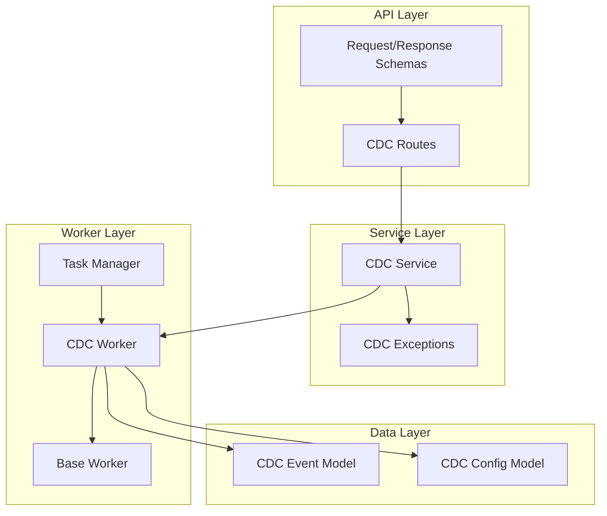
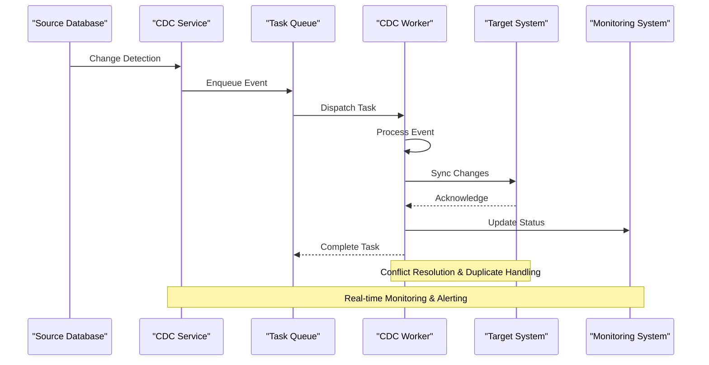
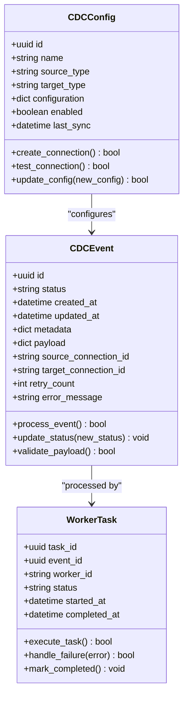
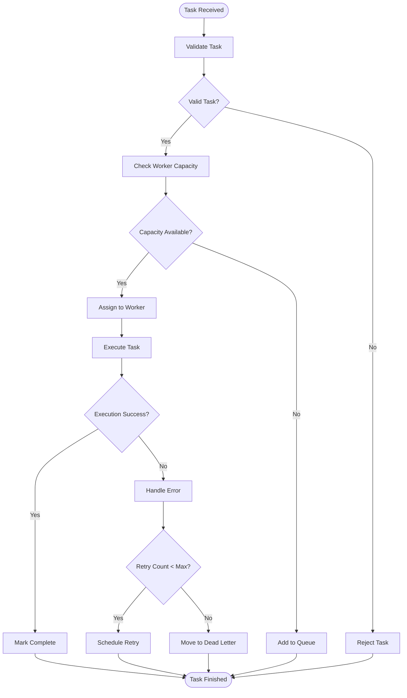
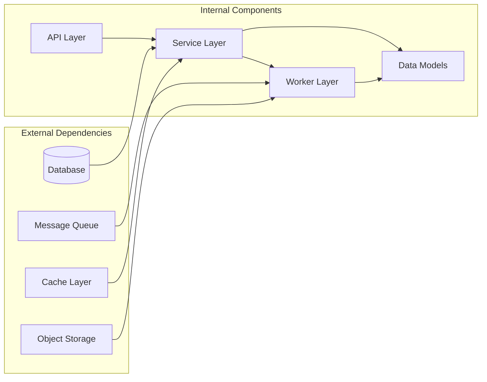

# Event Processing and Management

<cite>
**Referenced Files in This Document**
- [cdc_event.py](file://backend/app/models/cdc_event.py)
- [cdc_config.py](file://backend/app/models/cdc_config.py)
- [cdc_service.py](file://backend/app/services/cdc_service.py)
- [cdc_worker.py](file://backend/app/workers/cdc_worker.py)
- [base_worker.py](file://backend/app/workers/base_worker.py)
- [manager.py](file://backend/app/workers/manager.py)
- [cdc.py](file://backend/app/routes/cdc.py)
- [cdc.py](file://backend/app/schemas/cdc.py)
- [cdc.py](file://backend/app/exceptions/cdc.py)
</cite>

## Table of Contents
1. [Introduction](#introduction)
2. [Project Structure](#project-structure)
3. [Core Components](#core-components)
4. [Architecture Overview](#architecture-overview)
5. [Detailed Component Analysis](#detailed-component-analysis)
6. [Dependency Analysis](#dependency-analysis)
7. [Performance Considerations](#performance-considerations)
8. [Troubleshooting Guide](#troubleshooting-guide)
9. [Conclusion](#conclusion)

## Introduction

CloudBridge's Change Data Capture (CDC) system provides real-time data synchronization capabilities by monitoring database changes and propagating them to target systems. The event processing pipeline transforms raw database changes into structured events, processes them through a distributed worker system, and ensures consistent delivery to downstream consumers.

The CDC system follows an event-driven architecture pattern, enabling scalable and resilient data processing with support for parallel execution, retry mechanisms, and comprehensive monitoring capabilities.

## Project Structure

The CDC functionality is organized across multiple layers within the backend application:

**Diagram sources**
- [cdc.py](file://backend/app/routes/cdc.py)
- [cdc_service.py](file://backend/app/services/cdc_service.py)
- [cdc_worker.py](file://backend/app/workers/cdc_worker.py)
- [cdc_event.py](file://backend/app/models/cdc_event.py)

**Section sources**
- [cdc.py](file://backend/app/routes/cdc.py)
- [cdc_service.py](file://backend/app/services/cdc_service.py)
- [cdc_worker.py](file://backend/app/workers/cdc_worker.py)

## Core Components

### Event Schema and Metadata Structure

The CDC event system defines a comprehensive schema for capturing and representing database changes:

#### Event Lifecycle States
- **PENDING**: Event created but not yet processed
- **PROCESSING**: Event currently being handled by a worker
- **COMPLETED**: Event successfully processed
- **FAILED**: Event processing encountered an error
- **RETRYING**: Event scheduled for retry after failure

#### Event Metadata Structure
Each CDC event contains standardized metadata including:
- Unique event identifier and source tracking
- Timestamps for creation, processing, and completion
- Source database connection information
- Change type classification (INSERT, UPDATE, DELETE)
- Target destination specifications

#### Payload Format Specifications
Event payloads follow a consistent structure:
- **Before State**: Previous record values (for UPDATE/DELETE operations)
- **After State**: New record values (for INSERT/UPDATE operations)
- **Schema Information**: Table structure and column definitions
- **Transaction Context**: Batch processing and ordering guarantees

**Section sources**
- [cdc_event.py](file://backend/app/models/cdc_event.py)
- [cdc_config.py](file://backend/app/models/cdc_config.py)

### Worker Orchestration System

The worker orchestration system manages task distribution, load balancing, and fault tolerance:

#### Task Queue Architecture
- **Priority-based Queuing**: Events are prioritized based on urgency and dependencies
- **Partitioned Processing**: Tasks are distributed across worker instances
- **Dead Letter Queue**: Failed tasks are isolated for manual intervention

#### Parallel Processing Strategy
- **Dynamic Scaling**: Workers automatically scale based on queue depth
- **Resource-aware Scheduling**: CPU and memory constraints considered during assignment
- **Batch Processing**: Related events can be grouped for efficient processing

#### Retry Mechanisms
- **Exponential Backoff**: Failure retries use increasing delays
- **Circuit Breaker Pattern**: Prevents cascading failures
- **Manual Recovery**: Failed tasks can be reprocessed after investigation

**Section sources**
- [cdc_worker.py](file://backend/app/workers/cdc_worker.py)
- [base_worker.py](file://backend/app/workers/base_worker.py)
- [manager.py](file://backend/app/workers/manager.py)

## Architecture Overview

The CDC event processing pipeline follows a multi-stage architecture designed for high availability and scalability:

**Diagram sources**
- [cdc_service.py](file://backend/app/services/cdc_service.py)
- [cdc_worker.py](file://backend/app/workers/cdc_worker.py)
- [manager.py](file://backend/app/workers/manager.py)

### Event Processing Pipeline Stages

1. **Change Detection**: Monitors source databases for modifications using database-specific change capture mechanisms
2. **Event Creation**: Transforms raw changes into standardized event format with full metadata
3. **Queue Management**: Distributes events across processing queues with priority handling
4. **Worker Assignment**: Matches events to available workers based on capacity and specialization
5. **Processing Execution**: Executes business logic for event transformation and validation
6. **Target Synchronization**: Applies changes to target systems with conflict resolution
7. **Status Tracking**: Updates event lifecycle state and generates audit trails

## Detailed Component Analysis

### CDC Event Model

The event model serves as the central data structure throughout the processing pipeline:

**Diagram sources**
- [cdc_event.py](file://backend/app/models/cdc_event.py)
- [cdc_config.py](file://backend/app/models/cdc_config.py)

#### Event Validation and Transformation
- **Schema Validation**: Ensures event structure conforms to expected format
- **Data Type Conversion**: Handles type coercion between source and target systems
- **Business Rule Application**: Applies domain-specific transformations
- **Audit Trail Generation**: Creates immutable records of all processing steps

#### Configuration Management
- **Connection Pooling**: Manages database connections efficiently
- **Credential Rotation**: Supports secure credential management
- **Dynamic Reconfiguration**: Allows runtime updates without service restart
- **Health Monitoring**: Tracks connection quality and performance metrics

**Section sources**
- [cdc_event.py](file://backend/app/models/cdc_event.py)
- [cdc_config.py](file://backend/app/models/cdc_config.py)

### Worker Orchestration Engine

The worker system implements sophisticated task management and load balancing:

**Diagram sources**
- [cdc_worker.py](file://backend/app/workers/cdc_worker.py)
- [base_worker.py](file://backend/app/workers/base_worker.py)
- [manager.py](file://backend/app/workers/manager.py)

#### Load Balancing Strategies
- **Round Robin Distribution**: Evenly distributes tasks across workers
- **Least Connections**: Routes to worker with fewest active tasks
- **Resource-Based Routing**: Considers CPU and memory utilization
- **Affinity Routing**: Keeps related events on same worker for cache efficiency

#### Fault Tolerance Mechanisms
- **Heartbeat Monitoring**: Detects unresponsive workers automatically
- **Task Migration**: Moves stuck tasks to healthy workers
- **State Recovery**: Restores processing state after worker failures
- **Graceful Degradation**: Continues operation with reduced capacity

**Section sources**
- [cdc_worker.py](file://backend/app/workers/cdc_worker.py)
- [base_worker.py](file://backend/app/workers/base_worker.py)
- [manager.py](file://backend/app/workers/manager.py)

### API Interface Layer

The REST API provides comprehensive control over CDC operations:

#### Event Management Endpoints
- **Event Creation**: Submit new CDC events for processing
- **Event Querying**: Search and filter events by various criteria
- **Event Status Monitoring**: Track processing progress and results
- **Bulk Operations**: Manage multiple events in single requests

#### Configuration Management
- **Connection Setup**: Configure source and target database connections
- **Pipeline Definition**: Define event routing and transformation rules
- **Policy Configuration**: Set retry policies, timeouts, and error handling
- **Health Checks**: Monitor system health and connectivity status

#### Operational Controls
- **Worker Management**: Scale worker pools and monitor utilization
- **Queue Administration**: Inspect and manage processing queues
- **Audit Log Access**: Review detailed processing history
- **System Metrics**: Access performance and operational metrics

**Section sources**
- [cdc.py](file://backend/app/routes/cdc.py)
- [cdc.py](file://backend/app/schemas/cdc.py)

## Dependency Analysis

The CDC system exhibits clear separation of concerns with well-defined interfaces:

**Diagram sources**
- [cdc_service.py](file://backend/app/services/cdc_service.py)
- [cdc_worker.py](file://backend/app/workers/cdc_worker.py)
- [cdc_event.py](file://backend/app/models/cdc_event.py)

### Component Coupling Analysis
- **Low Coupling**: Clear interfaces between layers minimize dependency impact
- **High Cohesion**: Related functionality grouped within modules
- **Dependency Injection**: Facilitates testing and component replacement
- **Interface Segregation**: Specialized interfaces for different responsibilities

### External Integration Points
- **Database Connectors**: Pluggable adapters for different database engines
- **Message Brokers**: Support for multiple queue implementations
- **Storage Backends**: Flexible persistence options for events and logs
- **Authentication Providers**: Extensible identity and access management

**Section sources**
- [cdc_service.py](file://backend/app/services/cdc_service.py)
- [cdc_worker.py](file://backend/app/workers/cdc_worker.py)

## Performance Considerations

### Throughput Optimization
- **Batch Processing**: Group related events for efficient batch operations
- **Connection Pooling**: Maintain reusable database connections
- **Memory Management**: Implement streaming for large event payloads
- **Compression**: Reduce network overhead with payload compression

### Scalability Patterns
- **Horizontal Scaling**: Add worker instances to handle increased load
- **Vertical Scaling**: Optimize individual worker resource allocation
- **Sharding**: Partition data across multiple processing units
- **Caching**: Store frequently accessed reference data

### Resource Utilization
- **CPU Optimization**: Minimize computational complexity in hot paths
- **Memory Efficiency**: Use generators and streaming for large datasets
- **I/O Optimization**: Implement asynchronous operations where possible
- **Garbage Collection**: Tune GC parameters for workload characteristics

## Troubleshooting Guide

### Common Issues and Solutions

#### Event Processing Failures
- **Symptoms**: Events stuck in FAILED state or excessive retry attempts
- **Diagnosis**: Check worker logs and error messages for root cause
- **Resolution**: Investigate data integrity issues or external service availability

#### Performance Degradation
- **Symptoms**: Increased processing latency or throughput drops
- **Diagnosis**: Monitor resource utilization and queue depths
- **Resolution**: Scale worker pool or optimize processing logic

#### Connection Problems
- **Symptoms**: Intermittent connection failures or timeouts
- **Diagnosis**: Verify network connectivity and authentication credentials
- **Resolution**: Update connection settings or implement retry logic

### Monitoring and Observability

#### Key Metrics to Track
- **Event Processing Rate**: Events processed per second
- **Queue Depth**: Number of pending events
- **Worker Utilization**: CPU and memory usage per worker
- **Error Rates**: Percentage of failed processing attempts
- **Latency Percentiles**: P50, P95, P99 processing times

#### Debugging Techniques
- **Structured Logging**: Enable detailed logging with correlation IDs
- **Distributed Tracing**: Track events across service boundaries
- **Health Checks**: Implement endpoint for system health verification
- **Alerting**: Configure notifications for critical thresholds

**Section sources**
- [cdc.py](file://backend/app/exceptions/cdc.py)

## Conclusion

CloudBridge's CDC event processing system provides a robust, scalable foundation for real-time data synchronization. The modular architecture supports flexible deployment patterns while maintaining strong consistency guarantees and comprehensive observability.

Key strengths include:
- **Resilient Processing**: Comprehensive error handling and retry mechanisms
- **Scalable Design**: Horizontal scaling capabilities for high-throughput scenarios
- **Operational Excellence**: Rich monitoring and debugging capabilities
- **Flexible Integration**: Pluggable architecture supporting diverse data sources and targets

The system is designed to evolve with changing requirements while maintaining backward compatibility and operational stability.