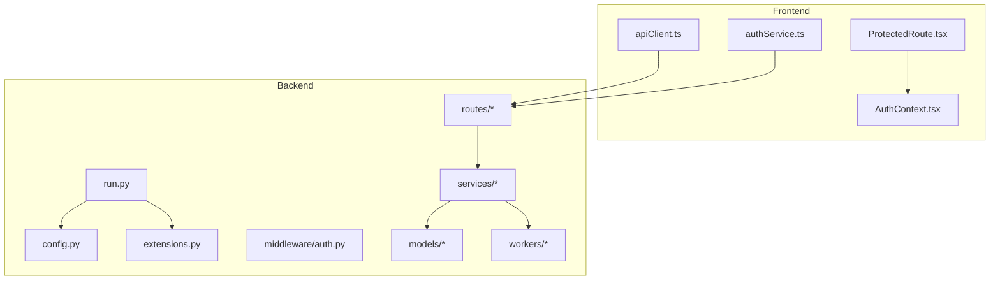
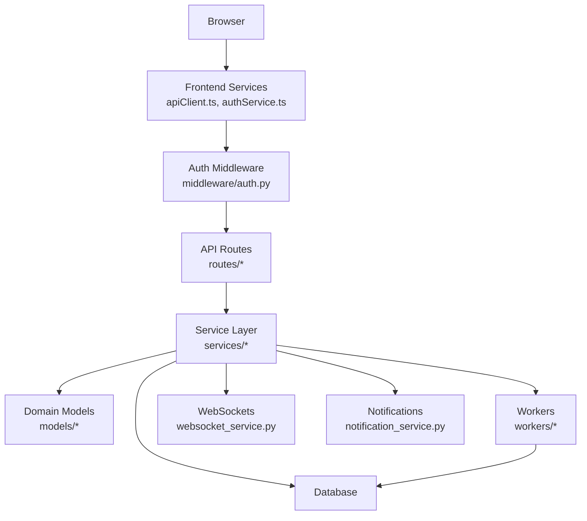
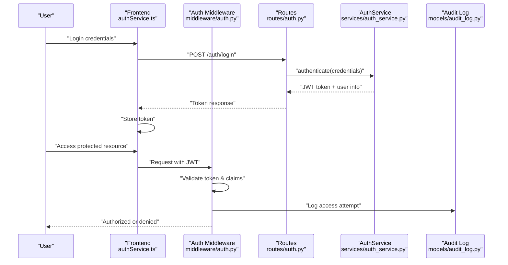
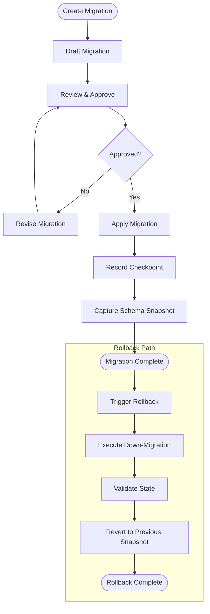
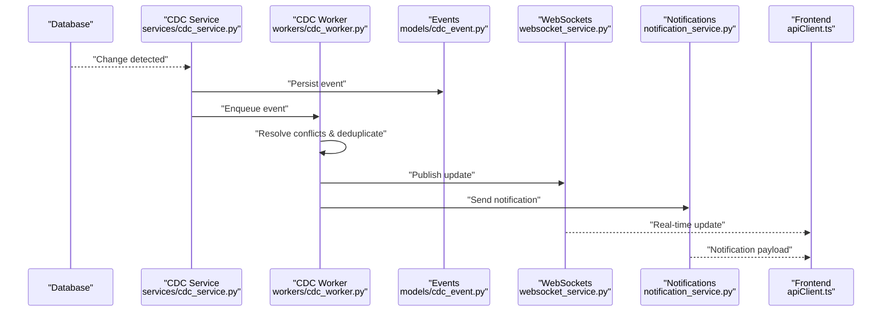
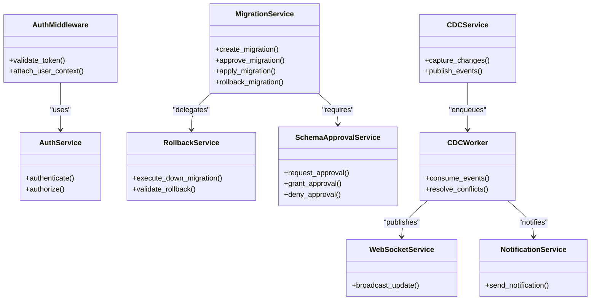
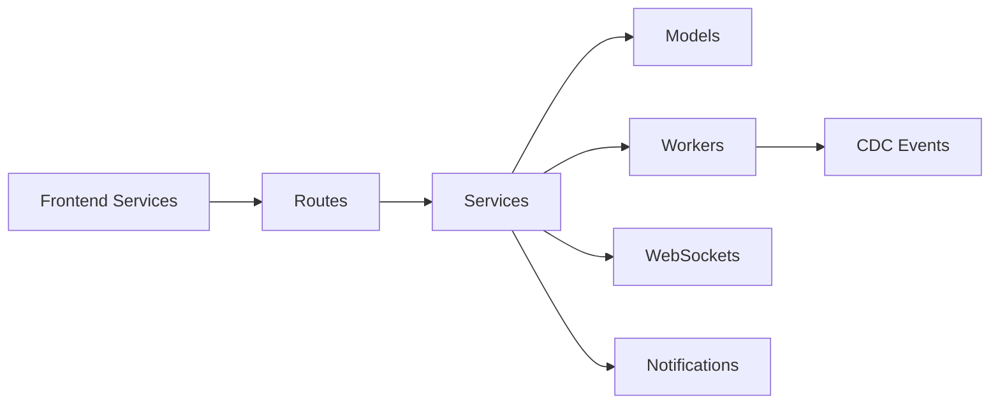

# Core Concepts

<cite>
**Referenced Files in This Document**
- [run.py](file://backend/run.py)
- [config.py](file://backend/app/config.py)
- [extensions.py](file://backend/app/extensions.py)
- [auth.py](file://backend/app/middleware/auth.py)
- [auth_service.py](file://backend/app/services/auth_service.py)
- [auth.py](file://backend/app/routes/auth.py)
- [migration.py](file://backend/app/models/migration.py)
- [migration_checkpoint.py](file://backend/app/models/migration_checkpoint.py)
- [schema_snapshot.py](file://backend/app/models/schema_snapshot.py)
- [migration_service.py](file://backend/app/services/migration_service.py)
- [rollback_service.py](file://backend/app/services/rollback_service.py)
- [schema_approval_service.py](file://backend/app/services/schema_approval_service.py)
- [cdc_config.py](file://backend/app/models/cdc_config.py)
- [cdc_event.py](file://backend/app/models/cdc_event.py)
- [cdc_service.py](file://backend/app/services/cdc_service.py)
- [cdc_worker.py](file://backend/app/workers/cdc_worker.py)
- [audit_log.py](file://backend/app/models/audit_log.py)
- [notification_service.py](file://backend/app/services/notification_service.py)
- [websocket_service.py](file://backend/app/services/websocket_service.py)
- [apiClient.ts](file://frontend/src/services/apiClient.ts)
- [authService.ts](file://frontend/src/services/authService.ts)
- [ProtectedRoute.tsx](file://frontend/src/components/routing/ProtectedRoute.tsx)
- [AuthContext.tsx](file://frontend/src/context/AuthContext.tsx)
</cite>

## Table of Contents
1. [Introduction](#introduction)
2. [Project Structure](#project-structure)
3. [Core Components](#core-components)
4. [Architecture Overview](#architecture-overview)
5. [Detailed Component Analysis](#detailed-component-analysis)
6. [Dependency Analysis](#dependency-analysis)
7. [Performance Considerations](#performance-considerations)
8. [Troubleshooting Guide](#troubleshooting-guide)
9. [Conclusion](#conclusion)

## Introduction
This document explains the core concepts and architectural principles of CloudBridge, focusing on:
- Database migration concepts including version control, rollback strategies, and approval workflows
- Change Data Capture (CDC) principles covering event sourcing, conflict resolution, and real-time synchronization
- Security model including JWT authentication, role-based access control, and audit trails
- Service layer architecture and component interactions
- End-to-end data flow between frontend, backend services, and external systems
- Key design decisions and trade-offs shaping platform behavior

## Project Structure
CloudBridge is a full-stack application with a Python backend and a TypeScript/React frontend. The backend organizes code by feature areas (routes, services, models, workers), while the frontend separates UI components, pages, services, and context providers.

**Diagram sources**
- [run.py](file://backend/run.py)
- [config.py](file://backend/app/config.py)
- [extensions.py](file://backend/app/extensions.py)
- [auth.py](file://backend/app/middleware/auth.py)
- [apiClient.ts](file://frontend/src/services/apiClient.ts)
- [authService.ts](file://frontend/src/services/authService.ts)
- [ProtectedRoute.tsx](file://frontend/src/components/routing/ProtectedRoute.tsx)
- [AuthContext.tsx](file://frontend/src/context/AuthContext.tsx)

**Section sources**
- [run.py](file://backend/run.py)
- [config.py](file://backend/app/config.py)
- [extensions.py](file://backend/app/extensions.py)
- [apiClient.ts](file://frontend/src/services/apiClient.ts)
- [authService.ts](file://frontend/src/services/authService.ts)
- [ProtectedRoute.tsx](file://frontend/src/components/routing/ProtectedRoute.tsx)
- [AuthContext.tsx](file://frontend/src/context/AuthContext.tsx)

## Core Components
- Security and Access Control
  - JWT-based authentication and authorization middleware
  - Role-based access control enforced at route level
  - Audit logging for security-sensitive actions
- Migration Engine
  - Versioned schema migrations with checkpoints and snapshots
  - Approval workflow before applying changes to production
  - Rollback support with deterministic revert logic
- CDC Pipeline
  - Event-driven capture of database changes
  - Conflict resolution and idempotent processing
  - Real-time synchronization via websockets and notifications
- Service Layer
  - Clear separation between HTTP routes and business logic
  - Workers for long-running tasks (e.g., CDC ingestion)
  - External integrations abstracted behind service interfaces

**Section sources**
- [auth.py](file://backend/app/middleware/auth.py)
- [auth_service.py](file://backend/app/services/auth_service.py)
- [auth.py](file://backend/app/routes/auth.py)
- [migration.py](file://backend/app/models/migration.py)
- [migration_checkpoint.py](file://backend/app/models/migration_checkpoint.py)
- [schema_snapshot.py](file://backend/app/models/schema_snapshot.py)
- [migration_service.py](file://backend/app/services/migration_service.py)
- [rollback_service.py](file://backend/app/services/rollback_service.py)
- [schema_approval_service.py](file://backend/app/services/schema_approval_service.py)
- [cdc_config.py](file://backend/app/models/cdc_config.py)
- [cdc_event.py](file://backend/app/models/cdc_event.py)
- [cdc_service.py](file://backend/app/services/cdc_service.py)
- [cdc_worker.py](file://backend/app/workers/cdc_worker.py)
- [audit_log.py](file://backend/app/models/audit_log.py)
- [notification_service.py](file://backend/app/services/notification_service.py)
- [websocket_service.py](file://backend/app/services/websocket_service.py)

## Architecture Overview
The system follows a layered architecture:
- Frontend: React SPA with protected routes and API clients
- Backend: FastAPI-style routing with service-layer orchestration
- Persistence: Relational database with Alembic-managed migrations
- Background Processing: Workers for CDC and other async tasks
- Observability: Notifications and websockets for real-time updates

**Diagram sources**
- [auth.py](file://backend/app/middleware/auth.py)
- [apiClient.ts](file://frontend/src/services/apiClient.ts)
- [authService.ts](file://frontend/src/services/authService.ts)
- [websocket_service.py](file://backend/app/services/websocket_service.py)
- [notification_service.py](file://backend/app/services/notification_service.py)

## Detailed Component Analysis

### Security Model: JWT Authentication, RBAC, and Audit Trails
- Authentication Flow
  - Frontend authenticates via auth service and stores tokens
  - Protected routes enforce token presence and validity
  - Middleware validates JWT claims and attaches user context
- Authorization
  - Route-level guards check roles/permissions
  - Contextual checks in services for sensitive operations
- Audit Trail
  - Security-sensitive actions are logged with actor, action, and timestamp
  - Notifications can be emitted for critical events

**Diagram sources**
- [authService.ts](file://frontend/src/services/authService.ts)
- [auth.py](file://backend/app/routes/auth.py)
- [auth.py](file://backend/app/middleware/auth.py)
- [auth_service.py](file://backend/app/services/auth_service.py)
- [audit_log.py](file://backend/app/models/audit_log.py)

**Section sources**
- [auth.py](file://backend/app/middleware/auth.py)
- [auth_service.py](file://backend/app/services/auth_service.py)
- [auth.py](file://backend/app/routes/auth.py)
- [audit_log.py](file://backend/app/models/audit_log.py)
- [ProtectedRoute.tsx](file://frontend/src/components/routing/ProtectedRoute.tsx)
- [AuthContext.tsx](file://frontend/src/context/AuthContext.tsx)

### Database Migrations: Versioning, Rollbacks, and Approvals
- Version Control
  - Each migration has a unique version identifier
  - Checkpoints track applied versions and state
  - Schema snapshots preserve pre/post states for comparison
- Approval Workflow
  - Changes require approval before deployment
  - Approval status gates execution paths
- Rollback Strategy
  - Deterministic down-migrations per version
  - Atomic transactions ensure consistency
  - Post-rollback validation and snapshot reconciliation

**Diagram sources**
- [migration.py](file://backend/app/models/migration.py)
- [migration_checkpoint.py](file://backend/app/models/migration_checkpoint.py)
- [schema_snapshot.py](file://backend/app/models/schema_snapshot.py)
- [migration_service.py](file://backend/app/services/migration_service.py)
- [rollback_service.py](file://backend/app/services/rollback_service.py)
- [schema_approval_service.py](file://backend/app/services/schema_approval_service.py)

**Section sources**
- [migration.py](file://backend/app/models/migration.py)
- [migration_checkpoint.py](file://backend/app/models/migration_checkpoint.py)
- [schema_snapshot.py](file://backend/app/models/schema_snapshot.py)
- [migration_service.py](file://backend/app/services/migration_service.py)
- [rollback_service.py](file://backend/app/services/rollback_service.py)
- [schema_approval_service.py](file://backend/app/services/schema_approval_service.py)

### Change Data Capture (CDC): Event Sourcing, Conflict Resolution, Real-Time Sync
- Event Sourcing
  - Database changes captured as immutable events
  - Events persisted with metadata (source, timestamp, version)
- Conflict Resolution
  - Idempotent event processing prevents duplicates
  - Merge strategies resolve concurrent updates
- Real-Time Synchronization
  - Workers consume CDC events and publish updates
  - WebSockets push live updates to clients
  - Notifications inform users of significant changes

**Diagram sources**
- [cdc_service.py](file://backend/app/services/cdc_service.py)
- [cdc_worker.py](file://backend/app/workers/cdc_worker.py)
- [cdc_event.py](file://backend/app/models/cdc_event.py)
- [cdc_config.py](file://backend/app/models/cdc_config.py)
- [websocket_service.py](file://backend/app/services/websocket_service.py)
- [notification_service.py](file://backend/app/services/notification_service.py)
- [apiClient.ts](file://frontend/src/services/apiClient.ts)

**Section sources**
- [cdc_config.py](file://backend/app/models/cdc_config.py)
- [cdc_event.py](file://backend/app/models/cdc_event.py)
- [cdc_service.py](file://backend/app/services/cdc_service.py)
- [cdc_worker.py](file://backend/app/workers/cdc_worker.py)
- [websocket_service.py](file://backend/app/services/websocket_service.py)
- [notification_service.py](file://backend/app/services/notification_service.py)
- [apiClient.ts](file://frontend/src/services/apiClient.ts)

### Service Layer Architecture and Interactions
- Routing Layer
  - Thin controllers that validate input and delegate to services
- Service Layer
  - Encapsulates business logic and orchestrates domain operations
  - Coordinates with models, workers, and external integrations
- Domain Models
  - Represent core entities and constraints
- Workers
  - Handle long-running tasks like CDC ingestion and batch jobs
- Observability
  - WebSockets and notifications provide real-time feedback

**Diagram sources**
- [auth.py](file://backend/app/middleware/auth.py)
- [auth_service.py](file://backend/app/services/auth_service.py)
- [migration_service.py](file://backend/app/services/migration_service.py)
- [rollback_service.py](file://backend/app/services/rollback_service.py)
- [schema_approval_service.py](file://backend/app/services/schema_approval_service.py)
- [cdc_service.py](file://backend/app/services/cdc_service.py)
- [cdc_worker.py](file://backend/app/workers/cdc_worker.py)
- [websocket_service.py](file://backend/app/services/websocket_service.py)
- [notification_service.py](file://backend/app/services/notification_service.py)

**Section sources**
- [auth.py](file://backend/app/middleware/auth.py)
- [auth_service.py](file://backend/app/services/auth_service.py)
- [migration_service.py](file://backend/app/services/migration_service.py)
- [rollback_service.py](file://backend/app/services/rollback_service.py)
- [schema_approval_service.py](file://backend/app/services/schema_approval_service.py)
- [cdc_service.py](file://backend/app/services/cdc_service.py)
- [cdc_worker.py](file://backend/app/workers/cdc_worker.py)
- [websocket_service.py](file://backend/app/services/websocket_service.py)
- [notification_service.py](file://backend/app/services/notification_service.py)

## Dependency Analysis
Key dependencies and relationships:
- Frontend depends on backend APIs and websockets
- Backend routes depend on services for business logic
- Services depend on models for persistence and workers for async tasks
- Workers depend on CDC configuration and event models
- Observability services (websockets, notifications) are used across features

**Diagram sources**
- [apiClient.ts](file://frontend/src/services/apiClient.ts)
- [authService.ts](file://frontend/src/services/authService.ts)
- [cdc_event.py](file://backend/app/models/cdc_event.py)
- [websocket_service.py](file://backend/app/services/websocket_service.py)
- [notification_service.py](file://backend/app/services/notification_service.py)

**Section sources**
- [apiClient.ts](file://frontend/src/services/apiClient.ts)
- [authService.ts](file://frontend/src/services/authService.ts)
- [cdc_event.py](file://backend/app/models/cdc_event.py)
- [websocket_service.py](file://backend/app/services/websocket_service.py)
- [notification_service.py](file://backend/app/services/notification_service.py)

## Performance Considerations
- Use connection pooling for database operations
- Batch CDC events to reduce overhead
- Implement idempotency keys for retries
- Cache frequently accessed read-only data
- Offload heavy tasks to workers
- Monitor backpressure in websocket streams

[No sources needed since this section provides general guidance]

## Troubleshooting Guide
- Authentication Issues
  - Verify JWT signature and expiration
  - Check role assignments and permissions
- Migration Failures
  - Inspect checkpoint logs and schema snapshots
  - Validate down-migration determinism
- CDC Delays
  - Confirm worker health and queue depth
  - Review conflict resolution logs
- Real-Time Updates
  - Ensure websocket connections are established
  - Validate notification delivery

**Section sources**
- [auth.py](file://backend/app/middleware/auth.py)
- [auth_service.py](file://backend/app/services/auth_service.py)
- [migration_checkpoint.py](file://backend/app/models/migration_checkpoint.py)
- [schema_snapshot.py](file://backend/app/models/schema_snapshot.py)
- [cdc_worker.py](file://backend/app/workers/cdc_worker.py)
- [websocket_service.py](file://backend/app/services/websocket_service.py)
- [notification_service.py](file://backend/app/services/notification_service.py)

## Conclusion
CloudBridge’s architecture emphasizes clear separation of concerns, strong security, and reliable data evolution. The migration engine ensures controlled schema changes with approvals and rollbacks. CDC enables event-driven, real-time synchronization with robust conflict handling. The service layer encapsulates business logic, while workers handle asynchronous workloads. Together, these patterns deliver a scalable, observable, and secure platform.

[No sources needed since this section summarizes without analyzing specific files]