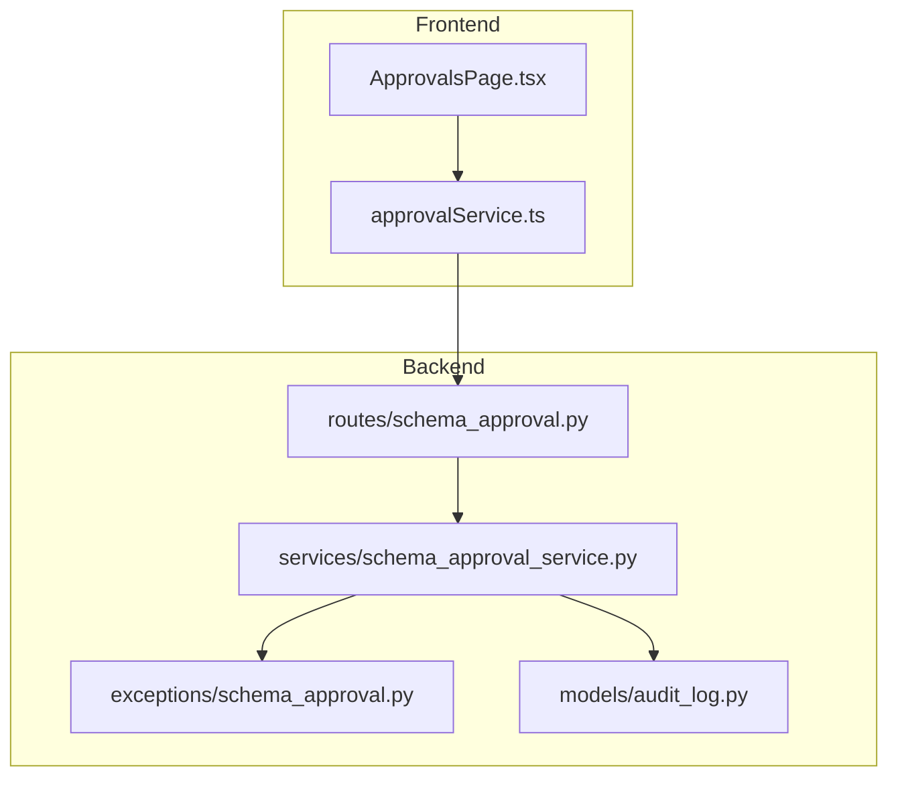
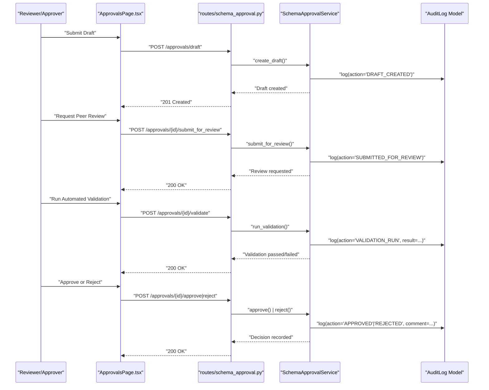
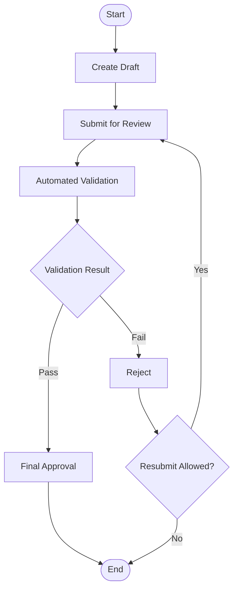
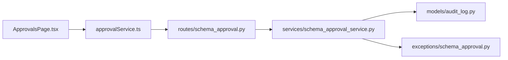

# Approval Workflows & Governance

<cite>
**Referenced Files in This Document**
- [schema_approval_service.py](file://backend/app/services/schema_approval_service.py)
- [schema_approval.py](file://backend/app/routes/schema_approval.py)
- [schema_approval_exception.py](file://backend/app/exceptions/schema_approval.py)
- [audit_log.py](file://backend/app/models/audit_log.py)
- [approvalService.ts](file://frontend/src/services/approvalService.ts)
- [ApprovalsPage.tsx](file://frontend/src/pages/ApprovalsPage.tsx)
</cite>

## Table of Contents
1. [Introduction](#introduction)
2. [Project Structure](#project-structure)
3. [Core Components](#core-components)
4. [Architecture Overview](#architecture-overview)
5. [Detailed Component Analysis](#detailed-component-analysis)
6. [Dependency Analysis](#dependency-analysis)
7. [Performance Considerations](#performance-considerations)
8. [Troubleshooting Guide](#troubleshooting-guide)
9. [Conclusion](#conclusion)
10. [Appendices](#appendices)

## Introduction
This document explains the approval workflow system in CloudBridge, focusing on multi-stage approvals (draft submission, peer review, automated validation, and final approval), the SchemaApprovalService implementation, audit trail capabilities, configuration examples, escalation procedures, bulk approvals, integration with external systems, and governance policies. It is intended for both technical implementers and governance operators.

## Project Structure
The approval workflow spans backend services, routes, exceptions, models, and frontend UI components:
- Backend service layer: schema approval orchestration and policy enforcement
- API routes: HTTP endpoints to submit, review, validate, approve, and reject
- Exceptions: domain-specific error types for approval flows
- Audit model: persistent records of actions, comments, and decisions
- Frontend services and pages: client-side interactions for reviewers and approvers

**Diagram sources**
- [schema_approval.py](file://backend/app/routes/schema_approval.py)
- [schema_approval_service.py](file://backend/app/services/schema_approval_service.py)
- [schema_approval_exception.py](file://backend/app/exceptions/schema_approval.py)
- [audit_log.py](file://backend/app/models/audit_log.py)
- [approvalService.ts](file://frontend/src/services/approvalService.ts)
- [ApprovalsPage.tsx](file://frontend/src/pages/ApprovalsPage.tsx)

**Section sources**
- [schema_approval.py](file://backend/app/routes/schema_approval.py)
- [schema_approval_service.py](file://backend/app/services/schema_approval_service.py)
- [schema_approval_exception.py](file://backend/app/exceptions/schema_approval.py)
- [audit_log.py](file://backend/app/models/audit_log.py)
- [approvalService.ts](file://frontend/src/services/approvalService.ts)
- [ApprovalsPage.tsx](file://frontend/src/pages/ApprovalsPage.tsx)

## Core Components
- SchemaApprovalService: Implements the core approval lifecycle, including state transitions, rule evaluation, role-based permissions, and audit logging.
- Routes: Expose REST endpoints for creating drafts, submitting for review, running validations, approving/rejecting, and querying history.
- Exceptions: Define structured errors for invalid states, insufficient permissions, and validation failures.
- Audit Log Model: Persists immutable records of all actions, comments, decisions, and timestamps.
- Frontend Integration: Provides UI for reviewers/approvers to interact with workflows and view timelines.

Key responsibilities:
- Enforce stage gates (Draft → Peer Review → Automated Validation → Final Approval)
- Validate user roles and permissions at each step
- Record comprehensive audit trails
- Support rejections, resubmissions, and escalations
- Provide bulk operations where applicable

**Section sources**
- [schema_approval_service.py](file://backend/app/services/schema_approval_service.py)
- [schema_approval.py](file://backend/app/routes/schema_approval.py)
- [schema_approval_exception.py](file://backend/app/exceptions/schema_approval.py)
- [audit_log.py](file://backend/app/models/audit_log.py)

## Architecture Overview
The approval workflow follows a staged pipeline with explicit state transitions and checks at each gate. The service orchestrates business logic, while routes handle HTTP concerns and the audit model persists events.

**Diagram sources**
- [schema_approval.py](file://backend/app/routes/schema_approval.py)
- [schema_approval_service.py](file://backend/app/services/schema_approval_service.py)
- [audit_log.py](file://backend/app/models/audit_log.py)

## Detailed Component Analysis

### SchemaApprovalService
Responsibilities:
- Manage approval lifecycle states and transitions
- Evaluate approval rules (e.g., required validations, reviewer assignments)
- Enforce role-based permissions (e.g., reviewer vs. approver)
- Persist audit entries for every action and decision
- Handle rejection and resubmission flows
- Support bulk operations when applicable

Typical methods:
- create_draft(payload)
- submit_for_review(approval_id, actor)
- run_validation(approval_id, actor)
- approve(approval_id, actor, comment)
- reject(approval_id, actor, comment)
- list_pending(actor, filters)
- bulk_approve(ids, actor, comment)
- escalate(approval_id, actor, reason)

State transitions:
- Draft → Submitted for Review
- Submitted for Review → Under Validation
- Under Validation → Approved or Rejected
- Rejected → Resubmitted (optional)

Permission checks:
- Only creators can draft and resubmit
- Assigned reviewers can review
- Approvers can finalize decisions
- Escalation requires elevated privileges

Audit logging:
- Every transition logs actor, timestamp, and optional comment
- Decisions include rationale and outcome
- Validation runs record pass/fail details

**Diagram sources**
- [schema_approval_service.py](file://backend/app/services/schema_approval_service.py)

**Section sources**
- [schema_approval_service.py](file://backend/app/services/schema_approval_service.py)

### API Routes
Endpoints:
- POST /approvals/draft: Create a new draft
- POST /approvals/{id}/submit_for_review: Transition to review
- POST /approvals/{id}/validate: Trigger automated validation
- POST /approvals/{id}/approve: Finalize approval
- POST /approvals/{id}/reject: Reject with comment
- GET /approvals/{id}: Retrieve details and timeline
- GET /approvals/pending: List pending items for current user
- POST /approvals/bulk/approve: Bulk approve multiple items

Error handling:
- Returns domain-specific errors via schema_approval exceptions
- Validates input payloads and authorization context

**Section sources**
- [schema_approval.py](file://backend/app/routes/schema_approval.py)

### Exceptions
Domain exceptions cover:
- Invalid state transitions
- Insufficient permissions
- Validation failures
- Missing or malformed inputs

These ensure consistent error responses and clear diagnostics for clients.

**Section sources**
- [schema_approval_exception.py](file://backend/app/exceptions/schema_approval.py)

### Audit Trail Model
The audit log captures:
- Action type (e.g., DRAFT_CREATED, SUBMITTED_FOR_REVIEW, VALIDATION_RUN, APPROVED, REJECTED)
- Actor identity and timestamp
- Optional comment or rationale
- Outcome details (e.g., validation results)

This provides an immutable history for compliance and troubleshooting.

**Section sources**
- [audit_log.py](file://backend/app/models/audit_log.py)

### Frontend Integration
- ApprovalsPage.tsx: Presents approval tasks, timelines, and actions for reviewers/approvers
- approvalService.ts: Encapsulates API calls for creating, reviewing, validating, approving, rejecting, and listing approvals

User experience highlights:
- Clear status badges per stage
- Inline commenting on decisions
- Timeline view of audit events
- Bulk actions where supported

**Section sources**
- [ApprovalsPage.tsx](file://frontend/src/pages/ApprovalsPage.tsx)
- [approvalService.ts](file://frontend/src/services/approvalService.ts)

## Dependency Analysis
High-level dependencies:
- Routes depend on SchemaApprovalService for business logic
- Service depends on AuditLog model for persistence
- Service raises domain exceptions for error signaling
- Frontend depends on routes via HTTP and renders approval UI

**Diagram sources**
- [schema_approval.py](file://backend/app/routes/schema_approval.py)
- [schema_approval_service.py](file://backend/app/services/schema_approval_service.py)
- [schema_approval_exception.py](file://backend/app/exceptions/schema_approval.py)
- [audit_log.py](file://backend/app/models/audit_log.py)
- [approvalService.ts](file://frontend/src/services/approvalService.ts)
- [ApprovalsPage.tsx](file://frontend/src/pages/ApprovalsPage.tsx)

**Section sources**
- [schema_approval.py](file://backend/app/routes/schema_approval.py)
- [schema_approval_service.py](file://backend/app/services/schema_approval_service.py)
- [schema_approval_exception.py](file://backend/app/exceptions/schema_approval.py)
- [audit_log.py](file://backend/app/models/audit_log.py)
- [approvalService.ts](file://frontend/src/services/approvalService.ts)
- [ApprovalsPage.tsx](file://frontend/src/pages/ApprovalsPage.tsx)

## Performance Considerations
- Batch operations: Prefer bulk endpoints for large sets of approvals to reduce round trips.
- Idempotency: Ensure repeated requests do not duplicate audit entries or change state unexpectedly.
- Pagination: Use pagination for listing pending approvals to avoid heavy payloads.
- Caching: Cache read-only metadata (e.g., user roles) where appropriate; invalidate on changes.
- Async validation: For long-running validations, consider background jobs and polling/webhooks.

[No sources needed since this section provides general guidance]

## Troubleshooting Guide
Common issues and resolutions:
- Invalid state transition: Verify current stage and allowed next steps; check audit timeline for recent actions.
- Insufficient permissions: Confirm user roles match required permissions for the action.
- Validation failure: Review validation output in audit trail; correct schema or configuration and resubmit.
- Duplicate submissions: Use idempotent keys or deduplicate client-side before calling APIs.
- Stuck approvals: Inspect audit log for missing transitions; escalate if necessary.

Operational tips:
- Always attach meaningful comments during approvals/rejections to aid traceability.
- Monitor exception logs for recurring permission or validation errors.
- Use filtering and sorting on pending lists to focus on high-priority items.

**Section sources**
- [schema_approval_exception.py](file://backend/app/exceptions/schema_approval.py)
- [audit_log.py](file://backend/app/models/audit_log.py)

## Conclusion
CloudBridge’s approval workflow provides a robust, auditable, and extensible framework for managing schema changes through clearly defined stages. With strong role-based controls, comprehensive audit trails, and practical UI integrations, teams can enforce governance while maintaining agility. Adopt the recommended practices for escalation, bulk operations, and external integrations to meet organizational compliance needs.

[No sources needed since this section summarizes without analyzing specific files]

## Appendices

### Practical Configuration Examples
- Defining approval rules:
  - Require automated validation to pass before final approval
  - Assign reviewers by team or project scope
  - Mandate comments for rejections
- Setting up reviewers:
  - Map users to reviewer roles
  - Configure fallback reviewers for absences
- Handling rejections:
  - Allow resubmission after fixes
  - Capture detailed reasons in comments
- Escalation procedures:
  - Route stalled items to senior approvers
  - Notify stakeholders upon escalation
- Bulk approvals:
  - Select multiple pending items and approve with a single action
  - Include a global comment for audit clarity
- External integrations:
  - Call external approval systems from service hooks
  - Sync outcomes back into audit trail

[No sources needed since this section provides general guidance]