# Database Migrations

<cite>
**Referenced Files in This Document**
- [backend/app/models/migration.py](file://backend/app/models/migration.py)
- [backend/app/models/migration_checkpoint.py](file://backend/app/models/migration_checkpoint.py)
- [backend/app/models/schema_snapshot.py](file://backend/app/models/schema_snapshot.py)
- [backend/app/models/audit_log.py](file://backend/app/models/audit_log.py)
- [backend/app/services/migration_service.py](file://backend/app/services/migration_service.py)
- [backend/app/services/schema_approval_service.py](file://backend/app/services/schema_approval_service.py)
- [backend/app/services/rollback_service.py](file://backend/app/services/rollback_service.py)
- [backend/app/routes/migration.py](file://backend/app/routes/migration.py)
- [backend/app/routes/migration_engine.py](file://backend/app/routes/migration_engine.py)
- [backend/app/routes/schema_approval.py](file://backend/app/routes/schema_approval.py)
- [backend/app/routes/rollback.py](file://backend/app/routes/rollback.py)
- [backend/app/exceptions/migration.py](file://backend/app/exceptions/migration.py)
- [backend/app/exceptions/schema_approval.py](file://backend/app/exceptions/schema_approval.py)
- [backend/app/exceptions/rollback.py](file://backend/app/exceptions/rollback.py)
- [backend/migrations/env.py](file://backend/migrations/env.py)
- [backend/migrations/script.py.mako](file://backend/migrations/script.py.mako)
- [backend/migrations/README](file://backend/migrations/README)
- [backend/tests/test_migrations.py](file://backend/tests/test_migrations.py)
</cite>

## Table of Contents
1. [Introduction](#introduction)
2. [Project Structure](#project-structure)
3. [Core Components](#core-components)
4. [Architecture Overview](#architecture-overview)
5. [Detailed Component Analysis](#detailed-component-analysis)
6. [Dependency Analysis](#dependency-analysis)
7. [Performance Considerations](#performance-considerations)
8. [Troubleshooting Guide](#troubleshooting-guide)
9. [Conclusion](#conclusion)
10. [Appendices](#appendices)

## Introduction
This document explains the database migration system in CloudBridge with a focus on version-controlled schema changes, lifecycle management, and safe evolution. It covers how migrations are created, reviewed, approved, executed, tracked, and rolled back. It also documents the migration engine architecture, including execution strategies, dependency resolution, error handling, testing strategies, validation rules, and best practices for safe schema evolution.

## Project Structure
CloudBridge organizes migration-related functionality across models, services, routes, exceptions, Alembic configuration, and tests:
- Models define persistent entities for migrations, checkpoints, snapshots, and audit logs.
- Services implement business logic for creating, approving, executing, and rolling back migrations.
- Routes expose APIs to orchestrate the migration lifecycle.
- Exceptions standardize error responses across the migration subsystem.
- Alembic files configure the migration environment and template generation.
- Tests validate core behaviors and edge cases.

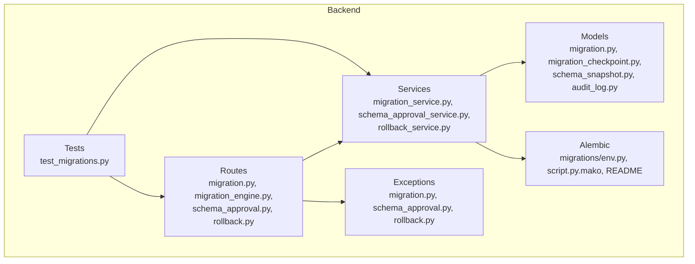

**Diagram sources**
- [backend/app/models/migration.py](file://backend/app/models/migration.py)
- [backend/app/models/migration_checkpoint.py](file://backend/app/models/migration_checkpoint.py)
- [backend/app/models/schema_snapshot.py](file://backend/app/models/schema_snapshot.py)
- [backend/app/models/audit_log.py](file://backend/app/models/audit_log.py)
- [backend/app/services/migration_service.py](file://backend/app/services/migration_service.py)
- [backend/app/services/schema_approval_service.py](file://backend/app/services/schema_approval_service.py)
- [backend/app/services/rollback_service.py](file://backend/app/services/rollback_service.py)
- [backend/app/routes/migration.py](file://backend/app/routes/migration.py)
- [backend/app/routes/migration_engine.py](file://backend/app/routes/migration_engine.py)
- [backend/app/routes/schema_approval.py](file://backend/app/routes/schema_approval.py)
- [backend/app/routes/rollback.py](file://backend/app/routes/rollback.py)
- [backend/app/exceptions/migration.py](file://backend/app/exceptions/migration.py)
- [backend/app/exceptions/schema_approval.py](file://backend/app/exceptions/schema_approval.py)
- [backend/app/exceptions/rollback.py](file://backend/app/exceptions/rollback.py)
- [backend/migrations/env.py](file://backend/migrations/env.py)
- [backend/migrations/script.py.mako](file://backend/migrations/script.py.mako)
- [backend/migrations/README](file://backend/migrations/README)
- [backend/tests/test_migrations.py](file://backend/tests/test_migrations.py)

**Section sources**
- [backend/app/models/migration.py](file://backend/app/models/migration.py)
- [backend/app/models/migration_checkpoint.py](file://backend/app/models/migration_checkpoint.py)
- [backend/app/models/schema_snapshot.py](file://backend/app/models/schema_snapshot.py)
- [backend/app/models/audit_log.py](file://backend/app/models/audit_log.py)
- [backend/app/services/migration_service.py](file://backend/app/services/migration_service.py)
- [backend/app/services/schema_approval_service.py](file://backend/app/services/schema_approval_service.py)
- [backend/app/services/rollback_service.py](file://backend/app/services/rollback_service.py)
- [backend/app/routes/migration.py](file://backend/app/routes/migration.py)
- [backend/app/routes/migration_engine.py](file://backend/app/routes/migration_engine.py)
- [backend/app/routes/schema_approval.py](file://backend/app/routes/schema_approval.py)
- [backend/app/routes/rollback.py](file://backend/app/routes/rollback.py)
- [backend/app/exceptions/migration.py](file://backend/app/exceptions/migration.py)
- [backend/app/exceptions/schema_approval.py](file://backend/app/exceptions/schema_approval.py)
- [backend/app/exceptions/rollback.py](file://backend/app/exceptions/rollback.py)
- [backend/migrations/env.py](file://backend/migrations/env.py)
- [backend/migrations/script.py.mako](file://backend/migrations/script.py.mako)
- [backend/migrations/README](file://backend/migrations/README)
- [backend/tests/test_migrations.py](file://backend/tests/test_migrations.py)

## Core Components
- Migration model: Represents a migration unit with metadata such as version identifiers, status, and timestamps.
- Migration checkpoint: Tracks per-environment progress and state during execution.
- Schema snapshot: Captures a point-in-time view of the schema for comparison and rollback support.
- Audit log: Records immutable events for approvals, executions, and rollbacks.
- Migration service: Orchestrates creation, validation, approval gating, execution, and rollback flows.
- Schema approval service: Manages review states, approvals, and policy enforcement.
- Rollback service: Executes reverse operations safely with safeguards and verification.
- Routes: Provide REST endpoints that coordinate user actions with services.
- Exceptions: Centralized error types for consistent API responses.
- Alembic integration: Environment setup and migration script templates.

**Section sources**
- [backend/app/models/migration.py](file://backend/app/models/migration.py)
- [backend/app/models/migration_checkpoint.py](file://backend/app/models/migration_checkpoint.py)
- [backend/app/models/schema_snapshot.py](file://backend/app/models/schema_snapshot.py)
- [backend/app/models/audit_log.py](file://backend/app/models/audit_log.py)
- [backend/app/services/migration_service.py](file://backend/app/services/migration_service.py)
- [backend/app/services/schema_approval_service.py](file://backend/app/services/schema_approval_service.py)
- [backend/app/services/rollback_service.py](file://backend/app/services/rollback_service.py)
- [backend/app/routes/migration.py](file://backend/app/routes/migration.py)
- [backend/app/routes/migration_engine.py](file://backend/app/routes/migration_engine.py)
- [backend/app/routes/schema_approval.py](file://backend/app/routes/schema_approval.py)
- [backend/app/routes/rollback.py](file://backend/app/routes/rollback.py)
- [backend/app/exceptions/migration.py](file://backend/app/exceptions/migration.py)
- [backend/app/exceptions/schema_approval.py](file://backend/app/exceptions/schema_approval.py)
- [backend/app/exceptions/rollback.py](file://backend/app/exceptions/rollback.py)
- [backend/migrations/env.py](file://backend/migrations/env.py)
- [backend/migrations/script.py.mako](file://backend/migrations/script.py.mako)
- [backend/migrations/README](file://backend/migrations/README)

## Architecture Overview
The migration system follows a layered architecture:
- Presentation layer (routes) validates inputs and delegates to services.
- Service layer enforces business rules, orchestrates Alembic operations, updates models, and records audit events.
- Data layer persists migration state, checkpoints, snapshots, and audit logs.
- Alembic provides the underlying migration engine and version control.

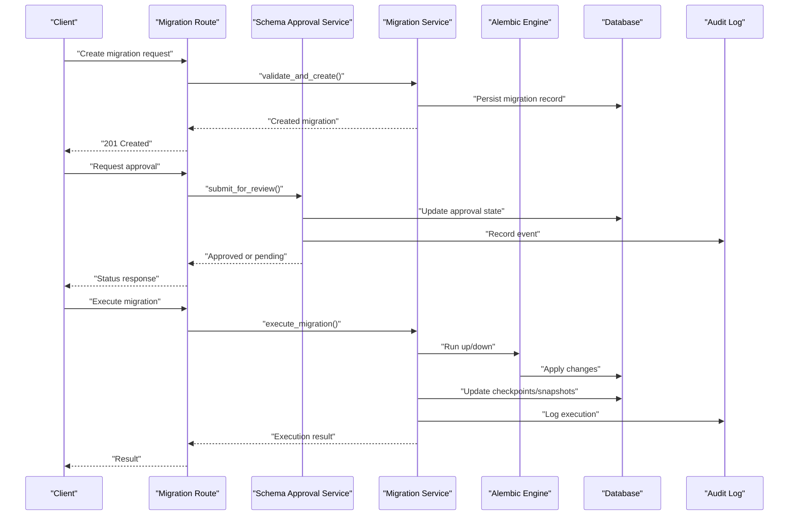

**Diagram sources**
- [backend/app/routes/migration.py](file://backend/app/routes/migration.py)
- [backend/app/services/migration_service.py](file://backend/app/services/migration_service.py)
- [backend/app/services/schema_approval_service.py](file://backend/app/services/schema_approval_service.py)
- [backend/app/models/migration.py](file://backend/app/models/migration.py)
- [backend/app/models/migration_checkpoint.py](file://backend/app/models/migration_checkpoint.py)
- [backend/app/models/schema_snapshot.py](file://backend/app/models/schema_snapshot.py)
- [backend/app/models/audit_log.py](file://backend/app/models/audit_log.py)
- [backend/migrations/env.py](file://backend/migrations/env.py)

## Detailed Component Analysis

### Migration Model and Lifecycle
The migration model captures the identity and state of each migration unit. The lifecycle includes:
- Creation: Generate a new migration entry with initial status.
- Validation: Ensure required fields and constraints are satisfied.
- Review and Approval: Gate execution until approved by reviewers.
- Execution: Apply forward or backward changes via the migration engine.
- Completion: Update checkpoints and snapshots; persist audit trail.

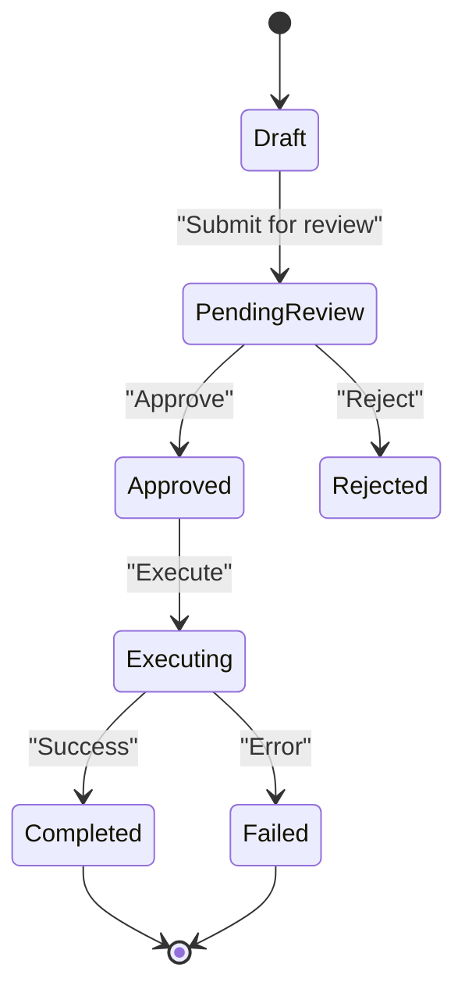

**Diagram sources**
- [backend/app/models/migration.py](file://backend/app/models/migration.py)
- [backend/app/services/migration_service.py](file://backend/app/services/migration_service.py)
- [backend/app/services/schema_approval_service.py](file://backend/app/services/schema_approval_service.py)

**Section sources**
- [backend/app/models/migration.py](file://backend/app/models/migration.py)
- [backend/app/services/migration_service.py](file://backend/app/services/migration_service.py)
- [backend/app/services/schema_approval_service.py](file://backend/app/services/schema_approval_service.py)

### Migration Checkpoint and Schema Snapshot
- Migration checkpoint tracks per-environment execution progress, ensuring idempotency and safe retries.
- Schema snapshot captures the current schema state before and after execution to support drift detection and rollback planning.

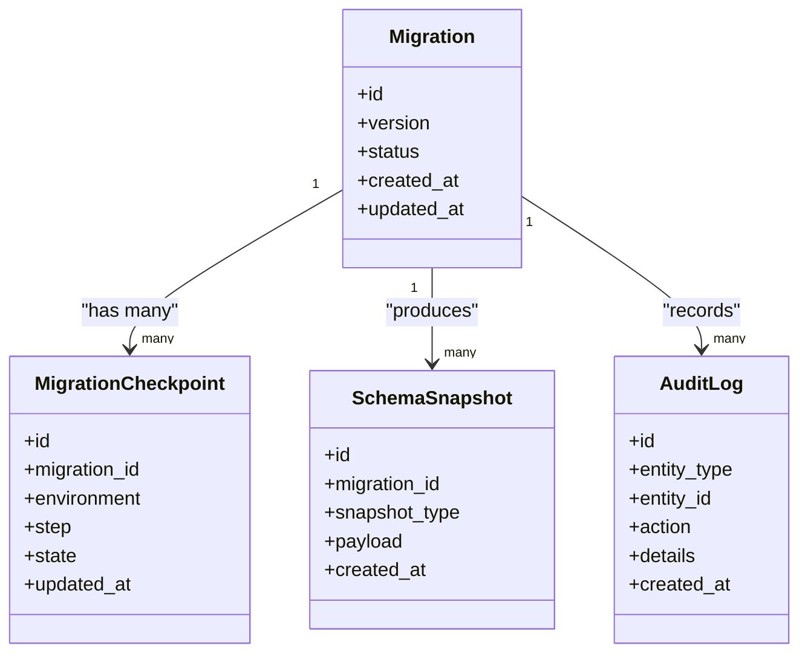

**Diagram sources**
- [backend/app/models/migration.py](file://backend/app/models/migration.py)
- [backend/app/models/migration_checkpoint.py](file://backend/app/models/migration_checkpoint.py)
- [backend/app/models/schema_snapshot.py](file://backend/app/models/schema_snapshot.py)
- [backend/app/models/audit_log.py](file://backend/app/models/audit_log.py)

**Section sources**
- [backend/app/models/migration_checkpoint.py](file://backend/app/models/migration_checkpoint.py)
- [backend/app/models/schema_snapshot.py](file://backend/app/models/schema_snapshot.py)
- [backend/app/models/audit_log.py](file://backend/app/models/audit_log.py)

### Approval Workflow System
The approval workflow ensures controlled schema changes:
- Submission: Requesters submit migrations for review.
- Review: Approvers evaluate risk, compatibility, and impact.
- Status tracking: States reflect current stage (pending, approved, rejected).
- Audit trail: All actions are recorded with actor and timestamp.

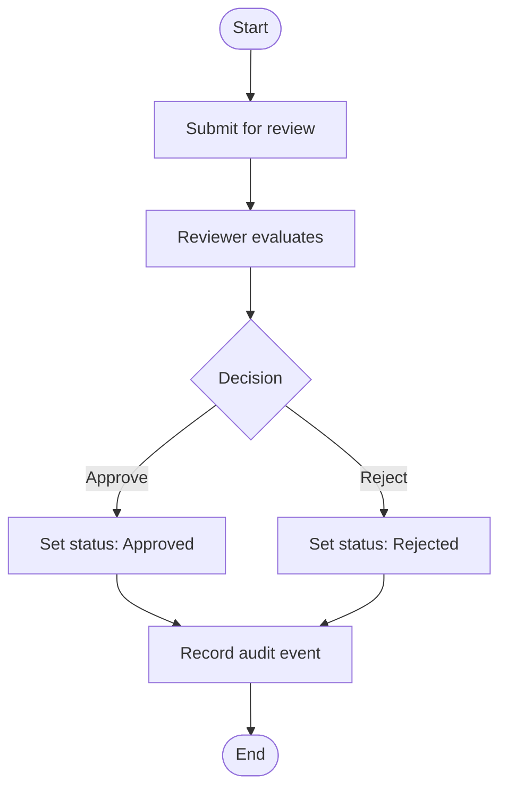

**Diagram sources**
- [backend/app/services/schema_approval_service.py](file://backend/app/services/schema_approval_service.py)
- [backend/app/models/audit_log.py](file://backend/app/models/audit_log.py)

**Section sources**
- [backend/app/services/schema_approval_service.py](file://backend/app/services/schema_approval_service.py)
- [backend/app/models/audit_log.py](file://backend/app/models/audit_log.py)

### Migration Engine Architecture
The migration engine integrates with Alembic to execute versioned schema changes:
- Execution strategies: Supports forward (up) and backward (down) operations.
- Dependency resolution: Ensures migrations run in correct order based on versions and dependencies.
- Error handling: Catches failures, marks migrations as failed, and preserves state for recovery.
- Idempotency: Uses checkpoints to avoid reapplying completed steps.

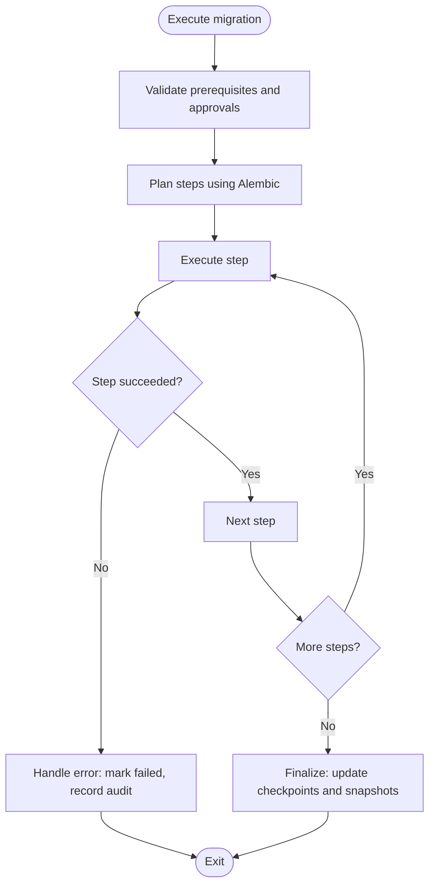

**Diagram sources**
- [backend/app/services/migration_service.py](file://backend/app/services/migration_service.py)
- [backend/migrations/env.py](file://backend/migrations/env.py)
- [backend/migrations/script.py.mako](file://backend/migrations/script.py.mako)

**Section sources**
- [backend/app/services/migration_service.py](file://backend/app/services/migration_service.py)
- [backend/migrations/env.py](file://backend/migrations/env.py)
- [backend/migrations/script.py.mako](file://backend/migrations/script.py.mako)

### Rollback Mechanisms
Rollbacks provide safe reversal of applied migrations:
- Target selection: Choose specific versions or latest.
- Safety checks: Verify prerequisites and ensure no conflicting changes.
- Execution: Run down migrations with transactional semantics where possible.
- Verification: Post-rollback validation and snapshot comparison.

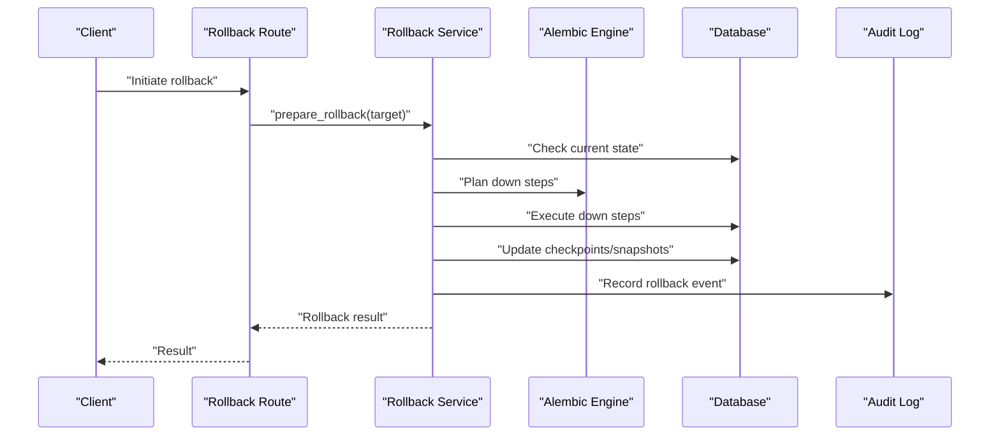

**Diagram sources**
- [backend/app/routes/rollback.py](file://backend/app/routes/rollback.py)
- [backend/app/services/rollback_service.py](file://backend/app/services/rollback_service.py)
- [backend/app/models/migration_checkpoint.py](file://backend/app/models/migration_checkpoint.py)
- [backend/app/models/schema_snapshot.py](file://backend/app/models/schema_snapshot.py)
- [backend/app/models/audit_log.py](file://backend/app/models/audit_log.py)

**Section sources**
- [backend/app/routes/rollback.py](file://backend/app/routes/rollback.py)
- [backend/app/services/rollback_service.py](file://backend/app/services/rollback_service.py)
- [backend/app/models/migration_checkpoint.py](file://backend/app/models/migration_checkpoint.py)
- [backend/app/models/schema_snapshot.py](file://backend/app/models/schema_snapshot.py)
- [backend/app/models/audit_log.py](file://backend/app/models/audit_log.py)

### API Workflows

#### Create Migration
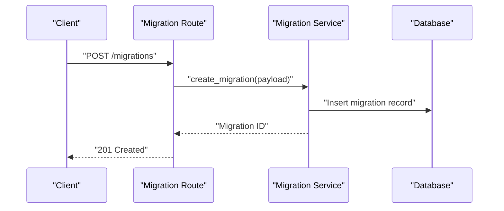

**Diagram sources**
- [backend/app/routes/migration.py](file://backend/app/routes/migration.py)
- [backend/app/services/migration_service.py](file://backend/app/services/migration_service.py)
- [backend/app/models/migration.py](file://backend/app/models/migration.py)

**Section sources**
- [backend/app/routes/migration.py](file://backend/app/routes/migration.py)
- [backend/app/services/migration_service.py](file://backend/app/services/migration_service.py)
- [backend/app/models/migration.py](file://backend/app/models/migration.py)

#### Approve Migration
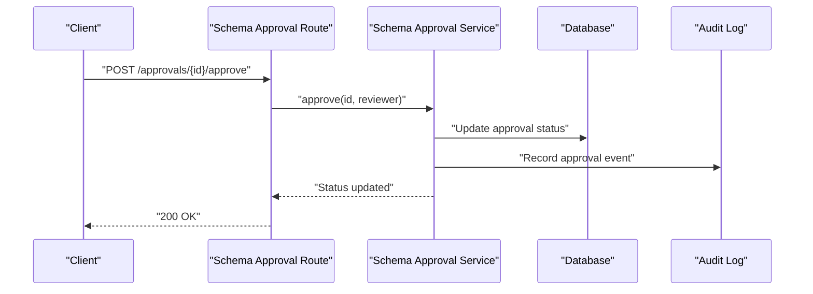

**Diagram sources**
- [backend/app/routes/schema_approval.py](file://backend/app/routes/schema_approval.py)
- [backend/app/services/schema_approval_service.py](file://backend/app/services/schema_approval_service.py)
- [backend/app/models/audit_log.py](file://backend/app/models/audit_log.py)

**Section sources**
- [backend/app/routes/schema_approval.py](file://backend/app/routes/schema_approval.py)
- [backend/app/services/schema_approval_service.py](file://backend/app/services/schema_approval_service.py)
- [backend/app/models/audit_log.py](file://backend/app/models/audit_log.py)

#### Execute Migration
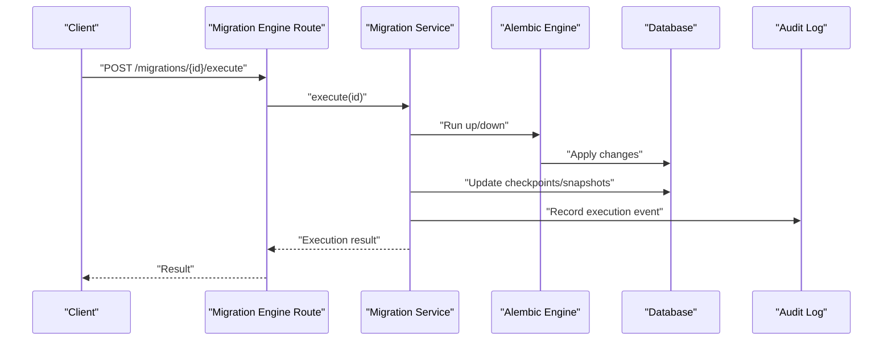

**Diagram sources**
- [backend/app/routes/migration_engine.py](file://backend/app/routes/migration_engine.py)
- [backend/app/services/migration_service.py](file://backend/app/services/migration_service.py)
- [backend/app/models/migration_checkpoint.py](file://backend/app/models/migration_checkpoint.py)
- [backend/app/models/schema_snapshot.py](file://backend/app/models/schema_snapshot.py)
- [backend/app/models/audit_log.py](file://backend/app/models/audit_log.py)

**Section sources**
- [backend/app/routes/migration_engine.py](file://backend/app/routes/migration_engine.py)
- [backend/app/services/migration_service.py](file://backend/app/services/migration_service.py)
- [backend/app/models/migration_checkpoint.py](file://backend/app/models/migration_checkpoint.py)
- [backend/app/models/schema_snapshot.py](file://backend/app/models/schema_snapshot.py)
- [backend/app/models/audit_log.py](file://backend/app/models/audit_log.py)

### Practical Examples

- Creating a migration:
  - Use the create endpoint to generate a new migration entry and associated Alembic file.
  - Reference: [backend/app/routes/migration.py](file://backend/app/routes/migration.py), [backend/app/services/migration_service.py](file://backend/app/services/migration_service.py)

- Managing versions:
  - Track versions via the migration model and Alembic’s versioning.
  - Reference: [backend/app/models/migration.py](file://backend/app/models/migration.py), [backend/migrations/env.py](file://backend/migrations/env.py)

- Implementing rollback procedures:
  - Initiate rollback via the rollback route and service; verify post-rollback state.
  - Reference: [backend/app/routes/rollback.py](file://backend/app/routes/rollback.py), [backend/app/services/rollback_service.py](file://backend/app/services/rollback_service.py)

- Testing migrations:
  - Use test utilities to simulate execution and validate outcomes.
  - Reference: [backend/tests/test_migrations.py](file://backend/tests/test_migrations.py)

**Section sources**
- [backend/app/routes/migration.py](file://backend/app/routes/migration.py)
- [backend/app/services/migration_service.py](file://backend/app/services/migration_service.py)
- [backend/app/models/migration.py](file://backend/app/models/migration.py)
- [backend/migrations/env.py](file://backend/migrations/env.py)
- [backend/app/routes/rollback.py](file://backend/app/routes/rollback.py)
- [backend/app/services/rollback_service.py](file://backend/app/services/rollback_service.py)
- [backend/tests/test_migrations.py](file://backend/tests/test_migrations.py)

## Dependency Analysis
The migration subsystem exhibits clear separation of concerns:
- Routes depend on services for business logic.
- Services depend on models for persistence and Alembic for execution.
- Exceptions provide centralized error handling across layers.

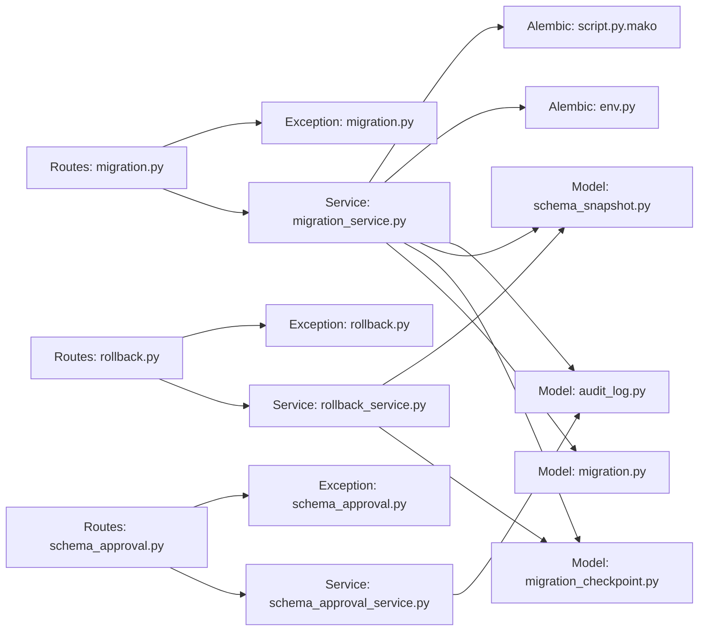

**Diagram sources**
- [backend/app/routes/migration.py](file://backend/app/routes/migration.py)
- [backend/app/routes/schema_approval.py](file://backend/app/routes/schema_approval.py)
- [backend/app/routes/rollback.py](file://backend/app/routes/rollback.py)
- [backend/app/services/migration_service.py](file://backend/app/services/migration_service.py)
- [backend/app/services/schema_approval_service.py](file://backend/app/services/schema_approval_service.py)
- [backend/app/services/rollback_service.py](file://backend/app/services/rollback_service.py)
- [backend/app/models/migration.py](file://backend/app/models/migration.py)
- [backend/app/models/migration_checkpoint.py](file://backend/app/models/migration_checkpoint.py)
- [backend/app/models/schema_snapshot.py](file://backend/app/models/schema_snapshot.py)
- [backend/app/models/audit_log.py](file://backend/app/models/audit_log.py)
- [backend/app/exceptions/migration.py](file://backend/app/exceptions/migration.py)
- [backend/app/exceptions/schema_approval.py](file://backend/app/exceptions/schema_approval.py)
- [backend/app/exceptions/rollback.py](file://backend/app/exceptions/rollback.py)
- [backend/migrations/env.py](file://backend/migrations/env.py)
- [backend/migrations/script.py.mako](file://backend/migrations/script.py.mako)

**Section sources**
- [backend/app/routes/migration.py](file://backend/app/routes/migration.py)
- [backend/app/routes/schema_approval.py](file://backend/app/routes/schema_approval.py)
- [backend/app/routes/rollback.py](file://backend/app/routes/rollback.py)
- [backend/app/services/migration_service.py](file://backend/app/services/migration_service.py)
- [backend/app/services/schema_approval_service.py](file://backend/app/services/schema_approval_service.py)
- [backend/app/services/rollback_service.py](file://backend/app/services/rollback_service.py)
- [backend/app/models/migration.py](file://backend/app/models/migration.py)
- [backend/app/models/migration_checkpoint.py](file://backend/app/models/migration_checkpoint.py)
- [backend/app/models/schema_snapshot.py](file://backend/app/models/schema_snapshot.py)
- [backend/app/models/audit_log.py](file://backend/app/models/audit_log.py)
- [backend/app/exceptions/migration.py](file://backend/app/exceptions/migration.py)
- [backend/app/exceptions/schema_approval.py](file://backend/app/exceptions/schema_approval.py)
- [backend/app/exceptions/rollback.py](file://backend/app/exceptions/rollback.py)
- [backend/migrations/env.py](file://backend/migrations/env.py)
- [backend/migrations/script.py.mako](file://backend/migrations/script.py.mako)

## Performance Considerations
- Batch operations: Group small schema changes into single migrations to reduce round trips.
- Idempotent steps: Design steps to be rerunnable without side effects, improving retry resilience.
- Indexing strategy: Defer index creation to later steps to minimize write amplification during heavy writes.
- Connection pooling: Ensure database connections are pooled to handle concurrent migration requests efficiently.
- Snapshot size: Keep schema snapshots concise to reduce storage overhead and improve comparison performance.

[No sources needed since this section provides general guidance]

## Troubleshooting Guide
Common issues and resolutions:
- Migration fails mid-execution:
  - Inspect checkpoints and snapshots to identify the last successful step.
  - Review audit logs for detailed error context.
  - Reference: [backend/app/models/migration_checkpoint.py](file://backend/app/models/migration_checkpoint.py), [backend/app/models/schema_snapshot.py](file://backend/app/models/schema_snapshot.py), [backend/app/models/audit_log.py](file://backend/app/models/audit_log.py)

- Approval stuck in pending:
  - Verify reviewer permissions and workflow policies.
  - Check audit trail for missing approvals.
  - Reference: [backend/app/services/schema_approval_service.py](file://backend/app/services/schema_approval_service.py), [backend/app/models/audit_log.py](file://backend/app/models/audit_log.py)

- Rollback conflicts:
  - Ensure no newer migrations are applied after the target version.
  - Validate preconditions and dependencies before initiating rollback.
  - Reference: [backend/app/services/rollback_service.py](file://backend/app/services/rollback_service.py)

- Alembic environment misconfiguration:
  - Confirm env.py settings and script template alignment.
  - Reference: [backend/migrations/env.py](file://backend/migrations/env.py), [backend/migrations/script.py.mako](file://backend/migrations/script.py.mako)

**Section sources**
- [backend/app/models/migration_checkpoint.py](file://backend/app/models/migration_checkpoint.py)
- [backend/app/models/schema_snapshot.py](file://backend/app/models/schema_snapshot.py)
- [backend/app/models/audit_log.py](file://backend/app/models/audit_log.py)
- [backend/app/services/schema_approval_service.py](file://backend/app/services/schema_approval_service.py)
- [backend/app/services/rollback_service.py](file://backend/app/services/rollback_service.py)
- [backend/migrations/env.py](file://backend/migrations/env.py)
- [backend/migrations/script.py.mako](file://backend/migrations/script.py.mako)

## Conclusion
CloudBridge’s migration system provides robust, auditable, and safe schema evolution through version-controlled migrations, structured approval workflows, and resilient execution and rollback mechanisms. By leveraging checkpoints, snapshots, and comprehensive logging, teams can confidently manage complex database changes while maintaining data integrity and operational visibility.

[No sources needed since this section summarizes without analyzing specific files]

## Appendices

### Best Practices for Safe Schema Evolution
- Prefer additive changes: Add columns and indexes before removing deprecated ones.
- Backward-compatible APIs: Ensure application code remains compatible during transitions.
- Small, focused migrations: Each migration should address a single concern.
- Pre-flight checks: Validate dependencies and environment readiness before execution.
- Automated testing: Include unit and integration tests for critical schema changes.
- Rollback drills: Regularly practice rollback procedures to ensure reliability.

[No sources needed since this section provides general guidance]