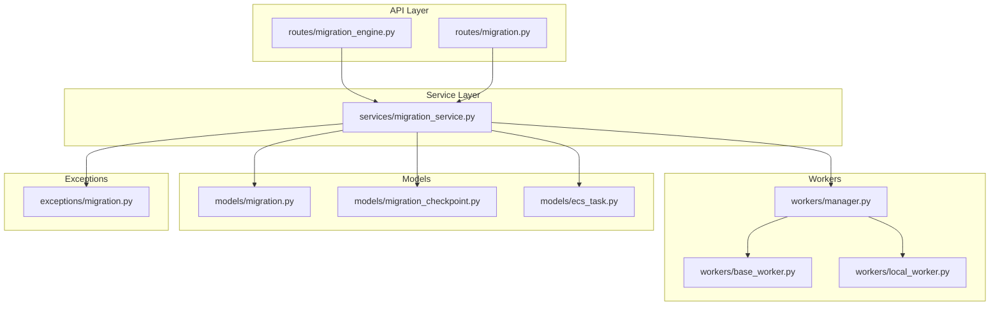
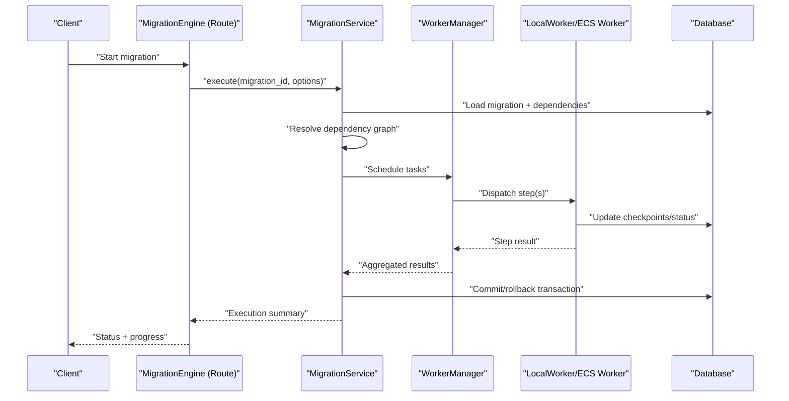
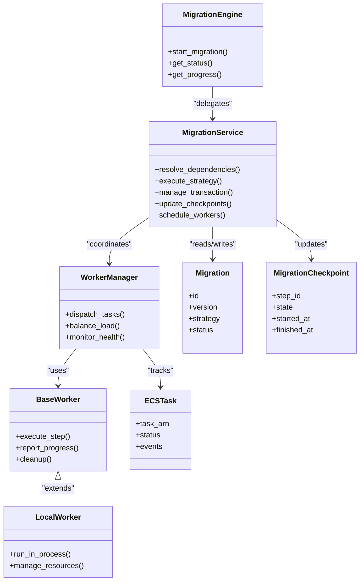

# Migration Execution Engine

<cite>
**Referenced Files in This Document**
- [migration_engine.py](file://backend/app/routes/migration_engine.py)
- [migration_service.py](file://backend/app/services/migration_service.py)
- [base_worker.py](file://backend/app/workers/base_worker.py)
- [manager.py](file://backend/app/workers/manager.py)
- [local_worker.py](file://backend/app/workers/local_worker.py)
- [ecs_task.py](file://backend/app/models/ecs_task.py)
- [migration.py](file://backend/app/models/migration.py)
- [migration_checkpoint.py](file://backend/app/models/migration_checkpoint.py)
- [exceptions/migration.py](file://backend/app/exceptions/migration.py)
- [routes/migration.py](file://backend/app/routes/migration.py)
</cite>

## Table of Contents
1. [Introduction](#introduction)
2. [Project Structure](#project-structure)
3. [Core Components](#core-components)
4. [Architecture Overview](#architecture-overview)
5. [Detailed Component Analysis](#detailed-component-analysis)
6. [Dependency Analysis](#dependency-analysis)
7. [Performance Considerations](#performance-considerations)
8. [Troubleshooting Guide](#troubleshooting-guide)
9. [Conclusion](#conclusion)

## Introduction
This document explains the migration execution engine architecture with a focus on the worker-based execution model, task queue integration, and concurrent processing. It details how migrations are scheduled, executed, monitored, and recovered, including dependency graph resolution, transaction management, progress tracking, error handling, timeouts, resource cleanup, debugging strategies, and monitoring.

## Project Structure
The migration execution engine spans routes, services, workers, models, and exception modules:
- Routes expose APIs to trigger and monitor migrations.
- Services orchestrate execution strategies and coordinate workers.
- Workers execute tasks concurrently using local or ECS-backed runners.
- Models persist migration state, checkpoints, and ECS job metadata.
- Exceptions define domain-specific errors for robust error handling.

**Diagram sources**
- [migration_engine.py](file://backend/app/routes/migration_engine.py)
- [migration_service.py](file://backend/app/services/migration_service.py)
- [base_worker.py](file://backend/app/workers/base_worker.py)
- [manager.py](file://backend/app/workers/manager.py)
- [local_worker.py](file://backend/app/workers/local_worker.py)
- [migration.py](file://backend/app/models/migration.py)
- [migration_checkpoint.py](file://backend/app/models/migration_checkpoint.py)
- [ecs_task.py](file://backend/app/models/ecs_task.py)
- [exceptions/migration.py](file://backend/app/exceptions/migration.py)

**Section sources**
- [migration_engine.py](file://backend/app/routes/migration_engine.py)
- [migration_service.py](file://backend/app/services/migration_service.py)
- [base_worker.py](file://backend/app/workers/base_worker.py)
- [manager.py](file://backend/app/workers/manager.py)
- [local_worker.py](file://backend/app/workers/local_worker.py)
- [migration.py](file://backend/app/models/migration.py)
- [migration_checkpoint.py](file://backend/app/models/migration_checkpoint.py)
- [ecs_task.py](file://backend/app/models/ecs_task.py)
- [exceptions/migration.py](file://backend/app/exceptions/migration.py)

## Core Components
- MigrationEngine (route/controller): Accepts execution requests, validates inputs, delegates to service layer, and returns status/progress.
- MigrationService: Implements execution strategies, dependency graph resolution, transaction boundaries, checkpointing, and coordination with the worker manager.
- WorkerManager: Schedules tasks across available workers, enforces concurrency limits, and balances load between local and ECS workers.
- BaseWorker and LocalWorker: Define the worker contract and provide a local execution environment; ECS-backed workers can be integrated via ECS task model.
- Models: Persist migration records, per-step checkpoints, and ECS job metadata for resiliency and observability.
- Exceptions: Domain exceptions for validation, dependency failures, timeouts, and rollback scenarios.

Key responsibilities:
- Dependency graph resolution ensures migrations run in correct order and avoid conflicts.
- Transaction management wraps multi-step runs to support atomicity and rollback where applicable.
- Progress tracking uses checkpoints to resume after interruptions.
- Error recovery includes retries, partial rollbacks, and safe state transitions.
- Timeouts and resource cleanup prevent long-running or stuck jobs from consuming resources.

**Section sources**
- [migration_engine.py](file://backend/app/routes/migration_engine.py)
- [migration_service.py](file://backend/app/services/migration_service.py)
- [base_worker.py](file://backend/app/workers/base_worker.py)
- [manager.py](file://backend/app/workers/manager.py)
- [local_worker.py](file://backend/app/workers/local_worker.py)
- [migration.py](file://backend/app/models/migration.py)
- [migration_checkpoint.py](file://backend/app/models/migration_checkpoint.py)
- [ecs_task.py](file://backend/app/models/ecs_task.py)
- [exceptions/migration.py](file://backend/app/exceptions/migration.py)

## Architecture Overview
The system follows a layered architecture with clear separation between API, orchestration, and execution:
- API routes accept user actions and return immediate feedback while background workers perform heavy lifting.
- The service layer resolves dependencies, manages transactions, and coordinates workers.
- Workers execute steps concurrently within configured limits, reporting progress and outcomes back to persistent state.

**Diagram sources**
- [migration_engine.py](file://backend/app/routes/migration_engine.py)
- [migration_service.py](file://backend/app/services/migration_service.py)
- [manager.py](file://backend/app/workers/manager.py)
- [local_worker.py](file://backend/app/workers/local_worker.py)
- [ecs_task.py](file://backend/app/models/ecs_task.py)
- [migration.py](file://backend/app/models/migration.py)
- [migration_checkpoint.py](file://backend/app/models/migration_checkpoint.py)

## Detailed Component Analysis

### MigrationEngine (Route Controller)
Responsibilities:
- Validate request payloads and parameters.
- Delegate execution to MigrationService.
- Return structured responses with IDs and initial status.
- Expose endpoints for querying progress and logs.

Concurrency and safety:
- Avoids running duplicate executions for the same migration by checking current state before dispatch.
- Uses idempotent operations where possible to handle retries safely.

Error handling:
- Maps service-level exceptions to HTTP responses with meaningful codes and messages.
- Ensures consistent response shapes for clients.

Progress exposure:
- Provides endpoints to poll or stream progress based on persisted checkpoints and status fields.

**Section sources**
- [migration_engine.py](file://backend/app/routes/migration_engine.py)
- [routes/migration.py](file://backend/app/routes/migration.py)

### MigrationService (Execution Orchestrator)
Responsibilities:
- Execution strategies: supports sequential, parallel-by-dependency, and dry-run modes.
- Dependency graph resolution: builds a directed acyclic graph (DAG) from migration definitions and computes topological order.
- Transaction management: wraps multi-step runs in a transactional boundary; commits on success, rolls back on failure when supported.
- Checkpointing: persists per-step progress to allow resumption after interruption.
- Worker coordination: schedules tasks through WorkerManager and aggregates results.
- Hooks: exposes lifecycle hooks for pre/post step, pre/post migration, and error handlers.

Data flow:
- Loads migration metadata and related steps.
- Resolves dependencies and determines execution order.
- Dispatches tasks to workers and monitors completion.
- Updates checkpoints and final status atomically.

Error recovery:
- Retries transient failures with backoff.
- Performs targeted rollbacks for partially applied steps if needed.
- Marks migrations as failed or paused with actionable diagnostics.

Timeout handling:
- Enforces per-step and overall timeouts; cancels or marks timed-out steps.
- Cleans up resources (connections, temp files) on timeout paths.

**Section sources**
- [migration_service.py](file://backend/app/services/migration_service.py)
- [migration.py](file://backend/app/models/migration.py)
- [migration_checkpoint.py](file://backend/app/models/migration_checkpoint.py)
- [exceptions/migration.py](file://backend/app/exceptions/migration.py)

### WorkerManager (Task Scheduler and Load Balancer)
Responsibilities:
- Maintains a pool of workers (local and ECS).
- Distributes tasks based on availability and capacity.
- Enforces global and per-migration concurrency limits.
- Tracks worker health and removes unhealthy workers.

Job distribution:
- Assigns independent steps to multiple workers concurrently.
- Balances load by selecting least-loaded workers or routing to ECS for heavier workloads.

Resilience:
- Requeues failed tasks with exponential backoff.
- Detects hung tasks via heartbeat/timeouts and reassigns them.

**Section sources**
- [manager.py](file://backend/app/workers/manager.py)
- [base_worker.py](file://backend/app/workers/base_worker.py)
- [local_worker.py](file://backend/app/workers/local_worker.py)
- [ecs_task.py](file://backend/app/models/ecs_task.py)

### BaseWorker and LocalWorker (Execution Contracts and Implementations)
BaseWorker:
- Defines the worker interface: start, stop, execute_step, report_progress, cleanup.
- Encapsulates common logging, metrics, and error wrapping.

LocalWorker:
- Executes steps in-process with controlled concurrency.
- Manages local resources such as database connections and temporary directories.
- Integrates with the checkpoint store to update progress.

ECS integration:
- For distributed execution, tasks can be dispatched to ECS; ECS task model stores job identifiers and statuses.

**Section sources**
- [base_worker.py](file://backend/app/workers/base_worker.py)
- [local_worker.py](file://backend/app/workers/local_worker.py)
- [ecs_task.py](file://backend/app/models/ecs_task.py)

### Data Models (Persistence and State)
Migration:
- Stores migration identity, version, strategy, status, and timestamps.
- Tracks dependency references and execution metadata.

MigrationCheckpoint:
- Captures per-step progress, start/end times, and outcome.
- Enables resumable execution and accurate progress reporting.

ECSTask:
- Associates a migration step with an ECS job, storing task ARN and lifecycle events.

**Section sources**
- [migration.py](file://backend/app/models/migration.py)
- [migration_checkpoint.py](file://backend/app/models/migration_checkpoint.py)
- [ecs_task.py](file://backend/app/models/ecs_task.py)

### Exception Handling and Recovery
Domain exceptions:
- Validation errors for invalid migration configurations.
- Dependency resolution failures when cycles or missing dependencies are detected.
- Timeout and cancellation signals for long-running steps.
- Rollback errors when partial reversals fail.

Recovery mechanisms:
- Automatic retry for transient network/database errors.
- Graceful degradation by marking steps as failed and continuing non-dependent steps.
- Safe rollback procedures that reverse only applied changes.

**Section sources**
- [exceptions/migration.py](file://backend/app/exceptions/migration.py)
- [migration_service.py](file://backend/app/services/migration_service.py)

## Dependency Analysis
The following diagram shows key module relationships and data flows:

**Diagram sources**
- [migration_engine.py](file://backend/app/routes/migration_engine.py)
- [migration_service.py](file://backend/app/services/migration_service.py)
- [manager.py](file://backend/app/workers/manager.py)
- [base_worker.py](file://backend/app/workers/base_worker.py)
- [local_worker.py](file://backend/app/workers/local_worker.py)
- [ecs_task.py](file://backend/app/models/ecs_task.py)
- [migration.py](file://backend/app/models/migration.py)
- [migration_checkpoint.py](file://backend/app/models/migration_checkpoint.py)

**Section sources**
- [migration_engine.py](file://backend/app/routes/migration_engine.py)
- [migration_service.py](file://backend/app/services/migration_service.py)
- [manager.py](file://backend/app/workers/manager.py)
- [base_worker.py](file://backend/app/workers/base_worker.py)
- [local_worker.py](file://backend/app/workers/local_worker.py)
- [ecs_task.py](file://backend/app/models/ecs_task.py)
- [migration.py](file://backend/app/models/migration.py)
- [migration_checkpoint.py](file://backend/app/models/migration_checkpoint.py)

## Performance Considerations
- Concurrency control: Limit parallel steps per migration and globally to avoid resource exhaustion.
- Dependency-aware scheduling: Execute independent steps concurrently while honoring DAG constraints.
- Batched updates: Coalesce checkpoint writes to reduce database contention.
- Connection pooling: Reuse database and external client connections within workers.
- Backpressure: Slow down producers when consumers (workers) are saturated.
- Timeouts: Configure per-step and overall timeouts to prevent runaway processes.
- Resource cleanup: Ensure file handles, sockets, and temporary artifacts are released on success, failure, and timeout paths.
- ECS offloading: Use ECS for CPU/memory-intensive steps to scale horizontally.

[No sources needed since this section provides general guidance]

## Troubleshooting Guide
Common issues and strategies:
- Failed dependency resolution: Inspect dependency declarations and ensure no cycles exist.
- Step timeouts: Review step duration, increase timeouts cautiously, and check external service latency.
- Partial rollbacks: Verify rollback logic covers all side effects; log detailed diffs for manual remediation.
- Worker starvation: Monitor worker health and adjust concurrency limits or add more workers.
- Checkpoint inconsistencies: Reconcile checkpoints with actual state; consider forcing a clean restart if necessary.

Debugging steps:
- Query migration status and last checkpoint to identify the failing step.
- Inspect worker logs for stack traces and context around failures.
- Enable verbose logging for dependency resolution and scheduling decisions.
- Use dedicated endpoints to fetch execution timeline and metrics.

Monitoring tools:
- Track per-step durations, success/failure rates, and retry counts.
- Observe worker utilization and queue depth.
- Alert on prolonged idle workers or repeated timeouts.

**Section sources**
- [migration_service.py](file://backend/app/services/migration_service.py)
- [manager.py](file://backend/app/workers/manager.py)
- [local_worker.py](file://backend/app/workers/local_worker.py)
- [migration_checkpoint.py](file://backend/app/models/migration_checkpoint.py)
- [exceptions/migration.py](file://backend/app/exceptions/migration.py)

## Conclusion
The migration execution engine combines a robust service layer with a flexible worker system to deliver reliable, concurrent, and observable migration processing. By leveraging dependency-aware scheduling, transactional boundaries, checkpoints, and comprehensive error handling, it supports complex migration workflows with strong guarantees and operational visibility.