# Migration Lifecycle Management

<cite>
**Referenced Files in This Document**
- [backend/app/models/migration.py](file://backend/app/models/migration.py)
- [backend/app/models/migration_checkpoint.py](file://backend/app/models/migration_checkpoint.py)
- [backend/app/schemas/migration.py](file://backend/app/schemas/migration.py)
- [backend/app/routes/migration.py](file://backend/app/routes/migration.py)
- [backend/app/routes/migration_engine.py](file://backend/app/routes/migration_engine.py)
- [backend/app/services/migration_service.py](file://backend/app/services/migration_service.py)
- [backend/app/workers/manager.py](file://backend/app/workers/manager.py)
- [backend/app/workers/local_worker.py](file://backend/app/workers/local_worker.py)
- [backend/app/workers/base_worker.py](file://backend/app/workers/base_worker.py)
- [backend/app/exceptions/migration.py](file://backend/app/exceptions/migration.py)
- [backend/app/exceptions/rollback.py](file://backend/app/exceptions/rollback.py)
- [backend/app/routes/rollback.py](file://backend/app/routes/rollback.py)
- [backend/app/services/rollback_service.py](file://backend/app/services/rollback_service.py)
- [backend/app/routes/schema_approval.py](file://backend/app/routes/schema_approval.py)
- [backend/app/services/schema_approval_service.py](file://backend/app/services/schema_approval_service.py)
- [backend/app/routes/schema_drift.py](file://backend/app/routes/schema_drift.py)
- [backend/app/services/schema_drift_service.py](file://backend/app/services/schema_drift_service.py)
- [backend/app/routes/preflight.py](file://backend/app/routes/preflight.py)
- [backend/app/services/preflight_service.py](file://backend/app/services/preflight_service.py)
- [backend/app/models/schema_snapshot.py](file://backend/app/models/schema_snapshot.py)
- [backend/app/models/database_config.py](file://backend/app/models/database_config.py)
- [backend/app/models/aws_connection.py](file://backend/app/models/aws_connection.py)
- [backend/app/models/ecs_task.py](file://backend/app/models/ecs_task.py)
- [backend/app/models/notification.py](file://backend/app/models/notification.py)
- [backend/app/models/audit_log.py](file://backend/app/models/audit_log.py)
- [backend/app/config.py](file://backend/app/config.py)
- [backend/app/extensions.py](file://backend/app/extensions.py)
- [backend/app/logging.py](file://backend/app/logging.py)
- [backend/run.py](file://backend/run.py)
- [backend/alembic.ini](file://backend/alembic.ini)
- [backend/migrations/env.py](file://backend/migrations/env.py)
- [backend/migrations/script.py.mako](file://backend/migrations/script.py.mako)
</cite>

## Table of Contents
1. [Introduction](#introduction)
2. [Project Structure](#project-structure)
3. [Core Components](#core-components)
4. [Architecture Overview](#architecture-overview)
5. [Detailed Component Analysis](#detailed-component-analysis)
6. [Dependency Analysis](#dependency-analysis)
7. [Performance Considerations](#performance-considerations)
8. [Troubleshooting Guide](#troubleshooting-guide)
9. [Conclusion](#conclusion)
10. [Appendices](#appendices)

## Introduction
This document explains the migration lifecycle management system end-to-end, covering how migrations are created, validated, scheduled, executed, tracked, and rolled back. It details the data model for migrations and checkpoints, API workflows, status transitions, dependency resolution, conflict detection, naming conventions, branching strategies, merge procedures, and troubleshooting guidance for common issues such as stuck migrations, version conflicts, and rollback scenarios.

## Project Structure
The migration subsystem is implemented across models, schemas, routes (API), services (business logic), workers (execution), exceptions, and Alembic configuration. The key areas include:
- Data layer: SQLAlchemy models for migrations, checkpoints, schema snapshots, database configs, AWS connections, ECS tasks, notifications, and audit logs.
- API layer: Routes exposing endpoints for creating, listing, executing, approving, rolling back, and monitoring migrations.
- Service layer: Orchestration of validation, dependency checks, preflight, execution, approval gates, drift detection, and rollback.
- Execution layer: Worker manager and local worker to run migrations asynchronously.
- Configuration: App config, extensions (DB, logging), Alembic setup, and migration script templates.

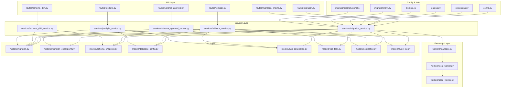

**Diagram sources**
- [backend/app/routes/migration.py](file://backend/app/routes/migration.py)
- [backend/app/routes/migration_engine.py](file://backend/app/routes/migration_engine.py)
- [backend/app/routes/rollback.py](file://backend/app/routes/rollback.py)
- [backend/app/routes/schema_approval.py](file://backend/app/routes/schema_approval.py)
- [backend/app/routes/schema_drift.py](file://backend/app/routes/schema_drift.py)
- [backend/app/routes/preflight.py](file://backend/app/routes/preflight.py)
- [backend/app/services/migration_service.py](file://backend/app/services/migration_service.py)
- [backend/app/services/rollback_service.py](file://backend/app/services/rollback_service.py)
- [backend/app/services/schema_approval_service.py](file://backend/app/services/schema_approval_service.py)
- [backend/app/services/schema_drift_service.py](file://backend/app/services/schema_drift_service.py)
- [backend/app/services/preflight_service.py](file://backend/app/services/preflight_service.py)
- [backend/app/workers/manager.py](file://backend/app/workers/manager.py)
- [backend/app/workers/local_worker.py](file://backend/app/workers/local_worker.py)
- [backend/app/workers/base_worker.py](file://backend/app/workers/base_worker.py)
- [backend/app/models/migration.py](file://backend/app/models/migration.py)
- [backend/app/models/migration_checkpoint.py](file://backend/app/models/migration_checkpoint.py)
- [backend/app/models/schema_snapshot.py](file://backend/app/models/schema_snapshot.py)
- [backend/app/models/database_config.py](file://backend/app/models/database_config.py)
- [backend/app/models/aws_connection.py](file://backend/app/models/aws_connection.py)
- [backend/app/models/ecs_task.py](file://backend/app/models/ecs_task.py)
- [backend/app/models/notification.py](file://backend/app/models/notification.py)
- [backend/app/models/audit_log.py](file://backend/app/models/audit_log.py)
- [backend/app/config.py](file://backend/app/config.py)
- [backend/app/extensions.py](file://backend/app/extensions.py)
- [backend/app/logging.py](file://backend/app/logging.py)
- [backend/alembic.ini](file://backend/alembic.ini)
- [backend/migrations/env.py](file://backend/migrations/env.py)
- [backend/migrations/script.py.mako](file://backend/migrations/script.py.mako)

**Section sources**
- [backend/app/routes/migration.py](file://backend/app/routes/migration.py)
- [backend/app/services/migration_service.py](file://backend/app/services/migration_service.py)
- [backend/app/workers/manager.py](file://backend/app/workers/manager.py)
- [backend/app/models/migration.py](file://backend/app/models/migration.py)
- [backend/app/models/migration_checkpoint.py](file://backend/app/models/migration_checkpoint.py)
- [backend/alembic.ini](file://backend/alembic.ini)
- [backend/migrations/env.py](file://backend/migrations/env.py)
- [backend/migrations/script.py.mako](file://backend/migrations/script.py.mako)

## Core Components
- Migration Model: Represents a migration record with fields for metadata, target database, dependencies, status, and execution results. Relationships connect it to database configurations, AWS connections, ECS tasks, checkpoints, schema snapshots, notifications, and audit logs.
- Migration Checkpoint Model: Tracks per-step progress within a migration run, enabling resumability and detailed observability.
- Schemas: Pydantic schemas define request/response contracts for creating, updating, and querying migrations.
- Routes: REST endpoints for CRUD operations, triggering execution, approvals, drift checks, preflight validations, and rollbacks.
- Services: Business logic for dependency resolution, conflict detection, preflight checks, execution orchestration, approval gating, drift detection, and rollback coordination.
- Workers: Asynchronous execution engine using a worker manager and a local worker to run migrations safely and track state.
- Exceptions: Domain-specific error types for migration failures, rollback errors, and related operations.
- Config and Extensions: Application configuration, database extension initialization, and logging setup used by all layers.

Key responsibilities:
- Creation and validation: Ensure required fields, valid references, and consistent versions.
- Dependency resolution: Build a directed acyclic graph (DAG) from declared dependencies and validate ordering.
- Conflict detection: Detect overlapping changes or incompatible versions before execution.
- Preflight checks: Validate connectivity, permissions, and environment readiness.
- Execution: Schedule via worker manager, update checkpoints, and persist outcomes.
- Approval gate: Optional manual approval step before applying changes.
- Drift detection: Compare current schema against expected snapshots and report differences.
- Rollback: Reverse applied migrations with safety checks and audit trails.

**Section sources**
- [backend/app/models/migration.py](file://backend/app/models/migration.py)
- [backend/app/models/migration_checkpoint.py](file://backend/app/models/migration_checkpoint.py)
- [backend/app/schemas/migration.py](file://backend/app/schemas/migration.py)
- [backend/app/routes/migration.py](file://backend/app/routes/migration.py)
- [backend/app/services/migration_service.py](file://backend/app/services/migration_service.py)
- [backend/app/workers/manager.py](file://backend/app/workers/manager.py)
- [backend/app/workers/local_worker.py](file://backend/app/workers/local_worker.py)
- [backend/app/workers/base_worker.py](file://backend/app/workers/base_worker.py)
- [backend/app/exceptions/migration.py](file://backend/app/exceptions/migration.py)
- [backend/app/exceptions/rollback.py](file://backend/app/exceptions/rollback.py)
- [backend/app/config.py](file://backend/app/config.py)
- [backend/app/extensions.py](file://backend/app/extensions.py)
- [backend/app/logging.py](file://backend/app/logging.py)

## Architecture Overview
The migration lifecycle follows a layered architecture:
- API routes accept requests and delegate to services.
- Services enforce business rules, perform dependency and conflict checks, and coordinate execution through workers.
- Workers execute migrations asynchronously, updating checkpoints and persisting results.
- Models represent persistent state; schemas validate payloads; exceptions standardize error handling.

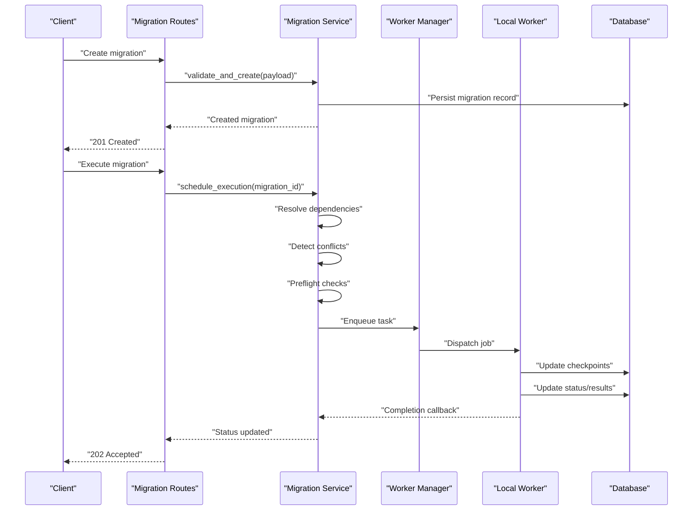

**Diagram sources**
- [backend/app/routes/migration.py](file://backend/app/routes/migration.py)
- [backend/app/services/migration_service.py](file://backend/app/services/migration_service.py)
- [backend/app/workers/manager.py](file://backend/app/workers/manager.py)
- [backend/app/workers/local_worker.py](file://backend/app/workers/local_worker.py)
- [backend/app/models/migration.py](file://backend/app/models/migration.py)
- [backend/app/models/migration_checkpoint.py](file://backend/app/models/migration_checkpoint.py)

## Detailed Component Analysis

### Migration Model Schema
The Migration model captures the full lifecycle state and context for each migration. Typical fields include:
- Identifier and versioning: unique id, version string, branch/tag identifiers.
- Metadata: title, description, author, tags, and timestamps.
- Target configuration: foreign keys to database_config and aws_connection.
- Dependencies: list of migration ids that must complete successfully first.
- Status and execution: current status, started_at, finished_at, result payload, error message.
- Checkpoints: one-to-many relationship to MigrationCheckpoint for step-level progress.
- Related entities: optional links to ecs_task, schema_snapshot, notification, and audit_log records.

Validation rules enforced at creation/update:
- Required fields: version, target database config, dependencies (if any).
- Version uniqueness per target database.
- Dependency existence and acyclicity.
- Status transitions restricted by allowed states.

Relationships:
- database_config: defines connection parameters and environment.
- aws_connection: provides credentials and region settings.
- ecs_task: tracks remote execution if applicable.
- migration_checkpoint: granular progress tracking.
- schema_snapshot: baseline snapshot for drift detection.
- notification and audit_log: operational visibility.

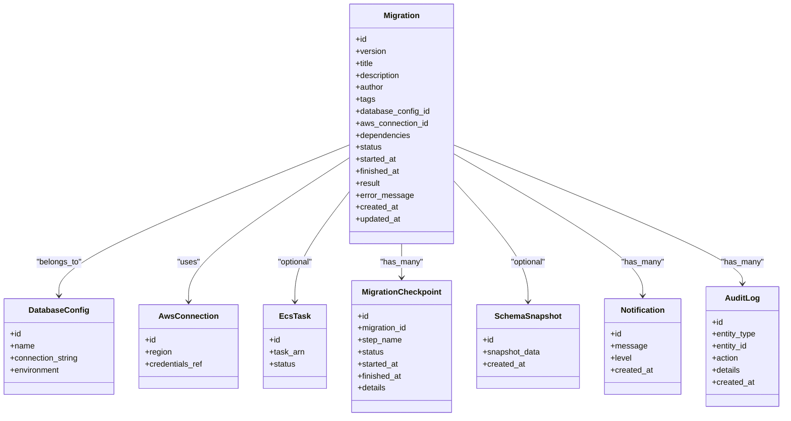

**Diagram sources**
- [backend/app/models/migration.py](file://backend/app/models/migration.py)
- [backend/app/models/database_config.py](file://backend/app/models/database_config.py)
- [backend/app/models/aws_connection.py](file://backend/app/models/aws_connection.py)
- [backend/app/models/ecs_task.py](file://backend/app/models/ecs_task.py)
- [backend/app/models/migration_checkpoint.py](file://backend/app/models/migration_checkpoint.py)
- [backend/app/models/schema_snapshot.py](file://backend/app/models/schema_snapshot.py)
- [backend/app/models/notification.py](file://backend/app/models/notification.py)
- [backend/app/models/audit_log.py](file://backend/app/models/audit_log.py)

**Section sources**
- [backend/app/models/migration.py](file://backend/app/models/migration.py)
- [backend/app/models/migration_checkpoint.py](file://backend/app/models/migration_checkpoint.py)
- [backend/app/models/database_config.py](file://backend/app/models/database_config.py)
- [backend/app/models/aws_connection.py](file://backend/app/models/aws_connection.py)
- [backend/app/models/ecs_task.py](file://backend/app/models/ecs_task.py)
- [backend/app/models/schema_snapshot.py](file://backend/app/models/schema_snapshot.py)
- [backend/app/models/notification.py](file://backend/app/models/notification.py)
- [backend/app/models/audit_log.py](file://backend/app/models/audit_log.py)

### API Workflows

#### Create Migration
- Endpoint: POST /api/migrations
- Request body: defined by Pydantic schema (version, title, description, dependencies, target database config id, optional aws connection id).
- Validation: schema validation, dependency existence, version uniqueness.
- Response: created migration object with initial status.

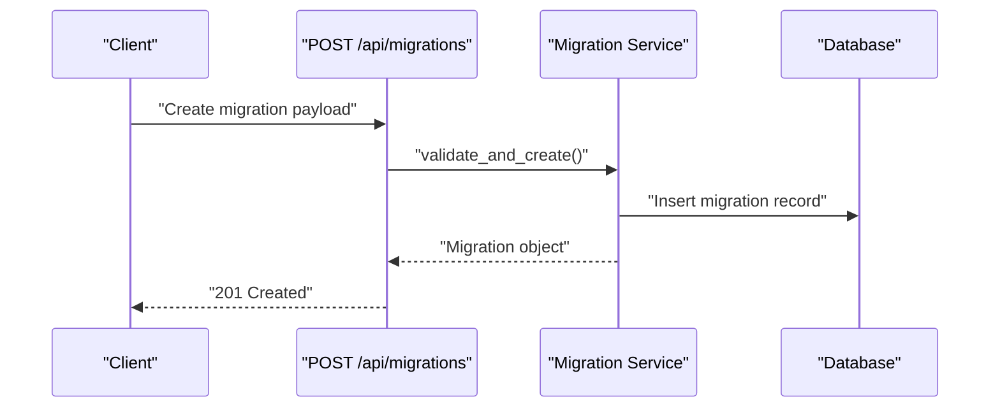

**Diagram sources**
- [backend/app/routes/migration.py](file://backend/app/routes/migration.py)
- [backend/app/schemas/migration.py](file://backend/app/schemas/migration.py)
- [backend/app/services/migration_service.py](file://backend/app/services/migration_service.py)
- [backend/app/models/migration.py](file://backend/app/models/migration.py)

**Section sources**
- [backend/app/routes/migration.py](file://backend/app/routes/migration.py)
- [backend/app/schemas/migration.py](file://backend/app/schemas/migration.py)
- [backend/app/services/migration_service.py](file://backend/app/services/migration_service.py)

#### Execute Migration
- Endpoint: POST /api/migrations/{id}/execute
- Flow: dependency resolution, conflict detection, preflight checks, enqueue execution via worker manager, return acceptance response.
- Execution updates checkpoints and final status upon completion.

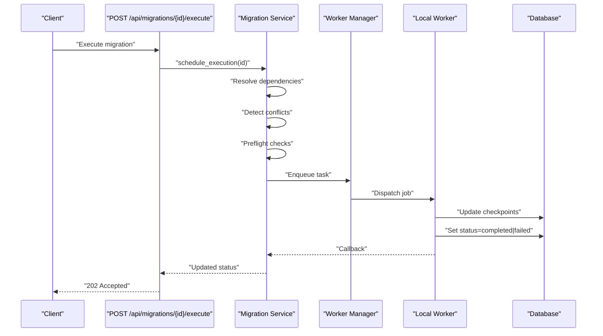

**Diagram sources**
- [backend/app/routes/migration.py](file://backend/app/routes/migration.py)
- [backend/app/services/migration_service.py](file://backend/app/services/migration_service.py)
- [backend/app/workers/manager.py](file://backend/app/workers/manager.py)
- [backend/app/workers/local_worker.py](file://backend/app/workers/local_worker.py)
- [backend/app/models/migration.py](file://backend/app/models/migration.py)
- [backend/app/models/migration_checkpoint.py](file://backend/app/models/migration_checkpoint.py)

**Section sources**
- [backend/app/routes/migration.py](file://backend/app/routes/migration.py)
- [backend/app/services/migration_service.py](file://backend/app/services/migration_service.py)
- [backend/app/workers/manager.py](file://backend/app/workers/manager.py)
- [backend/app/workers/local_worker.py](file://backend/app/workers/local_worker.py)

#### Approve Migration
- Endpoint: POST /api/migrations/{id}/approve
- Purpose: manual gate before applying changes.
- Behavior: sets approval status, notifies stakeholders, allows subsequent execution.

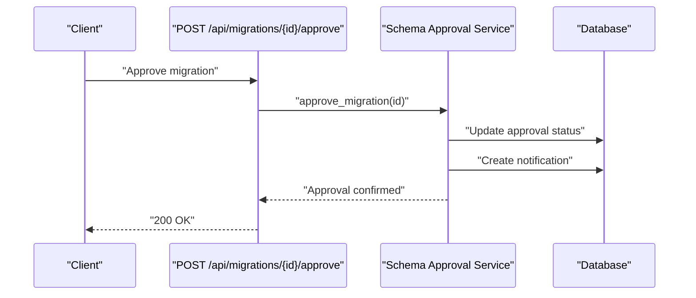

**Diagram sources**
- [backend/app/routes/schema_approval.py](file://backend/app/routes/schema_approval.py)
- [backend/app/services/schema_approval_service.py](file://backend/app/services/schema_approval_service.py)
- [backend/app/models/migration.py](file://backend/app/models/migration.py)
- [backend/app/models/notification.py](file://backend/app/models/notification.py)

**Section sources**
- [backend/app/routes/schema_approval.py](file://backend/app/routes/schema_approval.py)
- [backend/app/services/schema_approval_service.py](file://backend/app/services/schema_approval_service.py)

#### Rollback Migration
- Endpoint: POST /api/migrations/{id}/rollback
- Purpose: reverse previously applied migration steps.
- Safety: validates prerequisites, creates rollback plan, executes reversals, updates status and audit log.

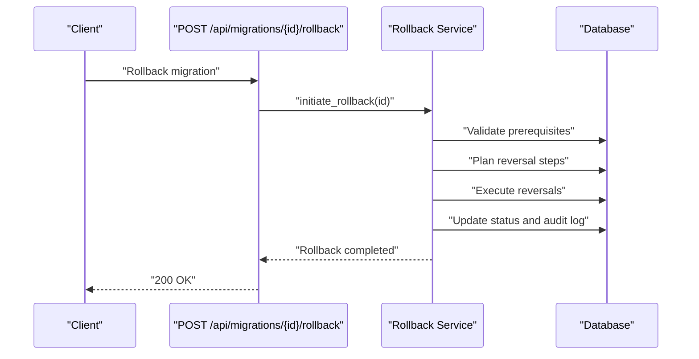

**Diagram sources**
- [backend/app/routes/rollback.py](file://backend/app/routes/rollback.py)
- [backend/app/services/rollback_service.py](file://backend/app/services/rollback_service.py)
- [backend/app/models/migration.py](file://backend/app/models/migration.py)
- [backend/app/models/audit_log.py](file://backend/app/models/audit_log.py)

**Section sources**
- [backend/app/routes/rollback.py](file://backend/app/routes/rollback.py)
- [backend/app/services/rollback_service.py](file://backend/app/services/rollback_service.py)

#### Preflight Checks
- Endpoint: POST /api/migrations/{id}/preflight
- Purpose: verify connectivity, permissions, and environment readiness before execution.
- Output: pass/fail with actionable diagnostics.

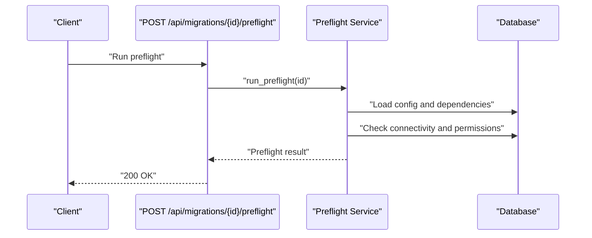

**Diagram sources**
- [backend/app/routes/preflight.py](file://backend/app/routes/preflight.py)
- [backend/app/services/preflight_service.py](file://backend/app/services/preflight_service.py)
- [backend/app/models/database_config.py](file://backend/app/models/database_config.py)
- [backend/app/models/aws_connection.py](file://backend/app/models/aws_connection.py)

**Section sources**
- [backend/app/routes/preflight.py](file://backend/app/routes/preflight.py)
- [backend/app/services/preflight_service.py](file://backend/app/services/preflight_service.py)

#### Schema Drift Detection
- Endpoint: GET /api/migrations/{id}/drift
- Purpose: compare current schema against stored snapshot and report differences.
- Output: drift report with affected objects and severity.

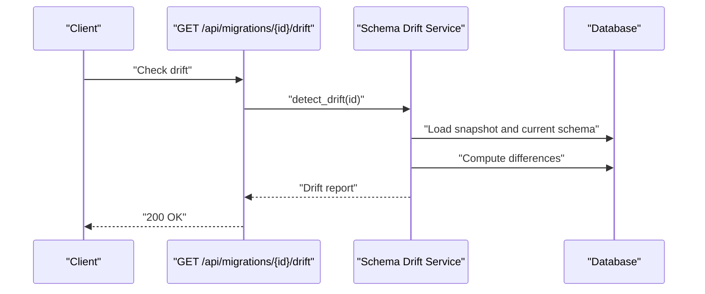

**Diagram sources**
- [backend/app/routes/schema_drift.py](file://backend/app/routes/schema_drift.py)
- [backend/app/services/schema_drift_service.py](file://backend/app/services/schema_drift_service.py)
- [backend/app/models/schema_snapshot.py](file://backend/app/models/schema_snapshot.py)

**Section sources**
- [backend/app/routes/schema_drift.py](file://backend/app/routes/schema_drift.py)
- [backend/app/services/schema_drift_service.py](file://backend/app/services/schema_drift_service.py)

### State Transitions and Status Tracking
- Initial states: draft, pending_approval, approved, queued, running, completed, failed, rolled_back.
- Allowed transitions:
  - draft -> pending_approval (optional gate)
  - pending_approval -> approved
  - approved -> queued (after scheduling)
  - queued -> running (worker picks up)
  - running -> completed | failed
  - completed -> rolled_back (via rollback flow)
- Checkpoints: per-step status updates during running phase enable resiliency and observability.

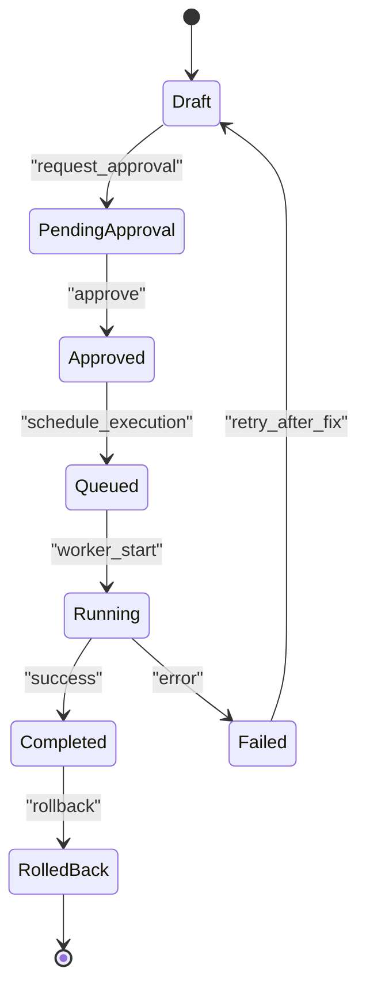

**Diagram sources**
- [backend/app/models/migration.py](file://backend/app/models/migration.py)
- [backend/app/models/migration_checkpoint.py](file://backend/app/models/migration_checkpoint.py)

**Section sources**
- [backend/app/models/migration.py](file://backend/app/models/migration.py)
- [backend/app/models/migration_checkpoint.py](file://backend/app/models/migration_checkpoint.py)

### Dependency Resolution and Conflict Detection
- Dependency resolution:
  - Build DAG from migration.dependencies.
  - Validate no cycles; compute topological order.
  - Ensure all referenced migrations exist and are in terminal states (completed).
- Conflict detection:
  - Identify overlapping targets (tables/columns) between migrations.
  - Flag incompatible version sequences or missing prerequisite approvals.
  - Report conflicts to client with remediation suggestions.

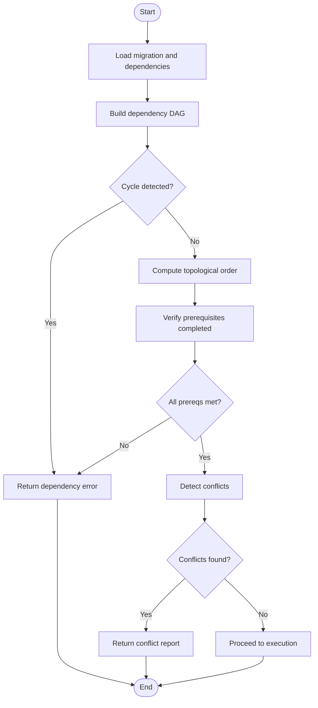

**Diagram sources**
- [backend/app/services/migration_service.py](file://backend/app/services/migration_service.py)
- [backend/app/models/migration.py](file://backend/app/models/migration.py)

**Section sources**
- [backend/app/services/migration_service.py](file://backend/app/services/migration_service.py)
- [backend/app/models/migration.py](file://backend/app/models/migration.py)

### Naming Conventions, Branching Strategies, and Merge Procedures
- Naming conventions:
  - Use semantic versioning for version strings (e.g., major.minor.patch).
  - Include descriptive titles and concise descriptions.
  - Tag migrations with feature or ticket identifiers for traceability.
- Branching strategies:
  - Feature branches create independent migrations with clear scope.
  - Maintain a main branch representing production-ready sequence.
  - Avoid diverging versions on the same target database without coordination.
- Merge procedures:
  - Resolve conflicts by reordering dependencies or splitting migrations.
  - Re-run preflight and drift checks after merges.
  - Obtain approvals for merged changes before scheduling execution.

[No sources needed since this section doesn't analyze specific files]

### Creating Migrations Programmatically and via API
- Programmatic creation:
  - Instantiate Migration model with required fields and relationships.
  - Persist via service layer to enforce validation and side effects.
- API creation:
  - POST /api/migrations with JSON payload conforming to schema.
  - Receive created migration object with initial status.

**Section sources**
- [backend/app/models/migration.py](file://backend/app/models/migration.py)
- [backend/app/schemas/migration.py](file://backend/app/schemas/migration.py)
- [backend/app/routes/migration.py](file://backend/app/routes/migration.py)
- [backend/app/services/migration_service.py](file://backend/app/services/migration_service.py)

## Dependency Analysis
The migration subsystem exhibits clear separation of concerns:
- Routes depend on services for business logic.
- Services depend on models for persistence and on workers for execution.
- Workers interact with the database to update checkpoints and statuses.
- Exceptions provide structured error propagation.
- Config and extensions supply shared resources.

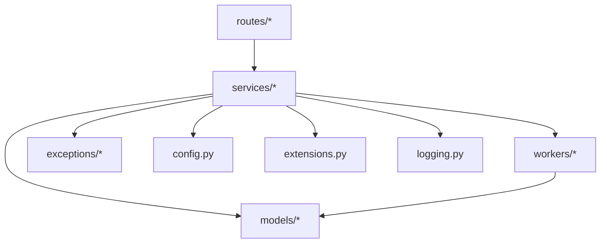

**Diagram sources**
- [backend/app/routes/migration.py](file://backend/app/routes/migration.py)
- [backend/app/services/migration_service.py](file://backend/app/services/migration_service.py)
- [backend/app/models/migration.py](file://backend/app/models/migration.py)
- [backend/app/workers/manager.py](file://backend/app/workers/manager.py)
- [backend/app/exceptions/migration.py](file://backend/app/exceptions/migration.py)
- [backend/app/config.py](file://backend/app/config.py)
- [backend/app/extensions.py](file://backend/app/extensions.py)
- [backend/app/logging.py](file://backend/app/logging.py)

**Section sources**
- [backend/app/routes/migration.py](file://backend/app/routes/migration.py)
- [backend/app/services/migration_service.py](file://backend/app/services/migration_service.py)
- [backend/app/models/migration.py](file://backend/app/models/migration.py)
- [backend/app/workers/manager.py](file://backend/app/workers/manager.py)
- [backend/app/exceptions/migration.py](file://backend/app/exceptions/migration.py)
- [backend/app/config.py](file://backend/app/config.py)
- [backend/app/extensions.py](file://backend/app/extensions.py)
- [backend/app/logging.py](file://backend/app/logging.py)

## Performance Considerations
- Batch operations: group small checkpoint updates to reduce write amplification.
- Indexing: ensure indexes on frequently queried fields (version, status, database_config_id).
- Concurrency: limit parallel executions per target database to avoid contention.
- Preflight caching: cache connectivity checks where appropriate to speed repeated runs.
- Worker scaling: adjust worker pool size based on workload and resource availability.

[No sources needed since this section provides general guidance]

## Troubleshooting Guide
Common issues and resolutions:
- Stuck migrations:
  - Symptoms: status remains queued or running for extended periods.
  - Actions: inspect worker logs, check database locks, verify network connectivity, restart worker if necessary.
- Version conflicts:
  - Symptoms: dependency cycle or overlapping changes detected.
  - Actions: reorder dependencies, split migrations, resolve conflicts, re-run preflight.
- Rollback failures:
  - Symptoms: rollback returns error or partial reversal.
  - Actions: review audit log, restore from snapshot, re-attempt rollback with corrected plan.
- Approval bottlenecks:
  - Symptoms: migration stuck in pending_approval.
  - Actions: notify approvers, escalate, or bypass if policy allows.

Operational utilities:
- Exception classes: standardized error messages for migration and rollback failures.
- Audit logs: track actions and changes for post-mortem analysis.
- Notifications: alert stakeholders on critical events.

**Section sources**
- [backend/app/exceptions/migration.py](file://backend/app/exceptions/migration.py)
- [backend/app/exceptions/rollback.py](file://backend/app/exceptions/rollback.py)
- [backend/app/models/audit_log.py](file://backend/app/models/audit_log.py)
- [backend/app/models/notification.py](file://backend/app/models/notification.py)

## Conclusion
The migration lifecycle management system provides a robust, observable, and safe approach to managing database changes. It enforces strong validation, dependency resolution, conflict detection, and approval gates while supporting asynchronous execution and detailed tracking. With clear APIs, comprehensive models, and resilient workers, teams can confidently manage complex migration workflows and recover from issues effectively.

[No sources needed since this section summarizes without analyzing specific files]

## Appendices

### Alembic Integration Notes
- alembic.ini: central configuration for migration tooling.
- env.py: runtime environment setup for Alembic operations.
- script.py.mako: template for generating new migration scripts.

**Section sources**
- [backend/alembic.ini](file://backend/alembic.ini)
- [backend/migrations/env.py](file://backend/migrations/env.py)
- [backend/migrations/script.py.mako](file://backend/migrations/script.py.mako)

### Application Entry Points and Configuration
- run.py: application bootstrap and server startup.
- config.py: application-wide configuration values.
- extensions.py: initialization of shared extensions (e.g., database).
- logging.py: logging configuration and handlers.

**Section sources**
- [backend/run.py](file://backend/run.py)
- [backend/app/config.py](file://backend/app/config.py)
- [backend/app/extensions.py](file://backend/app/extensions.py)
- [backend/app/logging.py](file://backend/app/logging.py)