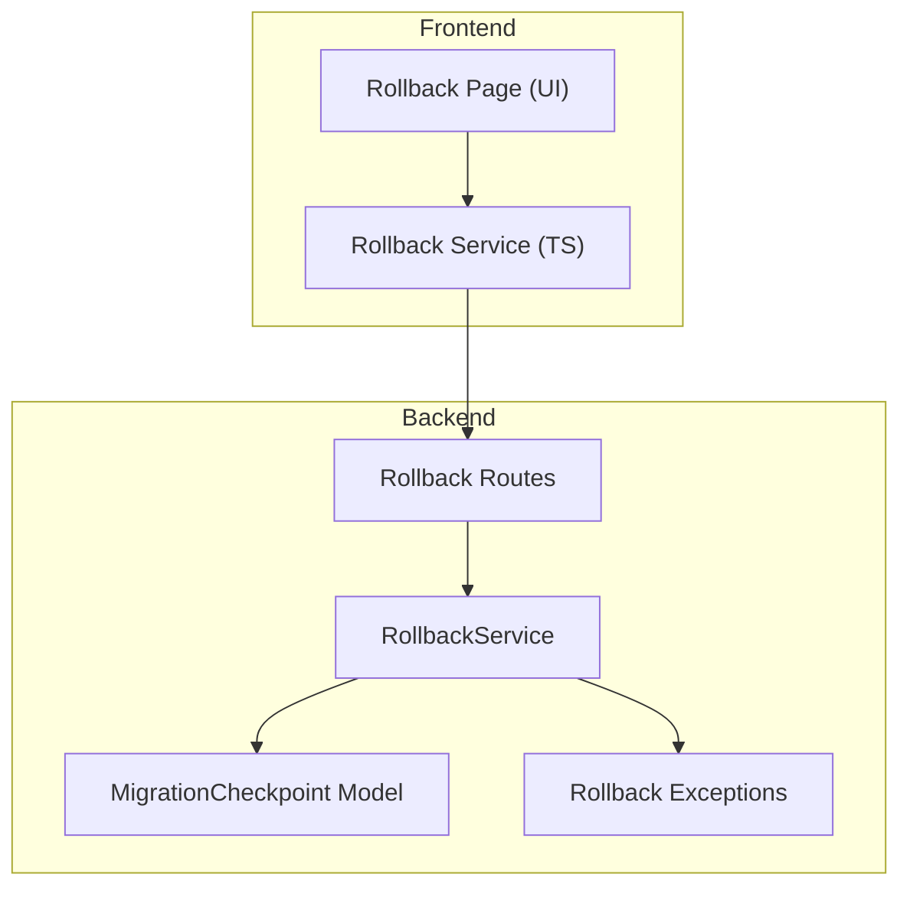
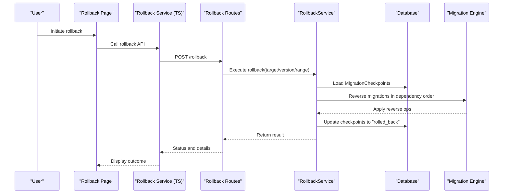
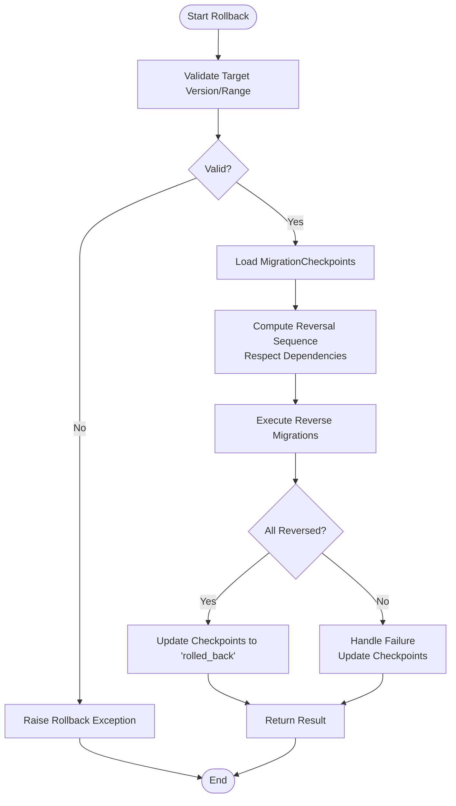
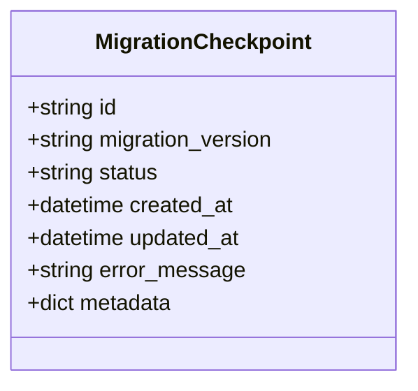
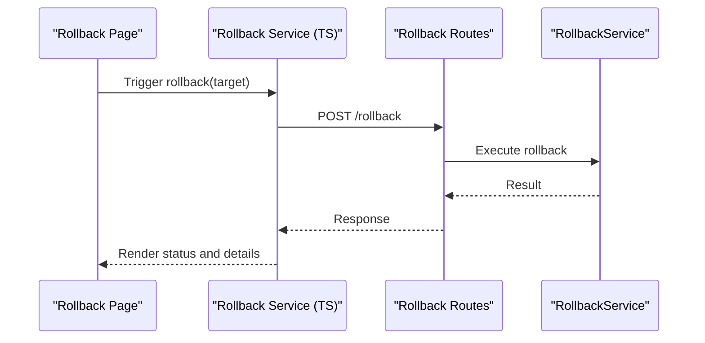
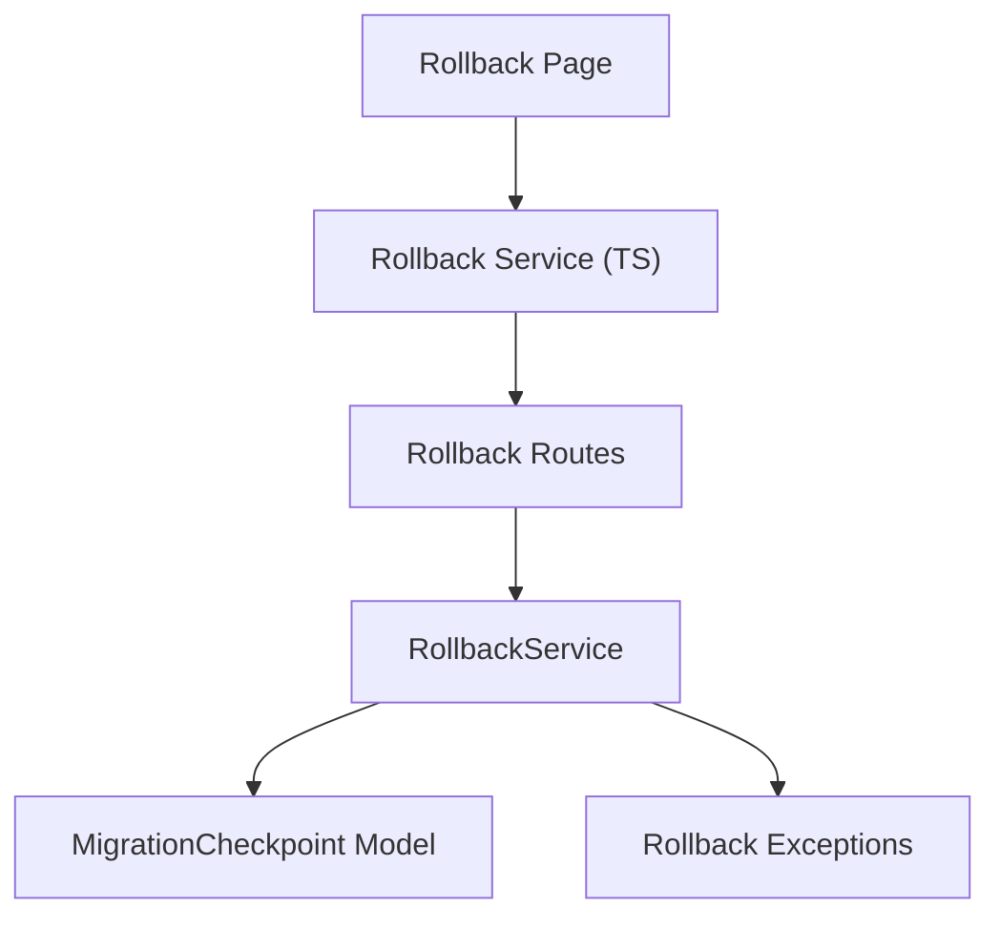

# Rollback & Recovery Mechanisms

<cite>
**Referenced Files in This Document**
- [rollback.py](file://backend/app/services/rollback_service.py)
- [migration_checkpoint.py](file://backend/app/models/migration_checkpoint.py)
- [rollback_exception.py](file://backend/app/exceptions/rollback.py)
- [rollback_route.py](file://backend/app/routes/rollback.py)
- [rollback_frontend_service.ts](file://frontend/src/services/rollbackService.ts)
- [rollback_page.tsx](file://frontend/src/pages/RollbackPage.tsx)
</cite>

## Table of Contents
1. [Introduction](#introduction)
2. [Project Structure](#project-structure)
3. [Core Components](#core-components)
4. [Architecture Overview](#architecture-overview)
5. [Detailed Component Analysis](#detailed-component-analysis)
6. [Dependency Analysis](#dependency-analysis)
7. [Performance Considerations](#performance-considerations)
8. [Troubleshooting Guide](#troubleshooting-guide)
9. [Conclusion](#conclusion)
10. [Appendices](#appendices)

## Introduction
This document explains CloudBridge’s rollback and recovery mechanisms for database migrations. It covers automatic rollback on failure, checkpoint management, partial rollbacks, manual rollback triggers, selective operations, dependency-aware reversal, disaster recovery procedures, backup strategies, data integrity verification, and best practices for designing reversible migrations. The goal is to help engineers implement safe rollback strategies, test them effectively, and handle complex data transformations with confidence.

## Project Structure
CloudBridge implements rollback and recovery across backend services, models, routes, exceptions, and frontend UI components:

- Backend service layer orchestrates rollback logic and interacts with the migration engine and database.
- Models define persistent state for checkpoints that track execution points and recovery states.
- Routes expose APIs for triggering rollbacks and querying status.
- Frontend provides user interfaces for initiating rollbacks and reviewing results.

[No sources needed since this diagram shows conceptual workflow, not actual code structure]

## Core Components
- RollbackService: Implements manual rollback triggers, selective rollback by version or range, and dependency-aware reversal. It coordinates with the migration engine and persists checkpoints to ensure consistency.
- MigrationCheckpoint model: Tracks execution points, statuses, and metadata for each migration run, enabling partial rollbacks and recovery after failures.
- Rollback exceptions: Domain-specific error types used to signal rollback failures, invalid targets, or inconsistent states.
- Rollback routes: REST endpoints to initiate rollbacks, query progress, and retrieve results.
- Frontend rollback service and page: Provide a user interface to trigger rollbacks and display outcomes.

Key responsibilities:
- Automatic rollback on migration failure via checkpoint-driven recovery.
- Manual rollback initiation through API/UI.
- Selective rollback to specific versions or ranges.
- Dependency-aware reversal respecting migration order.
- Persistent tracking of execution points and recovery states.

**Section sources**
- [rollback_service.py](file://backend/app/services/rollback_service.py)
- [migration_checkpoint.py](file://backend/app/models/migration_checkpoint.py)
- [rollback_exception.py](file://backend/app/exceptions/rollback.py)
- [rollback_route.py](file://backend/app/routes/rollback.py)
- [rollback_frontend_service.ts](file://frontend/src/services/rollbackService.ts)
- [rollback_page.tsx](file://frontend/src/pages/RollbackPage.tsx)

## Architecture Overview
The rollback architecture integrates the RollbackService with the migration engine and checkpoint persistence. When a migration fails, the system uses checkpoints to determine which steps were applied and performs partial rollback to restore consistency. Manual rollbacks are initiated via routes and executed with dependency-aware ordering.

**Diagram sources**
- [rollback_route.py](file://backend/app/routes/rollback.py)
- [rollback_service.py](file://backend/app/services/rollback_service.py)
- [migration_checkpoint.py](file://backend/app/models/migration_checkpoint.py)

## Detailed Component Analysis

### RollbackService Implementation
Responsibilities:
- Manual rollback triggers: Accepts target version or range and initiates reversal.
- Selective rollback: Supports rolling back specific migrations or a contiguous range.
- Dependency-aware reversal: Ensures migrations are reversed in correct order based on dependencies.
- Checkpoint coordination: Reads and updates MigrationCheckpoint records to reflect current state.
- Error handling: Uses domain-specific exceptions to report invalid targets, missing checkpoints, or failed reversals.

Operational flow:
- Validate inputs and resolve target versions.
- Load existing checkpoints to determine applied migrations.
- Compute reversal sequence respecting dependencies.
- Execute reverse operations via the migration engine.
- Persist updated checkpoints and return detailed results.

**Diagram sources**
- [rollback_service.py](file://backend/app/services/rollback_service.py)
- [migration_checkpoint.py](file://backend/app/models/migration_checkpoint.py)
- [rollback_exception.py](file://backend/app/exceptions/rollback.py)

**Section sources**
- [rollback_service.py](file://backend/app/services/rollback_service.py)
- [rollback_exception.py](file://backend/app/exceptions/rollback.py)

### MigrationCheckpoint Model
Purpose:
- Track execution points for each migration run.
- Record status transitions such as "applied", "failed", "rolled_back".
- Store metadata including timestamps, error messages, and version identifiers.

Key attributes and behaviors:
- Unique identifier per migration run.
- Version reference linking to the migration being rolled back.
- Status field indicating current state.
- Metadata fields for auditability and troubleshooting.

Usage in rollback:
- Determines which migrations were successfully applied before failure.
- Guides partial rollback by selecting only those needing reversal.
- Provides evidence for post-rollback integrity checks.

**Diagram sources**
- [migration_checkpoint.py](file://backend/app/models/migration_checkpoint.py)

**Section sources**
- [migration_checkpoint.py](file://backend/app/models/migration_checkpoint.py)

### Rollback Routes and Frontend Integration
Routes:
- Expose endpoints to initiate rollbacks and query status.
- Accept parameters for target version or range.
- Return structured responses with progress and results.

Frontend:
- Rollback service encapsulates API calls.
- Rollback page provides UI controls to select targets and view outcomes.
- Displays success/failure states and logs for auditing.

**Diagram sources**
- [rollback_route.py](file://backend/app/routes/rollback.py)
- [rollback_frontend_service.ts](file://frontend/src/services/rollbackService.ts)
- [rollback_page.tsx](file://frontend/src/pages/RollbackPage.tsx)

**Section sources**
- [rollback_route.py](file://backend/app/routes/rollback.py)
- [rollback_frontend_service.ts](file://frontend/src/services/rollbackService.ts)
- [rollback_page.tsx](file://frontend/src/pages/RollbackPage.tsx)

## Dependency Analysis
The rollback subsystem depends on:
- Migration engine for executing reverse operations.
- Database for persisting checkpoints and reading migration history.
- Frontend services and pages for user interaction.

**Diagram sources**
- [rollback_page.tsx](file://frontend/src/pages/RollbackPage.tsx)
- [rollback_frontend_service.ts](file://frontend/src/services/rollbackService.ts)
- [rollback_route.py](file://backend/app/routes/rollback.py)
- [rollback_service.py](file://backend/app/services/rollback_service.py)
- [migration_checkpoint.py](file://backend/app/models/migration_checkpoint.py)
- [rollback_exception.py](file://backend/app/exceptions/rollback.py)

**Section sources**
- [rollback_service.py](file://backend/app/services/rollback_service.py)
- [migration_checkpoint.py](file://backend/app/models/migration_checkpoint.py)
- [rollback_exception.py](file://backend/app/exceptions/rollback.py)
- [rollback_route.py](file://backend/app/routes/rollback.py)
- [rollback_frontend_service.ts](file://frontend/src/services/rollbackService.ts)
- [rollback_page.tsx](file://frontend/src/pages/RollbackPage.tsx)

## Performance Considerations
- Batch reverse operations where possible to reduce round-trips.
- Use targeted rollbacks to minimize work when only recent migrations need reversal.
- Monitor checkpoint updates to avoid excessive writes during long-running rollbacks.
- Implement timeouts and retries for external dependencies like the migration engine.

[No sources needed since this section provides general guidance]

## Troubleshooting Guide
Common issues and resolutions:
- Invalid target version: Ensure the requested version exists and is reachable from the current state.
- Missing checkpoints: Verify that all applied migrations have corresponding checkpoint records.
- Failed reversals: Inspect error messages stored in checkpoints and review migration logs.
- Inconsistent state: Re-run integrity checks and consider restoring from backups if necessary.

Operational tips:
- Always validate rollback targets before execution.
- Keep detailed metadata in checkpoints for post-mortem analysis.
- Use selective rollbacks to limit blast radius.
- Maintain clear separation between schema changes and data transformations; prefer reversible patterns.

**Section sources**
- [rollback_exception.py](file://backend/app/exceptions/rollback.py)
- [migration_checkpoint.py](file://backend/app/models/migration_checkpoint.py)

## Conclusion
CloudBridge’s rollback and recovery mechanisms provide robust safeguards for database migrations. By leveraging checkpoints, dependency-aware reversal, and clear exception handling, the system ensures consistency even when migrations fail. Manual rollbacks are accessible via well-defined routes and a user-friendly interface. Following best practices for reversible migrations and maintaining thorough backups further reduces risk and simplifies disaster recovery.

[No sources needed since this section summarizes without analyzing specific files]

## Appendices

### Best Practices for Reversible Migrations
- Prefer additive changes (new columns, tables) over destructive ones.
- Use dual-write patterns and feature flags to decouple deployment from data migration.
- Design reverse operations that are idempotent and safe to retry.
- Keep transformation logic small and focused; split large migrations into smaller steps.
- Record comprehensive metadata in checkpoints for traceability.

[No sources needed since this section provides general guidance]

### Disaster Recovery Procedures
- Maintain regular backups of both schema and data.
- After rollback, verify data integrity using checksums or sampling.
- If inconsistencies persist, restore from the most recent pre-failure backup.
- Document rollback incidents and update runbooks accordingly.

[No sources needed since this section provides general guidance]