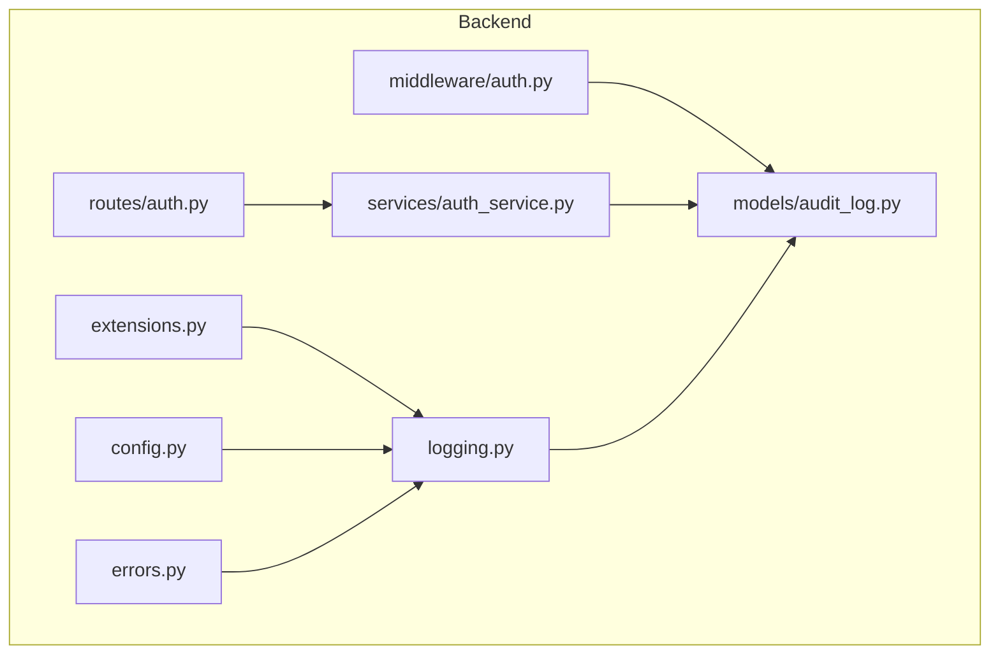
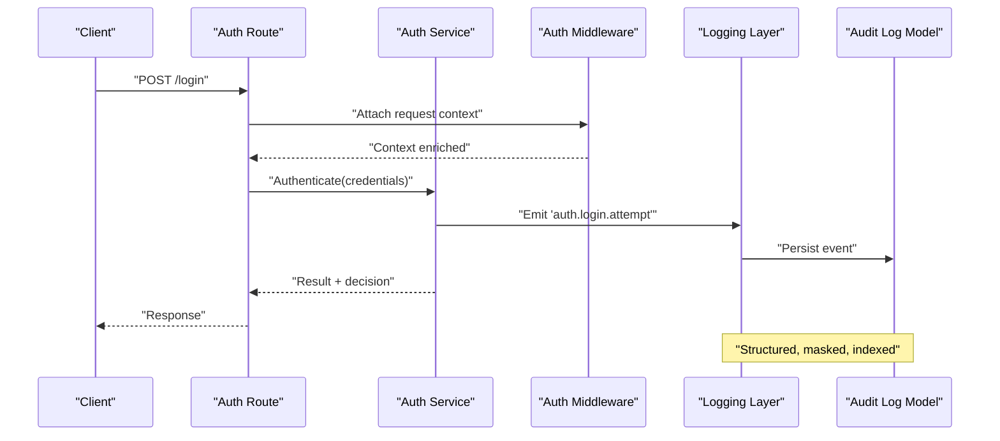
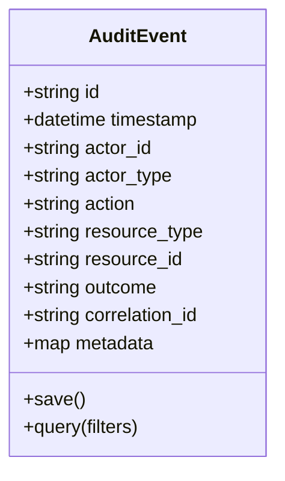
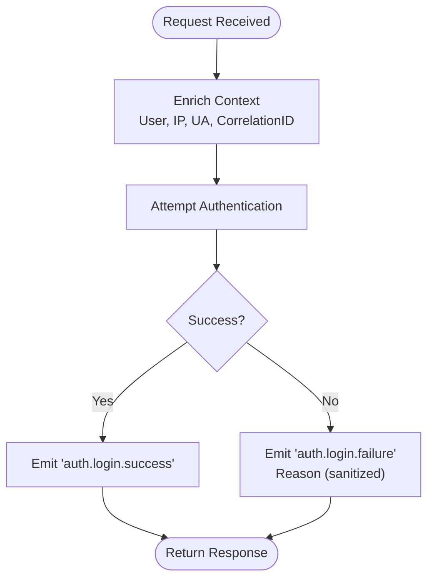
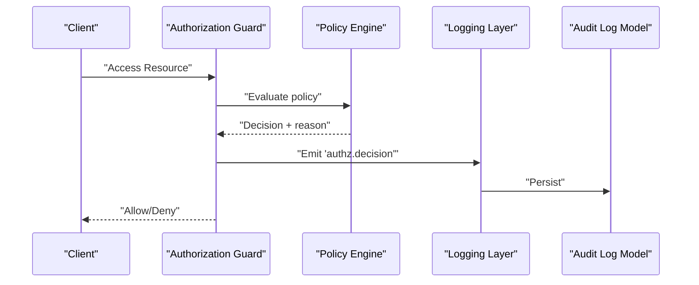
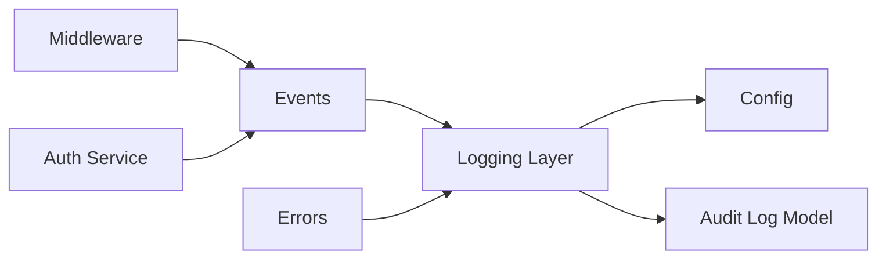

# Audit Trails & Compliance

<cite>
**Referenced Files in This Document**
- [audit_log.py](file://backend/app/models/audit_log.py)
- [auth.py](file://backend/app/middleware/auth.py)
- [auth_service.py](file://backend/app/services/auth_service.py)
- [auth.py](file://backend/app/routes/auth.py)
- [logging.py](file://backend/app/logging.py)
- [extensions.py](file://backend/app/extensions.py)
- [config.py](file://backend/app/config.py)
- [errors.py](file://backend/app/errors.py)
</cite>

## Table of Contents
1. [Introduction](#introduction)
2. [Project Structure](#project-structure)
3. [Core Components](#core-components)
4. [Architecture Overview](#architecture-overview)
5. [Detailed Component Analysis](#detailed-component-analysis)
6. [Dependency Analysis](#dependency-analysis)
7. [Performance Considerations](#performance-considerations)
8. [Troubleshooting Guide](#troubleshooting-guide)
9. [Conclusion](#conclusion)
10. [Appendices](#appendices)

## Introduction
This document explains the audit trail and compliance capabilities in CloudBridge, focusing on:
- Automatic action capture across authentication, authorization, and sensitive data access
- User activity tracking and event modeling
- Compliance reporting and retention policies
- Integration points for external logging systems
- Forensic analysis techniques and privacy considerations
- Regulatory alignment with GDPR and SOX

The goal is to provide both technical depth and practical guidance for implementing, operating, and auditing a secure, compliant system.

## Project Structure
CloudBridge organizes audit-related concerns primarily under backend/app/models (data model), backend/app/middleware and services (capture points), and backend/app/logging and extensions (infrastructure). The following diagram maps key files involved in audit trails.

**Diagram sources**
- [audit_log.py](file://backend/app/models/audit_log.py)
- [auth.py](file://backend/app/middleware/auth.py)
- [auth_service.py](file://backend/app/services/auth_service.py)
- [auth.py](file://backend/app/routes/auth.py)
- [logging.py](file://backend/app/logging.py)
- [extensions.py](file://backend/app/extensions.py)
- [config.py](file://backend/app/config.py)
- [errors.py](file://backend/app/errors.py)

**Section sources**
- [audit_log.py](file://backend/app/models/audit_log.py)
- [auth.py](file://backend/app/middleware/auth.py)
- [auth_service.py](file://backend/app/services/auth_service.py)
- [auth.py](file://backend/app/routes/auth.py)
- [logging.py](file://backend/app/logging.py)
- [extensions.py](file://backend/app/extensions.py)
- [config.py](file://backend/app/config.py)
- [errors.py](file://backend/app/errors.py)

## Core Components
- Audit log data model: Central entity representing an audit event with fields such as timestamp, actor, action, resource, outcome, and metadata. It supports indexing and filtering for compliance queries.
- Authentication middleware: Intercepts requests to capture login attempts, token issuance, and session lifecycle events.
- Auth service: Orchestrates authentication flows and emits audit events for success/failure and policy decisions.
- Logging infrastructure: Configures structured logging, sinks, and optional external integrations; ensures consistent formatting and correlation IDs.
- Configuration: Provides environment-driven settings for retention, sampling, and destination selection.
- Error handling: Normalizes exceptions into audit-friendly outcomes and prevents leaking sensitive details.

Key responsibilities:
- Capture: Middleware and services emit standardized events.
- Persist: Model persists records with indexes for fast retrieval.
- Format: Logging layer ensures machine-readable, privacy-safe payloads.
- Configure: Settings control retention, masking, and destinations.

**Section sources**
- [audit_log.py](file://backend/app/models/audit_log.py)
- [auth.py](file://backend/app/middleware/auth.py)
- [auth_service.py](file://backend/app/services/auth_service.py)
- [logging.py](file://backend/app/logging.py)
- [config.py](file://backend/app/config.py)
- [errors.py](file://backend/app/errors.py)

## Architecture Overview
The audit architecture follows a producer-consumer pattern:
- Producers: Auth routes and services, plus any future feature-specific producers.
- Consumers: Persistence via the audit log model and optional external sinks through the logging subsystem.
- Cross-cutting: Middleware captures request-level context (user, IP, correlation ID); configuration controls behavior; errors are normalized before emission.

**Diagram sources**
- [auth.py](file://backend/app/routes/auth.py)
- [auth_service.py](file://backend/app/services/auth_service.py)
- [auth.py](file://backend/app/middleware/auth.py)
- [logging.py](file://backend/app/logging.py)
- [audit_log.py](file://backend/app/models/audit_log.py)

## Detailed Component Analysis

### Audit Log Data Model
Purpose:
- Represent each audit event consistently for querying, reporting, and retention.

Primary attributes:
- Event identity and timestamp
- Actor identity and source context (IP, user agent)
- Action type and target resource
- Outcome and error summary (sanitized)
- Metadata map for extensibility
- Correlation identifiers for tracing

Design notes:
- Use immutable or append-only semantics where possible.
- Index frequently queried fields (actor, action, timestamp).
- Avoid storing secrets or PII directly; prefer references or hashes.

**Diagram sources**
- [audit_log.py](file://backend/app/models/audit_log.py)

**Section sources**
- [audit_log.py](file://backend/app/models/audit_log.py)

### Authentication Events Capture
Responsibilities:
- Capture login attempts, successes, failures, token refresh, logout, and account lockouts.
- Enrich events with request context (IP, user agent, correlation ID).
- Normalize errors without exposing sensitive details.

Integration points:
- Middleware attaches contextual fields to every request.
- Auth service emits events around core operations.
- Routes orchestrate flows and ensure events are emitted regardless of response path.

**Diagram sources**
- [auth.py](file://backend/app/middleware/auth.py)
- [auth_service.py](file://backend/app/services/auth_service.py)
- [auth.py](file://backend/app/routes/auth.py)

**Section sources**
- [auth.py](file://backend/app/middleware/auth.py)
- [auth_service.py](file://backend/app/services/auth_service.py)
- [auth.py](file://backend/app/routes/auth.py)

### Authorization Decisions
Responsibilities:
- Record authorization checks and decisions (allow/deny) for sensitive resources.
- Include policy identifiers and rationale when available.
- Ensure denial events are captured even if they short-circuit normal flows.

Implementation guidance:
- Emit events at decision boundaries (e.g., route guards, service methods).
- Keep payloads minimal and non-sensitive.
- Use correlation IDs to tie decisions to originating requests.

[No diagram sources since this section illustrates conceptual integration patterns]

### Sensitive Data Access
Responsibilities:
- Track access to secrets, credentials, and personally identifiable information (PII).
- Mask or hash sensitive values in metadata.
- Flag high-risk accesses for alerting and review.

Guidance:
- Prefer referencing secret identifiers rather than values.
- Include operation type (read/write/export) and scope.
- Apply stricter retention and access controls for these events.

[No sources needed since this section provides general guidance]

### Compliance Reporting
Capabilities:
- Query by actor, action, time range, resource, and outcome.
- Aggregate counts and trends for dashboards.
- Export filtered datasets for auditors.

Practical examples:
- Generate a monthly login failure report per user.
- Produce a change audit for schema migrations.
- Build a GDPR “access” report listing all reads of personal data.

Operational tips:
- Precompute aggregates for common reports.
- Use pagination and server-side filters for large exports.
- Redact sensitive fields before export.

[No sources needed since this section provides general guidance]

### Custom Audit Handlers
Approach:
- Implement a handler interface that receives standardized events.
- Register handlers via configuration or dependency injection.
- Support multiple sinks (database, message bus, SIEM).

Example scenarios:
- Forward critical events to a security information and event management (SIEM) system.
- Deduplicate noisy events.
- Transform events for downstream analytics.

[No sources needed since this section provides general guidance]

### External Logging Systems Integration
Options:
- File-based structured logs with rotation.
- Remote collectors (e.g., syslog, HTTP endpoints).
- Message queues for asynchronous delivery.

Configuration:
- Select sink(s) via configuration.
- Control batching, retries, and backoff.
- Ensure correlation IDs propagate across boundaries.

[No sources needed since this section provides general guidance]

## Dependency Analysis
The audit system depends on:
- Middleware for context enrichment
- Services for emitting domain events
- Logging layer for formatting and routing
- Model for persistence
- Configuration for runtime behavior
- Errors for normalization

**Diagram sources**
- [auth.py](file://backend/app/middleware/auth.py)
- [auth_service.py](file://backend/app/services/auth_service.py)
- [logging.py](file://backend/app/logging.py)
- [config.py](file://backend/app/config.py)
- [audit_log.py](file://backend/app/models/audit_log.py)
- [errors.py](file://backend/app/errors.py)

**Section sources**
- [auth.py](file://backend/app/middleware/auth.py)
- [auth_service.py](file://backend/app/services/auth_service.py)
- [logging.py](file://backend/app/logging.py)
- [config.py](file://backend/app/config.py)
- [audit_log.py](file://backend/app/models/audit_log.py)
- [errors.py](file://backend/app/errors.py)

## Performance Considerations
- Batch writes to reduce I/O overhead.
- Asynchronous emission for non-blocking request paths.
- Index only necessary fields to keep queries efficient.
- Sample low-priority events under load while retaining high-priority ones.
- Separate hot/warm/cold storage tiers based on retention policies.

[No sources needed since this section provides general guidance]

## Troubleshooting Guide
Common issues and resolutions:
- Missing correlation IDs: Ensure middleware always sets and propagates correlation IDs.
- Duplicate events: Implement idempotency keys and deduplication in sinks.
- Excessive volume: Adjust sampling and filter out noisy actions.
- Sensitive data leakage: Validate masks and redaction rules in the logging pipeline.
- Retention violations: Verify scheduled jobs enforce deletion/archival policies.

Error handling best practices:
- Normalize exceptions into safe audit outcomes.
- Avoid including stack traces or secrets in events.
- Provide actionable error summaries for operators.

**Section sources**
- [errors.py](file://backend/app/errors.py)
- [logging.py](file://backend/app/logging.py)

## Conclusion
CloudBridge’s audit trail centers on a robust data model, context-aware capture points, and a configurable logging layer. By standardizing event emission, enforcing privacy-preserving design, and providing clear integration points, it enables strong compliance posture, forensic readiness, and operational insight. Adopting the recommended patterns for custom handlers, external sinks, and retention policies will further strengthen governance and risk management.

## Appendices

### Data Privacy and Security
- Minimize data collection to what is necessary.
- Never store secrets or raw PII; use identifiers and hashes.
- Encrypt audit stores at rest and in transit.
- Restrict access to audit data using least privilege.

### Regulatory Alignment
- GDPR: Lawful basis for processing, right to erasure (where applicable), data minimization, and transparency.
- SOX: Immutable records, segregation of duties, and reliable retention for financial controls.

### Retention Policies
- Define tiered retention (hot/warm/cold) aligned with legal requirements.
- Automate archival and deletion with auditability.
- Preserve chain-of-custody metadata for long-term records.

[No sources needed since this section provides general guidance]