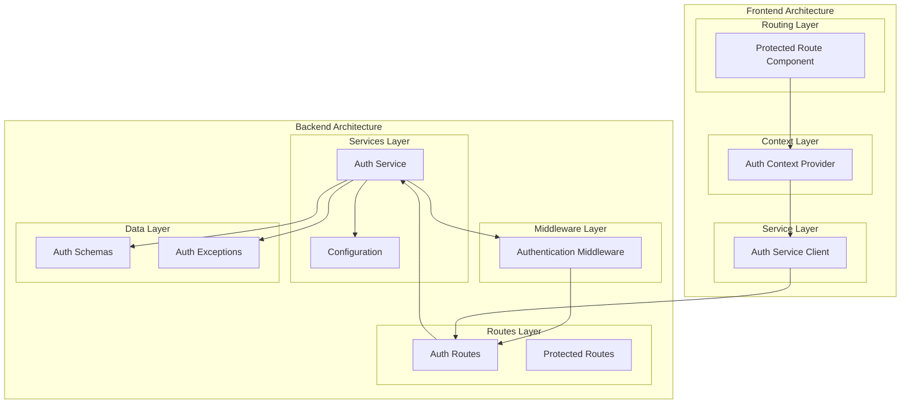
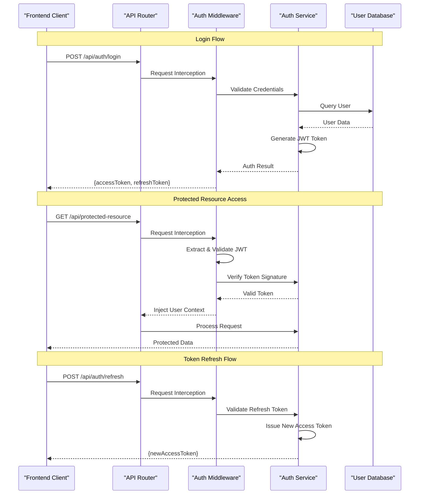
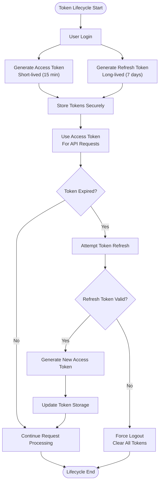
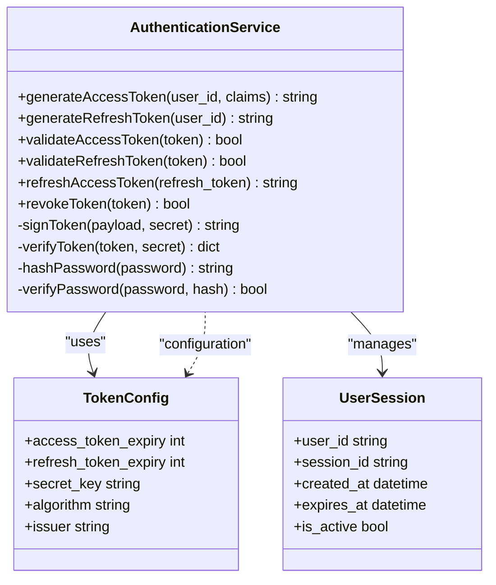
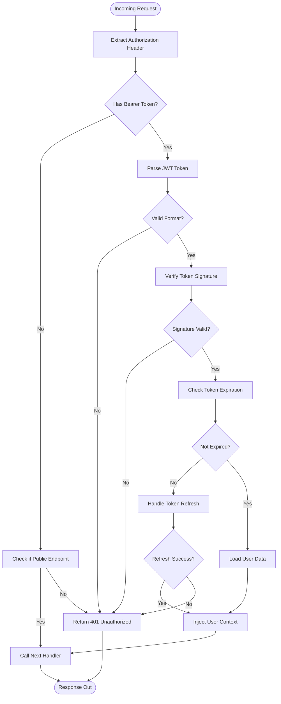
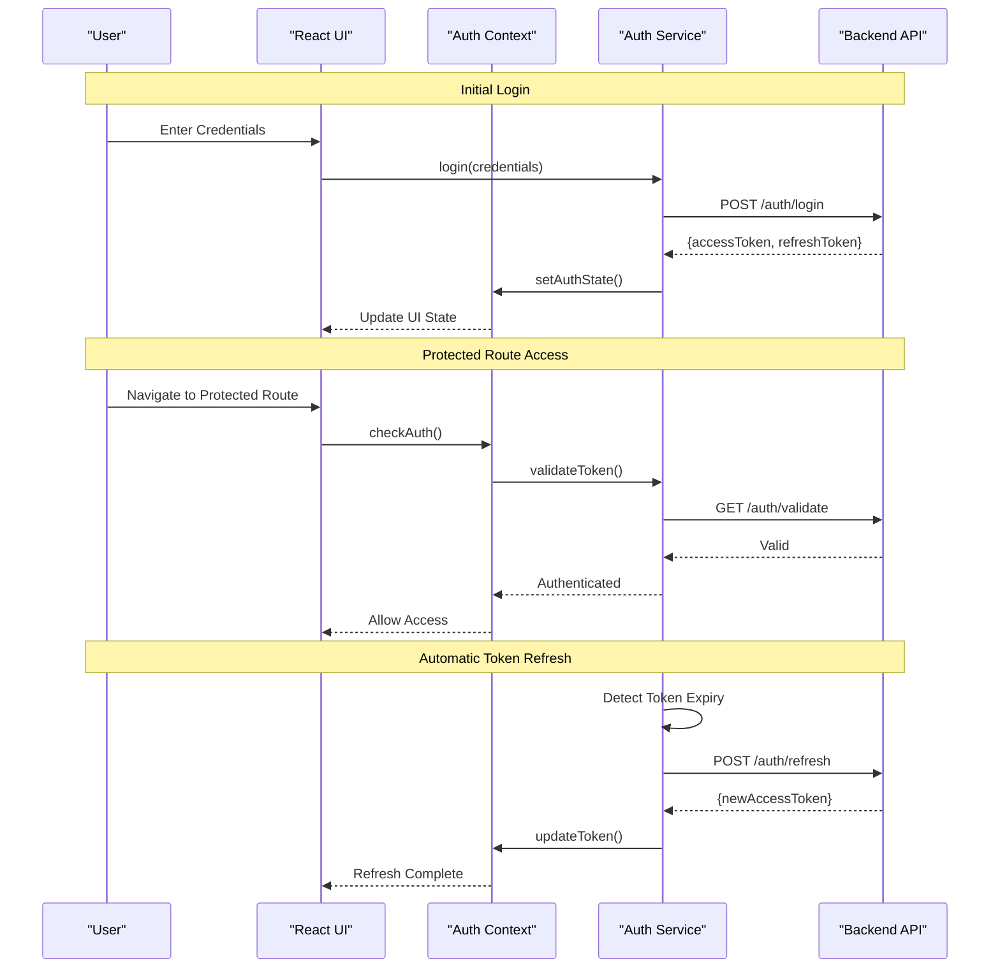
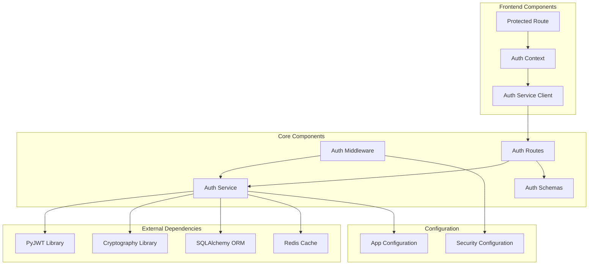

# JWT Authentication System

<cite>
**Referenced Files in This Document**
- [auth_service.py](file://backend/app/services/auth_service.py)
- [auth.py](file://backend/app/middleware/auth.py)
- [auth.py](file://backend/app/routes/auth.py)
- [auth.py](file://backend/app/schemas/auth.py)
- [auth.py](file://backend/app/exceptions/auth.py)
- [AuthContext.tsx](file://frontend/src/context/AuthContext.tsx)
- [authService.ts](file://frontend/src/services/authService.ts)
- [ProtectedRoute.tsx](file://frontend/src/components/routing/ProtectedRoute.tsx)
- [config.py](file://backend/app/config.py)
</cite>

## Table of Contents
1. [Introduction](#introduction)
2. [Project Structure](#project-structure)
3. [Core Components](#core-components)
4. [Architecture Overview](#architecture-overview)
5. [Detailed Component Analysis](#detailed-component-analysis)
6. [Dependency Analysis](#dependency-analysis)
7. [Performance Considerations](#performance-considerations)
8. [Security Considerations](#security-considerations)
9. [Troubleshooting Guide](#troubleshooting-guide)
10. [Conclusion](#conclusion)

## Introduction

The CloudBridge JWT Authentication System provides a comprehensive, secure, and scalable authentication solution for managing user sessions across the application. The system implements industry-standard JSON Web Token (JWT) authentication with support for token generation, validation, refresh mechanisms, and expiration handling. It features robust middleware for request interception, comprehensive error handling, and follows security best practices to protect against common vulnerabilities.

The authentication system is designed with a clear separation of concerns, utilizing dedicated services for business logic, middleware for request processing, and well-defined schemas for data validation. The frontend integrates seamlessly with the backend through context providers and service layers that handle token storage and automatic refresh mechanisms.

## Project Structure

The JWT authentication system spans both backend and frontend components, following a modular architecture pattern:

**Diagram sources**
- [auth_service.py](file://backend/app/services/auth_service.py)
- [auth.py](file://backend/app/middleware/auth.py)
- [auth.py](file://backend/app/routes/auth.py)
- [AuthContext.tsx](file://frontend/src/context/AuthContext.tsx)
- [authService.ts](file://frontend/src/services/authService.ts)

**Section sources**
- [auth_service.py](file://backend/app/services/auth_service.py)
- [auth.py](file://backend/app/middleware/auth.py)
- [auth.py](file://backend/app/routes/auth.py)
- [AuthContext.tsx](file://frontend/src/context/AuthContext.tsx)

## Core Components

### Backend Authentication Services

The backend authentication system is built around several key components that work together to provide secure token-based authentication:

#### Authentication Service
The core authentication service handles all JWT-related operations including token generation, validation, and refresh mechanisms. It manages user credential validation, token signing with secrets, and session management patterns.

#### Authentication Middleware
The middleware component intercepts incoming requests, extracts JWT tokens from headers, validates their authenticity and expiration, and injects authenticated user context into the request pipeline.

#### Authentication Routes
The routes layer exposes endpoints for login, logout, token refresh, and user profile management. These endpoints handle HTTP request/response cycles and coordinate with the authentication service.

#### Data Validation and Error Handling
Comprehensive schema validation ensures data integrity, while specialized exception classes provide consistent error responses across the authentication system.

### Frontend Authentication Integration

The frontend implements a client-side authentication layer that manages token storage, automatic refresh, and protected route access:

#### Authentication Context
A React context provider manages global authentication state, token persistence, and user session information throughout the application lifecycle.

#### Authentication Service Client
A dedicated service layer handles API calls to authentication endpoints, manages token storage strategies, and implements automatic token refresh logic.

#### Protected Route Components
Route guards that prevent unauthorized access to protected routes by checking authentication status and redirecting unauthenticated users appropriately.

**Section sources**
- [auth_service.py](file://backend/app/services/auth_service.py)
- [auth.py](file://backend/app/middleware/auth.py)
- [auth.py](file://backend/app/routes/auth.py)
- [auth.py](file://backend/app/schemas/auth.py)
- [auth.py](file://backend/app/exceptions/auth.py)
- [AuthContext.tsx](file://frontend/src/context/AuthContext.tsx)
- [authService.ts](file://frontend/src/services/authService.ts)
- [ProtectedRoute.tsx](file://frontend/src/components/routing/ProtectedRoute.tsx)

## Architecture Overview

The JWT authentication system follows a layered architecture pattern with clear separation of responsibilities:

**Diagram sources**
- [auth.py](file://backend/app/routes/auth.py)
- [auth.py](file://backend/app/middleware/auth.py)
- [auth_service.py](file://backend/app/services/auth_service.py)

### Token Lifecycle Management

The system implements a complete JWT token lifecycle with multiple phases:

**Diagram sources**
- [auth_service.py](file://backend/app/services/auth_service.py)
- [auth.py](file://backend/app/middleware/auth.py)

## Detailed Component Analysis

### Authentication Service Implementation

The authentication service serves as the central orchestrator for all JWT operations, providing methods for token generation, validation, and user management.

#### Token Generation and Signing
The service implements secure token generation using cryptographic algorithms and configurable secret keys. It supports both access tokens for immediate API access and refresh tokens for long-lived sessions.

#### User Credential Validation
Comprehensive validation ensures user credentials meet security requirements before token issuance. The service integrates with user databases and supports various authentication providers.

#### Session Management Patterns
The service implements flexible session management supporting both stateless JWT patterns and optional stateful session tracking for enhanced security features.

**Diagram sources**
- [auth_service.py](file://backend/app/services/auth_service.py)
- [config.py](file://backend/app/config.py)

**Section sources**
- [auth_service.py](file://backend/app/services/auth_service.py)
- [config.py](file://backend/app/config.py)

### Authentication Middleware

The middleware implementation provides request interception, token verification, and error handling capabilities essential for securing API endpoints.

#### Request Interception Logic
The middleware intercepts all incoming requests, extracts JWT tokens from Authorization headers, and performs preliminary validation before passing control to route handlers.

#### Token Verification Process
A multi-step verification process ensures token authenticity, checks expiration times, validates signatures, and verifies user permissions before granting access to protected resources.

#### Error Handling Strategies
Comprehensive error handling provides meaningful error messages while maintaining security by not exposing sensitive system information to potential attackers.

**Diagram sources**
- [auth.py](file://backend/app/middleware/auth.py)

**Section sources**
- [auth.py](file://backend/app/middleware/auth.py)

### Authentication Routes and Schemas

The routes layer provides RESTful endpoints for authentication operations, while schemas ensure data validation and consistency.

#### Authentication Endpoints
Standard endpoints include login, logout, token refresh, and user profile management. Each endpoint follows consistent response formats and error handling patterns.

#### Data Validation Schemas
Pydantic models define strict validation rules for authentication requests and responses, ensuring data integrity and preventing malformed input from reaching business logic.

#### Exception Handling
Custom exception classes provide structured error responses with appropriate HTTP status codes and descriptive error messages.

**Section sources**
- [auth.py](file://backend/app/routes/auth.py)
- [auth.py](file://backend/app/schemas/auth.py)
- [auth.py](file://backend/app/exceptions/auth.py)

### Frontend Authentication Integration

The frontend implements a comprehensive authentication layer that manages user sessions, token storage, and protected route access.

#### Authentication Context Provider
A React context provider manages global authentication state, handles token persistence, and provides authentication utilities throughout the application.

#### Service Layer Implementation
Dedicated service functions handle API communication, token storage strategies, and automatic token refresh mechanisms.

#### Protected Route Components
Route guards prevent unauthorized access by checking authentication status and redirecting unauthenticated users to login pages.

**Diagram sources**
- [AuthContext.tsx](file://frontend/src/context/AuthContext.tsx)
- [authService.ts](file://frontend/src/services/authService.ts)
- [ProtectedRoute.tsx](file://frontend/src/components/routing/ProtectedRoute.tsx)

**Section sources**
- [AuthContext.tsx](file://frontend/src/context/AuthContext.tsx)
- [authService.ts](file://frontend/src/services/authService.ts)
- [ProtectedRoute.tsx](file://frontend/src/components/routing/ProtectedRoute.tsx)

## Dependency Analysis

The JWT authentication system maintains clear dependency relationships between components:

**Diagram sources**
- [auth_service.py](file://backend/app/services/auth_service.py)
- [auth.py](file://backend/app/middleware/auth.py)
- [auth.py](file://backend/app/routes/auth.py)
- [AuthContext.tsx](file://frontend/src/context/AuthContext.tsx)

### Component Coupling Analysis

The system demonstrates low coupling between major components while maintaining high cohesion within each module. The authentication service acts as a central hub but remains loosely coupled through well-defined interfaces and configuration-driven behavior.

**Section sources**
- [auth_service.py](file://backend/app/services/auth_service.py)
- [auth.py](file://backend/app/middleware/auth.py)
- [auth.py](file://backend/app/routes/auth.py)

## Performance Considerations

### Token Validation Optimization
Implement caching strategies for frequently accessed user data and token validation results to reduce database queries and improve response times.

### Memory Management
Ensure proper cleanup of token objects and session data to prevent memory leaks, especially in high-throughput scenarios.

### Scalability Patterns
Design the authentication system to scale horizontally by implementing stateless token validation and distributed session storage when needed.

### Caching Strategies
Utilize in-memory caches for frequently accessed user profiles and permission data to minimize database load during token validation.

## Security Considerations

### Token Storage Best Practices
- **Server-side**: Store refresh tokens in secure, HTTP-only cookies or encrypted database fields
- **Client-side**: Use secure storage mechanisms like HttpOnly cookies rather than localStorage for sensitive tokens
- **Memory**: Clear tokens from memory immediately after use to prevent exposure

### Transmission Security
- Always use HTTPS/TLS for all authentication-related communications
- Implement Content Security Policy (CSP) headers to prevent XSS attacks
- Use secure cookie flags (Secure, HttpOnly, SameSite) for token storage

### Protection Against Common Vulnerabilities

#### Token Replay Attacks
- Implement token binding to specific clients or sessions
- Use short-lived access tokens with longer-lived refresh tokens
- Monitor for suspicious token usage patterns

#### Cross-Site Scripting (XSS)
- Sanitize all user inputs and outputs
- Implement proper Content Security Policy headers
- Avoid storing tokens in accessible client-side storage

#### Cross-Site Request Forgery (CSRF)
- Implement CSRF protection for state-changing operations
- Use SameSite cookie attributes
- Validate Origin and Referer headers

#### Brute Force Attacks
- Implement rate limiting on authentication endpoints
- Add account lockout mechanisms after failed attempts
- Monitor for suspicious login patterns

### Secret Management
- Store JWT secrets in environment variables or secure vaults
- Rotate secrets regularly without disrupting active sessions
- Use different secrets for development and production environments

## Troubleshooting Guide

### Common Authentication Issues

#### Token Validation Failures
- Verify JWT signature matches configured secret
- Check token expiration times and timezone settings
- Ensure proper token format and encoding

#### Middleware Errors
- Confirm Authorization header format (Bearer token)
- Verify CORS settings allow authentication requests
- Check network connectivity to external services

#### Frontend Integration Problems
- Validate token storage and retrieval mechanisms
- Ensure proper error handling for network failures
- Check browser security settings blocking cookies

### Debugging Techniques

#### Logging Strategy
Implement comprehensive logging for authentication flows while avoiding sensitive data exposure in logs.

#### Health Check Endpoints
Create dedicated endpoints for monitoring authentication service health and token validation performance.

#### Error Response Formats
Standardize error responses to facilitate debugging and provide meaningful feedback to developers.

**Section sources**
- [auth.py](file://backend/app/exceptions/auth.py)
- [auth_service.py](file://backend/app/services/auth_service.py)

## Conclusion

The CloudBridge JWT Authentication System provides a robust, secure, and scalable foundation for user authentication across the application. By implementing industry-standard JWT practices, comprehensive error handling, and security best practices, the system protects against common vulnerabilities while maintaining excellent performance characteristics.

The modular architecture enables easy customization and extension for specific authentication requirements, while the clear separation between backend and frontend concerns facilitates independent development and testing. The comprehensive documentation and troubleshooting guides ensure maintainability and ease of deployment in production environments.

Key strengths of the implementation include its focus on security, scalability considerations, and developer-friendly APIs that make it straightforward to integrate additional authentication providers or customize existing flows. The system's design supports both simple single-application deployments and complex microservices architectures requiring distributed authentication.