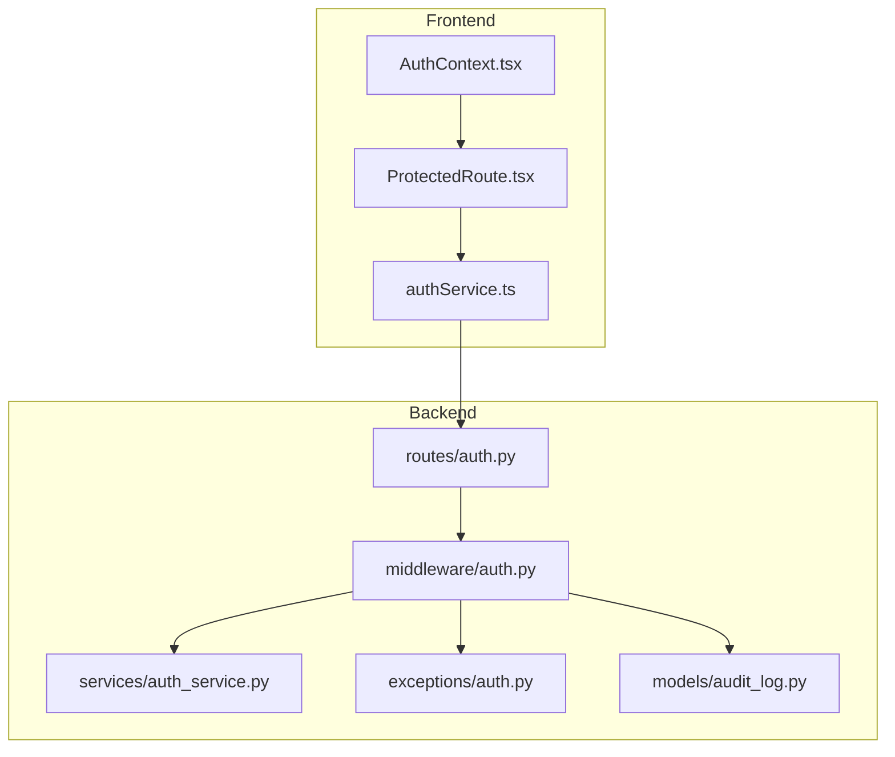
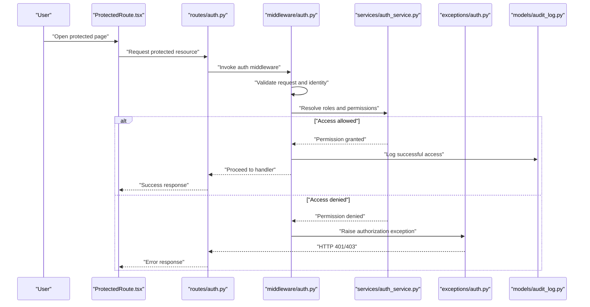
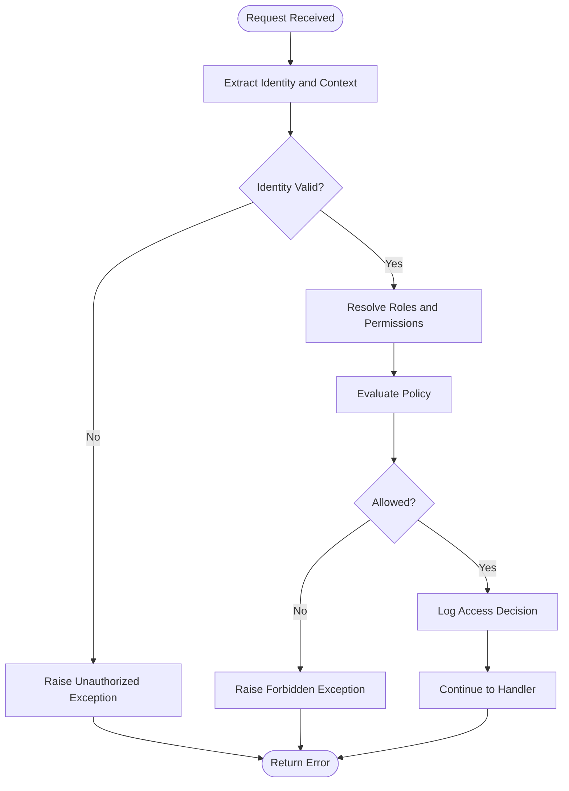
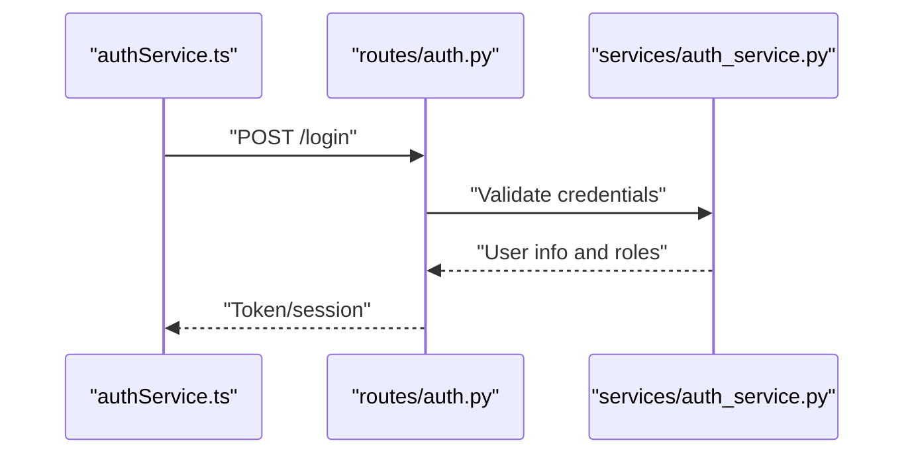
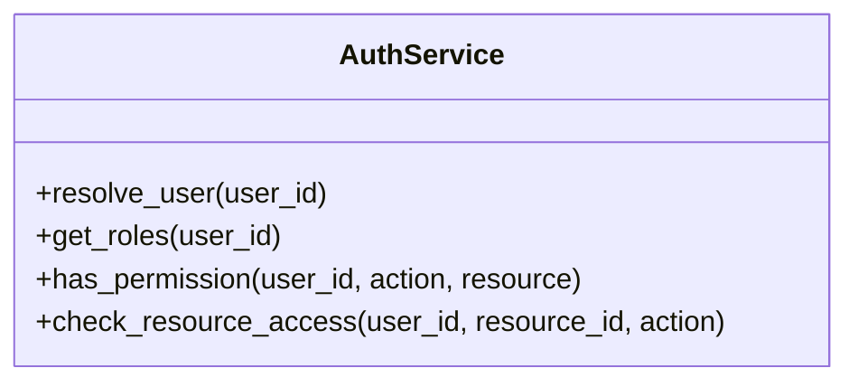
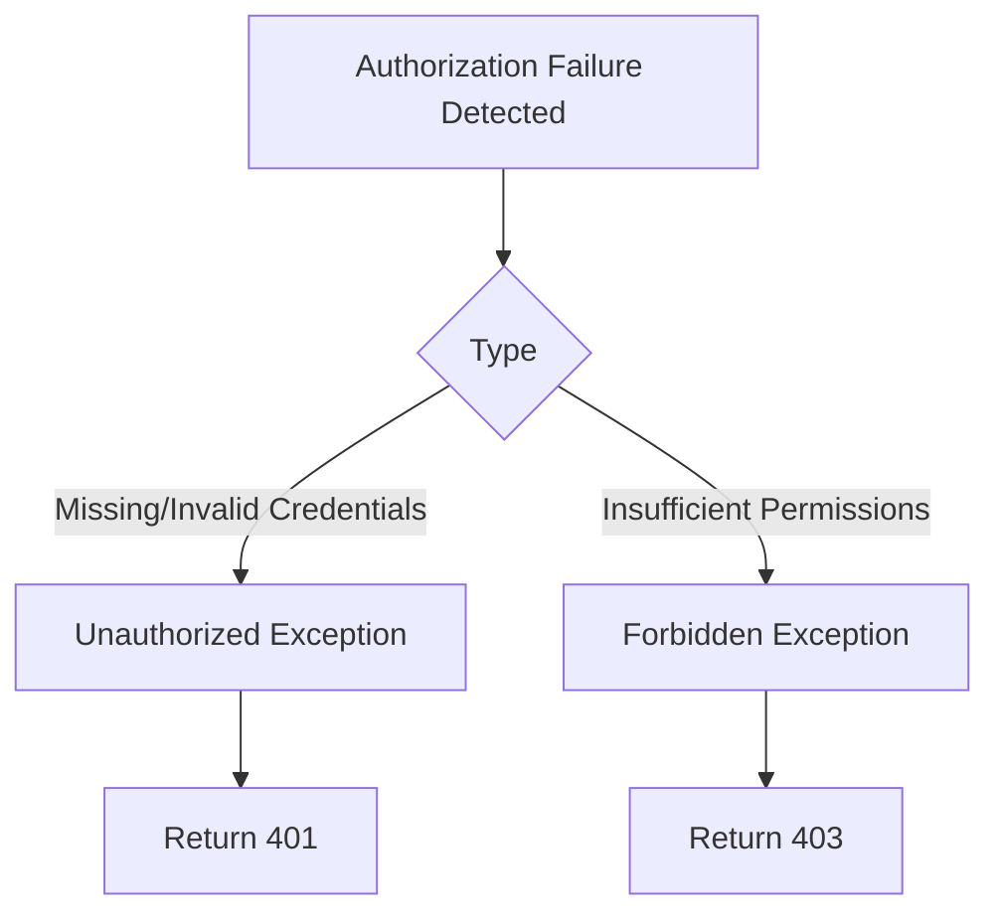
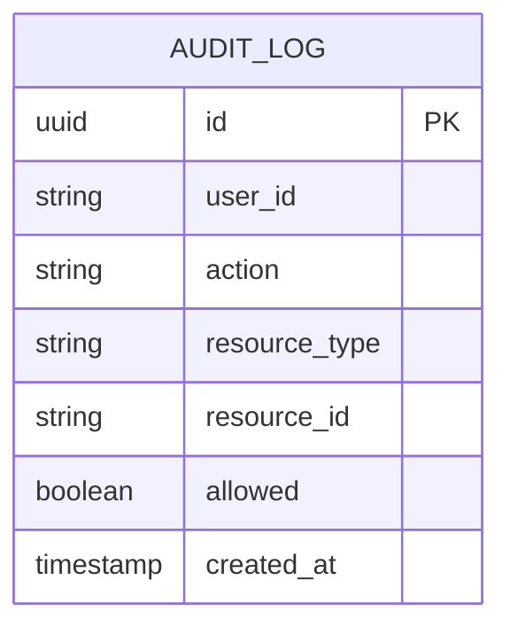
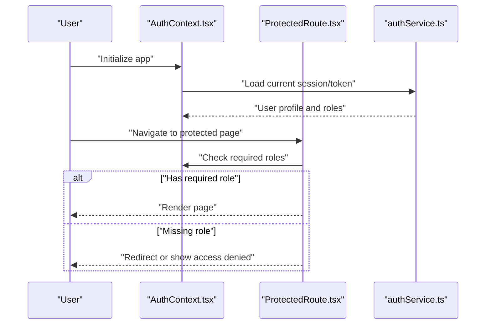
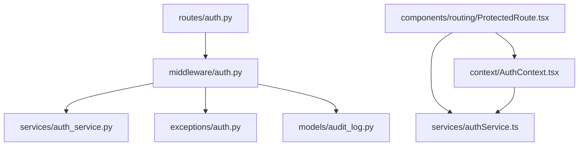

# Role-Based Access Control (RBAC)

<cite>
**Referenced Files in This Document**
- [backend/app/middleware/auth.py](file://backend/app/middleware/auth.py)
- [backend/app/routes/auth.py](file://backend/app/routes/auth.py)
- [backend/app/services/auth_service.py](file://backend/app/services/auth_service.py)
- [backend/app/exceptions/auth.py](file://backend/app/exceptions/auth.py)
- [backend/app/models/audit_log.py](file://backend/app/models/audit_log.py)
- [frontend/src/context/AuthContext.tsx](file://frontend/src/context/AuthContext.tsx)
- [frontend/src/components/routing/ProtectedRoute.tsx](file://frontend/src/components/routing/ProtectedRoute.tsx)
- [frontend/src/services/authService.ts](file://frontend/src/services/authService.ts)
</cite>

## Table of Contents
1. [Introduction](#introduction)
2. [Project Structure](#project-structure)
3. [Core Components](#core-components)
4. [Architecture Overview](#architecture-overview)
5. [Detailed Component Analysis](#detailed-component-analysis)
6. [Dependency Analysis](#dependency-analysis)
7. [Performance Considerations](#performance-considerations)
8. [Troubleshooting Guide](#troubleshooting-guide)
9. [Conclusion](#conclusion)
10. [Appendices](#appendices)

## Introduction
This document explains the Role-Based Access Control (RBAC) implementation in CloudBridge, focusing on how roles and permissions are defined, enforced across API endpoints and administrative interfaces, and how exceptions are handled for unauthorized access attempts. It also provides guidance on extending the system with new roles, assigning permissions, implementing custom authorization logic, and optimizing performance while debugging access control issues.

## Project Structure
CloudBridge organizes RBAC-related functionality across backend middleware, routes, services, exceptions, models, and frontend routing and context:

- Backend
  - Middleware: central authentication and authorization enforcement
  - Routes: endpoint handlers that rely on middleware for access checks
  - Services: business logic that may perform resource-level authorization
  - Exceptions: standardized error responses for auth failures
  - Models: audit logging to record access decisions
- Frontend
  - Context: holds authenticated user state and tokens
  - Routing: protects UI routes based on role/permission checks
  - Services: client-side helpers for authentication flows

**Diagram sources**
- [backend/app/middleware/auth.py](file://backend/app/middleware/auth.py)
- [backend/app/routes/auth.py](file://backend/app/routes/auth.py)
- [backend/app/services/auth_service.py](file://backend/app/services/auth_service.py)
- [backend/app/exceptions/auth.py](file://backend/app/exceptions/auth.py)
- [backend/app/models/audit_log.py](file://backend/app/models/audit_log.py)
- [frontend/src/context/AuthContext.tsx](file://frontend/src/context/AuthContext.tsx)
- [frontend/src/components/routing/ProtectedRoute.tsx](file://frontend/src/components/routing/ProtectedRoute.tsx)
- [frontend/src/services/authService.ts](file://frontend/src/services/authService.ts)

**Section sources**
- [backend/app/middleware/auth.py](file://backend/app/middleware/auth.py)
- [backend/app/routes/auth.py](file://backend/app/routes/auth.py)
- [backend/app/services/auth_service.py](file://backend/app/services/auth_service.py)
- [backend/app/exceptions/auth.py](file://backend/app/exceptions/auth.py)
- [backend/app/models/audit_log.py](file://backend/app/models/audit_log.py)
- [frontend/src/context/AuthContext.tsx](file://frontend/src/context/AuthContext.tsx)
- [frontend/src/components/routing/ProtectedRoute.tsx](file://frontend/src/components/routing/ProtectedRoute.tsx)
- [frontend/src/services/authService.ts](file://frontend/src/services/authService.ts)

## Core Components
- Authentication middleware: validates requests, resolves identity, enforces role/permission policies, and records audit events.
- Auth routes: handle login, token issuance, and session management.
- Auth service: encapsulates user/role resolution and permission evaluation logic.
- Exception handling: returns consistent HTTP errors for unauthorized or forbidden scenarios.
- Audit model: persists access decisions for compliance and troubleshooting.
- Frontend context and protected routes: enforce UI-level access control based on roles and permissions.

Key responsibilities:
- Centralized policy enforcement at the middleware layer
- Resource-level authorization via service-layer checks
- Consistent error responses and audit trails
- Client-side gating of sensitive UI features

**Section sources**
- [backend/app/middleware/auth.py](file://backend/app/middleware/auth.py)
- [backend/app/routes/auth.py](file://backend/app/routes/auth.py)
- [backend/app/services/auth_service.py](file://backend/app/services/auth_service.py)
- [backend/app/exceptions/auth.py](file://backend/app/exceptions/auth.py)
- [backend/app/models/audit_log.py](file://backend/app/models/audit_log.py)
- [frontend/src/context/AuthContext.tsx](file://frontend/src/context/AuthContext.tsx)
- [frontend/src/components/routing/ProtectedRoute.tsx](file://frontend/src/components/routing/ProtectedRoute.tsx)
- [frontend/src/services/authService.ts](file://frontend/src/services/authService.ts)

## Architecture Overview
The RBAC architecture integrates middleware-based enforcement with service-layer authorization and frontend route protection. Requests flow through the frontend’s protected routes, which call backend auth routes and protected endpoints. The middleware validates credentials, resolves roles and permissions, applies policies, and logs outcomes. Services can further refine access by evaluating resource attributes.

**Diagram sources**
- [backend/app/middleware/auth.py](file://backend/app/middleware/auth.py)
- [backend/app/routes/auth.py](file://backend/app/routes/auth.py)
- [backend/app/services/auth_service.py](file://backend/app/services/auth_service.py)
- [backend/app/exceptions/auth.py](file://backend/app/exceptions/auth.py)
- [backend/app/models/audit_log.py](file://backend/app/models/audit_log.py)
- [frontend/src/components/routing/ProtectedRoute.tsx](file://frontend/src/components/routing/ProtectedRoute.tsx)

## Detailed Component Analysis

### Authentication Middleware
Responsibilities:
- Validate incoming requests and extract identity information
- Resolve user roles and permissions
- Enforce resource-level authorization policies
- Record audit events for access decisions
- Raise standardized exceptions for unauthorized/forbidden cases

Implementation patterns:
- Centralized policy enforcement before route handlers
- Optional decorators or route-level guards for fine-grained checks
- Integration with audit logging for compliance

**Diagram sources**
- [backend/app/middleware/auth.py](file://backend/app/middleware/auth.py)
- [backend/app/exceptions/auth.py](file://backend/app/exceptions/auth.py)
- [backend/app/models/audit_log.py](file://backend/app/models/audit_log.py)

**Section sources**
- [backend/app/middleware/auth.py](file://backend/app/middleware/auth.py)
- [backend/app/exceptions/auth.py](file://backend/app/exceptions/auth.py)
- [backend/app/models/audit_log.py](file://backend/app/models/audit_log.py)

### Auth Routes
Responsibilities:
- Handle login and token issuance
- Manage session lifecycle
- Provide endpoints used by frontend authentication flows

Integration points:
- Calls into auth service for credential validation
- Returns tokens or session identifiers consumed by frontend context

**Diagram sources**
- [backend/app/routes/auth.py](file://backend/app/routes/auth.py)
- [backend/app/services/auth_service.py](file://backend/app/services/auth_service.py)
- [frontend/src/services/authService.ts](file://frontend/src/services/authService.ts)

**Section sources**
- [backend/app/routes/auth.py](file://backend/app/routes/auth.py)
- [backend/app/services/auth_service.py](file://backend/app/services/auth_service.py)
- [frontend/src/services/authService.ts](file://frontend/src/services/authService.ts)

### Auth Service
Responsibilities:
- Encapsulate user/role resolution
- Evaluate permissions against resources
- Provide reusable authorization primitives for services and middleware

Common patterns:
- Permission matrix mapping roles to actions
- Resource-scoped checks using owner or attribute matching
- Caching strategies for frequent permission lookups

**Diagram sources**
- [backend/app/services/auth_service.py](file://backend/app/services/auth_service.py)

**Section sources**
- [backend/app/services/auth_service.py](file://backend/app/services/auth_service.py)

### Exception Handling
Responsibilities:
- Define standardized exceptions for unauthorized and forbidden scenarios
- Ensure consistent HTTP status codes and messages
- Facilitate client-side error handling and user feedback

Patterns:
- Distinct exceptions for unauthenticated vs unauthorized
- Rich error payloads including correlation IDs for auditing

**Diagram sources**
- [backend/app/exceptions/auth.py](file://backend/app/exceptions/auth.py)

**Section sources**
- [backend/app/exceptions/auth.py](file://backend/app/exceptions/auth.py)

### Audit Logging Model
Responsibilities:
- Persist access decisions for compliance and debugging
- Capture user identity, resource, action, outcome, and timestamp

Usage:
- Logged by middleware after each authorization decision
- Queryable for security audits and incident analysis

**Diagram sources**
- [backend/app/models/audit_log.py](file://backend/app/models/audit_log.py)

**Section sources**
- [backend/app/models/audit_log.py](file://backend/app/models/audit_log.py)

### Frontend Context and Protected Routes
Responsibilities:
- Maintain authenticated user state and tokens
- Protect UI routes based on roles and permissions
- Redirect or render fallbacks when access is denied

Patterns:
- Route guards that check required roles before rendering
- Context providers that supply user metadata to components

**Diagram sources**
- [frontend/src/context/AuthContext.tsx](file://frontend/src/context/AuthContext.tsx)
- [frontend/src/components/routing/ProtectedRoute.tsx](file://frontend/src/components/routing/ProtectedRoute.tsx)
- [frontend/src/services/authService.ts](file://frontend/src/services/authService.ts)

**Section sources**
- [frontend/src/context/AuthContext.tsx](file://frontend/src/context/AuthContext.tsx)
- [frontend/src/components/routing/ProtectedRoute.tsx](file://frontend/src/components/routing/ProtectedRoute.tsx)
- [frontend/src/services/authService.ts](file://frontend/src/services/authService.ts)

## Dependency Analysis
RBAC dependencies center around middleware invoking the auth service, raising exceptions, and writing audit logs. Frontend components depend on the auth service and context to gate UI access.

**Diagram sources**
- [backend/app/middleware/auth.py](file://backend/app/middleware/auth.py)
- [backend/app/services/auth_service.py](file://backend/app/services/auth_service.py)
- [backend/app/exceptions/auth.py](file://backend/app/exceptions/auth.py)
- [backend/app/models/audit_log.py](file://backend/app/models/audit_log.py)
- [backend/app/routes/auth.py](file://backend/app/routes/auth.py)
- [frontend/src/components/routing/ProtectedRoute.tsx](file://frontend/src/components/routing/ProtectedRoute.tsx)
- [frontend/src/context/AuthContext.tsx](file://frontend/src/context/AuthContext.tsx)
- [frontend/src/services/authService.ts](file://frontend/src/services/authService.ts)

**Section sources**
- [backend/app/middleware/auth.py](file://backend/app/middleware/auth.py)
- [backend/app/services/auth_service.py](file://backend/app/services/auth_service.py)
- [backend/app/exceptions/auth.py](file://backend/app/exceptions/auth.py)
- [backend/app/models/audit_log.py](file://backend/app/models/audit_log.py)
- [backend/app/routes/auth.py](file://backend/app/routes/auth.py)
- [frontend/src/components/routing/ProtectedRoute.tsx](file://frontend/src/components/routing/ProtectedRoute.tsx)
- [frontend/src/context/AuthContext.tsx](file://frontend/src/context/AuthContext.tsx)
- [frontend/src/services/authService.ts](file://frontend/src/services/authService.ts)

## Performance Considerations
- Cache role and permission lookups in memory or a fast store to reduce repeated database queries.
- Minimize payload size by returning only necessary user metadata to the frontend.
- Use short-lived tokens with refresh mechanisms to balance security and latency.
- Batch permission checks where possible to avoid N+1 queries.
- Instrument middleware with lightweight metrics to monitor authorization overhead.

[No sources needed since this section provides general guidance]

## Troubleshooting Guide
Common issues and techniques:
- Verify middleware invocation order to ensure it runs before route handlers.
- Inspect audit logs for denied access decisions and correlate with request IDs.
- Confirm that roles and permissions are correctly assigned to users.
- Check exception types returned by the server and ensure clients handle 401 vs 403 appropriately.
- Validate frontend route guards match backend requirements.

**Section sources**
- [backend/app/middleware/auth.py](file://backend/app/middleware/auth.py)
- [backend/app/exceptions/auth.py](file://backend/app/exceptions/auth.py)
- [backend/app/models/audit_log.py](file://backend/app/models/audit_log.py)
- [frontend/src/components/routing/ProtectedRoute.tsx](file://frontend/src/components/routing/ProtectedRoute.tsx)

## Conclusion
CloudBridge implements RBAC through centralized middleware enforcement, service-layer authorization, consistent exception handling, and comprehensive audit logging. Frontend protections complement backend policies to provide end-to-end access control. Extensibility is supported by clear separation of concerns, enabling new roles, permissions, and custom authorization logic without disrupting existing flows.

[No sources needed since this section summarizes without analyzing specific files]

## Appendices

### How to Define New Roles and Assign Permissions
- Add role definitions and permission mappings in the auth service.
- Update middleware to recognize new roles and evaluate additional policies.
- Extend frontend route guards to require new roles for protected pages.
- Record changes in audit logs to track policy updates.

**Section sources**
- [backend/app/services/auth_service.py](file://backend/app/services/auth_service.py)
- [backend/app/middleware/auth.py](file://backend/app/middleware/auth.py)
- [frontend/src/components/routing/ProtectedRoute.tsx](file://frontend/src/components/routing/ProtectedRoute.tsx)

### Implementing Custom Authorization Logic
- Create resource-specific checks within the auth service.
- Integrate custom checks in middleware or route-level guards.
- Return appropriate exceptions for denial and log outcomes.

**Section sources**
- [backend/app/services/auth_service.py](file://backend/app/services/auth_service.py)
- [backend/app/middleware/auth.py](file://backend/app/middleware/auth.py)
- [backend/app/exceptions/auth.py](file://backend/app/exceptions/auth.py)