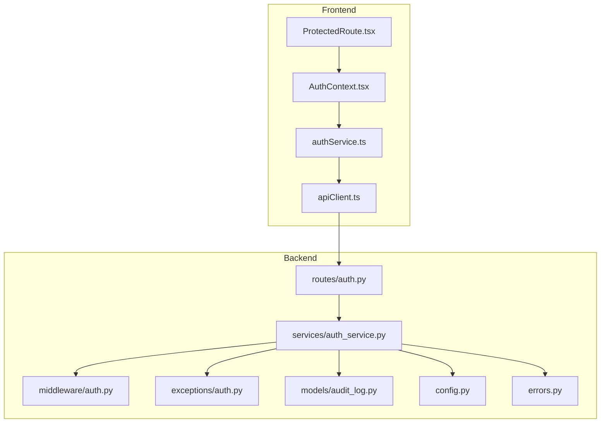
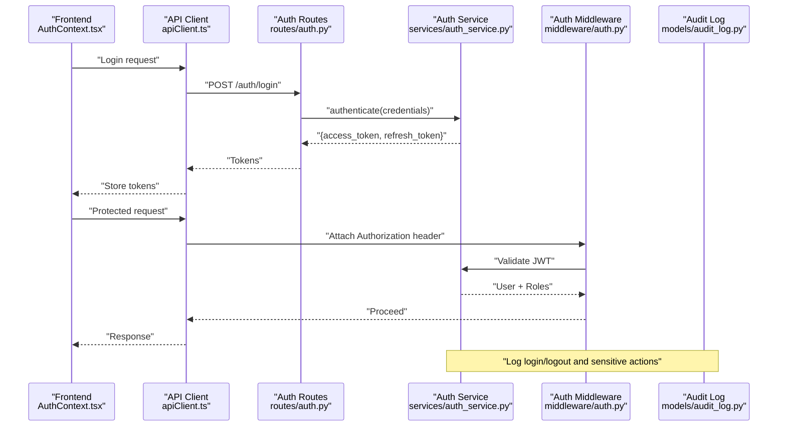
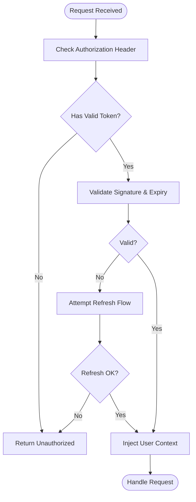
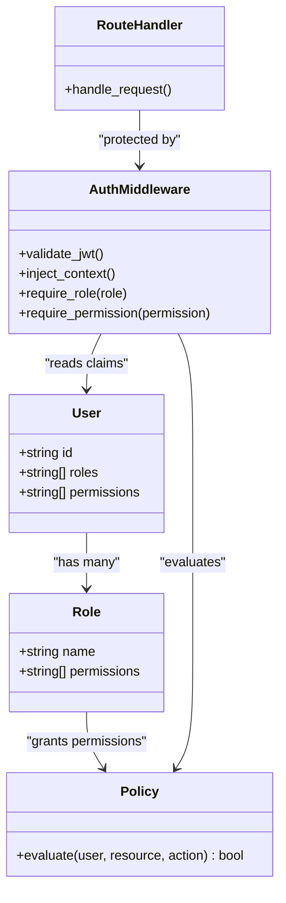
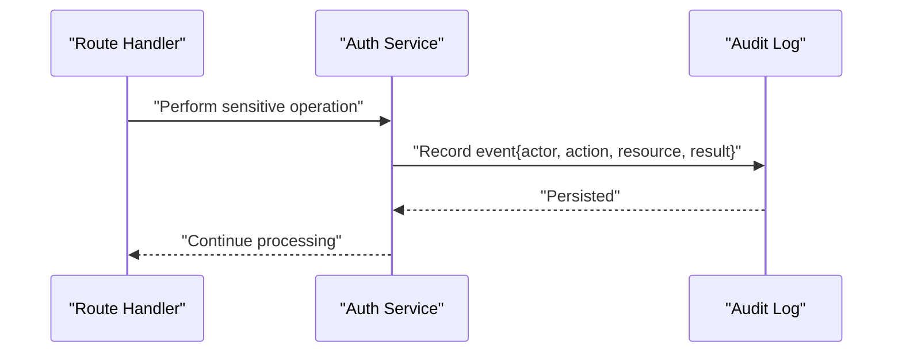
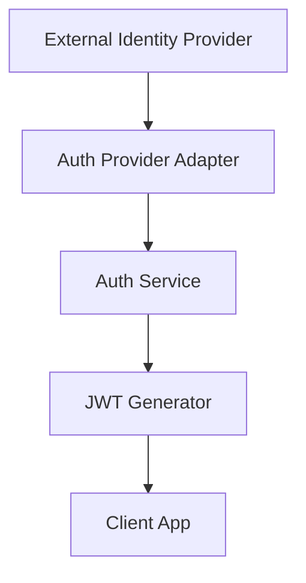
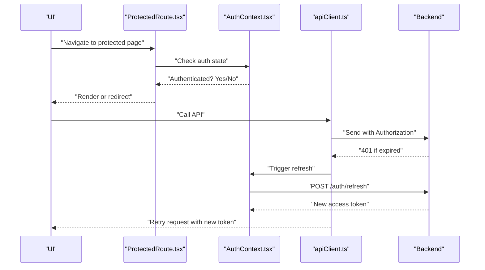
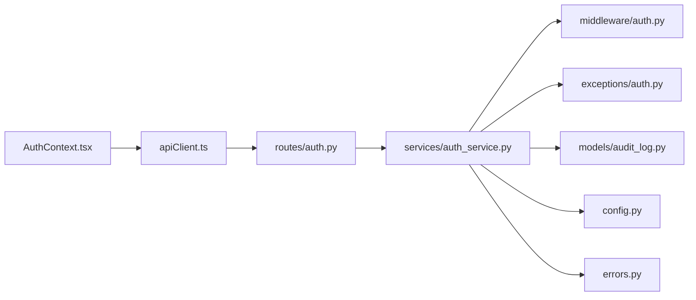

# Security & Authentication

<cite>
**Referenced Files in This Document**
- [auth.py](file://backend/app/middleware/auth.py)
- [auth.py](file://backend/app/routes/auth.py)
- [auth_service.py](file://backend/app/services/auth_service.py)
- [auth.py](file://backend/app/exceptions/auth.py)
- [audit_log.py](file://backend/app/models/audit_log.py)
- [config.py](file://backend/app/config.py)
- [errors.py](file://backend/app/errors.py)
- [ProtectedRoute.tsx](file://frontend/src/components/routing/ProtectedRoute.tsx)
- [AuthContext.tsx](file://frontend/src/context/AuthContext.tsx)
- [authService.ts](file://frontend/src/services/authService.ts)
- [apiClient.ts](file://frontend/src/services/apiClient.ts)
</cite>

## Table of Contents
1. [Introduction](#introduction)
2. [Project Structure](#project-structure)
3. [Core Components](#core-components)
4. [Architecture Overview](#architecture-overview)
5. [Detailed Component Analysis](#detailed-component-analysis)
6. [Dependency Analysis](#dependency-analysis)
7. [Performance Considerations](#performance-considerations)
8. [Troubleshooting Guide](#troubleshooting-guide)
9. [Conclusion](#conclusion)
10. [Appendices](#appendices)

## Introduction
This document explains the security and authentication design in CloudBridge with a focus on user access control and data protection. It covers:
- JWT-based authentication, token lifecycle, refresh mechanisms, and session management
- Role-based access control (RBAC), including permission models, authorization policies, and resource-level security
- Audit trail functionality for action logging, compliance reporting, and forensic analysis
- Practical guidance for implementing custom authentication providers, defining access policies, and integrating with external identity systems
- Security best practices, vulnerability mitigation, and compliance considerations

The goal is to provide both high-level architectural understanding and actionable implementation details for developers and operators.

## Project Structure
Security-related code spans backend middleware, routes, services, exceptions, models, configuration, and frontend context/routing/services. The following diagram maps key files involved in authentication and authorization flows.

**Diagram sources**
- [ProtectedRoute.tsx](file://frontend/src/components/routing/ProtectedRoute.tsx)
- [AuthContext.tsx](file://frontend/src/context/AuthContext.tsx)
- [authService.ts](file://frontend/src/services/authService.ts)
- [apiClient.ts](file://frontend/src/services/apiClient.ts)
- [auth.py](file://backend/app/middleware/auth.py)
- [auth.py](file://backend/app/routes/auth.py)
- [auth_service.py](file://backend/app/services/auth_service.py)
- [auth.py](file://backend/app/exceptions/auth.py)
- [audit_log.py](file://backend/app/models/audit_log.py)
- [config.py](file://backend/app/config.py)
- [errors.py](file://backend/app/errors.py)

**Section sources**
- [auth.py](file://backend/app/middleware/auth.py)
- [auth.py](file://backend/app/routes/auth.py)
- [auth_service.py](file://backend/app/services/auth_service.py)
- [auth.py](file://backend/app/exceptions/auth.py)
- [audit_log.py](file://backend/app/models/audit_log.py)
- [config.py](file://backend/app/config.py)
- [errors.py](file://backend/app/errors.py)
- [ProtectedRoute.tsx](file://frontend/src/components/routing/ProtectedRoute.tsx)
- [AuthContext.tsx](file://frontend/src/context/AuthContext.tsx)
- [authService.ts](file://frontend/src/services/authService.ts)
- [apiClient.ts](file://frontend/src/services/apiClient.ts)

## Core Components
- Authentication Middleware: Validates JWTs on protected endpoints, enforces presence and signature verification, and injects authenticated context into request handlers.
- Auth Routes: Expose login, logout, token refresh, and profile endpoints; orchestrate credential validation and token issuance.
- Auth Service: Centralizes business logic for authentication, token generation/validation, role resolution, and audit logging.
- Exceptions: Standardized error responses for auth failures (invalid credentials, expired tokens, insufficient permissions).
- Audit Log Model: Persistent storage for security-relevant events (login, logout, policy decisions, sensitive operations).
- Configuration: Secure settings for JWT secrets, token lifetimes, refresh behavior, and feature flags.
- Frontend Auth Context and Services: Manage client-side token storage, automatic refresh, and attaching tokens to API requests.

Key responsibilities:
- Token lifecycle: issue, validate, refresh, revoke
- RBAC: roles, permissions, policy evaluation
- Auditability: record and query security events
- Error handling: consistent, safe error messages

**Section sources**
- [auth.py](file://backend/app/middleware/auth.py)
- [auth.py](file://backend/app/routes/auth.py)
- [auth_service.py](file://backend/app/services/auth_service.py)
- [auth.py](file://backend/app/exceptions/auth.py)
- [audit_log.py](file://backend/app/models/audit_log.py)
- [config.py](file://backend/app/config.py)
- [errors.py](file://backend/app/errors.py)
- [ProtectedRoute.tsx](file://frontend/src/components/routing/ProtectedRoute.tsx)
- [AuthContext.tsx](file://frontend/src/context/AuthContext.tsx)
- [authService.ts](file://frontend/src/services/authService.ts)
- [apiClient.ts](file://frontend/src/services/apiClient.ts)

## Architecture Overview
The system uses stateless JWTs for authentication with optional refresh tokens for seamless sessions. Authorization is enforced via RBAC at route/service boundaries. All critical actions are audited.

**Diagram sources**
- [authService.ts](file://frontend/src/services/authService.ts)
- [apiClient.ts](file://frontend/src/services/apiClient.ts)
- [auth.py](file://backend/app/routes/auth.py)
- [auth_service.py](file://backend/app/services/auth_service.py)
- [auth.py](file://backend/app/middleware/auth.py)
- [audit_log.py](file://backend/app/models/audit_log.py)

## Detailed Component Analysis

### JWT-Based Authentication and Session Management
- Token types:
  - Access token: short-lived, used for API calls
  - Refresh token: longer-lived, used to obtain new access tokens without re-authentication
- Issuance flow:
  - Credentials validated by service layer
  - Tokens generated with appropriate claims (user id, roles, scopes)
  - Optional refresh token persisted or stored securely per deployment strategy
- Validation flow:
  - Middleware intercepts protected requests
  - Signature and expiration verified
  - Claims decoded and attached to request context
- Refresh mechanism:
  - Dedicated endpoint to exchange refresh token for new access token
  - Rotation and revocation supported by invalidating prior refresh tokens if needed
- Session management:
  - Stateless server-side model using JWTs
  - Optional blacklist/revocation store for revoked tokens
  - Frontend stores tokens securely and auto-refreshes before expiry

**Diagram sources**
- [auth.py](file://backend/app/middleware/auth.py)
- [auth_service.py](file://backend/app/services/auth_service.py)
- [auth.py](file://backend/app/routes/auth.py)

**Section sources**
- [auth.py](file://backend/app/middleware/auth.py)
- [auth_service.py](file://backend/app/services/auth_service.py)
- [auth.py](file://backend/app/routes/auth.py)
- [auth.py](file://backend/app/exceptions/auth.py)
- [config.py](file://backend/app/config.py)
- [errors.py](file://backend/app/errors.py)
- [AuthContext.tsx](file://frontend/src/context/AuthContext.tsx)
- [authService.ts](file://frontend/src/services/authService.ts)
- [apiClient.ts](file://frontend/src/services/apiClient.ts)

### Role-Based Access Control (RBAC)
- Permission model:
  - Roles define sets of permissions
  - Permissions map to resources and actions (e.g., migration:create, aws_connection:read)
- Policy enforcement:
  - Route decorators or service-layer checks enforce required roles/permissions
  - Resource-level checks can be implemented by comparing resource ownership or attributes against user roles
- Authorization flow:
  - After JWT validation, middleware extracts roles
  - Handlers assert required permissions before executing business logic
  - Deny-by-default posture ensures only explicitly allowed actions proceed

**Diagram sources**
- [auth.py](file://backend/app/middleware/auth.py)
- [auth_service.py](file://backend/app/services/auth_service.py)

**Section sources**
- [auth.py](file://backend/app/middleware/auth.py)
- [auth_service.py](file://backend/app/services/auth_service.py)

### Audit Trail and Compliance Reporting
- Event capture:
  - Login/logout attempts, token refresh, authorization decisions, and sensitive operations are recorded
- Data model:
  - Audit log entries include actor identity, timestamp, action, resource, outcome, and metadata
- Querying and reporting:
  - Structured logs enable compliance reports and forensic analysis
  - Retention and immutability policies should be enforced at storage level

**Diagram sources**
- [audit_log.py](file://backend/app/models/audit_log.py)
- [auth_service.py](file://backend/app/services/auth_service.py)

**Section sources**
- [audit_log.py](file://backend/app/models/audit_log.py)
- [auth_service.py](file://backend/app/services/auth_service.py)

### Custom Authentication Providers and External Identity Integration
- Provider abstraction:
  - Implement a provider interface that validates external credentials and returns normalized user info and roles
- Integration points:
  - Replace or extend the default credential validator in the auth service
  - Map external groups/roles to internal roles and permissions
- Token issuance:
  - Use provider-supplied identity to generate JWTs with appropriate claims
- SSO/OIDC:
  - Integrate with OIDC providers by exchanging authorization codes and validating ID tokens
  - Store minimal session state on the server while relying on JWTs for statelessness

[No sources needed since this diagram shows conceptual workflow, not actual code structure]

### Frontend Authentication and Protected Routing
- Token storage:
  - Securely store access and refresh tokens (prefer httpOnly cookies when possible)
- Auto-refresh:
  - Intercept responses indicating token expiry and retry after refresh
- Protected routes:
  - Guard routes based on authentication state and required roles/permissions
- API client:
  - Attach Authorization headers automatically and handle errors consistently

**Diagram sources**
- [ProtectedRoute.tsx](file://frontend/src/components/routing/ProtectedRoute.tsx)
- [AuthContext.tsx](file://frontend/src/context/AuthContext.tsx)
- [apiClient.ts](file://frontend/src/services/apiClient.ts)
- [authService.ts](file://frontend/src/services/authService.ts)
- [auth.py](file://backend/app/routes/auth.py)

**Section sources**
- [ProtectedRoute.tsx](file://frontend/src/components/routing/ProtectedRoute.tsx)
- [AuthContext.tsx](file://frontend/src/context/AuthContext.tsx)
- [authService.ts](file://frontend/src/services/authService.ts)
- [apiClient.ts](file://frontend/src/services/apiClient.ts)

## Dependency Analysis
The following diagram highlights dependencies among core security components.

**Diagram sources**
- [auth.py](file://backend/app/routes/auth.py)
- [auth_service.py](file://backend/app/services/auth_service.py)
- [auth.py](file://backend/app/middleware/auth.py)
- [auth.py](file://backend/app/exceptions/auth.py)
- [audit_log.py](file://backend/app/models/audit_log.py)
- [config.py](file://backend/app/config.py)
- [errors.py](file://backend/app/errors.py)
- [AuthContext.tsx](file://frontend/src/context/AuthContext.tsx)
- [apiClient.ts](file://frontend/src/services/apiClient.ts)

**Section sources**
- [auth.py](file://backend/app/routes/auth.py)
- [auth_service.py](file://backend/app/services/auth_service.py)
- [auth.py](file://backend/app/middleware/auth.py)
- [auth.py](file://backend/app/exceptions/auth.py)
- [audit_log.py](file://backend/app/models/audit_log.py)
- [config.py](file://backend/app/config.py)
- [errors.py](file://backend/app/errors.py)
- [AuthContext.tsx](file://frontend/src/context/AuthContext.tsx)
- [apiClient.ts](file://frontend/src/services/apiClient.ts)

## Performance Considerations
- Keep JWT payloads small to reduce overhead
- Use efficient cryptographic algorithms and rotate keys periodically
- Cache role/permission lookups where appropriate
- Avoid synchronous I/O in hot paths; offload audit writes to background workers if necessary
- Implement rate limiting on authentication endpoints to mitigate brute-force attacks

[No sources needed since this section provides general guidance]

## Troubleshooting Guide
Common issues and resolutions:
- Invalid or expired tokens:
  - Ensure refresh flow is invoked on 401 responses
  - Verify clock skew tolerance and token lifetime settings
- Missing Authorization header:
  - Confirm API client attaches tokens to all requests
- Insufficient permissions:
  - Review role assignments and policy definitions
- Audit gaps:
  - Verify audit logging is enabled and persistent storage is healthy

Operational tips:
- Enable detailed but safe logging for auth flows
- Monitor token refresh success rates and latency
- Set up alerts for repeated authentication failures

**Section sources**
- [auth.py](file://backend/app/middleware/auth.py)
- [auth.py](file://backend/app/routes/auth.py)
- [auth_service.py](file://backend/app/services/auth_service.py)
- [auth.py](file://backend/app/exceptions/auth.py)
- [audit_log.py](file://backend/app/models/audit_log.py)
- [config.py](file://backend/app/config.py)
- [errors.py](file://backend/app/errors.py)
- [apiClient.ts](file://frontend/src/services/apiClient.ts)

## Conclusion
CloudBridge’s security model centers on stateless JWTs, robust RBAC, and comprehensive auditing. By enforcing least privilege, maintaining secure token lifecycles, and recording actionable audit trails, the system supports strong access control and compliance requirements. Extensibility points allow integration with external identity providers and customization of authorization policies.

[No sources needed since this section summarizes without analyzing specific files]

## Appendices

### Security Best Practices
- Enforce HTTPS everywhere and use secure cookie flags when storing tokens
- Rotate signing keys regularly and support multiple active keys during transitions
- Apply deny-by-default policies and explicit allowlists for sensitive operations
- Implement account lockout and anomaly detection for suspicious activity
- Regularly review and prune unused roles and permissions

### Compliance Requirements
- Maintain immutable audit logs with tamper-evident storage
- Provide exportable reports for access reviews and incident investigations
- Support data retention policies aligned with regulatory obligations
- Ensure PII minimization in logs and tokens

[No sources needed since this section provides general guidance]