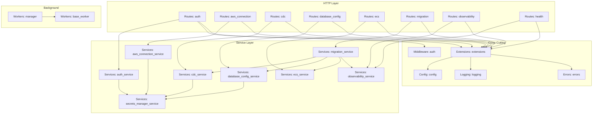
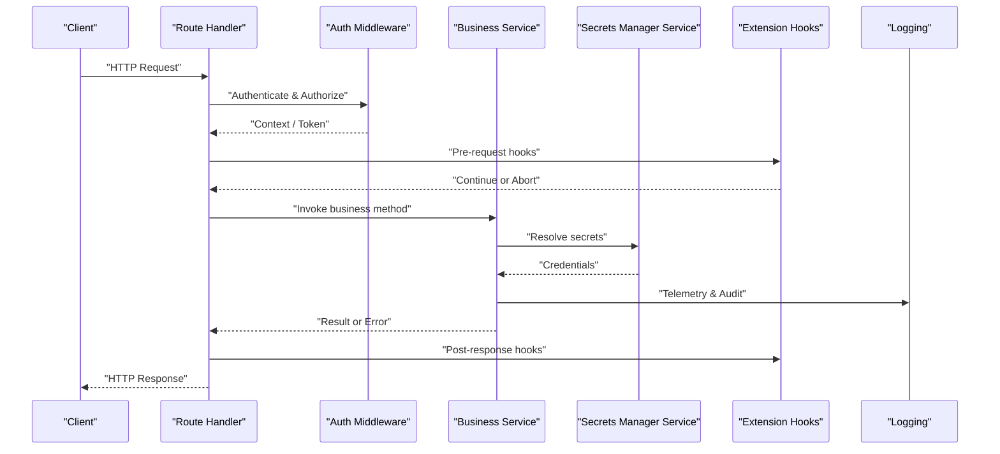
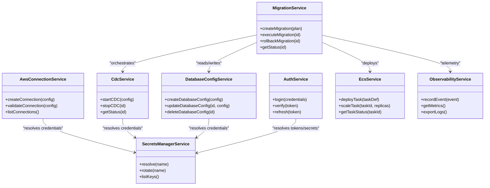
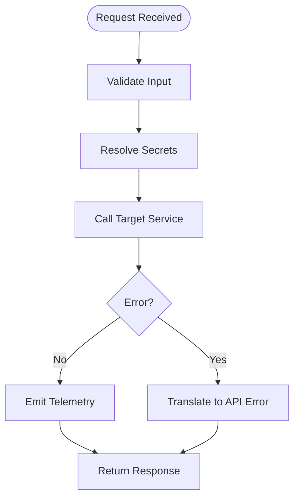
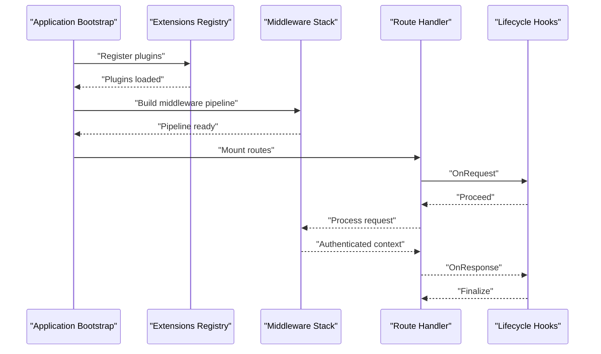
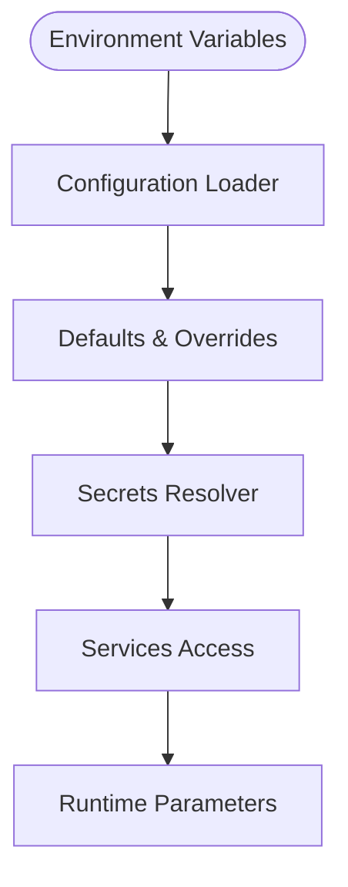
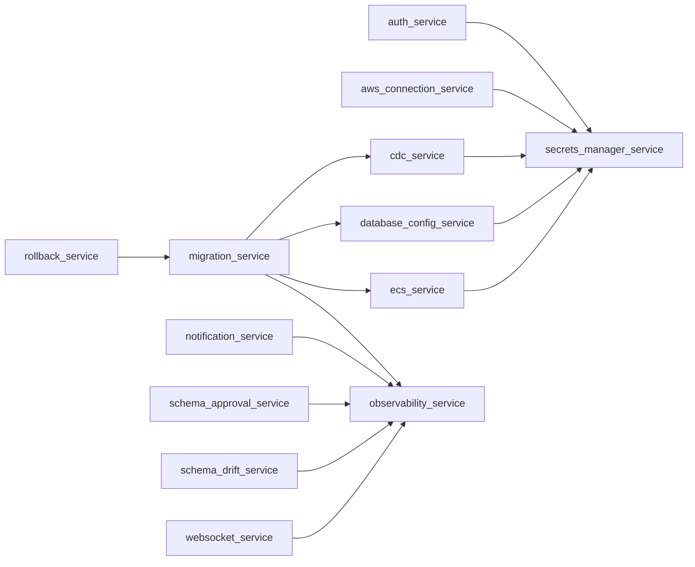

# Service Layer Architecture

<cite>
**Referenced Files in This Document**
- [run.py](file://backend/run.py)
- [config.py](file://backend/app/config.py)
- [extensions.py](file://backend/app/extensions.py)
- [auth_service.py](file://backend/app/services/auth_service.py)
- [aws_connection_service.py](file://backend/app/services/aws_connection_service.py)
- [cdc_service.py](file://backend/app/services/cdc_service.py)
- [database_config_service.py](file://backend/app/services/database_config_service.py)
- [ecs_service.py](file://backend/app/services/ecs_service.py)
- [migration_service.py](file://backend/app/services/migration_service.py)
- [notification_service.py](file://backend/app/services/notification_service.py)
- [observability_service.py](file://backend/app/services/observability_service.py)
- [preflight_service.py](file://backend/app/services/preflight_service.py)
- [rollback_service.py](file://backend/app/services/rollback_service.py)
- [schema_approval_service.py](file://backend/app/services/schema_approval_service.py)
- [schema_drift_service.py](file://backend/app/services/schema_drift_service.py)
- [secrets_manager_service.py](file://backend/app/services/secrets_manager_service.py)
- [websocket_service.py](file://backend/app/services/websocket_service.py)
- [auth.py](file://backend/app/routes/auth.py)
- [aws_connection.py](file://backend/app/routes/aws_connection.py)
- [cdc.py](file://backend/app/routes/cdc.py)
- [database_config.py](file://backend/app/routes/database_config.py)
- [ecs.py](file://backend/app/routes/ecs.py)
- [health.py](file://backend/app/routes/health.py)
- [migration.py](file://backend/app/routes/migration.py)
- [notification.py](file://backend/app/routes/notification.py)
- [observability.py](file://backend/app/routes/observability.py)
- [preflight.py](file://backend/app/routes/preflight.py)
- [rollback.py](file://backend/app/routes/rollback.py)
- [schema_approval.py](file://backend/app/routes/schema_approval.py)
- [schema_drift.py](file://backend/app/routes/schema_drift.py)
- [websocket.py](file://backend/app/routes/websocket.py)
- [auth.py](file://backend/app/middleware/auth.py)
- [errors.py](file://backend/app/errors.py)
- [logging.py](file://backend/app/logging.py)
- [base_worker.py](file://backend/app/workers/base_worker.py)
- [manager.py](file://backend/app/workers/manager.py)
</cite>

## Table of Contents
1. [Introduction](#introduction)
2. [Project Structure](#project-structure)
3. [Core Components](#core-components)
4. [Architecture Overview](#architecture-overview)
5. [Detailed Component Analysis](#detailed-component-analysis)
6. [Dependency Analysis](#dependency-analysis)
7. [Performance Considerations](#performance-considerations)
8. [Troubleshooting Guide](#troubleshooting-guide)
9. [Conclusion](#conclusion)
10. [Appendices](#appendices)

## Introduction
This document explains the service layer architecture in CloudBridge with a focus on component design patterns and inter-service communication. It covers:
- Service layer pattern implementation, including dependency injection, interface contracts, and modular organization
- Extension system covering plugin architecture, middleware stack, and cross-cutting concerns
- Configuration management for environment-specific settings, secrets handling, and runtime parameterization
- Practical examples for creating new services, implementing extensions, and configuring application behavior
- Architectural decisions, scalability patterns, and maintenance considerations

The goal is to provide both high-level architectural guidance and code-level insights to help developers extend and maintain the service layer effectively.

## Project Structure
CloudBridge organizes its backend around clear layers:
- Routes handle HTTP requests and delegate to services
- Services encapsulate business logic and orchestrate domain operations
- Workers perform background tasks (e.g., CDC processing)
- Middleware provides cross-cutting functionality such as authentication
- Extensions register plugins and lifecycle hooks
- Configuration centralizes environment-specific settings and secrets access
- Errors and logging standardize observability and error responses

**Diagram sources**
- [run.py:1-200](file://backend/run.py#L1-L200)
- [extensions.py:1-200](file://backend/app/extensions.py#L1-L200)
- [config.py:1-200](file://backend/app/config.py#L1-L200)
- [auth.py:1-200](file://backend/app/middleware/auth.py#L1-L200)
- [errors.py:1-200](file://backend/app/errors.py#L1-L200)
- [logging.py:1-200](file://backend/app/logging.py#L1-L200)
- [base_worker.py:1-200](file://backend/app/workers/base_worker.py#L1-L200)
- [manager.py:1-200](file://backend/app/workers/manager.py#L1-L200)

**Section sources**
- [run.py:1-200](file://backend/run.py#L1-L200)
- [extensions.py:1-200](file://backend/app/extensions.py#L1-L200)
- [config.py:1-200](file://backend/app/config.py#L1-L200)

## Core Components
- Service modules implement domain-specific logic and coordinate external systems (AWS, databases, notifications). They are organized per feature area and communicate via well-defined interfaces.
- Route modules expose REST endpoints and validate inputs using Pydantic schemas before delegating to services.
- Middleware enforces cross-cutting concerns like authentication and request/response transformations.
- Extensions provide a plugin mechanism for registering additional routes, services, or lifecycle hooks.
- Configuration centralizes environment variables, defaults, and secrets access.
- Workers manage long-running background jobs and integrate with the service layer through queues or direct calls.

Key responsibilities:
- Services: Business logic, orchestration, error translation, retries, and telemetry
- Routes: Request validation, response formatting, and delegation to services
- Middleware: Authentication, authorization, metrics, tracing
- Extensions: Plugin registration, lifecycle hooks, and feature toggles
- Config: Environment-specific settings, secrets resolution, and runtime overrides
- Workers: Background task execution, scheduling, and monitoring

**Section sources**
- [auth_service.py:1-200](file://backend/app/services/auth_service.py#L1-L200)
- [aws_connection_service.py:1-200](file://backend/app/services/aws_connection_service.py#L1-L200)
- [cdc_service.py:1-200](file://backend/app/services/cdc_service.py#L1-L200)
- [database_config_service.py:1-200](file://backend/app/services/database_config_service.py#L1-L200)
- [ecs_service.py:1-200](file://backend/app/services/ecs_service.py#L1-L200)
- [migration_service.py:1-200](file://backend/app/services/migration_service.py#L1-L200)
- [notification_service.py:1-200](file://backend/app/services/notification_service.py#L1-L200)
- [observability_service.py:1-200](file://backend/app/services/observability_service.py#L1-L200)
- [secrets_manager_service.py:1-200](file://backend/app/services/secrets_manager_service.py#L1-L200)
- [auth.py:1-200](file://backend/app/middleware/auth.py#L1-L200)
- [extensions.py:1-200](file://backend/app/extensions.py#L1-L200)
- [config.py:1-200](file://backend/app/config.py#L1-L200)

## Architecture Overview
The service layer follows a layered architecture with clear separation between HTTP routes, business logic, and infrastructure interactions. Dependency injection is used to wire services and configuration at startup. The extension system allows pluggable features and middleware stacks.

**Diagram sources**
- [auth.py:1-200](file://backend/app/middleware/auth.py#L1-L200)
- [extensions.py:1-200](file://backend/app/extensions.py#L1-L200)
- [secrets_manager_service.py:1-200](file://backend/app/services/secrets_manager_service.py#L1-L200)
- [logging.py:1-200](file://backend/app/logging.py#L1-L200)

## Detailed Component Analysis

### Service Layer Pattern and Dependency Injection
- Each service module encapsulates a cohesive set of operations for a domain area (e.g., migrations, CDC, ECS).
- Services depend on shared utilities such as secrets management, observability, and AWS clients.
- Dependency injection is performed at application startup by wiring services into the DI container and exposing them to routes and workers.

**Diagram sources**
- [auth_service.py:1-200](file://backend/app/services/auth_service.py#L1-L200)
- [aws_connection_service.py:1-200](file://backend/app/services/aws_connection_service.py#L1-L200)
- [cdc_service.py:1-200](file://backend/app/services/cdc_service.py#L1-L200)
- [database_config_service.py:1-200](file://backend/app/services/database_config_service.py#L1-L200)
- [ecs_service.py:1-200](file://backend/app/services/ecs_service.py#L1-L200)
- [migration_service.py:1-200](file://backend/app/services/migration_service.py#L1-L200)
- [observability_service.py:1-200](file://backend/app/services/observability_service.py#L1-L200)
- [secrets_manager_service.py:1-200](file://backend/app/services/secrets_manager_service.py#L1-L200)

**Section sources**
- [auth_service.py:1-200](file://backend/app/services/auth_service.py#L1-L200)
- [aws_connection_service.py:1-200](file://backend/app/services/aws_connection_service.py#L1-L200)
- [cdc_service.py:1-200](file://backend/app/services/cdc_service.py#L1-L200)
- [database_config_service.py:1-200](file://backend/app/services/database_config_service.py#L1-L200)
- [ecs_service.py:1-200](file://backend/app/services/ecs_service.py#L1-L200)
- [migration_service.py:1-200](file://backend/app/services/migration_service.py#L1-L200)
- [observability_service.py:1-200](file://backend/app/services/observability_service.py#L1-L200)
- [secrets_manager_service.py:1-200](file://backend/app/services/secrets_manager_service.py#L1-L200)

### Inter-Service Communication Patterns
- Synchronous calls: Services invoke other services directly for short-lived operations (e.g., migration orchestrator calling ECS and database config services).
- Asynchronous events: Long-running processes (e.g., CDC) use background workers and publish status updates via observability and notification services.
- Shared state: Configuration and secrets are centralized; services resolve values at runtime rather than hardcoding.

**Diagram sources**
- [migration_service.py:1-200](file://backend/app/services/migration_service.py#L1-L200)
- [cdc_service.py:1-200](file://backend/app/services/cdc_service.py#L1-L200)
- [secrets_manager_service.py:1-200](file://backend/app/services/secrets_manager_service.py#L1-L200)
- [observability_service.py:1-200](file://backend/app/services/observability_service.py#L1-L200)

**Section sources**
- [migration_service.py:1-200](file://backend/app/services/migration_service.py#L1-L200)
- [cdc_service.py:1-200](file://backend/app/services/cdc_service.py#L1-L200)
- [secrets_manager_service.py:1-200](file://backend/app/services/secrets_manager_service.py#L1-L200)
- [observability_service.py:1-200](file://backend/app/services/observability_service.py#L1-L200)

### Extension System: Plugin Architecture and Middleware Stack
- Extensions register routes, services, and lifecycle hooks during application bootstrap.
- Middleware stack applies authentication, authorization, metrics, and tracing across all routes.
- Cross-cutting concerns are implemented as reusable components that can be enabled/disabled via configuration.

**Diagram sources**
- [extensions.py:1-200](file://backend/app/extensions.py#L1-L200)
- [auth.py:1-200](file://backend/app/middleware/auth.py#L1-L200)
- [run.py:1-200](file://backend/run.py#L1-L200)

**Section sources**
- [extensions.py:1-200](file://backend/app/extensions.py#L1-L200)
- [auth.py:1-200](file://backend/app/middleware/auth.py#L1-L200)
- [run.py:1-200](file://backend/run.py#L1-L200)

### Configuration Management: Environment-Specific Settings, Secrets, and Runtime Parameters
- Centralized configuration loads environment variables and provides typed accessors.
- Secrets are resolved through a dedicated service, enabling rotation and secure storage.
- Runtime parameters allow overriding defaults without redeploying.

**Diagram sources**
- [config.py:1-200](file://backend/app/config.py#L1-L200)
- [secrets_manager_service.py:1-200](file://backend/app/services/secrets_manager_service.py#L1-L200)

**Section sources**
- [config.py:1-200](file://backend/app/config.py#L1-L200)
- [secrets_manager_service.py:1-200](file://backend/app/services/secrets_manager_service.py#L1-L200)

### Practical Examples

#### Creating a New Service
- Define a service module under services with methods representing domain operations.
- Use the secrets manager for credentials and observability for telemetry.
- Register the service in the dependency injection container and expose it via routes.

Steps:
1. Implement service methods with clear input/output contracts.
2. Integrate with secrets and observability.
3. Add route handlers that validate inputs and call the service.
4. Wire the service into the DI container and ensure tests cover happy paths and error cases.

**Section sources**
- [auth_service.py:1-200](file://backend/app/services/auth_service.py#L1-L200)
- [aws_connection_service.py:1-200](file://backend/app/services/aws_connection_service.py#L1-L200)
- [database_config_service.py:1-200](file://backend/app/services/database_config_service.py#L1-L200)
- [auth.py:1-200](file://backend/app/routes/auth.py#L1-L200)
- [aws_connection.py:1-200](file://backend/app/routes/aws_connection.py#L1-L200)
- [database_config.py:1-200](file://backend/app/routes/database_config.py#L1-L200)

#### Implementing an Extension
- Create an extension module that registers routes, services, and lifecycle hooks.
- Enable/disable the extension via configuration flags.
- Ensure the extension integrates with the middleware stack and observability.

Steps:
1. Define extension registration functions.
2. Mount routes and inject dependencies.
3. Add pre/post request hooks for cross-cutting concerns.
4. Provide configuration keys to toggle features.

**Section sources**
- [extensions.py:1-200](file://backend/app/extensions.py#L1-L200)
- [auth.py:1-200](file://backend/app/middleware/auth.py#L1-L200)
- [config.py:1-200](file://backend/app/config.py#L1-L200)

#### Configuring Application Behavior
- Set environment variables for different deployment targets (dev, staging, prod).
- Configure secrets names and rotation policies.
- Override runtime parameters for feature flags and performance tuning.

Steps:
1. Define configuration keys and defaults.
2. Load environment-specific overrides.
3. Resolve secrets at runtime.
4. Expose configuration to services and extensions.

**Section sources**
- [config.py:1-200](file://backend/app/config.py#L1-L200)
- [secrets_manager_service.py:1-200](file://backend/app/services/secrets_manager_service.py#L1-L200)

## Dependency Analysis
The following diagram shows key dependencies among services and supporting components.

**Diagram sources**
- [auth_service.py:1-200](file://backend/app/services/auth_service.py#L1-L200)
- [aws_connection_service.py:1-200](file://backend/app/services/aws_connection_service.py#L1-L200)
- [cdc_service.py:1-200](file://backend/app/services/cdc_service.py#L1-L200)
- [database_config_service.py:1-200](file://backend/app/services/database_config_service.py#L1-L200)
- [ecs_service.py:1-200](file://backend/app/services/ecs_service.py#L1-L200)
- [migration_service.py:1-200](file://backend/app/services/migration_service.py#L1-L200)
- [notification_service.py:1-200](file://backend/app/services/notification_service.py#L1-L200)
- [observability_service.py:1-200](file://backend/app/services/observability_service.py#L1-L200)
- [schema_approval_service.py:1-200](file://backend/app/services/schema_approval_service.py#L1-L200)
- [schema_drift_service.py:1-200](file://backend/app/services/schema_drift_service.py#L1-L200)
- [rollback_service.py:1-200](file://backend/app/services/rollback_service.py#L1-L200)
- [websocket_service.py:1-200](file://backend/app/services/websocket_service.py#L1-L200)
- [secrets_manager_service.py:1-200](file://backend/app/services/secrets_manager_service.py#L1-L200)

**Section sources**
- [auth_service.py:1-200](file://backend/app/services/auth_service.py#L1-L200)
- [migration_service.py:1-200](file://backend/app/services/migration_service.py#L1-L200)
- [observability_service.py:1-200](file://backend/app/services/observability_service.py#L1-L200)
- [secrets_manager_service.py:1-200](file://backend/app/services/secrets_manager_service.py#L1-L200)

## Performance Considerations
- Prefer asynchronous processing for long-running tasks (e.g., migrations, CDC) using workers to keep HTTP responses fast.
- Cache frequently accessed configuration and secrets where safe to do so.
- Use connection pooling for external systems (AWS SDK, databases) and configure timeouts appropriately.
- Instrument services with metrics and traces to identify bottlenecks.
- Scale horizontally by running multiple service instances behind a load balancer and ensuring stateless design.

[No sources needed since this section provides general guidance]

## Troubleshooting Guide
Common issues and strategies:
- Authentication failures: Verify middleware configuration, token validation, and secret rotation.
- Secret resolution errors: Check secrets provider connectivity and permissions.
- Migration failures: Inspect orchestration logs, rollback outcomes, and dependent service statuses.
- Observability gaps: Ensure telemetry emission points are active and destinations are reachable.

Operational checks:
- Health endpoint readiness and liveness probes
- Worker queue depth and job completion rates
- Error rate and latency percentiles from observability dashboards

**Section sources**
- [auth.py:1-200](file://backend/app/middleware/auth.py#L1-L200)
- [secrets_manager_service.py:1-200](file://backend/app/services/secrets_manager_service.py#L1-L200)
- [migration_service.py:1-200](file://backend/app/services/migration_service.py#L1-L200)
- [observability_service.py:1-200](file://backend/app/services/observability_service.py#L1-L200)
- [errors.py:1-200](file://backend/app/errors.py#L1-L200)
- [logging.py:1-200](file://backend/app/logging.py#L1-L200)

## Conclusion
CloudBridge’s service layer emphasizes modularity, clear contracts, and extensibility. By separating concerns across routes, services, middleware, and extensions, the system remains maintainable and scalable. Centralized configuration and secrets management enable secure, environment-aware deployments. Following the patterns outlined here will help teams add new capabilities consistently and operate reliably at scale.

[No sources needed since this section summarizes without analyzing specific files]

## Appendices

### API Endpoints Overview
- Authentication: login, verify, refresh
- AWS Connections: create, validate, list
- CDC: start, stop, status
- Database Config: CRUD operations
- ECS: deploy, scale, status
- Migrations: create, execute, rollback, status
- Observability: metrics, logs
- Preflight: validations
- Rollback: initiate and track
- Schema Approval: approve/reject
- Schema Drift: detect and report
- WebSocket: real-time updates

**Section sources**
- [auth.py:1-200](file://backend/app/routes/auth.py#L1-L200)
- [aws_connection.py:1-200](file://backend/app/routes/aws_connection.py#L1-L200)
- [cdc.py:1-200](file://backend/app/routes/cdc.py#L1-L200)
- [database_config.py:1-200](file://backend/app/routes/database_config.py#L1-L200)
- [ecs.py:1-200](file://backend/app/routes/ecs.py#L1-L200)
- [migration.py:1-200](file://backend/app/routes/migration.py#L1-L200)
- [observability.py:1-200](file://backend/app/routes/observability.py#L1-L200)
- [preflight.py:1-200](file://backend/app/routes/preflight.py#L1-L200)
- [rollback.py:1-200](file://backend/app/routes/rollback.py#L1-L200)
- [schema_approval.py:1-200](file://backend/app/routes/schema_approval.py#L1-L200)
- [schema_drift.py:1-200](file://backend/app/routes/schema_drift.py#L1-L200)
- [websocket.py:1-200](file://backend/app/routes/websocket.py#L1-L200)

### Background Workers
- Base worker defines common lifecycle and error handling.
- Worker manager coordinates job dispatch and monitoring.
- Specific workers (e.g., CDC) implement domain-specific processing.

**Section sources**
- [base_worker.py:1-200](file://backend/app/workers/base_worker.py#L1-L200)
- [manager.py:1-200](file://backend/app/workers/manager.py#L1-L200)
- [cdc_service.py:1-200](file://backend/app/services/cdc_service.py#L1-L200)