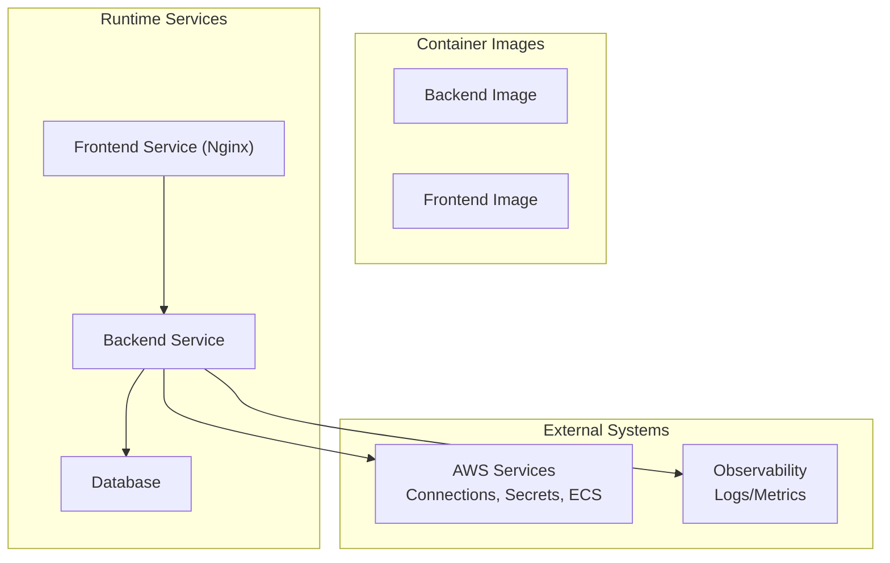
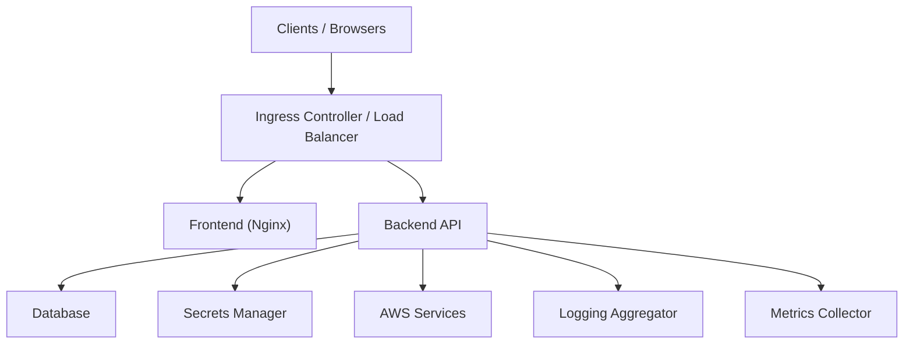
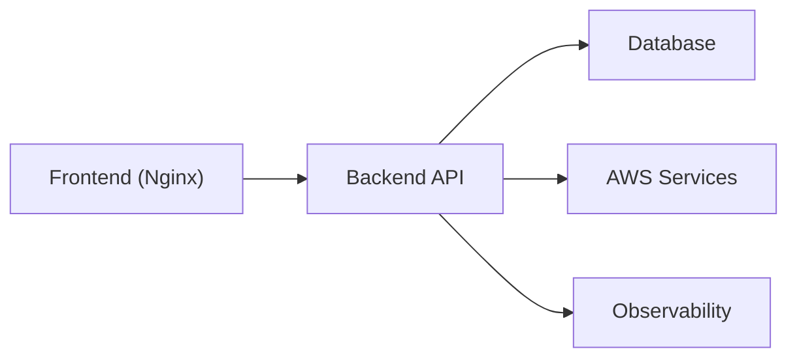

# Deployment Guide

<cite>
**Referenced Files in This Document**
- [docker-compose.yml](file://docker-compose.yml)
- [backend/Dockerfile](file://backend/Dockerfile)
- [frontend/Dockerfile](file://frontend/Dockerfile)
- [backend/run.py](file://backend/run.py)
- [backend/app/config.py](file://backend/app/config.py)
- [backend/app/logging.py](file://backend/app/logging.py)
- [backend/alembic.ini](file://backend/alembic.ini)
- [backend/migrations/env.py](file://backend/migrations/env.py)
- [frontend/nginx.conf](file://frontend/nginx.conf)
- [README.md](file://README.md)
</cite>

## Table of Contents
1. [Introduction](#introduction)
2. [Project Structure](#project-structure)
3. [Core Components](#core-components)
4. [Architecture Overview](#architecture-overview)
5. [Detailed Component Analysis](#detailed-component-analysis)
6. [Dependency Analysis](#dependency-analysis)
7. [Performance Considerations](#performance-considerations)
8. [Troubleshooting Guide](#troubleshooting-guide)
9. [Conclusion](#conclusion)
10. [Appendices](#appendices)

## Introduction
This guide provides comprehensive deployment instructions for CloudBridge across development, staging, and production environments. It covers containerized deployments using Docker and Docker Compose, production strategies including Kubernetes manifests and cloud provider configurations, environment-specific configuration management, secrets handling, database initialization, scaling considerations, resource allocation guidelines, monitoring setup, backup and disaster recovery procedures, logging aggregation, alerting configurations, security hardening, network policies, and compliance requirements for enterprise deployments.

## Project Structure
CloudBridge is a full-stack application with:
- Backend API service (Python/FastAPI)
- Frontend web app (React/Vite) served by Nginx
- Database migrations managed via Alembic
- Containerization artifacts for both services
- A Docker Compose file to orchestrate local development and staging

[No sources needed since this diagram shows conceptual workflow, not actual code structure]

**Section sources**
- [docker-compose.yml](file://docker-compose.yml)
- [backend/Dockerfile](file://backend/Dockerfile)
- [frontend/Dockerfile](file://frontend/Dockerfile)
- [frontend/nginx.conf](file://frontend/nginx.conf)

## Core Components
- Backend API: Provides REST endpoints, background workers, migration engine, CDC, ECS integration, and observability features.
- Frontend SPA: Served statically by Nginx; communicates with the backend API over HTTP/WebSocket.
- Configuration: Environment-driven settings loaded at runtime.
- Logging: Structured logging configured for containers and centralized collection.
- Migrations: Alembic-based schema evolution executed during startup or as a separate job.

Key responsibilities:
- Configuration loading and validation
- Health checks and readiness probes
- Secret resolution from environment or external managers
- Background task execution for long-running operations
- Observability hooks for metrics and logs

**Section sources**
- [backend/run.py](file://backend/run.py)
- [backend/app/config.py](file://backend/app/config.py)
- [backend/app/logging.py](file://backend/app/logging.py)
- [backend/alembic.ini](file://backend/alembic.ini)
- [backend/migrations/env.py](file://backend/migrations/env.py)

## Architecture Overview
The recommended architecture separates concerns into discrete services:
- Frontend: Static assets served by Nginx
- Backend: API server with optional worker processes
- Database: Managed relational database
- External integrations: AWS connections, secrets manager, ECS tasks
- Observability: Centralized logging and metrics

[No sources needed since this diagram shows conceptual workflow, not actual code structure]

## Detailed Component Analysis

### Containerized Development and Staging with Docker Compose
- Use the provided Docker Compose file to run the frontend, backend, and database locally or in staging.
- Ensure required environment variables are set for the backend (database URL, AWS credentials, feature flags).
- The frontend image serves static files through Nginx and proxies API requests to the backend service.

Operational steps:
- Build images and start services using Docker Compose.
- Verify health endpoints for both frontend and backend.
- Run database migrations before starting the backend if required by your workflow.

Configuration tips:
- Use environment files per environment (development, staging).
- Avoid committing secrets; use secret injection mechanisms supported by your platform.

**Section sources**
- [docker-compose.yml](file://docker-compose.yml)
- [backend/Dockerfile](file://backend/Dockerfile)
- [frontend/Dockerfile](file://frontend/Dockerfile)
- [frontend/nginx.conf](file://frontend/nginx.conf)

### Production Deployment Strategies

#### Kubernetes Manifests
Recommended components:
- Deployments for frontend and backend
- Services exposing ports internally
- ConfigMaps for non-sensitive configuration
- Secrets for sensitive values
- PersistentVolumeClaims for database storage
- HorizontalPodAutoscaler for backend based on CPU/memory or custom metrics
- NetworkPolicies to restrict traffic
- Probes (liveness/readiness/startup) for health and readiness
- Ingress controller for TLS termination and routing

Best practices:
- Separate namespaces per environment
- Resource requests and limits for all pods
- Pod disruption budgets for high availability
- Rolling updates with appropriate strategy
- Sidecar containers for log shipping if needed

[No sources needed since this section provides general guidance]

#### Cloud Provider Configurations
- AWS Connections: Configure IAM roles/policies for least privilege access.
- ECS Integration: Define task definitions, service autoscaling, and networking.
- Secrets Management: Use provider-native secret stores (e.g., AWS Secrets Manager) and inject into pods via mounted volumes or environment variables.
- Storage: Use managed databases with automated backups and snapshots.

[No sources needed since this section provides general guidance]

#### Load Balancing Setups
- Use an Ingress controller or cloud load balancer to distribute traffic across backend replicas.
- Enable sticky sessions only if required by application state.
- Configure health checks and connection draining.

[No sources needed since this section provides general guidance]

### Environment-Specific Configuration Management
- Use environment variables and ConfigMaps for configuration.
- Maintain separate configuration sets for dev/stage/prod.
- Validate configuration at startup and fail fast on invalid settings.
- Prefer immutable configuration baked into images where feasible.

**Section sources**
- [backend/app/config.py](file://backend/app/config.py)

### Secrets Handling
- Store secrets in a secure vault or cloud secret store.
- Inject secrets into containers via environment variables or mounted files.
- Rotate secrets without downtime using rolling updates.
- Avoid logging secrets; sanitize logs and mask sensitive fields.

**Section sources**
- [backend/app/config.py](file://backend/app/config.py)

### Database Initialization Procedures
- Apply Alembic migrations before serving requests.
- Use a dedicated init job or sidecar to ensure schema readiness.
- Back up and restore procedures should be tested regularly.

**Section sources**
- [backend/alembic.ini](file://backend/alembic.ini)
- [backend/migrations/env.py](file://backend/migrations/env.py)

### Scaling Considerations
- Scale backend horizontally behind a load balancer.
- Tune worker concurrency based on workload characteristics.
- Monitor CPU, memory, and I/O utilization; adjust resources accordingly.
- Use autoscaling policies based on request latency or queue depth.

[No sources needed since this section provides general guidance]

### Resource Allocation Guidelines
- Set requests and limits for CPU and memory for all containers.
- Start with conservative limits and adjust based on profiling.
- Reserve headroom for spikes and GC pauses.

[No sources needed since this section provides general guidance]

### Monitoring Setup
- Expose health endpoints and readiness probes.
- Emit structured logs and metrics.
- Integrate with centralized logging and metrics collectors.
- Create dashboards and alerts for key SLOs.

**Section sources**
- [backend/app/logging.py](file://backend/app/logging.py)

### Backup and Disaster Recovery
- Schedule regular database backups and retain according to policy.
- Test restore procedures periodically.
- Document RTO/RPO targets and validate them.
- Maintain configuration and secrets backup procedures.

[No sources needed since this section provides general guidance]

### Logging Aggregation and Alerting
- Ship logs to a central aggregator (e.g., ELK, Loki, cloud-native solutions).
- Standardize log formats and include correlation IDs.
- Configure alerts for error rates, latency, and resource exhaustion.

**Section sources**
- [backend/app/logging.py](file://backend/app/logging.py)

### Security Hardening, Network Policies, and Compliance
- Enforce least privilege for service accounts and IAM roles.
- Use read-only root filesystems and drop unnecessary capabilities.
- Implement NetworkPolicies to restrict ingress/egress.
- Scan images for vulnerabilities and enforce supply chain security.
- Align with compliance frameworks (SOC2, ISO27001) and maintain audit trails.

[No sources needed since this section provides general guidance]

## Dependency Analysis
High-level dependencies:
- Frontend depends on Backend API for data and actions.
- Backend depends on Database, AWS services, and optional external systems.
- Observability tools depend on Backend’s logging and metrics outputs.

[No sources needed since this diagram shows conceptual workflow, not actual code structure]

**Section sources**
- [docker-compose.yml](file://docker-compose.yml)
- [backend/Dockerfile](file://backend/Dockerfile)
- [frontend/Dockerfile](file://frontend/Dockerfile)
- [frontend/nginx.conf](file://frontend/nginx.conf)

## Performance Considerations
- Optimize database queries and indexes.
- Use connection pooling and tune pool sizes.
- Cache frequently accessed data where appropriate.
- Profile backend workers and adjust concurrency.
- Monitor and right-size container resources.

[No sources needed since this section provides general guidance]

## Troubleshooting Guide
Common issues and resolutions:
- Startup failures due to missing configuration: verify environment variables and ConfigMaps.
- Migration errors: check database connectivity and permissions; review migration logs.
- Health check failures: inspect liveness/readiness probe paths and endpoint responses.
- High latency: analyze resource utilization and autoscaling policies.
- Secrets not injected: confirm secret store integration and volume mounts.

Useful entry points:
- Application startup script for initialization logic
- Logging configuration for structured output
- Migration environment for schema operations

**Section sources**
- [backend/run.py](file://backend/run.py)
- [backend/app/logging.py](file://backend/app/logging.py)
- [backend/migrations/env.py](file://backend/migrations/env.py)

## Conclusion
CloudBridge supports flexible deployment across environments using containers and orchestration platforms. By following the guidance in this document—covering configuration, secrets, database initialization, scaling, monitoring, backup, logging, alerting, security, and compliance—you can deploy reliably in development, staging, and production while maintaining operational excellence.

## Appendices

### Quick Start Checklist
- Prepare environment-specific configuration and secrets
- Build and test container images
- Deploy to staging using Docker Compose or Kubernetes
- Validate health endpoints and migrations
- Enable logging and metrics
- Configure autoscaling and resource limits
- Perform backup and restore tests
- Review security posture and compliance controls

**Section sources**
- [README.md](file://README.md)
- [docker-compose.yml](file://docker-compose.yml)
- [backend/Dockerfile](file://backend/Dockerfile)
- [frontend/Dockerfile](file://frontend/Dockerfile)
- [frontend/nginx.conf](file://frontend/nginx.conf)
- [backend/app/config.py](file://backend/app/config.py)
- [backend/app/logging.py](file://backend/app/logging.py)
- [backend/alembic.ini](file://backend/alembic.ini)
- [backend/migrations/env.py](file://backend/migrations/env.py)
- [backend/run.py](file://backend/run.py)