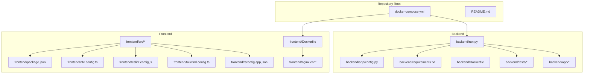
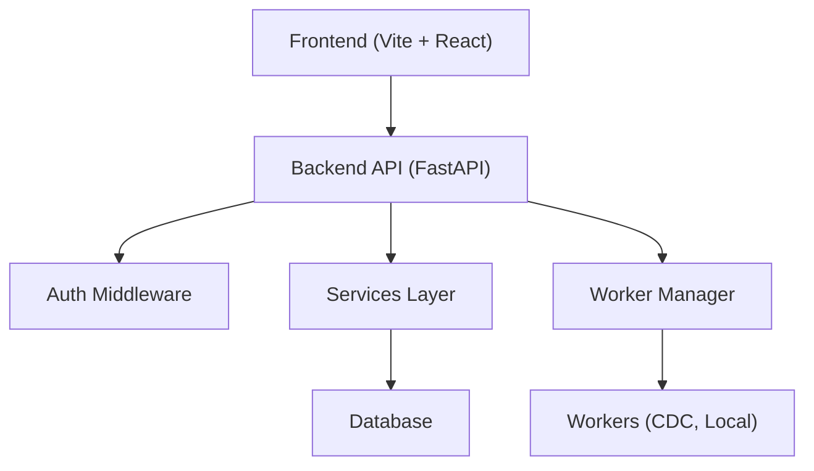
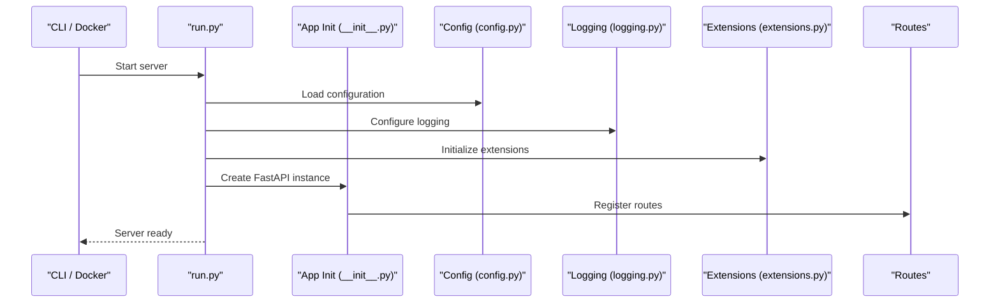
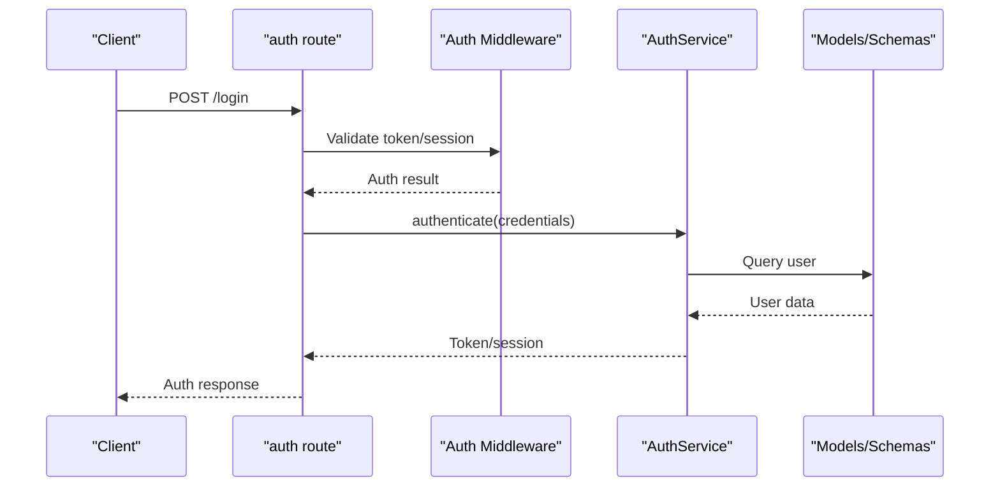
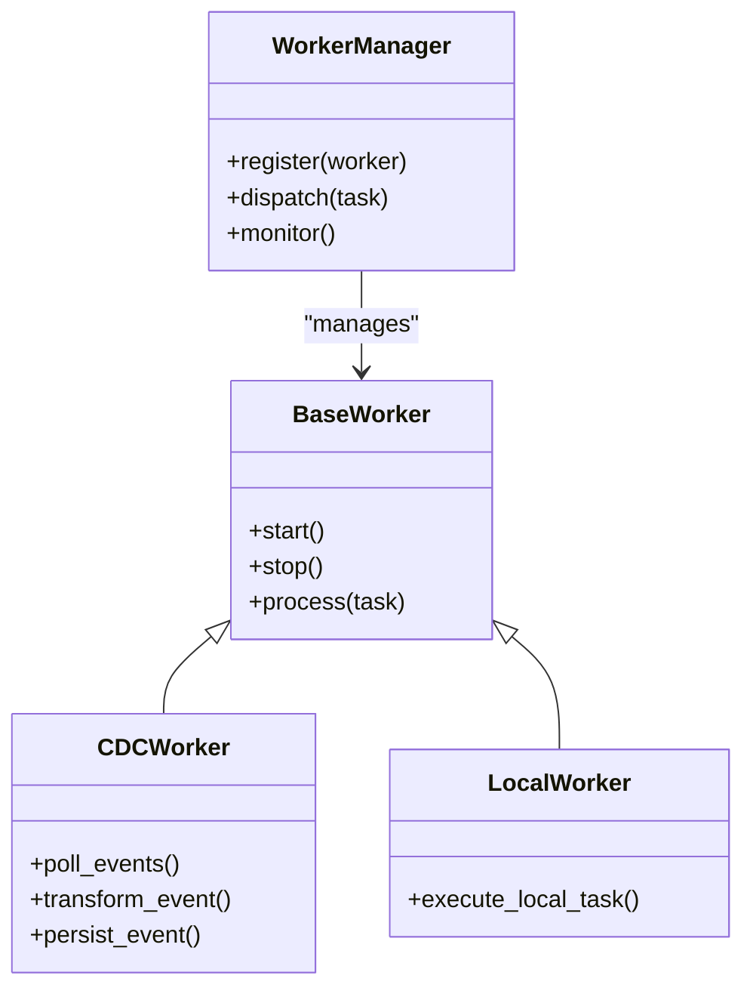
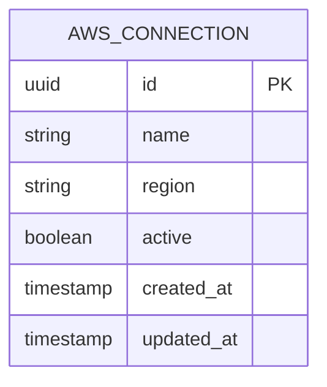
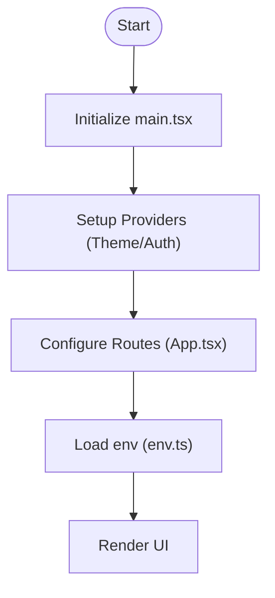
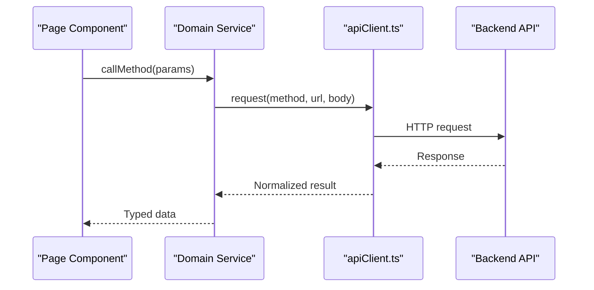
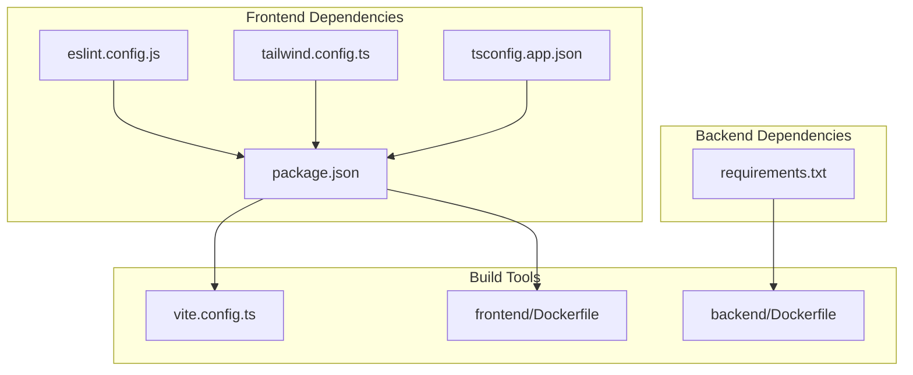

# Developer Guide

<cite>
**Referenced Files in This Document**
- [README.md](file://README.md)
- [docker-compose.yml](file://docker-compose.yml)
- [backend/run.py](file://backend/run.py)
- [backend/app/config.py](file://backend/app/config.py)
- [backend/requirements.txt](file://backend/requirements.txt)
- [backend/pytest.ini](file://backend/pytest.ini)
- [backend/Dockerfile](file://backend/Dockerfile)
- [backend/.dockerignore](file://backend/.dockerignore)
- [backend/app/__init__.py](file://backend/app/__init__.py)
- [backend/app/extensions.py](file://backend/app/extensions.py)
- [backend/app/logging.py](file://backend/app/logging.py)
- [backend/app/errors.py](file://backend/app/errors.py)
- [backend/app/middleware/auth.py](file://backend/app/middleware/auth.py)
- [backend/app/routes/auth.py](file://backend/app/routes/auth.py)
- [backend/app/services/auth_service.py](file://backend/app/services/auth_service.py)
- [backend/app/models/aws_connection.py](file://backend/app/models/aws_connection.py)
- [backend/app/schemas/aws_connection.py](file://backend/app/schemas/aws_connection.py)
- [backend/app/workers/base_worker.py](file://backend/app/workers/base_worker.py)
- [backend/app/workers/manager.py](file://backend/app/workers/manager.py)
- [backend/app/workers/cdc_worker.py](file://backend/app/workers/cdc_worker.py)
- [backend/app/workers/local_worker.py](file://backend/app/workers/local_worker.py)
- [backend/tests/test_auth.py](file://backend/tests/test_auth.py)
- [backend/tests/test_aws_connections.py](file://backend/tests/test_aws_connections.py)
- [backend/tests/test_database_configs.py](file://backend/tests/test_database_configs.py)
- [backend/tests/test_health.py](file://backend/tests/test_health.py)
- [backend/tests/test_migrations.py](file://backend/tests/test_migrations.py)
- [backend/tests/test_preflight.py](file://backend/tests/test_preflight.py)
- [frontend/package.json](file://frontend/package.json)
- [frontend/vite.config.ts](file://frontend/vite.config.ts)
- [frontend/eslint.config.js](file://frontend/eslint.config.js)
- [frontend/tailwind.config.ts](file://frontend/tailwind.config.ts)
- [frontend/tsconfig.app.json](file://frontend/tsconfig.app.json)
- [frontend/Dockerfile](file://frontend/Dockerfile)
- [frontend/nginx.conf](file://frontend/nginx.conf)
- [frontend/src/main.tsx](file://frontend/src/main.tsx)
- [frontend/src/App.tsx](file://frontend/src/App.tsx)
- [frontend/src/lib/env.ts](file://frontend/src/lib/env.ts)
- [frontend/src/services/apiClient.ts](file://frontend/src/services/apiClient.ts)
</cite>

## Table of Contents
1. Introduction
2. Project Structure
3. Core Components
4. Architecture Overview
5. Detailed Component Analysis
6. Dependency Analysis
7. Performance Considerations
8. Troubleshooting Guide
9. Conclusion
10. Appendices

## Introduction
This Developer Guide provides comprehensive guidance for contributing to CloudBridge, covering development environment setup, code organization patterns, architectural principles, coding standards, testing strategies, build and quality gates, feature extension guidelines, release procedures, versioning strategy, and contribution workflow. It is intended for both new and experienced contributors who want to understand how the project is structured and how to work effectively within it.

## Project Structure
CloudBridge is a full-stack application with a Python backend (FastAPI-based), a React + TypeScript frontend (Vite-based), and Docker Compose orchestration for local development and containerized deployments. The repository root contains:
- Backend application under backend/app with routes, services, models, schemas, workers, middleware, and utilities.
- Frontend application under frontend/src with pages, components, services, context, and configuration.
- Documentation under docs.
- Containerization and local orchestration via docker-compose.yml and per-service Dockerfiles.

**Diagram sources**
- [docker-compose.yml](file://docker-compose.yml)
- [backend/run.py](file://backend/run.py)
- [backend/app/config.py](file://backend/app/config.py)
- [backend/requirements.txt](file://backend/requirements.txt)
- [backend/Dockerfile](file://backend/Dockerfile)
- [backend/tests/test_auth.py](file://backend/tests/test_auth.py)
- [frontend/package.json](file://frontend/package.json)
- [frontend/vite.config.ts](file://frontend/vite.config.ts)
- [frontend/eslint.config.js](file://frontend/eslint.config.js)
- [frontend/tailwind.config.ts](file://frontend/tailwind.config.ts)
- [frontend/tsconfig.app.json](file://frontend/tsconfig.app.json)
- [frontend/Dockerfile](file://frontend/Dockerfile)
- [frontend/nginx.conf](file://frontend/nginx.conf)
- [frontend/src/main.tsx](file://frontend/src/main.tsx)

**Section sources**
- [README.md](file://README.md)
- [docker-compose.yml](file://docker-compose.yml)
- [backend/run.py](file://backend/run.py)
- [backend/app/config.py](file://backend/app/config.py)
- [backend/requirements.txt](file://backend/requirements.txt)
- [backend/Dockerfile](file://backend/Dockerfile)
- [backend/.dockerignore](file://backend/.dockerignore)
- [frontend/package.json](file://frontend/package.json)
- [frontend/vite.config.ts](file://frontend/vite.config.ts)
- [frontend/eslint.config.js](file://frontend/eslint.config.js)
- [frontend/tailwind.config.ts](file://frontend/tailwind.config.ts)
- [frontend/tsconfig.app.json](file://frontend/tsconfig.app.json)
- [frontend/Dockerfile](file://frontend/Dockerfile)
- [frontend/nginx.conf](file://frontend/nginx.conf)
- [frontend/src/main.tsx](file://frontend/src/main.tsx)

## Core Components
The backend follows a layered architecture:
- Entry point and app initialization
- Configuration management
- Extensions and logging
- Error handling and middleware
- Routes/controllers
- Services (business logic)
- Models (data persistence)
- Schemas (request/response validation)
- Workers (background tasks)

Key responsibilities:
- App bootstrap and lifecycle: initialize extensions, configure logging, register routes.
- Configuration: centralized settings for runtime behavior.
- Middleware: cross-cutting concerns such as authentication.
- Routes: HTTP endpoints that delegate to services.
- Services: core business logic, external integrations, and orchestration.
- Models: database entities and relationships.
- Schemas: Pydantic models for input/output validation.
- Workers: background processing for long-running or asynchronous tasks.

**Section sources**
- [backend/app/__init__.py](file://backend/app/__init__.py)
- [backend/app/config.py](file://backend/app/config.py)
- [backend/app/extensions.py](file://backend/app/extensions.py)
- [backend/app/logging.py](file://backend/app/logging.py)
- [backend/app/errors.py](file://backend/app/errors.py)
- [backend/app/middleware/auth.py](file://backend/app/middleware/auth.py)
- [backend/app/routes/auth.py](file://backend/app/routes/auth.py)
- [backend/app/services/auth_service.py](file://backend/app/services/auth_service.py)
- [backend/app/models/aws_connection.py](file://backend/app/models/aws_connection.py)
- [backend/app/schemas/aws_connection.py](file://backend/app/schemas/aws_connection.py)
- [backend/app/workers/base_worker.py](file://backend/app/workers/base_worker.py)
- [backend/app/workers/manager.py](file://backend/app/workers/manager.py)
- [backend/app/workers/cdc_worker.py](file://backend/app/workers/cdc_worker.py)
- [backend/app/workers/local_worker.py](file://backend/app/workers/local_worker.py)

## Architecture Overview
High-level system architecture:
- Frontend (React + Vite) communicates with the Backend (FastAPI) over HTTP/WebSocket.
- Backend exposes REST APIs and WebSocket endpoints for real-time updates.
- Background workers handle long-running operations (e.g., CDC).
- Database migrations are managed by Alembic.
- Containers are orchestrated via Docker Compose for local development.

**Diagram sources**
- [backend/run.py](file://backend/run.py)
- [backend/app/middleware/auth.py](file://backend/app/middleware/auth.py)
- [backend/app/services/auth_service.py](file://backend/app/services/auth_service.py)
- [backend/app/workers/manager.py](file://backend/app/workers/manager.py)
- [backend/app/workers/cdc_worker.py](file://backend/app/workers/cdc_worker.py)
- [backend/app/workers/local_worker.py](file://backend/app/workers/local_worker.py)

## Detailed Component Analysis

### Backend Application Bootstrap and Lifecycle
- Entry point initializes the FastAPI application, registers routes, configures CORS, mounts middleware, and starts the server.
- Configuration is loaded from centralized config module and environment variables.
- Logging is configured early to capture startup and runtime events.
- Extensions (database, cache, etc.) are initialized and attached to the app state.

**Diagram sources**
- [backend/run.py](file://backend/run.py)
- [backend/app/__init__.py](file://backend/app/__init__.py)
- [backend/app/config.py](file://backend/app/config.py)
- [backend/app/logging.py](file://backend/app/logging.py)
- [backend/app/extensions.py](file://backend/app/extensions.py)

**Section sources**
- [backend/run.py](file://backend/run.py)
- [backend/app/__init__.py](file://backend/app/__init__.py)
- [backend/app/config.py](file://backend/app/config.py)
- [backend/app/logging.py](file://backend/app/logging.py)
- [backend/app/extensions.py](file://backend/app/extensions.py)

### Authentication Flow
Authentication involves middleware enforcement and service-layer verification.

**Diagram sources**
- [backend/app/routes/auth.py](file://backend/app/routes/auth.py)
- [backend/app/middleware/auth.py](file://backend/app/middleware/auth.py)
- [backend/app/services/auth_service.py](file://backend/app/services/auth_service.py)
- [backend/app/models/aws_connection.py](file://backend/app/models/aws_connection.py)
- [backend/app/schemas/aws_connection.py](file://backend/app/schemas/aws_connection.py)

**Section sources**
- [backend/app/routes/auth.py](file://backend/app/routes/auth.py)
- [backend/app/middleware/auth.py](file://backend/app/middleware/auth.py)
- [backend/app/services/auth_service.py](file://backend/app/services/auth_service.py)
- [backend/app/models/aws_connection.py](file://backend/app/models/aws_connection.py)
- [backend/app/schemas/aws_connection.py](file://backend/app/schemas/aws_connection.py)

### Worker System (Background Tasks)
Workers encapsulate long-running jobs like CDC and local tasks, managed by a central worker manager.

**Diagram sources**
- [backend/app/workers/base_worker.py](file://backend/app/workers/base_worker.py)
- [backend/app/workers/cdc_worker.py](file://backend/app/workers/cdc_worker.py)
- [backend/app/workers/local_worker.py](file://backend/app/workers/local_worker.py)
- [backend/app/workers/manager.py](file://backend/app/workers/manager.py)

**Section sources**
- [backend/app/workers/base_worker.py](file://backend/app/workers/base_worker.py)
- [backend/app/workers/cdc_worker.py](file://backend/app/workers/cdc_worker.py)
- [backend/app/workers/local_worker.py](file://backend/app/workers/local_worker.py)
- [backend/app/workers/manager.py](file://backend/app/workers/manager.py)

### Data Modeling and Validation
- Models define persistent entities and relationships.
- Schemas enforce request/response contracts using Pydantic.
- Example domain: AWS connections include model definitions and schema validations.

**Diagram sources**
- [backend/app/models/aws_connection.py](file://backend/app/models/aws_connection.py)
- [backend/app/schemas/aws_connection.py](file://backend/app/schemas/aws_connection.py)

**Section sources**
- [backend/app/models/aws_connection.py](file://backend/app/models/aws_connection.py)
- [backend/app/schemas/aws_connection.py](file://backend/app/schemas/aws_connection.py)

### Frontend Application Bootstrap and Routing
- Main entry initializes React app and providers.
- App component sets up routing and layout.
- Environment configuration is centralized for API URLs and feature flags.

**Diagram sources**
- [frontend/src/main.tsx](file://frontend/src/main.tsx)
- [frontend/src/App.tsx](file://frontend/src/App.tsx)
- [frontend/src/lib/env.ts](file://frontend/src/lib/env.ts)

**Section sources**
- [frontend/src/main.tsx](file://frontend/src/main.tsx)
- [frontend/src/App.tsx](file://frontend/src/App.tsx)
- [frontend/src/lib/env.ts](file://frontend/src/lib/env.ts)

### Frontend API Client
- Centralized API client handles base URL, headers, error normalization, and retries.
- Services wrap API calls for specific domains (auth, migrations, CDC, etc.).

**Diagram sources**
- [frontend/src/services/apiClient.ts](file://frontend/src/services/apiClient.ts)

**Section sources**
- [frontend/src/services/apiClient.ts](file://frontend/src/services/apiClient.ts)

## Dependency Analysis
- Backend dependencies are declared in requirements.txt and installed via pip.
- Frontend dependencies are declared in package.json and managed via npm/yarn.
- Build tooling includes Vite for frontend and standard Python packaging for backend.
- Linting and formatting rules are defined in ESLint config and Tailwind configuration.

**Diagram sources**
- [backend/requirements.txt](file://backend/requirements.txt)
- [frontend/package.json](file://frontend/package.json)
- [frontend/eslint.config.js](file://frontend/eslint.config.js)
- [frontend/tailwind.config.ts](file://frontend/tailwind.config.ts)
- [frontend/tsconfig.app.json](file://frontend/tsconfig.app.json)
- [frontend/vite.config.ts](file://frontend/vite.config.ts)
- [backend/Dockerfile](file://backend/Dockerfile)
- [frontend/Dockerfile](file://frontend/Dockerfile)

**Section sources**
- [backend/requirements.txt](file://backend/requirements.txt)
- [frontend/package.json](file://frontend/package.json)
- [frontend/eslint.config.js](file://frontend/eslint.config.js)
- [frontend/tailwind.config.ts](file://frontend/tailwind.config.ts)
- [frontend/tsconfig.app.json](file://frontend/tsconfig.app.json)
- [frontend/vite.config.ts](file://frontend/vite.config.ts)
- [backend/Dockerfile](file://backend/Dockerfile)
- [frontend/Dockerfile](file://frontend/Dockerfile)

## Performance Considerations
- Use connection pooling for database access where applicable.
- Cache frequently accessed read-only data at the service layer.
- Offload heavy operations to workers to keep API responses fast.
- Optimize frontend bundle size via code splitting and lazy loading.
- Monitor API latency and worker throughput; set appropriate timeouts and backoff strategies.

[No sources needed since this section provides general guidance]

## Troubleshooting Guide
Common issues and resolutions:
- Startup failures: Check configuration values and environment variables; review logs emitted during app initialization.
- Authentication errors: Verify middleware configuration and token validation logic; ensure secrets are correctly provided.
- Worker stalls: Inspect worker manager logs and task queues; validate worker health checks and retry policies.
- Frontend connectivity: Confirm API base URL and CORS settings; inspect network requests and error normalization.

Operational references:
- Backend tests provide examples of assertions and fixtures for common flows.
- Docker Compose simplifies local dependency isolation and debugging.

**Section sources**
- [backend/app/logging.py](file://backend/app/logging.py)
- [backend/app/middleware/auth.py](file://backend/app/middleware/auth.py)
- [backend/app/workers/manager.py](file://backend/app/workers/manager.py)
- [backend/tests/test_auth.py](file://backend/tests/test_auth.py)
- [backend/tests/test_health.py](file://backend/tests/test_health.py)
- [docker-compose.yml](file://docker-compose.yml)

## Conclusion
CloudBridge employs a clear layered backend architecture, a modern React + Vite frontend, and robust containerization for consistent development and deployment. By following the patterns, standards, and workflows outlined here, contributors can efficiently add features, implement plugins, and maintain high code quality across the platform.

[No sources needed since this section summarizes without analyzing specific files]

## Appendices

### Development Environment Setup
- Prerequisites:
  - Python 3.x and pip
  - Node.js and npm/yarn
  - Docker and Docker Compose
- Backend setup:
  - Install dependencies from requirements.txt
  - Configure environment variables via config module
  - Run the application using the entry point script
- Frontend setup:
  - Install dependencies from package.json
  - Configure API base URL and feature flags via environment configuration
  - Start the dev server using Vite
- Local orchestration:
  - Use docker-compose.yml to run services together

**Section sources**
- [backend/requirements.txt](file://backend/requirements.txt)
- [backend/app/config.py](file://backend/app/config.py)
- [backend/run.py](file://backend/run.py)
- [frontend/package.json](file://frontend/package.json)
- [frontend/vite.config.ts](file://frontend/vite.config.ts)
- [frontend/src/lib/env.ts](file://frontend/src/lib/env.ts)
- [docker-compose.yml](file://docker-compose.yml)

### IDE Configuration
- Python:
  - Enable linting and type checking aligned with project dependencies
  - Configure debugger to attach to the FastAPI process started via the entry point
- TypeScript/React:
  - Enable ESLint and Prettier integration
  - Configure TypeScript compiler options from tsconfig.app.json
  - Set up Vite plugin support for hot reload

**Section sources**
- [backend/requirements.txt](file://backend/requirements.txt)
- [backend/run.py](file://backend/run.py)
- [frontend/eslint.config.js](file://frontend/eslint.config.js)
- [frontend/tsconfig.app.json](file://frontend/tsconfig.app.json)
- [frontend/vite.config.ts](file://frontend/vite.config.ts)

### Local Dependencies and Debugging Tools
- Backend:
  - Use pytest for unit and integration tests
  - Configure test discovery and markers via pytest.ini
- Frontend:
  - Use browser DevTools and network inspection for API debugging
  - Leverage ESLint and Tailwind configuration for static analysis and styling consistency

**Section sources**
- [backend/pytest.ini](file://backend/pytest.ini)
- [backend/tests/test_auth.py](file://backend/tests/test_auth.py)
- [backend/tests/test_aws_connections.py](file://backend/tests/test_aws_connections.py)
- [backend/tests/test_database_configs.py](file://backend/tests/test_database_configs.py)
- [backend/tests/test_health.py](file://backend/tests/test_health.py)
- [backend/tests/test_migrations.py](file://backend/tests/test_migrations.py)
- [backend/tests/test_preflight.py](file://backend/tests/test_preflight.py)
- [frontend/eslint.config.js](file://frontend/eslint.config.js)
- [frontend/tailwind.config.ts](file://frontend/tailwind.config.ts)

### Code Organization Patterns and Coding Standards
- Backend:
  - Layered separation: routes -> services -> models/schemas
  - Centralized configuration and logging
  - Middleware for cross-cutting concerns (authentication)
  - Pydantic schemas for strict input/output validation
- Frontend:
  - Feature-oriented pages and reusable UI components
  - Domain services abstracting API interactions
  - Centralized environment configuration
  - Consistent styling via Tailwind and shared theme context

**Section sources**
- [backend/app/routes/auth.py](file://backend/app/routes/auth.py)
- [backend/app/services/auth_service.py](file://backend/app/services/auth_service.py)
- [backend/app/models/aws_connection.py](file://backend/app/models/aws_connection.py)
- [backend/app/schemas/aws_connection.py](file://backend/app/schemas/aws_connection.py)
- [backend/app/middleware/auth.py](file://backend/app/middleware/auth.py)
- [backend/app/config.py](file://backend/app/config.py)
- [backend/app/logging.py](file://backend/app/logging.py)
- [frontend/src/pages/*.tsx](file://frontend/src/pages/AWSConnectionPage.tsx)
- [frontend/src/components/ui/button.tsx](file://frontend/src/components/ui/button.tsx)
- [frontend/src/context/AuthContext.tsx](file://frontend/src/context/AuthContext.tsx)
- [frontend/src/lib/env.ts](file://frontend/src/lib/env.ts)
- [frontend/tailwind.config.ts](file://frontend/tailwind.config.ts)

### Testing Strategies
- Unit tests:
  - Backend: pytest-based tests for services, routes, and models
  - Frontend: component and utility tests using the project’s test runner
- Integration tests:
  - Backend: test API endpoints and database interactions
  - Frontend: service layer tests against mocked API clients
- End-to-end tests:
  - Use Docker Compose to spin up full stack and exercise critical user journeys

**Section sources**
- [backend/pytest.ini](file://backend/pytest.ini)
- [backend/tests/test_auth.py](file://backend/tests/test_auth.py)
- [backend/tests/test_aws_connections.py](file://backend/tests/test_aws_connections.py)
- [backend/tests/test_database_configs.py](file://backend/tests/test_database_configs.py)
- [backend/tests/test_health.py](file://backend/tests/test_health.py)
- [backend/tests/test_migrations.py](file://backend/tests/test_migrations.py)
- [backend/tests/test_preflight.py](file://backend/tests/test_preflight.py)
- [docker-compose.yml](file://docker-compose.yml)

### Build Process, Linting Rules, and Code Quality Gates
- Backend:
  - Build via Dockerfile; install dependencies and run the server
  - Linting and type checks integrated into CI (configure linters matching project dependencies)
- Frontend:
  - Build via Vite; optimize assets and generate production bundle
  - Linting via ESLint; styling via Tailwind; TypeScript checks via tsconfig.app.json

**Section sources**
- [backend/Dockerfile](file://backend/Dockerfile)
- [backend/.dockerignore](file://backend/.dockerignore)
- [frontend/Dockerfile](file://frontend/Dockerfile)
- [frontend/nginx.conf](file://frontend/nginx.conf)
- [frontend/eslint.config.js](file://frontend/eslint.config.js)
- [frontend/tailwind.config.ts](file://frontend/tailwind.config.ts)
- [frontend/tsconfig.app.json](file://frontend/tsconfig.app.json)
- [frontend/vite.config.ts](file://frontend/vite.config.ts)

### Adding New Features and Implementing Plugins
- Backend:
  - Add new routes under routes, implement logic in services, define models/schemas as needed
  - Extend workers for background processing if required
  - Update configuration and logging as necessary
- Frontend:
  - Create new pages and components; wire up services to API endpoints
  - Update routing and context providers for global state
- Plugin-like extensibility:
  - Use service interfaces and worker base classes to plug in new behaviors

**Section sources**
- [backend/app/routes/auth.py](file://backend/app/routes/auth.py)
- [backend/app/services/auth_service.py](file://backend/app/services/auth_service.py)
- [backend/app/models/aws_connection.py](file://backend/app/models/aws_connection.py)
- [backend/app/schemas/aws_connection.py](file://backend/app/schemas/aws_connection.py)
- [backend/app/workers/base_worker.py](file://backend/app/workers/base_worker.py)
- [backend/app/workers/manager.py](file://backend/app/workers/manager.py)
- [frontend/src/App.tsx](file://frontend/src/App.tsx)
- [frontend/src/services/apiClient.ts](file://frontend/src/services/apiClient.ts)

### Release Procedures, Versioning Strategy, and Backward Compatibility
- Versioning:
  - Follow semantic versioning for major.minor.patch releases
  - Maintain changelog entries for notable changes
- Backward compatibility:
  - Preserve API contracts; deprecate fields gradually with migration paths
  - Ensure database migrations are additive and reversible when possible
- Release process:
  - Tag versions, build containers, and publish artifacts
  - Validate through integration and end-to-end tests before promotion

[No sources needed since this section provides general guidance]

### Contribution Workflow, Pull Request Guidelines, and Code Review Processes
- Workflow:
  - Fork the repository, create feature branches, and open pull requests
  - Ensure all tests pass locally and in CI
- PR guidelines:
  - Include clear descriptions, screenshots for UI changes, and test coverage updates
  - Link related issues and document breaking changes
- Code review:
  - Address reviewer feedback promptly
  - Maintain small, focused commits for easier review

[No sources needed since this section provides general guidance]