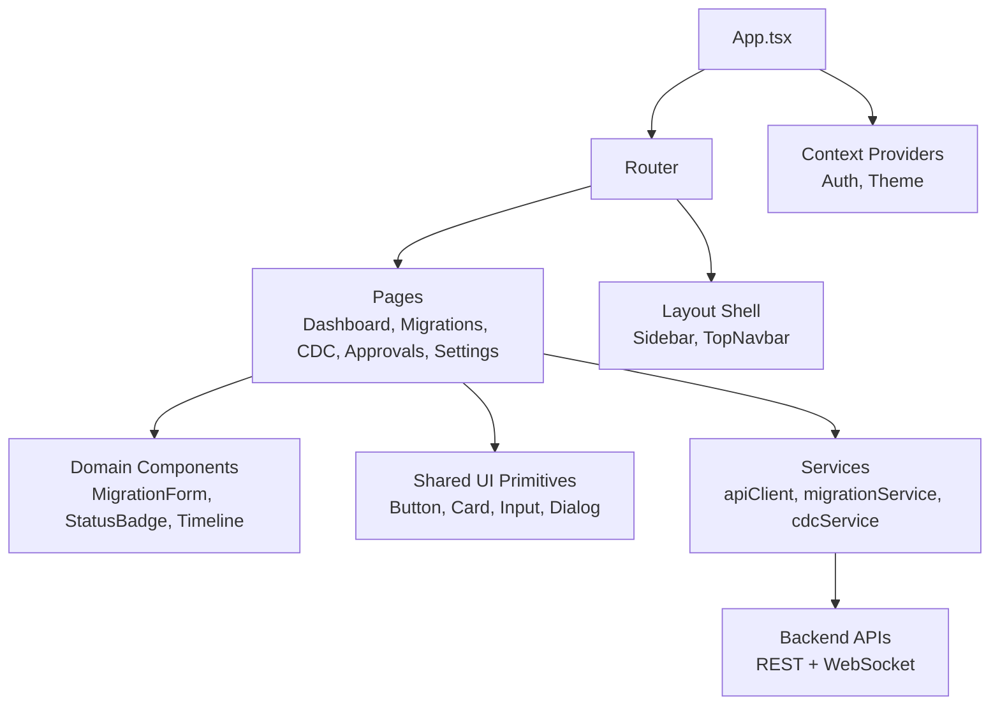
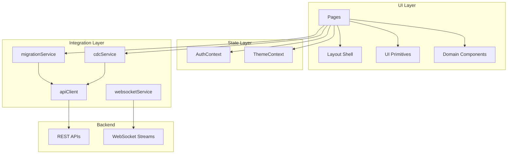
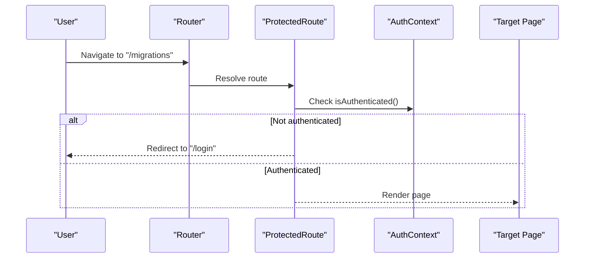
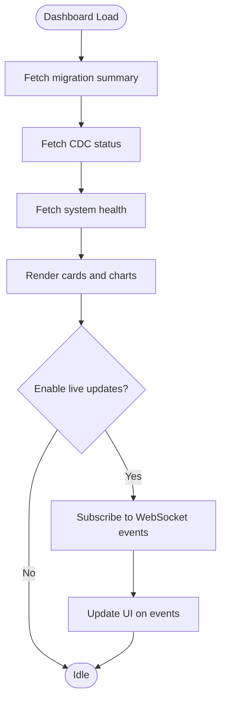
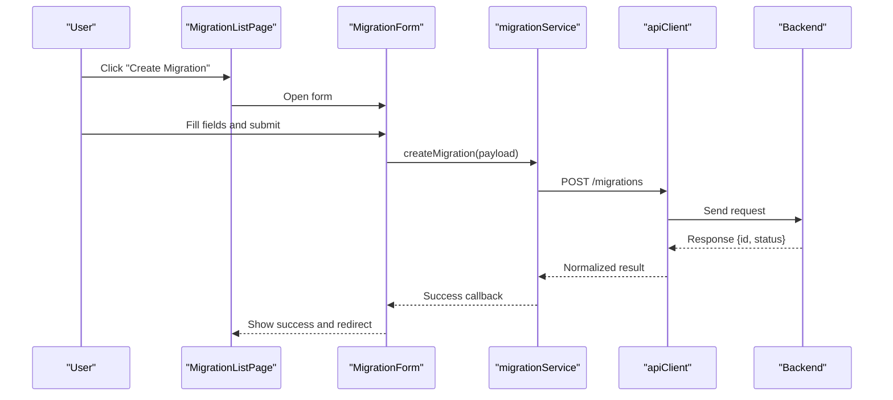
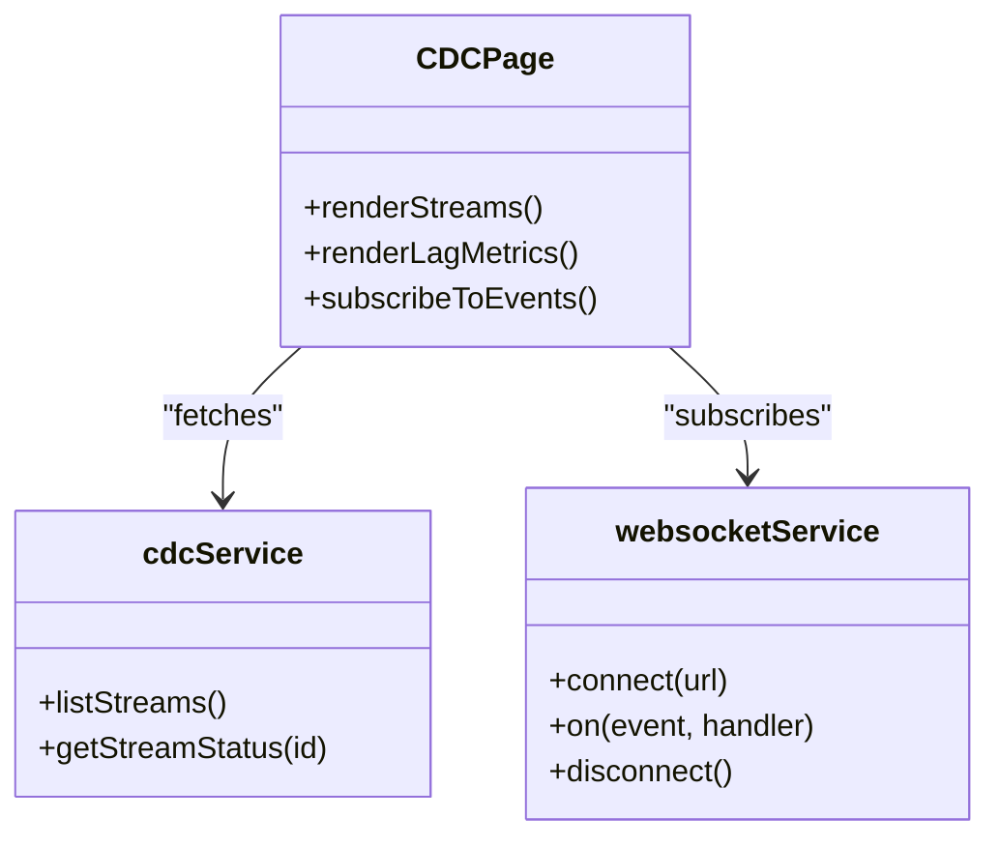
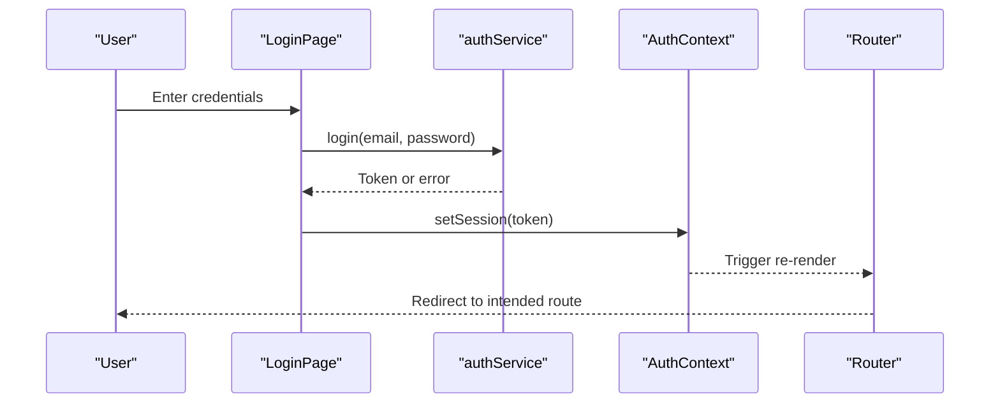
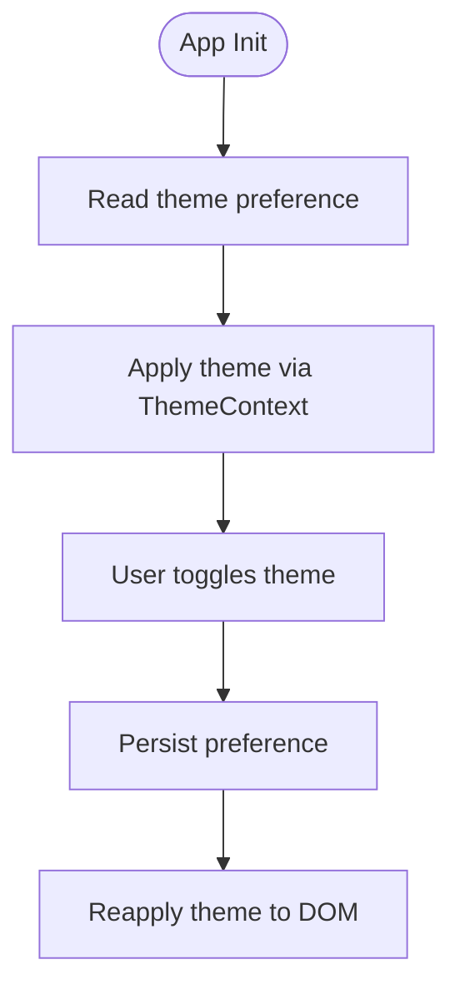
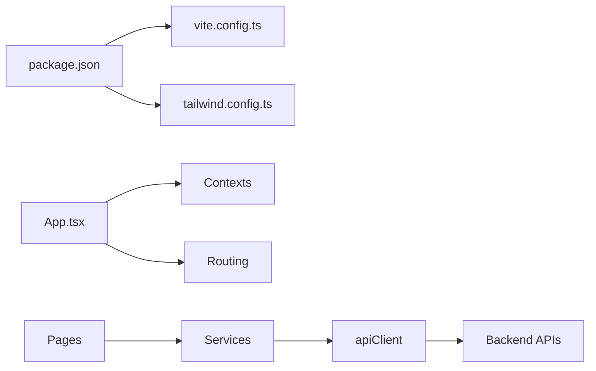

# Frontend Application

<cite>
**Referenced Files in This Document**
- [App.tsx](file://frontend/src/App.tsx)
- [main.tsx](file://frontend/src/main.tsx)
- [package.json](file://frontend/package.json)
- [tailwind.config.ts](file://frontend/tailwind.config.ts)
- [vite.config.ts](file://frontend/vite.config.ts)
- [AuthContext.tsx](file://frontend/src/context/AuthContext.tsx)
- [ThemeContext.tsx](file://frontend/src/context/ThemeContext.tsx)
- [DashboardPage.tsx](file://frontend/src/pages/DashboardPage.tsx)
- [MigrationListPage.tsx](file://frontend/src/pages/MigrationListPage.tsx)
- [CDCPage.tsx](file://frontend/src/pages/CDCPage.tsx)
- [apiClient.ts](file://frontend/src/services/apiClient.ts)
- [migrationService.ts](file://frontend/src/services/migrationService.ts)
- [cdcService.ts](file://frontend/src/services/cdcService.ts)
- [AppShell.tsx](file://frontend/src/components/layout/AppShell.tsx)
- [Sidebar.tsx](file://frontend/src/components/layout/Sidebar.tsx)
- [TopNavbar.tsx](file://frontend/src/components/layout/TopNavbar.tsx)
- [ProtectedRoute.tsx](file://frontend/src/components/routing/ProtectedRoute.tsx)
- [ThemeToggle.tsx](file://frontend/src/components/theme/ThemeToggle.tsx)
</cite>

## Table of Contents
1. [Introduction](#introduction)
2. [Project Structure](#project-structure)
3. [Core Components](#core-components)
4. [Architecture Overview](#architecture-overview)
5. [Detailed Component Analysis](#detailed-component-analysis)
6. [Dependency Analysis](#dependency-analysis)
7. [Performance Considerations](#performance-considerations)
8. [Troubleshooting Guide](#troubleshooting-guide)
9. [Conclusion](#conclusion)

## Introduction
CloudBridge is a full-stack platform for database migrations, change data capture (CDC), and schema management. The frontend is a modern React application that provides an interactive dashboard for monitoring migrations, CDC status, system health, approvals, and configuration. It emphasizes responsive design, accessibility, and extensibility while integrating with backend services via REST APIs and WebSockets.

## Project Structure
The frontend follows a feature-oriented layout with clear separation between pages, shared components, context providers, services, and styling. Key directories:
- src/components: Reusable UI and domain-specific components
- src/pages: Route-level views and page logic
- src/context: Global state providers (auth, theme)
- src/services: API clients and service modules
- src/styles: Global styles and Tailwind setup
- Configuration files at the root: Vite, Tailwind, TypeScript, ESLint

[No sources needed since this diagram shows conceptual workflow, not actual code structure]

**Section sources**
- [App.tsx](file://frontend/src/App.tsx)
- [main.tsx](file://frontend/src/main.tsx)
- [package.json](file://frontend/package.json)
- [tailwind.config.ts](file://frontend/tailwind.config.ts)
- [vite.config.ts](file://frontend/vite.config.ts)

## Core Components
- Layout shell: AppShell composes Sidebar and TopNavbar to provide consistent navigation and chrome across pages.
- Routing: Centralized routes define protected and public paths; ProtectedRoute enforces authentication.
- Contexts: AuthContext manages user session and permissions; ThemeContext toggles light/dark themes.
- Services: apiClient centralizes HTTP configuration and interceptors; feature services encapsulate endpoints and error handling.
- UI primitives: Button, Card, Input, Dialog, Tabs, Badge, Skeleton, ProgressRing, ProgressBar, Tooltip, Separator, Select, Switch, Label, Avatar.
- Domain components: MigrationForm, ConfirmDeleteDialog, StatusBadge, Timeline for migration workflows.

Key responsibilities:
- Pages orchestrate data fetching and render domain components.
- Services abstract network calls and normalize responses.
- Contexts expose global state consumed by components.
- Layout ensures consistent UX and navigation patterns.

**Section sources**
- [AppShell.tsx](file://frontend/src/components/layout/AppShell.tsx)
- [Sidebar.tsx](file://frontend/src/components/layout/Sidebar.tsx)
- [TopNavbar.tsx](file://frontend/src/components/layout/TopNavbar.tsx)
- [ProtectedRoute.tsx](file://frontend/src/components/routing/ProtectedRoute.tsx)
- [AuthContext.tsx](file://frontend/src/context/AuthContext.tsx)
- [ThemeContext.tsx](file://frontend/src/context/ThemeContext.tsx)
- [apiClient.ts](file://frontend/src/services/apiClient.ts)
- [migrationService.ts](file://frontend/src/services/migrationService.ts)
- [cdcService.ts](file://frontend/src/services/cdcService.ts)

## Architecture Overview
The frontend architecture centers on a React SPA with:
- Declarative routing and route guards
- Context-based global state for auth and theming
- Service layer for API integration
- Composable component hierarchy with reusable UI primitives

**Diagram sources**
- [App.tsx](file://frontend/src/App.tsx)
- [AuthContext.tsx](file://frontend/src/context/AuthContext.tsx)
- [ThemeContext.tsx](file://frontend/src/context/ThemeContext.tsx)
- [apiClient.ts](file://frontend/src/services/apiClient.ts)
- [migrationService.ts](file://frontend/src/services/migrationService.ts)
- [cdcService.ts](file://frontend/src/services/cdcService.ts)
- [AppShell.tsx](file://frontend/src/components/layout/AppShell.tsx)

## Detailed Component Analysis

### Routing and Navigation
- Routes are defined centrally and include both public and protected pages.
- ProtectedRoute checks authentication state before rendering target pages.
- Navigation uses a sidebar and top navbar for primary actions and quick access.

**Diagram sources**
- [ProtectedRoute.tsx](file://frontend/src/components/routing/ProtectedRoute.tsx)
- [AuthContext.tsx](file://frontend/src/context/AuthContext.tsx)

**Section sources**
- [ProtectedRoute.tsx](file://frontend/src/components/routing/ProtectedRoute.tsx)
- [Sidebar.tsx](file://frontend/src/components/layout/Sidebar.tsx)
- [TopNavbar.tsx](file://frontend/src/components/layout/TopNavbar.tsx)

### Dashboard Features
The dashboard aggregates key metrics and live indicators:
- Migration overview: counts, statuses, recent runs, and quick links to details.
- CDC status: active streams, lag indicators, and event throughput.
- System health: endpoint liveness and dependency status.

Data flow:
- DashboardPage fetches aggregated data via services.
- Services call apiClient to hit backend endpoints.
- Real-time updates may use websocketService for live metrics.

**Diagram sources**
- [DashboardPage.tsx](file://frontend/src/pages/DashboardPage.tsx)
- [migrationService.ts](file://frontend/src/services/migrationService.ts)
- [cdcService.ts](file://frontend/src/services/cdcService.ts)
- [apiClient.ts](file://frontend/src/services/apiClient.ts)

**Section sources**
- [DashboardPage.tsx](file://frontend/src/pages/DashboardPage.tsx)
- [migrationService.ts](file://frontend/src/services/migrationService.ts)
- [cdcService.ts](file://frontend/src/services/cdcService.ts)
- [apiClient.ts](file://frontend/src/services/apiClient.ts)

### Migration Workflows
Common tasks:
- Create migration: fill MigrationForm, validate inputs, submit via migrationService.
- Manage approvals: navigate to ApprovalsPage, review pending items, approve/reject.
- Configure connections: manage AWS and database configs via dedicated pages and services.

**Diagram sources**
- [MigrationListPage.tsx](file://frontend/src/pages/MigrationListPage.tsx)
- [MigrationForm.tsx](file://frontend/src/components/migrations/MigrationForm.tsx)
- [migrationService.ts](file://frontend/src/services/migrationService.ts)
- [apiClient.ts](file://frontend/src/services/apiClient.ts)

**Section sources**
- [MigrationListPage.tsx](file://frontend/src/pages/MigrationListPage.tsx)
- [MigrationForm.tsx](file://frontend/src/components/migrations/MigrationForm.tsx)
- [migrationService.ts](file://frontend/src/services/migrationService.ts)
- [apiClient.ts](file://frontend/src/services/apiClient.ts)

### CDC Monitoring
CDCPage displays stream states, lag, and events. It integrates with cdcService and optionally websocketService for real-time updates.

**Diagram sources**
- [CDCPage.tsx](file://frontend/src/pages/CDCPage.tsx)
- [cdcService.ts](file://frontend/src/services/cdcService.ts)

**Section sources**
- [CDCPage.tsx](file://frontend/src/pages/CDCPage.tsx)
- [cdcService.ts](file://frontend/src/services/cdcService.ts)

### Authentication and Authorization
AuthContext exposes current user and login/logout flows. ProtectedRoute enforces access control.

**Diagram sources**
- [AuthContext.tsx](file://frontend/src/context/AuthContext.tsx)
- [ProtectedRoute.tsx](file://frontend/src/components/routing/ProtectedRoute.tsx)

**Section sources**
- [AuthContext.tsx](file://frontend/src/context/AuthContext.tsx)
- [ProtectedRoute.tsx](file://frontend/src/components/routing/ProtectedRoute.tsx)

### Theming and Accessibility
ThemeContext and ThemeToggle enable light/dark modes. Global styles and Tailwind utilities ensure consistent appearance. Accessibility considerations include semantic HTML, keyboard navigation, focus management, and ARIA attributes on UI primitives.

**Diagram sources**
- [ThemeContext.tsx](file://frontend/src/context/ThemeContext.tsx)
- [ThemeToggle.tsx](file://frontend/src/components/theme/ThemeToggle.tsx)
- [tailwind.config.ts](file://frontend/tailwind.config.ts)

**Section sources**
- [ThemeContext.tsx](file://frontend/src/context/ThemeContext.tsx)
- [ThemeToggle.tsx](file://frontend/src/components/theme/ThemeToggle.tsx)
- [tailwind.config.ts](file://frontend/tailwind.config.ts)

## Dependency Analysis
Frontend dependencies and build tooling:
- Build: Vite for fast dev server and optimized builds.
- Styling: Tailwind CSS with PostCSS.
- Runtime: React ecosystem with TypeScript.
- Networking: HTTP client via apiClient; optional WebSocket client for live updates.

**Diagram sources**
- [package.json](file://frontend/package.json)
- [vite.config.ts](file://frontend/vite.config.ts)
- [tailwind.config.ts](file://frontend/tailwind.config.ts)
- [App.tsx](file://frontend/src/App.tsx)
- [apiClient.ts](file://frontend/src/services/apiClient.ts)

**Section sources**
- [package.json](file://frontend/package.json)
- [vite.config.ts](file://frontend/vite.config.ts)
- [tailwind.config.ts](file://frontend/tailwind.config.ts)

## Performance Considerations
- Code splitting: Use lazy loading for heavy pages and components to reduce initial bundle size.
- Memoization: Apply memoization for expensive computations and stable props in frequently rendered components.
- Data fetching: Implement caching and pagination for lists; prefer optimistic updates where safe.
- Real-time updates: Debounce or throttle WebSocket-driven UI updates; avoid unnecessary re-renders.
- Asset optimization: Leverage Vite’s asset pipeline and image optimization strategies.
- Bundle analysis: Periodically audit dependencies and remove unused code.

[No sources needed since this section provides general guidance]

## Troubleshooting Guide
Common areas to inspect:
- Network errors: Verify apiClient base URL, headers, and token refresh logic.
- WebSocket connectivity: Ensure correct endpoint URLs and reconnection strategies.
- Routing issues: Confirm route definitions and guard conditions.
- Theme persistence: Check storage keys and fallback behavior.
- Form validation: Review field constraints and error propagation.

Operational tips:
- Enable verbose logging in development via environment variables.
- Use browser DevTools Network and Console tabs to trace failures.
- Validate payloads against backend schemas when debugging mismatches.

**Section sources**
- [apiClient.ts](file://frontend/src/services/apiClient.ts)
- [AuthContext.tsx](file://frontend/src/context/AuthContext.tsx)
- [ThemeContext.tsx](file://frontend/src/context/ThemeContext.tsx)

## Conclusion
The CloudBridge frontend delivers a cohesive, accessible, and extensible React interface for managing migrations, CDC, and system observability. Its layered architecture—pages, services, contexts, and reusable components—supports scalable growth, clear maintenance, and smooth integration with backend APIs and real-time channels.