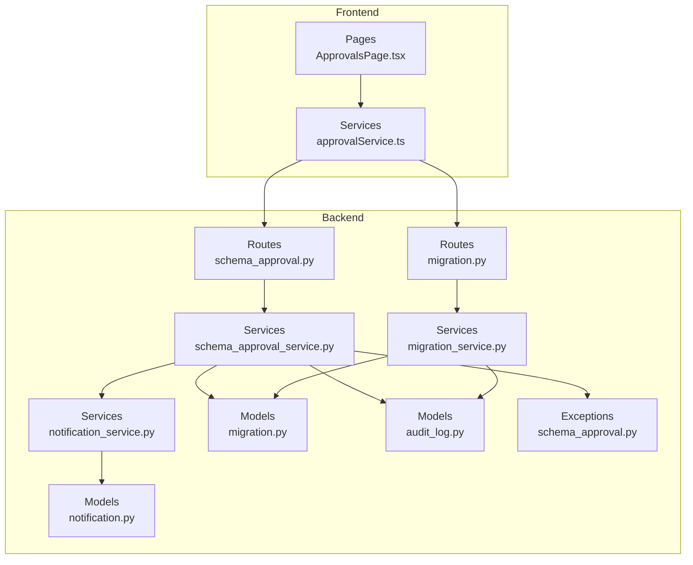
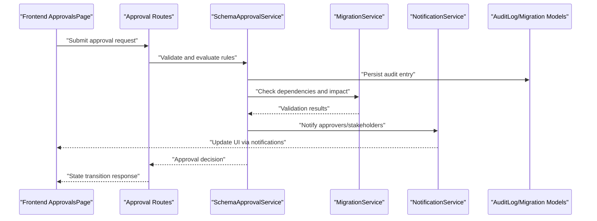
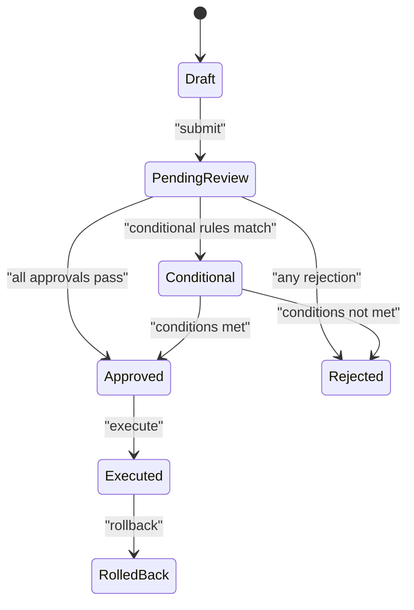
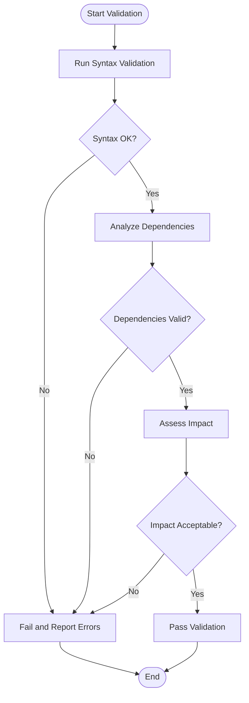
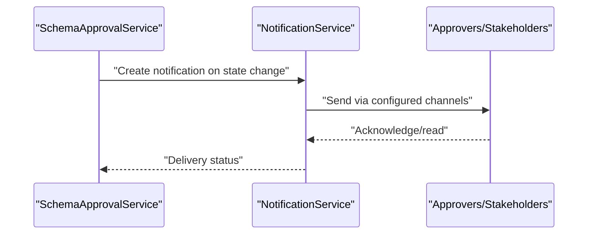
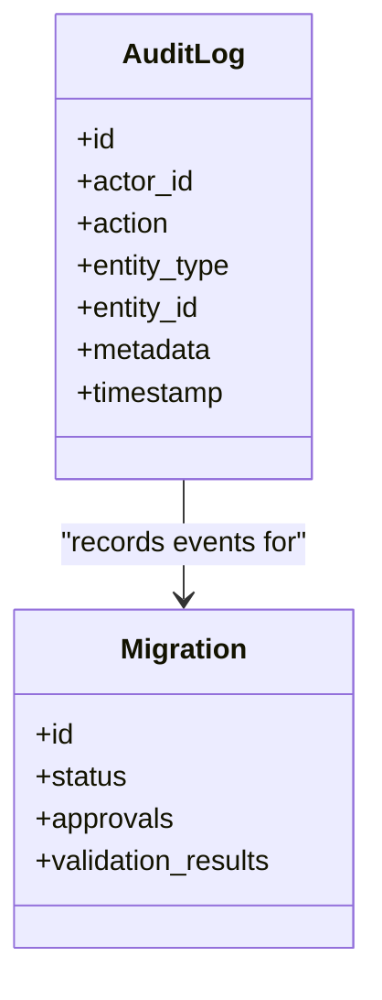
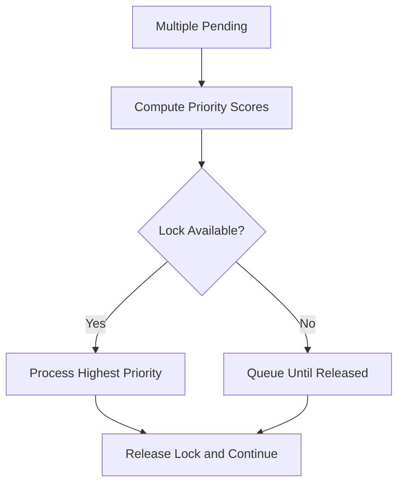
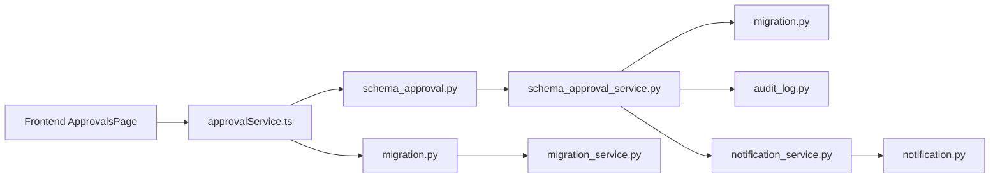

# Approval Workflow System

<cite>
**Referenced Files in This Document**
- [schema_approval.py](file://backend/app/exceptions/schema_approval.py)
- [migration.py](file://backend/app/models/migration.py)
- [audit_log.py](file://backend/app/models/audit_log.py)
- [notification.py](file://backend/app/models/notification.py)
- [schema_approval_service.py](file://backend/app/services/schema_approval_service.py)
- [migration_service.py](file://backend/app/services/migration_service.py)
- [notification_service.py](file://backend/app/services/notification_service.py)
- [schema_approval_routes.py](file://backend/app/routes/schema_approval.py)
- [migration_routes.py](file://backend/app/routes/migration.py)
- [approvalService.ts](file://frontend/src/services/approvalService.ts)
- [ApprovalsPage.tsx](file://frontend/src/pages/ApprovalsPage.tsx)
</cite>

## Table of Contents
1. [Introduction](#introduction)
2. [Project Structure](#project-structure)
3. [Core Components](#core-components)
4. [Architecture Overview](#architecture-overview)
5. [Detailed Component Analysis](#detailed-component-analysis)
6. [Dependency Analysis](#dependency-analysis)
7. [Performance Considerations](#performance-considerations)
8. [Troubleshooting Guide](#troubleshooting-guide)
9. [Conclusion](#conclusion)
10. [Appendices](#appendices)

## Introduction
This document explains the approval workflow system for migrations and schema changes. It covers configurable review processes with multiple approver levels, conditional approvals, state transitions, automated validation checks (syntax, dependency analysis, impact assessment), notifications to approvers and stakeholders, custom rule examples, webhook integrations, audit trails for compliance, and conflict resolution when multiple migrations are pending approval.

## Project Structure
The approval workflow spans backend services, models, routes, workers, and frontend pages:
- Backend models define entities such as Migration, AuditLog, Notification, and approval-related schemas.
- Services implement business logic for approvals, validations, notifications, and migration orchestration.
- Routes expose APIs for creating, reviewing, approving, and auditing approvals.
- Frontend provides UI for approvals, notifications, and migration details.

**Diagram sources**
- [schema_approval_routes.py:1-200](file://backend/app/routes/schema_approval.py#L1-L200)
- [migration_routes.py:1-200](file://backend/app/routes/migration.py#L1-L200)
- [schema_approval_service.py:1-300](file://backend/app/services/schema_approval_service.py#L1-L300)
- [migration_service.py:1-300](file://backend/app/services/migration_service.py#L1-L300)
- [notification_service.py:1-200](file://backend/app/services/notification_service.py#L1-L200)
- [migration.py:1-200](file://backend/app/models/migration.py#L1-L200)
- [audit_log.py:1-200](file://backend/app/models/audit_log.py#L1-L200)
- [notification.py:1-200](file://backend/app/models/notification.py#L1-L200)
- [schema_approval.py:1-200](file://backend/app/exceptions/schema_approval.py#L1-L200)
- [approvalService.ts:1-200](file://frontend/src/services/approvalService.ts#L1-L200)
- [ApprovalsPage.tsx:1-200](file://frontend/src/pages/ApprovalsPage.tsx#L1-L200)

**Section sources**
- [schema_approval_routes.py:1-200](file://backend/app/routes/schema_approval.py#L1-L200)
- [migration_routes.py:1-200](file://backend/app/routes/migration.py#L1-L200)
- [schema_approval_service.py:1-300](file://backend/app/services/schema_approval_service.py#L1-L300)
- [migration_service.py:1-300](file://backend/app/services/migration_service.py#L1-L300)
- [notification_service.py:1-200](file://backend/app/services/notification_service.py#L1-L200)
- [migration.py:1-200](file://backend/app/models/migration.py#L1-L200)
- [audit_log.py:1-200](file://backend/app/models/audit_log.py#L1-L200)
- [notification.py:1-200](file://backend/app/models/notification.py#L1-L200)
- [schema_approval.py:1-200](file://backend/app/exceptions/schema_approval.py#L1-L200)
- [approvalService.ts:1-200](file://frontend/src/services/approvalService.ts#L1-L200)
- [ApprovalsPage.tsx:1-200](file://frontend/src/pages/ApprovalsPage.tsx#L1-L200)

## Core Components
- Approval State Machine: Defines states and transitions for approval workflows across multiple approver levels.
- Validation Engine: Performs syntax validation, dependency analysis, and impact assessment before allowing approvals.
- Notification Service: Sends alerts to approvers and stakeholders on state changes and required actions.
- Audit Trail: Records all approval actions, decisions, and system events for governance and compliance.
- Conflict Resolver: Manages contention when multiple migrations are pending approval simultaneously.

Key responsibilities:
- Enforce multi-level approvals with configurable rules.
- Gate execution until all required approvals pass.
- Provide rich auditability and traceability.
- Notify relevant parties promptly.

**Section sources**
- [schema_approval_service.py:1-300](file://backend/app/services/schema_approval_service.py#L1-L300)
- [migration_service.py:1-300](file://backend/app/services/migration_service.py#L1-L300)
- [notification_service.py:1-200](file://backend/app/services/notification_service.py#L1-L200)
- [audit_log.py:1-200](file://backend/app/models/audit_log.py#L1-L200)
- [schema_approval.py:1-200](file://backend/app/exceptions/schema_approval.py#L1-L200)

## Architecture Overview
The approval workflow integrates routes, services, models, and notifications to enforce controlled change management.

**Diagram sources**
- [schema_approval_routes.py:1-200](file://backend/app/routes/schema_approval.py#L1-L200)
- [schema_approval_service.py:1-300](file://backend/app/services/schema_approval_service.py#L1-L300)
- [migration_service.py:1-300](file://backend/app/services/migration_service.py#L1-L300)
- [notification_service.py:1-200](file://backend/app/services/notification_service.py#L1-L200)
- [audit_log.py:1-200](file://backend/app/models/audit_log.py#L1-L200)
- [migration.py:1-200](file://backend/app/models/migration.py#L1-L200)

## Detailed Component Analysis

### Approval States and Transitions
States typically include:
- Draft: Initial creation before submission.
- Pending Review: Submitted and awaiting approver action.
- Approved: All required approvals obtained.
- Rejected: One or more approvers declined.
- Conditional: Requires additional conditions or follow-up actions.
- Executed: Applied after successful execution.
- Rolled Back: Reverted due to failure or rollback.

Transitions:
- Draft → Pending Review: On submit.
- Pending Review → Approved: When all required approvals pass.
- Pending Review → Rejected: If any required approver declines.
- Pending Review → Conditional: If conditional rules apply.
- Conditional → Approved/Rejected: Based on condition fulfillment.
- Approved → Executed: After successful run.
- Executed → Rolled Back: On rollback.

**Diagram sources**
- [schema_approval_service.py:1-300](file://backend/app/services/schema_approval_service.py#L1-L300)
- [migration.py:1-200](file://backend/app/models/migration.py#L1-L200)

**Section sources**
- [schema_approval_service.py:1-300](file://backend/app/services/schema_approval_service.py#L1-L300)
- [migration.py:1-200](file://backend/app/models/migration.py#L1-L200)

### Configurable Multi-Level Approvals
- Levels can be defined per project or environment (e.g., Dev, Staging, Prod).
- Each level specifies required roles/groups and thresholds (e.g., majority vs. unanimous).
- Rules can be conditional based on risk score, change type, or affected tables.

Implementation patterns:
- Rule engine evaluates approver sets and outcomes.
- Aggregation logic determines final decision per level.
- Overrides require higher privileges and are audited.

**Section sources**
- [schema_approval_service.py:1-300](file://backend/app/services/schema_approval_service.py#L1-L300)
- [schema_approval.py:1-200](file://backend/app/exceptions/schema_approval.py#L1-L200)

### Automated Validation Checks
Checks performed before approvals:
- Syntax validation: Ensures migration scripts conform to language/schema rules.
- Dependency analysis: Verifies no circular dependencies and correct ordering.
- Impact assessment: Estimates scope of changes and potential risks.

Flow:

**Diagram sources**
- [schema_approval_service.py:1-300](file://backend/app/services/schema_approval_service.py#L1-L300)
- [migration_service.py:1-300](file://backend/app/services/migration_service.py#L1-L300)

**Section sources**
- [schema_approval_service.py:1-300](file://backend/app/services/schema_approval_service.py#L1-L300)
- [migration_service.py:1-300](file://backend/app/services/migration_service.py#L1-L300)

### Notifications for Approvers and Stakeholders
- Triggers on state transitions, new approvals needed, rejections, and executions.
- Channels include email, in-app notifications, and webhooks.
- Supports templating and localization.

**Diagram sources**
- [notification_service.py:1-200](file://backend/app/services/notification_service.py#L1-L200)
- [notification.py:1-200](file://backend/app/models/notification.py#L1-L200)

**Section sources**
- [notification_service.py:1-200](file://backend/app/services/notification_service.py#L1-L200)
- [notification.py:1-200](file://backend/app/models/notification.py#L1-L200)

### Custom Approval Rules and Webhook Integrations
- Custom rules allow dynamic evaluation based on context (e.g., time-of-day restrictions, owner-based routing).
- Webhooks enable external systems to participate in approvals or receive outcomes.

Patterns:
- Rule registration and prioritization.
- Webhook payload definitions and retry policies.
- Signature verification and idempotency handling.

**Section sources**
- [schema_approval_service.py:1-300](file://backend/app/services/schema_approval_service.py#L1-L300)
- [notification_service.py:1-200](file://backend/app/services/notification_service.py#L1-L200)

### Audit Trails for Compliance and Governance
- Every action is recorded with actor, timestamp, decision, and rationale.
- Immutable logs support audits and forensics.
- Export capabilities for reporting.

**Diagram sources**
- [audit_log.py:1-200](file://backend/app/models/audit_log.py#L1-L200)
- [migration.py:1-200](file://backend/app/models/migration.py#L1-L200)

**Section sources**
- [audit_log.py:1-200](file://backend/app/models/audit_log.py#L1-L200)
- [migration.py:1-200](file://backend/app/models/migration.py#L1-L200)

### Conflict Resolution for Multiple Pending Approvals
When multiple migrations are pending:
- Priority scoring considers urgency, risk, and SLA.
- Locking mechanisms prevent concurrent conflicting approvals.
- Queueing ensures deterministic processing order.

Resolution flow:

**Diagram sources**
- [schema_approval_service.py:1-300](file://backend/app/services/schema_approval_service.py#L1-L300)
- [migration_service.py:1-300](file://backend/app/services/migration_service.py#L1-L300)

**Section sources**
- [schema_approval_service.py:1-300](file://backend/app/services/schema_approval_service.py#L1-L300)
- [migration_service.py:1-300](file://backend/app/services/migration_service.py#L1-L300)

## Dependency Analysis
The approval workflow depends on:
- Routes exposing endpoints for approval operations.
- Services implementing core logic and orchestrating validations and notifications.
- Models persisting state and audit records.
- Frontend components interacting with APIs and displaying statuses.

**Diagram sources**
- [ApprovalsPage.tsx:1-200](file://frontend/src/pages/ApprovalsPage.tsx#L1-L200)
- [approvalService.ts:1-200](file://frontend/src/services/approvalService.ts#L1-L200)
- [schema_approval_routes.py:1-200](file://backend/app/routes/schema_approval.py#L1-L200)
- [migration_routes.py:1-200](file://backend/app/routes/migration.py#L1-L200)
- [schema_approval_service.py:1-300](file://backend/app/services/schema_approval_service.py#L1-L300)
- [migration_service.py:1-300](file://backend/app/services/migration_service.py#L1-L300)
- [notification_service.py:1-200](file://backend/app/services/notification_service.py#L1-L200)
- [migration.py:1-200](file://backend/app/models/migration.py#L1-L200)
- [audit_log.py:1-200](file://backend/app/models/audit_log.py#L1-L200)
- [notification.py:1-200](file://backend/app/models/notification.py#L1-L200)

**Section sources**
- [schema_approval_routes.py:1-200](file://backend/app/routes/schema_approval.py#L1-L200)
- [migration_routes.py:1-200](file://backend/app/routes/migration.py#L1-L200)
- [schema_approval_service.py:1-300](file://backend/app/services/schema_approval_service.py#L1-L300)
- [migration_service.py:1-300](file://backend/app/services/migration_service.py#L1-L300)
- [notification_service.py:1-200](file://backend/app/services/notification_service.py#L1-L200)
- [migration.py:1-200](file://backend/app/models/migration.py#L1-L200)
- [audit_log.py:1-200](file://backend/app/models/audit_log.py#L1-L200)
- [notification.py:1-200](file://backend/app/models/notification.py#L1-L200)
- [approvalService.ts:1-200](file://frontend/src/services/approvalService.ts#L1-L200)
- [ApprovalsPage.tsx:1-200](file://frontend/src/pages/ApprovalsPage.tsx#L1-L200)

## Performance Considerations
- Batch validations to reduce overhead during bulk submissions.
- Cache dependency graphs and impact assessments where safe.
- Use asynchronous tasks for heavy computations and notifications.
- Implement pagination and filtering for large approval queues.
- Optimize database queries for audit log retrieval and reporting.

[No sources needed since this section provides general guidance]

## Troubleshooting Guide
Common issues and resolutions:
- Validation failures: Review error messages from syntax and dependency checks; adjust scripts accordingly.
- Approval deadlocks: Ensure locks are released; verify queue processing and priority logic.
- Notification delivery failures: Check channel configurations and retry policies; inspect delivery status.
- Audit gaps: Confirm logging hooks are invoked on all state transitions; validate persistence.

Operational tips:
- Inspect service logs around approval transitions.
- Validate webhook signatures and payloads.
- Monitor queue lengths and processing latency.

**Section sources**
- [schema_approval_service.py:1-300](file://backend/app/services/schema_approval_service.py#L1-L300)
- [notification_service.py:1-200](file://backend/app/services/notification_service.py#L1-L200)
- [audit_log.py:1-200](file://backend/app/models/audit_log.py#L1-L200)

## Conclusion
The approval workflow system enforces controlled, auditable change management through configurable multi-level approvals, robust validations, comprehensive notifications, and strong governance features. Its architecture supports scalability, reliability, and extensibility for evolving organizational requirements.

[No sources needed since this section summarizes without analyzing specific files]

## Appendices
- Example custom rule: Require dual approval for production changes affecting critical tables.
- Webhook integration: Emit approval outcomes to CI/CD pipelines for gating deployments.
- Audit export: Generate CSV reports for compliance reviews.

[No sources needed since this section provides general guidance]