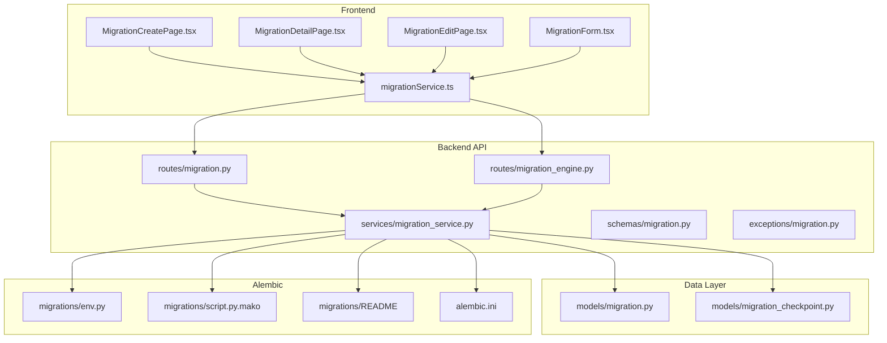
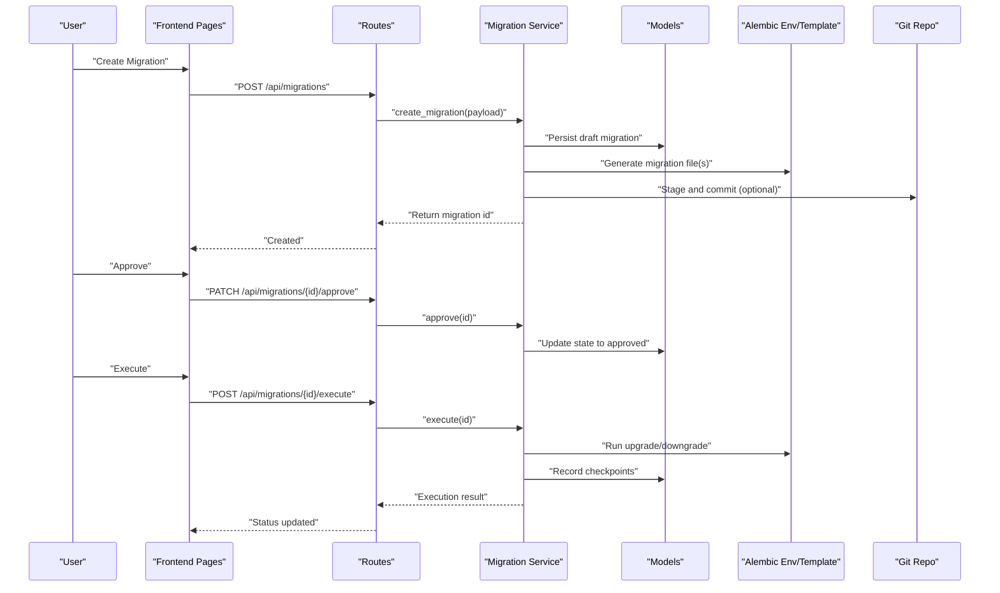
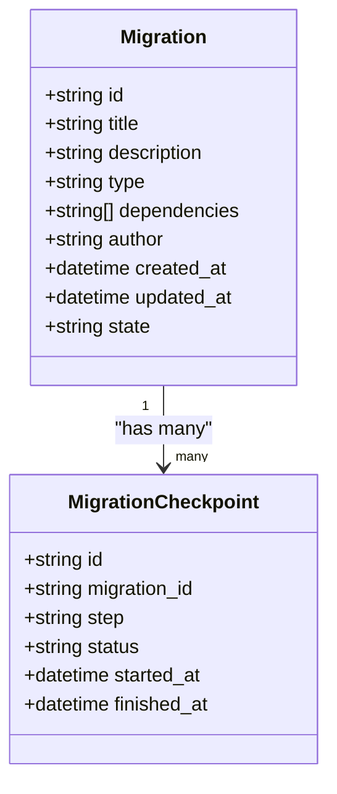
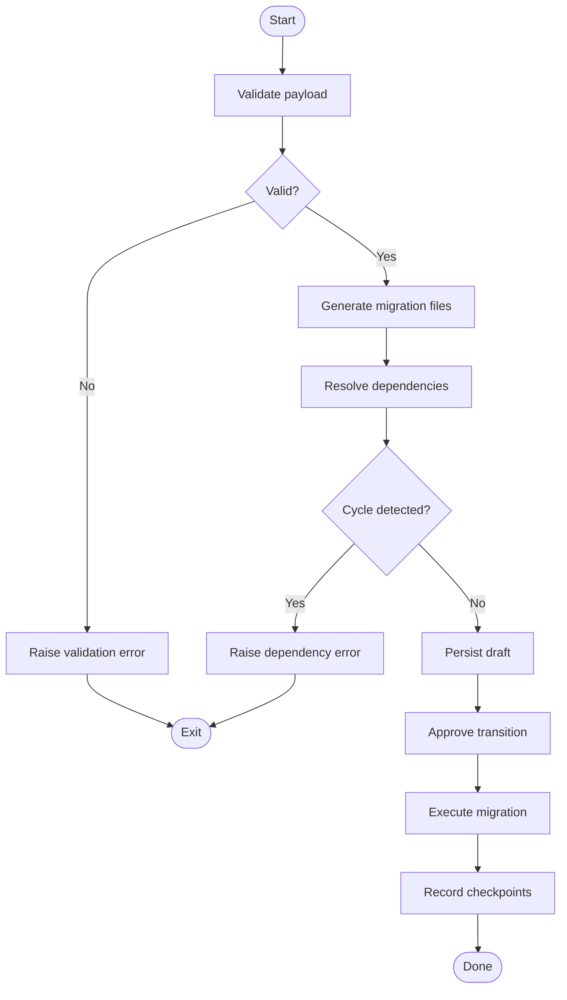
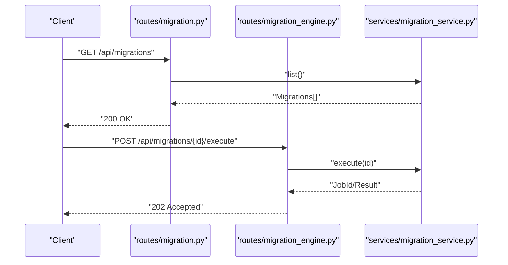
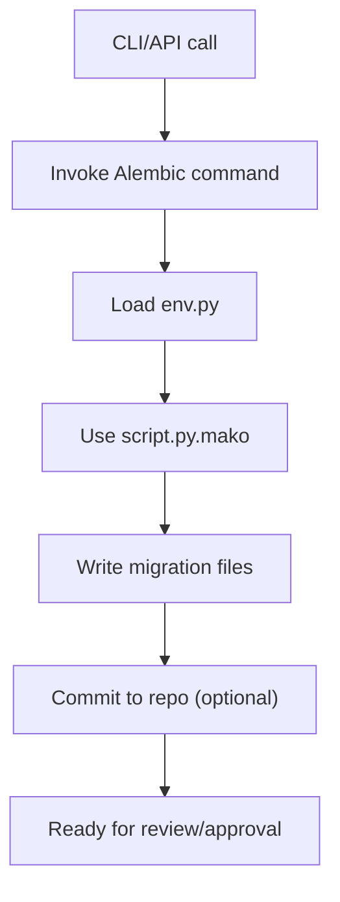
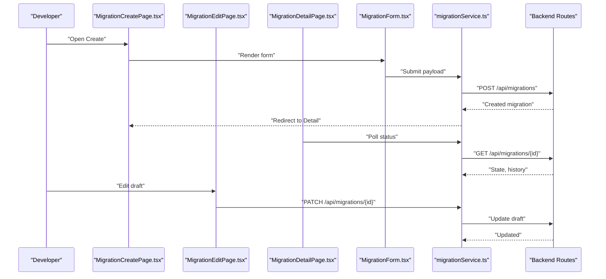
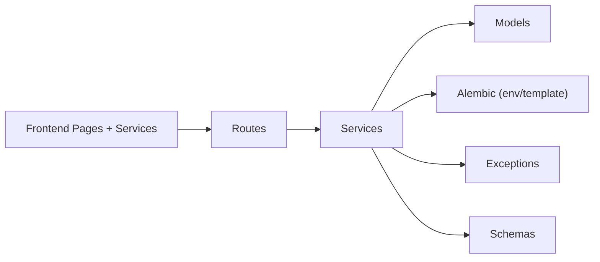

# Migration Creation & Version Control

<cite>
**Referenced Files in This Document**
- [backend/app/models/migration.py](file://backend/app/models/migration.py)
- [backend/app/models/migration_checkpoint.py](file://backend/app/models/migration_checkpoint.py)
- [backend/app/services/migration_service.py](file://backend/app/services/migration_service.py)
- [backend/app/routes/migration.py](file://backend/app/routes/migration.py)
- [backend/app/routes/migration_engine.py](file://backend/app/routes/migration_engine.py)
- [backend/app/exceptions/migration.py](file://backend/app/exceptions/migration.py)
- [backend/app/schemas/migration.py](file://backend/app/schemas/migration.py)
- [backend/migrations/env.py](file://backend/migrations/env.py)
- [backend/migrations/script.py.mako](file://backend/migrations/script.py.mako)
- [backend/migrations/README](file://backend/migrations/README)
- [backend/alembic.ini](file://backend/alembic.ini)
- [frontend/src/pages/MigrationCreatePage.tsx](file://frontend/src/pages/MigrationCreatePage.tsx)
- [frontend/src/pages/MigrationDetailPage.tsx](file://frontend/src/pages/MigrationDetailPage.tsx)
- [frontend/src/pages/MigrationEditPage.tsx](file://frontend/src/pages/MigrationEditPage.tsx)
- [frontend/src/components/migrations/MigrationForm.tsx](file://frontend/src/components/migrations/MigrationForm.tsx)
- [frontend/src/services/migrationService.ts](file://frontend/src/services/migrationService.ts)
</cite>

## Table of Contents
1. [Introduction](#introduction)
2. [Project Structure](#project-structure)
3. [Core Components](#core-components)
4. [Architecture Overview](#architecture-overview)
5. [Detailed Component Analysis](#detailed-component-analysis)
6. [Dependency Analysis](#dependency-analysis)
7. [Performance Considerations](#performance-considerations)
8. [Troubleshooting Guide](#troubleshooting-guide)
9. [Conclusion](#conclusion)
10. [Appendices](#appendices)

## Introduction
This document explains how to create and manage migrations, including version control integration, file structure, naming conventions, templates, lifecycle states, and best practices for safe and reversible changes. It covers creation via CLI, API, and web interface, and provides examples for schema changes, data transformations, constraint modifications, and stored procedures.

## Project Structure
The migration system spans backend services, routes, models, Alembic configuration, and a frontend UI for creating and managing migrations.

**Diagram sources**
- [backend/app/routes/migration.py](file://backend/app/routes/migration.py)
- [backend/app/routes/migration_engine.py](file://backend/app/routes/migration_engine.py)
- [backend/app/services/migration_service.py](file://backend/app/services/migration_service.py)
- [backend/app/schemas/migration.py](file://backend/app/schemas/migration.py)
- [backend/app/exceptions/migration.py](file://backend/app/exceptions/migration.py)
- [backend/app/models/migration.py](file://backend/app/models/migration.py)
- [backend/app/models/migration_checkpoint.py](file://backend/app/models/migration_checkpoint.py)
- [backend/migrations/env.py](file://backend/migrations/env.py)
- [backend/migrations/script.py.mako](file://backend/migrations/script.py.mako)
- [backend/migrations/README](file://backend/migrations/README)
- [backend/alembic.ini](file://backend/alembic.ini)
- [frontend/src/pages/MigrationCreatePage.tsx](file://frontend/src/pages/MigrationCreatePage.tsx)
- [frontend/src/pages/MigrationDetailPage.tsx](file://frontend/src/pages/MigrationDetailPage.tsx)
- [frontend/src/pages/MigrationEditPage.tsx](file://frontend/src/pages/MigrationEditPage.tsx)
- [frontend/src/components/migrations/MigrationForm.tsx](file://frontend/src/components/migrations/MigrationForm.tsx)
- [frontend/src/services/migrationService.ts](file://frontend/src/services/migrationService.ts)

**Section sources**
- [backend/app/routes/migration.py](file://backend/app/routes/migration.py)
- [backend/app/routes/migration_engine.py](file://backend/app/routes/migration_engine.py)
- [backend/app/services/migration_service.py](file://backend/app/services/migration_service.py)
- [backend/app/schemas/migration.py](file://backend/app/schemas/migration.py)
- [backend/app/exceptions/migration.py](file://backend/app/exceptions/migration.py)
- [backend/app/models/migration.py](file://backend/app/models/migration.py)
- [backend/app/models/migration_checkpoint.py](file://backend/app/models/migration_checkpoint.py)
- [backend/migrations/env.py](file://backend/migrations/env.py)
- [backend/migrations/script.py.mako](file://backend/migrations/script.py.mako)
- [backend/migrations/README](file://backend/migrations/README)
- [backend/alembic.ini](file://backend/alembic.ini)
- [frontend/src/pages/MigrationCreatePage.tsx](file://frontend/src/pages/MigrationCreatePage.tsx)
- [frontend/src/pages/MigrationDetailPage.tsx](file://frontend/src/pages/MigrationDetailPage.tsx)
- [frontend/src/pages/MigrationEditPage.tsx](file://frontend/src/pages/MigrationEditPage.tsx)
- [frontend/src/components/migrations/MigrationForm.tsx](file://frontend/src/components/migrations/MigrationForm.tsx)
- [frontend/src/services/migrationService.ts](file://frontend/src/services/migrationService.ts)

## Core Components
- Models: Persist migration metadata and checkpoints.
- Services: Orchestrate creation, validation, execution, and rollback flows.
- Routes: Expose REST endpoints for the UI and external clients.
- Schemas: Validate request/response payloads.
- Exceptions: Centralized error types for migration operations.
- Alembic: Configuration, environment, and template for generating migration files.
- Frontend: Pages and forms to create, edit, and inspect migrations.

Key responsibilities:
- Create new migrations (CLI, API, UI).
- Manage lifecycle states (draft, approved, executed, failed).
- Track execution checkpoints for resumable runs.
- Integrate with Git workflows and branching strategies.

**Section sources**
- [backend/app/models/migration.py](file://backend/app/models/migration.py)
- [backend/app/models/migration_checkpoint.py](file://backend/app/models/migration_checkpoint.py)
- [backend/app/services/migration_service.py](file://backend/app/services/migration_service.py)
- [backend/app/routes/migration.py](file://backend/app/routes/migration.py)
- [backend/app/routes/migration_engine.py](file://backend/app/routes/migration_engine.py)
- [backend/app/schemas/migration.py](file://backend/app/schemas/migration.py)
- [backend/app/exceptions/migration.py](file://backend/app/exceptions/migration.py)
- [backend/migrations/env.py](file://backend/migrations/env.py)
- [backend/migrations/script.py.mako](file://backend/migrations/script.py.mako)
- [backend/migrations/README](file://backend/migrations/README)
- [backend/alembic.ini](file://backend/alembic.ini)
- [frontend/src/pages/MigrationCreatePage.tsx](file://frontend/src/pages/MigrationCreatePage.tsx)
- [frontend/src/pages/MigrationDetailPage.tsx](file://frontend/src/pages/MigrationDetailPage.tsx)
- [frontend/src/pages/MigrationEditPage.tsx](file://frontend/src/pages/MigrationEditPage.tsx)
- [frontend/src/components/migrations/MigrationForm.tsx](file://frontend/src/components/migrations/MigrationForm.tsx)
- [frontend/src/services/migrationService.ts](file://frontend/src/services/migrationService.ts)

## Architecture Overview
End-to-end flow from UI to Alembic and database:

**Diagram sources**
- [backend/app/routes/migration.py](file://backend/app/routes/migration.py)
- [backend/app/routes/migration_engine.py](file://backend/app/routes/migration_engine.py)
- [backend/app/services/migration_service.py](file://backend/app/services/migration_service.py)
- [backend/app/models/migration.py](file://backend/app/models/migration.py)
- [backend/app/models/migration_checkpoint.py](file://backend/app/models/migration_checkpoint.py)
- [backend/migrations/env.py](file://backend/migrations/env.py)
- [backend/migrations/script.py.mako](file://backend/migrations/script.py.mako)

## Detailed Component Analysis

### Data Model: Migration and Checkpoint
- Migration model stores metadata such as title, description, type, dependencies, author, timestamps, and current state.
- Migration checkpoint model records per-step progress during execution to support resumability and auditing.

**Diagram sources**
- [backend/app/models/migration.py](file://backend/app/models/migration.py)
- [backend/app/models/migration_checkpoint.py](file://backend/app/models/migration_checkpoint.py)

**Section sources**
- [backend/app/models/migration.py](file://backend/app/models/migration.py)
- [backend/app/models/migration_checkpoint.py](file://backend/app/models/migration_checkpoint.py)

### Service Layer: Migration Orchestration
Responsibilities:
- Validate inputs using schemas.
- Generate migration files via Alembic template.
- Enforce dependency checks and ordering.
- Transition lifecycle states (draft -> approved -> executed/failed).
- Record checkpoints during execution.
- Coordinate rollbacks when needed.

**Diagram sources**
- [backend/app/services/migration_service.py](file://backend/app/services/migration_service.py)
- [backend/app/schemas/migration.py](file://backend/app/schemas/migration.py)
- [backend/app/exceptions/migration.py](file://backend/app/exceptions/migration.py)
- [backend/app/models/migration.py](file://backend/app/models/migration.py)
- [backend/app/models/migration_checkpoint.py](file://backend/app/models/migration_checkpoint.py)

**Section sources**
- [backend/app/services/migration_service.py](file://backend/app/services/migration_service.py)
- [backend/app/schemas/migration.py](file://backend/app/schemas/migration.py)
- [backend/app/exceptions/migration.py](file://backend/app/exceptions/migration.py)
- [backend/app/models/migration.py](file://backend/app/models/migration.py)
- [backend/app/models/migration_checkpoint.py](file://backend/app/models/migration_checkpoint.py)

### API Layer: Routes and Engine
- Public routes expose CRUD and lifecycle transitions for migrations.
- Engine routes handle execution orchestration and long-running tasks.

**Diagram sources**
- [backend/app/routes/migration.py](file://backend/app/routes/migration.py)
- [backend/app/routes/migration_engine.py](file://backend/app/routes/migration_engine.py)
- [backend/app/services/migration_service.py](file://backend/app/services/migration_service.py)

**Section sources**
- [backend/app/routes/migration.py](file://backend/app/routes/migration.py)
- [backend/app/routes/migration_engine.py](file://backend/app/routes/migration_engine.py)
- [backend/app/services/migration_service.py](file://backend/app/services/migration_service.py)

### Alembic Integration: Environment and Template
- env.py configures Alembic runtime, target metadata, and connection handling.
- script.py.mako defines the default migration file template used by generation commands.
- README documents project-specific conventions and usage notes.
- alembic.ini sets global Alembic behavior.

**Diagram sources**
- [backend/migrations/env.py](file://backend/migrations/env.py)
- [backend/migrations/script.py.mako](file://backend/migrations/script.py.mako)
- [backend/migrations/README](file://backend/migrations/README)
- [backend/alembic.ini](file://backend/alembic.ini)

**Section sources**
- [backend/migrations/env.py](file://backend/migrations/env.py)
- [backend/migrations/script.py.mako](file://backend/migrations/script.py.mako)
- [backend/migrations/README](file://backend/migrations/README)
- [backend/alembic.ini](file://backend/alembic.ini)

### Web Interface: Create, Edit, Detail
- MigrationCreatePage initiates creation flows and submits payloads.
- MigrationEditPage allows editing draft content before approval.
- MigrationDetailPage shows status, history, and actions.
- MigrationForm encapsulates reusable form logic and validation.
- migrationService.ts calls backend endpoints consistently.

**Diagram sources**
- [frontend/src/pages/MigrationCreatePage.tsx](file://frontend/src/pages/MigrationCreatePage.tsx)
- [frontend/src/pages/MigrationEditPage.tsx](file://frontend/src/pages/MigrationEditPage.tsx)
- [frontend/src/pages/MigrationDetailPage.tsx](file://frontend/src/pages/MigrationDetailPage.tsx)
- [frontend/src/components/migrations/MigrationForm.tsx](file://frontend/src/components/migrations/MigrationForm.tsx)
- [frontend/src/services/migrationService.ts](file://frontend/src/services/migrationService.ts)
- [backend/app/routes/migration.py](file://backend/app/routes/migration.py)

**Section sources**
- [frontend/src/pages/MigrationCreatePage.tsx](file://frontend/src/pages/MigrationCreatePage.tsx)
- [frontend/src/pages/MigrationEditPage.tsx](file://frontend/src/pages/MigrationEditPage.tsx)
- [frontend/src/pages/MigrationDetailPage.tsx](file://frontend/src/pages/MigrationDetailPage.tsx)
- [frontend/src/components/migrations/MigrationForm.tsx](file://frontend/src/components/migrations/MigrationForm.tsx)
- [frontend/src/services/migrationService.ts](file://frontend/src/services/migrationService.ts)
- [backend/app/routes/migration.py](file://backend/app/routes/migration.py)

## Dependency Analysis
- Frontend depends on backend routes via HTTP.
- Backend routes depend on service layer for business logic.
- Service layer depends on models for persistence and Alembic components for file generation and execution.
- Exception and schema modules provide cross-cutting concerns.

**Diagram sources**
- [frontend/src/services/migrationService.ts](file://frontend/src/services/migrationService.ts)
- [backend/app/routes/migration.py](file://backend/app/routes/migration.py)
- [backend/app/services/migration_service.py](file://backend/app/services/migration_service.py)
- [backend/app/models/migration.py](file://backend/app/models/migration.py)
- [backend/app/models/migration_checkpoint.py](file://backend/app/models/migration_checkpoint.py)
- [backend/migrations/env.py](file://backend/migrations/env.py)
- [backend/migrations/script.py.mako](file://backend/migrations/script.py.mako)
- [backend/app/exceptions/migration.py](file://backend/app/exceptions/migration.py)
- [backend/app/schemas/migration.py](file://backend/app/schemas/migration.py)

**Section sources**
- [frontend/src/services/migrationService.ts](file://frontend/src/services/migrationService.ts)
- [backend/app/routes/migration.py](file://backend/app/routes/migration.py)
- [backend/app/services/migration_service.py](file://backend/app/services/migration_service.py)
- [backend/app/models/migration.py](file://backend/app/models/migration.py)
- [backend/app/models/migration_checkpoint.py](file://backend/app/models/migration_checkpoint.py)
- [backend/migrations/env.py](file://backend/migrations/env.py)
- [backend/migrations/script.py.mako](file://backend/migrations/script.py.mako)
- [backend/app/exceptions/migration.py](file://backend/app/exceptions/migration.py)
- [backend/app/schemas/migration.py](file://backend/app/schemas/migration.py)

## Performance Considerations
- Prefer small, focused migrations to reduce lock times and improve rollback speed.
- Batch large data transformations into multiple smaller steps with checkpoints.
- Avoid heavy computations inside migrations; offload to background jobs where possible.
- Use appropriate indexes and constraints judiciously to minimize downtime.
- Monitor execution duration and resource usage; tune Alembic concurrency settings if applicable.

## Troubleshooting Guide
Common issues and remedies:
- Validation errors: Ensure required fields are present and conform to schema constraints.
- Dependency cycles: Review declared dependencies and break circular references.
- Execution failures: Inspect checkpoints and logs to identify failing steps; consider partial rollback or re-run from last successful checkpoint.
- State inconsistencies: Reconcile migration state with actual database version; use engine endpoints to refresh status.

Operational tips:
- Use detailed descriptions and titles to aid traceability.
- Keep migration files idempotent where feasible.
- Tag releases and associate migrations with change requests.

**Section sources**
- [backend/app/exceptions/migration.py](file://backend/app/exceptions/migration.py)
- [backend/app/services/migration_service.py](file://backend/app/services/migration_service.py)
- [backend/app/models/migration_checkpoint.py](file://backend/app/models/migration_checkpoint.py)

## Conclusion
This system provides a robust workflow for creating, reviewing, approving, and executing migrations across CLI, API, and web interfaces. With clear file structure, strong validation, dependency management, checkpointing, and Git-friendly outputs, teams can safely evolve their databases while maintaining auditability and reversibility.

## Appendices

### Creating New Migrations
- CLI: Use the provided Alembic setup to generate migration files based on the configured template and environment.
- API: Call the migration creation endpoint with a validated payload describing the change.
- Web Interface: Open the Create page, fill out the form, and submit to generate a draft migration.

**Section sources**
- [backend/migrations/env.py](file://backend/migrations/env.py)
- [backend/migrations/script.py.mako](file://backend/migrations/script.py.mako)
- [backend/migrations/README](file://backend/migrations/README)
- [backend/alembic.ini](file://backend/alembic.ini)
- [backend/app/routes/migration.py](file://backend/app/routes/migration.py)
- [frontend/src/pages/MigrationCreatePage.tsx](file://frontend/src/pages/MigrationCreatePage.tsx)
- [frontend/src/components/migrations/MigrationForm.tsx](file://frontend/src/components/migrations/MigrationForm.tsx)
- [frontend/src/services/migrationService.ts](file://frontend/src/services/migrationService.ts)

### Migration File Structure and Naming Conventions
- Files are generated using the project’s Alembic template and placed under the versions directory.
- Follow the naming convention documented in the migrations README to ensure consistent ordering and readability.
- Include descriptive titles and comments within files to clarify intent and scope.

**Section sources**
- [backend/migrations/README](file://backend/migrations/README)
- [backend/migrations/script.py.mako](file://backend/migrations/script.py.mako)

### Version Control Integration and Branching Strategy
- Stage and commit generated migration files alongside application code changes.
- Use feature branches for isolated development; merge only after approvals and tests pass.
- Tag releases that include specific migrations to enable reproducible deployments.
- Maintain a linear history for migrations to simplify rollbacks and audits.

[No sources needed since this section provides general guidance]

### Examples of Migration Types
- Schema changes: Add tables, columns, indexes, or drop objects.
- Data transformations: Backfill or normalize data in batches with checkpoints.
- Constraint modifications: Add or remove constraints carefully to avoid downtime.
- Stored procedures: Create or update procedural code with explicit up/down logic.

[No sources needed since this section provides general guidance]

### Migration Lifecycle
States typically include:
- Draft: Created but not yet reviewed.
- Approved: Reviewed and ready for execution.
- Executed: Successfully applied to the database.
- Failed: Encountered an error during execution; requires remediation.

Transitions are enforced by the service layer and reflected in the UI and API responses.

**Section sources**
- [backend/app/services/migration_service.py](file://backend/app/services/migration_service.py)
- [backend/app/models/migration.py](file://backend/app/models/migration.py)
- [frontend/src/pages/MigrationDetailPage.tsx](file://frontend/src/pages/MigrationDetailPage.tsx)

### Best Practices
- Write safe, reversible migrations with explicit up and down operations.
- Keep migrations small and focused on a single concern.
- Test migrations against representative data and environments.
- Document assumptions, risks, and rollback plans in migration descriptions.
- Handle dependencies explicitly and avoid circular references.
- Use checkpoints for long-running operations to allow resumption.

[No sources needed since this section provides general guidance]