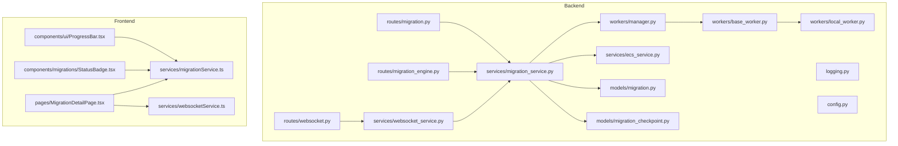
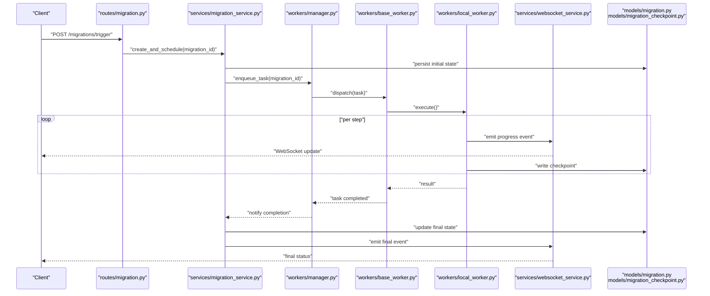
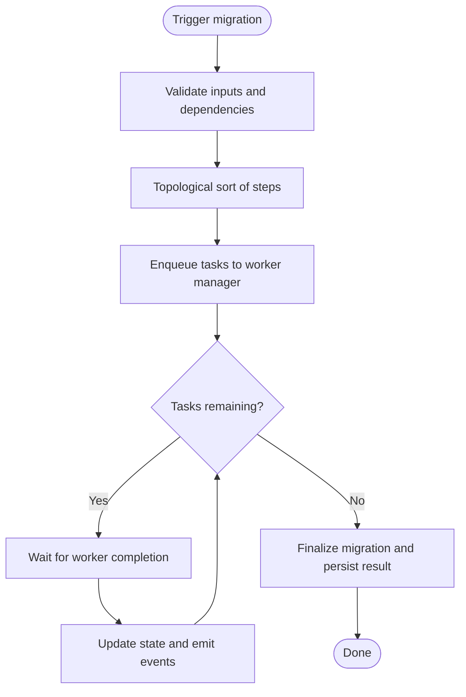
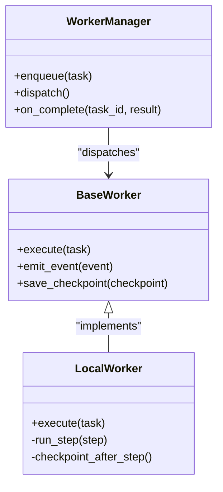
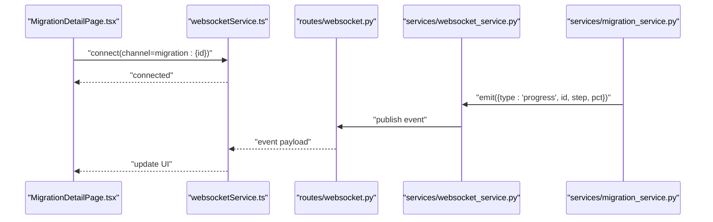
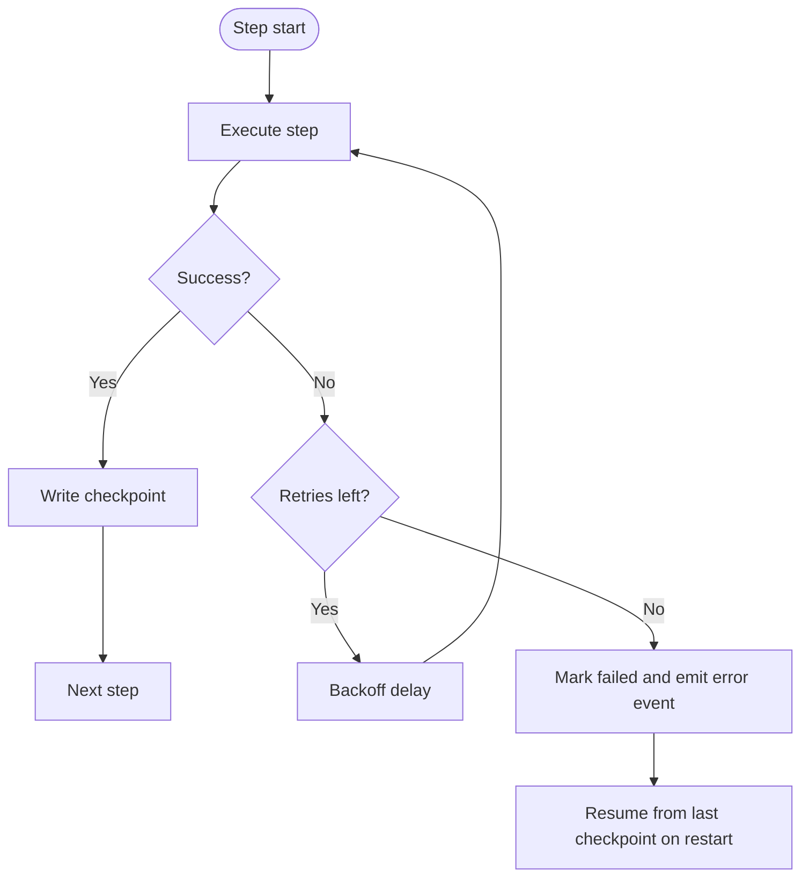
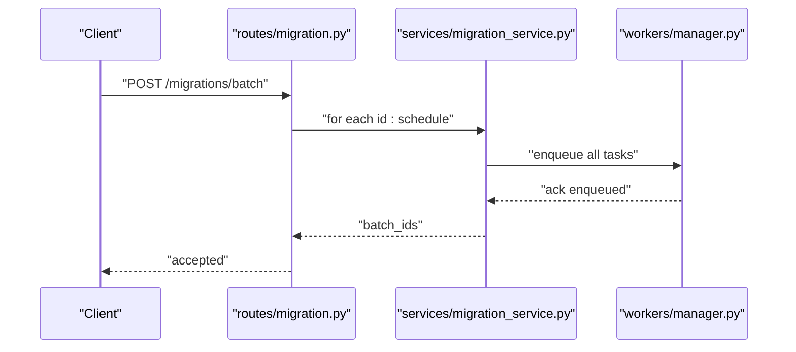
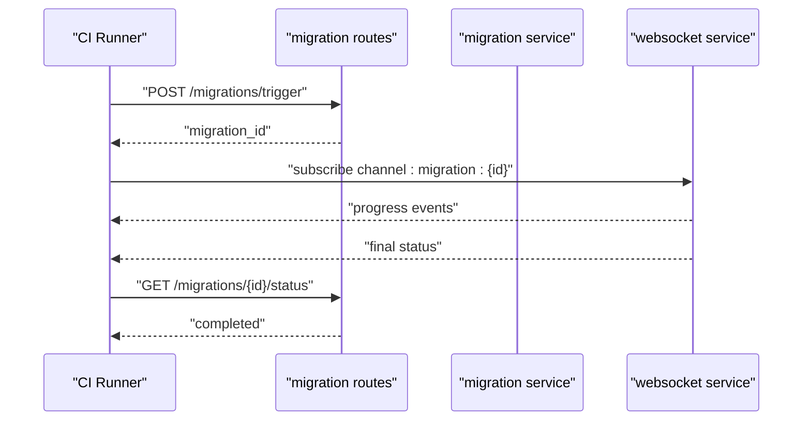
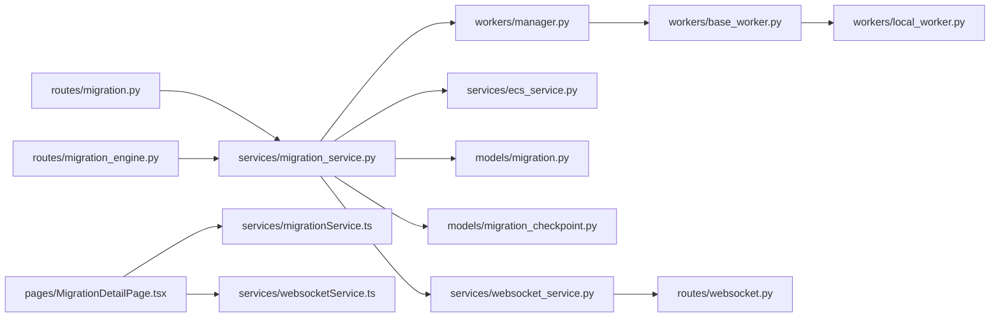

# Migration Execution & Monitoring

<cite>
**Referenced Files in This Document**
- [backend/app/routes/migration.py](file://backend/app/routes/migration.py)
- [backend/app/routes/migration_engine.py](file://backend/app/routes/migration_engine.py)
- [backend/app/services/migration_service.py](file://backend/app/services/migration_service.py)
- [backend/app/models/migration.py](file://backend/app/models/migration.py)
- [backend/app/models/migration_checkpoint.py](file://backend/app/models/migration_checkpoint.py)
- [backend/app/workers/base_worker.py](file://backend/app/workers/base_worker.py)
- [backend/app/workers/local_worker.py](file://backend/app/workers/local_worker.py)
- [backend/app/workers/manager.py](file://backend/app/workers/manager.py)
- [backend/app/routes/websocket.py](file://backend/app/routes/websocket.py)
- [backend/app/services/websocket_service.py](file://backend/app/services/websocket_service.py)
- [backend/app/services/ecs_service.py](file://backend/app/services/ecs_service.py)
- [backend/app/exceptions/migration.py](file://backend/app/exceptions/migration.py)
- [backend/app/logging.py](file://backend/app/logging.py)
- [backend/app/config.py](file://backend/app/config.py)
- [backend/run.py](file://backend/run.py)
- [frontend/src/pages/MigrationDetailPage.tsx](file://frontend/src/pages/MigrationDetailPage.tsx)
- [frontend/src/components/migrations/StatusBadge.tsx](file://frontend/src/components/migrations/StatusBadge.tsx)
- [frontend/src/components/ui/ProgressBar.tsx](file://frontend/src/components/ui/ProgressBar.tsx)
- [frontend/src/services/migrationService.ts](file://frontend/src/services/migrationService.ts)
- [frontend/src/services/websocketService.ts](file://frontend/src/services/websocketService.ts)
</cite>

## Table of Contents
1. [Introduction](#introduction)
2. [Project Structure](#project-structure)
3. [Core Components](#core-components)
4. [Architecture Overview](#architecture-overview)
5. [Detailed Component Analysis](#detailed-component-analysis)
6. [Dependency Analysis](#dependency-analysis)
7. [Performance Considerations](#performance-considerations)
8. [Troubleshooting Guide](#troubleshooting-guide)
9. [Conclusion](#conclusion)
10. [Appendices](#appendices)

## Introduction
This document explains the migration execution engine and monitoring capabilities, focusing on how migrations are triggered, scheduled, executed with dependency resolution and parallelism, and observed in real time via WebSockets. It covers error handling, retries, failure recovery, performance monitoring, logging, debugging, and operational patterns for development, staging, and production environments, including batch execution and CI/CD integration.

## Project Structure
The backend implements a REST API to orchestrate migrations, a worker subsystem for execution, and WebSocket endpoints for live progress streaming. The frontend provides UI components for status visualization and real-time updates.

**Diagram sources**
- [backend/app/routes/migration.py](file://backend/app/routes/migration.py)
- [backend/app/routes/migration_engine.py](file://backend/app/routes/migration_engine.py)
- [backend/app/services/migration_service.py](file://backend/app/services/migration_service.py)
- [backend/app/workers/manager.py](file://backend/app/workers/manager.py)
- [backend/app/workers/base_worker.py](file://backend/app/workers/base_worker.py)
- [backend/app/workers/local_worker.py](file://backend/app/workers/local_worker.py)
- [backend/app/routes/websocket.py](file://backend/app/routes/websocket.py)
- [backend/app/services/websocket_service.py](file://backend/app/services/websocket_service.py)
- [backend/app/models/migration.py](file://backend/app/models/migration.py)
- [backend/app/models/migration_checkpoint.py](file://backend/app/models/migration_checkpoint.py)
- [backend/app/services/ecs_service.py](file://backend/app/services/ecs_service.py)
- [backend/app/logging.py](file://backend/app/logging.py)
- [backend/app/config.py](file://backend/app/config.py)
- [frontend/src/pages/MigrationDetailPage.tsx](file://frontend/src/pages/MigrationDetailPage.tsx)
- [frontend/src/components/migrations/StatusBadge.tsx](file://frontend/src/components/migrations/StatusBadge.tsx)
- [frontend/src/components/ui/ProgressBar.tsx](file://frontend/src/components/ui/ProgressBar.tsx)
- [frontend/src/services/migrationService.ts](file://frontend/src/services/migrationService.ts)
- [frontend/src/services/websocketService.ts](file://frontend/src/services/websocketService.ts)

**Section sources**
- [backend/app/routes/migration.py](file://backend/app/routes/migration.py)
- [backend/app/routes/migration_engine.py](file://backend/app/routes/migration_engine.py)
- [backend/app/services/migration_service.py](file://backend/app/services/migration_service.py)
- [backend/app/workers/manager.py](file://backend/app/workers/manager.py)
- [backend/app/workers/base_worker.py](file://backend/app/workers/base_worker.py)
- [backend/app/workers/local_worker.py](file://backend/app/workers/local_worker.py)
- [backend/app/routes/websocket.py](file://backend/app/routes/websocket.py)
- [backend/app/services/websocket_service.py](file://backend/app/services/websocket_service.py)
- [backend/app/models/migration.py](file://backend/app/models/migration.py)
- [backend/app/models/migration_checkpoint.py](file://backend/app/models/migration_checkpoint.py)
- [backend/app/services/ecs_service.py](file://backend/app/services/ecs_service.py)
- [backend/app/logging.py](file://backend/app/logging.py)
- [backend/app/config.py](file://backend/app/config.py)
- [frontend/src/pages/MigrationDetailPage.tsx](file://frontend/src/pages/MigrationDetailPage.tsx)
- [frontend/src/components/migrations/StatusBadge.tsx](file://frontend/src/components/migrations/StatusBadge.tsx)
- [frontend/src/components/ui/ProgressBar.tsx](file://frontend/src/components/ui/ProgressBar.tsx)
- [frontend/src/services/migrationService.ts](file://frontend/src/services/migrationService.ts)
- [frontend/src/services/websocketService.ts](file://frontend/src/services/websocketService.ts)

## Core Components
- Migration routes: Expose REST endpoints to create, list, trigger, and inspect migrations.
- Migration service: Orchestrates dependency resolution, scheduling, checkpointing, and event emission.
- Worker manager: Dispatches tasks to workers (local or ECS), manages concurrency and lifecycle.
- Base worker and local worker: Define execution contract and provide a local executor.
- Models: Persist migration state and checkpoints for resiliency.
- WebSocket layer: Streams progress events to clients.
- ECS service: Optional remote execution target for scalable runs.
- Logging and config: Centralized structured logging and environment-driven behavior.

Key responsibilities:
- Dependency graph construction and topological ordering
- Parallel execution within constraints
- Real-time progress via WebSocket events
- Checkpoint-based resume and rollback support
- Observability through logs and metrics

**Section sources**
- [backend/app/routes/migration.py](file://backend/app/routes/migration.py)
- [backend/app/services/migration_service.py](file://backend/app/services/migration_service.py)
- [backend/app/workers/manager.py](file://backend/app/workers/manager.py)
- [backend/app/workers/base_worker.py](file://backend/app/workers/base_worker.py)
- [backend/app/workers/local_worker.py](file://backend/app/workers/local_worker.py)
- [backend/app/models/migration.py](file://backend/app/models/migration.py)
- [backend/app/models/migration_checkpoint.py](file://backend/app/models/migration_checkpoint.py)
- [backend/app/routes/websocket.py](file://backend/app/routes/websocket.py)
- [backend/app/services/websocket_service.py](file://backend/app/services/websocket_service.py)
- [backend/app/services/ecs_service.py](file://backend/app/services/ecs_service.py)
- [backend/app/logging.py](file://backend/app/logging.py)
- [backend/app/config.py](file://backend/app/config.py)

## Architecture Overview
End-to-end flow from trigger to completion:

**Diagram sources**
- [backend/app/routes/migration.py](file://backend/app/routes/migration.py)
- [backend/app/services/migration_service.py](file://backend/app/services/migration_service.py)
- [backend/app/workers/manager.py](file://backend/app/workers/manager.py)
- [backend/app/workers/base_worker.py](file://backend/app/workers/base_worker.py)
- [backend/app/workers/local_worker.py](file://backend/app/workers/local_worker.py)
- [backend/app/services/websocket_service.py](file://backend/app/services/websocket_service.py)
- [backend/app/models/migration.py](file://backend/app/models/migration.py)
- [backend/app/models/migration_checkpoint.py](file://backend/app/models/migration_checkpoint.py)

## Detailed Component Analysis

### Migration Service Orchestration
Responsibilities:
- Build dependency graph from migration definitions
- Resolve order using topological sort
- Enqueue tasks into worker manager respecting concurrency limits
- Emit lifecycle and progress events via WebSocket service
- Persist state transitions and checkpoints for resilience

**Diagram sources**
- [backend/app/services/migration_service.py](file://backend/app/services/migration_service.py)
- [backend/app/models/migration.py](file://backend/app/models/migration.py)
- [backend/app/models/migration_checkpoint.py](file://backend/app/models/migration_checkpoint.py)
- [backend/app/services/websocket_service.py](file://backend/app/services/websocket_service.py)

**Section sources**
- [backend/app/services/migration_service.py](file://backend/app/services/migration_service.py)
- [backend/app/models/migration.py](file://backend/app/models/migration.py)
- [backend/app/models/migration_checkpoint.py](file://backend/app/models/migration_checkpoint.py)
- [backend/app/services/websocket_service.py](file://backend/app/services/websocket_service.py)

### Worker Manager and Local Worker
Worker manager:
- Maintains a task queue and dispatches to available workers
- Tracks task IDs and correlates them with migration instances
- Supports scaling by routing to ECS when configured

Local worker:
- Implements the base worker interface
- Executes migration steps sequentially or in parallel based on configuration
- Writes checkpoints after each step and emits progress events

**Diagram sources**
- [backend/app/workers/manager.py](file://backend/app/workers/manager.py)
- [backend/app/workers/base_worker.py](file://backend/app/workers/base_worker.py)
- [backend/app/workers/local_worker.py](file://backend/app/workers/local_worker.py)

**Section sources**
- [backend/app/workers/manager.py](file://backend/app/workers/manager.py)
- [backend/app/workers/base_worker.py](file://backend/app/workers/base_worker.py)
- [backend/app/workers/local_worker.py](file://backend/app/workers/local_worker.py)

### WebSocket Progress Streaming
Real-time updates:
- Server-side emitter pushes events for lifecycle and per-step progress
- Clients subscribe to channels keyed by migration ID
- Frontend renders live progress bars and status badges

**Diagram sources**
- [backend/app/routes/websocket.py](file://backend/app/routes/websocket.py)
- [backend/app/services/websocket_service.py](file://backend/app/services/websocket_service.py)
- [backend/app/services/migration_service.py](file://backend/app/services/migration_service.py)
- [frontend/src/pages/MigrationDetailPage.tsx](file://frontend/src/pages/MigrationDetailPage.tsx)
- [frontend/src/services/websocketService.ts](file://frontend/src/services/websocketService.ts)

**Section sources**
- [backend/app/routes/websocket.py](file://backend/app/routes/websocket.py)
- [backend/app/services/websocket_service.py](file://backend/app/services/websocket_service.py)
- [backend/app/services/migration_service.py](file://backend/app/services/migration_service.py)
- [frontend/src/pages/MigrationDetailPage.tsx](file://frontend/src/pages/MigrationDetailPage.tsx)
- [frontend/src/services/websocketService.ts](file://frontend/src/services/websocketService.ts)

### Error Handling, Retries, and Recovery
Error handling:
- Exceptions are raised during validation, execution, and external calls
- Errors are logged with context and surfaced via API responses and WebSocket events

Retry mechanisms:
- Per-step retry policy is applied around transient failures
- Backoff strategy prevents overload during repeated failures

Failure recovery:
- Checkpoints record step-level progress
- On restart, the engine resumes from last successful checkpoint
- Rollback paths can be invoked if post-execution checks fail

**Diagram sources**
- [backend/app/workers/base_worker.py](file://backend/app/workers/base_worker.py)
- [backend/app/workers/local_worker.py](file://backend/app/workers/local_worker.py)
- [backend/app/models/migration_checkpoint.py](file://backend/app/models/migration_checkpoint.py)
- [backend/app/exceptions/migration.py](file://backend/app/exceptions/migration.py)

**Section sources**
- [backend/app/workers/base_worker.py](file://backend/app/workers/base_worker.py)
- [backend/app/workers/local_worker.py](file://backend/app/workers/local_worker.py)
- [backend/app/models/migration_checkpoint.py](file://backend/app/models/migration_checkpoint.py)
- [backend/app/exceptions/migration.py](file://backend/app/exceptions/migration.py)

### Batch Execution and Scheduling
Batch execution:
- Multiple migration IDs can be submitted in a single request
- Each migration is independently scheduled and tracked
- Aggregated status is exposed via list/detail endpoints

Scheduling:
- Cron-like triggers can enqueue migrations at defined intervals
- Scheduler integrates with worker manager to distribute load

**Diagram sources**
- [backend/app/routes/migration.py](file://backend/app/routes/migration.py)
- [backend/app/services/migration_service.py](file://backend/app/services/migration_service.py)
- [backend/app/workers/manager.py](file://backend/app/workers/manager.py)

**Section sources**
- [backend/app/routes/migration.py](file://backend/app/routes/migration.py)
- [backend/app/services/migration_service.py](file://backend/app/services/migration_service.py)
- [backend/app/workers/manager.py](file://backend/app/workers/manager.py)

### CI/CD Integration Patterns
- Use REST endpoints to trigger migrations from pipelines
- Poll status or subscribe to WebSocket events for real-time feedback
- Gate deployments on successful migration completion
- Store artifacts (e.g., migration run IDs) for traceability

**Diagram sources**
- [backend/app/routes/migration.py](file://backend/app/routes/migration.py)
- [backend/app/services/migration_service.py](file://backend/app/services/migration_service.py)
- [backend/app/services/websocket_service.py](file://backend/app/services/websocket_service.py)

**Section sources**
- [backend/app/routes/migration.py](file://backend/app/routes/migration.py)
- [backend/app/services/migration_service.py](file://backend/app/services/migration_service.py)
- [backend/app/services/websocket_service.py](file://backend/app/services/websocket_service.py)

### Environment-Specific Execution Examples
- Development:
  - Use local worker for fast iteration
  - Enable verbose logging and relaxed concurrency
- Staging:
  - Mirror production settings; consider ECS for realistic scale
  - Tighter concurrency and stricter retry policies
- Production:
  - Prefer ECS-backed workers for horizontal scaling
  - Conservative concurrency, robust backoff, and comprehensive alerting

Configuration knobs:
- Concurrency limits
- Retry counts and backoff multipliers
- Target runner (local vs ECS)
- Logging verbosity and sampling rates

**Section sources**
- [backend/app/config.py](file://backend/app/config.py)
- [backend/app/workers/local_worker.py](file://backend/app/workers/local_worker.py)
- [backend/app/services/ecs_service.py](file://backend/app/services/ecs_service.py)
- [backend/app/logging.py](file://backend/app/logging.py)

## Dependency Analysis
High-level module relationships:

**Diagram sources**
- [backend/app/routes/migration.py](file://backend/app/routes/migration.py)
- [backend/app/routes/migration_engine.py](file://backend/app/routes/migration_engine.py)
- [backend/app/services/migration_service.py](file://backend/app/services/migration_service.py)
- [backend/app/workers/manager.py](file://backend/app/workers/manager.py)
- [backend/app/workers/base_worker.py](file://backend/app/workers/base_worker.py)
- [backend/app/workers/local_worker.py](file://backend/app/workers/local_worker.py)
- [backend/app/services/ecs_service.py](file://backend/app/services/ecs_service.py)
- [backend/app/models/migration.py](file://backend/app/models/migration.py)
- [backend/app/models/migration_checkpoint.py](file://backend/app/models/migration_checkpoint.py)
- [backend/app/services/websocket_service.py](file://backend/app/services/websocket_service.py)
- [backend/app/routes/websocket.py](file://backend/app/routes/websocket.py)
- [frontend/src/pages/MigrationDetailPage.tsx](file://frontend/src/pages/MigrationDetailPage.tsx)
- [frontend/src/services/migrationService.ts](file://frontend/src/services/migrationService.ts)
- [frontend/src/services/websocketService.ts](file://frontend/src/services/websocketService.ts)

**Section sources**
- [backend/app/routes/migration.py](file://backend/app/routes/migration.py)
- [backend/app/routes/migration_engine.py](file://backend/app/routes/migration_engine.py)
- [backend/app/services/migration_service.py](file://backend/app/services/migration_service.py)
- [backend/app/workers/manager.py](file://backend/app/workers/manager.py)
- [backend/app/workers/base_worker.py](file://backend/app/workers/base_worker.py)
- [backend/app/workers/local_worker.py](file://backend/app/workers/local_worker.py)
- [backend/app/services/ecs_service.py](file://backend/app/services/ecs_service.py)
- [backend/app/models/migration.py](file://backend/app/models/migration.py)
- [backend/app/models/migration_checkpoint.py](file://backend/app/models/migration_checkpoint.py)
- [backend/app/services/websocket_service.py](file://backend/app/services/websocket_service.py)
- [backend/app/routes/websocket.py](file://backend/app/routes/websocket.py)
- [frontend/src/pages/MigrationDetailPage.tsx](file://frontend/src/pages/MigrationDetailPage.tsx)
- [frontend/src/services/migrationService.ts](file://frontend/src/services/migrationService.ts)
- [frontend/src/services/websocketService.ts](file://frontend/src/services/websocketService.ts)

## Performance Considerations
- Concurrency tuning:
  - Adjust worker pool size and per-migration parallelism based on resource capacity
- Checkpoint granularity:
  - Finer-grained checkpoints improve recovery but add overhead; balance frequency with step duration
- Event throughput:
  - Throttle WebSocket emissions for high-frequency steps to avoid client overload
- External calls:
  - Implement timeouts and circuit breakers for database and cloud service interactions
- ECS scaling:
  - Scale out ECS tasks for large batches; monitor task CPU/memory utilization

[No sources needed since this section provides general guidance]

## Troubleshooting Guide
Common issues and diagnostics:
- Stalled migrations:
  - Inspect latest checkpoint and worker logs
  - Verify WebSocket connectivity and subscription channels
- Frequent retries:
  - Review backoff settings and transient error patterns
  - Check downstream service health and rate limits
- Partial rollbacks:
  - Confirm rollback path availability and idempotency
  - Re-run from last successful checkpoint after fixing root cause

Operational tools:
- Structured logs with correlation IDs
- Health and readiness endpoints
- Metrics collection for queue depth, latency, and error rates

**Section sources**
- [backend/app/logging.py](file://backend/app/logging.py)
- [backend/app/exceptions/migration.py](file://backend/app/exceptions/migration.py)
- [backend/app/models/migration_checkpoint.py](file://backend/app/models/migration_checkpoint.py)
- [backend/app/workers/base_worker.py](file://backend/app/workers/base_worker.py)

## Conclusion
The migration execution engine combines robust orchestration, resilient workers, and real-time observability to deliver reliable schema changes across environments. With dependency resolution, parallel processing, checkpointed recovery, and WebSocket-driven monitoring, it supports both interactive operations and automated CI/CD workflows. Proper configuration and observability practices ensure safe, predictable migrations at scale.

## Appendices

### Frontend Status Visualization
- StatusBadge displays current migration state
- ProgressBar reflects cumulative progress across steps
- MigrationDetailPage subscribes to WebSocket events and polls REST for details

**Section sources**
- [frontend/src/components/migrations/StatusBadge.tsx](file://frontend/src/components/migrations/StatusBadge.tsx)
- [frontend/src/components/ui/ProgressBar.tsx](file://frontend/src/components/ui/ProgressBar.tsx)
- [frontend/src/pages/MigrationDetailPage.tsx](file://frontend/src/pages/MigrationDetailPage.tsx)
- [frontend/src/services/migrationService.ts](file://frontend/src/services/migrationService.ts)
- [frontend/src/services/websocketService.ts](file://frontend/src/services/websocketService.ts)

### Application Entry Point
- Backend startup wires routes, services, workers, and WebSocket handlers
- Configuration loading sets runtime behavior for different environments

**Section sources**
- [backend/run.py](file://backend/run.py)
- [backend/app/config.py](file://backend/app/config.py)