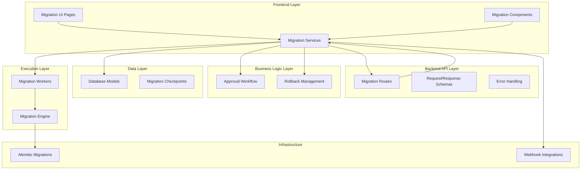
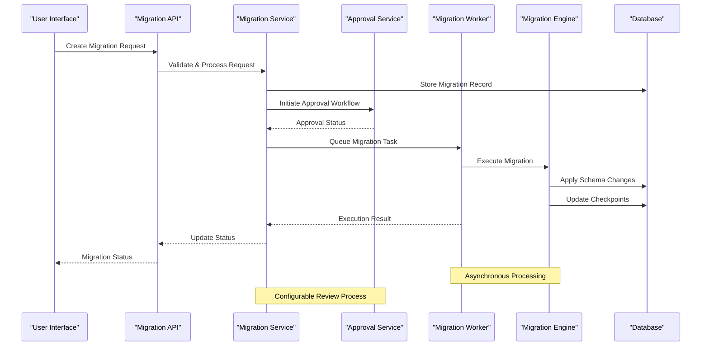
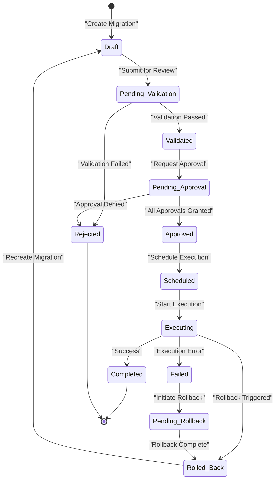
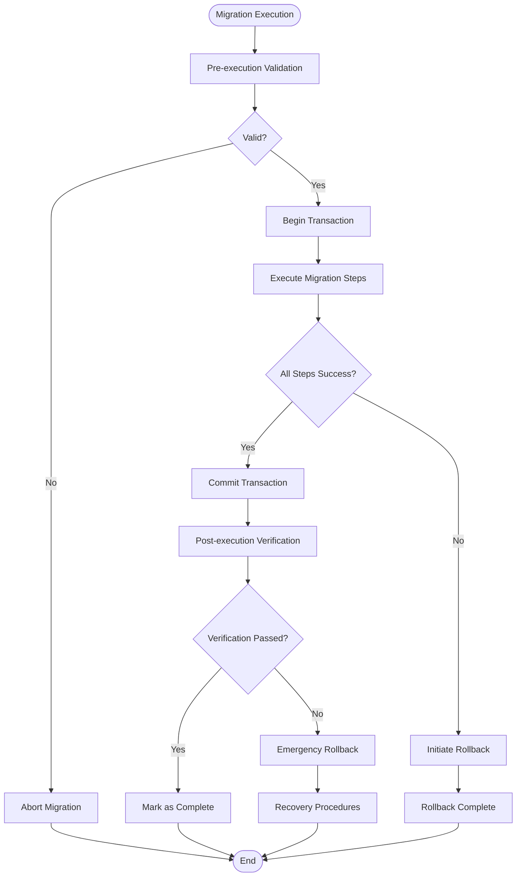
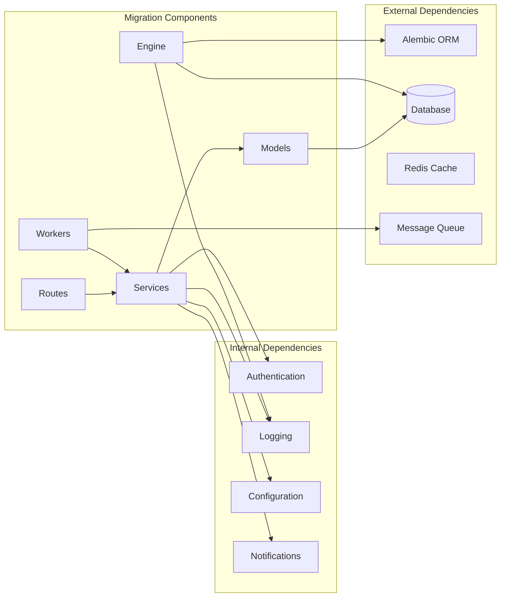

# Migration Management

<cite>
**Referenced Files in This Document**
- [backend/app/models/migration.py](file://backend/app/models/migration.py)
- [backend/app/models/migration_checkpoint.py](file://backend/app/models/migration_checkpoint.py)
- [backend/app/services/migration_service.py](file://backend/app/services/migration_service.py)
- [backend/app/routes/migration.py](file://backend/app/routes/migration.py)
- [backend/app/schemas/migration.py](file://backend/app/schemas/migration.py)
- [backend/app/exceptions/migration.py](file://backend/app/exceptions/migration.py)
- [backend/app/exceptions/rollback.py](file://backend/app/exceptions/rollback.py)
- [backend/app/exceptions/schema_approval.py](file://backend/app/exceptions/schema_approval.py)
- [backend/app/routes/migration_engine.py](file://backend/app/routes/migration_engine.py)
- [backend/app/routes/schema_approval.py](file://backend/app/routes/schema_approval.py)
- [backend/app/services/schema_approval_service.py](file://backend/app/services/schema_approval_service.py)
- [backend/app/services/rollback_service.py](file://backend/app/services/rollback_service.py)
- [backend/app/workers/base_worker.py](file://backend/app/workers/base_worker.py)
- [backend/app/workers/local_worker.py](file://backend/app/workers/local_worker.py)
- [backend/app/workers/manager.py](file://backend/app/workers/manager.py)
- [backend/migrations/env.py](file://backend/migrations/env.py)
- [backend/migrations/script.py.mako](file://backend/migrations/script.py.mako)
- [backend/tests/test_migrations.py](file://backend/tests/test_migrations.py)
- [frontend/src/pages/MigrationListPage.tsx](file://frontend/src/pages/MigrationListPage.tsx)
- [frontend/src/pages/MigrationDetailPage.tsx](file://frontend/src/pages/MigrationDetailPage.tsx)
- [frontend/src/pages/MigrationCreatePage.tsx](file://frontend/src/pages/MigrationCreatePage.tsx)
- [frontend/src/components/migrations/MigrationForm.tsx](file://frontend/src/components/migrations/MigrationForm.tsx)
- [frontend/src/services/migrationService.ts](file://frontend/src/services/migrationService.ts)
</cite>

## Table of Contents
1. [Introduction](#introduction)
2. [Project Structure](#project-structure)
3. [Core Components](#core-components)
4. [Architecture Overview](#architecture-overview)
5. [Detailed Component Analysis](#detailed-component-analysis)
6. [Dependency Analysis](#dependency-analysis)
7. [Performance Considerations](#performance-considerations)
8. [Troubleshooting Guide](#troubleshooting-guide)
9. [Conclusion](#conclusion)
10. [Appendices](#appendices)

## Introduction

CloudBridge's Migration Management system provides a comprehensive solution for managing database schema changes, data transformations, and infrastructure updates throughout their lifecycle. The system implements a robust workflow from creation to deployment, featuring version control, validation, testing, approval processes, and automated execution with rollback capabilities.

The migration system supports both simple schema modifications and complex data transformations while maintaining data integrity and providing comprehensive audit trails. It integrates seamlessly with CI/CD pipelines through webhook support and offers both programmatic APIs and a user-friendly interface for migration management.

## Project Structure

The migration management functionality is distributed across multiple layers in the CloudBridge architecture:



**Diagram sources**
- [backend/app/routes/migration.py](file://backend/app/routes/migration.py)
- [backend/app/services/migration_service.py](file://backend/app/services/migration_service.py)
- [backend/app/workers/manager.py](file://backend/app/workers/manager.py)
- [backend/migrations/env.py](file://backend/migrations/env.py)

**Section sources**
- [backend/app/routes/migration.py](file://backend/app/routes/migration.py)
- [backend/app/services/migration_service.py](file://backend/app/services/migration_service.py)
- [backend/app/workers/manager.py](file://backend/app/workers/manager.py)

## Core Components

### Migration Data Model

The core migration model defines the structure and state management for all migrations within the system. It tracks migration metadata, execution status, and audit information.

Key attributes include:
- Unique migration identifiers and versioning
- Execution status tracking (pending, approved, executing, completed, failed, rolled back)
- Metadata including author, description, and type
- Checkpoint information for recovery
- Audit trail with timestamps and user information

### Migration Service Layer

The migration service orchestrates the complete migration lifecycle, handling business logic, validation, and coordination between different components. It manages:

- Migration creation and validation
- Approval workflow coordination
- Execution scheduling and monitoring
- Error handling and recovery
- Integration with external systems

### Worker System

CloudBridge uses a worker-based architecture for asynchronous migration execution. The worker system ensures reliable processing of long-running migration tasks while providing progress tracking and failure recovery.

**Section sources**
- [backend/app/models/migration.py](file://backend/app/models/migration.py)
- [backend/app/services/migration_service.py](file://backend/app/services/migration_service.py)
- [backend/app/workers/base_worker.py](file://backend/app/workers/base_worker.py)

## Architecture Overview

The migration management system follows a layered architecture pattern with clear separation of concerns:



**Diagram sources**
- [backend/app/routes/migration.py](file://backend/app/routes/migration.py)
- [backend/app/services/migration_service.py](file://backend/app/services/migration_service.py)
- [backend/app/services/schema_approval_service.py](file://backend/app/services/schema_approval_service.py)
- [backend/app/workers/manager.py](file://backend/app/workers/manager.py)

## Detailed Component Analysis

### Migration Lifecycle Management

The migration lifecycle encompasses several distinct phases, each with specific validation rules and state transitions:

#### Creation Phase
- Migration definition and validation
- Dependency checking and conflict resolution
- Initial checkpoint creation
- Version control integration

#### Validation Phase
- Syntax and semantic validation
- Schema compatibility checks
- Performance impact analysis
- Security review requirements

#### Approval Phase
- Configurable review workflows
- Automated check integration
- Stakeholder notifications
- Approval decision tracking

#### Execution Phase
- Pre-execution validation
- Transaction management
- Progress tracking
- Error handling and recovery

#### Post-Execution Phase
- Verification and validation
- Cleanup operations
- Audit logging
- Notification dispatch



**Diagram sources**
- [backend/app/models/migration.py](file://backend/app/models/migration.py)
- [backend/app/services/migration_service.py](file://backend/app/services/migration_service.py)

### Approval Workflow System

The approval workflow system provides configurable review processes with support for multiple approvers, conditional approvals, and automated checks:

#### Configuration Options
- Approvers and reviewer groups
- Approval thresholds and quorum requirements
- Timeout and escalation policies
- Conditional approval rules

#### Automated Checks Integration
- Schema validation tests
- Performance benchmarking
- Security scanning
- Compliance verification

#### Notification System
- Email and in-app notifications
- Slack/Teams integration
- Escalation alerts
- Status updates

**Section sources**
- [backend/app/services/schema_approval_service.py](file://backend/app/services/schema_approval_service.py)
- [backend/app/routes/schema_approval.py](file://backend/app/routes/schema_approval.py)
- [backend/app/exceptions/schema_approval.py](file://backend/app/exceptions/schema_approval.py)

### Migration File Structure and Conventions

CloudBridge follows established conventions for migration file organization and naming:

#### Directory Structure
```
migrations/
├── versions/
│   ├── 001_initial_schema.py
│   ├── 002_add_user_table.py
│   └── 003_create_audit_log.py
├── env.py
└── script.py.mako
```

#### Naming Conventions
- Sequential numbering with zero-padding
- Descriptive action-oriented names
- Semantic versioning support
- Branch-specific prefixes when needed

#### Migration File Structure
Each migration file contains:
- Up function for forward migration
- Down function for rollback
- Dependencies declaration
- Metadata and comments
- Atomic transaction wrapping

**Section sources**
- [backend/migrations/env.py](file://backend/migrations/env.py)
- [backend/migrations/script.py.mako](file://backend/migrations/script.py.mako)

### Rollback Mechanisms and Error Recovery

The rollback system provides comprehensive error handling and recovery capabilities:

#### Automatic Rollback Triggers
- Constraint violations
- Data integrity failures
- Performance threshold breaches
- External service unavailability

#### Manual Rollback Controls
- Selective rollback options
- Partial rollback support
- Rollback preview and dry-run
- Emergency rollback procedures

#### Recovery Procedures
- State reconciliation
- Data consistency verification
- Audit trail maintenance
- Incident response automation



**Diagram sources**
- [backend/app/services/rollback_service.py](file://backend/app/services/rollback_service.py)
- [backend/app/exceptions/rollback.py](file://backend/app/exceptions/rollback.py)

**Section sources**
- [backend/app/services/rollback_service.py](file://backend/app/services/rollback_service.py)
- [backend/app/exceptions/rollback.py](file://backend/app/exceptions/rollback.py)

### API Endpoints for Programmatic Management

The migration system exposes comprehensive RESTful APIs for programmatic management:

#### Core Migration Operations
- `POST /api/migrations` - Create new migration
- `GET /api/migrations` - List all migrations
- `GET /api/migrations/{id}` - Get migration details
- `PUT /api/migrations/{id}` - Update migration
- `DELETE /api/migrations/{id}` - Delete migration

#### Execution Control
- `POST /api/migrations/{id}/validate` - Validate migration
- `POST /api/migrations/{id}/approve` - Approve migration
- `POST /api/migrations/{id}/execute` - Execute migration
- `POST /api/migrations/{id}/rollback` - Rollback migration

#### Monitoring and Status
- `GET /api/migrations/{id}/status` - Get execution status
- `GET /api/migrations/{id}/logs` - Get execution logs
- `GET /api/migrations/{id}/checkpoints` - Get checkpoints

#### Approval Workflow
- `POST /api/approvals/{id}/review` - Submit approval review
- `GET /api/approvals/pending` - List pending approvals
- `POST /api/approvals/{id}/escalate` - Escalate approval

**Section sources**
- [backend/app/routes/migration.py](file://backend/app/routes/migration.py)
- [backend/app/routes/migration_engine.py](file://backend/app/routes/migration_engine.py)
- [backend/app/routes/schema_approval.py](file://backend/app/routes/schema_approval.py)

### Webhook Integrations for CI/CD Pipelines

CloudBridge supports webhook integrations for seamless CI/CD pipeline integration:

#### Event Types
- Migration created
- Migration validated
- Approval requested
- Approval granted/denied
- Migration started
- Migration completed
- Migration failed
- Rollback initiated

#### Webhook Configuration
- Endpoint registration and management
- Authentication and security
- Retry and timeout policies
- Payload customization

#### CI/CD Integration Examples
- GitHub Actions integration
- Jenkins pipeline steps
- GitLab CI/CD configuration
- Custom webhook handlers

**Section sources**
- [backend/app/routes/migration.py](file://backend/app/routes/migration.py)
- [backend/app/services/notification_service.py](file://backend/app/services/notification_service.py)

## Dependency Analysis

The migration system has well-defined dependencies and clear separation of concerns:



**Diagram sources**
- [backend/app/models/migration.py](file://backend/app/models/migration.py)
- [backend/app/services/migration_service.py](file://backend/app/services/migration_service.py)
- [backend/app/workers/manager.py](file://backend/app/workers/manager.py)

**Section sources**
- [backend/app/models/migration.py](file://backend/app/models/migration.py)
- [backend/app/services/migration_service.py](file://backend/app/services/migration_service.py)
- [backend/app/workers/manager.py](file://backend/app/workers/manager.py)

## Performance Considerations

### Migration Execution Optimization
- Batch processing for large datasets
- Connection pooling and resource management
- Parallel execution where safe
- Memory-efficient streaming operations

### Monitoring and Observability
- Execution time tracking
- Resource utilization monitoring
- Performance regression detection
- Alerting on slow migrations

### Scalability Patterns
- Horizontal scaling of workers
- Distributed locking mechanisms
- Load balancing strategies
- Caching strategies for metadata

## Troubleshooting Guide

### Common Issues and Solutions

#### Migration Conflicts
- **Issue**: Concurrent migration attempts
- **Solution**: Implement proper locking mechanisms and retry logic
- **Prevention**: Use unique migration identifiers and dependency resolution

#### Performance Degradation
- **Issue**: Slow migration execution
- **Solution**: Optimize queries, use batch operations, implement indexing strategies
- **Monitoring**: Track execution times and resource usage

#### Rollback Failures
- **Issue**: Rollback operations failing
- **Solution**: Ensure idempotent down functions, validate rollback paths
- **Recovery**: Manual intervention procedures and data restoration

#### Approval Workflow Stalls
- **Issue**: Approvals not progressing
- **Solution**: Check notification delivery, verify approver availability
- **Escalation**: Automated escalation and fallback mechanisms

### Debugging Tools and Techniques

#### Logging and Auditing
- Comprehensive audit trails
- Structured logging with correlation IDs
- Performance profiling integration
- Error context preservation

#### Diagnostic Endpoints
- Migration health checks
- Worker status monitoring
- Queue depth inspection
- Performance metrics exposure

**Section sources**
- [backend/app/exceptions/migration.py](file://backend/app/exceptions/migration.py)
- [backend/app/logging.py](file://backend/app/logging.py)
- [backend/tests/test_migrations.py](file://backend/tests/test_migrations.py)

## Conclusion

CloudBridge's Migration Management system provides a robust, scalable, and user-friendly solution for managing database and infrastructure changes throughout their lifecycle. The system's comprehensive feature set includes version control, validation, approval workflows, automated execution, and rollback capabilities, ensuring safe and reliable deployments.

The modular architecture enables easy extension and customization while maintaining strong separation of concerns. The extensive API surface and webhook integrations facilitate seamless CI/CD pipeline integration, making it suitable for modern DevOps practices.

Key strengths include:
- Comprehensive lifecycle management with clear state transitions
- Flexible approval workflows with automated checks
- Robust error handling and recovery mechanisms
- Extensive monitoring and observability features
- Strong security and audit capabilities

The system is designed to scale horizontally and handle high-throughput scenarios while maintaining data integrity and providing excellent developer experience through both programmatic APIs and intuitive user interfaces.

## Appendices

### Best Practices for Writing Safe Migrations

#### General Guidelines
- Always write both up and down functions
- Keep migrations small and focused
- Test migrations thoroughly before deployment
- Use transactions for atomicity
- Avoid hard-coded values; use configuration

#### Data Safety
- Backup critical data before migrations
- Test rollback procedures regularly
- Monitor performance impact during development
- Use incremental changes for large datasets

#### Code Quality
- Follow consistent naming conventions
- Add comprehensive comments and documentation
- Include validation and error handling
- Write unit tests for complex logic

### Migration Templates and Examples

#### Schema Change Template
Standard template for table modifications, index additions, and constraint changes.

#### Data Transformation Template
Template for complex data migrations with progress tracking and error handling.

#### Constraint Modification Template
Template for adding, modifying, or removing database constraints safely.

### API Reference Summary

Complete API reference documentation covering all endpoints, request/response formats, authentication requirements, and error codes.

### Configuration Reference

Comprehensive configuration guide covering all migration-related settings, environment variables, and deployment options.