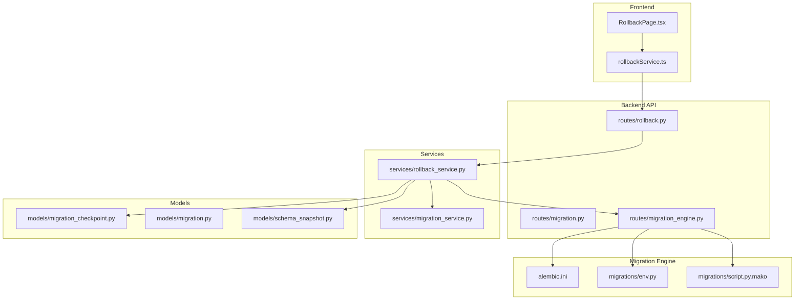
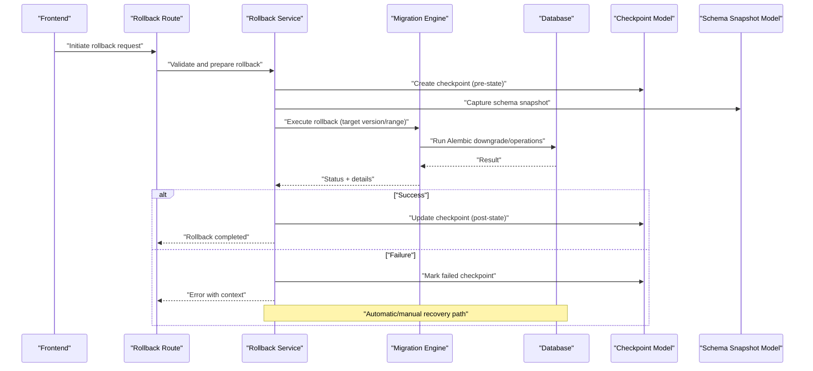
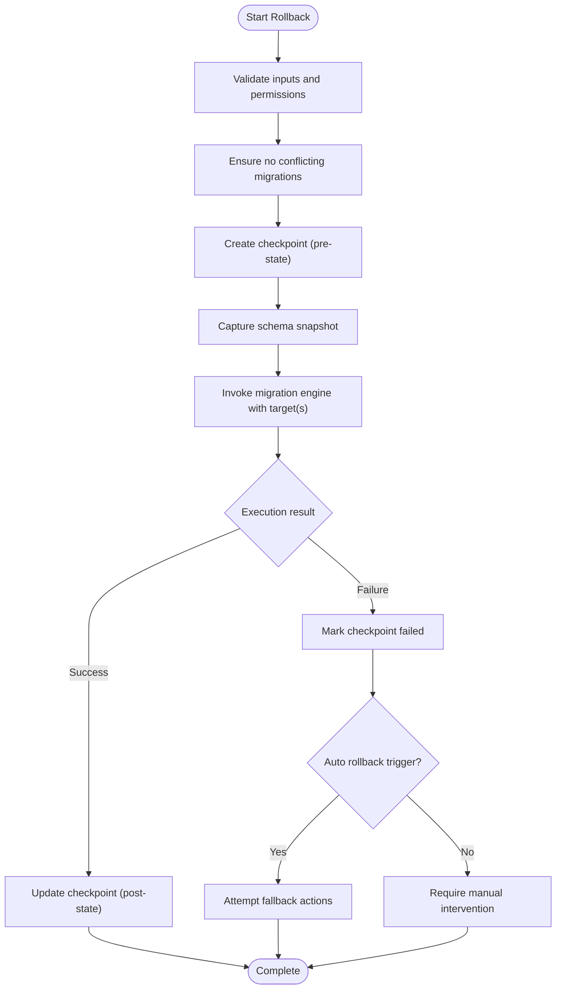
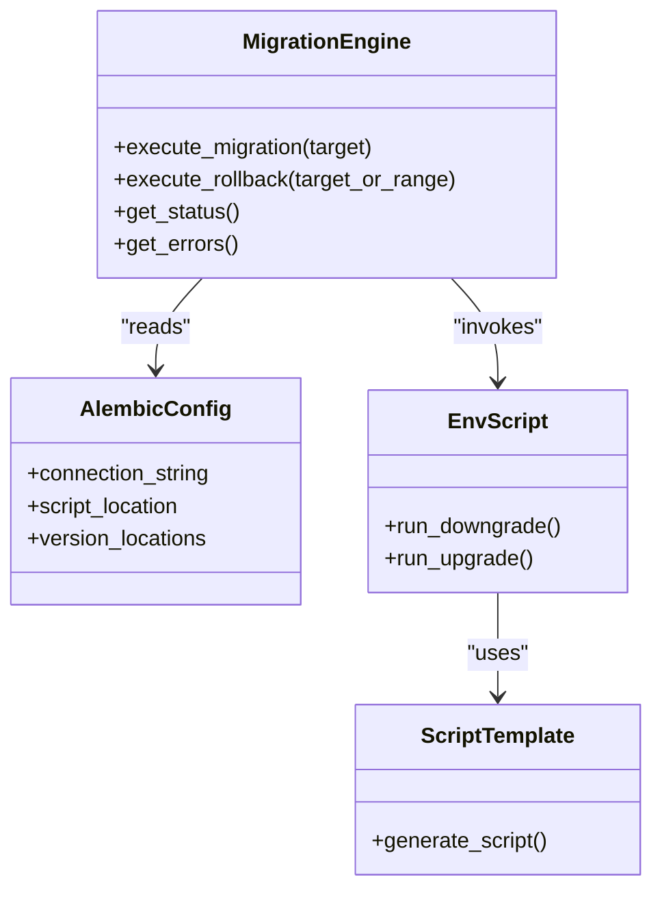
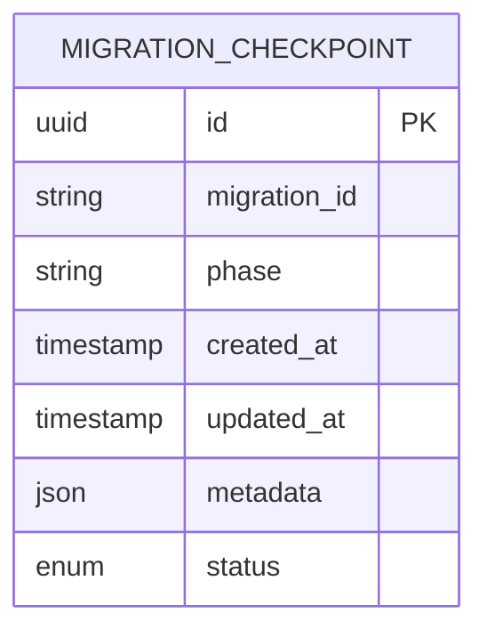
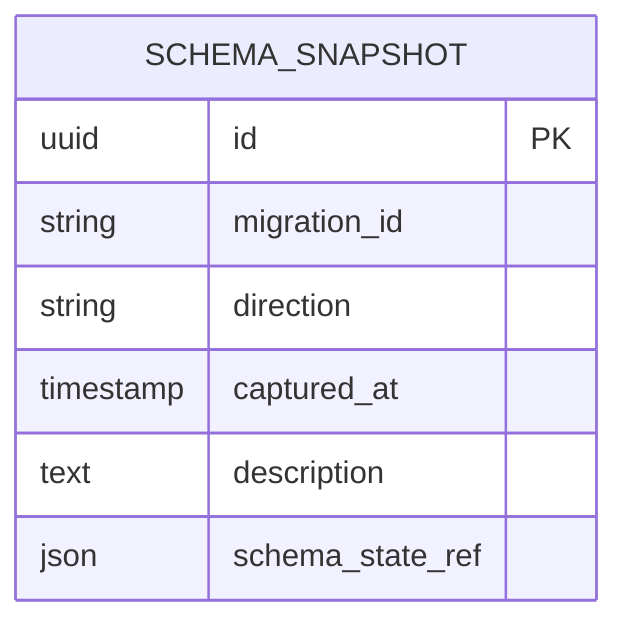
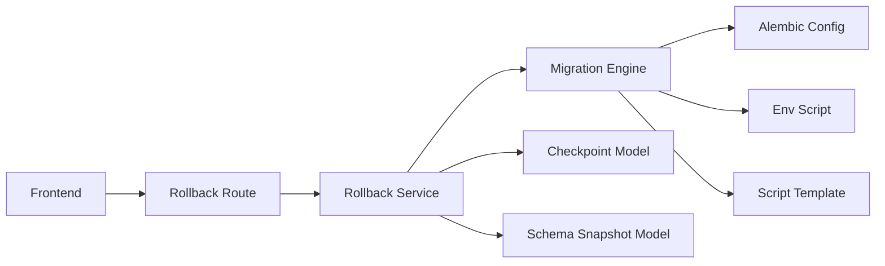

# Rollback & Recovery Mechanisms

<cite>
**Referenced Files in This Document**
- [rollback.py](file://backend/app/exceptions/rollback.py)
- [migration.py](file://backend/app/exceptions/migration.py)
- [rollback_service.py](file://backend/app/services/rollback_service.py)
- [migration_service.py](file://backend/app/services/migration_service.py)
- [rollback.py](file://backend/app/routes/rollback.py)
- [migration.py](file://backend/app/routes/migration.py)
- [migration_engine.py](file://backend/app/routes/migration_engine.py)
- [migration_checkpoint.py](file://backend/app/models/migration_checkpoint.py)
- [migration.py](file://backend/app/models/migration.py)
- [schema_snapshot.py](file://backend/app/models/schema_snapshot.py)
- [alembic.ini](file://backend/alembic.ini)
- [env.py](file://backend/migrations/env.py)
- [script.py.mako](file://backend/migrations/script.py.mako)
- [rollbackService.ts](file://frontend/src/services/rollbackService.ts)
- [RollbackPage.tsx](file://frontend/src/pages/RollbackPage.tsx)
</cite>

## Table of Contents
1. [Introduction](#introduction)
2. [Project Structure](#project-structure)
3. [Core Components](#core-components)
4. [Architecture Overview](#architecture-overview)
5. [Detailed Component Analysis](#detailed-component-analysis)
6. [Dependency Analysis](#dependency-analysis)
7. [Performance Considerations](#performance-considerations)
8. [Troubleshooting Guide](#troubleshooting-guide)
9. [Conclusion](#conclusion)
10. [Appendices](#appendices)

## Introduction
This document explains the rollback and recovery mechanisms for database migrations, focusing on automatic rollback triggers, manual rollback procedures, partial rollbacks, checkpointing for point-in-time recovery, data consistency guarantees, transaction management, atomic operations, post-failure recovery steps, common rollback scenarios, best practices for designing rollback-safe migrations, and backup/disaster recovery strategies tailored to migration workflows.

## Project Structure
The rollback and recovery features span backend services, routes, models, Alembic configuration, and frontend UI components:
- Backend services implement rollback orchestration and integration with the migration engine.
- Routes expose APIs for initiating rollbacks and querying status.
- Models persist checkpoints and snapshots used for recovery.
- Alembic configuration drives migration execution and script generation.
- Frontend provides user interfaces for triggering rollbacks and monitoring progress.

**Diagram sources**
- [rollback.py](file://backend/app/routes/rollback.py)
- [migration.py](file://backend/app/routes/migration.py)
- [migration_engine.py](file://backend/app/routes/migration_engine.py)
- [rollback_service.py](file://backend/app/services/rollback_service.py)
- [migration_service.py](file://backend/app/services/migration_service.py)
- [migration_checkpoint.py](file://backend/app/models/migration_checkpoint.py)
- [schema_snapshot.py](file://backend/app/models/schema_snapshot.py)
- [alembic.ini](file://backend/alembic.ini)
- [env.py](file://backend/migrations/env.py)
- [script.py.mako](file://backend/migrations/script.py.mako)
- [RollbackPage.tsx](file://frontend/src/pages/RollbackPage.tsx)
- [rollbackService.ts](file://frontend/src/services/rollbackService.ts)

**Section sources**
- [rollback.py](file://backend/app/routes/rollback.py)
- [migration.py](file://backend/app/routes/migration.py)
- [migration_engine.py](file://backend/app/routes/migration_engine.py)
- [rollback_service.py](file://backend/app/services/rollback_service.py)
- [migration_service.py](file://backend/app/services/migration_service.py)
- [migration_checkpoint.py](file://backend/app/models/migration_checkpoint.py)
- [schema_snapshot.py](file://backend/app/models/schema_snapshot.py)
- [alembic.ini](file://backend/alembic.ini)
- [env.py](file://backend/migrations/env.py)
- [script.py.mako](file://backend/migrations/script.py.mako)
- [RollbackPage.tsx](file://frontend/src/pages/RollbackPage.tsx)
- [rollbackService.ts](file://frontend/src/services/rollbackService.ts)

## Core Components
- Rollback service orchestrates rollback flows, integrates with the migration engine, persists checkpoints, and manages schema snapshots.
- Migration service coordinates migration lifecycle and interacts with Alembic via the migration engine.
- Migration engine route exposes endpoints that execute migrations and rollbacks using Alembic configuration and environment scripts.
- Checkpoint model tracks migration progress and supports point-in-time recovery.
- Schema snapshot model captures pre/post state for safe restoration.
- Exception classes define domain-specific errors for rollback and migration failures.
- Frontend pages and services provide UI and client-side calls to initiate rollbacks and monitor outcomes.

Key responsibilities:
- Automatic rollback triggers based on failure signals from the migration engine.
- Manual rollback initiation through API/UI.
- Partial rollback by targeting specific versions or ranges.
- Checkpoint persistence for resuming or recovering to a known good state.
- Atomicity and consistency via transactional boundaries where supported.

**Section sources**
- [rollback_service.py](file://backend/app/services/rollback_service.py)
- [migration_service.py](file://backend/app/services/migration_service.py)
- [migration_engine.py](file://backend/app/routes/migration_engine.py)
- [migration_checkpoint.py](file://backend/app/models/migration_checkpoint.py)
- [schema_snapshot.py](file://backend/app/models/schema_snapshot.py)
- [rollback.py](file://backend/app/exceptions/rollback.py)
- [migration.py](file://backend/app/exceptions/migration.py)
- [RollbackPage.tsx](file://frontend/src/pages/RollbackPage.tsx)
- [rollbackService.ts](file://frontend/src/services/rollbackService.ts)

## Architecture Overview
The rollback and recovery architecture centers around a service-driven workflow:
- The frontend invokes rollback endpoints.
- The rollback service validates inputs, creates checkpoints/snapshots, and delegates execution to the migration engine.
- The migration engine executes Alembic commands according to configuration and scripts.
- On success or failure, the rollback service updates checkpoints and returns results.
- In case of failure, automatic rollback may be triggered if configured; otherwise, manual intervention is required.

**Diagram sources**
- [rollback.py](file://backend/app/routes/rollback.py)
- [rollback_service.py](file://backend/app/services/rollback_service.py)
- [migration_engine.py](file://backend/app/routes/migration_engine.py)
- [migration_checkpoint.py](file://backend/app/models/migration_checkpoint.py)
- [schema_snapshot.py](file://backend/app/models/schema_snapshot.py)

## Detailed Component Analysis

### Rollback Service
Responsibilities:
- Validate rollback targets (single version or range).
- Create checkpoints before executing changes.
- Capture schema snapshots for potential restoration.
- Orchestrate execution via the migration engine.
- Handle success/failure paths, including automatic rollback triggers when applicable.
- Persist final state and return actionable results.

Operational flow:
- Input validation and authorization checks.
- Pre-execution safety: ensure no conflicting migrations are running.
- Checkpoint creation and snapshot capture.
- Delegation to migration engine with target specification.
- Post-execution verification and checkpoint update.
- Error propagation and logging.

**Diagram sources**
- [rollback_service.py](file://backend/app/services/rollback_service.py)
- [migration_engine.py](file://backend/app/routes/migration_engine.py)
- [migration_checkpoint.py](file://backend/app/models/migration_checkpoint.py)
- [schema_snapshot.py](file://backend/app/models/schema_snapshot.py)

**Section sources**
- [rollback_service.py](file://backend/app/services/rollback_service.py)
- [migration_engine.py](file://backend/app/routes/migration_engine.py)
- [migration_checkpoint.py](file://backend/app/models/migration_checkpoint.py)
- [schema_snapshot.py](file://backend/app/models/schema_snapshot.py)

### Migration Engine Integration
Responsibilities:
- Provide endpoints to run migrations and rollbacks.
- Use Alembic configuration and environment scripts to execute operations.
- Report detailed status and error information back to callers.

Integration points:
- Reads Alembic configuration for connection and migration metadata.
- Executes downgrade/upgrade commands based on target versions.
- Emits events/logs consumed by the rollback service and observability layers.

**Diagram sources**
- [migration_engine.py](file://backend/app/routes/migration_engine.py)
- [alembic.ini](file://backend/alembic.ini)
- [env.py](file://backend/migrations/env.py)
- [script.py.mako](file://backend/migrations/script.py.mako)

**Section sources**
- [migration_engine.py](file://backend/app/routes/migration_engine.py)
- [alembic.ini](file://backend/alembic.ini)
- [env.py](file://backend/migrations/env.py)
- [script.py.mako](file://backend/migrations/script.py.mako)

### Checkpoint System
Purpose:
- Track migration progress and enable point-in-time recovery.
- Store pre/post states and contextual metadata for each operation.
- Support resumption or rollback to a specific checkpoint.

Key behaviors:
- Creation before any destructive change.
- Updates upon successful completion.
- Failure marking with diagnostic context.
- Queryable history for auditing and recovery decisions.

**Diagram sources**
- [migration_checkpoint.py](file://backend/app/models/migration_checkpoint.py)

**Section sources**
- [migration_checkpoint.py](file://backend/app/models/migration_checkpoint.py)

### Schema Snapshot Model
Purpose:
- Capture schema state before and after migrations.
- Enable restoration to a known-good schema if needed.

Usage:
- Created prior to execution.
- Updated or archived upon completion.
- Referenced during disaster recovery.

**Diagram sources**
- [schema_snapshot.py](file://backend/app/models/schema_snapshot.py)

**Section sources**
- [schema_snapshot.py](file://backend/app/models/schema_snapshot.py)

### Exceptions and Error Handling
Domain exceptions:
- Rollback-specific errors for invalid targets, conflicts, or execution failures.
- Migration-specific errors for dependency issues or constraint violations.

Handling strategy:
- Catch and translate low-level errors into domain exceptions.
- Enrich error context with checkpoint IDs and snapshot references.
- Surface actionable messages to operators.

**Section sources**
- [rollback.py](file://backend/app/exceptions/rollback.py)
- [migration.py](file://backend/app/exceptions/migration.py)

### Frontend Rollback Interface
Capabilities:
- Initiate rollbacks via UI controls.
- Display progress and outcomes.
- Provide links to related checkpoints and snapshots.

Client interactions:
- Calls rollback service endpoints.
- Polls or subscribes to status updates.
- Presents warnings and confirmations for destructive operations.

**Section sources**
- [RollbackPage.tsx](file://frontend/src/pages/RollbackPage.tsx)
- [rollbackService.ts](file://frontend/src/services/rollbackService.ts)

## Dependency Analysis
High-level dependencies:
- Rollback route depends on rollback service.
- Rollback service depends on migration engine, checkpoint model, and schema snapshot model.
- Migration engine depends on Alembic configuration and environment scripts.
- Frontend depends on rollback service API.

**Diagram sources**
- [rollback.py](file://backend/app/routes/rollback.py)
- [rollback_service.py](file://backend/app/services/rollback_service.py)
- [migration_engine.py](file://backend/app/routes/migration_engine.py)
- [migration_checkpoint.py](file://backend/app/models/migration_checkpoint.py)
- [schema_snapshot.py](file://backend/app/models/schema_snapshot.py)
- [alembic.ini](file://backend/alembic.ini)
- [env.py](file://backend/migrations/env.py)
- [script.py.mako](file://backend/migrations/script.py.mako)

**Section sources**
- [rollback.py](file://backend/app/routes/rollback.py)
- [rollback_service.py](file://backend/app/services/rollback_service.py)
- [migration_engine.py](file://backend/app/routes/migration_engine.py)
- [migration_checkpoint.py](file://backend/app/models/migration_checkpoint.py)
- [schema_snapshot.py](file://backend/app/models/schema_snapshot.py)
- [alembic.ini](file://backend/alembic.ini)
- [env.py](file://backend/migrations/env.py)
- [script.py.mako](file://backend/migrations/script.py.mako)

## Performance Considerations
- Prefer targeted rollbacks to specific versions or narrow ranges to minimize downtime.
- Use checkpoints to avoid redundant work and support resumable operations.
- Capture schema snapshots asynchronously when possible to reduce latency.
- Monitor long-running migrations and set timeouts to prevent resource exhaustion.
- Avoid concurrent migrations on the same database to prevent lock contention.

[No sources needed since this section provides general guidance]

## Troubleshooting Guide
Common issues and resolutions:
- Conflicting migrations: Ensure no other migrations are running; use checkpoints to identify the last known good state.
- Constraint violations during rollback: Review error context and consider partial rollback to an earlier version.
- Missing snapshots: Restore from backups if snapshots are unavailable; consult checkpoint history for guidance.
- Stuck operations: Inspect logs and checkpoint status; manually mark checkpoints if necessary after verifying database state.

Recovery steps:
- Identify the failing checkpoint ID and associated snapshot reference.
- Determine whether automatic rollback was attempted and its outcome.
- If automatic rollback failed, perform manual intervention:
  - Verify current database state against the intended target.
  - Apply corrective DDL/DML safely outside the migration tooling if required.
  - Update checkpoints to reflect the corrected state.
  - Re-run the rollback or migration with adjusted parameters.

**Section sources**
- [rollback.py](file://backend/app/exceptions/rollback.py)
- [migration.py](file://backend/app/exceptions/migration.py)
- [migration_checkpoint.py](file://backend/app/models/migration_checkpoint.py)
- [schema_snapshot.py](file://backend/app/models/schema_snapshot.py)

## Conclusion
The rollback and recovery system combines robust checkpointing, schema snapshots, and clear separation of concerns between services and the migration engine. Automatic rollback triggers provide resilience, while manual procedures and detailed diagnostics enable effective operator intervention. Following best practices for designing rollback-safe migrations and maintaining comprehensive backups ensures reliable recovery and minimal disruption.

[No sources needed since this section summarizes without analyzing specific files]

## Appendices

### Automatic Rollback Triggers
- Trigger conditions include non-recoverable errors reported by the migration engine.
- The rollback service evaluates whether to attempt automatic rollback based on error type and configuration.
- Outcomes are recorded in checkpoints and surfaced to operators.

**Section sources**
- [rollback_service.py](file://backend/app/services/rollback_service.py)
- [migration_engine.py](file://backend/app/routes/migration_engine.py)

### Manual Rollback Procedures
- Use the rollback API/UI to specify target versions or ranges.
- Confirm intent and review impact before execution.
- Monitor progress via checkpoints and snapshots.

**Section sources**
- [rollback.py](file://backend/app/routes/rollback.py)
- [RollbackPage.tsx](file://frontend/src/pages/RollbackPage.tsx)
- [rollbackService.ts](file://frontend/src/services/rollbackService.ts)

### Partial Rollback Scenarios
- Rollback a single migration by specifying its version.
- Rollback a range by providing start and end versions.
- Validate dependencies and constraints before proceeding.

**Section sources**
- [rollback_service.py](file://backend/app/services/rollback_service.py)
- [migration_engine.py](file://backend/app/routes/migration_engine.py)

### Data Consistency Guarantees and Transaction Management
- Leverage database transactions where supported to maintain atomicity.
- Use checkpoints to delineate consistent states across operations.
- Ensure schema snapshots capture complete state for restoration.

**Section sources**
- [migration_checkpoint.py](file://backend/app/models/migration_checkpoint.py)
- [schema_snapshot.py](file://backend/app/models/schema_snapshot.py)

### Atomic Operations
- Group related DDL/DML within a single migration to preserve atomicity.
- Avoid interleaving operations across multiple migrations when consistency is critical.
- Validate preconditions before executing changes.

**Section sources**
- [env.py](file://backend/migrations/env.py)
- [script.py.mako](file://backend/migrations/script.py.mako)

### Recovery After Failed Migrations
- Inspect checkpoints and snapshots to determine the last consistent state.
- Attempt automatic rollback if configured; otherwise, proceed with manual steps.
- Correct underlying issues and re-run with adjusted parameters.

**Section sources**
- [rollback_service.py](file://backend/app/services/rollback_service.py)
- [migration_checkpoint.py](file://backend/app/models/migration_checkpoint.py)
- [schema_snapshot.py](file://backend/app/models/schema_snapshot.py)

### Common Rollback Scenarios
- Single-version rollback due to a breaking change.
- Range rollback to revert a series of incompatible changes.
- Emergency rollback triggered by runtime failures detected post-deployment.

**Section sources**
- [rollback.py](file://backend/app/routes/rollback.py)
- [RollbackPage.tsx](file://frontend/src/pages/RollbackPage.tsx)

### Best Practices for Rollback-Safe Migrations
- Design reversible migrations with explicit downgrades.
- Keep migrations small and focused to simplify rollbacks.
- Test rollback paths in staging environments.
- Maintain comprehensive logs and audit trails.

**Section sources**
- [alembic.ini](file://backend/alembic.ini)
- [env.py](file://backend/migrations/env.py)
- [script.py.mako](file://backend/migrations/script.py.mako)

### Backup Strategies and Disaster Recovery
- Schedule regular database backups independent of migration snapshots.
- Retain schema snapshots alongside backups for faster restoration.
- Define recovery objectives and test restore procedures regularly.
- Coordinate backups with migration windows to minimize risk.

**Section sources**
- [schema_snapshot.py](file://backend/app/models/schema_snapshot.py)
- [migration_checkpoint.py](file://backend/app/models/migration_checkpoint.py)