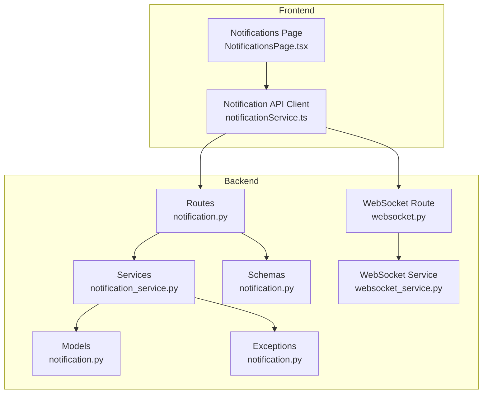
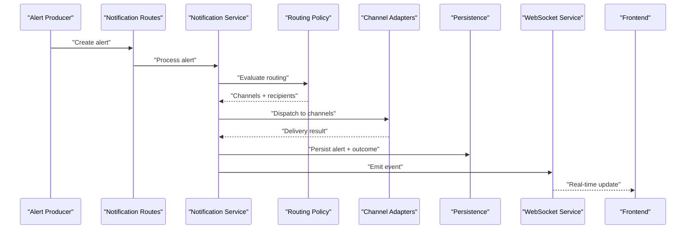
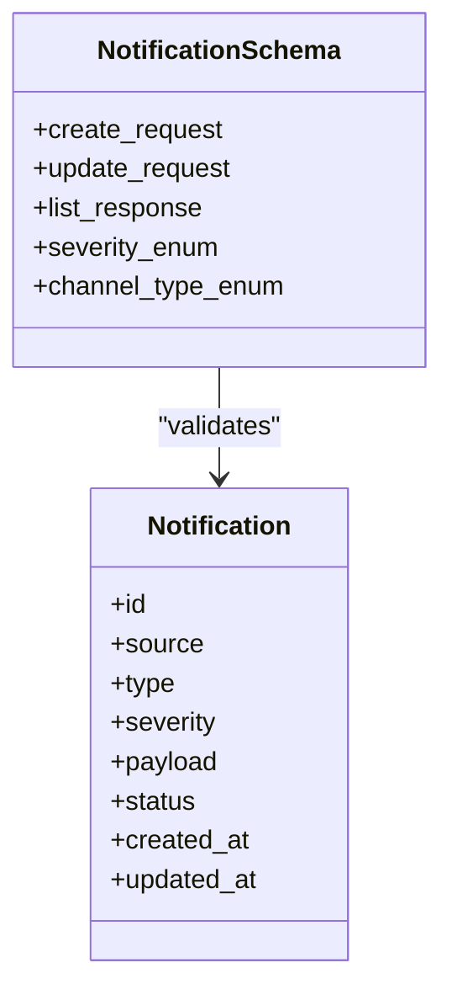
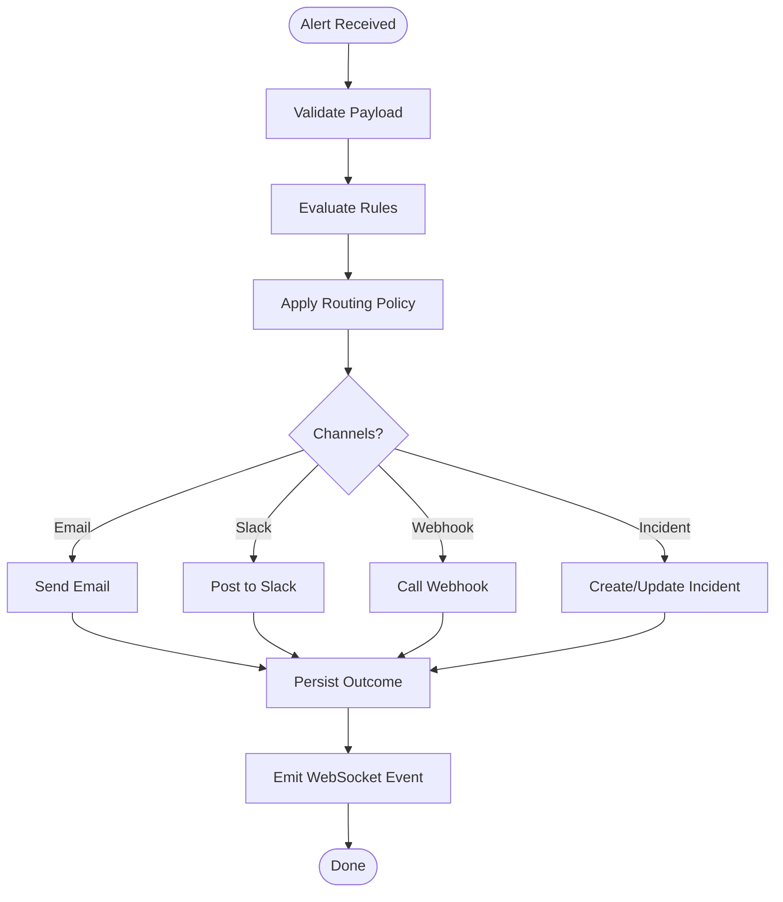
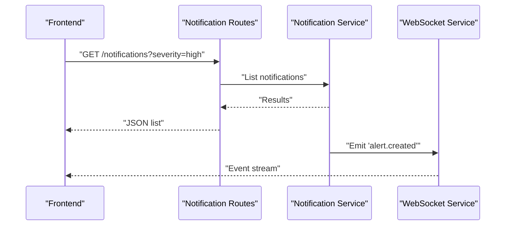
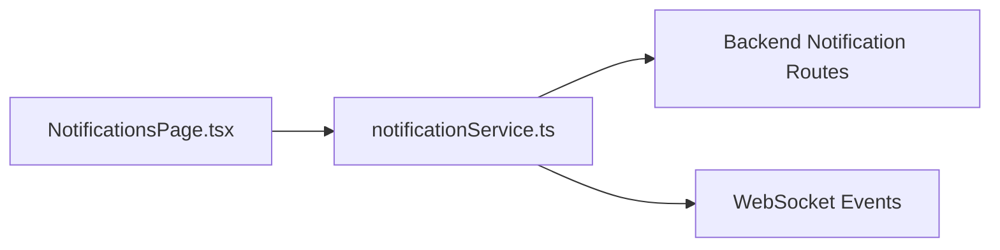
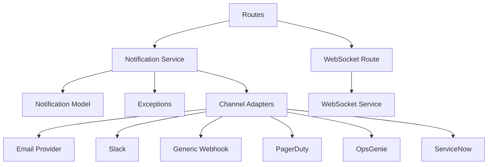

# Alerting & Notifications

<cite>
**Referenced Files in This Document**
- [notification.py](file://backend/app/models/notification.py)
- [notification_service.py](file://backend/app/services/notification_service.py)
- [notification.py](file://backend/app/routes/notification.py)
- [notification.py](file://backend/app/schemas/notification.py)
- [notification.py](file://backend/app/exceptions/notification.py)
- [websocket.py](file://backend/app/routes/websocket.py)
- [websocket_service.py](file://backend/app/services/websocket_service.py)
- [notificationService.ts](file://frontend/src/services/notificationService.ts)
- [NotificationsPage.tsx](file://frontend/src/pages/NotificationsPage.tsx)
</cite>

## Table of Contents
1. [Introduction](#introduction)
2. [Project Structure](#project-structure)
3. [Core Components](#core-components)
4. [Architecture Overview](#architecture-overview)
5. [Detailed Component Analysis](#detailed-component-analysis)
6. [Dependency Analysis](#dependency-analysis)
7. [Performance Considerations](#performance-considerations)
8. [Troubleshooting Guide](#troubleshooting-guide)
9. [Conclusion](#conclusion)
10. [Appendices](#appendices)

## Introduction
This document explains CloudBridge’s alerting and notification system, including supported channels (email, Slack, webhooks, and custom integrations), alert rule configuration, severity levels, routing policies, integration with incident management platforms (PagerDuty, OpsGenie, ServiceNow), the end-to-end notification lifecycle from generation to resolution confirmation, and examples for building custom providers and webhook handlers.

## Project Structure
The alerting and notifications feature spans backend services, routes, schemas, models, exceptions, WebSocket endpoints, and frontend pages/services. The key areas are:
- Backend models and schemas define alert entities and request/response contracts.
- Services implement delivery logic and orchestrate channels.
- Routes expose REST APIs and WebSocket events for real-time updates.
- Frontend provides UI for configuring rules, viewing notifications, and managing integrations.

**Diagram sources**
- [notification.py](file://backend/app/routes/notification.py)
- [notification_service.py](file://backend/app/services/notification_service.py)
- [notification.py](file://backend/app/models/notification.py)
- [notification.py](file://backend/app/schemas/notification.py)
- [notification.py](file://backend/app/exceptions/notification.py)
- [websocket.py](file://backend/app/routes/websocket.py)
- [websocket_service.py](file://backend/app/services/websocket_service.py)
- [notificationService.ts](file://frontend/src/services/notificationService.ts)
- [NotificationsPage.tsx](file://frontend/src/pages/NotificationsPage.tsx)

**Section sources**
- [notification.py](file://backend/app/routes/notification.py)
- [notification_service.py](file://backend/app/services/notification_service.py)
- [notification.py](file://backend/app/models/notification.py)
- [notification.py](file://backend/app/schemas/notification.py)
- [notification.py](file://backend/app/exceptions/notification.py)
- [websocket.py](file://backend/app/routes/websocket.py)
- [websocket_service.py](file://backend/app/services/websocket_service.py)
- [notificationService.ts](file://frontend/src/services/notificationService.ts)
- [NotificationsPage.tsx](file://frontend/src/pages/NotificationsPage.tsx)

## Core Components
- Notification model: Represents persisted alerts with fields such as source, type, severity, payload, status, and timestamps. It supports querying and filtering by severity and state.
- Notification service: Implements channel dispatchers (email, Slack, webhooks), routing policy evaluation, retry/backoff, deduplication, and escalation. It also integrates with external systems via HTTP clients and SDKs.
- Notification routes: Expose CRUD and query endpoints for rules, recipients, and notifications; trigger test sends; and manage integrations.
- Notification schemas: Define validation rules for requests and responses, including severity enums, channel types, and routing filters.
- Exceptions: Standardized error types for invalid configurations, delivery failures, and rate limiting.
- WebSocket layer: Streams live notification events to the frontend for real-time dashboards.

Key responsibilities:
- Rule engine: Evaluates alert conditions against configured thresholds and tags.
- Routing policy: Maps alerts to channels based on severity, environment, or team ownership.
- Delivery pipeline: Serializes payloads, applies per-channel formatting, and handles retries and acknowledgments.
- Integration adapters: Pluggable modules for PagerDuty, OpsGenie, ServiceNow, and generic webhooks.

**Section sources**
- [notification.py](file://backend/app/models/notification.py)
- [notification_service.py](file://backend/app/services/notification_service.py)
- [notification.py](file://backend/app/schemas/notification.py)
- [notification.py](file://backend/app/exceptions/notification.py)
- [websocket.py](file://backend/app/routes/websocket.py)
- [websocket_service.py](file://backend/app/services/websocket_service.py)

## Architecture Overview
CloudBridge’s alerting architecture separates concerns into clear layers:
- Ingestion: Internal producers emit alerts; external systems can post via webhooks.
- Processing: Rules and routing policies determine where and how to notify.
- Delivery: Channel adapters send messages through email, Slack, webhooks, and incident platforms.
- Persistence: Alerts and delivery outcomes are stored for auditability and reporting.
- Real-time: WebSocket events push updates to the UI.

**Diagram sources**
- [notification.py](file://backend/app/routes/notification.py)
- [notification_service.py](file://backend/app/services/notification_service.py)
- [websocket.py](file://backend/app/routes/websocket.py)
- [websocket_service.py](file://backend/app/services/websocket_service.py)

## Detailed Component Analysis

### Notification Model and Schema
- Model: Stores alert metadata, severity, payload, status transitions, and delivery results. Supports indexing by severity and created_at for efficient queries.
- Schema: Defines input/output structures for creating/updating alerts, configuring rules, and listing notifications. Includes validation for severity levels and channel types.

**Diagram sources**
- [notification.py](file://backend/app/models/notification.py)
- [notification.py](file://backend/app/schemas/notification.py)

**Section sources**
- [notification.py](file://backend/app/models/notification.py)
- [notification.py](file://backend/app/schemas/notification.py)

### Notification Service and Routing
- Service orchestrates:
  - Rule evaluation: Matches alert attributes to configured rules.
  - Routing policy: Selects channels and recipients based on severity, environment, tags, or owner.
  - Delivery: Calls channel adapters with formatted payloads.
  - Retry/backoff: Retries transient failures with exponential backoff and jitter.
  - Deduplication: Prevents duplicate notifications within a time window.
  - Escalation: Promotes severity or adds additional recipients when unresolved.
- Integrations:
  - Email: SMTP-based delivery with templating.
  - Slack: Webhook or API-based messaging with blocks and mentions.
  - Generic Webhooks: Configurable headers, body templates, and auth schemes.
  - Incident Platforms: PagerDuty, OpsGenie, ServiceNow adapters for creating/incident updates.

**Diagram sources**
- [notification_service.py](file://backend/app/services/notification_service.py)

**Section sources**
- [notification_service.py](file://backend/app/services/notification_service.py)

### REST API and WebSocket Layer
- REST endpoints:
  - Create/update/list notifications.
  - Configure alert rules and routing policies.
  - Manage integrations (test connections, update credentials).
  - Trigger manual notifications for testing.
- WebSocket:
  - Streams notification events to connected clients.
  - Supports filtering by severity and tags.

**Diagram sources**
- [notification.py](file://backend/app/routes/notification.py)
- [websocket.py](file://backend/app/routes/websocket.py)
- [websocket_service.py](file://backend/app/services/websocket_service.py)

**Section sources**
- [notification.py](file://backend/app/routes/notification.py)
- [websocket.py](file://backend/app/routes/websocket.py)
- [websocket_service.py](file://backend/app/services/websocket_service.py)

### Frontend Integration
- API client: Encapsulates calls to notification endpoints, including pagination and filters.
- Notifications page: Displays alerts, allows filtering by severity/status, and shows delivery details.
- Real-time updates: Subscribes to WebSocket events to refresh the UI without polling.

**Diagram sources**
- [NotificationsPage.tsx](file://frontend/src/pages/NotificationsPage.tsx)
- [notificationService.ts](file://frontend/src/services/notificationService.ts)
- [notification.py](file://backend/app/routes/notification.py)
- [websocket.py](file://backend/app/routes/websocket.py)

**Section sources**
- [NotificationsPage.tsx](file://frontend/src/pages/NotificationsPage.tsx)
- [notificationService.ts](file://frontend/src/services/notificationService.ts)

### Custom Notification Providers and Webhook Handlers
To add a new channel:
- Implement an adapter that formats and sends messages using the target protocol.
- Register the adapter with the notification service.
- Add schema entries for configuration and secrets.
- Provide tests for connectivity and payload rendering.

For specialized webhook handling:
- Accept inbound webhooks from external systems.
- Normalize payloads into internal alert format.
- Apply routing and deliver via configured channels.

[No sources needed since this section provides general guidance]

## Dependency Analysis
Internal dependencies:
- Routes depend on services and schemas.
- Services depend on models, exceptions, and channel adapters.
- WebSocket route depends on WebSocket service for event emission.

External dependencies:
- Email provider (SMTP).
- Slack API/Webhooks.
- HTTP client for webhooks and incident platforms.
- Optional SDKs for PagerDuty, OpsGenie, ServiceNow.

**Diagram sources**
- [notification.py](file://backend/app/routes/notification.py)
- [notification_service.py](file://backend/app/services/notification_service.py)
- [notification.py](file://backend/app/models/notification.py)
- [notification.py](file://backend/app/exceptions/notification.py)
- [websocket.py](file://backend/app/routes/websocket.py)
- [websocket_service.py](file://backend/app/services/websocket_service.py)

**Section sources**
- [notification.py](file://backend/app/routes/notification.py)
- [notification_service.py](file://backend/app/services/notification_service.py)
- [notification.py](file://backend/app/models/notification.py)
- [notification.py](file://backend/app/exceptions/notification.py)
- [websocket.py](file://backend/app/routes/websocket.py)
- [websocket_service.py](file://backend/app/services/websocket_service.py)

## Performance Considerations
- Batch deliveries: Group notifications to reduce overhead for high-volume scenarios.
- Asynchronous processing: Offload heavy tasks (e.g., large payloads, retries) to background workers.
- Rate limiting: Respect provider quotas and implement adaptive throttling.
- Caching: Cache templates and recipient lists to minimize repeated computations.
- Indexing: Ensure database indexes on severity, status, and timestamps for fast queries.

[No sources needed since this section provides general guidance]

## Troubleshooting Guide
Common issues and resolutions:
- Invalid configuration: Use schema validation errors to correct missing fields or unsupported values.
- Delivery failures: Inspect exception logs for network timeouts, authentication errors, or malformed payloads.
- Duplicate notifications: Verify deduplication windows and rule overlap.
- Escalation not firing: Check escalation conditions and timers.
- WebSocket disconnects: Reconnect with exponential backoff and verify server-side event emission.

Operational tips:
- Use “Test connection” endpoints to validate integrations before enabling production routing.
- Enable detailed logging for delivery attempts and retry cycles.
- Monitor queue depths and delivery latency metrics.

**Section sources**
- [notification.py](file://backend/app/exceptions/notification.py)
- [notification_service.py](file://backend/app/services/notification_service.py)

## Conclusion
CloudBridge’s alerting and notifications system provides a flexible, extensible framework for multi-channel alerting with robust routing, reliable delivery, and real-time visibility. By leveraging pluggable adapters and well-defined schemas, teams can integrate with existing tools and tailor behavior to their operational needs while maintaining clarity and control over alert lifecycles.

## Appendices

### Severity Levels and Routing Policies
- Severity levels: critical, high, medium, low, info.
- Routing policies:
  - Map severity to channels (e.g., critical -> PagerDuty + Slack + Email).
  - Environment-aware routing (prod vs staging).
  - Team ownership and tag-based routing.
  - Time-based suppression and maintenance windows.

[No sources needed since this section provides general guidance]

### Integration Examples
- PagerDuty: Create incidents on critical alerts; auto-resolve on acknowledgment.
- OpsGenie: Route high-severity alerts to on-call schedules; include runbook links.
- ServiceNow: Open change tickets for schema drift or migration failures.
- Generic Webhook: Forward normalized alerts to internal pipelines or SIEM.

[No sources needed since this section provides general guidance]