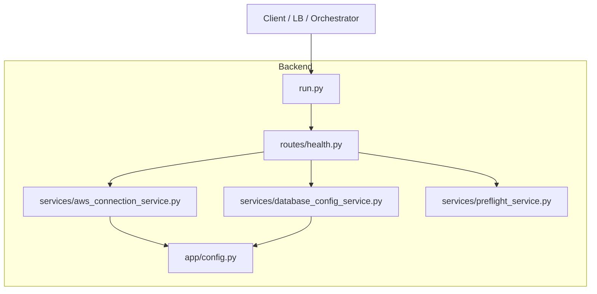
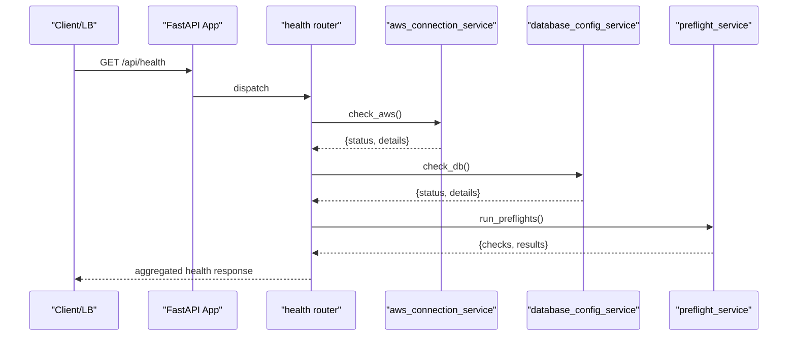
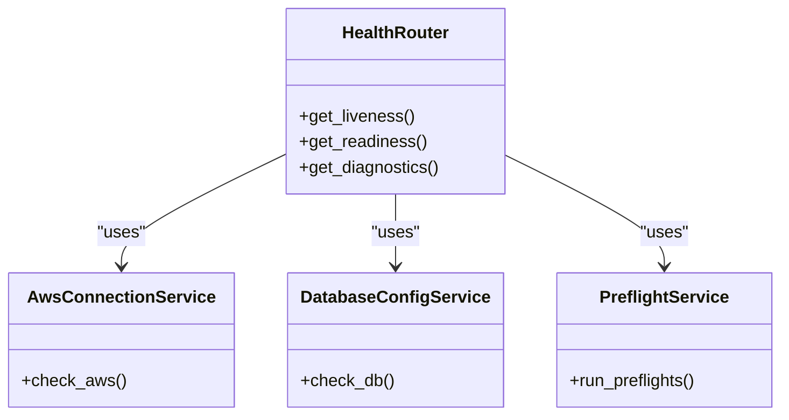

# Health Checks & System Status

<cite>
**Referenced Files in This Document**
- [health.py](file://backend/app/routes/health.py)
- [test_health.py](file://backend/tests/test_health.py)
- [aws_connection_service.py](file://backend/app/services/aws_connection_service.py)
- [database_config_service.py](file://backend/app/services/database_config_service.py)
- [preflight_service.py](file://backend/app/services/preflight_service.py)
- [run.py](file://backend/run.py)
- [config.py](file://backend/app/config.py)
</cite>

## Table of Contents
1. [Introduction](#introduction)
2. [Project Structure](#project-structure)
3. [Core Components](#core-components)
4. [Architecture Overview](#architecture-overview)
5. [Detailed Component Analysis](#detailed-component-analysis)
6. [Dependency Analysis](#dependency-analysis)
7. [Performance Considerations](#performance-considerations)
8. [Troubleshooting Guide](#troubleshooting-guide)
9. [Conclusion](#conclusion)

## Introduction
This document explains CloudBridge health check endpoints and system status monitoring. It covers available health endpoints, response formats, status codes, diagnostic information, how to add custom checks, integration with load balancers and orchestration platforms, and troubleshooting steps for common failures.

## Project Structure
Health-related functionality is implemented under the backend application:
- Route definitions for health endpoints are located in the routes module.
- Service modules provide connectivity checks for AWS and database dependencies.
- Tests validate expected behaviors and response shapes.
- The application entry point registers routers and starts the server.

**Diagram sources**
- [health.py](file://backend/app/routes/health.py)
- [aws_connection_service.py](file://backend/app/services/aws_connection_service.py)
- [database_config_service.py](file://backend/app/services/database_config_service.py)
- [preflight_service.py](file://backend/app/services/preflight_service.py)
- [run.py](file://backend/run.py)
- [config.py](file://backend/app/config.py)

**Section sources**
- [health.py](file://backend/app/routes/health.py)
- [test_health.py](file://backend/tests/test_health.py)
- [run.py](file://backend/run.py)
- [config.py](file://backend/app/config.py)

## Core Components
- Health route handlers expose endpoints for liveness/readiness and detailed diagnostics.
- Services encapsulate dependency probes (AWS clients, database connections).
- Configuration centralizes environment-driven settings used by services.
- Tests assert endpoint behavior and response structure.

Key responsibilities:
- Expose standardized HTTP responses for orchestrators and load balancers.
- Aggregate multiple dependency checks into a single readiness view.
- Provide granular details for troubleshooting.

**Section sources**
- [health.py](file://backend/app/routes/health.py)
- [aws_connection_service.py](file://backend/app/services/aws_connection_service.py)
- [database_config_service.py](file://backend/app/services/database_config_service.py)
- [preflight_service.py](file://backend/app/services/preflight_service.py)
- [test_health.py](file://backend/tests/test_health.py)

## Architecture Overview
The health subsystem follows a layered design:
- HTTP layer: FastAPI routes define endpoints and map them to service calls.
- Service layer: Each service performs a specific probe (e.g., AWS client ping, DB connection test).
- Config layer: Environment variables drive credentials, endpoints, and timeouts.

**Diagram sources**
- [health.py](file://backend/app/routes/health.py)
- [aws_connection_service.py](file://backend/app/services/aws_connection_service.py)
- [database_config_service.py](file://backend/app/services/database_config_service.py)
- [preflight_service.py](file://backend/app/services/preflight_service.py)

## Detailed Component Analysis

### Health Endpoints
CloudBridge exposes health endpoints that return structured JSON payloads suitable for automated systems. Typical endpoints include:
- Liveness: indicates if the process is alive and responsive.
- Readiness: aggregates dependency checks to determine if the service can serve traffic.
- Detailed diagnostics: provides per-dependency status and error messages.

Response characteristics:
- Standardized top-level fields such as overall status, timestamp, and version.
- Per-check entries with name, status, and optional details or error messages.
- HTTP status codes reflect overall health: success when healthy, failure when degraded or unhealthy.

Integration notes:
- Load balancers typically poll the readiness endpoint and remove instances on failure.
- Container orchestrators use liveness for restarts and readiness for traffic routing.

**Section sources**
- [health.py](file://backend/app/routes/health.py)
- [test_health.py](file://backend/tests/test_health.py)

### Database Connectivity Check
The database health check validates reachability and authentication against configured databases. It uses configuration values for host, port, credentials, and timeout. On success, it reports healthy; on failure, it includes diagnostic context such as connection errors or timeouts.

Operational considerations:
- Ensure network policies allow outbound connections from the service to the database.
- Tune timeouts to avoid long-running health checks blocking readiness decisions.

**Section sources**
- [database_config_service.py](file://backend/app/services/database_config_service.py)
- [config.py](file://backend/app/config.py)

### AWS Service Availability Check
The AWS health check verifies that AWS SDK clients can authenticate and perform lightweight operations against configured regions and accounts. It leverages environment-based credentials and region settings. Failures surface actionable diagnostics like credential issues, network errors, or throttling.

Operational considerations:
- Validate IAM permissions for minimal required actions used by the check.
- Account for regional availability and rate limits during health polling.

**Section sources**
- [aws_connection_service.py](file://backend/app/services/aws_connection_service.py)
- [config.py](file://backend/app/config.py)

### Preflight and Internal Service Health
Preflight checks may validate prerequisites such as migrations applied, feature flags enabled, or internal state consistency. These checks contribute to readiness and help prevent serving requests before the system is fully initialized.

**Section sources**
- [preflight_service.py](file://backend/app/services/preflight_service.py)

### Application Entry Point and Router Registration
The application entry point initializes middleware, config, and routers, including the health router. Proper registration ensures endpoints are reachable at the expected paths.

**Section sources**
- [run.py](file://backend/run.py)

## Dependency Analysis
The health router depends on service modules that encapsulate external interactions. This separation improves testability and clarity.

**Diagram sources**
- [health.py](file://backend/app/routes/health.py)
- [aws_connection_service.py](file://backend/app/services/aws_connection_service.py)
- [database_config_service.py](file://backend/app/services/database_config_service.py)
- [preflight_service.py](file://backend/app/services/preflight_service.py)

**Section sources**
- [health.py](file://backend/app/routes/health.py)
- [aws_connection_service.py](file://backend/app/services/aws_connection_service.py)
- [database_config_service.py](file://backend/app/services/database_config_service.py)
- [preflight_service.py](file://backend/app/services/preflight_service.py)

## Performance Considerations
- Keep health checks lightweight and fast to avoid impacting request latency.
- Use short timeouts for external calls to fail fast.
- Avoid heavy computations or expensive queries in readiness checks.
- Cache stable results where appropriate, but ensure staleness does not mask real failures.

[No sources needed since this section provides general guidance]

## Troubleshooting Guide
Common failure scenarios and steps:
- Database unreachable: verify network ACLs, security groups, DNS resolution, and credentials. Check timeout settings and retry behavior.
- AWS auth/network errors: confirm IAM permissions, region configuration, proxy settings, and VPC endpoints. Inspect error messages returned by the AWS client.
- Preflight failures: review migration status, initialization tasks, and feature flags. Ensure background workers are running if required.
- High latency or timeouts: reduce work done in checks, increase timeouts cautiously, and investigate upstream bottlenecks.

Diagnostic tips:
- Inspect the detailed diagnostics payload for per-check errors and timestamps.
- Correlate health failures with logs around the time of the failing check.
- Validate environment variables and secrets mounted into the container.

**Section sources**
- [test_health.py](file://backend/tests/test_health.py)
- [database_config_service.py](file://backend/app/services/database_config_service.py)
- [aws_connection_service.py](file://backend/app/services/aws_connection_service.py)
- [preflight_service.py](file://backend/app/services/preflight_service.py)

## Conclusion
CloudBridge’s health subsystem provides clear, machine-readable signals for liveness and readiness, with detailed diagnostics to accelerate troubleshooting. By keeping checks focused and fast, and by integrating them with your load balancer and orchestrator, you can maintain reliable deployments and rapid recovery from incidents.