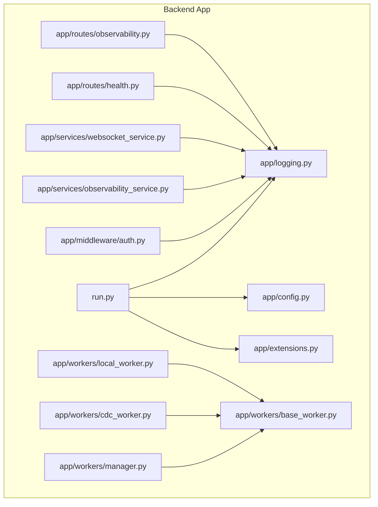
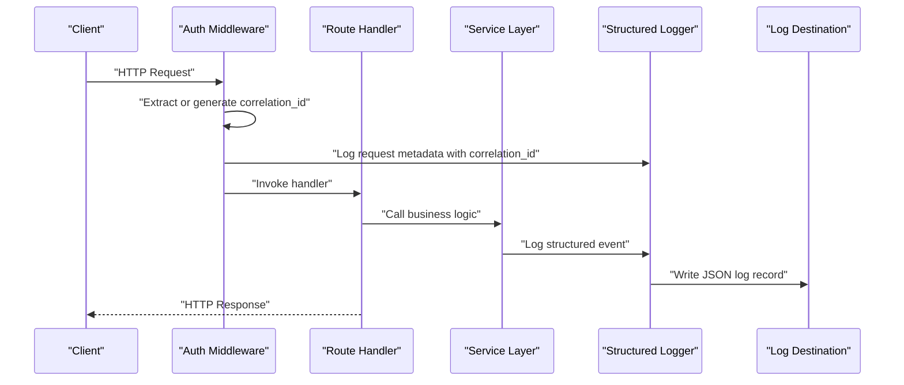
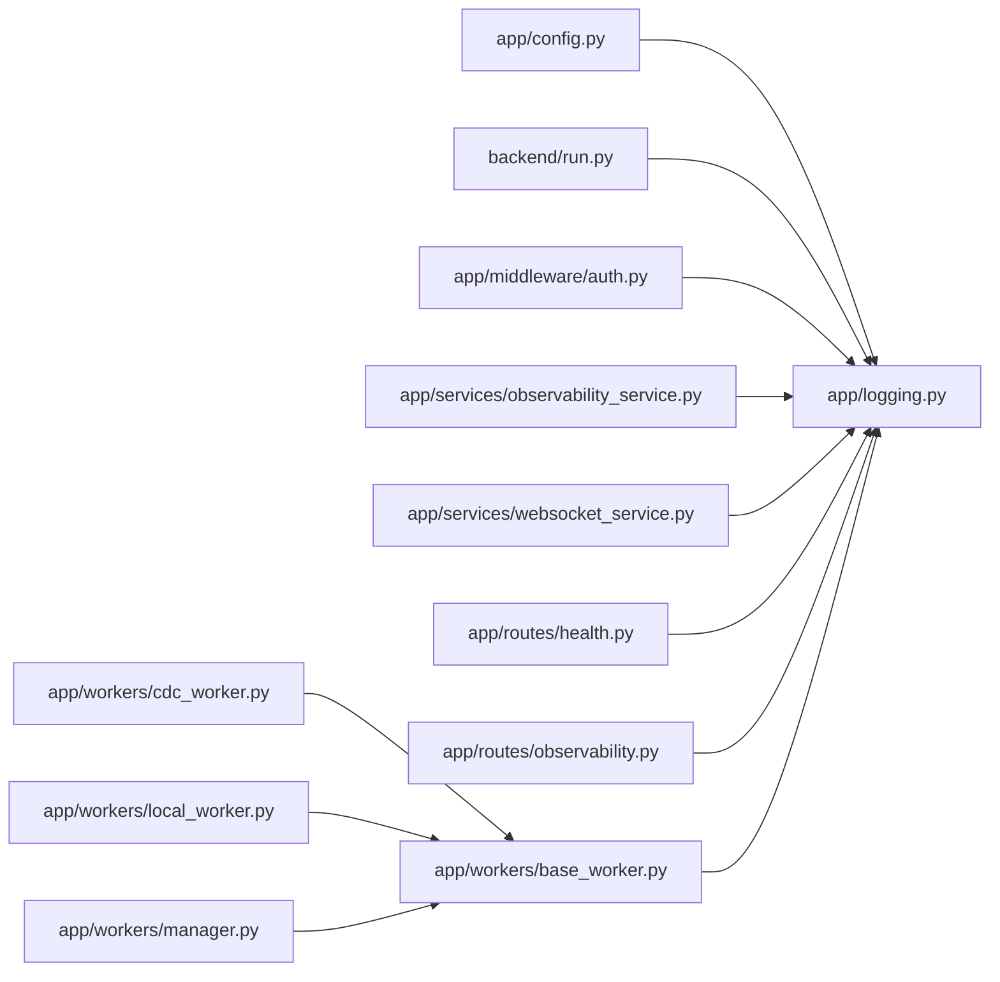

# Logging & Log Management

<cite>
**Referenced Files in This Document**
- [logging.py](file://backend/app/logging.py)
- [config.py](file://backend/app/config.py)
- [run.py](file://backend/run.py)
- [extensions.py](file://backend/app/extensions.py)
- [auth.py](file://backend/app/middleware/auth.py)
- [observability_service.py](file://backend/app/services/observability_service.py)
- [websocket_service.py](file://backend/app/services/websocket_service.py)
- [base_worker.py](file://backend/app/workers/base_worker.py)
- [cdc_worker.py](file://backend/app/workers/cdc_worker.py)
- [local_worker.py](file://backend/app/workers/local_worker.py)
- [manager.py](file://backend/app/workers/manager.py)
- [health.py](file://backend/app/routes/health.py)
- [observability.py](file://backend/app/routes/observability.py)
- [errors.py](file://backend/app/errors.py)
- [exceptions/observability.py](file://backend/app/exceptions/observability.py)
- [Dockerfile](file://backend/Dockerfile)
- [docker-compose.yml](file://docker-compose.yml)
</cite>

## Table of Contents
1. [Introduction](#introduction)
2. [Project Structure](#project-structure)
3. [Core Components](#core-components)
4. [Architecture Overview](#architecture-overview)
5. [Detailed Component Analysis](#detailed-component-analysis)
6. [Dependency Analysis](#dependency-analysis)
7. [Performance Considerations](#performance-considerations)
8. [Troubleshooting Guide](#troubleshooting-guide)
9. [Conclusion](#conclusion)
10. [Appendices](#appendices)

## Introduction
This document explains the CloudBridge logging system and log management strategies. It covers structured logging implementation, log levels, formatting patterns, output destinations, rotation and retention policies, correlation IDs for request tracing across microservices, integration with centralized logging solutions (ELK stack, Splunk, cloud-native services), and examples of custom formatters and filtering strategies for different environments.

## Project Structure
CloudBridge’s logging is implemented in a modular way:
- A central logging configuration module initializes and configures the application logger.
- The application entrypoint wires up logging during startup.
- Middleware and services use the configured logger to emit structured logs.
- Workers inherit base logging behavior for background tasks.
- Observability endpoints expose runtime metrics and health information.
- Containerization files define environment-driven configuration for production logging.

**Diagram sources**
- [run.py](file://backend/run.py)
- [logging.py](file://backend/app/logging.py)
- [config.py](file://backend/app/config.py)
- [extensions.py](file://backend/app/extensions.py)
- [auth.py](file://backend/app/middleware/auth.py)
- [observability_service.py](file://backend/app/services/observability_service.py)
- [websocket_service.py](file://backend/app/services/websocket_service.py)
- [health.py](file://backend/app/routes/health.py)
- [observability.py](file://backend/app/routes/observability.py)
- [manager.py](file://backend/app/workers/manager.py)
- [base_worker.py](file://backend/app/workers/base_worker.py)
- [cdc_worker.py](file://backend/app/workers/cdc_worker.py)
- [local_worker.py](file://backend/app/workers/local_worker.py)

**Section sources**
- [logging.py](file://backend/app/logging.py)
- [config.py](file://backend/app/config.py)
- [run.py](file://backend/run.py)
- [extensions.py](file://backend/app/extensions.py)

## Core Components
- Centralized Logger Configuration: Initializes the root logger, sets default level, and registers handlers/formatters based on environment variables.
- Structured Logging: Uses JSON-formatted logs with consistent fields such as timestamp, level, message, service name, version, and optional correlation ID.
- Environment-Driven Behavior: Switches between console and file handlers; enables or disables rotation and retention via configuration.
- Correlation ID Propagation: Extracts or generates a request-scoped correlation ID and attaches it to all log records within the request lifecycle.
- Worker Logging: Background workers inherit the same structured format and can include task identifiers for traceability.

Key responsibilities by component:
- app/logging.py: Defines formatter classes, handler setup, and logger initialization.
- app/config.py: Provides environment-based settings for log level, output destination, rotation, and retention.
- backend/run.py: Bootstraps logging at process start.
- app/middleware/auth.py: Adds correlation ID to request context and logs authentication events.
- app/services/*: Emit domain-specific structured logs using the shared logger.
- app/workers/*: Use structured logs for job execution and status updates.

**Section sources**
- [logging.py](file://backend/app/logging.py)
- [config.py](file://backend/app/config.py)
- [run.py](file://backend/run.py)
- [auth.py](file://backend/app/middleware/auth.py)
- [observability_service.py](file://backend/app/services/observability_service.py)
- [websocket_service.py](file://backend/app/services/websocket_service.py)
- [base_worker.py](file://backend/app/workers/base_worker.py)
- [cdc_worker.py](file://backend/app/workers/cdc_worker.py)
- [local_worker.py](file://backend/app/workers/local_worker.py)

## Architecture Overview
The logging architecture follows a layered approach:
- Application bootstrap configures logging once per process.
- HTTP middleware injects correlation IDs into request context.
- Services and routes log structured messages with correlation IDs.
- Workers log structured messages with task IDs.
- Output destinations are configurable: stdout/stderr for containerized deployments, or file-based outputs with rotation and retention for local development.

**Diagram sources**
- [auth.py](file://backend/app/middleware/auth.py)
- [observability_service.py](file://backend/app/services/observability_service.py)
- [logging.py](file://backend/app/logging.py)

## Detailed Component Analysis

### Centralized Logging Configuration
Responsibilities:
- Define JSON formatter with consistent fields.
- Configure console and file handlers.
- Apply rotation and retention policies when enabled.
- Set default log level from environment.
- Provide a function to obtain the application logger instance.

Configuration options typically include:
- LOG_LEVEL: Minimum severity level (e.g., DEBUG, INFO, WARNING, ERROR).
- LOG_FORMAT: Format type (e.g., json).
- LOG_OUTPUT: Output target (e.g., console, file).
- LOG_FILE_PATH: File path for file-based logging.
- LOG_MAX_BYTES: Maximum size before rotation.
- LOG_BACKUP_COUNT: Number of rotated backups to retain.
- LOG_ENABLE_ROTATION: Enable/disable rotation.

Best practices:
- Always include correlation_id when available.
- Avoid sensitive data in logs.
- Keep log payloads small and structured.

**Section sources**
- [logging.py](file://backend/app/logging.py)
- [config.py](file://backend/app/config.py)

### Application Bootstrap
Responsibilities:
- Initialize logging early in the process lifecycle.
- Load configuration values.
- Ensure handlers and formatters are attached before any request handling.

Integration points:
- Reads environment variables for logging configuration.
- Instantiates the root logger and returns a configured logger instance.

**Section sources**
- [run.py](file://backend/run.py)
- [config.py](file://backend/app/config.py)
- [logging.py](file://backend/app/logging.py)

### Middleware and Correlation IDs
Responsibilities:
- Extract correlation_id from incoming headers if present.
- Generate a new correlation_id if not provided.
- Attach correlation_id to request context.
- Log request metadata including correlation_id.

Flow:
- Incoming request -> extract/generate correlation_id -> attach to context -> structured log -> route handler.

**Section sources**
- [auth.py](file://backend/app/middleware/auth.py)
- [logging.py](file://backend/app/logging.py)

### Services and Routes Logging
Responsibilities:
- Emit structured logs for business operations.
- Include correlation_id where available.
- Use appropriate log levels for informational, warning, and error conditions.

Examples:
- Observability service logs metrics collection and export attempts.
- WebSocket service logs connection lifecycle events.
- Health route logs readiness/liveness checks.

**Section sources**
- [observability_service.py](file://backend/app/services/observability_service.py)
- [websocket_service.py](file://backend/app/services/websocket_service.py)
- [health.py](file://backend/app/routes/health.py)
- [observability.py](file://backend/app/routes/observability.py)
- [logging.py](file://backend/app/logging.py)

### Worker Logging
Responsibilities:
- Background workers log structured messages with task identifiers.
- Inherit base logging behavior for consistency.
- Report job status transitions and errors.

Hierarchy:
- Base worker defines common logging utilities.
- CDC worker and local worker extend base behavior.
- Worker manager orchestrates worker lifecycle and logs orchestration events.

**Section sources**
- [base_worker.py](file://backend/app/workers/base_worker.py)
- [cdc_worker.py](file://backend/app/workers/cdc_worker.py)
- [local_worker.py](file://backend/app/workers/local_worker.py)
- [manager.py](file://backend/app/workers/manager.py)
- [logging.py](file://backend/app/logging.py)

### Error Handling and Observability Integration
Responsibilities:
- Centralized error logging with structured fields.
- Optional integration with observability services for metrics and traces.
- Consistent error response formatting alongside log emission.

**Section sources**
- [errors.py](file://backend/app/errors.py)
- [exceptions/observability.py](file://backend/app/exceptions/observability.py)
- [observability_service.py](file://backend/app/services/observability_service.py)
- [logging.py](file://backend/app/logging.py)

## Dependency Analysis
Logging dependencies and relationships:
- app/logging.py depends on app/config.py for environment-driven settings.
- Middleware and services depend on app/logging.py for logger instances.
- Workers depend on base worker and logging configuration.
- Entrypoint (run.py) initializes logging before other components.

**Diagram sources**
- [config.py](file://backend/app/config.py)
- [logging.py](file://backend/app/logging.py)
- [run.py](file://backend/run.py)
- [auth.py](file://backend/app/middleware/auth.py)
- [observability_service.py](file://backend/app/services/observability_service.py)
- [websocket_service.py](file://backend/app/services/websocket_service.py)
- [health.py](file://backend/app/routes/health.py)
- [observability.py](file://backend/app/routes/observability.py)
- [base_worker.py](file://backend/app/workers/base_worker.py)
- [cdc_worker.py](file://backend/app/workers/cdc_worker.py)
- [local_worker.py](file://backend/app/workers/local_worker.py)
- [manager.py](file://backend/app/workers/manager.py)

**Section sources**
- [logging.py](file://backend/app/logging.py)
- [config.py](file://backend/app/config.py)
- [run.py](file://backend/run.py)
- [auth.py](file://backend/app/middleware/auth.py)
- [observability_service.py](file://backend/app/services/observability_service.py)
- [websocket_service.py](file://backend/app/services/websocket_service.py)
- [health.py](file://backend/app/routes/health.py)
- [observability.py](file://backend/app/routes/observability.py)
- [base_worker.py](file://backend/app/workers/base_worker.py)
- [cdc_worker.py](file://backend/app/workers/cdc_worker.py)
- [local_worker.py](file://backend/app/workers/local_worker.py)
- [manager.py](file://backend/app/workers/manager.py)

## Performance Considerations
- Prefer JSON formatting for machine readability and reduced parsing overhead in centralized systems.
- Avoid excessive logging in hot paths; use appropriate log levels to minimize I/O.
- Enable rotation only when writing to disk; prefer stdout/stderr in containerized environments.
- Batch or sample high-frequency logs in performance-sensitive services.
- Keep log payload sizes small to reduce network and storage costs.

[No sources needed since this section provides general guidance]

## Troubleshooting Guide
Common issues and resolutions:
- Missing correlation_id: Ensure middleware extracts or generates correlation_id and attaches it to request context.
- No logs emitted: Verify logging initialization occurs before first request and that LOG_LEVEL allows the desired severity.
- Logs not rotating: Confirm LOG_ENABLE_ROTATION is true and LOG_MAX_BYTES and LOG_BACKUP_COUNT are set appropriately.
- Disk space growth: Adjust LOG_BACKUP_COUNT and LOG_MAX_BYTES; consider moving logs to centralized collectors.
- Sensitive data in logs: Audit log statements and remove PII or secrets; implement filtering strategies.

Operational tips:
- Use environment variables to switch between console and file outputs.
- Validate configuration via health and observability endpoints.
- Monitor log volume and adjust sampling or levels accordingly.

**Section sources**
- [auth.py](file://backend/app/middleware/auth.py)
- [run.py](file://backend/run.py)
- [logging.py](file://backend/app/logging.py)
- [config.py](file://backend/app/config.py)

## Conclusion
CloudBridge implements a robust, structured logging system with environment-driven configuration, correlation ID propagation, and flexible output destinations. By adhering to best practices around log levels, formatting, and retention, teams can maintain clear observability across services and workers while integrating seamlessly with centralized logging platforms.

[No sources needed since this section summarizes without analyzing specific files]

## Appendices

### Log Levels and Formatting Patterns
- Log levels: DEBUG, INFO, WARNING, ERROR.
- Formatting: JSON with fields for timestamp, level, message, service, version, correlation_id, and contextual metadata.
- Recommended fields:
  - timestamp: ISO 8601 UTC.
  - level: uppercase severity.
  - message: human-readable summary.
  - service: application name.
  - version: deployment version.
  - correlation_id: request or task identifier.
  - additional context: operation, resource IDs, outcome.

**Section sources**
- [logging.py](file://backend/app/logging.py)
- [config.py](file://backend/app/config.py)

### Output Destinations and Rotation Policies
- Console output: Preferred in containers; forward to platform log collectors.
- File output: For local development; configure rotation and retention.
- Rotation policy:
  - LOG_ENABLE_ROTATION: enable/disable rotation.
  - LOG_MAX_BYTES: maximum file size before rotation.
  - LOG_BACKUP_COUNT: number of retained backups.
- Retention strategy: Align with compliance and storage constraints.

**Section sources**
- [logging.py](file://backend/app/logging.py)
- [config.py](file://backend/app/config.py)

### Correlation IDs for Request Tracing
- Extraction: Read from request header if present.
- Generation: Create a unique identifier if absent.
- Propagation: Attach to request context and include in all subsequent logs.
- Cross-service tracing: Forward correlation_id in outbound requests and capture in downstream services.

**Section sources**
- [auth.py](file://backend/app/middleware/auth.py)
- [logging.py](file://backend/app/logging.py)

### Integration with Centralized Logging Solutions
- ELK Stack:
  - Ship logs via Filebeat or Fluent Bit to Elasticsearch.
  - Index by service and date; create dashboards for correlation_id searches.
- Splunk:
  - Use Splunk Universal Forwarder or HTTP Event Collector.
  - Parse JSON logs and build alerts on error rates and latency.
- Cloud-Native Services:
  - AWS CloudWatch Logs: Stream stdout/stderr; set retention periods.
  - Google Cloud Logging: Use structured logging; leverage log-based metrics.
  - Azure Monitor Logs: Collect container logs; query with Kusto.

Containerization considerations:
- Dockerfile and docker-compose should pass environment variables for LOG_LEVEL, LOG_OUTPUT, and related settings.
- Prefer stdout/stderr for containerized deployments to leverage orchestrator log drivers.

**Section sources**
- [Dockerfile](file://backend/Dockerfile)
- [docker-compose.yml](file://docker-compose.yml)
- [logging.py](file://backend/app/logging.py)
- [config.py](file://backend/app/config.py)

### Custom Log Formatters and Filtering Strategies
- Custom JSON formatter:
  - Add fields like environment, region, pod name, and trace flags.
  - Sanitize sensitive data before serialization.
- Filtering strategies:
  - Environment-based filters: suppress debug logs in production.
  - Path-based filters: exclude health check noise.
  - Rate limiting: throttle high-frequency logs in hot paths.
- Example patterns:
  - Include correlation_id in all request-scoped logs.
  - Tag background jobs with task_id and status.

**Section sources**
- [logging.py](file://backend/app/logging.py)
- [config.py](file://backend/app/config.py)