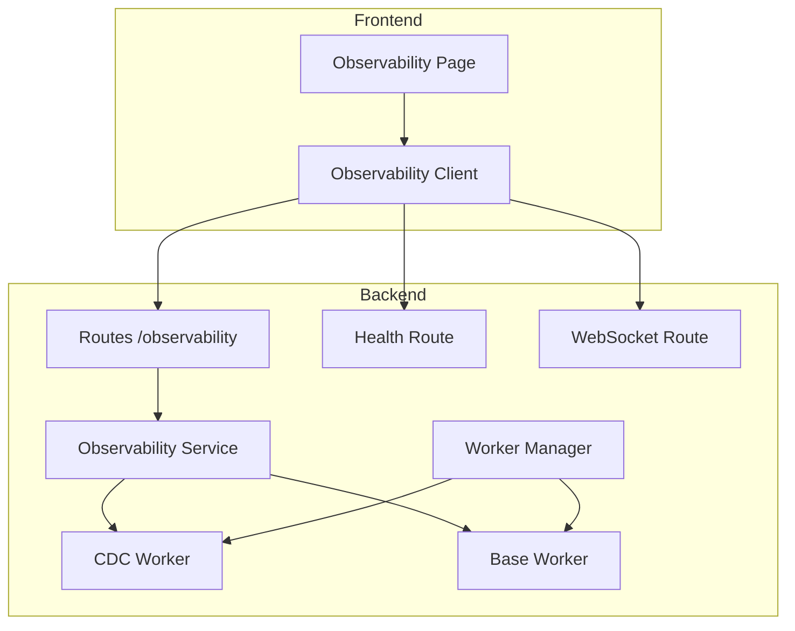
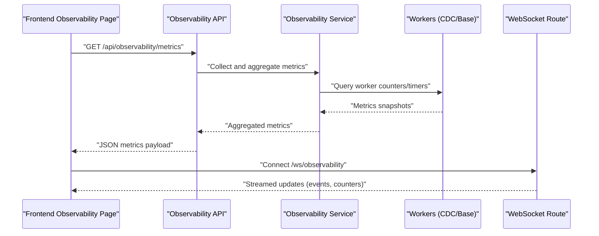
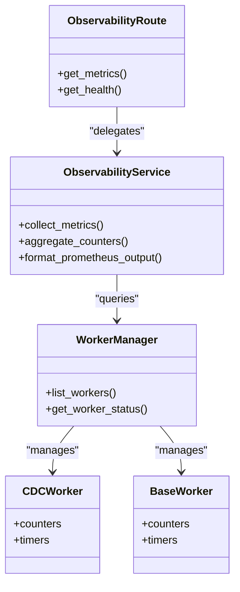
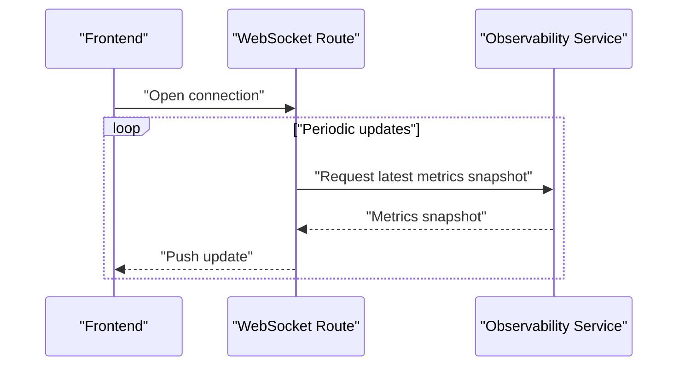
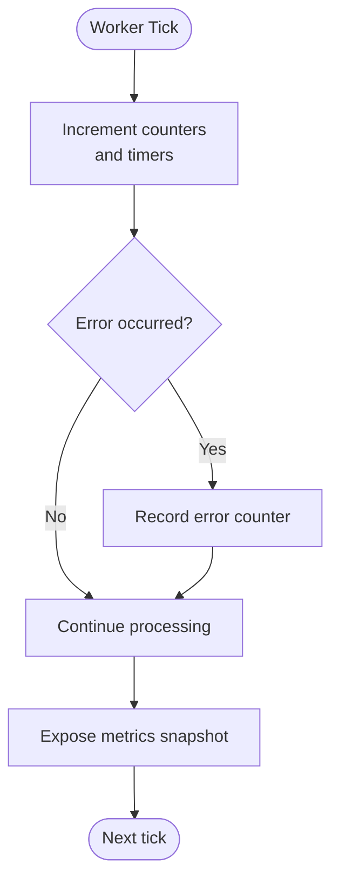
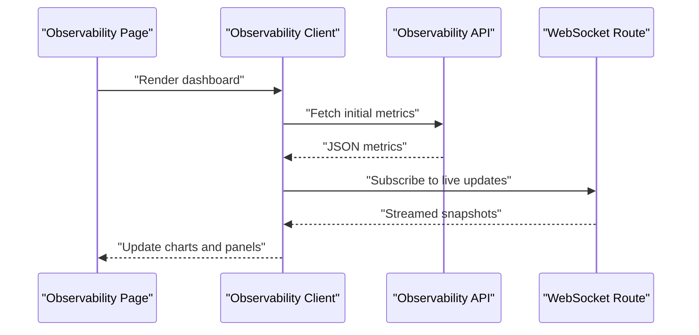
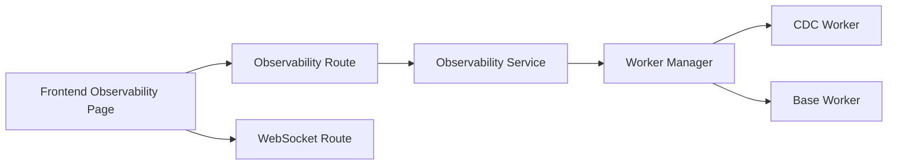

# Metrics Collection & Monitoring

<cite>
**Referenced Files in This Document**
- [observability.py](file://backend/app/exceptions/observability.py)
- [observability.py](file://backend/app/routes/observability.py)
- [observability_service.py](file://backend/app/services/observability_service.py)
- [health.py](file://backend/app/routes/health.py)
- [websocket.py](file://backend/app/routes/websocket.py)
- [cdc_worker.py](file://backend/app/workers/cdc_worker.py)
- [base_worker.py](file://backend/app/workers/base_worker.py)
- [manager.py](file://backend/app/workers/manager.py)
- [ObservabilityPage.tsx](file://frontend/src/pages/ObservabilityPage.tsx)
- [observabilityService.ts](file://frontend/src/services/observabilityService.ts)
</cite>

## Table of Contents
1. [Introduction](#introduction)
2. [Project Structure](#project-structure)
3. [Core Components](#core-components)
4. [Architecture Overview](#architecture-overview)
5. [Detailed Component Analysis](#detailed-component-analysis)
6. [Dependency Analysis](#dependency-analysis)
7. [Performance Considerations](#performance-considerations)
8. [Troubleshooting Guide](#troubleshooting-guide)
9. [Conclusion](#conclusion)
10. [Appendices](#appendices)

## Introduction
This document explains CloudBridge’s metrics collection and monitoring capabilities, focusing on built-in observability for migration performance, CDC throughput, API response times, and resource utilization. It also covers export formats compatible with Prometheus and Grafana, custom metric creation for business KPIs, dashboard features for real-time monitoring and trend analysis, alerting guidance, and integration patterns with external monitoring platforms.

## Project Structure
CloudBridge implements observability across backend services, workers, routes, and a frontend dashboard:
- Backend observability endpoints and service layer expose metrics and health information.
- Workers (CDC and base worker) instrument operational flows to emit metrics.
- Frontend provides an Observability page that consumes backend APIs and renders dashboards.

[No sources needed since this diagram shows conceptual workflow, not actual code structure]

## Core Components
- Observability API and Service: Provide endpoints to query metrics, system health, and streaming updates. The service coordinates data from workers and runtime components.
- Health Endpoint: Exposes readiness/liveness indicators used by orchestrators and dashboards.
- WebSocket Endpoint: Streams live events and metrics updates to the frontend.
- Workers (CDC and Base): Emit operational metrics such as event counts, processing durations, and error rates.
- Frontend Observability Page: Visualizes metrics, trends, and status using the backend APIs and WebSocket stream.

Key responsibilities:
- Collect metrics from application layers and background workers.
- Aggregate and format metrics for consumption by Prometheus exporters or internal clients.
- Serve health checks for orchestration and load balancers.
- Stream real-time updates via WebSockets for interactive dashboards.

**Section sources**
- [observability.py](file://backend/app/routes/observability.py)
- [observability_service.py](file://backend/app/services/observability_service.py)
- [health.py](file://backend/app/routes/health.py)
- [websocket.py](file://backend/app/routes/websocket.py)
- [cdc_worker.py](file://backend/app/workers/cdc_worker.py)
- [base_worker.py](file://backend/app/workers/base_worker.py)
- [manager.py](file://backend/app/workers/manager.py)
- [ObservabilityPage.tsx](file://frontend/src/pages/ObservabilityPage.tsx)
- [observabilityService.ts](file://frontend/src/services/observabilityService.ts)

## Architecture Overview
The observability architecture centers around a service layer that aggregates metrics from workers and exposes them through REST and WebSocket endpoints. The frontend consumes these endpoints to render dashboards and charts.

**Diagram sources**
- [observability.py](file://backend/app/routes/observability.py)
- [observability_service.py](file://backend/app/services/observability_service.py)
- [websocket.py](file://backend/app/routes/websocket.py)
- [cdc_worker.py](file://backend/app/workers/cdc_worker.py)
- [base_worker.py](file://backend/app/workers/base_worker.py)

## Detailed Component Analysis

### Observability API and Service
Responsibilities:
- Expose REST endpoints for metrics retrieval and health checks.
- Coordinate metric aggregation from workers and runtime state.
- Format responses for Prometheus-compatible consumers and frontend dashboards.

Operational flow:
- REST requests are handled by the observability route, which delegates to the observability service.
- The service queries worker managers and individual workers for counters, gauges, and timers.
- Responses include structured JSON suitable for Prometheus scraping or direct consumption by Grafana panels.

**Diagram sources**
- [observability.py](file://backend/app/routes/observability.py)
- [observability_service.py](file://backend/app/services/observability_service.py)
- [manager.py](file://backend/app/workers/manager.py)
- [cdc_worker.py](file://backend/app/workers/cdc_worker.py)
- [base_worker.py](file://backend/app/workers/base_worker.py)

**Section sources**
- [observability.py](file://backend/app/routes/observability.py)
- [observability_service.py](file://backend/app/services/observability_service.py)

### Health Endpoint
Purpose:
- Provide liveness/readiness signals for Kubernetes probes and load balancers.
- Surface basic system status and dependency health.

Integration:
- Used by orchestration tools to determine deployment health.
- Consumed by dashboards to indicate overall system availability.

**Section sources**
- [health.py](file://backend/app/routes/health.py)

### WebSocket Streaming
Purpose:
- Push real-time metric updates and events to the frontend without polling.
- Enable live dashboards for migrations, CDC throughput, and system status.

Flow:
- Clients connect to the WebSocket endpoint.
- Server emits periodic snapshots and event-driven updates.
- Frontend subscribes and renders live charts and alerts.

**Diagram sources**
- [websocket.py](file://backend/app/routes/websocket.py)
- [observability_service.py](file://backend/app/services/observability_service.py)

**Section sources**
- [websocket.py](file://backend/app/routes/websocket.py)

### Workers (CDC and Base)
Responsibilities:
- Emit operational metrics such as processed event counts, latency histograms, and error rates.
- Maintain counters and timers for key operations.

Metrics emitted:
- CDC throughput: events processed per interval, lag indicators.
- Migration performance: job durations, success/failure counts.
- Resource utilization: CPU/memory usage snapshots where available.

**Diagram sources**
- [cdc_worker.py](file://backend/app/workers/cdc_worker.py)
- [base_worker.py](file://backend/app/workers/base_worker.py)

**Section sources**
- [cdc_worker.py](file://backend/app/workers/cdc_worker.py)
- [base_worker.py](file://backend/app/workers/base_worker.py)
- [manager.py](file://backend/app/workers/manager.py)

### Frontend Observability Dashboard
Features:
- Real-time charts for CDC throughput, migration progress, and API response times.
- Trend analysis over configurable time windows.
- Status badges and alerts based on thresholds.

Data sources:
- REST endpoints for historical metrics.
- WebSocket stream for live updates.

**Diagram sources**
- [ObservabilityPage.tsx](file://frontend/src/pages/ObservabilityPage.tsx)
- [observabilityService.ts](file://frontend/src/services/observabilityService.ts)
- [observability.py](file://backend/app/routes/observability.py)
- [websocket.py](file://backend/app/routes/websocket.py)

**Section sources**
- [ObservabilityPage.tsx](file://frontend/src/pages/ObservabilityPage.tsx)
- [observabilityService.ts](file://frontend/src/services/observabilityService.ts)

## Dependency Analysis
Component relationships:
- Routes depend on the observability service for aggregated metrics.
- The service depends on worker managers and workers for counters and timers.
- Frontend depends on both REST and WebSocket endpoints for data.

**Diagram sources**
- [observability.py](file://backend/app/routes/observability.py)
- [observability_service.py](file://backend/app/services/observability_service.py)
- [manager.py](file://backend/app/workers/manager.py)
- [cdc_worker.py](file://backend/app/workers/cdc_worker.py)
- [base_worker.py](file://backend/app/workers/base_worker.py)
- [websocket.py](file://backend/app/routes/websocket.py)
- [ObservabilityPage.tsx](file://frontend/src/pages/ObservabilityPage.tsx)

**Section sources**
- [observability.py](file://backend/app/routes/observability.py)
- [observability_service.py](file://backend/app/services/observability_service.py)
- [manager.py](file://backend/app/workers/manager.py)
- [cdc_worker.py](file://backend/app/workers/cdc_worker.py)
- [base_worker.py](file://backend/app/workers/base_worker.py)
- [websocket.py](file://backend/app/routes/websocket.py)
- [ObservabilityPage.tsx](file://frontend/src/pages/ObservabilityPage.tsx)

## Performance Considerations
- Prefer counters and gauges for high-frequency metrics; use histograms sparingly due to cardinality and memory overhead.
- Batch metric snapshots at reasonable intervals to reduce overhead on workers and API calls.
- Use WebSocket streams for live dashboards to avoid excessive polling.
- Limit label cardinality in exported metrics to maintain Prometheus scrape efficiency.
- Implement backpressure in workers to prevent metric emission from blocking core processing.

[No sources needed since this section provides general guidance]

## Troubleshooting Guide
Common issues and resolutions:
- Missing metrics in Prometheus: Verify scrape configuration targets the correct endpoint and labels are within expected cardinality limits.
- Stale dashboard data: Ensure WebSocket connections are established and reconnected on network interruptions.
- High API latency: Investigate aggregation logic in the observability service and worker manager queries.
- Health check failures: Review dependency health and worker statuses exposed by the health endpoint.

**Section sources**
- [health.py](file://backend/app/routes/health.py)
- [websocket.py](file://backend/app/routes/websocket.py)
- [observability_service.py](file://backend/app/services/observability_service.py)

## Conclusion
CloudBridge’s observability stack integrates metrics collection across workers and services, exposing them via REST and WebSocket endpoints. The frontend dashboard provides real-time insights and trend analysis. With careful attention to metric design, export formats, and alerting rules, teams can achieve robust monitoring aligned with Prometheus and Grafana ecosystems.

[No sources needed since this section summarizes without analyzing specific files]

## Appendices

### Built-in Metrics Categories
- Migration performance: job durations, success/failure counts, checkpoint progress.
- CDC throughput: events processed per interval, lag indicators, error rates.
- API response times: request latencies and error rates.
- Resource utilization: CPU/memory snapshots where available.

[No sources needed since this section provides general guidance]

### Export Formats and Integration
- Prometheus-compatible JSON output for scraping.
- Direct consumption by Grafana via REST and WebSocket endpoints.
- Optional exporter adapters for other monitoring systems.

[No sources needed since this section provides general guidance]

### Custom Metric Creation
- Define new counters/gauges/timers in relevant workers or services.
- Expose aggregated values through the observability service.
- Add corresponding panels in the frontend dashboard.

[No sources needed since this section provides general guidance]

### Alerting Rules Guidance
- Set thresholds for error rates, latency percentiles, and throughput drops.
- Use Prometheus recording rules for derived metrics.
- Configure alertmanager integrations for notifications.

[No sources needed since this section provides general guidance]