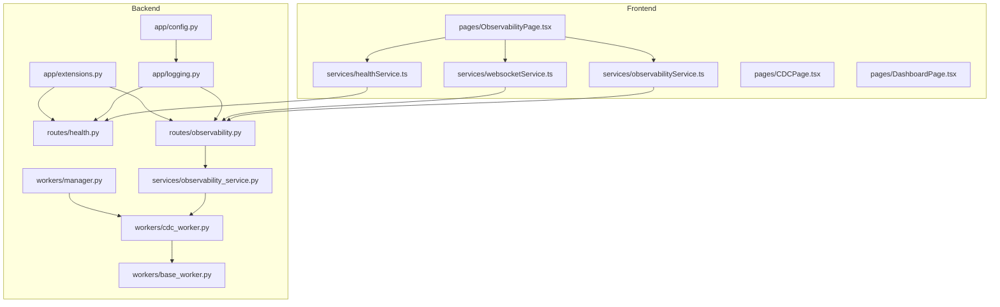
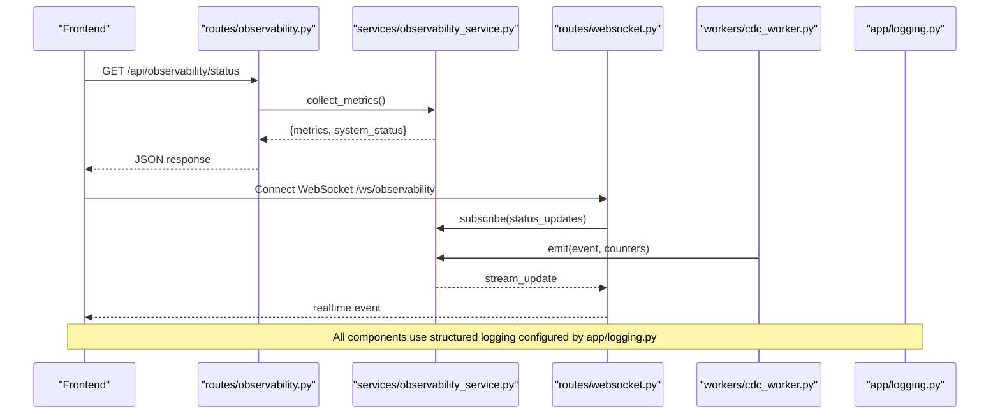
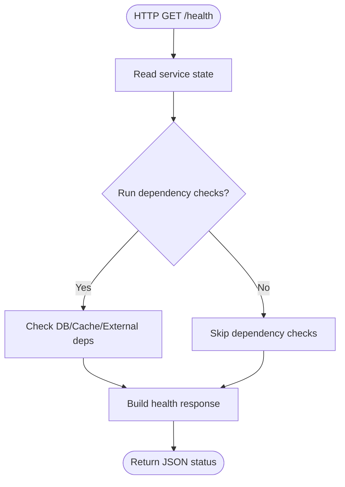
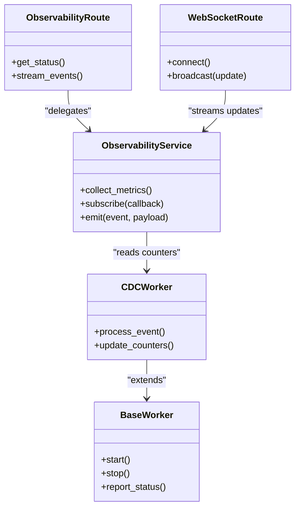
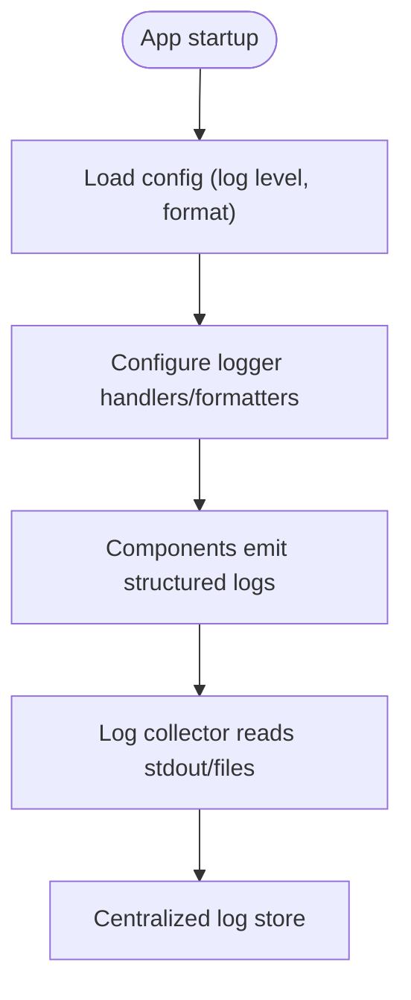
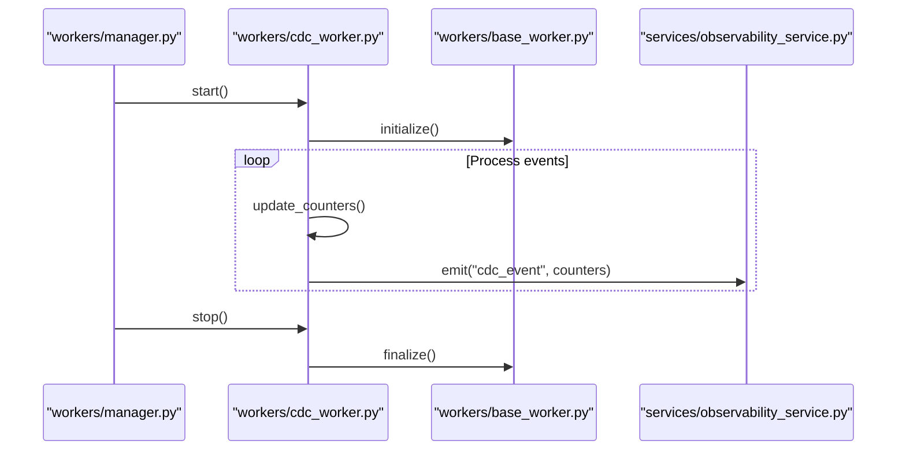
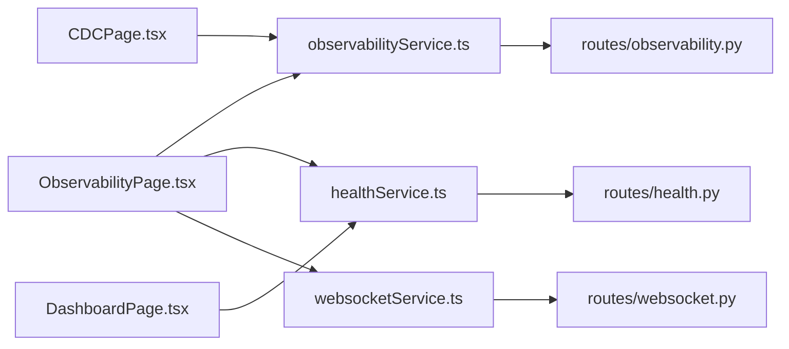
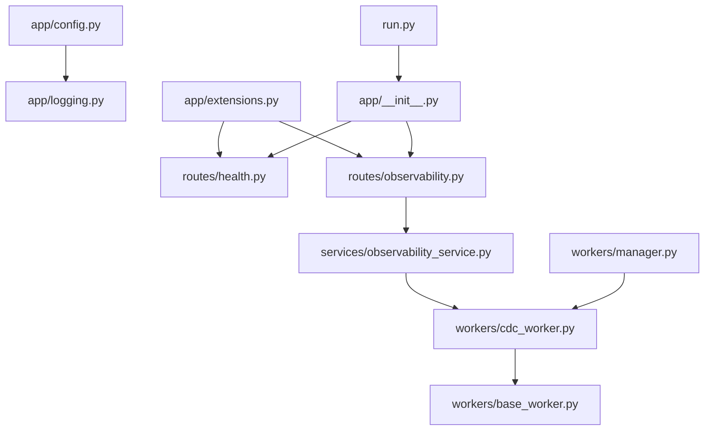

# Monitoring & Observability

<cite>
**Referenced Files in This Document**
- [health.py](file://backend/app/routes/health.py)
- [observability.py](file://backend/app/routes/observability.py)
- [observability_service.py](file://backend/app/services/observability_service.py)
- [observability.py](file://backend/app/exceptions/observability.py)
- [logging.py](file://backend/app/logging.py)
- [config.py](file://backend/app/config.py)
- [extensions.py](file://backend/app/extensions.py)
- [run.py](file://backend/run.py)
- [app/__init__.py](file://backend/app/__init__.py)
- [websocket.py](file://backend/app/routes/websocket.py)
- [cdc_worker.py](file://backend/app/workers/cdc_worker.py)
- [base_worker.py](file://backend/app/workers/base_worker.py)
- [manager.py](file://backend/app/workers/manager.py)
- [ObservabilityPage.tsx](file://frontend/src/pages/ObservabilityPage.tsx)
- [observabilityService.ts](file://frontend/src/services/observabilityService.ts)
- [healthService.ts](file://frontend/src/services/healthService.ts)
- [websocketService.ts](file://frontend/src/services/websocketService.ts)
- [CDCPage.tsx](file://frontend/src/pages/CDCPage.tsx)
- [DashboardPage.tsx](file://frontend/src/pages/DashboardPage.tsx)
</cite>

## Table of Contents
1. [Introduction](#introduction)
2. [Project Structure](#project-structure)
3. [Core Components](#core-components)
4. [Architecture Overview](#architecture-overview)
5. [Detailed Component Analysis](#detailed-component-analysis)
6. [Dependency Analysis](#dependency-analysis)
7. [Performance Considerations](#performance-considerations)
8. [Troubleshooting Guide](#troubleshooting-guide)
9. [Conclusion](#conclusion)
10. [Appendices](#appendices)

## Introduction
This document explains CloudBridge’s monitoring and observability features, including health checks, metrics collection, system status monitoring, logging strategies, dashboards, alerting, integrations with external tools (Prometheus, Grafana, APM), performance profiling, debugging techniques, and production troubleshooting methodologies. It is intended for operators, SREs, and developers who need to ensure reliability and visibility into migrations, CDC pipelines, and overall system health.

## Project Structure
CloudBridge implements observability across backend routes, services, workers, and a frontend dashboard:
- Backend exposes health and observability endpoints, structured logging, and worker telemetry.
- Frontend provides an Observability page and related services to visualize migration progress, CDC performance, and system health.

**Diagram sources**
- [health.py](file://backend/app/routes/health.py)
- [observability.py](file://backend/app/routes/observability.py)
- [observability_service.py](file://backend/app/services/observability_service.py)
- [logging.py](file://backend/app/logging.py)
- [config.py](file://backend/app/config.py)
- [extensions.py](file://backend/app/extensions.py)
- [cdc_worker.py](file://backend/app/workers/cdc_worker.py)
- [base_worker.py](file://backend/app/workers/base_worker.py)
- [manager.py](file://backend/app/workers/manager.py)
- [ObservabilityPage.tsx](file://frontend/src/pages/ObservabilityPage.tsx)
- [observabilityService.ts](file://frontend/src/services/observabilityService.ts)
- [healthService.ts](file://frontend/src/services/healthService.ts)
- [websocketService.ts](file://frontend/src/services/websocketService.ts)
- [CDCPage.tsx](file://frontend/src/pages/CDCPage.tsx)
- [DashboardPage.tsx](file://frontend/src/pages/DashboardPage.tsx)

**Section sources**
- [health.py](file://backend/app/routes/health.py)
- [observability.py](file://backend/app/routes/observability.py)
- [observability_service.py](file://backend/app/services/observability_service.py)
- [logging.py](file://backend/app/logging.py)
- [config.py](file://backend/app/config.py)
- [extensions.py](file://backend/app/extensions.py)
- [run.py](file://backend/run.py)
- [app/__init__.py](file://backend/app/__init__.py)
- [websocket.py](file://backend/app/routes/websocket.py)
- [cdc_worker.py](file://backend/app/workers/cdc_worker.py)
- [base_worker.py](file://backend/app/workers/base_worker.py)
- [manager.py](file://backend/app/workers/manager.py)
- [ObservabilityPage.tsx](file://frontend/src/pages/ObservabilityPage.tsx)
- [observabilityService.ts](file://frontend/src/services/observabilityService.ts)
- [healthService.ts](file://frontend/src/services/healthService.ts)
- [websocketService.ts](file://frontend/src/services/websocketService.ts)
- [CDCPage.tsx](file://frontend/src/pages/CDCPage.tsx)
- [DashboardPage.tsx](file://frontend/src/pages/DashboardPage.tsx)

## Core Components
- Health check endpoints: Provide liveness/readiness signals for orchestrators and load balancers.
- Observability endpoints: Expose aggregated metrics, system status, and real-time updates via HTTP and WebSocket.
- Structured logging: Centralized configuration for log levels, formats, and aggregation targets.
- Worker telemetry: Background tasks (CDC, migrations) emit status and counters for observability.
- Frontend dashboard: Visualizes migration progress, CDC lag/performance, and system health indicators.

Key responsibilities:
- Health route: returns service availability and dependency status.
- Observability route/service: collects and serves metrics and status; supports streaming updates.
- Logging module: configures structured logs and integrates with environment settings.
- Workers: update shared state/metrics as they process events or migrations.
- Frontend services: fetch metrics and connect to WebSocket streams for live updates.

**Section sources**
- [health.py](file://backend/app/routes/health.py)
- [observability.py](file://backend/app/routes/observability.py)
- [observability_service.py](file://backend/app/services/observability_service.py)
- [logging.py](file://backend/app/logging.py)
- [cdc_worker.py](file://backend/app/workers/cdc_worker.py)
- [base_worker.py](file://backend/app/workers/base_worker.py)
- [manager.py](file://backend/app/workers/manager.py)
- [ObservabilityPage.tsx](file://frontend/src/pages/ObservabilityPage.tsx)
- [observabilityService.ts](file://frontend/src/services/observabilityService.ts)
- [healthService.ts](file://frontend/src/services/healthService.ts)
- [websocketService.ts](file://frontend/src/services/websocketService.ts)

## Architecture Overview
The observability architecture combines REST endpoints, background workers, and a WebSocket channel to deliver both on-demand and real-time insights. The frontend aggregates data from multiple services and renders dashboards for migrations, CDC, and system health.

**Diagram sources**
- [observability.py](file://backend/app/routes/observability.py)
- [observability_service.py](file://backend/app/services/observability_service.py)
- [websocket.py](file://backend/app/routes/websocket.py)
- [cdc_worker.py](file://backend/app/workers/cdc_worker.py)
- [logging.py](file://backend/app/logging.py)

## Detailed Component Analysis

### Health Check Endpoints
- Purpose: Provide liveness and readiness probes for Kubernetes, ECS, or load balancers.
- Behavior: Returns current service state and optional dependency checks.
- Integration: Used by orchestrators to restart unhealthy instances or remove from rotation.

**Diagram sources**
- [health.py](file://backend/app/routes/health.py)
- [extensions.py](file://backend/app/extensions.py)

**Section sources**
- [health.py](file://backend/app/routes/health.py)
- [extensions.py](file://backend/app/extensions.py)

### Observability Endpoints and Service
- Purpose: Aggregate metrics, system status, and streaming updates for dashboards and external tools.
- Key capabilities:
  - On-demand metrics retrieval via HTTP.
  - Real-time updates via WebSocket.
  - Aggregation of worker-level counters and CDC performance indicators.
- Frontend integration:
  - Polls HTTP endpoints for snapshots.
  - Subscribes to WebSocket for live updates.

**Diagram sources**
- [observability.py](file://backend/app/routes/observability.py)
- [observability_service.py](file://backend/app/services/observability_service.py)
- [cdc_worker.py](file://backend/app/workers/cdc_worker.py)
- [base_worker.py](file://backend/app/workers/base_worker.py)
- [websocket.py](file://backend/app/routes/websocket.py)

**Section sources**
- [observability.py](file://backend/app/routes/observability.py)
- [observability_service.py](file://backend/app/services/observability_service.py)
- [websocket.py](file://backend/app/routes/websocket.py)
- [cdc_worker.py](file://backend/app/workers/cdc_worker.py)
- [base_worker.py](file://backend/app/workers/base_worker.py)

### Logging Strategy
- Structured logging:
  - Consistent JSON format with correlation IDs and contextual fields.
  - Log levels configurable per component/environment.
- Aggregation patterns:
  - File-based output for local development.
  - Stdout/stderr for containerized deployments to be consumed by log collectors.
- Configuration:
  - Centralized in the logging module and driven by application config.

**Diagram sources**
- [logging.py](file://backend/app/logging.py)
- [config.py](file://backend/app/config.py)

**Section sources**
- [logging.py](file://backend/app/logging.py)
- [config.py](file://backend/app/config.py)

### Worker Telemetry and Status
- Workers report lifecycle events and operational counters.
- CDC worker emits performance metrics such as throughput, lag, and error rates.
- Manager coordinates worker lifecycle and aggregates statuses.

**Diagram sources**
- [manager.py](file://backend/app/workers/manager.py)
- [cdc_worker.py](file://backend/app/workers/cdc_worker.py)
- [base_worker.py](file://backend/app/workers/base_worker.py)
- [observability_service.py](file://backend/app/services/observability_service.py)

**Section sources**
- [manager.py](file://backend/app/workers/manager.py)
- [cdc_worker.py](file://backend/app/workers/cdc_worker.py)
- [base_worker.py](file://backend/app/workers/base_worker.py)
- [observability_service.py](file://backend/app/services/observability_service.py)

### Frontend Observability Dashboard
- Pages:
  - Observability page: central view for system health, metrics, and live updates.
  - CDC page: detailed CDC performance and lag visualization.
  - Dashboard page: high-level overview and quick links.
- Services:
  - Observability service: fetches metrics and manages WebSocket connections.
  - Health service: polls health endpoints.
  - WebSocket service: handles connection lifecycle and message routing.

**Diagram sources**
- [ObservabilityPage.tsx](file://frontend/src/pages/ObservabilityPage.tsx)
- [observabilityService.ts](file://frontend/src/services/observabilityService.ts)
- [healthService.ts](file://frontend/src/services/healthService.ts)
- [websocketService.ts](file://frontend/src/services/websocketService.ts)
- [CDCPage.tsx](file://frontend/src/pages/CDCPage.tsx)
- [DashboardPage.tsx](file://frontend/src/pages/DashboardPage.tsx)
- [observability.py](file://backend/app/routes/observability.py)
- [health.py](file://backend/app/routes/health.py)
- [websocket.py](file://backend/app/routes/websocket.py)

**Section sources**
- [ObservabilityPage.tsx](file://frontend/src/pages/ObservabilityPage.tsx)
- [observabilityService.ts](file://frontend/src/services/observabilityService.ts)
- [healthService.ts](file://frontend/src/services/healthService.ts)
- [websocketService.ts](file://frontend/src/services/websocketService.ts)
- [CDCPage.tsx](file://frontend/src/pages/CDCPage.tsx)
- [DashboardPage.tsx](file://frontend/src/pages/DashboardPage.tsx)
- [observability.py](file://backend/app/routes/observability.py)
- [health.py](file://backend/app/routes/health.py)
- [websocket.py](file://backend/app/routes/websocket.py)

## Dependency Analysis
Observability depends on configuration, extensions, and worker subsystems. The following diagram highlights key dependencies among core modules.

**Diagram sources**
- [config.py](file://backend/app/config.py)
- [logging.py](file://backend/app/logging.py)
- [extensions.py](file://backend/app/extensions.py)
- [health.py](file://backend/app/routes/health.py)
- [observability.py](file://backend/app/routes/observability.py)
- [observability_service.py](file://backend/app/services/observability_service.py)
- [cdc_worker.py](file://backend/app/workers/cdc_worker.py)
- [base_worker.py](file://backend/app/workers/base_worker.py)
- [manager.py](file://backend/app/workers/manager.py)
- [run.py](file://backend/run.py)
- [app/__init__.py](file://backend/app/__init__.py)

**Section sources**
- [config.py](file://backend/app/config.py)
- [logging.py](file://backend/app/logging.py)
- [extensions.py](file://backend/app/extensions.py)
- [health.py](file://backend/app/routes/health.py)
- [observability.py](file://backend/app/routes/observability.py)
- [observability_service.py](file://backend/app/services/observability_service.py)
- [cdc_worker.py](file://backend/app/workers/cdc_worker.py)
- [base_worker.py](file://backend/app/workers/base_worker.py)
- [manager.py](file://backend/app/workers/manager.py)
- [run.py](file://backend/run.py)
- [app/__init__.py](file://backend/app/__init__.py)

## Performance Considerations
- Metrics collection:
  - Prefer lightweight counters and gauges; avoid heavy computations in hot paths.
  - Batch updates where possible to reduce contention.
- Streaming updates:
  - Use backpressure-aware WebSocket broadcasting to prevent memory growth under load.
- Logging:
  - Adjust log levels in production to INFO/WARNING to reduce I/O overhead.
  - Ensure structured logs are concise; include only essential context.
- Worker performance:
  - Monitor CDC lag and throughput; tune concurrency based on resource capacity.
  - Periodically flush and rotate internal buffers to avoid spikes.

[No sources needed since this section provides general guidance]

## Troubleshooting Guide
Common issues and resolutions:
- Health endpoint failures:
  - Verify dependency checks and network connectivity.
  - Inspect structured logs for upstream errors.
- Missing metrics or stale data:
  - Confirm observability service is running and workers are reporting.
  - Validate WebSocket subscriptions and reconnection logic.
- High CPU/memory usage:
  - Profile worker loops and metric emission paths.
  - Reduce log verbosity and optimize aggregation frequency.
- Alerting not firing:
  - Ensure thresholds align with observed baselines.
  - Validate notification channels and delivery logs.

Operational tips:
- Use correlation IDs to trace requests across routes, services, and workers.
- Enable DEBUG temporarily during incidents, then revert to safer levels.
- Capture snapshots of metrics before and after changes to isolate regressions.

**Section sources**
- [observability.py](file://backend/app/routes/observability.py)
- [observability_service.py](file://backend/app/services/observability_service.py)
- [logging.py](file://backend/app/logging.py)
- [cdc_worker.py](file://backend/app/workers/cdc_worker.py)
- [websocket.py](file://backend/app/routes/websocket.py)

## Conclusion
CloudBridge’s observability stack provides robust health checks, structured logging, metrics collection, and real-time streaming to support reliable migrations and CDC operations. With clear separation between routes, services, and workers, plus a cohesive frontend dashboard, teams can monitor system health, diagnose issues quickly, and integrate with external monitoring ecosystems effectively.

[No sources needed since this section summarizes without analyzing specific files]

## Appendices

### Integrating with External Monitoring Tools
- Prometheus:
  - Expose a metrics endpoint compatible with Prometheus scraping.
  - Instrument key counters (e.g., CDC lag, migration durations).
- Grafana:
  - Create dashboards using Prometheus data sources.
  - Visualize migration progress, CDC throughput, and error rates.
- APM solutions:
  - Add tracing spans around critical paths (migration orchestration, CDC processing).
  - Correlate traces with structured logs using correlation IDs.

[No sources needed since this section provides general guidance]

### Alerting Configuration and Notification Channels
- Define thresholds for:
  - CDC lag, error rates, migration failure counts, and health probe failures.
- Configure notifications via:
  - Email, chat platforms, or ticketing systems through existing notification infrastructure.
- Incident response workflows:
  - Auto-create tickets on critical alerts.
  - Route alerts to on-call rotations with runbooks linked.

[No sources needed since this section provides general guidance]

### Performance Profiling and Debugging Techniques
- Profiling:
  - Use language-native profilers to identify hotspots in workers and metric collection.
  - Sample CPU and memory profiles during peak loads.
- Debugging:
  - Enable verbose logging for targeted components during investigations.
  - Replay events using stored logs and metrics to reproduce issues.
- Production safety:
  - Avoid long-running debug sessions; prefer short bursts with focused instrumentation.
  - Roll out changes incrementally and validate observability signals first.

[No sources needed since this section provides general guidance]