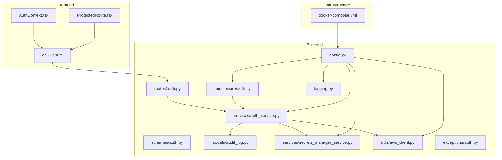
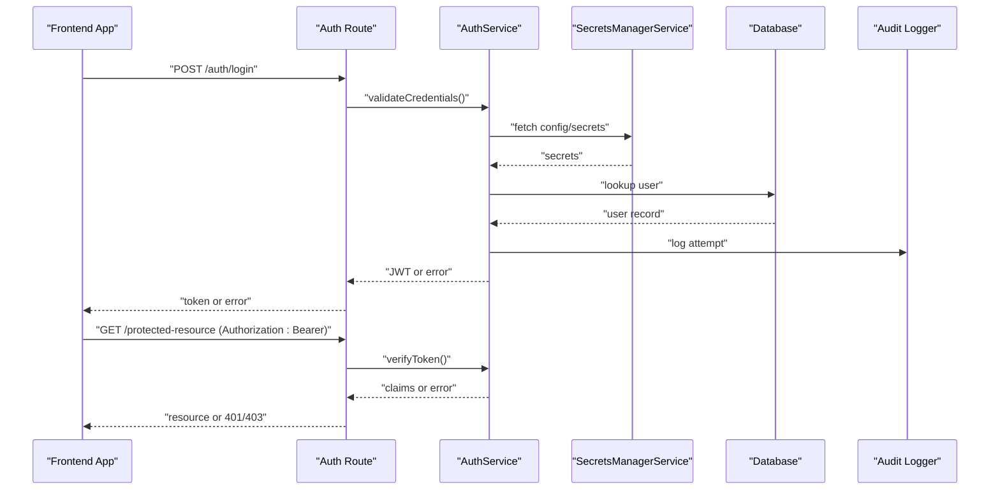
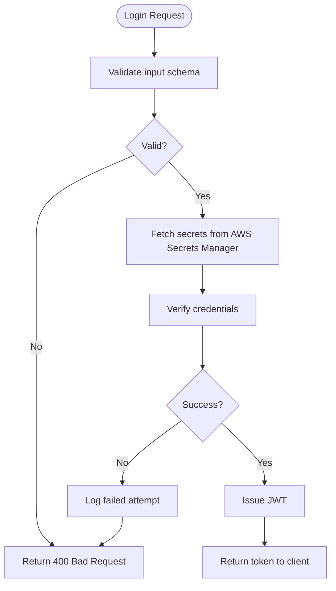
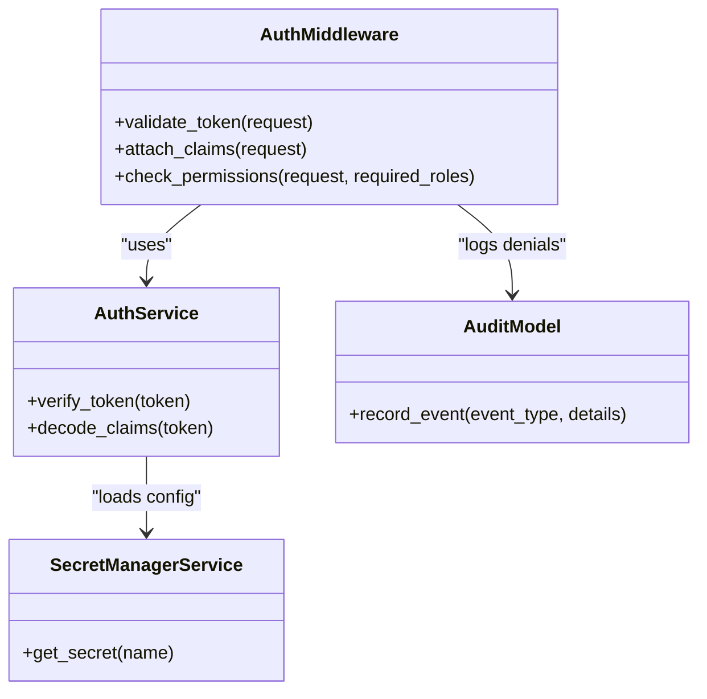
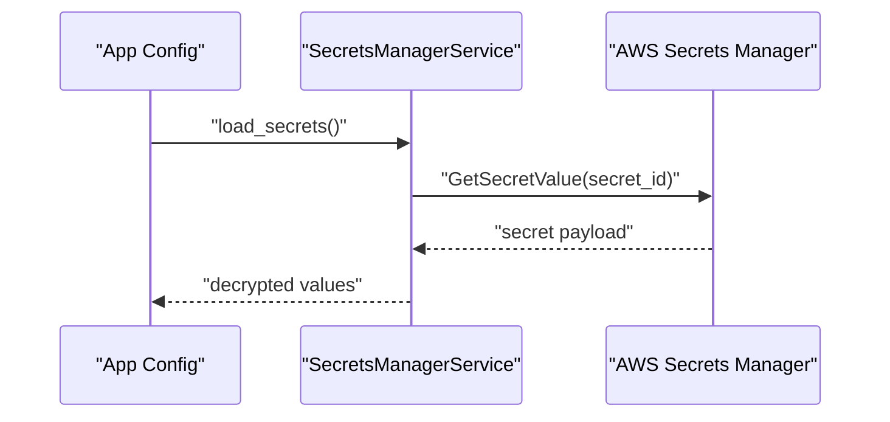
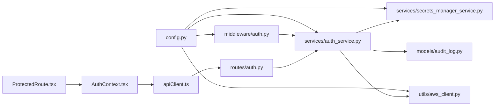

# Security Guide

<cite>
**Referenced Files in This Document**
- [backend/app/config.py](file://backend/app/config.py)
- [backend/app/middleware/auth.py](file://backend/app/middleware/auth.py)
- [backend/app/routes/auth.py](file://backend/app/routes/auth.py)
- [backend/app/schemas/auth.py](file://backend/app/schemas/auth.py)
- [backend/app/services/auth_service.py](file://backend/app/services/auth_service.py)
- [backend/app/models/audit_log.py](file://backend/app/models/audit_log.py)
- [backend/app/services/secrets_manager_service.py](file://backend/app/services/secrets_manager_service.py)
- [backend/app/utils/aws_client.py](file://backend/app/utils/aws_client.py)
- [backend/app/exceptions/auth.py](file://backend/app/exceptions/auth.py)
- [backend/app/logging.py](file://backend/app/logging.py)
- [frontend/src/context/AuthContext.tsx](file://frontend/src/context/AuthContext.tsx)
- [frontend/src/components/routing/ProtectedRoute.tsx](file://frontend/src/components/routing/ProtectedRoute.tsx)
- [frontend/src/services/apiClient.ts](file://frontend/src/services/apiClient.ts)
- [docker-compose.yml](file://docker-compose.yml)
</cite>

## Table of Contents
1. [Introduction](#introduction)
2. [Project Structure](#project-structure)
3. [Core Components](#core-components)
4. [Architecture Overview](#architecture-overview)
5. [Detailed Component Analysis](#detailed-component-analysis)
6. [Dependency Analysis](#dependency-analysis)
7. [Performance Considerations](#performance-considerations)
8. [Troubleshooting Guide](#troubleshooting-guide)
9. [Conclusion](#conclusion)
10. [Appendices](#appendices)

## Introduction
This Security Guide documents CloudBridge’s authentication, authorization, and data protection mechanisms. It covers JWT-based authentication flow, token management, session handling, role-based access control (RBAC), secrets management with AWS Secrets Manager, encryption at rest and in transit, secure configuration practices, audit logging for compliance, security event monitoring, vulnerability assessment procedures, and best practices for deployment, network security, and API security. It also addresses common threats, mitigations, and testing approaches.

## Project Structure
CloudBridge is a full-stack application with a Python backend and a React frontend. Security-related components are primarily implemented in the backend under app directories for middleware, routes, services, models, schemas, exceptions, and utilities. The frontend includes context and routing components to manage client-side authentication state and protected navigation.

**Diagram sources**
- [backend/app/config.py](file://backend/app/config.py)
- [backend/app/middleware/auth.py](file://backend/app/middleware/auth.py)
- [backend/app/routes/auth.py](file://backend/app/routes/auth.py)
- [backend/app/schemas/auth.py](file://backend/app/schemas/auth.py)
- [backend/app/services/auth_service.py](file://backend/app/services/auth_service.py)
- [backend/app/models/audit_log.py](file://backend/app/models/audit_log.py)
- [backend/app/services/secrets_manager_service.py](file://backend/app/services/secrets_manager_service.py)
- [backend/app/utils/aws_client.py](file://backend/app/utils/aws_client.py)
- [backend/app/logging.py](file://backend/app/logging.py)
- [backend/app/exceptions/auth.py](file://backend/app/exceptions/auth.py)
- [frontend/src/context/AuthContext.tsx](file://frontend/src/context/AuthContext.tsx)
- [frontend/src/components/routing/ProtectedRoute.tsx](file://frontend/src/components/routing/ProtectedRoute.tsx)
- [frontend/src/services/apiClient.ts](file://frontend/src/services/apiClient.ts)
- [docker-compose.yml](file://docker-compose.yml)

**Section sources**
- [backend/app/config.py](file://backend/app/config.py)
- [backend/app/middleware/auth.py](file://backend/app/middleware/auth.py)
- [backend/app/routes/auth.py](file://backend/app/routes/auth.py)
- [backend/app/schemas/auth.py](file://backend/app/schemas/auth.py)
- [backend/app/services/auth_service.py](file://backend/app/services/auth_service.py)
- [backend/app/models/audit_log.py](file://backend/app/models/audit_log.py)
- [backend/app/services/secrets_manager_service.py](file://backend/app/services/secrets_manager_service.py)
- [backend/app/utils/aws_client.py](file://backend/app/utils/aws_client.py)
- [backend/app/logging.py](file://backend/app/logging.py)
- [backend/app/exceptions/auth.py](file://backend/app/exceptions/auth.py)
- [frontend/src/context/AuthContext.tsx](file://frontend/src/context/AuthContext.tsx)
- [frontend/src/components/routing/ProtectedRoute.tsx](file://frontend/src/components/routing/ProtectedRoute.tsx)
- [frontend/src/services/apiClient.ts](file://frontend/src/services/apiClient.ts)
- [docker-compose.yml](file://docker-compose.yml)

## Core Components
- Authentication: JWT issuance and validation via auth service and middleware; request schema validation for login inputs.
- Authorization: Middleware-enforced checks on protected endpoints; RBAC concepts integrated into permission evaluation.
- Secrets Management: Centralized retrieval of sensitive configuration from AWS Secrets Manager.
- Data Protection: Encryption at rest and in transit enforced by infrastructure and database configurations.
- Audit Logging: Structured logging and persistence of security-relevant events.
- Client-Side Security: Token storage and injection, protected route guards.

**Section sources**
- [backend/app/services/auth_service.py](file://backend/app/services/auth_service.py)
- [backend/app/middleware/auth.py](file://backend/app/middleware/auth.py)
- [backend/app/schemas/auth.py](file://backend/app/schemas/auth.py)
- [backend/app/services/secrets_manager_service.py](file://backend/app/services/secrets_manager_service.py)
- [backend/app/models/audit_log.py](file://backend/app/models/audit_log.py)
- [frontend/src/context/AuthContext.tsx](file://frontend/src/context/AuthContext.tsx)
- [frontend/src/components/routing/ProtectedRoute.tsx](file://frontend/src/components/routing/ProtectedRoute.tsx)
- [frontend/src/services/apiClient.ts](file://frontend/src/services/apiClient.ts)

## Architecture Overview
The authentication architecture uses a stateless JWT approach. Clients authenticate via an endpoint that validates credentials, issues a JWT, and returns it to the client. Subsequent requests include the token in the Authorization header. Backend middleware validates tokens and enforces authorization policies before invoking business logic. Sensitive configuration values are loaded from AWS Secrets Manager. Audit logs capture authentication and authorization events.

**Diagram sources**
- [backend/app/routes/auth.py](file://backend/app/routes/auth.py)
- [backend/app/services/auth_service.py](file://backend/app/services/auth_service.py)
- [backend/app/services/secrets_manager_service.py](file://backend/app/services/secrets_manager_service.py)
- [backend/app/models/audit_log.py](file://backend/app/models/audit_log.py)

## Detailed Component Analysis

### Authentication Flow and JWT Lifecycle
- Login Request Validation: Input schemas enforce required fields and constraints for login payloads.
- Credential Verification: The auth service verifies credentials against stored records and retrieves necessary secrets from AWS Secrets Manager.
- Token Issuance: On success, a JWT is issued containing minimal claims needed for authorization decisions.
- Token Validation: Middleware validates incoming tokens, extracts claims, and attaches them to the request context.
- Token Refresh: A refresh mechanism can be implemented using a separate endpoint and long-lived refresh tokens if required.

**Diagram sources**
- [backend/app/schemas/auth.py](file://backend/app/schemas/auth.py)
- [backend/app/services/auth_service.py](file://backend/app/services/auth_service.py)
- [backend/app/services/secrets_manager_service.py](file://backend/app/services/secrets_manager_service.py)
- [backend/app/models/audit_log.py](file://backend/app/models/audit_log.py)

**Section sources**
- [backend/app/schemas/auth.py](file://backend/app/schemas/auth.py)
- [backend/app/services/auth_service.py](file://backend/app/services/auth_service.py)
- [backend/app/services/secrets_manager_service.py](file://backend/app/services/secrets_manager_service.py)
- [backend/app/models/audit_log.py](file://backend/app/models/audit_log.py)

### Authorization and RBAC
- Middleware Enforcement: Requests to protected endpoints pass through middleware that validates tokens and evaluates permissions.
- Role-Based Access Control: Roles and permissions are derived from token claims and/or resource metadata. Hierarchical roles can be modeled by mapping roles to permission sets.
- Resource-Level Security: Endpoints check resource ownership or policy attributes before granting access.
- Deny-by-Default: If no explicit allow exists, access is denied.

**Diagram sources**
- [backend/app/middleware/auth.py](file://backend/app/middleware/auth.py)
- [backend/app/services/auth_service.py](file://backend/app/services/auth_service.py)
- [backend/app/services/secrets_manager_service.py](file://backend/app/services/secrets_manager_service.py)
- [backend/app/models/audit_log.py](file://backend/app/models/audit_log.py)

**Section sources**
- [backend/app/middleware/auth.py](file://backend/app/middleware/auth.py)
- [backend/app/services/auth_service.py](file://backend/app/services/auth_service.py)
- [backend/app/models/audit_log.py](file://backend/app/models/audit_log.py)

### Secrets Management with AWS Secrets Manager
- Centralized Secrets: Sensitive configuration such as JWT signing keys and database credentials are retrieved from AWS Secrets Manager.
- Least Privilege: Service IAM roles have minimal permissions scoped to specific secret names.
- Rotation: Secrets should be rotated regularly; applications must handle transient errors during rotation.
- Caching Strategy: Cache secrets in memory with short TTLs to reduce API calls while ensuring timely updates.

**Diagram sources**
- [backend/app/services/secrets_manager_service.py](file://backend/app/services/secrets_manager_service.py)
- [backend/app/utils/aws_client.py](file://backend/app/utils/aws_client.py)

**Section sources**
- [backend/app/services/secrets_manager_service.py](file://backend/app/services/secrets_manager_service.py)
- [backend/app/utils/aws_client.py](file://backend/app/utils/aws_client.py)

### Encryption at Rest and In Transit
- In Transit: Enforce HTTPS/TLS for all external communications. Use strong cipher suites and certificate management.
- At Rest: Enable encryption for databases and object stores using managed KMS keys. Ensure backups inherit encryption settings.
- Key Management: Rotate keys periodically and restrict access to key material.

[No sources needed since this section provides general guidance]

### Secure Configuration Practices
- Environment Variables: Store non-sensitive configuration in environment variables; avoid hardcoding secrets.
- Secrets Injection: Load secrets from AWS Secrets Manager at startup or on-demand with caching.
- Validation: Validate configuration at startup and fail fast on invalid or missing values.
- Docker Compose: Provide secure defaults and document required secrets for deployment.

**Section sources**
- [backend/app/config.py](file://backend/app/config.py)
- [docker-compose.yml](file://docker-compose.yml)

### Audit Logging and Compliance
- Event Types: Capture login attempts, token validations, authorization failures, and sensitive operations.
- PII Minimization: Avoid logging sensitive data like passwords or tokens; log identifiers and outcomes only.
- Retention and Integrity: Ensure logs are tamper-evident and retained per compliance requirements.
- Structured Format: Use structured JSON logs for machine processing and correlation.

**Section sources**
- [backend/app/models/audit_log.py](file://backend/app/models/audit_log.py)
- [backend/app/logging.py](file://backend/app/logging.py)

### Frontend Security Controls
- Token Storage: Prefer httpOnly cookies or secure in-memory storage over localStorage when possible.
- Token Injection: Attach tokens to outgoing requests securely via API client interceptors.
- Protected Routes: Guard UI routes based on authentication state and roles.
- CSRF Mitigation: Implement CSRF protections when using cookie-based sessions.

**Section sources**
- [frontend/src/context/AuthContext.tsx](file://frontend/src/context/AuthContext.tsx)
- [frontend/src/components/routing/ProtectedRoute.tsx](file://frontend/src/components/routing/ProtectedRoute.tsx)
- [frontend/src/services/apiClient.ts](file://frontend/src/services/apiClient.ts)

## Dependency Analysis
Security-critical dependencies include the auth service, middleware, secrets manager, AWS client, and audit model. The frontend depends on API client and auth context for secure interactions.

**Diagram sources**
- [frontend/src/services/apiClient.ts](file://frontend/src/services/apiClient.ts)
- [frontend/src/context/AuthContext.tsx](file://frontend/src/context/AuthContext.tsx)
- [frontend/src/components/routing/ProtectedRoute.tsx](file://frontend/src/components/routing/ProtectedRoute.tsx)
- [backend/app/routes/auth.py](file://backend/app/routes/auth.py)
- [backend/app/services/auth_service.py](file://backend/app/services/auth_service.py)
- [backend/app/services/secrets_manager_service.py](file://backend/app/services/secrets_manager_service.py)
- [backend/app/utils/aws_client.py](file://backend/app/utils/aws_client.py)
- [backend/app/models/audit_log.py](file://backend/app/models/audit_log.py)
- [backend/app/middleware/auth.py](file://backend/app/middleware/auth.py)
- [backend/app/config.py](file://backend/app/config.py)

**Section sources**
- [backend/app/routes/auth.py](file://backend/app/routes/auth.py)
- [backend/app/services/auth_service.py](file://backend/app/services/auth_service.py)
- [backend/app/services/secrets_manager_service.py](file://backend/app/services/secrets_manager_service.py)
- [backend/app/utils/aws_client.py](file://backend/app/utils/aws_client.py)
- [backend/app/models/audit_log.py](file://backend/app/models/audit_log.py)
- [backend/app/middleware/auth.py](file://backend/app/middleware/auth.py)
- [backend/app/config.py](file://backend/app/config.py)
- [frontend/src/services/apiClient.ts](file://frontend/src/services/apiClient.ts)
- [frontend/src/context/AuthContext.tsx](file://frontend/src/context/AuthContext.tsx)
- [frontend/src/components/routing/ProtectedRoute.tsx](file://frontend/src/components/routing/ProtectedRoute.tsx)

## Performance Considerations
- Token Validation Overhead: Cache validated claims where appropriate and minimize repeated cryptographic operations.
- Secrets Retrieval: Cache secrets with short TTLs to reduce AWS API latency and throttling risk.
- Database Queries: Optimize credential lookups and ensure indexes exist for frequently queried fields.
- Rate Limiting: Apply rate limiting on authentication endpoints to mitigate brute-force attacks.

[No sources needed since this section provides general guidance]

## Troubleshooting Guide
- Authentication Failures: Check input validation, credential verification, and token issuance paths. Review audit logs for failed attempts.
- Authorization Errors: Inspect middleware claim extraction and permission checks. Confirm role mappings and resource policies.
- Secrets Issues: Validate AWS credentials and permissions; verify secret names and regions; inspect rotation-related errors.
- TLS/Network Problems: Ensure correct certificates and ports; validate reverse proxy configuration.

**Section sources**
- [backend/app/exceptions/auth.py](file://backend/app/exceptions/auth.py)
- [backend/app/models/audit_log.py](file://backend/app/models/audit_log.py)
- [backend/app/services/secrets_manager_service.py](file://backend/app/services/secrets_manager_service.py)
- [backend/app/utils/aws_client.py](file://backend/app/utils/aws_client.py)

## Conclusion
CloudBridge implements a robust security posture centered on JWT-based authentication, middleware-driven authorization, centralized secrets management, encryption at rest and in transit, and comprehensive audit logging. By following the recommended best practices and continuously monitoring security events, teams can maintain a resilient and compliant system.

[No sources needed since this section summarizes without analyzing specific files]

## Appendices

### Security Best Practices Checklist
- Enforce HTTPS everywhere and disable weak ciphers.
- Use least-privilege IAM roles for AWS integrations.
- Rotate secrets and keys regularly; automate rotation where possible.
- Validate and sanitize all inputs; reject unexpected data early.
- Implement rate limiting and account lockout policies.
- Maintain detailed audit logs with integrity controls.
- Perform regular vulnerability assessments and penetration tests.
- Keep dependencies updated and monitor advisories.

[No sources needed since this section provides general guidance]

### Common Threats and Mitigations
- Brute Force Attacks: Rate limit login endpoints; implement CAPTCHA after threshold; alert on anomalies.
- Token Theft: Use secure transport; prefer httpOnly cookies; rotate tokens; revoke on suspicious activity.
- Insecure Direct Object References: Enforce resource-level authorization checks on every request.
- Misconfiguration: Automate configuration validation; use IaC scanning; enforce secure defaults.

[No sources needed since this section provides general guidance]

### Security Testing Approaches
- Unit Tests: Cover auth flows, token validation, and permission checks.
- Integration Tests: Validate end-to-end login, protected resource access, and secrets retrieval.
- Static Analysis: Run linters and SAST tools to detect vulnerabilities early.
- Dynamic Scanning: Perform DAST scans against staging environments.
- Penetration Testing: Engage red teams to simulate real-world attacks.

[No sources needed since this section provides general guidance]