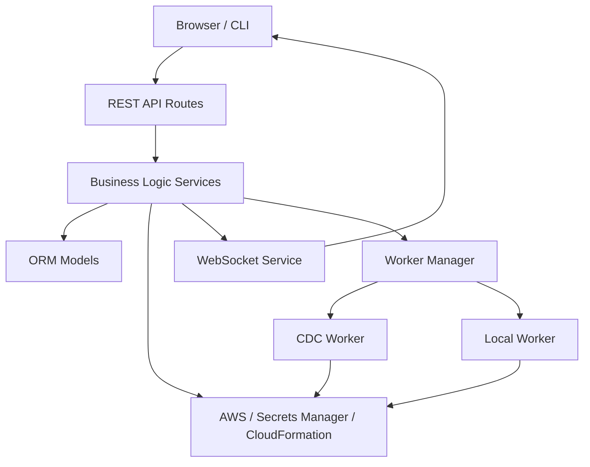
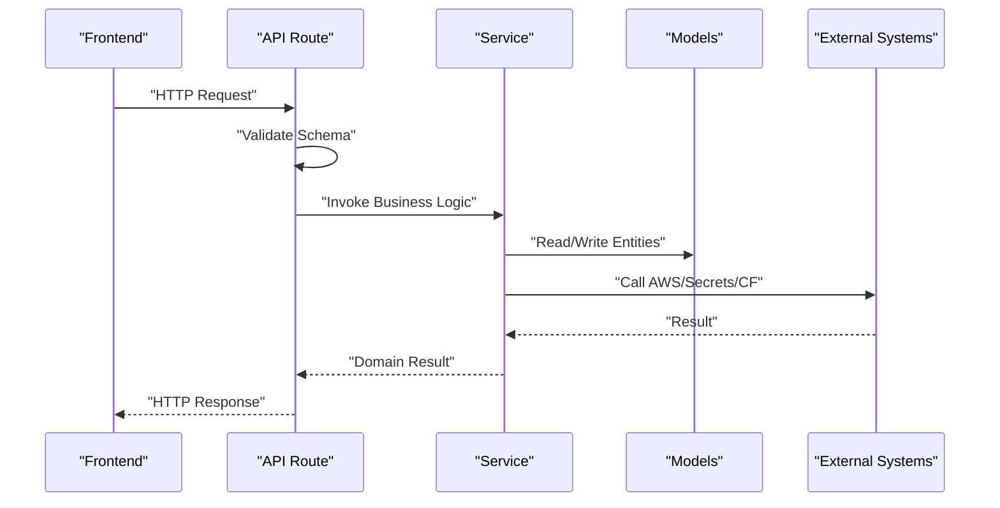
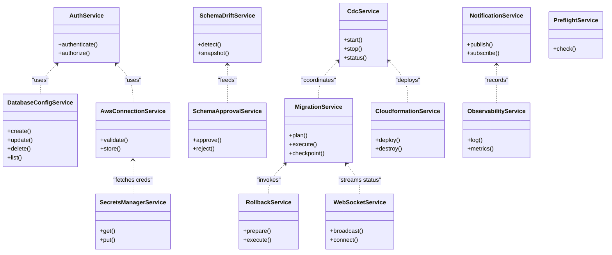
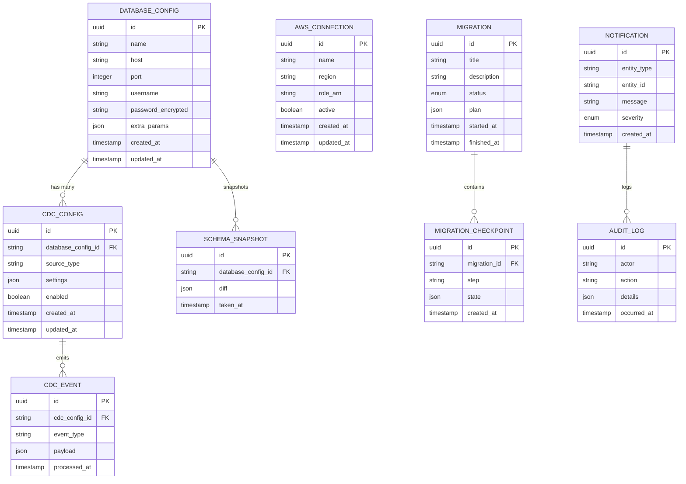
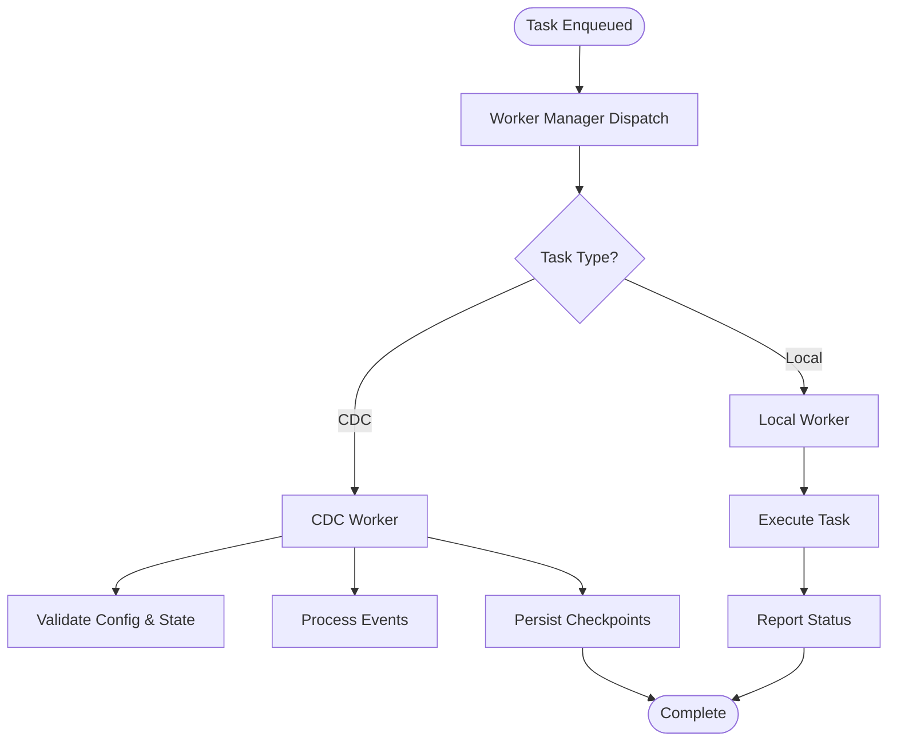
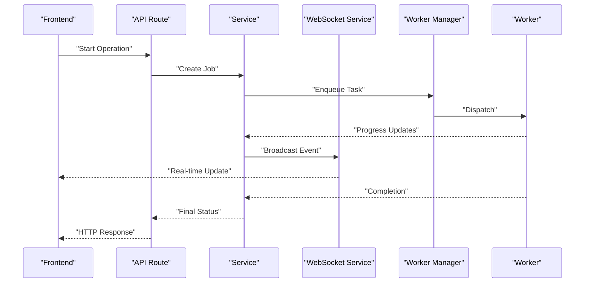
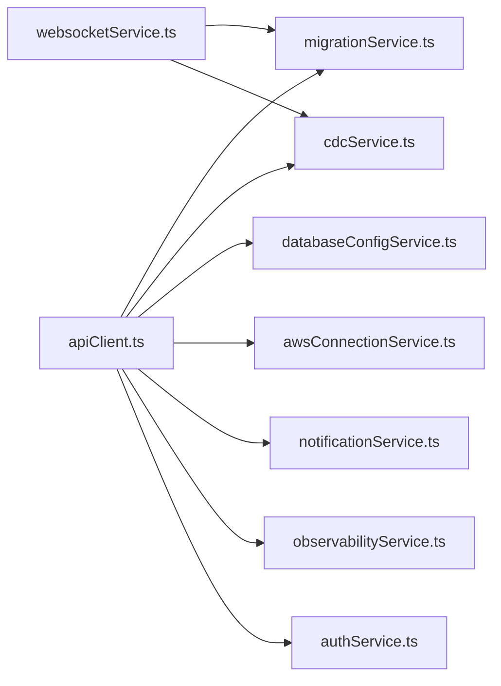
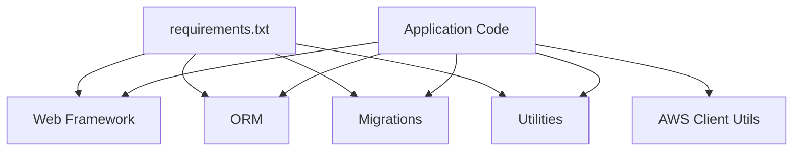

# System Architecture

<cite>
**Referenced Files in This Document**
- [docker-compose.yml](file://docker-compose.yml)
- [backend/run.py](file://backend/run.py)
- [backend/app/config.py](file://backend/app/config.py)
- [backend/app/extensions.py](file://backend/app/extensions.py)
- [backend/app/logging.py](file://backend/app/logging.py)
- [backend/app/errors.py](file://backend/app/errors.py)
- [backend/app/middleware/auth.py](file://backend/app/middleware/auth.py)
- [backend/app/routes/health.py](file://backend/app/routes/health.py)
- [backend/app/routes/auth.py](file://backend/app/routes/auth.py)
- [backend/app/routes/database_config.py](file://backend/app/routes/database_config.py)
- [backend/app/routes/aws_connection.py](file://backend/app/routes/aws_connection.py)
- [backend/app/routes/cdc.py](file://backend/app/routes/cdc.py)
- [backend/app/routes/migration.py](file://backend/app/routes/migration.py)
- [backend/app/routes/migration_engine.py](file://backend/app/routes/migration_engine.py)
- [backend/app/routes/rollback.py](file://backend/app/routes/rollback.py)
- [backend/app/routes/schema_approval.py](file://backend/app/routes/schema_approval.py)
- [backend/app/routes/schema_drift.py](file://backend/app/routes/schema_drift.py)
- [backend/app/routes/notification.py](file://backend/app/routes/notification.py)
- [backend/app/routes/observability.py](file://backend/app/routes/observability.py)
- [backend/app/routes/preflight.py](file://backend/app/routes/preflight.py)
- [backend/app/routes/websocket.py](file://backend/app/routes/websocket.py)
- [backend/app/services/auth_service.py](file://backend/app/services/auth_service.py)
- [backend/app/services/database_config_service.py](file://backend/app/services/database_config_service.py)
- [backend/app/services/aws_connection_service.py](file://backend/app/services/aws_connection_service.py)
- [backend/app/services/cdc_service.py](file://backend/app/services/cdc_service.py)
- [backend/app/services/migration_service.py](file://backend/app/services/migration_service.py)
- [backend/app/services/rollback_service.py](file://backend/app/services/rollback_service.py)
- [backend/app/services/schema_approval_service.py](file://backend/app/services/schema_approval_service.py)
- [backend/app/services/schema_drift_service.py](file://backend/app/services/schema_drift_service.py)
- [backend/app/services/notification_service.py](file://backend/app/services/notification_service.py)
- [backend/app/services/observability_service.py](file://backend/app/services/observability_service.py)
- [backend/app/services/preflight_service.py](file://backend/app/services/preflight_service.py)
- [backend/app/services/cloudformation_service.py](file://backend/app/services/cloudformation_service.py)
- [backend/app/services/secrets_manager_service.py](file://backend/app/services/secrets_manager_service.py)
- [backend/app/services/websocket_service.py](file://backend/app/services/websocket_service.py)
- [backend/app/models/__init__.py](file://backend/app/models/__init__.py)
- [backend/app/models/database_config.py](file://backend/app/models/database_config.py)
- [backend/app/models/aws_connection.py](file://backend/app/models/aws_connection.py)
- [backend/app/models/cdc_config.py](file://backend/app/models/cdc_config.py)
- [backend/app/models/cdc_event.py](file://backend/app/models/cdc_event.py)
- [backend/app/models/migration.py](file://backend/app/models/migration.py)
- [backend/app/models/migration_checkpoint.py](file://backend/app/models/migration_checkpoint.py)
- [backend/app/models/schema_snapshot.py](file://backend/app/models/schema_snapshot.py)
- [backend/app/models/notification.py](file://backend/app/models/notification.py)
- [backend/app/models/audit_log.py](file://backend/app/models/audit_log.py)
- [backend/app/schemas/database_config.py](file://backend/app/schemas/database_config.py)
- [backend/app/schemas/aws_connection.py](file://backend/app/schemas/aws_connection.py)
- [backend/app/schemas/cdc.py](file://backend/app/schemas/cdc.py)
- [backend/app/schemas/migration.py](file://backend/app/schemas/migration.py)
- [backend/app/schemas/schema_drift.py](file://backend/app/schemas/schema_drift.py)
- [backend/app/schemas/notification.py](file://backend/app/schemas/notification.py)
- [backend/app/schemas/auth.py](file://backend/app/schemas/auth.py)
- [backend/app/schemas/secret.py](file://backend/app/schemas/secret.py)
- [backend/app/workers/base_worker.py](file://backend/app/workers/base_worker.py)
- [backend/app/workers/manager.py](file://backend/app/workers/manager.py)
- [backend/app/workers/cdc_worker.py](file://backend/app/workers/cdc_worker.py)
- [backend/app/workers/local_worker.py](file://backend/app/workers/local_worker.py)
- [backend/app/utils/aws_client.py](file://backend/app/utils/aws_client.py)
- [backend/requirements.txt](file://backend/requirements.txt)
- [backend/Dockerfile](file://backend/Dockerfile)
- [frontend/src/services/apiClient.ts](file://frontend/src/services/apiClient.ts)
- [frontend/src/services/websocketService.ts](file://frontend/src/services/websocketService.ts)
- [frontend/src/services/migrationService.ts](file://frontend/src/services/migrationService.ts)
- [frontend/src/services/cdcService.ts](file://frontend/src/services/cdcService.ts)
- [frontend/src/services/databaseConfigService.ts](file://frontend/src/services/databaseConfigService.ts)
- [frontend/src/services/awsConnectionService.ts](file://frontend/src/services/awsConnectionService.ts)
- [frontend/src/services/notificationService.ts](file://frontend/src/services/notificationService.ts)
- [frontend/src/services/observabilityService.ts](file://frontend/src/services/observabilityService.ts)
- [frontend/src/services/authService.ts](file://frontend/src/services/authService.ts)
</cite>

## Table of Contents
1. [Introduction](#introduction)
2. [Project Structure](#project-structure)
3. [Core Components](#core-components)
4. [Architecture Overview](#architecture-overview)
5. [Detailed Component Analysis](#detailed-component-analysis)
6. [Dependency Analysis](#dependency-analysis)
7. [Performance Considerations](#performance-considerations)
8. [Troubleshooting Guide](#troubleshooting-guide)
9. [Conclusion](#conclusion)
10. [Appendices](#appendices)

## Introduction
This document describes CloudBridge’s system architecture and component interactions. It focuses on the microservices-style separation between API, business logic, and data access layers; the worker process architecture for long-running tasks; event-driven communication patterns with external systems; scalability and fault tolerance considerations; deployment topology options; and technology stack decisions including third-party dependencies and compatibility guidance.

## Project Structure
CloudBridge is a full-stack application composed of:
- Backend (Python): REST API, services, models, schemas, workers, middleware, and utilities.
- Frontend (TypeScript/React): UI pages, components, and service clients that call backend APIs and WebSockets.
- Infrastructure: Docker Compose orchestration and container definitions.

```mermaid
graph TB
subgraph "Frontend"
FE_API["apiClient.ts"]
FE_WS["websocketService.ts"]
FE_MIG["migrationService.ts"]
FE_CDC["cdcService.ts"]
FE_DB["databaseConfigService.ts"]
FE_AWS["awsConnectionService.ts"]
FE_NOTIF["notificationService.ts"]
FE_OBS["observabilityService.ts"]
FE_AUTH["authService.ts"]
end
subgraph "Backend API Layer"
R_HEALTH["routes/health.py"]
R_AUTH["routes/auth.py"]
R_DB["routes/database_config.py"]
R_AWS["routes/aws_connection.py"]
R_CDC["routes/cdc.py"]
R_MIG["routes/migration.py"]
R_MIGENG["routes/migration_engine.py"]
R_RB["routes/rollback.py"]
R_APPROVAL["routes/schema_approval.py"]
R_DRIFT["routes/schema_drift.py"]
R_NOTIF["routes/notification.py"]
R_OBS["routes/observability.py"]
R_PREFLIGHT["routes/preflight.py"]
R_WS["routes/websocket.py"]
end
subgraph "Business Logic"
S_AUTH["services/auth_service.py"]
S_DB["services/database_config_service.py"]
S_AWS["services/aws_connection_service.py"]
S_CDC["services/cdc_service.py"]
S_MIG["services/migration_service.py"]
S_RB["services/rollback_service.py"]
S_APPROVAL["services/schema_approval_service.py"]
S_DRIFT["services/schema_drift_service.py"]
S_NOTIF["services/notification_service.py"]
S_OBS["services/observability_service.py"]
S_PREFLIGHT["services/preflight_service.py"]
S_CF["services/cloudformation_service.py"]
S_SM["services/secrets_manager_service.py"]
S_WS["services/websocket_service.py"]
end
subgraph "Data Access"
M_INIT["models/__init__.py"]
M_DB["models/database_config.py"]
M_AWS["models/aws_connection.py"]
M_CDC_CFG["models/cdc_config.py"]
M_CDC_EVT["models/cdc_event.py"]
M_MIG["models/migration.py"]
M_MIG_CP["models/migration_checkpoint.py"]
M_SNAP["models/schema_snapshot.py"]
M_NOTIF["models/notification.py"]
M_AUDIT["models/audit_log.py"]
end
subgraph "Workers"
W_BASE["workers/base_worker.py"]
W_MGR["workers/manager.py"]
W_CDC["workers/cdc_worker.py"]
W_LOCAL["workers/local_worker.py"]
end
subgraph "Utilities"
U_AWS["utils/aws_client.py"]
end
FE_API --> R_HEALTH
FE_API --> R_AUTH
FE_API --> R_DB
FE_API --> R_AWS
FE_API --> R_CDC
FE_API --> R_MIG
FE_API --> R_MIGENG
FE_API --> R_RB
FE_API --> R_APPROVAL
FE_API --> R_DRIFT
FE_API --> R_NOTIF
FE_API --> R_OBS
FE_API --> R_PREFLIGHT
FE_WS --> R_WS
R_AUTH --> S_AUTH
R_DB --> S_DB
R_AWS --> S_AWS
R_CDC --> S_CDC
R_MIG --> S_MIG
R_MIGENG --> S_MIG
R_RB --> S_RB
R_APPROVAL --> S_APPROVAL
R_DRIFT --> S_DRIFT
R_NOTIF --> S_NOTIF
R_OBS --> S_OBS
R_PREFLIGHT --> S_PREFLIGHT
R_WS --> S_WS
S_AUTH --> M_INIT
S_DB --> M_DB
S_AWS --> M_AWS
S_CDC --> M_CDC_CFG
S_CDC --> M_CDC_EVT
S_MIG --> M_MIG
S_MIG --> M_MIG_CP
S_DRIFT --> M_SNAP
S_NOTIF --> M_NOTIF
S_OBS --> M_AUDIT
S_CDC --> W_MGR
W_MGR --> W_CDC
W_MGR --> W_LOCAL
W_CDC --> U_AWS
W_LOCAL --> U_AWS
```

**Diagram sources**
- [backend/run.py](file://backend/run.py)
- [backend/app/routes/health.py](file://backend/app/routes/health.py)
- [backend/app/routes/auth.py](file://backend/app/routes/auth.py)
- [backend/app/routes/database_config.py](file://backend/app/routes/database_config.py)
- [backend/app/routes/aws_connection.py](file://backend/app/routes/aws_connection.py)
- [backend/app/routes/cdc.py](file://backend/app/routes/cdc.py)
- [backend/app/routes/migration.py](file://backend/app/routes/migration.py)
- [backend/app/routes/migration_engine.py](file://backend/app/routes/migration_engine.py)
- [backend/app/routes/rollback.py](file://backend/app/routes/rollback.py)
- [backend/app/routes/schema_approval.py](file://backend/app/routes/schema_approval.py)
- [backend/app/routes/schema_drift.py](file://backend/app/routes/schema_drift.py)
- [backend/app/routes/notification.py](file://backend/app/routes/notification.py)
- [backend/app/routes/observability.py](file://backend/app/routes/observability.py)
- [backend/app/routes/preflight.py](file://backend/app/routes/preflight.py)
- [backend/app/routes/websocket.py](file://backend/app/routes/websocket.py)
- [backend/app/services/auth_service.py](file://backend/app/services/auth_service.py)
- [backend/app/services/database_config_service.py](file://backend/app/services/database_config_service.py)
- [backend/app/services/aws_connection_service.py](file://backend/app/services/aws_connection_service.py)
- [backend/app/services/cdc_service.py](file://backend/app/services/cdc_service.py)
- [backend/app/services/migration_service.py](file://backend/app/services/migration_service.py)
- [backend/app/services/rollback_service.py](file://backend/app/services/rollback_service.py)
- [backend/app/services/schema_approval_service.py](file://backend/app/services/schema_approval_service.py)
- [backend/app/services/schema_drift_service.py](file://backend/app/services/schema_drift_service.py)
- [backend/app/services/notification_service.py](file://backend/app/services/notification_service.py)
- [backend/app/services/observability_service.py](file://backend/app/services/observability_service.py)
- [backend/app/services/preflight_service.py](file://backend/app/services/preflight_service.py)
- [backend/app/services/cloudformation_service.py](file://backend/app/services/cloudformation_service.py)
- [backend/app/services/secrets_manager_service.py](file://backend/app/services/secrets_manager_service.py)
- [backend/app/services/websocket_service.py](file://backend/app/services/websocket_service.py)
- [backend/app/models/__init__.py](file://backend/app/models/__init__.py)
- [backend/app/models/database_config.py](file://backend/app/models/database_config.py)
- [backend/app/models/aws_connection.py](file://backend/app/models/aws_connection.py)
- [backend/app/models/cdc_config.py](file://backend/app/models/cdc_config.py)
- [backend/app/models/cdc_event.py](file://backend/app/models/cdc_event.py)
- [backend/app/models/migration.py](file://backend/app/models/migration.py)
- [backend/app/models/migration_checkpoint.py](file://backend/app/models/migration_checkpoint.py)
- [backend/app/models/schema_snapshot.py](file://backend/app/models/schema_snapshot.py)
- [backend/app/models/notification.py](file://backend/app/models/notification.py)
- [backend/app/models/audit_log.py](file://backend/app/models/audit_log.py)
- [backend/app/workers/base_worker.py](file://backend/app/workers/base_worker.py)
- [backend/app/workers/manager.py](file://backend/app/workers/manager.py)
- [backend/app/workers/cdc_worker.py](file://backend/app/workers/cdc_worker.py)
- [backend/app/workers/local_worker.py](file://backend/app/workers/local_worker.py)
- [backend/app/utils/aws_client.py](file://backend/app/utils/aws_client.py)
- [frontend/src/services/apiClient.ts](file://frontend/src/services/apiClient.ts)
- [frontend/src/services/websocketService.ts](file://frontend/src/services/websocketService.ts)
- [frontend/src/services/migrationService.ts](file://frontend/src/services/migrationService.ts)
- [frontend/src/services/cdcService.ts](file://frontend/src/services/cdcService.ts)
- [frontend/src/src/services/databaseConfigService.ts](file://frontend/src/services/databaseConfigService.ts)
- [frontend/src/services/awsConnectionService.ts](file://frontend/src/services/awsConnectionService.ts)
- [frontend/src/services/notificationService.ts](file://frontend/src/services/notificationService.ts)
- [frontend/src/services/observabilityService.ts](file://frontend/src/services/observabilityService.ts)
- [frontend/src/services/authService.ts](file://frontend/src/services/authService.ts)

**Section sources**
- [docker-compose.yml](file://docker-compose.yml)
- [backend/run.py](file://backend/run.py)

## Core Components
- API layer: Route modules define HTTP endpoints and validate requests using Pydantic schemas. They delegate to service functions for business logic.
- Business logic: Service modules encapsulate domain operations, orchestrate data access, and coordinate with external systems (e.g., AWS).
- Data access: SQLAlchemy models represent persistent entities; migrations manage schema evolution.
- Workers: A base worker abstraction and manager orchestrate background jobs such as CDC processing and local task execution.
- Utilities: Shared helpers like AWS client wrappers centralize cloud SDK usage.
- Middleware: Authentication and request/response hooks applied across routes.
- Frontend services: TypeScript clients wrap REST calls and WebSocket connections to provide reactive UI updates.

Key responsibilities by layer:
- API layer: Request validation, response formatting, error mapping, and routing.
- Services: Domain rules, transactional boundaries, integration with external systems, and event publication.
- Models: Entity definitions, relationships, and persistence contracts.
- Workers: Long-running or asynchronous workloads decoupled from request-response cycles.

**Section sources**
- [backend/app/routes/health.py](file://backend/app/routes/health.py)
- [backend/app/routes/auth.py](file://backend/app/routes/auth.py)
- [backend/app/routes/database_config.py](file://backend/app/routes/database_config.py)
- [backend/app/routes/aws_connection.py](file://backend/app/routes/aws_connection.py)
- [backend/app/routes/cdc.py](file://backend/app/routes/cdc.py)
- [backend/app/routes/migration.py](file://backend/app/routes/migration.py)
- [backend/app/routes/migration_engine.py](file://backend/app/routes/migration_engine.py)
- [backend/app/routes/rollback.py](file://backend/app/routes/rollback.py)
- [backend/app/routes/schema_approval.py](file://backend/app/routes/schema_approval.py)
- [backend/app/routes/schema_drift.py](file://backend/app/routes/schema_drift.py)
- [backend/app/routes/notification.py](file://backend/app/routes/notification.py)
- [backend/app/routes/observability.py](file://backend/app/routes/observability.py)
- [backend/app/routes/preflight.py](file://backend/app/routes/preflight.py)
- [backend/app/routes/websocket.py](file://backend/app/routes/websocket.py)
- [backend/app/services/auth_service.py](file://backend/app/services/auth_service.py)
- [backend/app/services/database_config_service.py](file://backend/app/services/database_config_service.py)
- [backend/app/services/aws_connection_service.py](file://backend/app/services/aws_connection_service.py)
- [backend/app/services/cdc_service.py](file://backend/app/services/cdc_service.py)
- [backend/app/services/migration_service.py](file://backend/app/services/migration_service.py)
- [backend/app/services/rollback_service.py](file://backend/app/services/rollback_service.py)
- [backend/app/services/schema_approval_service.py](file://backend/app/services/schema_approval_service.py)
- [backend/app/services/schema_drift_service.py](file://backend/app/services/schema_drift_service.py)
- [backend/app/services/notification_service.py](file://backend/app/services/notification_service.py)
- [backend/app/services/observability_service.py](file://backend/app/services/observability_service.py)
- [backend/app/services/preflight_service.py](file://backend/app/services/preflight_service.py)
- [backend/app/services/cloudformation_service.py](file://backend/app/services/cloudformation_service.py)
- [backend/app/services/secrets_manager_service.py](file://backend/app/services/secrets_manager_service.py)
- [backend/app/services/websocket_service.py](file://backend/app/services/websocket_service.py)
- [backend/app/models/__init__.py](file://backend/app/models/__init__.py)
- [backend/app/models/database_config.py](file://backend/app/models/database_config.py)
- [backend/app/models/aws_connection.py](file://backend/app/models/aws_connection.py)
- [backend/app/models/cdc_config.py](file://backend/app/models/cdc_config.py)
- [backend/app/models/cdc_event.py](file://backend/app/models/cdc_event.py)
- [backend/app/models/migration.py](file://backend/app/models/migration.py)
- [backend/app/models/migration_checkpoint.py](file://backend/app/models/migration_checkpoint.py)
- [backend/app/models/schema_snapshot.py](file://backend/app/models/schema_snapshot.py)
- [backend/app/models/notification.py](file://backend/app/models/notification.py)
- [backend/app/models/audit_log.py](file://backend/app/models/audit_log.py)
- [backend/app/workers/base_worker.py](file://backend/app/workers/base_worker.py)
- [backend/app/workers/manager.py](file://backend/app/workers/manager.py)
- [backend/app/workers/cdc_worker.py](file://backend/app/workers/cdc_worker.py)
- [backend/app/workers/local_worker.py](file://backend/app/workers/local_worker.py)
- [backend/app/utils/aws_client.py](file://backend/app/utils/aws_client.py)
- [backend/app/middleware/auth.py](file://backend/app/middleware/auth.py)
- [backend/app/schemas/database_config.py](file://backend/app/schemas/database_config.py)
- [backend/app/schemas/aws_connection.py](file://backend/app/schemas/aws_connection.py)
- [backend/app/schemas/cdc.py](file://backend/app/schemas/cdc.py)
- [backend/app/schemas/migration.py](file://backend/app/schemas/migration.py)
- [backend/app/schemas/schema_drift.py](file://backend/app/schemas/schema_drift.py)
- [backend/app/schemas/notification.py](file://backend/app/schemas/notification.py)
- [backend/app/schemas/auth.py](file://backend/app/schemas/auth.py)
- [backend/app/schemas/secret.py](file://backend/app/schemas/secret.py)
- [frontend/src/services/apiClient.ts](file://frontend/src/services/apiClient.ts)
- [frontend/src/services/websocketService.ts](file://frontend/src/services/websocketService.ts)
- [frontend/src/services/migrationService.ts](file://frontend/src/services/migrationService.ts)
- [frontend/src/services/cdcService.ts](file://frontend/src/services/cdcService.ts)
- [frontend/src/services/databaseConfigService.ts](file://frontend/src/services/databaseConfigService.ts)
- [frontend/src/services/awsConnectionService.ts](file://frontend/src/services/awsConnectionService.ts)
- [frontend/src/services/notificationService.ts](file://frontend/src/services/notificationService.ts)
- [frontend/src/services/observabilityService.ts](file://frontend/src/services/observabilityService.ts)
- [frontend/src/services/authService.ts](file://frontend/src/services/authService.ts)

## Architecture Overview
CloudBridge follows a layered microservices-style design within a single backend process:
- API layer exposes REST endpoints and a WebSocket endpoint for real-time updates.
- Business logic resides in service modules that implement domain workflows and integrate with external systems.
- Data access uses ORM models and database migrations.
- Worker processes handle long-running tasks asynchronously, coordinated by a worker manager.

**Diagram sources**
- [backend/app/routes/health.py](file://backend/app/routes/health.py)
- [backend/app/routes/websocket.py](file://backend/app/routes/websocket.py)
- [backend/app/services/websocket_service.py](file://backend/app/services/websocket_service.py)
- [backend/app/workers/manager.py](file://backend/app/workers/manager.py)
- [backend/app/workers/cdc_worker.py](file://backend/app/workers/cdc_worker.py)
- [backend/app/workers/local_worker.py](file://backend/app/workers/local_worker.py)
- [backend/app/utils/aws_client.py](file://backend/app/utils/aws_client.py)

## Detailed Component Analysis

### API Layer
- Health check route provides readiness/liveness signals for orchestrators.
- Auth route handles authentication flows and integrates with auth service.
- Resource routes (database configs, AWS connections, CDC, migrations, rollbacks, approvals, drift, notifications, observability, preflight) follow consistent patterns: validate input via schemas, delegate to services, return structured responses.
- WebSocket route enables real-time status streaming for long-running operations.

**Diagram sources**
- [backend/app/routes/health.py](file://backend/app/routes/health.py)
- [backend/app/routes/auth.py](file://backend/app/routes/auth.py)
- [backend/app/routes/database_config.py](file://backend/app/routes/database_config.py)
- [backend/app/routes/aws_connection.py](file://backend/app/routes/aws_connection.py)
- [backend/app/routes/cdc.py](file://backend/app/routes/cdc.py)
- [backend/app/routes/migration.py](file://backend/app/routes/migration.py)
- [backend/app/routes/migration_engine.py](file://backend/app/routes/migration_engine.py)
- [backend/app/routes/rollback.py](file://backend/app/routes/rollback.py)
- [backend/app/routes/schema_approval.py](file://backend/app/routes/schema_approval.py)
- [backend/app/routes/schema_drift.py](file://backend/app/routes/schema_drift.py)
- [backend/app/routes/notification.py](file://backend/app/routes/notification.py)
- [backend/app/routes/observability.py](file://backend/app/routes/observability.py)
- [backend/app/routes/preflight.py](file://backend/app/routes/preflight.py)
- [backend/app/services/auth_service.py](file://backend/app/services/auth_service.py)
- [backend/app/services/database_config_service.py](file://backend/app/services/database_config_service.py)
- [backend/app/services/aws_connection_service.py](file://backend/app/services/aws_connection_service.py)
- [backend/app/services/cdc_service.py](file://backend/app/services/cdc_service.py)
- [backend/app/services/migration_service.py](file://backend/app/services/migration_service.py)
- [backend/app/services/rollback_service.py](file://backend/app/services/rollback_service.py)
- [backend/app/services/schema_approval_service.py](file://backend/app/services/schema_approval_service.py)
- [backend/app/services/schema_drift_service.py](file://backend/app/services/schema_drift_service.py)
- [backend/app/services/notification_service.py](file://backend/app/services/notification_service.py)
- [backend/app/services/observability_service.py](file://backend/app/services/observability_service.py)
- [backend/app/services/preflight_service.py](file://backend/app/services/preflight_service.py)
- [backend/app/models/__init__.py](file://backend/app/models/__init__.py)
- [backend/app/models/database_config.py](file://backend/app/models/database_config.py)
- [backend/app/models/aws_connection.py](file://backend/app/models/aws_connection.py)
- [backend/app/models/cdc_config.py](file://backend/app/models/cdc_config.py)
- [backend/app/models/cdc_event.py](file://backend/app/models/cdc_event.py)
- [backend/app/models/migration.py](file://backend/app/models/migration.py)
- [backend/app/models/migration_checkpoint.py](file://backend/app/models/migration_checkpoint.py)
- [backend/app/models/schema_snapshot.py](file://backend/app/models/schema_snapshot.py)
- [backend/app/models/notification.py](file://backend/app/models/notification.py)
- [backend/app/models/audit_log.py](file://backend/app/models/audit_log.py)

**Section sources**
- [backend/app/routes/health.py](file://backend/app/routes/health.py)
- [backend/app/routes/auth.py](file://backend/app/routes/auth.py)
- [backend/app/routes/database_config.py](file://backend/app/routes/database_config.py)
- [backend/app/routes/aws_connection.py](file://backend/app/routes/aws_connection.py)
- [backend/app/routes/cdc.py](file://backend/app/routes/cdc.py)
- [backend/app/routes/migration.py](file://backend/app/routes/migration.py)
- [backend/app/routes/migration_engine.py](file://backend/app/routes/migration_engine.py)
- [backend/app/routes/rollback.py](file://backend/app/routes/rollback.py)
- [backend/app/routes/schema_approval.py](file://backend/app/routes/schema_approval.py)
- [backend/app/routes/schema_drift.py](file://backend/backend/app/routes/schema_drift.py)
- [backend/app/routes/notification.py](file://backend/app/routes/notification.py)
- [backend/app/routes/observability.py](file://backend/app/routes/observability.py)
- [backend/app/routes/preflight.py](file://backend/app/routes/preflight.py)
- [backend/app/schemas/database_config.py](file://backend/app/schemas/database_config.py)
- [backend/app/schemas/aws_connection.py](file://backend/app/schemas/aws_connection.py)
- [backend/app/schemas/cdc.py](file://backend/app/schemas/cdc.py)
- [backend/app/schemas/migration.py](file://backend/app/schemas/migration.py)
- [backend/app/schemas/schema_drift.py](file://backend/app/schemas/schema_drift.py)
- [backend/app/schemas/notification.py](file://backend/app/schemas/notification.py)
- [backend/app/schemas/auth.py](file://backend/app/schemas/auth.py)
- [backend/app/schemas/secret.py](file://backend/app/schemas/secret.py)

### Business Logic Services
Services implement domain workflows:
- Auth service manages authentication flows.
- Database config and AWS connection services persist and validate configuration entities.
- CDC service coordinates change data capture lifecycle and interacts with workers.
- Migration and rollback services orchestrate migration execution and state management.
- Schema approval and drift services manage schema governance and detection.
- Notification and observability services record events and metrics.
- Preflight service validates prerequisites before operations.
- CloudFormation and secrets manager services integrate with AWS resources and secure storage.
- WebSocket service publishes real-time updates to connected clients.

**Diagram sources**
- [backend/app/services/auth_service.py](file://backend/app/services/auth_service.py)
- [backend/app/services/database_config_service.py](file://backend/app/services/database_config_service.py)
- [backend/app/services/aws_connection_service.py](file://backend/app/services/aws_connection_service.py)
- [backend/app/services/cdc_service.py](file://backend/app/services/cdc_service.py)
- [backend/app/services/migration_service.py](file://backend/app/services/migration_service.py)
- [backend/app/services/rollback_service.py](file://backend/app/services/rollback_service.py)
- [backend/app/services/schema_approval_service.py](file://backend/app/services/schema_approval_service.py)
- [backend/app/services/schema_drift_service.py](file://backend/app/services/schema_drift_service.py)
- [backend/app/services/notification_service.py](file://backend/app/services/notification_service.py)
- [backend/app/services/observability_service.py](file://backend/app/services/observability_service.py)
- [backend/app/services/preflight_service.py](file://backend/app/services/preflight_service.py)
- [backend/app/services/cloudformation_service.py](file://backend/app/services/cloudformation_service.py)
- [backend/app/services/secrets_manager_service.py](file://backend/app/services/secrets_manager_service.py)
- [backend/app/services/websocket_service.py](file://backend/app/services/websocket_service.py)

**Section sources**
- [backend/app/services/auth_service.py](file://backend/app/services/auth_service.py)
- [backend/app/services/database_config_service.py](file://backend/app/services/database_config_service.py)
- [backend/app/services/aws_connection_service.py](file://backend/app/services/aws_connection_service.py)
- [backend/app/services/cdc_service.py](file://backend/app/services/cdc_service.py)
- [backend/app/services/migration_service.py](file://backend/app/services/migration_service.py)
- [backend/app/services/rollback_service.py](file://backend/app/services/rollback_service.py)
- [backend/app/services/schema_approval_service.py](file://backend/app/services/schema_approval_service.py)
- [backend/app/services/schema_drift_service.py](file://backend/app/services/schema_drift_service.py)
- [backend/app/services/notification_service.py](file://backend/app/services/notification_service.py)
- [backend/app/services/observability_service.py](file://backend/app/services/observability_service.py)
- [backend/app/services/preflight_service.py](file://backend/app/services/preflight_service.py)
- [backend/app/services/cloudformation_service.py](file://backend/app/services/cloudformation_service.py)
- [backend/app/services/secrets_manager_service.py](file://backend/app/services/secrets_manager_service.py)
- [backend/app/services/websocket_service.py](file://backend/app/services/websocket_service.py)

### Data Access Layer
- Models define entities for database configurations, AWS connections, CDC configuration/events, migrations, checkpoints, schema snapshots, notifications, and audit logs.
- The models package initializes shared ORM context and metadata.
- Migrations directory contains Alembic configuration and versioned scripts for schema evolution.

**Diagram sources**
- [backend/app/models/database_config.py](file://backend/app/models/database_config.py)
- [backend/app/models/aws_connection.py](file://backend/app/models/aws_connection.py)
- [backend/app/models/cdc_config.py](file://backend/app/models/cdc_config.py)
- [backend/app/models/cdc_event.py](file://backend/app/models/cdc_event.py)
- [backend/app/models/migration.py](file://backend/app/models/migration.py)
- [backend/app/models/migration_checkpoint.py](file://backend/app/models/migration_checkpoint.py)
- [backend/app/models/schema_snapshot.py](file://backend/app/models/schema_snapshot.py)
- [backend/app/models/notification.py](file://backend/app/models/notification.py)
- [backend/app/models/audit_log.py](file://backend/app/models/audit_log.py)
- [backend/app/models/__init__.py](file://backend/app/models/__init__.py)

**Section sources**
- [backend/app/models/__init__.py](file://backend/app/models/__init__.py)
- [backend/app/models/database_config.py](file://backend/app/models/database_config.py)
- [backend/app/models/aws_connection.py](file://backend/app/models/aws_connection.py)
- [backend/app/models/cdc_config.py](file://backend/app/models/cdc_config.py)
- [backend/app/models/cdc_event.py](file://backend/app/models/cdc_event.py)
- [backend/app/models/migration.py](file://backend/app/models/migration.py)
- [backend/app/models/migration_checkpoint.py](file://backend/app/models/migration_checkpoint.py)
- [backend/app/models/schema_snapshot.py](file://backend/app/models/schema_snapshot.py)
- [backend/app/models/notification.py](file://backend/app/models/notification.py)
- [backend/app/models/audit_log.py](file://backend/app/models/audit_log.py)

### Worker Process Architecture
The worker subsystem supports long-running and background tasks:
- Base worker defines common lifecycle and logging behavior.
- Worker manager coordinates job dispatching and lifecycle management.
- CDC worker consumes change events and applies them to target systems.
- Local worker executes ad-hoc tasks locally when needed.

**Diagram sources**
- [backend/app/workers/base_worker.py](file://backend/app/workers/base_worker.py)
- [backend/app/workers/manager.py](file://backend/app/workers/manager.py)
- [backend/app/workers/cdc_worker.py](file://backend/app/workers/cdc_worker.py)
- [backend/app/workers/local_worker.py](file://backend/app/workers/local_worker.py)

**Section sources**
- [backend/app/workers/base_worker.py](file://backend/app/workers/base_worker.py)
- [backend/app/workers/manager.py](file://backend/app/workers/manager.py)
- [backend/app/workers/cdc_worker.py](file://backend/app/workers/cdc_worker.py)
- [backend/app/workers/local_worker.py](file://backend/app/workers/local_worker.py)

### Event-Driven Communication Patterns
- Real-time updates: WebSocket route and service broadcast status changes to frontend clients during long-running operations.
- Background processing: Services enqueue tasks to the worker manager; workers perform work and update persisted state.
- External integrations: Services use AWS client utilities to interact with cloud resources and secrets managers.

**Diagram sources**
- [backend/app/routes/websocket.py](file://backend/app/routes/websocket.py)
- [backend/app/services/websocket_service.py](file://backend/app/services/websocket_service.py)
- [backend/app/workers/manager.py](file://backend/app/workers/manager.py)
- [backend/app/workers/cdc_worker.py](file://backend/app/workers/cdc_worker.py)
- [backend/app/workers/local_worker.py](file://backend/app/workers/local_worker.py)

**Section sources**
- [backend/app/routes/websocket.py](file://backend/app/routes/websocket.py)
- [backend/app/services/websocket_service.py](file://backend/app/services/websocket_service.py)
- [backend/app/workers/manager.py](file://backend/app/workers/manager.py)
- [backend/app/workers/cdc_worker.py](file://backend/app/workers/cdc_worker.py)
- [backend/app/workers/local_worker.py](file://backend/app/workers/local_worker.py)

### Frontend Integration
The frontend uses typed service modules to communicate with the backend:
- apiClient.ts centralizes HTTP calls and error handling.
- websocketService.ts manages real-time connections.
- Feature-specific services (migration, CDC, database config, AWS connection, notification, observability, auth) encapsulate domain APIs.

**Diagram sources**
- [frontend/src/services/apiClient.ts](file://frontend/src/services/apiClient.ts)
- [frontend/src/services/websocketService.ts](file://frontend/src/services/websocketService.ts)
- [frontend/src/services/migrationService.ts](file://frontend/src/services/migrationService.ts)
- [frontend/src/services/cdcService.ts](file://frontend/src/services/cdcService.ts)
- [frontend/src/services/databaseConfigService.ts](file://frontend/src/services/databaseConfigService.ts)
- [frontend/src/services/awsConnectionService.ts](file://frontend/src/services/awsConnectionService.ts)
- [frontend/src/services/notificationService.ts](file://frontend/src/services/notificationService.ts)
- [frontend/src/services/observabilityService.ts](file://frontend/src/services/observabilityService.ts)
- [frontend/src/services/authService.ts](file://frontend/src/services/authService.ts)

**Section sources**
- [frontend/src/services/apiClient.ts](file://frontend/src/services/apiClient.ts)
- [frontend/src/services/websocketService.ts](file://frontend/src/services/websocketService.ts)
- [frontend/src/services/migrationService.ts](file://frontend/src/services/migrationService.ts)
- [frontend/src/services/cdcService.ts](file://frontend/src/services/cdcService.ts)
- [frontend/src/services/databaseConfigService.ts](file://frontend/src/services/databaseConfigService.ts)
- [frontend/src/services/awsConnectionService.ts](file://frontend/src/services/awsConnectionService.ts)
- [frontend/src/services/notificationService.ts](file://frontend/src/services/notificationService.ts)
- [frontend/src/services/observabilityService.ts](file://frontend/src/services/observabilityService.ts)
- [frontend/src/services/authService.ts](file://frontend/src/services/authService.ts)

## Dependency Analysis
CloudBridge’s backend depends on:
- Python packages listed in requirements.txt for web framework, ORM, migrations, and utilities.
- AWS SDK via utils.aws_client for cloud integrations.
- Database migrations managed by Alembic.

**Diagram sources**
- [backend/requirements.txt](file://backend/requirements.txt)
- [backend/app/utils/aws_client.py](file://backend/app/utils/aws_client.py)

**Section sources**
- [backend/requirements.txt](file://backend/requirements.txt)
- [backend/app/utils/aws_client.py](file://backend/app/utils/aws_client.py)

## Performance Considerations
- Stateless API instances behind load balancers enable horizontal scaling.
- Use connection pooling for database access and cache frequently read configurations where appropriate.
- Offload long-running tasks to workers to keep API latency low.
- Stream progress via WebSockets to avoid polling overhead.
- Implement idempotency keys for critical operations to support retries safely.
- Apply pagination and filtering on list endpoints to reduce payload sizes.

[No sources needed since this section provides general guidance]

## Troubleshooting Guide
- Health checks: Use the health route to verify service readiness and liveness.
- Error handling: Centralized error module standardizes responses and codes.
- Logging: Structured logging aids debugging across API, services, and workers.
- Configuration: Environment-based configuration ensures consistent runtime settings.
- Extensions: Shared extensions initialize cross-cutting concerns (e.g., DB, caching).

**Section sources**
- [backend/app/routes/health.py](file://backend/app/routes/health.py)
- [backend/app/errors.py](file://backend/app/errors.py)
- [backend/app/logging.py](file://backend/app/logging.py)
- [backend/app/config.py](file://backend/app/config.py)
- [backend/app/extensions.py](file://backend/app/extensions.py)

## Conclusion
CloudBridge implements a clear separation of concerns across API, business logic, and data access layers, with a robust worker subsystem for background processing and real-time feedback through WebSockets. The architecture supports scalable deployments, fault-tolerant operations, and extensible integrations with AWS services. The frontend provides a cohesive user experience with typed service clients and reactive updates.

[No sources needed since this section summarizes without analyzing specific files]

## Appendices

### Deployment Topology Options
- Single-node development: Run backend and workers in one container; serve frontend via dev server or static build.
- Containerized production: Orchestrate multiple backend replicas and worker pods behind a load balancer; persist state in an external database.
- Kubernetes: Deploy API and workers as separate deployments with autoscaling policies and resource limits.

**Section sources**
- [docker-compose.yml](file://docker-compose.yml)
- [backend/Dockerfile](file://backend/Dockerfile)

### Technology Stack Decisions
- Backend: Python web framework, SQLAlchemy ORM, Alembic migrations, Pydantic schemas, structured logging.
- Frontend: TypeScript/React with Vite, Tailwind CSS, and typed service clients.
- Cloud integrations: AWS SDK via centralized client utility.
- Real-time: WebSocket endpoint for live status updates.

**Section sources**
- [backend/requirements.txt](file://backend/requirements.txt)
- [backend/app/config.py](file://backend/app/config.py)
- [backend/app/extensions.py](file://backend/app/extensions.py)
- [backend/app/logging.py](file://backend/app/logging.py)
- [backend/app/utils/aws_client.py](file://backend/app/utils/aws_client.py)
- [frontend/src/services/apiClient.ts](file://frontend/src/services/apiClient.ts)
- [frontend/src/services/websocketService.ts](file://frontend/src/services/websocketService.ts)