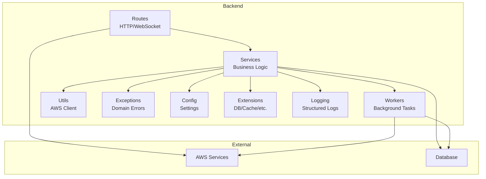
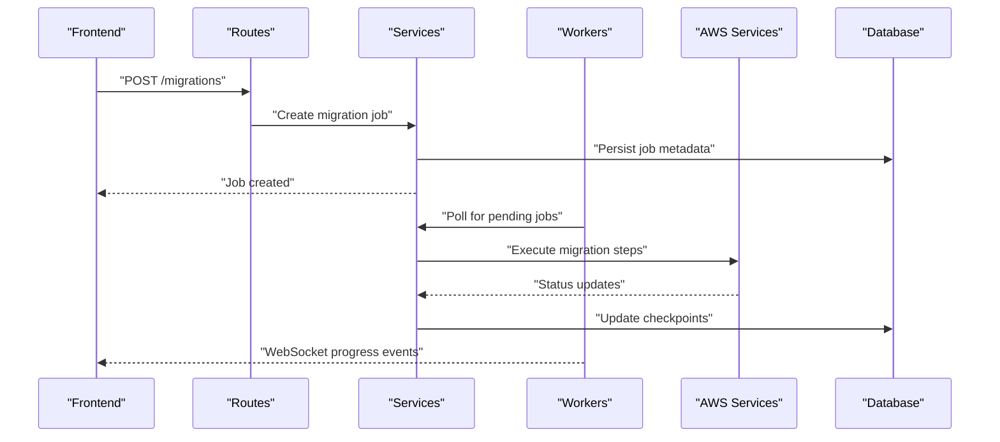
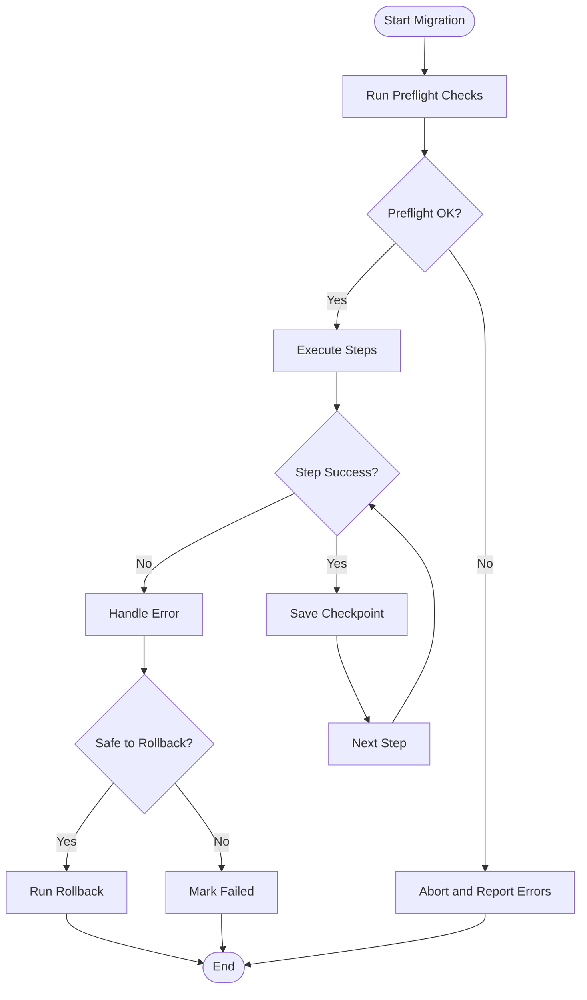
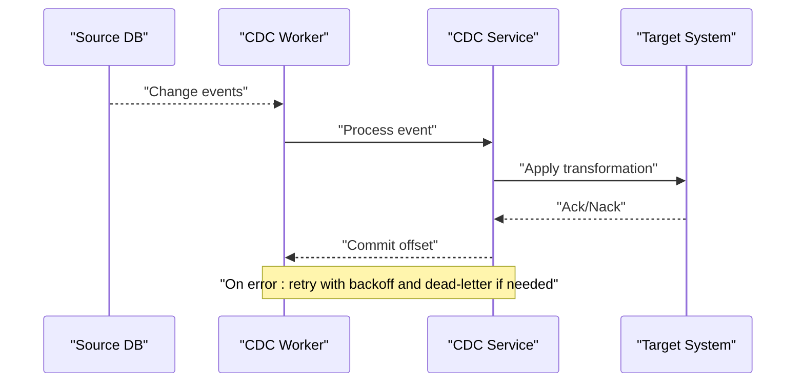
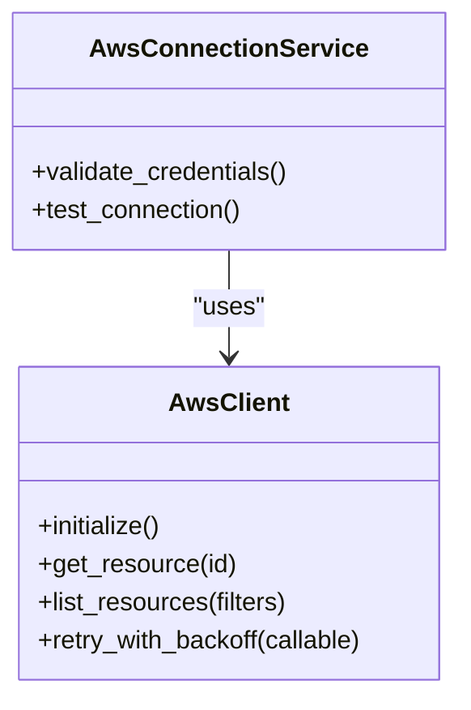
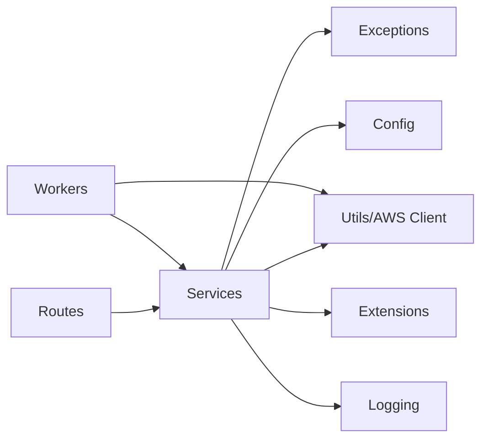

# Troubleshooting Guide

<cite>
**Referenced Files in This Document**
- [errors.py](file://backend/app/errors.py)
- [auth.py](file://backend/app/exceptions/auth.py)
- [aws_connection.py](file://backend/app/exceptions/aws_connection.py)
- [cdc.py](file://backend/app/exceptions/cdc.py)
- [ecs.py](file://backend/app/exceptions/ecs.py)
- [migration.py](file://backend/app/exceptions/migration.py)
- [rollback.py](file://backend/app/exceptions/rollback.py)
- [schema_drift.py](file://backend/app/exceptions/schema_drift.py)
- [schema_approval.py](file://backend/app/exceptions/schema_approval.py)
- [notification.py](file://backend/app/exceptions/notification.py)
- [observability.py](file://backend/app/exceptions/observability.py)
- [logging.py](file://backend/app/logging.py)
- [config.py](file://backend/app/config.py)
- [extensions.py](file://backend/app/extensions.py)
- [run.py](file://backend/run.py)
- [health.py](file://backend/app/routes/health.py)
- [preflight.py](file://backend/app/routes/preflight.py)
- [database_config.py](file://backend/app/routes/database_config.py)
- [aws_connection.py](file://backend/app/routes/aws_connection.py)
- [cdc.py](file://backend/app/routes/cdc.py)
- [migration.py](file://backend/app/routes/migration.py)
- [migration_engine.py](file://backend/app/routes/migration_engine.py)
- [rollback.py](file://backend/app/routes/rollback.py)
- [schema_drift.py](file://backend/app/routes/schema_drift.py)
- [schema_approval.py](file://backend/app/routes/schema_approval.py)
- [observability.py](file://backend/app/routes/observability.py)
- [websocket.py](file://backend/app/routes/websocket.py)
- [auth_service.py](file://backend/app/services/auth_service.py)
- [aws_connection_service.py](file://backend/app/services/aws_connection_service.py)
- [cdc_service.py](file://backend/app/services/cdc_service.py)
- [database_config_service.py](file://backend/app/services/database_config_service.py)
- [ecs_service.py](file://backend/app/services/ecs_service.py)
- [migration_service.py](file://backend/app/services/migration_service.py)
- [rollback_service.py](file://backend/app/services/rollback_service.py)
- [schema_drift_service.py](file://backend/app/services/schema_drift_service.py)
- [schema_approval_service.py](file://backend/app/services/schema_approval_service.py)
- [secrets_manager_service.py](file://backend/app/services/secrets_manager_service.py)
- [cloudformation_service.py](file://backend/app/services/cloudformation_service.py)
- [websocket_service.py](file://backend/app/services/websocket_service.py)
- [base_worker.py](file://backend/app/workers/base_worker.py)
- [cdc_worker.py](file://backend/app/workers/cdc_worker.py)
- [local_worker.py](file://backend/app/workers/local_worker.py)
- [manager.py](file://backend/app/workers/manager.py)
- [aws_client.py](file://backend/app/utils/aws_client.py)
- [README.md](file://backend/README.md)
- [docker-compose.yml](file://docker-compose.yml)
</cite>

## Table of Contents
1. [Introduction](#introduction)
2. [Project Structure](#project-structure)
3. [Core Components](#core-components)
4. [Architecture Overview](#architecture-overview)
5. [Detailed Component Analysis](#detailed-component-analysis)
6. [Dependency Analysis](#dependency-analysis)
7. [Performance Considerations](#performance-considerations)
8. [Troubleshooting Guide](#troubleshooting-guide)
9. [Conclusion](#conclusion)
10. [Appendices](#appendices)

## Introduction
This guide provides systematic troubleshooting for CloudBridge, focusing on migration failures, CDC sync issues, and AWS integration problems. It covers error codes and exception types across components, diagnostic techniques, log analysis, performance profiling, memory leak detection, connectivity and authentication issues, known limitations, workarounds, upgrade considerations, and support resources.

## Project Structure
CloudBridge is a modular backend with clear separation between routes (API endpoints), services (business logic), workers (background tasks), exceptions (domain-specific errors), utilities, configuration, and observability. The frontend is decoupled and communicates via REST/WebSocket APIs.

**Diagram sources**
- [run.py:1-200](file://backend/run.py#L1-L200)
- [config.py:1-200](file://backend/app/config.py#L1-L200)
- [extensions.py:1-200](file://backend/app/extensions.py#L1-L200)
- [logging.py:1-200](file://backend/app/logging.py#L1-L200)
- [aws_client.py:1-200](file://backend/app/utils/aws_client.py#L1-L200)

**Section sources**
- [README.md:1-200](file://backend/README.md#L1-L200)
- [docker-compose.yml:1-200](file://docker-compose.yml#L1-L200)

## Core Components
- Error handling layer: Centralized domain exceptions and HTTP error mapping ensure consistent responses and actionable diagnostics.
- Logging and observability: Structured logs, health checks, and metrics enable fast triage.
- Workers: Background jobs for CDC and migrations run independently from the API server.
- AWS integration: Shared client utilities and service abstractions encapsulate AWS SDK usage and retries.

Key responsibilities:
- Exceptions define error codes and messages per domain.
- Services orchestrate flows and translate low-level errors into domain exceptions.
- Routes validate inputs and return standardized error responses.
- Workers handle long-running tasks with retry and checkpointing where applicable.

**Section sources**
- [errors.py:1-200](file://backend/app/errors.py#L1-L200)
- [logging.py:1-200](file://backend/app/logging.py#L1-L200)
- [health.py:1-200](file://backend/app/routes/health.py#L1-L200)
- [observability.py:1-200](file://backend/app/routes/observability.py#L1-L200)

## Architecture Overview
The system exposes REST endpoints for configuration, migrations, CDC, ECS, approvals, and drift detection. Background workers process CDC events and migrations. AWS clients are reused across services to minimize overhead.

**Diagram sources**
- [migration.py:1-200](file://backend/app/routes/migration.py#L1-L200)
- [migration_engine.py:1-200](file://backend/app/routes/migration_engine.py#L1-L200)
- [migration_service.py:1-200](file://backend/app/services/migration_service.py#L1-L200)
- [cdc_worker.py:1-200](file://backend/app/workers/cdc_worker.py#L1-L200)
- [websocket.py:1-200](file://backend/app/routes/websocket.py#L1-L200)

## Detailed Component Analysis

### Exception Taxonomy and Error Codes
CloudBridge organizes exceptions by domain. Each module defines specific error classes with stable codes and human-readable messages. Use these codes to map symptoms to root causes.

- Authentication
  - Typical errors: invalid credentials, expired tokens, insufficient permissions.
  - Where defined: [auth.py](file://backend/app/exceptions/auth.py)
- AWS Integration
  - Typical errors: invalid credentials, missing permissions, throttling, resource not found.
  - Where defined: [aws_connection.py](file://backend/app/exceptions/aws_connection.py)
- CDC
  - Typical errors: source DB changes disabled, replication lag, event parsing failure.
  - Where defined: [cdc.py](file://backend/app/exceptions/cdc.py)
- ECS
  - Typical errors: task definition mismatch, IAM permissions, network ACLs.
  - Where defined: [ecs.py](file://backend/app/exceptions/ecs.py)
- Migration
  - Typical errors: schema conflict, rollback failure, migration step timeout.
  - Where defined: [migration.py](file://backend/app/exceptions/migration.py)
- Rollback
  - Typical errors: no prior snapshot, partial rollback state.
  - Where defined: [rollback.py](file://backend/app/exceptions/rollback.py)
- Schema Drift
  - Typical errors: untracked changes, incompatible diffs.
  - Where defined: [schema_drift.py](file://backend/app/exceptions/schema_drift.py)
- Schema Approval
  - Typical errors: approval policy violation, missing approver.
  - Where defined: [schema_approval.py](file://backend/app/exceptions/schema_approval.py)
- Notification
  - Typical errors: delivery failure, template rendering error.
  - Where defined: [notification.py](file://backend/app/exceptions/notification.py)
- Observability
  - Typical errors: metric export failure, tracing context loss.
  - Where defined: [observability.py](file://backend/app/exceptions/observability.py)

Common patterns:
- All exceptions expose a stable code string and optional context payload.
- Services catch low-level SDK/runtime errors and raise domain exceptions.
- Routes convert domain exceptions into HTTP responses with consistent structure.

**Section sources**
- [auth.py:1-200](file://backend/app/exceptions/auth.py#L1-L200)
- [aws_connection.py:1-200](file://backend/app/exceptions/aws_connection.py#L1-L200)
- [cdc.py:1-200](file://backend/app/exceptions/cdc.py#L1-L200)
- [ecs.py:1-200](file://backend/app/exceptions/ecs.py#L1-L200)
- [migration.py:1-200](file://backend/app/exceptions/migration.py#L1-L200)
- [rollback.py:1-200](file://backend/app/exceptions/rollback.py#L1-L200)
- [schema_drift.py:1-200](file://backend/app/exceptions/schema_drift.py#L1-L200)
- [schema_approval.py:1-200](file://backend/app/exceptions/schema_approval.py#L1-L200)
- [notification.py:1-200](file://backend/app/exceptions/notification.py#L1-L200)
- [observability.py:1-200](file://backend/app/exceptions/observability.py#L1-L200)

### Migration Failures
Symptoms:
- Job stuck or repeatedly failing.
- Rollback fails after partial execution.
- Schema conflicts detected during preflight.

Diagnostic approach:
- Inspect migration job status and checkpoints.
- Review migration engine logs for step-level failures.
- Validate database connectivity and permissions.
- Confirm preflight results and drift reports.

Resolution strategies:
- Fix schema conflicts before re-running.
- Ensure idempotent migration steps.
- Use rollback only when safe; verify snapshots exist.

**Diagram sources**
- [migration.py:1-200](file://backend/app/routes/migration.py#L1-L200)
- [migration_engine.py:1-200](file://backend/app/routes/migration_engine.py#L1-L200)
- [migration_service.py:1-200](file://backend/app/services/migration_service.py#L1-L200)
- [rollback.py:1-200](file://backend/app/routes/rollback.py#L1-L200)
- [preflight.py:1-200](file://backend/app/routes/preflight.py#L1-L200)

**Section sources**
- [migration.py:1-200](file://backend/app/routes/migration.py#L1-L200)
- [migration_engine.py:1-200](file://backend/app/routes/migration_engine.py#L1-L200)
- [migration_service.py:1-200](file://backend/app/services/migration_service.py#L1-L200)
- [rollback.py:1-200](file://backend/app/routes/rollback.py#L1-L200)
- [preflight.py:1-200](file://backend/app/routes/preflight.py#L1-L200)

### CDC Sync Issues
Symptoms:
- No events consumed or high lag.
- Frequent consumer restarts.
- Parsing errors for change events.

Diagnostic approach:
- Verify source database CDC settings and permissions.
- Check worker health and backoff behavior.
- Inspect event queue and storage availability.
- Correlate timestamps to identify lag spikes.

Resolution strategies:
- Enable required replication features on the source.
- Tune consumer concurrency and batch sizes.
- Handle malformed events gracefully and alert.

**Diagram sources**
- [cdc.py:1-200](file://backend/app/routes/cdc.py#L1-L200)
- [cdc_service.py:1-200](file://backend/app/services/cdc_service.py#L1-L200)
- [cdc_worker.py:1-200](file://backend/app/workers/cdc_worker.py#L1-L200)

**Section sources**
- [cdc.py:1-200](file://backend/app/routes/cdc.py#L1-L200)
- [cdc_service.py:1-200](file://backend/app/services/cdc_service.py#L1-L200)
- [cdc_worker.py:1-200](file://backend/app/workers/cdc_worker.py#L1-L200)

### AWS Integration Problems
Symptoms:
- 403/401 responses from AWS.
- Throttling or rate limit errors.
- Resource not found or permission denied.

Diagnostic approach:
- Validate AWS credentials and region configuration.
- Check IAM policies for required actions.
- Inspect shared AWS client initialization and retry/backoff settings.
- Monitor AWS-side metrics and CloudTrail for denied calls.

Resolution strategies:
- Attach least-privilege policies.
- Implement exponential backoff and jitter.
- Cache clients and reuse connections.

**Diagram sources**
- [aws_client.py:1-200](file://backend/app/utils/aws_client.py#L1-L200)
- [aws_connection_service.py:1-200](file://backend/app/services/aws_connection_service.py#L1-L200)
- [aws_connection.py:1-200](file://backend/app/routes/aws_connection.py#L1-L200)

**Section sources**
- [aws_client.py:1-200](file://backend/app/utils/aws_client.py#L1-L200)
- [aws_connection_service.py:1-200](file://backend/app/services/aws_connection_service.py#L1-L200)
- [aws_connection.py:1-200](file://backend/app/routes/aws_connection.py#L1-L200)

### ECS Task Execution Issues
Symptoms:
- Task fails to start or stops immediately.
- Missing environment variables or secrets.
- Network ACLs blocking outbound calls.

Diagnostic approach:
- Inspect task definitions and container images.
- Verify IAM roles and VPC networking.
- Check ECS service logs and CloudWatch streams.

Resolution strategies:
- Align task role with required permissions.
- Inject secrets via secure managers.
- Adjust security groups and NACLs.

**Section sources**
- [ecs.py:1-200](file://backend/app/exceptions/ecs.py#L1-L200)
- [ecs_service.py:1-200](file://backend/app/services/ecs_service.py#L1-L200)

### Database Connectivity and Configuration
Symptoms:
- Connection refused or timeouts.
- Authentication failures.
- Schema mismatches.

Diagnostic approach:
- Validate connection strings and credentials.
- Test reachability and TLS settings.
- Compare expected schema versions.

Resolution strategies:
- Correct DNS and firewall rules.
- Rotate credentials securely.
- Run migrations in controlled order.

**Section sources**
- [database_config.py:1-200](file://backend/app/routes/database_config.py#L1-L200)
- [database_config_service.py:1-200](file://backend/app/services/database_config_service.py#L1-L200)

### Authentication and Authorization Failures
Symptoms:
- Login rejected or token expired.
- Forbidden access to protected endpoints.

Diagnostic approach:
- Verify identity provider configuration.
- Check token scopes and user roles.
- Inspect middleware validation flow.

Resolution strategies:
- Refresh tokens and re-authenticate.
- Update RBAC policies.
- Ensure time synchronization.

**Section sources**
- [auth.py:1-200](file://backend/app/exceptions/auth.py#L1-L200)
- [auth_service.py:1-200](file://backend/app/services/auth_service.py#L1-L200)

### Schema Drift and Approvals
Symptoms:
- Unapproved changes detected.
- Approval workflow blocked.

Diagnostic approach:
- Review drift report details.
- Validate approval policies and approvers.

Resolution strategies:
- Create migration to reconcile drift.
- Obtain necessary approvals.

**Section sources**
- [schema_drift.py:1-200](file://backend/app/routes/schema_drift.py#L1-L200)
- [schema_drift_service.py:1-200](file://backend/app/services/schema_drift_service.py#L1-L200)
- [schema_approval.py:1-200](file://backend/app/routes/schema_approval.py#L1-L200)
- [schema_approval_service.py:1-200](file://backend/app/services/schema_approval_service.py#L1-L200)

### Notifications and Observability
Symptoms:
- Alerts not delivered.
- Metrics/traces incomplete.

Diagnostic approach:
- Check notification channels and templates.
- Validate exporters and sampling rates.

Resolution strategies:
- Fix channel credentials and endpoints.
- Increase retention and sampling as needed.

**Section sources**
- [notification.py:1-200](file://backend/app/exceptions/notification.py#L1-L200)
- [observability.py:1-200](file://backend/app/routes/observability.py#L1-L200)
- [observability_service.py:1-200](file://backend/app/services/observability_service.py#L1-L200)

## Dependency Analysis
High-level dependencies among core modules:

**Diagram sources**
- [run.py:1-200](file://backend/run.py#L1-L200)
- [config.py:1-200](file://backend/app/config.py#L1-L200)
- [extensions.py:1-200](file://backend/app/extensions.py#L1-L200)
- [logging.py:1-200](file://backend/app/logging.py#L1-L200)
- [aws_client.py:1-200](file://backend/app/utils/aws_client.py#L1-L200)

**Section sources**
- [run.py:1-200](file://backend/run.py#L1-L200)
- [config.py:1-200](file://backend/app/config.py#L1-L200)
- [extensions.py:1-200](file://backend/app/extensions.py#L1-L200)
- [logging.py:1-200](file://backend/app/logging.py#L1-L200)
- [aws_client.py:1-200](file://backend/app/utils/aws_client.py#L1-L200)

## Performance Considerations
- Reuse AWS clients and connections to reduce latency.
- Tune worker concurrency and batch sizes for CDC throughput.
- Use pagination and filtering for large resource lists.
- Apply exponential backoff and jitter for external calls.
- Profile hot paths using structured logs and metrics.
- Monitor memory usage and GC pauses; consider streaming large payloads.

[No sources needed since this section provides general guidance]

## Troubleshooting Guide

### Log Analysis Techniques
- Collect application logs with correlation IDs for requests and jobs.
- Filter by component (routes, services, workers) and severity.
- Track key events: job creation, step execution, checkpoints, rollbacks, CDC offsets.
- Correlate with AWS CloudTrail and CloudWatch for external failures.

**Section sources**
- [logging.py:1-200](file://backend/app/logging.py#L1-L200)
- [health.py:1-200](file://backend/app/routes/health.py#L1-L200)

### Health and Readiness Checks
- Use health endpoints to verify service readiness and dependency status.
- Integrate liveness/readiness probes in orchestrators.

**Section sources**
- [health.py:1-200](file://backend/app/routes/health.py#L1-L200)

### Debugging Migration Failures
- Inspect job status and checkpoints.
- Review step-level logs and error codes.
- Validate preflight results and schema compatibility.
- If partial, evaluate rollback safety and execute rollback.

**Section sources**
- [migration.py:1-200](file://backend/app/routes/migration.py#L1-L200)
- [migration_engine.py:1-200](file://backend/app/routes/migration_engine.py#L1-L200)
- [migration_service.py:1-200](file://backend/app/services/migration_service.py#L1-L200)
- [rollback.py:1-200](file://backend/app/routes/rollback.py#L1-L200)
- [preflight.py:1-200](file://backend/app/routes/preflight.py#L1-L200)

### Debugging CDC Sync Issues
- Verify source CDC configuration and permissions.
- Check worker health and backoff behavior.
- Inspect event processing logs and offsets.
- Monitor lag and throughput metrics.

**Section sources**
- [cdc.py:1-200](file://backend/app/routes/cdc.py#L1-L200)
- [cdc_service.py:1-200](file://backend/app/services/cdc_service.py#L1-L200)
- [cdc_worker.py:1-200](file://backend/app/workers/cdc_worker.py#L1-L200)

### Debugging AWS Integration Problems
- Validate credentials, regions, and IAM policies.
- Inspect AWS client initialization and retry settings.
- Review throttling and quota limits.
- Use CloudTrail to trace denied operations.

**Section sources**
- [aws_connection_service.py:1-200](file://backend/app/services/aws_connection_service.py#L1-L200)
- [aws_client.py:1-200](file://backend/app/utils/aws_client.py#L1-L200)
- [aws_connection.py:1-200](file://backend/app/routes/aws_connection.py#L1-L200)

### Network Connectivity Issues
- Confirm DNS resolution and firewall rules.
- Validate TLS certificates and cipher suites.
- Test endpoint reachability from the host running CloudBridge.

**Section sources**
- [database_config.py:1-200](file://backend/app/routes/database_config.py#L1-L200)
- [database_config_service.py:1-200](file://backend/app/services/database_config_service.py#L1-L200)

### Database Connection Problems
- Validate connection strings, usernames, and passwords.
- Check database version compatibility and schema state.
- Ensure sufficient connection pool capacity.

**Section sources**
- [database_config.py:1-200](file://backend/app/routes/database_config.py#L1-L200)
- [database_config_service.py:1-200](file://backend/app/services/database_config_service.py#L1-L200)

### Authentication Failures
- Verify identity provider configuration and token validity.
- Check user roles and permissions.
- Ensure clock skew is within acceptable bounds.

**Section sources**
- [auth_service.py:1-200](file://backend/app/services/auth_service.py#L1-L200)
- [auth.py:1-200](file://backend/app/exceptions/auth.py#L1-L200)

### WebSocket and Real-time Updates
- Confirm WebSocket endpoint availability and CORS settings.
- Inspect connection lifecycle and error frames.

**Section sources**
- [websocket.py:1-200](file://backend/app/routes/websocket.py#L1-L200)
- [websocket_service.py:1-200](file://backend/app/services/websocket_service.py#L1-L200)

### Performance Profiling Tools
- Enable structured logging and metrics collection.
- Use built-in health and observability endpoints.
- Profile CPU and memory hotspots in workers and services.

**Section sources**
- [observability.py:1-200](file://backend/app/routes/observability.py#L1-L200)
- [observability_service.py:1-200](file://backend/app/services/observability_service.py#L1-L200)

### Memory Leak Detection Methods
- Monitor heap growth and GC frequency.
- Capture profiles under load and compare baselines.
- Investigate long-lived references in workers and caches.

[No sources needed since this section provides general guidance]

### Known Limitations and Workarounds
- External service quotas may cause transient failures; implement retries and backoff.
- Large datasets may require batching and streaming to avoid memory pressure.
- Some AWS features require additional account setup; consult AWS documentation.

[No sources needed since this section provides general guidance]

### Upgrade Considerations
- Review migration scripts and schema changes.
- Validate backward compatibility of API contracts.
- Test upgrades in staging with representative data.

**Section sources**
- [migration.py:1-200](file://backend/app/routes/migration.py#L1-L200)
- [migration_engine.py:1-200](file://backend/app/routes/migration_engine.py#L1-L200)

### Community Support Resources and Escalation Paths
- Consult project README and documentation for setup and usage.
- Open issues with reproducible steps, logs, and environment details.
- For critical incidents, escalate with impact assessment and mitigation steps.

**Section sources**
- [README.md:1-200](file://backend/README.md#L1-L200)

## Conclusion
Use this guide to systematically diagnose and resolve common CloudBridge issues. Leverage domain-specific exceptions, structured logs, health checks, and observability endpoints. Apply the provided workflows for migrations, CDC, and AWS integrations, and follow best practices for performance and reliability.

[No sources needed since this section summarizes without analyzing specific files]

## Appendices

### Quick Reference: Where to Look
- Errors and exceptions: [errors.py](file://backend/app/errors.py), [exceptions/*](file://backend/app/exceptions/)
- Logging and health: [logging.py](file://backend/app/logging.py), [health.py](file://backend/app/routes/health.py)
- AWS integration: [aws_client.py](file://backend/app/utils/aws_client.py), [aws_connection_service.py](file://backend/app/services/aws_connection_service.py)
- Migrations and rollbacks: [migration.py](file://backend/app/routes/migration.py), [rollback.py](file://backend/app/routes/rollback.py)
- CDC: [cdc.py](file://backend/app/routes/cdc.py), [cdc_worker.py](file://backend/app/workers/cdc_worker.py)
- ECS: [ecs_service.py](file://backend/app/services/ecs_service.py)
- Database config: [database_config.py](file://backend/app/routes/database_config.py)
- Auth: [auth_service.py](file://backend/app/services/auth_service.py)
- Observability: [observability.py](file://backend/app/routes/observability.py)
- WebSockets: [websocket.py](file://backend/app/routes/websocket.py)

**Section sources**
- [errors.py:1-200](file://backend/app/errors.py#L1-L200)
- [logging.py:1-200](file://backend/app/logging.py#L1-L200)
- [health.py:1-200](file://backend/app/routes/health.py#L1-L200)
- [aws_client.py:1-200](file://backend/app/utils/aws_client.py#L1-L200)
- [aws_connection_service.py:1-200](file://backend/app/services/aws_connection_service.py#L1-L200)
- [migration.py:1-200](file://backend/app/routes/migration.py#L1-L200)
- [rollback.py:1-200](file://backend/app/routes/rollback.py#L1-L200)
- [cdc.py:1-200](file://backend/app/routes/cdc.py#L1-L200)
- [cdc_worker.py:1-200](file://backend/app/workers/cdc_worker.py#L1-L200)
- [ecs_service.py:1-200](file://backend/app/services/ecs_service.py#L1-L200)
- [database_config.py:1-200](file://backend/app/routes/database_config.py#L1-L200)
- [auth_service.py:1-200](file://backend/app/services/auth_service.py#L1-L200)
- [observability.py:1-200](file://backend/app/routes/observability.py#L1-L200)
- [websocket.py:1-200](file://backend/app/routes/websocket.py#L1-L200)